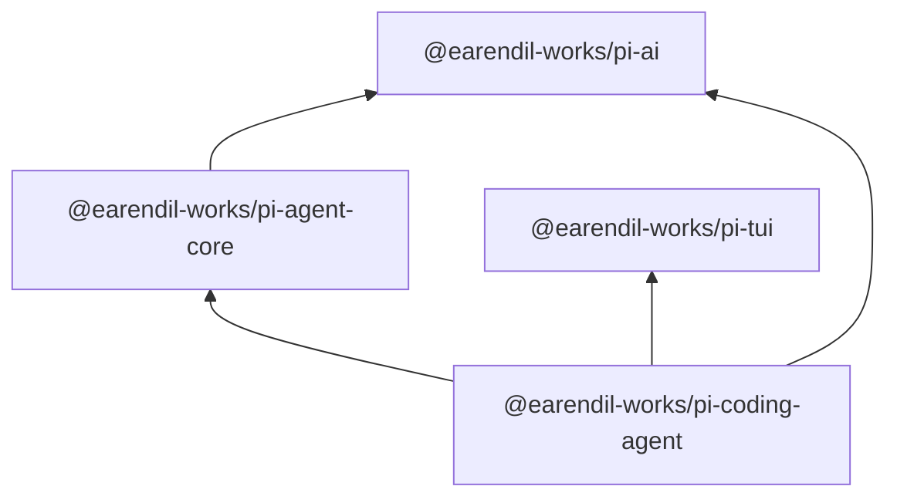
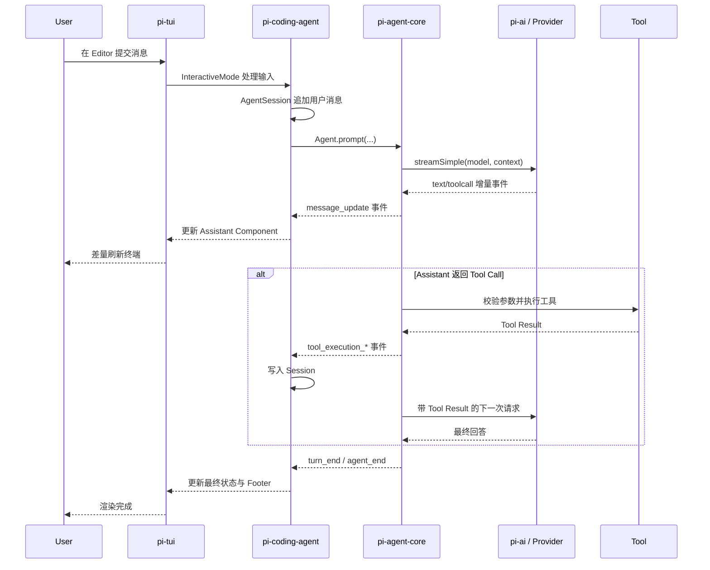

# Pi Agent 深度探索（五）：Monorepo 全景与四个核心包

> [!info] 源码基线
> 本文校验于 2026-06-12，基于 `earendil-works/pi` 的 `main` 分支提交
> `1da903983ad72c60995507e813a00bb2bd6faf09`。该快照的四个核心包版本均为 `0.79.1`。

## 先看依赖方向

Pi Monorepo 的核心依赖关系并不复杂：



从 `package.json` 可以直接验证：

- `pi-agent-core` 依赖 `pi-ai`；
- `pi-coding-agent` 依赖 `pi-agent-core`、`pi-ai` 和 `pi-tui`；
- `pi-tui` 不依赖 Agent 或模型包；
- `pi-ai` 不依赖 Coding Agent 或 TUI。

来源：

- [`pi-ai/package.json`](https://github.com/earendil-works/pi/blob/1da903983ad72c60995507e813a00bb2bd6faf09/packages/ai/package.json)
- [`pi-agent-core/package.json`](https://github.com/earendil-works/pi/blob/1da903983ad72c60995507e813a00bb2bd6faf09/packages/agent/package.json)
- [`pi-tui/package.json`](https://github.com/earendil-works/pi/blob/1da903983ad72c60995507e813a00bb2bd6faf09/packages/tui/package.json)
- [`pi-coding-agent/package.json`](https://github.com/earendil-works/pi/blob/1da903983ad72c60995507e813a00bb2bd6faf09/packages/coding-agent/package.json)

## 一张职责表

| 包                | 负责什么                                             | 不负责什么                                |
| ----------------- | ---------------------------------------------------- | ----------------------------------------- |
| `pi-ai`           | 模型目录、Provider API、统一消息类型、流式事件       | Agent 循环、Session、文件工具、终端 UI    |
| `pi-agent-core`   | Agent 状态、Turn 循环、Tool Call、队列、生命周期事件 | Coding 项目配置、持久化 Session、默认 TUI |
| `pi-tui`          | 终端组件、键盘输入、焦点、Overlay、差量渲染          | 模型请求、工具执行、Session 语义          |
| `pi-coding-agent` | CLI、SDK、认证、模型解析、Session、工具、扩展与模式  | Provider 底层协议和通用终端渲染算法       |

职责边界的价值在于：可以只复用需要的一层，而不是必须把完整 `pi` CLI 嵌入应用。

## `pi-ai`：模型与协议边界

`pi-ai` 提供统一的模型抽象。上层不需要直接面对每个 Provider SDK 的消息格式和流式协议。

核心概念包括：

- `Model`：Provider、API 类型、Context Window、成本等模型元数据；
- `Context`：System Prompt、Message 和 Tool；
- `Message`：User、Assistant、Tool Result；
- `stream()` / `complete()`：使用 Provider 原生选项；
- `streamSimple()` / `completeSimple()`：统一 reasoning 等常用选项；
- `AssistantMessageEventStream`：流式文本、Thinking、Tool Call 和终止事件；
- Provider Registry：按 `model.api` 找到具体协议实现。

其核心分发路径非常短：

```text
Model.api
  -> getApiProvider(api)
  -> provider.streamSimple(...)
  -> AssistantMessageEventStream
```

`pi-ai` 只生成 Tool Call，并不替你执行工具。工具的实际执行循环属于 `pi-agent-core`。

源码入口：

- [`stream.ts`](https://github.com/earendil-works/pi/blob/1da903983ad72c60995507e813a00bb2bd6faf09/packages/ai/src/stream.ts)
- [`types.ts`](https://github.com/earendil-works/pi/blob/1da903983ad72c60995507e813a00bb2bd6faf09/packages/ai/src/types.ts)
- [`api-registry.ts`](https://github.com/earendil-works/pi/blob/1da903983ad72c60995507e813a00bb2bd6faf09/packages/ai/src/api-registry.ts)

## `pi-agent-core`：把模型调用变成 Agent

`pi-agent-core` 建立在 `pi-ai` 之上，增加：

- 有状态的 `Agent`；
- `AgentMessage` 到 LLM `Message` 的转换边界；
- Tool 参数校验和执行；
- Tool Result 回填；
- Steering 与 Follow-up 队列；
- Agent、Turn、Message 和 Tool 生命周期事件；
- Abort、错误与终止处理。

最重要的代码是 `agent-loop.ts`。它包含两层循环：

```text
外层：Agent 原本结束后，检查 Follow-up
  内层：只要还有 Tool Call 或 Steering，就继续 Turn
```

简化后：

```text
调用模型
  -> 得到 AssistantMessage
  -> 有 Tool Call?
       -> 校验并执行
       -> 追加 Tool Result
       -> 检查 Steering
       -> 再调用模型
  -> 无 Tool Call?
       -> 检查 Steering
       -> 检查 Follow-up
       -> 没有待处理消息则结束
```

`Agent` 类在低层循环之上维护当前 State、订阅者和消息队列。

源码入口：

- [`agent.ts`](https://github.com/earendil-works/pi/blob/1da903983ad72c60995507e813a00bb2bd6faf09/packages/agent/src/agent.ts)
- [`agent-loop.ts`](https://github.com/earendil-works/pi/blob/1da903983ad72c60995507e813a00bb2bd6faf09/packages/agent/src/agent-loop.ts)
- [`types.ts`](https://github.com/earendil-works/pi/blob/1da903983ad72c60995507e813a00bb2bd6faf09/packages/agent/src/types.ts)

## `pi-tui`：终端渲染基础设施

`pi-tui` 是独立的终端 UI 库。它并不知道什么是 LLM 或 Tool Call，只处理：

- `Component.render(width)` 生成终端行；
- 焦点与键盘输入；
- Editor、Input、Markdown、SelectList 等组件；
- Overlay 的布局与焦点；
- Kitty Keyboard Protocol、终端图片和 IME 光标；
- 前后两次画面的差量渲染。

TUI 保留上次渲染结果，与本次结果比较，只更新变化部分。源码中的渲染节流间隔当前为
16ms，用来避免每个流式 Token 都触发无上限刷新。

核心接口：

```typescript
interface Component {
  render(width: number): string[]
  handleInput?(data: string): void
  wantsKeyRelease?: boolean
  invalidate(): void
}
```

这意味着业务层只需要把状态映射为 Component；终端光标、宽字符、ANSI 和局部刷新由
`pi-tui` 负责。

源码入口：

- [`tui.ts`](https://github.com/earendil-works/pi/blob/1da903983ad72c60995507e813a00bb2bd6faf09/packages/tui/src/tui.ts)
- [`terminal.ts`](https://github.com/earendil-works/pi/blob/1da903983ad72c60995507e813a00bb2bd6faf09/packages/tui/src/terminal.ts)
- [`index.ts`](https://github.com/earendil-works/pi/blob/1da903983ad72c60995507e813a00bb2bd6faf09/packages/tui/src/index.ts)

## `pi-coding-agent`：组装为可用产品

`pi-coding-agent` 是用户运行的 `pi` CLI，也是最完整的 SDK 层。它负责把前三个包组装成
Coding Agent：

- CLI 参数和四种运行模式；
- Auth Storage 与 Model Registry；
- 项目 Trust、Settings 和 Resource Loader；
- Session Manager 与 Compaction；
- 默认 `read`、`bash`、`edit`、`write` 工具；
- 可选 `grep`、`find`、`ls` 工具；
- Extension、Skill、Prompt Template、Theme 和 Package；
- Interactive Mode 中的具体消息组件；
- `createAgentSession()` 等 SDK 工厂。

CLI 入口本身保持很薄：

```text
cli.ts
  -> 设置进程状态与 HTTP Dispatcher
  -> main(argv)
```

`main.ts` 解析参数、认证、配置、Trust、Session 和模式，然后通过 SDK 工厂创建运行时。
这说明 CLI 与 SDK 共用主要装配逻辑，而不是两套完全不同的实现。

源码入口：

- [`cli.ts`](https://github.com/earendil-works/pi/blob/1da903983ad72c60995507e813a00bb2bd6faf09/packages/coding-agent/src/cli.ts)
- [`main.ts`](https://github.com/earendil-works/pi/blob/1da903983ad72c60995507e813a00bb2bd6faf09/packages/coding-agent/src/main.ts)
- [`sdk.ts`](https://github.com/earendil-works/pi/blob/1da903983ad72c60995507e813a00bb2bd6faf09/packages/coding-agent/src/core/sdk.ts)
- [`index.ts`](https://github.com/earendil-works/pi/blob/1da903983ad72c60995507e813a00bb2bd6faf09/packages/coding-agent/src/index.ts)

## 一次交互请求如何穿过四个包

下面省略部分扩展 Hook、错误恢复和 Compaction 分支，保留主路径：



### 1. 输入与装配

Interactive Mode 从 `pi-tui` Editor 接收输入，解析 Slash Command、文件引用和队列语义。
普通 Prompt 交给 `AgentSession`。

### 2. Session 与 Agent

`AgentSession` 管理 Coding Agent 语义，例如 Session 持久化、Extension 事件和 Compaction，
内部使用 `pi-agent-core` 的 `Agent` 执行模型与工具循环。

### 3. Provider 流

`Agent` 在 LLM 调用边界把 `AgentMessage[]` 转换为模型理解的 `Message[]`，调用
`pi-ai` 的 `streamSimple()`。`pi-ai` 再根据模型的 API 类型选择 Provider 实现。

### 4. Tool Call

Assistant Message 中出现 Tool Call 后，`pi-agent-core` 校验参数并调用已注册 Tool。
Coding Agent 提供文件和 Shell Tool 的具体实现。

### 5. 事件驱动 UI

Agent Loop 持续发出 `message_update`、`tool_execution_start`、`tool_execution_end`
等事件。Interactive Mode 把这些事件映射为 Component，`pi-tui` 对终端进行差量刷新。

### 6. 持久化

Coding Agent 把消息、工具结果、模型变化和其他 Session Entry 写入 Session。下一次恢复时，
Session Manager 重建活动分支，再创建 Agent Context。

## 公共 API 与内部实现

阅读源码时要区分：

### 公共入口

- 各包 `package.json` 的 `exports`；
- 各包 `src/index.ts` 导出的类型与函数；
- `pi-coding-agent` SDK 文档明确介绍的工厂。

### 内部实现

- CLI 模式内部组件；
- 未从包入口导出的辅助函数；
- 文件布局和内部类；
- `main` 分支正在调整的实现细节。

文章引用内部实现是为了理解当前工作方式，不表示这些符号具备语义化版本兼容承诺。
二次开发应优先从包入口导入。

## 按需求选择入口

```text
只统一调用多个模型
  -> pi-ai

需要 Agent Loop，但不要 Coding Agent 产品层
  -> pi-agent-core + pi-ai

需要完整 Coding Agent、Session、工具和扩展
  -> pi-coding-agent SDK

只开发终端组件或自定义 TUI
  -> pi-tui

直接日常使用
  -> pi CLI
```

## 后续源码阅读路线

源码篇将按数据流而不是目录字母顺序阅读：

1. `pi-ai` 的 Model、Context、Message 与 Event Stream；
2. Provider Registry 与消息转换；
3. `pi-agent-core` 的 `Agent` State；
4. `agent-loop.ts` 的 Turn 和 Tool 执行；
5. `pi-coding-agent` 的 CLI 与 SDK 装配；
6. Session Manager、Compaction 与内置 Tool；
7. `pi-tui` 的 Component、Input 和 Differential Rendering；
8. 最后重新串联一次完整请求。

## 本章小结

Pi 的四包架构遵循清晰的依赖方向：`pi-ai` 处理模型协议，`pi-agent-core` 处理 Agent 循环，
`pi-tui` 处理终端，`pi-coding-agent` 把它们组装成 Coding Agent 产品和 SDK。
一次请求的核心路径是“输入 -> Session -> Agent Loop -> Provider -> Tool -> Event -> TUI”。

返回：[[2026-06-12-pi-agent-deep-dive-series-index|Pi Agent 深度探索系列索引]]
