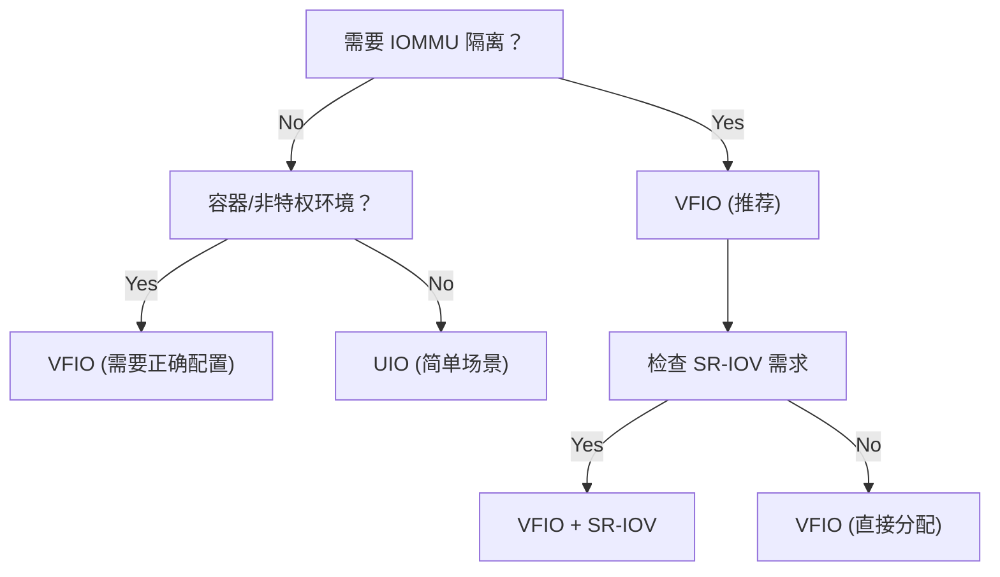

> [!info] DPDK 2026 深度探索系列 0. [[dpdk-deep-dive|全栈学习路径总览]]
>
> 1. [[ch1-architecture-overview|第一章：架构概述——kernel bypass 原理与 DPDK 定位]]
> 2. **第二章：UIO/VFIO/IOMMU 用户态驱动框架**
> 3. [[ch3-eal-initialization|第三章：EAL 初始化与 lcore 模型]]
> 4. [[ch4-hugepage-mempool|第四章：大页内存与 mempool 机制]]
> 5. [[ch5-mbuf-mechanism|第五章：Mbuf 结构与 Dynfield]]

---

## 1. 概述：为什么需要用户态驱动框架？

DPDK 实现 kernel bypass 的第一步是**让用户态程序能够直接访问 PCI 设备**。这听起来简单，但背后涉及 Linux 内核的复杂机制。

**传统方式下 PCI 设备访问**：

```
用户态程序          内核驱动              硬件
    │                  │                  │
    │  read/write()    │                  │
    ├─────────────────►│                  │
    │                  │ PCI config/BAR   │
    │                  ├─────────────────►│
    │                  │                  │
    │   return         │                  │
    ◄──────────────────┤                  │
```

用户态程序只能通过内核驱动的系统调用间接访问 PCI 设备，无法直接读写 PCI BAR（Base Address Register）或配置空间。

**用户态驱动框架的目标**：

1. 绕过内核，让用户态程序直接访问 PCI 配置空间和 BAR
2. 支持内存映射（mmap），让用户态直接读写设备内存
3. 支持 DMA，让设备直接访问用户态内存
4. 支持中断，将硬件中断转换为用户态事件

Linux 提供了两种用户态驱动框架：**UIO** 和 **VFIO**。

---

## 2. UIO (Userspace I/O) 框架

### 2.1 UIO 架构

UIO 是 Linux 2.6.29 (2009) 引入的轻量级用户态 I/O 框架，核心思想是：**将设备驱动分为内核部分（负责中断和少量寄存器访问）和用户部分（负责主要数据处理）**。

```
┌─────────────────────────────────────────────────────────────────┐
│                      User Space                                  │
│  ┌──────────────────────────────────────────────────────────┐   │
│  │                   DPDK Application                        │   │
│  │  ┌──────────┐  ┌──────────┐  ┌──────────┐               │   │
│  │  │  EAL     │  │  ethdev  │  │  app     │               │   │
│  │  └────┬─────┘  └────┬─────┘  └────┬─────┘               │   │
│  └───────┼─────────────┼─────────────┼─────────────────────┘   │
│          │             │             │                            │
│          │    read()   │             │                            │
│  ┌───────▼─────────────▼─────────────▼────────────────────────┐   │
│  │                    /dev/uio0                              │   │
│  │               (UIO 字符设备)                               │   │
│  └────────────────────────┬───────────────────────────────────┘   │
└───────────────────────────┼─────────────────────────────────────────┘
                            │
┌───────────────────────────▼─────────────────────────────────────────┐
│                      Kernel Space                                   │
│  ┌────────────────────────────────────────────────────────────────┐  │
│  │                     igb_uio.ko / uio_pci_generic               │  │
│  │  ┌────────────┐  ┌────────────┐  ┌────────────────────────┐   │  │
│  │  │ PCI probe  │  │ Int handle │  │ uio_register_device() │   │  │
│  │  └────────────┘  └────────────┘  └────────────────────────┘   │  │
│  └────────────────────────┬───────────────────────────────────────┘  │
│                           │                                          │
│  ┌────────────────────────▼───────────────────────────────────────┐   │
│  │                     /sys/class/uio/uio0                        │   │
│  │            (UIO device attributes and maps)                   │   │
│  └────────────────────────────────────────────────────────────────┘   │
└───────────────────────────────────────────────────────────────────────┘
                            │
┌───────────────────────────▼─────────────────────────────────────────────┐
│                      Hardware                                          │
│  ┌────────────────────────────────────────────────────────────────┐   │
│  │                         Physical NIC                            │   │
│  │                   (Intel IGB/I40E/...)                        │   │
│  └────────────────────────────────────────────────────────────────┘   │
└─────────────────────────────────────────────────────────────────────────┘
```

### 2.2 UIO 内核驱动工作原理

#### 2.2.1 驱动注册

```c
// 内核驱动 (igb_uio.ko) 核心代码简化

#include <linux/pci.h>
#include <linux/uio_driver.h>

// 1. PCI 驱动结构
static struct pci_driver igbuio_pci_driver = {
    .name = "igb_uio",
    .id_table = igb_pci_tbl,  // 支持的设备列表
    .probe = igbuio_pci_probe,   // 设备发现时调用
    .remove = igbuio_pci_remove,
};

// 2. Probe 函数：设备初始化
static int igbuio_pci_probe(struct pci_dev *dev, const struct pci_device_id *id)
{
    struct uio_info *info;

    // 分配 UIO info 结构
    info = kzalloc(sizeof(struct uio_info), GFP_KERNEL);

    // 设置 PCI 描述符地址
    info->name = "igb_uio";
    info->version = "1.0";

    // 映射 PCI BAR
    info->mem[0].name = "regs";
    info->mem[0].addr = pci_resource_start(dev, 0);  // BAR0 起始地址
    info->mem[0].size = pci_resource_len(dev, 0);     // BAR0 大小
    info->mem[0].memtype = UIO_MEM_LOGICAL;          // 内存类型

    // 注册 UIO 设备
    if (uio_register_device(&dev->dev, info) < 0)
        return -ENODEV;

    // 保存私有数据
    pci_set_drvdata(dev, info);

    // 启用 PCI 设备
    pci_enable_device(dev);
    pci_set_master(dev);

    return 0;
}

// 3. 中断处理：仅处理必要的中断，大部分工作交给用户态
static irqreturn_t igbuio_handler(int irq, void *info)
{
    struct uio_info *info = (struct uio_info *)dev_id;

    // 对于轮询模式，不需要真正处理中断
    // 但我们需要能触发用户态的等待
    return IRQ_HANDLED;
}
```

#### 2.2.2 用户态访问 PCI BAR

用户态程序通过 mmap 访问 PCI BAR：

```c
// 用户态程序访问 PCI BAR
int fd = open("/dev/uio0", O_RDWR);

// 获取设备信息
struct uio_info_t info;
ioctl(fd, UIOC_INFO, &info);
printf("BAR0 addr: 0x%lx, size: %lu\n",
       info.mem[0].addr, info.mem[0].size);

// mmap PCI BAR 到用户态虚拟地址
void *bar0 = mmap(NULL,
                  info.mem[0].size,   // BAR 大小（通常是 32KB-256KB）
                  PROT_READ | PROT_WRITE,
                  MAP_SHARED,
                  fd,
                  0);  // BAR0

if (bar0 == MAP_FAILED) {
    perror("mmap failed");
    exit(1);
}

// 现在可以直接读写网卡的 DMA 描述符和寄存器
volatile uint32_t *regs = (volatile uint32_t *)bar0;
uint32_t status = regs[0];  // 读取状态寄存器
```

#### 2.2.3 UIO 中断处理

UIO 提供两种中断处理方式：

**方式1：轮询（Poll Mode）** — DPDK 使用这种方式

```c
// 用户态轮询 UIO 文件描述符
int fd = open("/dev/uio0", O_RDWR);

// 禁用 UIO 中断（让用户态自己轮询）
int irq_on = 0;
ioctl(fd, UIOC_IRQ, &irq_on);

// 轮询方式
while (running) {
    uint64_t inter_occured;

    // 读取中断计数（触发时增加）
    read(fd, &inter_occured, sizeof(inter_occured));

    if (inter_occured > last_count) {
        // 有新的中断，处理
        process_interrupts();
        last_count = inter_occured;
    }
}
```

**方式2：eventfd 唤醒**

```c
// 使用 irqfd 机制
int efd = eventfd(0, EFD_NONBLOCK);
struct uio_event ev;
ev.u32_event = UIO_EVENT irq;
ev.efd = efd;
ioctl(fd, UIOC_SETEV, &ev);

// 在 epoll 中等待
struct epoll_event ep_ev;
int epfd = epoll_create1(0);
epoll_ctl(epfd, EPOLL_CTL_ADD, efd, &ep_ev);

// 等待中断
epoll_wait(epfd, &ep_ev, 1, -1);
```

### 2.3 UIO 的局限性

| 问题                  | 说明                           | 影响                               |
| --------------------- | ------------------------------ | ---------------------------------- |
| **无 IOMMU 支持**     | DMA 地址直接是物理地址         | 安全隐患（设备可访问任意物理内存） |
| **无设备隔离**        | 错误驱动可能影响其他设备       | 稳定性问题                         |
| **需要 root 权限**    | 访问 `/dev/uio*` 通常需要 root | 部署限制                           |
| **不支持 INTx MSI-X** | 仅支持 legacy 中断             | 性能限制                           |

---

## 3. VFIO (Virtual Function I/O) 框架

### 3.1 VFIO 架构

VFIO 是 Linux 3.6 (2012) 引入的现代化用户态 I/O 框架，设计目标是**替代 UIO 和 PCI-SIG 的 SR-IOV，实现安全隔离的用户态设备访问**。

```
┌─────────────────────────────────────────────────────────────────────────┐
│                           User Space                                     │
│  ┌──────────────────────────────────────────────────────────────────┐   │
│  │                       DPDK Application                            │   │
│  │  ┌──────────┐  ┌──────────┐  ┌──────────┐                      │   │
│  │  │  EAL     │  │  ethdev  │  │  app      │                      │   │
│  │  └────┬─────┘  └────┬─────┘  └────┬─────┘                      │   │
│  │       │              │              │                             │   │
│  │       │   VFIO API   │              │                             │   │
│  │       └──────┬───────┘              │                             │   │
│  │              │                       │                             │   │
│  └──────────────┼───────────────────────┼─────────────────────────────┘   │
│                 │                       │                                  │
│  ┌──────────────▼───────────────────────▼────────────────────────────┐    │
│  │                    /dev/vfio/vfio                              │    │
│  │                 (VFIO container fd)                            │    │
│  └─────────────────────────┬──────────────────────────────────────────┘    │
└────────────────────────────┼──────────────────────────────────────────────────┘
                              │
┌─────────────────────────────▼──────────────────────────────────────────────────┐
│                           Kernel Space                                       │
│  ┌────────────────────────────────────────────────────────────────────────┐    │
│  │                           vfio-pci.ko                                 │    │
│  │  ┌────────────┐  ┌────────────┐  ┌────────────┐  ┌────────────────┐  │    │
│  │  │ PCI probe  │  │ IOMMU      │  │ DMA mapping│  │ MSI-X/INTx    │  │    │
│  │  │            │  │ management │  │            │  │ interrupt     │  │    │
│  │  └────────────┘  └────────────┘  └────────────┘  └────────────────┘  │    │
│  │                                                                        │    │
│  │  ┌─────────────────────────────────────────────────────────────────┐ │    │
│  │  │                     IOMMU Framework (IOMMU API)                  │ │    │
│  │  │    ┌──────────────┐  ┌──────────────┐  ┌──────────────┐        │ │    │
│  │  │    │  Intel VT-d  │  │   AMD-Vi     │  │   ARM SMMU   │        │ │    │
│  │  │    └──────────────┘  └──────────────┘  └──────────────┘        │ │    │
│  │  └─────────────────────────────────────────────────────────────────┘ │    │
│  └────────────────────────────────────────────────────────────────────────┘    │
└─────────────────────────────────────────────────────────────────────────────────┘
                              │
┌─────────────────────────────▼──────────────────────────────────────────────────┐
│                           Hardware                                              │
│  ┌──────────────────────┐  ┌───────────────────────┐                            │
│  │    IOMMU             │  │    Physical NIC       │                            │
│  │  (VT-d / AMD-Vi)    │  │  (SR-IOV capable)    │                            │
│  └──────────────────────┘  └───────────────────────┘                            │
└──────────────────────────────────────────────────────────────────────────────────┘
```

### 3.2 VFIO vs UIO：关键差异

| 特性                | UIO                   | VFIO                   |
| ------------------- | --------------------- | ---------------------- |
| **IOMMU 支持**      | ❌                    | ✅                     |
| **DMA 地址翻译**    | 物理地址直连          | IOMMU 虚拟化           |
| **设备隔离**        | ❌ 无                 | ✅ 强隔离              |
| **多虚拟机支持**    | ❌                    | ✅ 安全多租            |
| **MSI-X 中断**      | ❌                    | ✅                     |
| **需要硬件 SR-IOV** | ❌                    | 推荐但非必须           |
| **权限要求**        | root 或 CAP_SYS_RAWIO | iommu_group，可非 root |

### 3.3 VFIO 工作原理

#### 3.3.1 打开 VFIO Container

```c
// 用户态获取 VFIO container
int container = open("/dev/vfio/vfio", O_RDWR);

if (ioctl(container, VFIO_GET_API_VERSION) != VFIO_API_VERSION) {
    fprintf(stderr, "Invalid VFIO API version\n");
    exit(1);
}

// 检查 IOMMU 支持
int supported;
ioctl(container, VFIO_CHECK_EXTENSION, VFIO_TYPE1_IOMMU, &supported);
if (!supported) {
    fprintf(stderr, "IOMMU (Type1) not supported\n");
    exit(1);
}
```

#### 3.3.2 创建设备组

VFIO 的核心概念是**设备组（Group）**——共享同一 IOMMU上下文的设备集合：

```c
// 获取设备的 iommu_group
struct stat st;
stat("/sys/bus/pci/devices/0000:01:00.0", &st);
dev_t dev = st.st_rdev;

// 从设备路径获取 iommu_group
char group_path[256];
sprintf(group_path, "/dev/vfio/%d",
        atoi(basename(readlink("/sys/bus/pci/devices/0000:01:00.0/iommu_group"))));

int group_fd = open(group_path, O_RDWR);

// 将 group 加入 container
struct vfio_group_status group_status = {
    .argsz = sizeof(group_status)
};
ioctl(group_fd, VFIO_GROUP_GET_STATUS, &group_status);

if (!(group_status.flags & VFIO_GROUP_FLAGS_VIABLE)) {
    fprintf(stderr, "Group not viable (some devices not bound to vfio-pci)\n");
    exit(1);
}

// 通知 container 这个 group
ioctl(container, VFIO_GROUP_SET_CONTAINER, &group_fd);
```

#### 3.3.3 设置 IOMMU

```c
// 设置 IOMMU 为 TYPE1（Intel/AMD 通用）
struct vfio_iommu_type1_args args = {
    .argsz = sizeof(args),
    .flags = 0
};
ioctl(container, VFIO_SET_IOMMU, VFIO_TYPE1_IOMMU);

// 或者使用 SPAPR (PowerPC)
ioctl(container, VFIO_SET_IOMMU, VFIO_SPAPR_TCE_IOMMU);
```

#### 3.3.4 获取并绑定设备

```c
// 获取设备文件描述符
struct vfio_device_info device_info = {
    .argsz = sizeof(device_info)
};

int device_fd = ioctl(group_fd, VFIO_GROUP_GET_DEVICE_FD, "0000:01:00.0");
ioctl(device_fd, VFIO_DEVICE_GET_INFO, &device_info);

printf("Flags: 0x%x, Num regions: %d, Num irqs: %d\n",
       device_info.flags, device_info.num_regions, device_info.num_irqs);
```

#### 3.3.5 访问 PCI 配置空间

```c
// 读取 PCI 配置空间（通过 VFIO region 0）
struct vfio_region_info reg_info = {
    .argsz = sizeof(reg_info),
    .index = VFIO_PCI_CONFIG_REGION_INDEX
};
ioctl(device_fd, VFIO_DEVICE_GET_REGION_INFO, &reg_info);

uint8_t config_space[256];
read(device_fd, config_space, reg_info.size);

// 解析配置空间
uint16_t vendor_id = *(uint16_t *)(config_space + 0);
uint16_t device_id = *(uint16_t *)(config_space + 2);
printf("PCI %04x:%04x\n", vendor_id, device_id);
```

#### 3.3.6 mmap PCI BAR

```c
// 映射 PCI BAR 到用户态
struct vfio_region_info bar_info = {
    .argsz = sizeof(bar_info),
    .index = 0  // BAR0
};
ioctl(device_fd, VFIO_DEVICE_GET_REGION_INFO, &bar_info);

void *bar0 = mmap(NULL, bar_info.size,
                  PROT_READ | PROT_WRITE,
                  MAP_SHARED,
                  device_fd,
                  bar_info.offset);

if (bar0 == MAP_FAILED) {
    perror("mmap BAR0 failed");
    exit(1);
}

// 现在可以直接访问网卡寄存器
volatile uint32_t *regs = (volatile uint32_t *)bar0;
regs[RTE_VENDOR_ID] = 0x8086;  // Intel vendor ID
```

### 3.4 VFIO DMA 映射

VFIO 的核心价值之一是**安全的 DMA 映射**——通过 IOMMU 将用户态虚拟地址映射为设备可见的 IOVA（I/O Virtual Address）。

#### 3.4.1 为什么要 DMA 映射？

网卡接收数据时，需要 DMA 将数据写入内存。如果直接使用物理地址：

```c
// 传统方式（UIO）
struct rte_mbuf *mbuf = rte_pktmbuf_alloc(pool);

// mbuf 的 buf_addr 是物理地址
uint64_t phys_addr = rte_mbuf_buf_iova(mbuf);

// 告诉网卡：用这个物理地址 DMA
set_rx_desc(phys_addr);
```

问题：物理地址在系统内存变化后可能无效，且有安全风险。

#### 3.4.2 VFIO IOMMU DMA 映射

```c
// 用户态分配大页内存
void *dma_buf = mmap(NULL, HUGE_PAGE_SIZE,
                     PROT_READ | PROT_WRITE,
                     MAP_PRIVATE | MAP_ANONYMOUS | MAP_HUGETLB,
                     -1, 0);

// 注册到 VFIO IOMMU
struct vfio_iommu_type1_dma_map dma_map = {
    .argsz = sizeof(dma_map),
    .flags = VFIO_DMA_MAP_FLAG_READ | VFIO_DMA_MAP_FLAG_WRITE,
    .vaddr = (uint64_t)dma_buf,    // 用户态虚拟地址
    .iova = 0x100000000ULL,         // IOVA（设备看到的地址）
    .size = HUGE_PAGE_SIZE
};
ioctl(container, VFIO_IOMMU_MAP_DMA, &dma_map);

// 网卡使用 IOVA 而非物理地址
set_rx_desc(dma_map.iova);  // 设备 DMA 到 IOVA
```

#### 3.4.3 IOVA 模型

```
┌─────────────────────────────────────────────────────────────────┐
│                      用户态虚拟地址空间                           │
│                                                                 │
│  0x100000    ┌─────────────────────┐                           │
│              │     DMA Buffer      │                           │
│              │   (mbuf data)       │  Virtual Addr = 0x7f00...  │
│              └─────────────────────┘                           │
│                      │                                             │
│                      │ VFIO IOMMU Map                            │
│                      ▼                                             │
└─────────────────────────────────────────────────────────────────┘
                       │
                       │ IOMMU Translation
                       │
┌─────────────────────────────────────────────────────────────────┐
│                    IOVA (Device Address)                         │
│                                                                 │
│  0x100000000   ┌─────────────────────┐                           │
│                │     DMA Buffer      │                           │
│                └─────────────────────┘                           │
│               IOVA = 0x1_0000_0000                               │
└─────────────────────────────────────────────────────────────────┘
                       │
                       │ PCIe DMA Read/Write
                       ▼
┌─────────────────────────────────────────────────────────────────┐
│                    Physical RAM                                 │
│                                                                 │
│  0x10_0000_0000  ┌─────────────────────┐                        │
│                  │     DMA Buffer      │                        │
│                  │   (mbuf data)       │                        │
│                  └─────────────────────┘                        │
│               Physical Addr = 0x10_0000_0000                     │
└─────────────────────────────────────────────────────────────────┘
```

---

## 4. IOMMU 详解

### 4.1 IOMMU 是什么？

IOMMU（Input-Output Memory Management Unit）是连接外设和内存的硬件单元，类似于 CPU 的 MMU（内存管理单元）。

| 组件      | 功能                          | 映射方向     |
| --------- | ----------------------------- | ------------ |
| **MMU**   | CPU 虚拟地址 → 物理地址       | CPU → RAM    |
| **IOMMU** | 设备虚拟地址(IOVA) → 物理地址 | Device → RAM |

### 4.2 Intel VT-d 工作原理

```
┌─────────────────────────────────────────────────────────────────┐
│                         CPU                                      │
│  ┌───────────┐         ┌───────────┐                            │
│  │ Process A │         │ Process B │                            │
│  │ VA 0x...  │         │ VA 0x...  │                            │
│  └─────┬─────┘         └─────┬─────┘                            │
│        │                     │                                  │
│        │ CPU MMU              │ CPU MMU                          │
│        ▼                     ▼                                  │
│  PA 0x10_0000          PA 0x20_0000                             │
└─────────────────────────────────────────────────────────────────┘
         │                      │
         │                      │
    ┌────▼──────────────────────▼────┐
    │        DDR Memory              │
    │  0x10_0000 (Process A)        │
    │  0x20_0000 (Process B)        │
    └────────────────────────────────┘
                    ▲
                    │ DMA
    ┌───────────────┴────────────────┐
    │           IOMMU                 │
    │  ┌───────────────────────────┐ │
    │  │     Root Table            │ │
    │  │     Context Entry         │ │
    │  │     Page Tables           │ │
    │  └───────────────────────────┘ │
    └───────────────────────────────┬─┘
                                    │
    ┌────────────────────────────────▼───────────────────────────┐
    │                    PCIe Device                              │
    │    Process A: IOVA 0x1000_0000 → PA 0x10_0000             │
    │    Process B: IOVA 0x2000_0000 → PA 0x20_0000             │
    └─────────────────────────────────────────────────────────────┘
```

### 4.3 IOMMU 的安全价值

#### 4.3.1 设备隔离

没有 IOMMU：设备 A 的 DMA 可能意外访问设备 B 的内存。

有 IOMMU：每个设备只能访问分配给它的 IOVA 范围。

```
┌────────────────────────────────────────────────────────────────┐
│ 无 IOMMU（危险）                                                │
│                                                                 │
│  Device A ──DMA──► Physical Addr 0x1000_0000 (Device B's BAR)  │
│                  ► 可以读写任意物理地址                          │
└────────────────────────────────────────────────────────────────┘

┌────────────────────────────────────────────────────────────────┐
│ 有 IOMMU（安全）                                                 │
│                                                                 │
│  Device A ──IOVA──► IOMMU ──PA──► Only 0x1000_0000 allowed     │
│                  ► 超出范围的 DMA 被 Blocked                     │
└────────────────────────────────────────────────────────────────┘
```

#### 4.3.2 内存保护

```c
// VT-d 页表结构
struct intel_vt_root_entry {
    uint64_t present : 1;           // 入口有效
    uint64_t context_pointer : 40;   // 指向 Context Table
    uint64_t : 23;
};

struct intel_vt_context_entry {
    uint64_t present : 1;
    uint64_t addr_width : 6;         // 地址宽度
    uint64_t root_ptr : 40;          // 指向第二级页表
    uint64_t : 17;
};

// DMA 地址翻译过程
// IOVA → Root Table → Context Entry → Extended Page Table → Physical Addr
```

### 4.4 VFIO IOMMU 类型

| 类型               | 说明                                     | 适用平台       |
| ------------------ | ---------------------------------------- | -------------- |
| **VFIO_TYPE1**     | 不支持 SAT（Second Address Translation） | Intel/AMD 通用 |
| **VFIO_TYPE1v2**   | 支持 SAT                                 | 较新内核       |
| **VFIO_SPAPR**     | IBM PowerPC sPAPR TCE                    | PowerPC        |
| **VFIO_UNMANAGED** | 用户自行管理 DMA                         | 特殊场景       |

```c
// 检查 VFIO IOMMU 类型
int type1_supported, s2w_supported, s4w_supported;

ioctl(container, VFIO_CHECK_EXTENSION, VFIO_TYPE1_IOMMU, &type1_supported);
ioctl(container, VFIO_CHECK_EXTENSION, VFIO_TYPE1v2_IOMMU, &type1_supported);
ioctl(container, VFIO_CHECK_EXTENSION, VFIO_SPAPR_TCE_IOMMU, &s2w_supported);
```

---

## 5. SR-IOV 与 VFIO 的协同

### 5.1 SR-IOV 简介

SR-IOV (Single Root I/O Virtualization) 允许单个物理网卡创建多个虚拟功能（VF），每个 VF 都可以直接分配给虚拟机。

```
┌─────────────────────────────────────────────────────────────────┐
│                    Physical Function (PF)                        │
│  ┌──────────────────────────────────────────────────────────┐   │
│  │                    ixgbe Driver                           │   │
│  │  full control plane + data plane                         │   │
│  └──────────────────────────────────────────────────────────┘   │
│                    │                                               │
│                    │ SR-IOV                                        │
│        ┌───────────┼───────────┬───────────┐                      │
│        ▼           ▼           ▼           ▼                      │
│  ┌──────────┐ ┌──────────┐ ┌──────────┐ ┌──────────┐             │
│  │   VF 0   │ │   VF 1   │ │   VF 2   │ │   VF 3   │             │
│  │ (VM 1)   │ │ (VM 2)   │ │ (VM 3)   │ │ (VM 4)   │             │
│  └──────────┘ └──────────┘ └──────────┘ └──────────┘             │
└─────────────────────────────────────────────────────────────────┘
```

### 5.2 VFIO + SR-IOV 部署模型

```bash
# 1. 在物理网卡上启用 SR-IOV
echo 4 > /sys/bus/pci/devices/0000:01:00.0/sriov_numvfs

# 2. 查看创建的 VF
ls /sys/bus/pci/devices/0000:01:00.0/virtfn0/
ls /sys/bus/pci/devices/0000:01:00.0/virtfn1/

# 3. 将 VF 绑定到 vfio-pci
echo "vfio-pci" > /sys/bus/pci/devices/0000:01:00.0/virtfn0/driver_override
echo "0000:01:00.1" > /sys/bus/pci/drivers/vfio-pci/bind

# 4. 在 QEMU 中使用 VF
# qemu-system-x86_64 -device vfio-pci,host=01:00.1,id=net0
```

### 5.3 VFIO 在虚拟化中的优势

| 场景           | 传统 VirtIO           | VFIO + SR-IOV     |
| -------------- | --------------------- | ----------------- |
| **Latency**    | ~10-20μs ( emulation) | ~1-2μs (直接访问) |
| **Throughput** | 受限于 VirtIO 驱动    | 线速 (100G+)      |
| **CPU 开销**   | 模拟器开销            | 几乎无            |
| **特性支持**   | VirtIO 特性           | 所有硬件特性      |
| **迁移**       | 支持 Live Migration   | 有限支持          |

---

## 6. DPDK 中的 VFIO 配置

### 6.1 加载 VFIO 模块

```bash
# 1. 确保 IOMMU 在 BIOS 中启用

# 2. 加载 VFIO 模块
modprobe vfio
modprobe vfio_pci

# 3. 检查 VFIO 是否支持
cat /sys/kernel/iommu_groups/*/devices/*/iommu_group/type
# 或者
dmesg | grep -e "DMAR" -e "IOMMU"
```

### 6.2 启用 IOMMU

```bash
# 在 grub 中启用 Intel VT-d
# GRUB_CMDLINE_LINUX="intel_iommu=on iommu=pt"

# 重启后检查
dmesg | grep -e "DMAR:" -e "IOMMU"
# 应该看到 "DMAR: IOMMU enabled"
```

### 6.3 VFIO 用户组验证

```bash
# 查看设备的 IOMMU 组
ls -la /sys/bus/pci/devices/0000:01:00.0/iommu_group/
# 输出: ../iommu_group0

# 查看组内所有设备
ls /sys/kernel/iommu_groups/*/devices/
```

### 6.4 常见错误

| 错误                             | 原因                   | 解决                                        |
| -------------------------------- | ---------------------- | ------------------------------------------- |
| `VFIO: Error connecting to VFIO` | 权限不足               | `chmod 666 /dev/vfio/vfio` 或加入 `vfio` 组 |
| `IOMMU required`                 | VT-d 未启用            | BIOS 启用或使用 `iommu=pt`                  |
| `Group not viable`               | 组内有其他驱动占用设备 | 将设备 bind 到 vfio-pci                     |
| `DMA map failed`                 | 大页不足               | 增加 hugepages                              |

---

## 7. UIO vs VFIO 选择指南



**选择建议**：

| 场景            | 推荐框架      | 原因                   |
| --------------- | ------------- | ---------------------- |
| 裸机 DPDK       | VFIO          | 现代、安全、支持 IOMMU |
| 虚拟机 DPDK     | VFIO + SR-IOV | 最佳性能               |
| 容器 (非特权)   | VFIO          | 支持 cgroup 权限控制   |
| 旧系统/简单场景 | UIO           | 配置简单               |
| 多租户云        | VFIO          | 必须的 IOMMU 隔离      |

---

## 8. 小结

本章核心要点：

1. **UIO 框架**：轻量级用户态 I/O，内核部分仅处理中断和基本配置，数据平面完全在用户态。缺点是无 IOMMU 支持，安全隔离不足。

2. **VFIO 框架**：现代用户态驱动框架，核心价值是 IOMMU 支持——实现 DMA 地址翻译和设备隔离，让设备只能访问授权的内存区域。

3. **IOMMU 原理**：VT-d/AMD-Vi 将设备的 IOVA 翻译为物理地址，支持页表保护，防止恶意 DMA 攻击。

4. **VFIO + SR-IOV**：最佳虚拟化方案，虚拟机获得接近原生性能的网卡访问能力。

5. **DPDK 中的选择**：现代 DPDK 推荐使用 VFIO，UIO 仅在无法使用 VFIO 的遗留场景中使用。

**下一篇预告**：[[ch3-eal-initialization|第三章]]将深入讲解 DPDK EAL 初始化的完整流程，包括 `rte_eal_init` 的每一步做了什么、lcore 如何发现和绑定、master lcore 的角色，以及 EAL 参数的完整解析。

---

> [!tip] 参考文献
>
> - Linux Kernel Documentation, "Linux Userspace I/O (UIO) HOWTO", https://www.kernel.org/doc/html/latest/driver-api/uio-howto.html
> - Linux Kernel Documentation, "VFIO - Virtual Function I/O", https://www.kernel.org/doc/html/latest/driver-api/vfio.html
> - Intel, "Intel Virtualization Technology for Directed I/O (VT-d)", https://www.intel.com/content/www/us/en/architecture-and-technology/vt-io-virtualization-technology.html
> - PCI-SIG, "SR-IOV Primer", https://pcisingroup.github.io/
