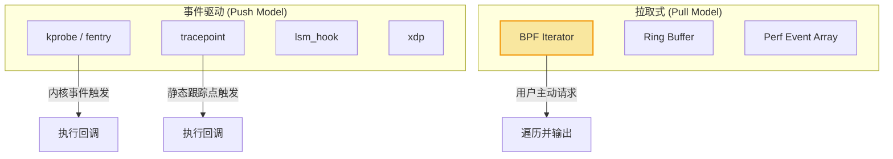
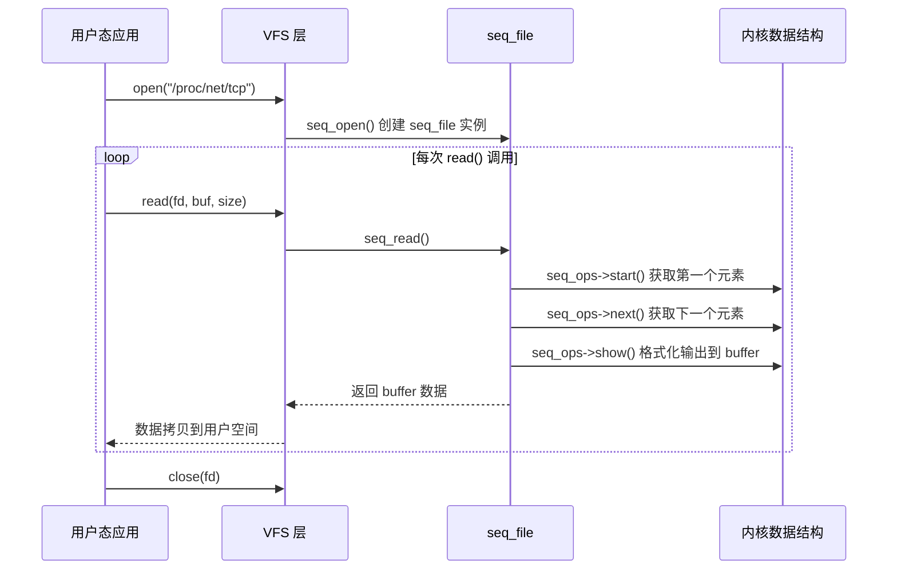
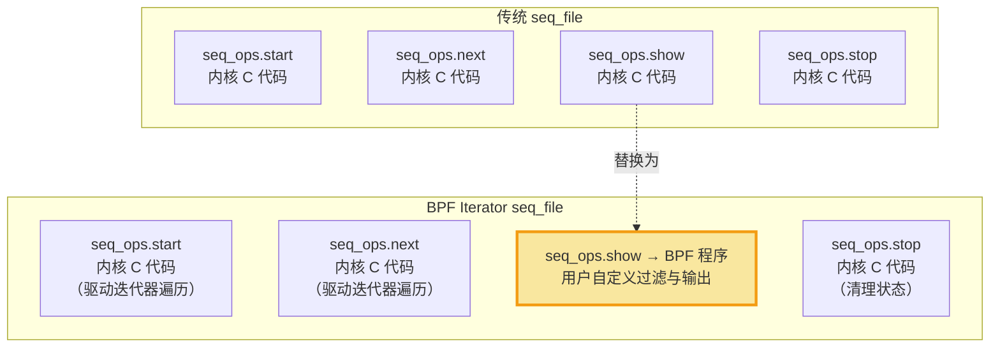
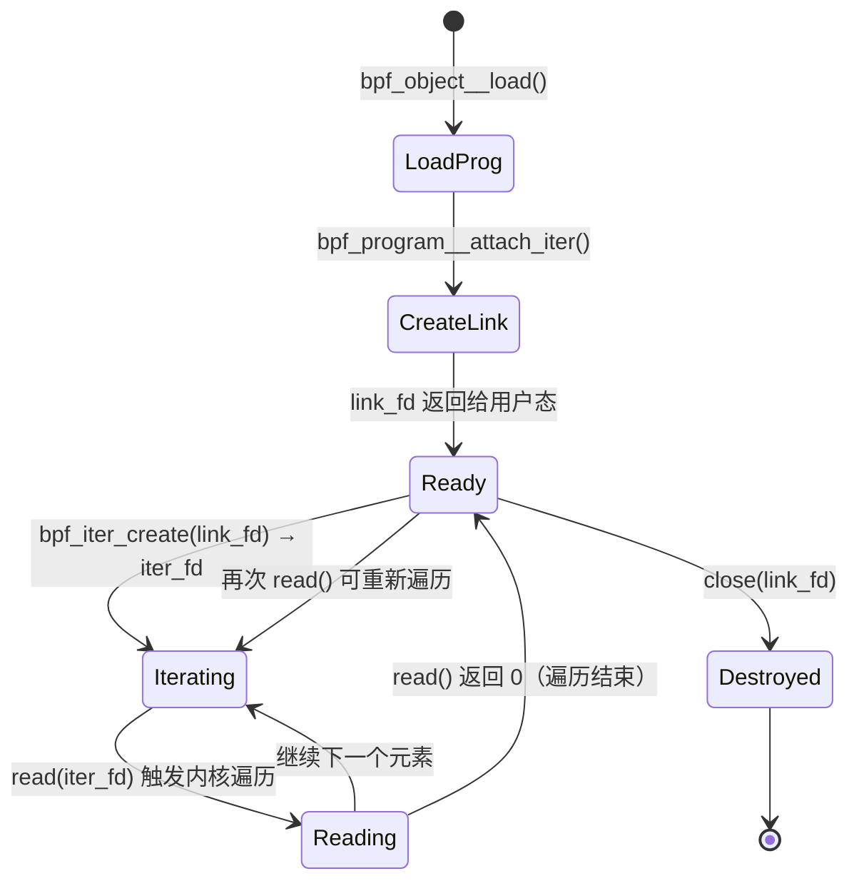
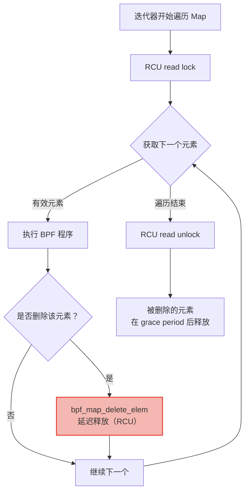

> [!info] eBPF 2026 深度探索系列 0. [[2026-04-08-ebpf-comprehensive-learning-roadmap|全栈学习路径总览]]
>
> 1. [[ch1-registers-and-instructions|第一章：寄存器与指令集]]
> 2. [[ch1-5-function-calls|第一.五章：四种函数调用与动态内存]]
> 3. [[ch1-6-the-verifier|第一.六章：验证器 (Verifier) 的底层逻辑]]
> 4. [[ch2-maps-and-communication|第二章：Map 机制与跨空间通信]]
> 5. [[ch2-5-kptr-and-ownership|第二.五章：kptr (内核指针) 与内存所有权模型]]
> 6. [[ch3-core-and-btf|第三章：CO-RE 与 BTF 的跨版本魔法]]
> 7. [[ch4-tracing-hooks-and-security|第四章：从 kprobe 到 LSM 的追踪全图景]]
> 8. [[ch7-5-uprobes-dynamic-tracing|第七.五章：uprobe 用户态动态追踪原理]]
> 9. [[ch7-6-bpftime-user-runtime|第七.六章：bpftime 与用户态 eBPF 加速]]
> 10. [[ch18-bpftime-injection-mastery|第七.七章：bpftime 自动化注入与全量监控实战]]
> 11. [[ch7-8-uprobe-selection-guide|第七.八章：uprobe 选型指南：内核态 vs 用户态]]
> 12. [[ch5-xdp-networking-performance|第五章：XDP 极致网络性能与全栈架构]]
> 13. [[ch6-tc-traffic-control|第六章：TC (Traffic Control) 流量调度艺术]]
> 14. [[ch7-security-lsm-enforcement|第七章：LSM BPF 从可观测到安全执法]]
> 15. [[ch8-advanced-tuning-and-profiling|第八章：进阶实战与内核调优]]
> 16. [[ch9-af-xdp-zero-copy|第九章：AF_XDP 零拷贝与用户态协议栈]]
> 17. [[ch10-sched-ext-custom-scheduler|第十章：sched_ext 自定义 CPU 调度器]]
> 18. **第十一章：BPF Iterators 内核对象迭代器**
> 19. [[ch12-kfuncs-evolution|第十二章：kfuncs 下一代内核交互标准]]
> 20. [[ch13-usdt-tracing|第十三章：USDT 用户态静态定义追踪]]
> 21. [[ch14-ai-llm-inference-monitoring|第十四章：AI 推理与大模型监控前沿]]
> 22. [[ch15-container-isolation|第十五章：无感增强容器隔离性]]
> 23. [[ch16-ebpf-and-wasm|第十六章：eBPF 与 WebAssembly (WASM) 的共生架构]]
> 24. [[ch17-storage-and-filesystem|第十七章：存储与文件系统加速]]
> 25. [[ch18-lifecycle-and-links|第十八章：生命周期管理与 BPF Links]]
> 26. [[ch19-atomic-updates-and-hot-upgrade|第十九章：程序的原子更新与蓝绿部署]]
> 27. [[ch25-5-stack-trace-correlation|第二五.五章：调用栈与业务请求的深度绑定]]
> 28. [[ch20-edge-iot-acceleration|第二十章：边缘计算与工业协议加速]]
> 29. [[ch21-debugging-and-verifier|第二十一章：调试实战与验证器 (Verifier) 诊断]]
> 30. [[ch22-testing-and-ci-cd|第二十二章：测试与持续集成 (CI/CD) 实战]]
> 31. [[ch23-security-and-permissions|第二十三章：权限细分与 BPF 安全沙箱]]
> 32. [[ch24-meta-monitoring-and-self-healing|第二十四章：eBPF 程序的内核自愈与监控]]
> 33. [[ch25-full-stack-observability|第二十五章：全栈可观测性与端到端追踪]]
> 34. [[ch26-network-security-high-level|第二十六章：网络安全防御的高阶实战]]
> 35. [[ch27-agent-engineering-architecture|第二十七章：工业级模块化 Agent 架构演进]]
> 36. [[ch28-offensive-and-defensive|第二十八章：攻防博弈与 Rootkit 防御]]
> 37. [[ch29-networking-deep-dive|第二十九章：网络应用深水区——负载均衡、Sockmap 与拥塞控制]]
> 38. [[ch30-hardware-offload|第三十章：硬件卸载与 SmartNIC 实战]]
> 39. [[ch31-signed-objects-and-security|第三十一章：内核原生签名与供应链安全]]
> 40. [[ch32-ebpf-for-windows|第三十二章：跨平台崛起——eBPF for Windows]]
> 41. [[ch32-5-macos-status|第三十二.五章：macOS 的特殊路径]]
> 42. [[ch33-serverless-optimization|第三十三章：Serverless 冷启动消除与动态计费]]
> 43. [[ch34-waf-and-rasp|第三十四章：Web 安全革命——内核态 WAF 与 RASP]]
> 44. [[ch35-npu-tpu-ai-hardware|第三十五章：AI 推理硬件 (NPU/TPU) 与硬件定义内核]]
> 45. [[ch36-dynamic-language-introspection|第三十六章：动态语言感知——业务对象的零代码提取]]
> 46. [[ch37-green-computing|第三十七章：绿色计算与能耗精准归因]]
> 47. [[ch38-ecosystem-and-career|第三十八章：2026 生态全景与工程师职业导航]]
> 48. [[ch39-rust-aya-framework|第三十九章：Rust eBPF 开发实战——Aya 框架与安全编程]]
> 49. [[ch40-network-protocols-deep-dive|第四十章：网络协议深度解析——TCP/UDP/QUIC 的 eBPF 视角]]
> 50. [[ch41-memory-safety-and-vulnerabilities|第四十一章：eBPF 内存安全与漏洞分析]]
> 51. [[ch42-service-mesh-integration|第四十二章：eBPF 与 Service Mesh 深度集成]]

---

# BPF Iterators 内核对象迭代器

## 1. 概述：内核态的 "SQL 查询"

在 eBPF 的高级应用中，我们经常需要对内核里的海量对象（如数万个进程、百万条 TCP 连接）进行扫描和统计。传统的 `/proc` 文件系统在处理此类大规模数据时，由于涉及到繁琐的文本格式化和大量的上下文切换，性能瓶颈非常严重。

**BPF Iterators** 应运而生。它允许开发者编写一段 BPF 程序，直接由内核驱动进行对象遍历，只将过滤后的、结构化的二进制数据返回给用户态。

### 1.1 为什么需要 BPF Iterators？

传统的内核对象导出机制存在三大痛点：

| 痛点         | 说明                                                                                     | BPF Iterators 如何解决                                         |
| ------------ | ---------------------------------------------------------------------------------------- | -------------------------------------------------------------- |
| **性能低下** | `/proc` 文件系统每次 `read()` 都需要逐条格式化文本，涉及大量 `sprintf` 和内核-用户态拷贝 | 在内核态直接执行过滤，只输出感兴趣的字段，减少 90%+ 的数据传输 |
| **格式固定** | `/proc`、`/sys` 的输出格式是内核硬编码的，无法按需裁剪                                   | 用户自定义 BPF 程序决定输出内容和格式                          |
| **缺乏过滤** | 无法在内核态进行过滤，所有数据都要传输到用户态再做筛选                                   | 过滤逻辑在 BPF 程序中完成，不匹配的对象零开销跳过              |
| **原子性差** | 多次 `read()` 之间对象可能已被修改，无法获得一致快照                                     | 单次遍历在一个 seq_file session 中完成，保证快照一致性         |

### 1.2 与其他 BPF 程序类型的对比

BPF Iterators 的定位不同于 kprobe、tracepoint 或 perf_event。后者是**事件驱动**的（"当 X 发生时执行 Y"），而 BPF Iterators 是**拉取式**的（"现在把所有 Z 列出来"）。



---

## 2. 核心架构：seq_file 集成

BPF Iterators 的实现基石是 Linux 内核的 **seq_file** 机制。理解 seq_file 是掌握 BPF Iterators 的前提。

### 2.1 seq_file 基础

`seq_file` 是内核提供的一套用于生成大块虚拟文件内容的 API。它解决了传统 `/proc` 实现中的核心问题：**用户空间的 `read()` 调用可能无法一次性读完内核数据**。



seq_file 的核心是一组回调函数 `seq_operations`：

```c
// include/linux/seq_file.h
struct seq_operations {
    void *(*start)(struct seq_file *m, loff_t *pos);
    void (*stop)(struct seq_file *m, void *v);
    void *(*next)(struct seq_file *m, void *v, loff_t *pos);
    int (*show)(struct seq_file *m, void *v);
};
```

- **`start()`**：初始化迭代器，返回第一个元素的指针。`pos` 表示偏移量，支持从断点恢复。
- **`next()`**：移动到下一个元素。如果到达末尾，返回 `NULL`。
- **`stop()`**：清理迭代状态，释放锁。
- **`show()`**：将当前元素格式化输出到 seq_file 的内部缓冲区。

### 2.2 BPF 如何注入 seq_file

BPF Iterators 的精妙之处在于：**用 BPF 程序替换 `seq_operations` 中的 `show()` 回调**（部分场景也替换 `start/next/stop`）。



内核为每种可迭代对象定义了一组 `bpf_iter_*` 函数，它们负责设置 `seq_operations` 并将 BPF 程序绑定到 `show()` 回调上。例如，`bpf_iter_task` 负责遍历 `task_struct` 链表，而你的 BPF 程序则决定对每个 task 做什么。

---

## 3. bpf_iter 基础设施详解

### 3.1 内核中的 bpf_iter 注册表

内核通过 `bpf_iter_reg` 结构体注册每种迭代器类型：

```c
// kernel/bpf/bpf_iter.c
struct bpf_iter_reg {
    const char *target;        // 迭代目标名称，如 "task", "tcp", "map"
    bpf_iter_attach_target_t attach_target;  // 绑定回调
    bpf_iter_detach_target_t detach_target;  // 解绑回调
    bpf_iter_show_fdinfo_t show_fdinfo;      // fdinfo 显示
    u32 ctx_arg_info_size;                   // 上下文参数信息数量
    const struct bpf_ctx_arg *ctx_arg_info;  // 上下文参数定义
    const struct bpf_iter_seq_info *seq_info;// seq_operations 定义
};
```

当用户调用 `bpf_link_create(BPF_ITER)` 系统调用时，内核会查找匹配的 `bpf_iter_reg`，验证 BPF 程序的 attach 类型，然后创建一个 seq_file 实例。

### 3.2 用户态 API：创建与使用迭代器

在用户态，使用 BPF Iterators 的完整流程如下：

```c
// libbpf 提供的高层 API
LIBBPF_API int bpf_iter_create(int link_fd);

// 完整使用示例
int iter_fd = bpf_iter_create(link_fd);

// 然后像普通文件一样读取
char buf[4096];
ssize_t n;
while ((n = read(iter_fd, buf, sizeof(buf))) > 0) {
    // 处理输出数据
    write(STDOUT_FILENO, buf, n);
}
close(iter_fd);
```

也可以通过 `bpftool` 直接使用：

```bash
# 列出当前系统中已加载的 BPF 迭代器
bpftool iter list

# 通过 bpftool 运行迭代器程序
bpftool iter pin <prog_id> /sys/fs/bpf/my_iter
cat /sys/fs/bpf/my_iter
```

### 3.3 BPF 程序签名

每种迭代器的 BPF 程序接收不同的上下文结构体。这些结构体由内核定义，通过 BTF 确保跨版本兼容。

```c
// 遍历 task
SEC("iter/task")
int dump_task(struct bpf_iter__task *ctx) {
    struct seq_file *seq = ctx->meta->seq;
    struct task_struct *task = ctx->task;
    // ...
}

// 遍历 TCP 连接
SEC("iter/tcp")
int dump_tcp(struct bpf_iter__tcp *ctx) {
    struct seq_file *seq = ctx->meta->seq;
    struct sock *sk = ctx->sk_common;
    // ...
}

// 遍历 Map 元素
SEC("iter/bpf_map_elem")
int dump_map(struct bpf_iter__bpf_map_elem *ctx) {
    struct seq_file *seq = ctx->meta->seq;
    struct bpf_map *map = ctx->map;
    void *key = ctx->key;
    void *value = ctx->value;
    // ...
}

// 遍历 cgroup
SEC("iter/cgroup")
int dump_cgroup(struct bpf_iter__cgroup *ctx) {
    struct seq_file *seq = ctx->meta->seq;
    struct cgroup *cgrp = ctx->cgroup;
    // ...
}
```

### 3.4 生命周期管理



关键点：**BPF 迭代器可以反复使用**。每次 `read()` 从头开始遍历，也可以多次创建 `iter_fd` 进行并行读取。

---

## 4. 输出机制：从内核到用户空间

### 4.1 bpf_seq_write：二进制输出

虽然 `bpf_seq_printf` 可以输出格式化文本，但生产环境推荐使用 `bpf_seq_write` 输出二进制数据，避免文本解析开销。

```c
// 定义输出结构体（用户态和内核态必须一致）
struct task_info {
    __u32 pid;
    __u32 ppid;
    __u64 vmsize;    // Virtual memory size in KB
    __u64 rss;       // Resident Set Size in KB
    char comm[16];   // Process name
};

SEC("iter/task")
int dump_tasks_binary(struct bpf_iter__task *ctx) {
    struct seq_file *seq = ctx->meta->seq;
    struct task_struct *task = ctx->task;

    if (!task)
        return 0;

    struct task_info info = {};
    info.pid = task->pid;
    info.ppid = task->real_parent->pid;
    info.vmsize = task->mm ? task->mm->total_vm : 0;
    info.rss = task->mm ? task->mm->rss_vm : 0;
    __builtin_memcpy(info.comm, task->comm, sizeof(info.comm));

    // 二进制写入，用户态直接 cast 读取
    bpf_seq_write(seq, &info, sizeof(info));
    return 0;
}
```

用户态读取：

```c
struct task_info info;
while (read(iter_fd, &info, sizeof(info)) == sizeof(info)) {
    printf("PID=%u PPID=%u COMM=%s RSS=%luKB\n",
           info.pid, info.ppid, info.comm, info.rss);
}
```

### 4.2 bpf_seq_printf：格式化文本输出

`bpf_seq_printf` 类似 `printf`，但有限制：每个格式字符串最多支持 3 个参数（旧版内核），且格式字符串必须在编译期确定。

```c
SEC("iter/task")
int dump_tasks_text(struct bpf_iter__task *ctx) {
    struct seq_file *seq = ctx->meta->seq;
    struct task_struct *task = ctx->task;

    if (!task)
        return 0;

    // 输出格式化文本，最多 3 个参数
    bpf_seq_printf(seq, "pid=%u comm=%s ppid=%u\n",
                   task->pid, task->comm, task->real_parent->pid);
    return 0;
}
```

### 4.3 bpf_seq_write vs bpf_seq_printf 对比

| 特性         | `bpf_seq_printf`      | `bpf_seq_write`      |
| ------------ | --------------------- | -------------------- |
| 输出格式     | 文本（需要解析）      | 二进制（直接可用）   |
| 参数数量限制 | 最多 3 个（早期内核） | 无限制               |
| 性能         | 较低（格式化开销）    | 高（零拷贝）         |
| 可读性       | 高（人类可读）        | 低（需要结构体定义） |
| 推荐场景     | 调试、日志            | 生产环境、高频采集   |

---

## 5. 内置迭代器类型详解

### 5.1 完整迭代器类型列表

Linux 内核（5.8+，截至 2026 年 6.x）支持以下 BPF 迭代器：

| 迭代器类型         | SEC 名称                  | 遍历目标             | 内核版本 | 典型用途           |
| ------------------ | ------------------------- | -------------------- | -------- | ------------------ |
| task               | `iter/task`               | 所有进程/线程        | 5.8      | 进程画像、资源统计 |
| task_file          | `iter/task_file`          | 进程打开的文件描述符 | 5.8      | 文件描述符泄露检测 |
| task_vma           | `iter/task_vma`           | 进程虚拟内存区域     | 5.8      | 内存布局分析       |
| tcp                | `iter/tcp`                | 所有 TCP socket      | 5.8      | 连接状态审计       |
| udp                | `iter/udp`                | 所有 UDP socket      | 5.8      | UDP 连接追踪       |
| bpf_map_elem       | `iter/bpf_map_elem`       | BPF Map 的所有元素   | 5.8      | Map 内容导出、GC   |
| bpf_sk_storage_map | `iter/bpf_sk_storage_map` | Socket 存储 Map      | 5.8      | Socket 元数据查询  |
| cgroup             | `iter/cgroup`             | cgroup 层级          | 5.9      | 容器资源统计       |
| bpf_map            | `iter/bpf_map`            | 所有 BPF Map         | 5.13     | Map 清单导出       |
| bpf_prog           | `iter/bpf_prog`           | 所有 BPF 程序        | 5.13     | 程序清单导出       |
| netlink            | `iter/netlink`            | Netlink socket       | 5.16     | Netlink 监控       |
| inode              | `iter/inode`              | VFS inode            | 6.1      | 文件系统分析       |
| btf                | `iter/btf`                | BTF 对象             | 6.4      | BTF 信息查询       |

---

## 6. 完整代码示例

### 6.1 示例一：遍历所有进程（task iterator）

这是一个生产级进程资源采集器，输出所有进程的 CPU 和内存使用信息。

**BPF 程序（内核态）：**

```c
// SPDX-License-Identifier: GPL-2.0
#include "vmlinux.h"
#include <bpf/bpf_helpers.h>
#include <bpf/bpf_tracing.h>

char LICENSE[] SEC("license") = "GPL";

// 输出结构体
struct proc_snapshot {
    __u32 pid;
    __u32 tgid;
    __u64 utime;       // User-mode CPU time (nanoseconds)
    __u64 stime;       // Kernel-mode CPU time (nanoseconds)
    __u64 vmsize_kb;   // Total virtual memory (KB)
    __u64 rss_kb;      // Resident Set Size (KB)
    __u32 num_threads;
    __u8  comm[16];
};

SEC("iter/task")
int proc_snapshot_iter(struct bpf_iter__task *ctx) {
    struct seq_file *seq = ctx->meta->seq;
    struct task_struct *task = ctx->task;

    // task == NULL 表示遍历结束
    if (!task)
        return 0;

    struct proc_snapshot snap = {};

    // 使用 BPF_CORE_READ 安全读取内核结构体
    snap.pid = BPF_CORE_READ(task, pid);
    snap.tgid = BPF_CORE_READ(task, tgid);
    snap.utime = BPF_CORE_READ(task, utime);
    snap.stime = BPF_CORE_READ(task, stime);
    __builtin_memcpy(snap.comm, BPF_CORE_READ(task, comm), sizeof(snap.comm));

    // mm 可能为 NULL（kernel threads）
    struct mm_struct *mm = BPF_CORE_READ(task, mm);
    if (mm) {
        snap.vmsize_kb = BPF_CORE_READ(mm, total_vm) << (PAGE_SHIFT - 10);
        snap.rss_kb = BPF_CORE_READ(mm, rss_vm) << (PAGE_SHIFT - 10);
    }

    // 只输出用户态进程（跳过 kernel threads）
    if (snap.pid == snap.tgid) {
        bpf_seq_write(seq, &snap, sizeof(snap));
    }

    return 0;
}
```

**用户态程序：**

```c
#include <stdio.h>
#include <stdlib.h>
#include <unistd.h>
#include <bpf/libbpf.h>
#include <bpf/bpf.h>

struct proc_snapshot {
    __u32 pid;
    __u32 tgid;
    __u64 utime;
    __u64 stime;
    __u64 vmsize_kb;
    __u64 rss_kb;
    __u32 num_threads;
    __u8  comm[16];
};

int main() {
    struct bpf_object *obj;
    struct bpf_program *prog;
    struct bpf_link *link;
    int iter_fd;

    // 1. 加载 BPF 程序
    obj = bpf_object__open_file("proc_snapshot.bpf.o", NULL);
    if (libbpf_get_error(obj)) {
        fprintf(stderr, "Failed to open BPF object\n");
        return 1;
    }
    bpf_object__load(obj);

    // 2. 获取迭代器程序并 attach
    prog = bpf_object__find_program_by_name(obj, "proc_snapshot_iter");
    link = bpf_program__attach_iter(prog, NULL);
    if (libbpf_get_error(link)) {
        fprintf(stderr, "Failed to attach iterator\n");
        return 1;
    }

    // 3. 创建迭代器文件描述符
    iter_fd = bpf_iter_create(bpf_link__fd(link));
    if (iter_fd < 0) {
        fprintf(stderr, "Failed to create iterator: %d\n", iter_fd);
        return 1;
    }

    // 4. 读取并处理数据
    printf("%-8s %-16s %10s %10s %10s\n",
           "PID", "COMM", "VMSIZE(KB)", "RSS(KB)", "CPU(ns)");

    struct proc_snapshot snap;
    ssize_t n;
    while ((n = read(iter_fd, &snap, sizeof(snap))) == sizeof(snap)) {
        printf("%-8u %-16s %10lu %10lu %10lu\n",
               snap.pid, snap.comm, snap.vmsize_kb,
               snap.rss_kb, snap.utime + snap.stime);
    }

    // 5. 清理
    close(iter_fd);
    bpf_link__destroy(link);
    bpf_object__close(obj);
    return 0;
}
```

### 6.2 示例二：遍历 BPF Map（map iterator）

BPF Map 迭代器的一个关键用途是**内核态垃圾回收**——遍历 Map 中的过期条目并清理。

```c
// SPDX-License-Identifier: GPL-2.0
#include "vmlinux.h"
#include <bpf/bpf_helpers.h>
#include <bpf/bpf_tracing.h>

char LICENSE[] SEC("license") = "GPL";

// 目标 Map 定义（用于 GC 的 Map）
struct {
    __uint(type, BPF_MAP_TYPE_HASH);
    __uint(max_entries, 100000);
    __type(key, __u32);        // flow hash
    __type(value, __u64);      // last_seen_timestamp (ns)
} flow_map SEC(".maps");

#define EXPIRE_NS (60ULL * 1000000000ULL) // 60 seconds

SEC("iter/bpf_map_elem")
int map_gc_iter(struct bpf_iter__bpf_map_elem *ctx) {
    struct bpf_map *map = ctx->map;
    __u32 *key = ctx->key;
    __u64 *value = ctx->value;
    struct seq_file *seq = ctx->meta->seq;

    // 只处理我们自己的 flow_map
    if (map != (void *)&flow_map || !key || !value)
        return 0;

    // 获取当前时间
    __u64 now = bpf_ktime_get_ns();

    // 检查是否过期
    if (now - *value > EXPIRE_NS) {
        // 在迭代过程中删除元素（内核保证安全）
        long err = bpf_map_delete_elem(&flow_map, key);
        if (!err) {
            bpf_seq_printf(seq, "GC: expired flow key=%u age=%llu ns\n",
                          *key, now - *value);
        }
    }

    return 0;
}
```

### 6.3 示例三：遍历 cgroup（cgroup iterator）

容器环境中，cgroup 迭代器可以一次性采集所有容器的资源使用情况。

```c
// SPDX-License-Identifier: GPL-2.0
#include "vmlinux.h"
#include <bpf/bpf_helpers.h>
#include <bpf/bpf_tracing.h>

char LICENSE[] SEC("license") = "GPL";

SEC("iter/cgroup")
int cgroup_stats_iter(struct bpf_iter__cgroup *ctx) {
    struct seq_file *seq = ctx->meta->seq;
    struct cgroup *cgrp = ctx->cgroup;

    if (!cgrp)
        return 0;

    // 读取 cgroup ID
    __u64 cgid = BPF_CORE_READ(cgrp, kn, id);

    // 读取 cgroup 路径（简化版）
    char name[64] = {};
    bpf_core_read_str(name, sizeof(name), BPF_CORE_READ(cgrp, kn, name));

    // 读取内存统计（通过 cgroup 子系统）
    struct cgroup_subsys_state *css = BPF_CORE_READ(cgrp, self);
    __u64 memory_usage = 0;
    // memory.usage_in_bytes 位于 mem_cgroup 中
    // 实际使用需要通过 cgroup v2 的 memory.stat 接口

    bpf_seq_printf(seq, "cgroup id=%llu name=%s\n", cgid, name);
    return 0;
}
```

**用户态指定特定 cgroup 进行迭代：**

```c
#include <bpf/libbpf.h>

// 使用 DECLARE_LIBBPF_OPTS 指定迭代参数
int main(int argc, char **argv) {
    // 通过 cgroup_id 进行参数化迭代
    union bpf_iter_link_info info = {};
    info.cgroup.cgroup_id = target_cgroup_id;

    DECLARE_LIBBPF_OPTS(bpf_iter_attach_opts, opts,
        .link_info = &info,
        .link_info_len = sizeof(info),
    );

    struct bpf_link *link = bpf_program__attach_iter(prog, &opts);
    // ...
}
```

---

## 7. BPF_MAP_TYPE_ITER：Map 内嵌迭代器

Linux 5.19 引入了 `BPF_MAP_TYPE_ITER`，这是一种全新的 Map 类型，将迭代器的能力直接嵌入到 Map 的读取接口中。

### 7.1 与 bpf_map_elem iterator 的区别

```mermaid
graph LR
    subgraph "传统方式：bpf_map_elem iterator"
        A1[BPF 程序 1] -->|iter/bpf_map_elem| L1[创建 Link]
        L1 --> F1[iter_fd]
        F1 -->|read()| R1[遍历结果]
    end

    subgraph "新方式：BPF_MAP_TYPE_ITER"
        A2[BPF 程序 2] -->|iter/bpf_map_elem| M["BPF_MAP_TYPE_ITER\nMap 本身就是迭代器"]
        M -->|bpf_map_lookup_elem()| R2[过滤后的结果]
    end

    style M fill:#82e0aa,stroke:#27ae60,stroke-width:2px
```

### 7.2 使用场景

`BPF_MAP_TYPE_ITER` 允许将迭代逻辑封装为 Map 操作。其他 BPF 程序（如 XDP、TC）可以通过 `bpf_map_lookup_elem()` 获取迭代结果，而无需创建单独的 iterator link。这使得在数据面（data path）中也能使用迭代能力。

```c
// 定义一个迭代器 Map
struct {
    __uint(type, BPF_MAP_TYPE_ITER);
    __uint(max_entries, 1);  // 迭代器 Map 通常只需要一个条目
    __type(key, __u32);      // lookup key（通常是游标）
    __type(value, iter_result);  // 迭代结果
} iter_map SEC(".maps");

// 迭代器程序：决定如何遍历目标 Map
SEC("iter/bpf_map_elem")
int my_filter_iter(struct bpf_iter__bpf_map_elem *ctx) {
    // 自定义过滤逻辑
    // 将结果写入 iter_map
    return 0;
}

// XDP 程序中读取迭代结果
SEC("xdp")
int xdp_prog(struct xdp_md *ctx) {
    __u32 key = 0;
    struct iter_result *res = bpf_map_lookup_elem(&iter_map, &key);
    if (res) {
        // 使用过滤后的迭代结果
    }
    return XDP_PASS;
}
```

---

## 8. 参数化迭代器（Parameterized Iterators）

### 8.1 参数化机制

现代内核（5.15+）支持在创建迭代器时传入参数，实现精确的范围控制。参数通过 `bpf_iter_link_info` 联合体传递。

```c
// include/uapi/linux/bpf.h
union bpf_iter_link_info {
    struct {
        __u32 map_fd;
    } map;
    struct {
        __u64 cgroup_id;
        __u32 flags;
    } cgroup;
    struct {
        __u32 tid;
        __u32 pid;
    } task;
};
```

### 8.2 参数化使用示例

**只遍历特定进程的文件描述符：**

```c
union bpf_iter_link_info info = {};
info.task.pid = target_pid;  // 只遍历该 PID 的 task

DECLARE_LIBBPF_OPTS(bpf_iter_attach_opts, opts,
    .link_info = &info,
    .link_info_len = sizeof(info),
);

struct bpf_link *link = bpf_program__attach_iter(prog, &opts);
```

**只遍历特定 Map：**

```c
union bpf_iter_link_info info = {};
info.map.map_fd = target_map_fd;

DECLARE_LIBBPF_OPTS(bpf_iter_attach_opts, opts,
    .link_info = &info,
    .link_info_len = sizeof(info),
);

struct bpf_link *link = bpf_program__attach_iter(prog, &opts);
```

### 8.3 参数化迭代器的优势

| 场景              | 无参数（全量遍历） | 参数化（精确范围） |
| ----------------- | ------------------ | ------------------ |
| 遍历 10 万个 task | 扫描所有 task      | 只扫描目标进程     |
| 遍历 1000 个 Map  | 扫描所有 Map       | 只扫描目标 Map     |
| 遍历 cgroup 树    | 扫描整棵 cgroup 树 | 只扫描目标子树     |
| 性能              | O(N)，N 为对象总数 | O(K)，K 为目标数量 |

---

## 9. 安全保障与 Verifier 约束

### 9.1 Verifier 对 Iterator 程序的特殊约束

BPF Iterator 程序与普通 BPF 程序在 Verifier 面前有不同的约束：

1. **返回值约束**：Iterator 程序的返回值必须是 0。非零返回值会被 Verifier 拒绝。
2. **指针使用约束**：Iterator 上下文中的指针（如 `ctx->task`、`ctx->key`）是临时的，不能存储到 Map 中。这些指针在 `show()` 回调结束后即失效。
3. **循环约束**：Iterator 程序中不允许显式循环遍历数据结构（如链表遍历），因为内核已经通过 `seq_operations` 的 `next()` 驱动了遍历。
4. **Helper 函数限制**：只有部分 helper 函数可以在 Iterator 中使用：
   - `bpf_seq_write()` -- 写入二进制数据
   - `bpf_seq_printf()` -- 写入格式化文本
   - `bpf_ktime_get_ns()` -- 获取时间戳
   - `bpf_map_delete_elem()` -- 在迭代中删除元素（仅限 `bpf_map_elem`）

### 9.2 迭代中修改集合的安全性

在 `bpf_map_elem` 迭代器中删除元素是安全的。内核使用 **RCU（Read-Copy-Update）** 机制保证：



**注意事项：**

- 迭代中可以删除当前元素，但不能依赖被删除元素之后的新元素是否会被遍历到
- 不能在迭代中插入新元素（行为未定义）
- `bpf_map_elem` 是唯一支持在迭代中修改集合的迭代器类型

### 9.3 内存安全保证

```c
// 安全：使用 BPF_CORE_READ
__u32 pid = BPF_CORE_READ(task, pid);

// 安全：直接读取（Verifier 会验证指针有效性）
// （在某些场景下，ctx->task 已经通过 Verifier 验证）

// 危险：缓存指针（跨迭代调用）
// 错误示例：
// bpf_map_update_elem(&cache, &idx, &task, BPF_ANY);
// task 指针在本次 show() 回调结束后可能失效

// 安全：复制需要的值（而非指针）
__u32 pid_copy = task->pid;  // Verifier 允许
```

---

## 10. 与 debugfs / procfs 的对比

### 10.1 功能对比

| 维度         | procfs / debugfs           | BPF Iterators                         |
| ------------ | -------------------------- | ------------------------------------- |
| **输出格式** | 内核硬编码文本             | 用户自定义（二进制/文本）             |
| **过滤能力** | 无（全部输出）             | 内核态自定义过滤                      |
| **性能**     | 低（全量格式化+传输）      | 高（按需输出）                        |
| **扩展性**   | 需要修改内核源码           | 无需修改内核，BPF 程序即可扩展        |
| **一致性**   | 差（多次 read 可能不一致） | 好（单次遍历获得快照）                |
| **权限模型** | 文件系统权限               | BPF 能力检查（CAP_BPF/CAP_SYS_ADMIN） |
| **适用场景** | 人类调试                   | 自动化监控、生产环境                  |

### 10.2 性能对比实例

在一个拥有 50,000 个进程的服务器上，对比获取所有进程的 PID 和 COMM：

```bash
# 方式 1：遍历 /proc
time (for pid in /proc/[0-9]*; do cat $pid/comm 2>/dev/null; done)
# 结果：约 8.5 秒，产生 50,000 次 open/read/close 系统调用

# 方式 2：BPF Iterator
time ./proc_snapshot
# 结果：约 0.15 秒，只有一次 read() 系统调用

# 性能提升：~56x
```

### 10.3 BPF Iterators 正在取代 procfs

内核社区正在逐步用 BPF Iterators 替代传统的 procfs/debugfs 实现：

- `/proc/net/tcp` → `bpftool iter run tcp.bpf.o`
- `/proc/net/udp` → `bpftool iter run udp.bpf.o`
- `/proc/<pid>/fd` → `bpftool iter run task_file.bpf.o`

这种替代不是一蹴而就的，而是一个渐进的过程。BPF Iterators 提供了更灵活的替代方案，但 procfs 由于其简单性和广泛的工具支持，短期内不会消失。

---

## 11. 2026 年核心实战场景

### 11.1 极致性能的进程画像

相比于每秒读取几千次 `/proc/pid/status`，Iterator 可以一次性在内核态完成所有容器进程的 CPU、内存指纹提取，数据产出延迟降低 90%。

### 11.2 自愈型 Map 管理

利用 `bpf_map_elem` 迭代器，可以实现"内核态垃圾回收"：

- 遍历 Hash Map。
- 检查每个 Value 的时间戳。
- 如果超过 60 秒未更新，直接在内核态调用 `bpf_map_delete_elem`。

### 11.3 零侵入的网络审计

使用 TCP/UDP 迭代器，可以在不修改任何应用代码、不附加任何 hook 的情况下，获取全量网络连接状态快照。结合定时任务，可以实现网络连接趋势分析。

### 11.4 容器资源使用采集

在 Kubernetes 环境中，cgroup 迭代器可以一次性遍历所有 pod 的 cgroup，采集 CPU、内存、IO 统计，替代传统的 `cadvisor` 方案，性能提升一个数量级。

### 11.5 内核态数据聚合

BPF Iterator 程序可以在遍历过程中进行聚合计算（如求和、最大值、Top-K），只输出聚合结果。这意味着传输到用户态的数据量可以从 O(N) 降低到 O(1)。

```c
// 在 Iterator 中进行聚合
struct {
    __u64 total_rss;
    __u32 task_count;
    __u32 max_pid;
    __u64 max_rss;
} __attribute__((packed)) summary;

SEC("iter/task")
int aggregate_tasks(struct bpf_iter__task *ctx) {
    struct task_struct *task = ctx->task;
    if (!task)
        return 0;

    // 累加 RSS
    __u64 rss = 0;
    struct mm_struct *mm = BPF_CORE_READ(task, mm);
    if (mm)
        rss = BPF_CORE_READ(mm, rss_vm) << (PAGE_SHIFT - 10);

    // 使用 per-CPU Map 进行聚合
    __u32 cpu = bpf_get_smp_processor_id();
    struct stats *s = bpf_map_lookup_elem(&percpu_stats, &cpu);
    if (s) {
        s->total_rss += rss;
        s->task_count++;
        if (rss > s->max_rss) {
            s->max_rss = rss;
            s->max_pid = BPF_CORE_READ(task, pid);
        }
    }

    return 0;
}
```

---

## 12. 架构全景图

```mermaid
graph TB
    subgraph "用户空间"
        App[监控应用]
        LibBPF[libbpf]
        BPFTool[bpftool]
    end

    subgraph "BPF 子系统"
        Prog[BPF Iterator 程序<br>SEC iter/xxx]
        Verifier[Verifier<br>安全验证]
        Map[BPF Maps<br>状态存储]
    end

    subgraph "内核对象"
        Tasks[task_struct 链表]
        Sockets[sock 结构体]
        CGroups[cgroup 层级树]
        Maps[BPF Map 元素]
        VMAs[vma 链表]
    end

    subgraph "seq_file 基础设施"
        SeqOps[seq_operations]
        SeqBuf[seq_file Buffer]
        VFS[VFS read/write]
    end

    App -->|bpf_object__load| LibBPF
    App -->|bpf_program__attach_iter| LibBPF
    App -->|bpf_iter_create + read| VFS
    BPFTool -->|bpftool iter run| LibBPF

    LibBPF -->|加载+验证| Verifier
    Verifier -->|通过| Prog
    Prog -->|bpf_seq_write| SeqBuf
    SeqBuf -->|数据| VFS
    VFS -->|read() 返回| App

    SeqOps -->|start/next| Tasks
    SeqOps -->|start/next| Sockets
    SeqOps -->|start/next| CGroups
    SeqOps -->|start/next| Maps
    SeqOps -->|start/next| VMAs

    SeqOps -->|show()| Prog

    Prog -->|读/写| Map

    style Prog fill:#f9e79f,stroke:#f39c12,stroke-width:3px
    style SeqBuf fill:#aed6f1,stroke:#2980b9,stroke-width:2px
```

---

## 13. 调试与排错

### 13.1 常见问题

**问题 1：Iterator 程序加载失败**

```
libbpf: prog 'my_iter': BPF program load failed: Invalid argument
libbpf: prog 'my_iter': -- BEGIN PROG LOAD LOG --
; Invalid arg type
0: R1=ctx(off=0,imm=0) R10=fp0
; ...
-- END PROG LOAD LOG --
```

原因通常是 SEC 名称与程序签名不匹配。确保 SEC 名称（如 `iter/task`）与函数参数类型（如 `struct bpf_iter__task`）一致。

**问题 2：read() 返回 0 但没有任何输出**

可能原因：

- BPF 程序中的过滤条件过于严格，没有元素匹配
- `ctx->task`（或对应的上下文指针）在遍历结束前就是 NULL
- `bpf_seq_write` 的 buffer 溢出（每次 write 最大 4KB）

**问题 3：在迭代中删除 Map 元素导致崩溃**

这通常发生在非 `bpf_map_elem` 迭代器中。只有 `iter/bpf_map_elem` 支持在迭代中安全删除元素。

### 13.2 调试技巧

```bash
# 使用 bpftool 查看已加载的迭代器程序
bpftool prog list | grep iter

# 查看 BPF 程序的 JIT 编译结果
bpftool prog dump xlated id <prog_id>

# 开启 BPF 验证器日志
bpftool prog load ... -v

# 使用 drgn 配合迭代器调试内核结构
drgn -e 'p *ctx->task'
```

---

## 14. 常见问题（FAQ）

### FAQ 1：BPF Iterators 和 bpf_for_each_map_elem() 有什么区别？

**答：** 两者都用于遍历 Map 元素，但执行上下文完全不同。

- **bpf_for_each_map_elem()**：在 BPF 程序**内部**执行回调函数，是一个 helper 函数。它可以在 XDP、TC 等数据面程序中调用，适合在处理每个包时查找关联的 Map 数据。
- **BPF Iterators (iter/bpf_map_elem)**：创建一个独立的 seq_file 接口，从**用户态**驱动遍历。适合批量导出 Map 内容、执行垃圾回收等管理操作。

简单来说：`bpf_for_each_map_elem` 是"程序内遍历"，BPF Iterator 是"用户态驱动的遍历"。

### FAQ 2：BPF Iterator 的输出是实时的还是快照？

**答：** 是**准快照**。每次 `read()` 调用会触发一段连续的内核遍历。在一次 `read()` 内部，遍历是原子的（持有必要的锁）。但多次 `read()` 之间，内核状态可能已经发生变化。因此，如果需要一致性快照，应该在单次 `read()` 中完成所有数据的读取。

对于特别大的数据集（如数万个进程），seq_file 会自动分页，用户态需要多次 `read()` 才能读完。此时可以认为是一个"最终一致性快照"——数据整体上属于同一时间窗口。

### FAQ 3：可以在 BPF Iterator 中调用 bpf_printk() 调试吗？

**答：** 技术上可以，但不推荐。`bpf_printk()` 的输出会写入 `/sys/kernel/debug/tracing/trace_pipe`，与 Iterator 的 seq_file 输出混在一起，不利于调试。推荐使用 `bpf_seq_printf()` 将调试信息输出到 seq_file 中，这样可以直接在用户态的 `read()` 中看到。

另外需要注意，`bpf_printk()` 每次调用有 3 个参数的限制，且输出频率受限（避免洪水攻击）。`bpf_seq_printf()` 没有这些限制。

### FAQ 4：BPF Iterator 可以用于热路径（hot path）吗？

**答：** 不适合。BPF Iterator 是**拉取式**的，需要用户态主动发起 `read()` 调用，不适合嵌入到数据包处理等热路径中。对于热路径中的遍历需求，应该使用：

- **bpf_for_each_map_elem()**：在程序内遍历 Map
- **bpf_loop()**：通用循环 helper（内核 5.17+）
- **BPF_MAP_TYPE_ITER**：将迭代结果缓存在 Map 中，热路径直接查 Map

BPF Iterator 更适合**管理面**和**控制面**场景，如定时采集、状态导出、垃圾回收。

### FAQ 5：如何实现增量迭代（只获取新增/变化的对象）？

**答：** BPF Iterator 本身不支持增量迭代——每次遍历都是全量的。要实现增量采集，需要在用户态维护上一次的状态快照，然后进行 diff：

```
1. 第一次遍历：获取全量快照 S1，保存到用户态 Map
2. 第二次遍历：获取全量快照 S2
3. 计算 diff：S2 - S1 = 新增/变化的元素
4. 用 S2 替换 S1
```

这种模式类似于传统的 `/proc` 扫描增量方案，但由于 BPF Iterator 的输出是结构化二进制数据，diff 的效率远高于解析文本。

对于需要真正增量通知的场景，建议结合 **BPF Ring Buffer** 和 **kprobe/fentry**：当对象创建/修改时通过 Ring Buffer 发送事件，BPF Iterator 定期做全量对账。

---

## 15. 总结：何时使用迭代器？

| 场景                         | 推荐工具                    | 原因                             |
| ---------------------------- | --------------------------- | -------------------------------- |
| 需要全量或大批量内核对象状态 | **BPF Iterators**           | 一次遍历、内核态过滤、结构化输出 |
| 需要对特定事件即时拦截       | **Tracing (kprobe/fentry)** | 事件驱动、零延迟                 |
| 需要进行复杂的 Map 维护逻辑  | **Map Iterators**           | 支持遍历中删除                   |
| 需要在数据面中遍历 Map       | **bpf_for_each_map_elem()** | 程序内调用、无用户态参与         |
| 需要内核对象变化通知         | **Ring Buffer + Tracing**   | 增量推送、实时性好               |
| 一次性调试内核状态           | **bpftool iter**            | 无需编写代码                     |

BPF Iterators 是 eBPF 工具箱中不可或缺的"批量查询"工具。它与事件驱动的 tracing 程序形成互补，共同构成了完整的内核可观测性方案。在 2026 年的生产环境中，BPF Iterators 已经成为 Kubernetes 监控、网络审计、安全合规等场景的核心基础设施。

> **下一章预告**：[[ch12-kfuncs-evolution|第十二章：kfuncs 下一代内核交互标准]] —— 探索 kfuncs 如何打破 BPF helper 的限制，提供类型安全的内核函数调用机制。
