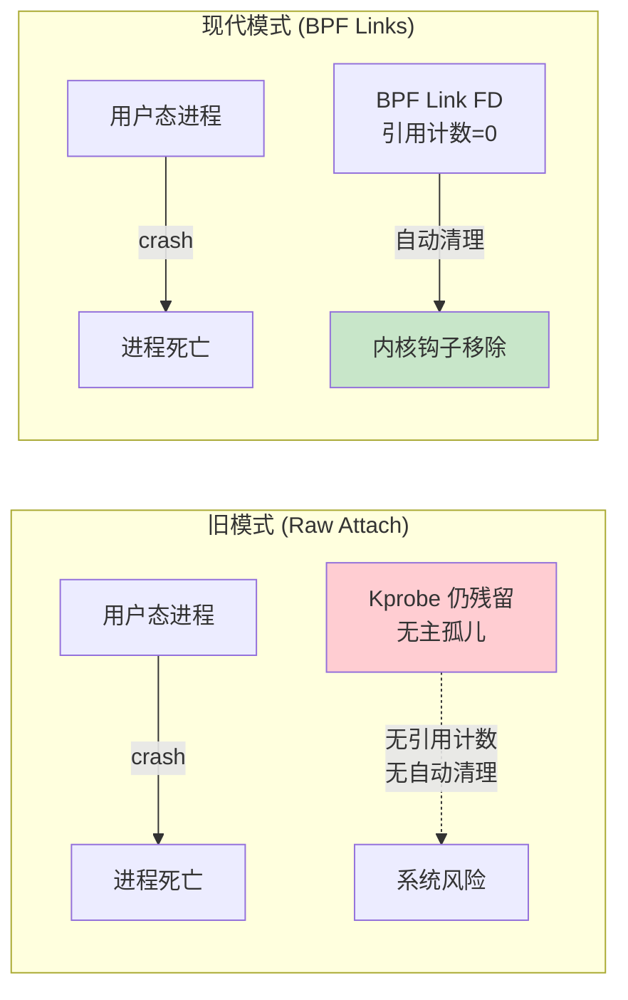
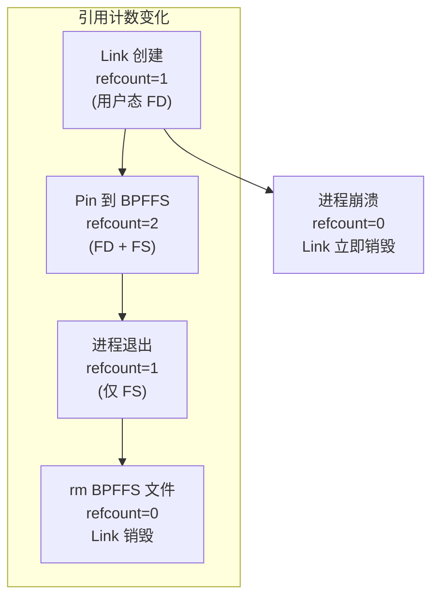
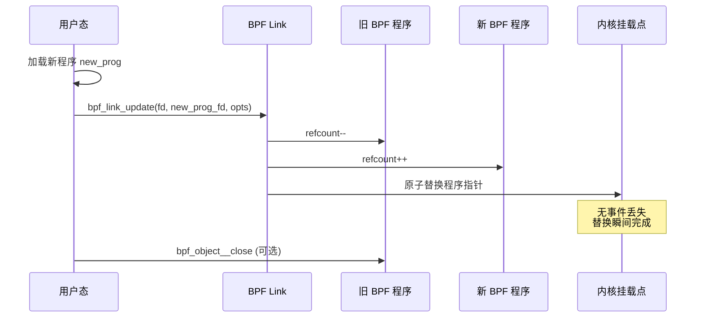
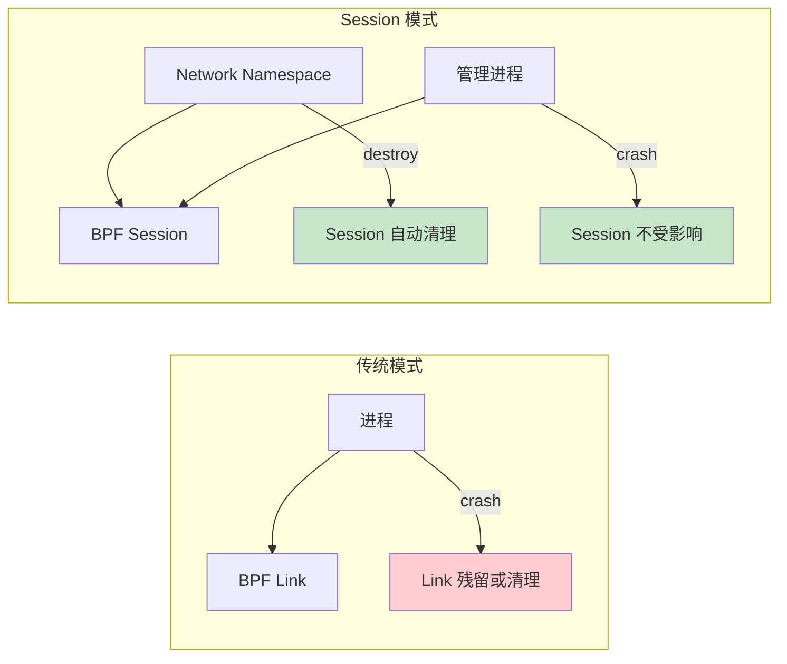

> [!info] eBPF 2026 深度探索系列 0. [[2026-04-08-ebpf-comprehensive-learning-roadmap|全栈学习路径总览]]
>
> 1. [[ch1-registers-and-instructions|第一章：寄存器与指令集]]
> 2. [[ch1-5-function-calls|第一.五章：四种函数调用与动态内存]]
> 3. [[ch1-6-the-verifier|第一.六章：验证器 (Verifier) 的底层逻辑]]
> 4. [[ch2-maps-and-communication|第二章：Map 机制与跨空间通信]]
> 5. [[ch2-5-kptr-and-ownership|第二.五代：kptr (内核指针) 与内存所有权模型]]
> 6. [[ch3-core-and-btf|第三章：CO-RE 与 BTF 的跨版本魔法]]
> 7. [[ch4-tracing-hooks-and-security|第四章：从 kprobe 到 LSM 的追踪全图景]]
> 8. [[ch7-5-uprobes-dynamic-tracing|第七.五章：uprobe 用户态动态追踪原理]]
> 9. [[ch7-6-bpftime-user-runtime|第七.六章：bpftime 与用户态 eBPF 加速]]
> 10. [[ch18-bpftime-injection-mastery|第七.七章：bpftime 自动化注入与全量监控实战]]
> 11. [[ch7-8-uprobe-selection-guide|第七.八章：uprobe 选型指南：内核态 vs 用户态]]
> 12. [[ch5-xdp-networking-performance|第五章：XDP 极致网络性能与全栈架构]]
> 13. [[ch6-tc-traffic-control|第六章：TC (Traffic Control) 流量调度艺术]]
> 14. [[ch7-security-lsm-enforcement|第七章：LSM BPF 从可观测到安全执法]]
> 15. [[ch8-advanced-tuning-and-profiling|第八章：进阶实战与内核调优]]
> 16. [[ch9-af-xdp-zero-copy|第九章：AF_XDP 零拷贝与用户态协议栈]]
> 17. [[ch10-sched-ext-custom-scheduler|第十章：sched_ext 自定义 CPU 调度器]]
> 18. [[ch11-bpf-iterators|第十一章：BPF Iterators 内核对象迭代器]]
> 19. [[ch12-kfuncs-evolution|第十二章：kfuncs 下一代内核交互标准]]
> 20. [[ch13-usdt-tracing|第十三章：USDT 用户态静态定义追踪]]
> 21. [[ch14-ai-llm-inference-monitoring|第十四章：AI 推理与大模型监控前沿]]
> 22. [[ch15-container-isolation|第十五章：无感增强容器隔离性]]
> 23. [[ch16-ebpf-and-wasm|第十六章：eBPF 与 WebAssembly (WASM) 的共生架构]]
> 24. [[ch17-storage-and-filesystem|第十七章：存储与文件系统加速]]
> 25. **第十八章：生命周期管理与 BPF Links**
> 26. [[ch19-atomic-updates-and-hot-upgrade|第十九章：程序的原子更新与蓝绿部署]]
> 27. [[ch25-5-stack-trace-correlation|第二五.五章：调用栈与业务请求的深度绑定]]
> 28. [[ch20-edge-iot-acceleration|第二十章：边缘计算与工业协议加速]]
> 29. [[ch21-debugging-and-verifier|第二十一章：调试实战与验证器 (Verifier) 诊断]]
> 30. [[ch22-testing-and-ci-cd|第二十二章：测试与持续集成 (CI/CD) 实战]]
> 31. [[ch23-security-and-permissions|第二十三章：权限细分与 BPF 安全沙箱]]
> 32. [[ch24-meta-monitoring-and-self-healing|第二十四章：eBPF 程序的内核自愈与监控]]
> 33. [[ch25-full-stack-observability|第二十五章：全栈可观测性与端到端追踪]]
> 34. [[ch26-network-security-high-level|第二十六章：网络安全防御的高阶实战]]
> 35. [[ch27-agent-engineering-architecture|第二十七章：工业级模块化 Agent 架构演进]]
> 36. [[ch28-offensive-and-defensive|第二十八章：攻防博弈与 Rootkit 防御]]
> 37. [[ch29-networking-deep-dive|第二十九章：网络应用深水区——负载均衡、Sockmap 与拥塞控制]]
> 38. [[ch30-hardware-offload|第三十章：硬件卸载与 SmartNIC 实战]]
> 39. [[ch31-signed-objects-and-security|第三十一章：内核原生签名与供应链安全]]
> 40. [[ch32-ebpf-for-windows|第三十二章：跨平台崛起——eBPF for Windows]]
> 41. [[ch32-5-macos-status|第三十二.五章：macOS 的特殊路径]]
> 42. [[ch33-serverless-optimization|第三十三章：Serverless 冷启动消除与动态计费]]
> 43. [[ch34-waf-and-rasp|第三十四章：Web 安全革命——内核态 WAF 与 RASP]]
> 44. [[ch35-npu-tpu-ai-hardware|第三十五章：AI 推理硬件 (NPU/TPU) 与硬件定义内核]]
> 45. [[ch36-dynamic-language-introspection|第三十六章：动态语言感知——业务对象的零代码提取]]
> 46. [[ch37-green-computing|第三十七章：绿色计算与能耗精准归因]]
> 47. [[ch38-ecosystem-and-career|第三十八章：2026 生态全景与工程师职业导航]]
> 48. [[ch39-rust-aya-framework|第三十九章：Rust eBPF 开发实战——Aya 框架与安全编程]]
> 49. [[ch40-network-protocols-deep-dive|第四十章：网络协议深度解析——TCP/UDP/QUIC 的 eBPF 视角]]
> 50. [[ch41-memory-safety-and-vulnerabilities|第四十一章：eBPF 内存安全与漏洞分析]]
> 51. [[ch42-service-mesh-integration|第四十二章：eBPF 与 Service Mesh 深度集成]]

---

# 第十八章：生命周期管理与 BPF Links

## 1. 概述：解决"僵尸探针"噩梦

在 eBPF 的工业化部署中，程序的加载与卸载必须具备极致的确定性。早期的挂载机制由于缺乏所有权绑定，经常导致用户态加载进程崩溃后，BPF 程序依然残留在内核中运行，造成不可控的系统风险。

**BPF Links** 的引入，彻底解决了这一运维痛点。它将"程序"与"挂载点"的绑定关系转化为一个受内核管控的对象。



---

## 2. BPF Link 类型详解

### 2.1 Link 类型矩阵

| Link 类型             | 挂载目标                | 内核版本 | 自动清理 | 原子更新 |
| :-------------------- | :---------------------- | :------- | :------- | :------- |
| `bpf_link` (raw)      | kprobe/kretprobe        | 5.7+     | 是       | 是       |
| `bpf_tracing_link`    | fentry/fexit/tracepoint | 5.11+    | 是       | 是       |
| `bpf_xdp_link`        | XDP (per-if)            | 5.7+     | 是       | 是       |
| `bpf_cgroup_link`     | cgroup                  | 5.15+    | 是       | 是       |
| `bpf_netns_link`      | network namespace       | 5.15+    | 是       | 是       |
| `bpf_iter_link`       | BPF iterator            | 5.9+     | 是       | 否       |
| `bpf_struct_ops_link` | struct_ops              | 6.0+     | 是       | 否       |

### 2.2 各类型 Link 代码示例

```c
// === 1. Tracing Link (fentry) ===
struct bpf_link *trace_link = bpf_program__attach_trace(
    prog,        // BPF 程序
    NULL         // target (NULL = 自动解析)
);

// === 2. XDP Link ===
struct bpf_link *xdp_link = bpf_program__attach_xdp(
    prog,
    ifindex      // 网卡接口索引
);

// === 3. Cgroup Link ===
struct bpf_link *cg_link = bpf_program__attach_cgroup(
    prog,
    cgroup_fd    // cgroup 文件描述符
);

// === 4. Netns Link ===
struct bpf_link *netns_link = bpf_program__attach_netns(
    prog,
    netns_fd     // network namespace FD
);

// 通用操作：pin 到文件系统实现持久化
bpf_link__pin(trace_link, "/sys/fs/bpf/my_trace_link");
```

---

## 3. 核心机制：FD 引用计数与自动清理

### 3.1 引用计数模型



### 3.2 内核内部实现

```c
// 内核中 BPF Link 的核心结构（简化版）
struct bpf_link {
    atomic64_t refcnt;       // 引用计数器
    const struct bpf_link_ops *ops;  // 操作函数集
    struct bpf_prog *prog;   // 关联的 BPF 程序
    enum bpf_prog_type type; // 程序类型
    bool pinned;             // 是否已 pin 到 BPFFS
};

// 引用计数操作
void bpf_link_inc(struct bpf_link *link) {
    atomic64_inc(&link->refcnt);
}

// 释放引用，当 refcount=0 时触发清理
void bpf_link_put(struct bpf_link *link) {
    if (atomic64_dec_and_test(&link->refcnt)) {
        link->ops->release(link);  // 释放特定资源
        bpf_prog_put(link->prog);  // 释放程序引用
        kfree(link);               // 释放 Link 对象
    }
}
```

### 3.3 旧模式 vs 现代模式对比

| 特性                 | 旧模式 (Raw Attach)    | 现代模式 (BPF Links)              |
| :------------------- | :--------------------- | :-------------------------------- |
| **挂载稳定性**       | 易冲突，难管理         | 对象化管理，可追踪                |
| **容错性**           | 加载器崩溃后程序残留   | 加载器崩溃后自动卸载              |
| **原子更新**         | 需先卸后挂，存在断流期 | 支持 `bpf_link_update` 原子热更新 |
| **多程序同一挂载点** | 后挂覆盖前挂（不确定） | 多 Link 共存，按优先级            |
| **可观测性**         | `bpftool prog show`    | `bpftool link show`               |
| **权限模型**         | `CAP_SYS_ADMIN`        | `CAP_BPF` (部分类型)              |

---

## 4. 持久化管理：Pinning 机制

### 4.1 BPFFS (BPF 文件系统)

```bash
# 挂载 BPFFS（通常系统已自动挂载）
mount -t bpf bpf /sys/fs/bpf

# 目录结构
/sys/fs/bpf/
├── my_xdp_link          # XDP Link
├── my_trace_link        # Tracing Link
├── maps/
│   ├── conn_track_map   # Hash Map
│   └── stats_map        # Per-CPU Array
└── progs/
    └── firewall_v2      # BPF 程序
```

### 4.2 Pinning 代码

```c
// === 加载并 Pin BPF 程序 ===
struct bpf_object *obj;
int err;

// 加载 BPF 对象
err = bpf_object__open_file("firewall.o", NULL);
err = bpf_object__load(obj);

// Pin Map（Map 需要持久化以保持数据）
struct bpf_map *map = bpf_object__find_map_by_name(obj, "conn_track");
bpf_map__pin(map, "/sys/fs/bpf/maps/conn_track");

// Pin Link（Link pin 后进程退出也不会卸载）
struct bpf_link *link = bpf_program__attach_xdp(prog, ifindex);
bpf_link__pin(link, "/sys/fs/bpf/my_xdp_link");

// === 恢复已 Pin 的 Link ===
struct bpf_link *restored_link = bpf_link__open("/sys/fs/bpf/my_xdp_link");
// 更新为新版程序
bpf_link__update_program(restored_link, new_prog);
```

### 4.3 管理命令

```bash
# 查看所有 BPF Links
bpftool link show

# 查看 BPF Maps
bpftool map show pinned /sys/fs/bpf/maps/

# 卸载（删除 pin 文件）
rm /sys/fs/bpf/my_xdp_link
# 或使用 bpftool
bpftool link pin id <LINK_ID> path /sys/fs/bpf/my_xdp_link
bpftool link detach id <LINK_ID>

# 查看 pinned 程序
bpftool prog show pinned /sys/fs/bpf/progs/

# 批量查看
bpftool link show -j | jq '.[] | {type, id, prog_id, pinned}'
```

---

## 5. 原子热更新

### 5.1 bpf_link_update 机制



### 5.2 原子更新代码

```c
int atomic_hot_update(const char *link_path, const char *new_prog_path) {
    // 1. 打开已 pin 的 Link
    struct bpf_link *link = bpf_link__open(link_path);
    if (!link) return -errno;

    // 2. 加载新版 BPF 程序
    struct bpf_object *new_obj;
    int err = bpf_object__open_file(new_prog_path, NULL);
    if (err) goto cleanup;

    err = bpf_object__load(new_obj);
    if (err) goto cleanup;

    struct bpf_program *new_prog = bpf_object__find_program_by_name(
        new_obj, "firewall");
    if (!new_prog) goto cleanup;

    // 3. 原子替换（内核保证不丢失事件）
    LIBBPF_OPTS(bpf_link_update_opts, opts,
        .old_prog_fd = bpf_program__fd(bpf_link__program(link)),
        .flags = BPF_F_REPLACE,
    );

    err = bpf_link__update_program(link, new_prog);
    if (err) {
        fprintf(stderr, "Update failed: %s\n", strerror(-err));
        goto cleanup;
    }

    printf("Atomic update succeeded!\n");

cleanup:
    bpf_link__destroy(link);
    bpf_object__close(new_obj);
    return err;
}
```

### 5.3 更新策略选择

| 策略           | 方法                       | 断流时间 | 复杂度 |
| :------------- | :------------------------- | :------- | :----- |
| **原子替换**   | `bpf_link_update`          | 0ns      | 低     |
| **蓝绿部署**   | 两个 Link + 路由切换       | ~1μs     | 中     |
| **金丝雀发布** | Per-CPU 逐步替换           | 渐进     | 高     |
| **回滚**       | 恢复旧版 `bpf_link_update` | 0ns      | 低     |

---

## 6. 批量管理与运维

### 6.1 批量查询脚本

```bash
#!/bin/bash
# list_all_bpf.sh - 列出所有活跃的 BPF 程序和 Links

echo "=== BPF Programs ==="
bpftool prog show --json | jq -r '.[] |
  "\(.id)\t\(.type)\t\(.name)\t\(.tag)\t\(.run_cnt // 0) runs"'

echo -e "\n=== BPF Links ==="
bpftool link show --json | jq -r '.[] |
  "\(.id)\t\(.type)\t\(.prog_id)\t\(.pinned // "unpinned")"'

echo -e "\n=== Pinned Maps ==="
find /sys/fs/bpf -type f -name "*_map" 2>/dev/null | while read f; do
    echo "$f: $(stat -c %s $f) bytes"
done
```

### 6.2 健康检查

```c
// 定期检查 Link 状态
int check_link_health(int link_fd) {
    struct bpf_link_info info = {};
    __u32 len = sizeof(info);

    int err = bpf_obj_get_info_by_fd(link_fd, &info, &len);
    if (err) return -errno;

    // 检查 Link 是否仍然活跃
    if (info.type == BPF_LINK_TYPE_UNSPEC) {
        printf("WARNING: Link is detached!\n");
        return -1;
    }

    printf("Link OK: type=%d, prog_id=%d, run_cnt=%llu\n",
           info.type, info.prog_id, info.run_cnt);
    return 0;
}
```

---

## 7. 自动恢复机制

### 7.1 Watchdog 设计

```c
// BPF Link watchdog 线程
void *link_watchdog(void *arg) {
    const char *link_path = (const char *)arg;
    int retry = 0;
    const int max_retry = 3;

    while (1) {
        sleep(5);  // 每 5 秒检查一次

        struct bpf_link *link = bpf_link__open(link_path);
        if (!link) {
            if (retry < max_retry) {
                fprintf(stderr, "Link lost, attempting recovery (%d/%d)\n",
                        retry + 1, max_retry);
                if (reload_and_pin(link_path) == 0) {
                    retry = 0;
                    continue;
                }
            }
            retry++;
            continue;
        }

        // Link 存在，检查运行计数
        struct bpf_link_info info = {};
        __u32 len = sizeof(info);
        bpf_obj_get_info_by_fd(bpf_link__fd(link), &info, &len);

        if (info.run_cnt == prev_run_cnt) {
            fprintf(stderr, "WARNING: Link appears stuck (run_cnt unchanged)\n");
        }
        prev_run_cnt = info.run_cnt;

        bpf_link__destroy(link);
        retry = 0;
    }
}
```

### 7.2 systemd 集成

```ini
# /etc/systemd/system/bpf-firewall.service
[Unit]
Description=BPF Firewall Service
After=network.target
Requires=sys-fs-bpf.mount

[Service]
Type=notify
ExecStart=/usr/bin/bpf-firewall --config /etc/bpf/firewall.yaml
ExecReload=/bin/kill -HUP $MAINPID
Restart=on-failure
RestartSec=5

# 自动清理 BPFFS 中的残留
ExecStopPost=/usr/bin/bpf-cleanup /sys/fs/bpf/firewall/

[Install]
WantedBy=multi-user.target
```

---

## 8. BPF Sessions 与自动清理

### 8.1 BPF Sessions 概念

Linux 6.12 引入了 BPF Sessions 机制，为 BPF 程序提供了独立于进程的生命周期管理。Session 关联到特定的内核子系统（如网络命名空间），当子系统销毁时自动清理关联的 BPF 资源：

```c
// BPF Session 使用示例
LIBBPF_OPTS(bpf_prog_attach_opts, opts);
opts.flags = BPF_F_SESSION;

// 附加到特定 network namespace
int err = bpf_prog_attach(prog_fd, netns_fd,
                          BPF_CGROUP_INET_INGRESS, opts);
```



### 8.2 Session vs Pin 对比

| 维度             | Pin (BPFFS)           | BPF Sessions         |
| :--------------- | :-------------------- | :------------------- |
| **生命周期绑定** | 文件系统              | 内核对象（如 netns） |
| **清理触发**     | 手动 `rm` 或 `umount` | 内核对象销毁时自动   |
| **适用场景**     | 全局服务              | 命名空间级服务       |
| **管理复杂度**   | 低（文件操作）        | 中（需理解子系统）   |
| **内核要求**     | 4.x+                  | 6.12+                |

---

## 9. 常见问题 FAQ

**Q1：BPF Link 和 BPF Program 的 FD 有什么区别？**

A：BPF Program FD 引用的是程序本身（字节码 + JIT 代码），关闭它只是释放程序对象。BPF Link FD 引用的是"程序与挂载点的绑定关系"，关闭它会导致程序从挂载点卸载。一个程序可以被多个 Link 引用，只有当所有 Link 和程序 FD 都关闭后，程序才会真正从内核中移除。

**Q2：Pin 的 Link 文件被误删会怎样？**

A：如果用户态进程仍持有 Link FD，Link 不会销毁。如果进程已退出且 pin 文件被删除，Link 引用计数归零，程序会立即从内核中卸载。这就是为什么 pin 文件应该设置适当的权限（如 `chmod 600`），防止误删。

**Q3：`bpf_link_update` 失败时旧程序还在运行吗？**

A：是的。`bpf_link_update` 是原子操作：要么成功（新程序替换旧程序），要么失败（旧程序继续运行）。不会出现中间状态。失败时需要检查错误码，常见原因包括：新程序验证失败、程序类型不匹配、或 Link 不支持更新。

**Q4：如何实现零停机的多版本灰度发布？**

A：推荐使用 BPF 的 Freplace（Freplace BPF Link）功能。在原始程序中预留 `bpf_helper_call` 占位点，然后通过 Freplace Link 注入不同版本的实现。不同 cgroup 可以挂载不同版本的 Freplace Link，实现 per-cgroup 灰度。

**Q5：BPF Link 的性能开销是多少？**

A：BPF Link 本身的运行时开销几乎为零（仅多一次指针解引用）。创建和销毁 Link 的开销约为 1-5μs。相比 raw attach，Link 模式唯一的额外开销是 pin/unpin 操作涉及文件系统交互，但这只在加载/卸载时发生，不影响数据面性能。
