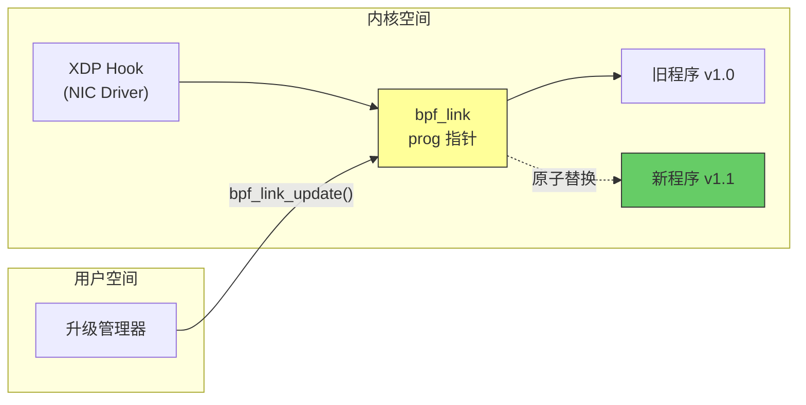
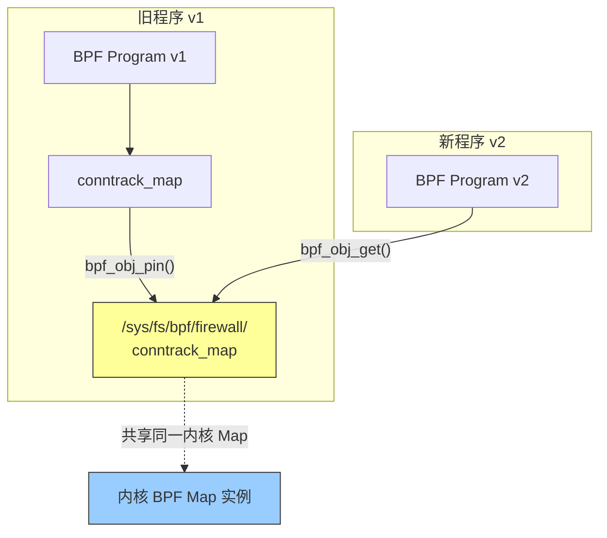
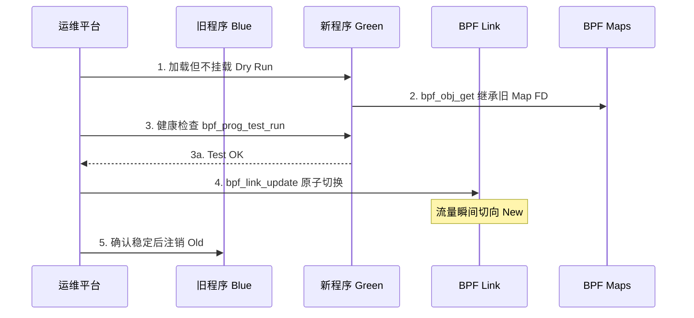
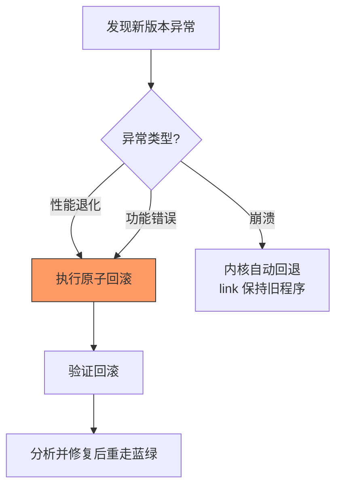
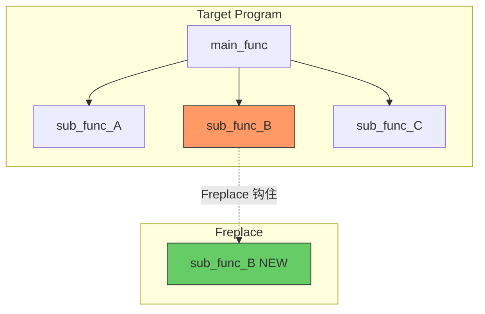
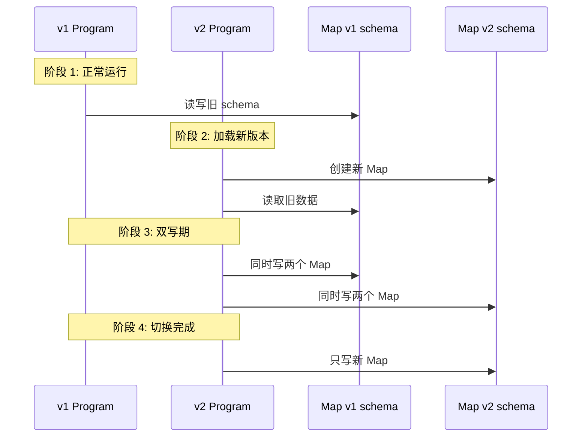

> [!info] eBPF 2026 深度探索系列 0. [[2026-04-08-ebpf-comprehensive-learning-roadmap|全栈学习路径总览]]
>
> 1. [[ch1-registers-and-instructions|第一章：寄存器与指令集]]
> 2. [[ch1-5-function-calls|第一.五章：四种函数调用与动态内存]]
> 3. [[ch1-6-the-verifier|第一.六章：验证器 (Verifier) 的底层逻辑]]
> 4. [[ch2-maps-and-communication|第二章：Map 机制与跨空间通信]]
> 5. [[ch2-5-kptr-and-ownership|第二.五章：kptr (内核指针) 与内存所有权模型]]
> 6. [[ch3-core-and-btf|第三章：CO-RE 与 BTF 的跨版本魔法]]
> 7. [[ch4-tracing-hooks-and-security|第四章：从 kprobe 到 LSM 的追踪全图景]]
> 8. [[ch7-5-uprobes-dynamic-tracing|第七.五章：uprobe 用户态动态追踪原理]]
> 9. [[ch7-6-bpftime-user-runtime|第七.六章：bpftime 与用户态 eBPF 加速]]
> 10. [[ch18-bpftime-injection-mastery|第七.七章：bpftime 自动化注入与全量监控实战]]
> 11. [[ch7-8-uprobe-selection-guide|第七.八章：uprobe 选型指南：内核态 vs 用户态]]
> 12. [[ch5-xdp-networking-performance|第五章：XDP 极致网络性能与全栈架构]]
> 13. [[ch6-tc-traffic-control|第六章：TC (Traffic Control) 流量调度艺术]]
> 14. [[ch7-security-lsm-enforcement|第七章：LSM BPF 从可观测到安全执法]]
> 15. [[ch8-advanced-tuning-and-profiling|第八章：进阶实战与内核调优]]
> 16. [[ch9-af-xdp-zero-copy|第九章：AF_XDP 零拷贝与用户态协议栈]]
> 17. [[ch10-sched-ext-custom-scheduler|第十章：sched_ext 自定义 CPU 调度器]]
> 18. [[ch11-bpf-iterators|第十一章：BPF Iterators 内核对象迭代器]]
> 19. [[ch12-kfuncs-evolution|第十二章：kfuncs 下一代内核交互标准]]
> 20. [[ch13-usdt-tracing|第十三章：USDT 用户态静态定义追踪]]
> 21. [[ch14-ai-llm-inference-monitoring|第十四章：AI 推理与大模型监控前沿]]
> 22. [[ch15-container-isolation|第十五章：无感增强容器隔离性]]
> 23. [[ch16-ebpf-and-wasm|第十六章：eBPF 与 WebAssembly (WASM) 的共生架构]]
> 24. [[ch17-storage-and-filesystem|第十七章：存储与文件系统加速]]
> 25. [[ch18-lifecycle-and-links|第十八章：生命周期管理与 BPF Links]]
> 26. **第十九章：程序的原子更新与蓝绿部署**
> 27. [[ch25-5-stack-trace-correlation|第二五.五章：调用栈与业务请求的深度绑定]]
> 28. [[ch20-edge-iot-acceleration|第二十章：边缘计算与工业协议加速]]
> 29. [[ch21-debugging-and-verifier|第二十一章：调试实战与验证器 (Verifier) 诊断]]
> 30. [[ch22-testing-and-ci-cd|第二十二章：测试与持续集成 (CI/CD) 实战]]
> 31. [[ch23-security-and-permissions|第二十三章：权限细分与 BPF 安全沙箱]]
> 32. [[ch24-meta-monitoring-and-self-healing|第二十四章：eBPF 程序的内核自愈与监控]]
> 33. [[ch25-full-stack-observability|第二十五章：全栈可观测性与端到端追踪]]
> 34. [[ch26-network-security-high-level|第二十六章：网络安全防御的高阶实战]]
> 35. [[ch27-agent-engineering-architecture|第二十七章：工业级模块化 Agent 架构演进]]
> 36. [[ch28-offensive-and-defensive|第二十八章：攻防博弈与 Rootkit 防御]]
> 37. [[ch29-networking-deep-dive|第二十九章：网络应用深水区——负载均衡、Sockmap 与拥塞控制]]
> 38. [[ch30-hardware-offload|第三十章：硬件卸载与 SmartNIC 实战]]
> 39. [[ch31-signed-objects-and-security|第三十一章：内核原生签名与供应链安全]]
> 40. [[ch32-ebpf-for-windows|第三十二章：跨平台崛起——eBPF for Windows]]
> 41. [[ch32-5-macos-status|第三十二.五章：macOS 的特殊路径]]
> 42. [[ch33-serverless-optimization|第三十三章：Serverless 冷启动消除与动态计费]]
> 43. [[ch34-waf-and-rasp|第三十四章：Web 安全革命——内核态 WAF 与 RASP]]
> 44. [[ch35-npu-tpu-ai-hardware|第三十五章：AI 推理硬件 (NPU/TPU) 与硬件定义内核]]
> 45. [[ch36-dynamic-language-introspection|第三十六章：动态语言感知——业务对象的零代码提取]]
> 46. [[ch37-green-computing|第三十七章：绿色计算与能耗精准归因]]
> 47. [[ch38-ecosystem-and-career|第三十八章：2026 生态全景与工程师职业导航]]
> 48. [[ch39-rust-aya-framework|第三十九章：Rust eBPF 开发实战——Aya 框架与安全编程]]
> 49. [[ch40-network-protocols-deep-dive|第四十章：网络协议深度解析——TCP/UDP/QUIC 的 eBPF 视角]]
> 50. [[ch41-memory-safety-and-vulnerabilities|第四十一章：eBPF 内存安全与漏洞分析]]
> 51. [[ch42-service-mesh-integration|第四十二章：eBPF 与 Service Mesh 深度集成]]

---

## 1. 概述：追求零宕机的更新

在 2026 年的高可用生产环境中，eBPF 程序往往承载着核心网络（XDP）或安全防御（LSM）逻辑。传统的"先卸载、后加载"模式会产生毫秒级的真空期，导致丢包或防御失效。

**热更新 (Hot Upgrade)** 技术确保了在更新 BPF 逻辑时，系统能够无缝切换，实现真正的"零丢包、数据不丢、逻辑不断"。

### 1.1 为什么需要原子更新

在电信级和金融级场景下，eBPF 程序承担着数据面关键路径的职责：

| 场景            | 程序类型           | 中断后果                   | 恢复难度 |
| --------------- | ------------------ | -------------------------- | -------- |
| 5G UPF 流量转发 | XDP/TC             | 数据面中断，影响百万级用户 | 秒级     |
| DDoS 防御       | XDP + TC           | 攻击流量直接穿透到后端     | 分钟级   |
| 微服务 mTLS     | SOCKMAP/CGROUP_SKB | 服务间通信中断             | 秒级     |
| 容器网络策略    | CGROUP_SKB         | 跨命名空间流量异常         | 分钟级   |
| 全链路追踪      | kprobe/uprobe      | 追踪数据断档，影响 SLI     | 分钟级   |

### 1.2 三种更新模式对比


模式 A 的"真空期"在高吞吐场景下意味着数百万个数据包被错误处理。模式 B 避免了真空期，但需要管理多个并存的 Link 对象。模式 C 利用内核 RCU 机制，实现了真正的零中断切换。

---

## 2. 原子切换：bpf_link_update

基于第十八章学习的 BPF Links，内核提供了一个原子更替接口。

### 2.1 底层原理

内核在处理挂载点时，通过一个 Link 对象作为中间层。`bpf_link_update` 操作可以在内核内部利用 RCU 机制，将 Link 指向的 BPF 程序指针从 A 瞬间修改为 B。



**核心特性**：

- **原子性**：内核通过 `rcu_assign_pointer` 完成指针替换，保证任意 CPU 上不会观测到中间状态
- **安全性**：支持 `expected_prog_fd` 参数（CAS 语义），防止并发环境下的误覆盖
- **向后兼容**：仅替换程序逻辑，Map 引用和 Link 生命周期完全不受影响

### 2.2 系统调用接口

```c
// 用户空间 API (libbpf)
LIBBPF_API int bpf_link_update(int link_fd, int new_prog_fd,
                                const struct bpf_link_update_opts *opts);

struct bpf_link_update_opts {
    size_t sz;              // 必须设为 sizeof(*opts)
    __u32 old_prog_fd;      // 期望的旧程序 FD (可选，0 = 不检查)
    __u32 flags;            // 预留标志位
};

// 内核侧核心逻辑 (简化)
int bpf_link_update(struct bpf_link *link, struct bpf_prog *new_prog,
                    struct bpf_prog *old_prog) {
    if (old_prog && link->prog != old_prog)
        return -EBUSY;       // CAS 失败
    old_prog = xchg(&link->prog, new_prog);
    bpf_prog_put(old_prog);
    return 0;
}
```

### 2.3 完整原子热升级示例

```c
// hot_upgrade.c - 完整的原子热升级
#include <bpf/libbpf.h>
#include <bpf/bpf.h>
#include <stdio.h>
#include <errno.h>

#define BPF_OBJ_NEW   "firewall_v2.o"
#define MAP_PIN_PATH  "/sys/fs/bpf/firewall_state"

int perform_atomic_upgrade(int current_link_fd, int current_prog_fd) {
    struct bpf_object *new_obj = NULL;
    struct bpf_program *new_prog = NULL;
    struct bpf_map *state_map = NULL;
    int err;

    // Step 1: 打开新 BPF 对象（不加载）
    new_obj = bpf_object__open_file(BPF_OBJ_NEW, NULL);
    if (libbpf_get_error(new_obj))
        return -errno;

    // Step 2: Map 继承 — 用旧 Map 的 FD 替换新对象中的同名 Map
    state_map = bpf_object__find_map_by_name(new_obj, "conntrack_map");
    if (state_map) {
        int old_map_fd = bpf_obj_get(MAP_PIN_PATH);
        if (old_map_fd >= 0) {
            bpf_map__reuse_fd(state_map, old_map_fd);
            close(old_map_fd);
        }
    }

    // Step 3: 加载新程序（完成 Verifier 验证和 JIT 编译，但不挂载）
    err = bpf_object__load(new_obj);
    if (err) goto cleanup;

    // Step 4: 获取新程序并执行原子更替
    new_prog = bpf_object__find_program_by_name(new_obj, "firewall_filter");
    if (!new_prog) { err = -ENOENT; goto cleanup; }

    struct bpf_link_update_opts opts = {
        .sz = sizeof(opts),
        .old_prog_fd = current_prog_fd,  // CAS 防护
    };

    err = bpf_link_update(current_link_fd, bpf_program__fd(new_prog), &opts);
    if (err) {
        fprintf(stderr, "Atomic update failed: %s\n", strerror(-err));
        goto cleanup;
    }

    printf("Hot upgrade completed: zero downtime\n");
    return 0;

cleanup:
    if (err) bpf_object__close(new_obj);
    return err;
}
```

### 2.4 不同程序类型的 Link 更新支持

| 程序类型         | 原子更新支持 | 内核版本 | 备注                         |
| ---------------- | ------------ | -------- | ---------------------------- |
| XDP              | 完整支持     | 5.7+     | 最常用场景                   |
| TC (cls_bpf)     | 完整支持     | 5.7+     | 替代传统 `tc filter replace` |
| kprobe/kretprobe | 完整支持     | 5.7+     | 追踪场景                     |
| cgroup/skb       | 完整支持     | 5.7+     | 容器网络策略                 |
| LSM              | 完整支持     | 6.2+     | 安全钩子                     |
| fentry/fexit     | 完整支持     | 5.5+     | BPF-to-BPF 调用              |
| flow_dissector   | 完整支持     | 5.7+     | 流量分发                     |

> [!warning] 重要提示
> 只有通过 `bpf_program__attach_xxx()` 创建的 Link 才支持 `bpf_link_update`。使用传统 `bpf_prog_attach()` 或 Netlink/TC 命令行方式挂载的程序，必须先迁移到 Link 模式。

---

## 3. 数据连续性：Map 继承技术

更新程序时，如果新程序启动了全新的 Map，会导致历史统计数据清零。2026 年的主流对策如下。

### 3.1 路径持久化 (Pinning)



**流程**：旧程序将 Map 钉在 `/sys/fs/bpf/` 下（libbpf 的 `bpf_object__pin_maps()` 自动完成），新程序通过 `bpf_obj_get` 打开该路径，直接复用原有内存空间。

```c
// libbpf 自动 Pin 配置 — 同名 Map 自动复用
struct bpf_object_open_opts opts = {
    .pin_root_path = "/sys/fs/bpf/firewall",
};
struct bpf_object *obj = bpf_object__open_file("firewall.o", &opts);
// 内部流程: 解析 ELF -> 检查 pin_root_path 下同名 pin -> bpf_map__reuse_fd()
```

### 3.2 FD 跨进程传递

通过 Unix Domain Socket 配合 `SCM_RIGHTS` 标志位传递 Map FD。核心代码：

```c
// 通过 SCM_RIGHTS 传递 Map FD (发送端)
struct msghdr msg = {};
char cmsgbuf[CMSG_SPACE(sizeof(int))];
struct cmsghdr *cmsg = CMSG_FIRSTHDR(&msg);
cmsg->cmsg_level = SOL_SOCKET;
cmsg->cmsg_type = SCM_RIGHTS;      // 传递 FD
cmsg->cmsg_len = CMSG_LEN(sizeof(int));
memcpy(CMSG_DATA(cmsg), &map_fd, sizeof(int));
sendmsg(sock_fd, &msg, 0);

// 接收端通过 recvmsg() + CMSG_DATA() 获取 map_fd
```

**优势**：不依赖文件系统，适合高度受限的容器沙箱。但 FD 仅在接收进程生命周期内有效。

### 3.3 Map 兼容性矩阵

| Map 类型                 | 直接复用 | 风险点                            |
| ------------------------ | -------- | --------------------------------- |
| `HASH` / `LRU_HASH`      | 直接复用 | 仅在 key/value 大小变化时需要迁移 |
| `ARRAY` / `PERCPU_ARRAY` | 直接复用 | 数组大小不可变                    |
| `RINGBUF`                | 需要新建 | 旧 ringbuf 未读数据丢失           |
| `PERF_EVENT_ARRAY`       | 需要新建 | 事件 buffer 不可跨程序共享        |
| `BLOOM_FILTER`           | 需要重建 | 新旧状态不兼容                    |

> [!tip] Schema 迁移策略
> 当 Map value 结构体新增字段时，推荐 **双写 + 后台迁移**：新程序同时写入新旧两个 Map，后台任务异步迁移旧数据，完成后切换并回收旧 Map。

---

## 4. 实战：蓝绿部署工作流 (Blue-Green Flow)



### 4.1 预热验证：bpf_prog_test_run

在切换前对新程序进行模拟测试：

```c
int preflight_check(int new_prog_fd, const void *pkt, size_t pkt_len) {
    __u32 size = pkt_len, retval = 0, duration = 0;
    int repeat = 10000;

    int err = bpf_prog_test_run(new_prog_fd, repeat,
                                pkt, &size, NULL, NULL,
                                &retval, &duration);
    if (err) return err;

    printf("  retval: %u  avg_ns: %u  out_size: %u\n",
           retval, duration / repeat, size);
    return 0;
}
```

### 4.2 蓝绿部署脚本

```bash
#!/bin/bash
set -euo pipefail
PIN_PATH="/sys/fs/bpf/firewall"
LINK_PIN="${PIN_PATH}/xdp_link"

echo "=== Step 1: Load new program (Green) ==="
bpftool prog load "firewall_v2.o" /sys/fs/bpf/firewall_new \
    pinmaps "${PIN_PATH}"

echo "=== Step 2: Verify ==="
NEW_ID=$(bpftool prog show name xdp_firewall -j | jq '.[0].id')
echo "New program ID: $NEW_ID"

echo "=== Step 3: Atomic swap ==="
LINK_ID=$(bpftool link show pinned "${LINK_PIN}" -j | jq '.[0].id')
bpftool link update id "$LINK_ID" prog id "$NEW_ID"

echo "=== Step 4: Health check (2s) ==="
sleep 2
echo "=== Deployment complete ==="
```

### 4.3 回滚策略

蓝绿部署的核心优势：回滚与正向部署同样快。

```c
// 瞬间回滚 — 新版本 -> 旧版本
int rollback(int link_fd, int old_prog_fd, int new_prog_fd) {
    struct bpf_link_update_opts opts = {
        .sz = sizeof(opts),
        .old_prog_fd = new_prog_fd,  // CAS: 确认当前是新版本
    };
    int err = bpf_link_update(link_fd, old_prog_fd, &opts);
    if (err == -EBUSY) fprintf(stderr, "Rollback CAS failed\n");
    return err;
}
```



---

## 5. 高级场景：Freplace 函数级热替换

对于不需要替换整个程序的场景，**Freplace** (BPF Trampoline Replacement) 提供了更细粒度的热更新能力。

### 5.1 工作原理



### 5.2 Freplace 代码示例

```c
// target.c — 主程序中被替换的函数
__noinline int inspect_ip_header(void *data, void *data_end,
                                  struct ethhdr *eth) {
    // v1: 仅支持 IPv4
    struct iphdr *iph = (struct iphdr *)(eth + 1);
    if ((void *)(iph + 1) > data_end) return 0;
    return iph->protocol == IPPROTO_TCP;
}
```

```c
// freplace_v2.c — 替换程序
SEC("freplace/xdp_firewall")
int new_inspect_ip_header(void *data, void *data_end,
                           struct ethhdr *eth) {
    // v2: 增加 IPv6 支持
    if (eth->h_proto == bpf_htons(ETH_P_IPV6)) {
        struct ipv6hdr *ip6h = (struct ipv6hdr *)(eth + 1);
        if ((void *)(ip6h + 1) > data_end) return 0;
        return 1;
    }
    struct iphdr *iph = (struct iphdr *)(eth + 1);
    if ((void *)(iph + 1) > data_end) return 0;
    return iph->protocol == IPPROTO_TCP || iph->protocol == IPPROTO_UDP;
}
```

```c
// freplace_manager.c — 附加 Freplace
int attach_freplace(struct bpf_object *target_obj, const char *repl_path) {
    struct bpf_object *repl_obj = bpf_object__open_file(repl_path, NULL);
    if (libbpf_get_error(repl_obj)) return -errno;
    if (bpf_object__load(repl_obj)) { bpf_object__close(repl_obj); return -1; }

    struct bpf_program *prog =
        bpf_object__find_program_by_name(repl_obj, "new_inspect_ip_header");
    struct bpf_link *link = bpf_program__attach_freplace(prog,
        bpf_program__fd(bpf_object__find_program_by_name(target_obj, "xdp_firewall")),
        0);
    return libbpf_get_error(link);
}
```

### 5.3 Freplace vs 完整程序替换

| 维度     | bpf_link_update      | Freplace                 |
| -------- | -------------------- | ------------------------ |
| 粒度     | 整个 BPF 程序        | 单个 `__noinline` 函数   |
| 数据共享 | 需显式 Map 继承      | 自动共享目标 Maps        |
| 内核要求 | 5.7+                 | 5.10+                    |
| 性能开销 | 一次 trampoline 跳转 | 每个替换函数额外一次跳转 |
| 适用场景 | 大版本升级、架构变更 | Bug 修复、策略微调       |

---

## 6. Map 运行时迁移策略

当新旧版本 Map schema 不兼容时，需要运行时数据迁移。推荐**双 Map 过渡方案**：



```c
// map_migrate.c — Schema 迁移核心
struct conntrack_v1 { __be32 src_ip; __be32 dst_ip; __u64 bytes; };
struct conntrack_v2 {
    __be32 src_ip; __be32 dst_ip; __u64 bytes;
    __u64 packets;    // 新增
    __u64 last_seen;  // 新增
};

int migrate_map(int old_fd, int new_fd) {
    struct conntrack_v1 old; struct conntrack_v2 new;
    __u32 key = 0;
    while (bpf_map_get_next_key(old_fd, &key, &key) == 0) {
        if (bpf_map_lookup_elem(old_fd, &key, &old) < 0) continue;
        new.src_ip = old.src_ip; new.dst_ip = old.dst_ip;
        new.bytes = old.bytes; new.packets = 0; new.last_seen = 0;
        bpf_map_update_elem(new_fd, &key, &new, BPF_ANY);
    }
    return 0;
}
```

---

## 7. 生产环境最佳实践

### 7.1 金丝雀发布

大规模部署中一次性全量切换仍有风险，推荐蓝绿 + 金丝雀组合：

1. **Per-CPU 程序选择**：在 `fentry` 中读取 CPU ID，对特定 CPU 使用新逻辑
2. **Hash 分流**：基于五元组 hash，对特定比例流量应用新规则
3. **多 NIC 实例**：不同网卡接口使用不同版本

### 7.2 版本管理

在 BPF 程序中嵌入版本信息，便于运行时审计：

```c
SEC(".rodata")
static const struct {
    __u32 major, minor, patch;
    char git_hash[12];
    char description[64];
} __attribute__((used)) prog_version = {
    .major = 2, .minor = 1, .patch = 0,
    .git_hash = "a1b2c3d4e5f6",
    .description = "Add IPv6 extension header support",
};
```

### 7.3 常见陷阱

| 陷阱             | 现象                        | 解决方案                       |
| ---------------- | --------------------------- | ------------------------------ |
| Map FD 泄漏      | 升级后 FD 数量增加          | `bpf_object__close()` 确保释放 |
| 循环依赖更新     | A 依赖 B 的 Map，B 也依赖 A | 拓扑排序确定更新顺序           |
| Ringbuf 数据丢失 | 升级后丢失最近 N 秒数据     | 升级前 drain 旧 ringbuf        |
| 竞态条件覆盖     | 两进程同时更新同一 Link     | 始终使用 CAS 模式              |

---

## 8. FAQ

### Q1: bpf_link_update 和 bpf_prog_attach 有什么区别？

`bpf_prog_attach` 是传统方式，替换过程不是原子的，某些路径可能产生短暂程序未挂载状态。`bpf_link_update` 基于 RCU 保证指针替换的原子性，并支持 `expected_prog_fd` 的 CAS 语义防止并发竞态。

### Q2: 新程序在 bpf_link_update 时被拒绝怎么办？

`bpf_link_update` 之前新程序必须已通过 `bpf_object__load()` 成功加载（含 Verifier 验证和 JIT 编译）。如果 `bpf_link_update` 失败，Link 仍指向旧程序，不会产生中断。

### Q3: XDP 热更新会不会导致正在处理的包被丢弃？

不会。RCU 机制保证正在 CPU 上执行的旧程序实例会完整运行完毕（grace period），之后才切换到新程序。

### Q4: 容器环境中如何实现热更新？

使用特权 Sidecar 容器管理 BPF 生命周期，通过 Unix Domain Socket (`SCM_RIGHTS`) 传递 Map FD 给业务容器。Pinned Maps 放在 Host 持久化路径上。

### Q5: Freplace 的性能开销有多大？

增加一次函数指针间接跳转，约 2-5ns。XDP 场景（目标 <100ns/包）可忽略，但如果替换函数被每包多次调用需评估累积开销。

### Q6: 如何监控热更新成功率？

建议暴露 Prometheus 指标：`ebpf_upgrade_attempts_total`、`ebpf_upgrade_success_total`、`ebpf_upgrade_rollback_total`、`ebpf_upgrade_duration_seconds`（histogram）。

### Q7: 多程序有依赖关系时如何保证更新顺序？

使用**拓扑排序**确定依赖图，按拓扑逆序更新（先更新被依赖者，再更新依赖者）。Cilium 等项目由 Operator 管理此依赖图。

---

## 9. 总结

热更新是 eBPF 从"实验性工具"迈向"电信级基础设施"的关键一步。本章覆盖了完整链路：

1. **原子切换** (`bpf_link_update`)：基于 RCU 的指针替换，保证零中断
2. **数据连续性**：通过 Map Pinning 和 FD 传递确保状态不丢失
3. **蓝绿部署**：预热验证 + 原子切换 + 快速回滚的完整工作流
4. **Freplace**：函数级细粒度热替换，适合策略微调
5. **运行时迁移**：Schema 不兼容时的双 Map 过渡方案
6. **金丝雀发布**：渐进式流量切换，降低全量上线风险

掌握了原子切换与 Map 继承，就能在不干扰业务的前提下对内核逻辑进行无止境的在线迭代。Cilium、Katran、Cloudflare 等项目均依赖这套机制实现不停机更新。
