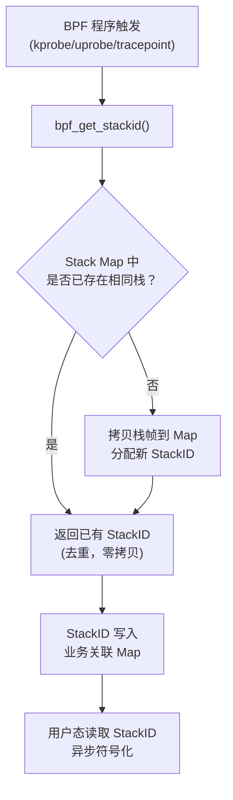
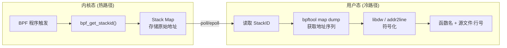
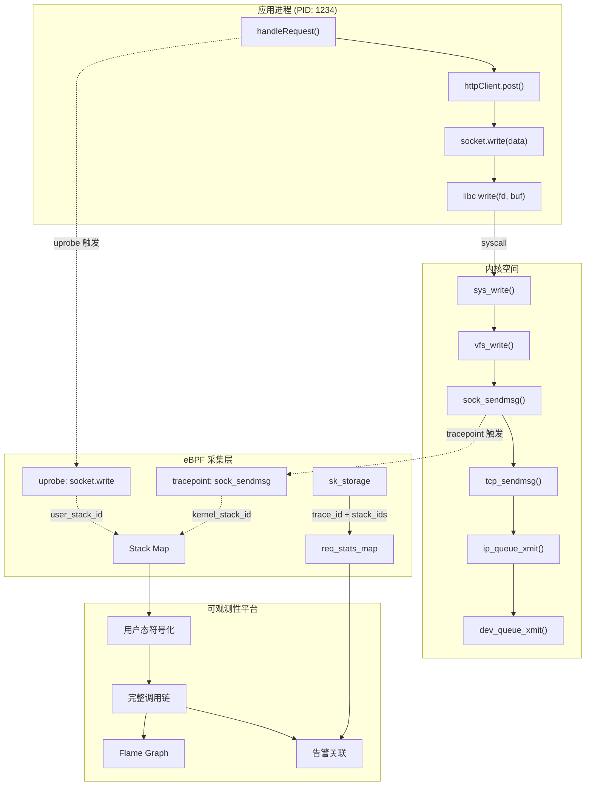
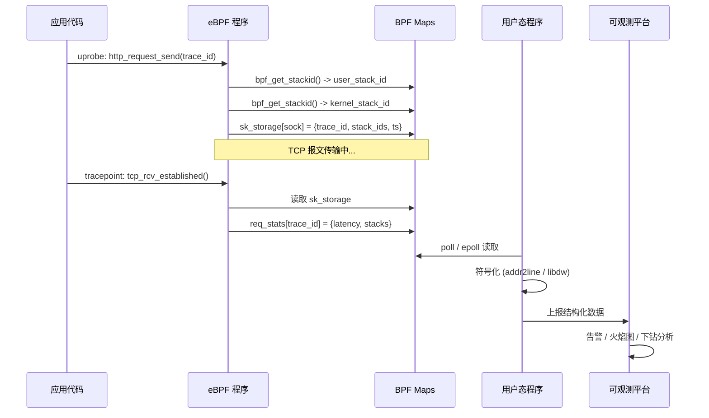
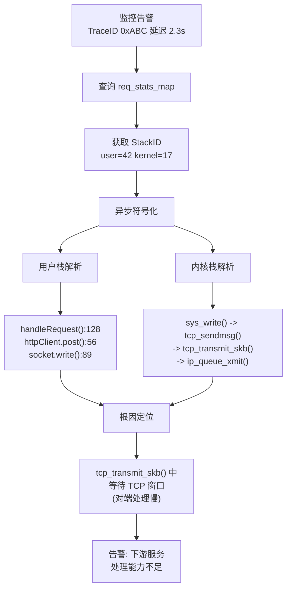

> [!info] eBPF 2026 深度探索系列 0. [[2026-04-08-ebpf-comprehensive-learning-roadmap|全栈学习路径总览]]
>
> 1. [[ch1-registers-and-instructions|第一章：寄存器与指令集]]
> 2. [[ch1-5-function-calls|第一.五章：四种函数调用与动态内存]]
> 3. [[ch1-6-the-verifier|第一.六章：验证器 (Verifier) 的底层逻辑]]
> 4. [[ch2-maps-and-communication|第二章：Map 机制与跨空间通信]]
> 5. [[ch2-5-kptr-and-ownership|第二.五章：kptr (内核指针) 与内存所有权模型]]
> 6. [[ch3-core-and-btf|第三章：CO-RE 与 BTF 的跨版本魔法]]
> 7. [[ch4-tracing-hooks-and-security|第四章：从 kprobe 到 LSM 的追踪全图景]]
> 8. [[ch7-5-uprobes-dynamic-tracing|第七.五章：uprobe 用户态动态追踪原理]]
> 9. [[ch7-6-bpftime-user-runtime|第七.六章：bpftime 与用户态 eBPF 加速]]
> 10. [[ch18-bpftime-injection-mastery|第七.七章：bpftime 自动化注入与全量监控实战]]
> 11. [[ch7-8-uprobe-selection-guide|第七.八章：uprobe 选型指南：内核态 vs 用户态]]
> 12. [[ch5-xdp-networking-performance|第五章：XDP 极致网络性能与全栈架构]]
> 13. [[ch6-tc-traffic-control|第六章：TC (Traffic Control) 流量调度艺术]]
> 14. [[ch7-security-lsm-enforcement|第七章：LSM BPF 从可观测到安全执法]]
> 15. [[ch8-advanced-tuning-and-profiling|第八章：进阶实战与内核调优]]
> 16. [[ch9-af-xdp-zero-copy|第九章：AF_XDP 零拷贝与用户态协议栈]]
> 17. [[ch10-sched-ext-custom-scheduler|第十章：sched_ext 自定义 CPU 调度器]]
> 18. [[ch11-bpf-iterators|第十一章：BPF Iterators 内核对象迭代器]]
> 19. [[ch12-kfuncs-evolution|第十二章：kfuncs 下一代内核交互标准]]
> 20. [[ch13-usdt-tracing|第十三章：USDT 用户态静态定义追踪]]
> 21. [[ch14-ai-llm-inference-monitoring|第十四章：AI 推理与大模型监控前沿]]
> 22. [[ch15-container-isolation|第十五章：无感增强容器隔离性]]
> 23. [[ch16-ebpf-and-wasm|第十六章：eBPF 与 WebAssembly (WASM) 的共生架构]]
> 24. [[ch17-storage-and-filesystem|第十七章：存储与文件系统加速]]
> 25. [[ch18-lifecycle-and-links|第十八章：生命周期管理与 BPF Links]]
> 26. [[ch19-atomic-updates-and-hot-upgrade|第十九章：程序的原子更新与蓝绿部署]]
> 27. **第二五.五章：调用栈与业务请求的深度绑定**
> 28. [[ch20-edge-iot-acceleration|第二十章：边缘计算与工业协议加速]]
> 29. [[ch21-debugging-and-verifier|第二十一章：调试实战与验证器 (Verifier) 诊断]]
> 30. [[ch22-testing-and-ci-cd|第二十二章：测试与持续集成 (CI/CD) 实战]]
> 31. [[ch23-security-and-permissions|第二十三章：权限细分与 BPF 安全沙箱]]
> 32. [[ch24-meta-monitoring-and-self-healing|第二十四章：eBPF 程序的内核自愈与监控]]
> 33. [[ch25-full-stack-observability|第二十五章：全栈可观测性与端到端追踪]]
> 34. [[ch26-network-security-high-level|第二十六章：网络安全防御的高阶实战]]
> 35. [[ch27-agent-engineering-architecture|第二十七章：工业级模块化 Agent 架构演进]]
> 36. [[ch28-offensive-and-defensive|第二十八章：攻防博弈与 Rootkit 防御]]
> 37. [[ch29-networking-deep-dive|第二十九章：网络应用深水区——负载均衡、Sockmap 与拥塞控制]]
> 38. [[ch30-hardware-offload|第三十章：硬件卸载与 SmartNIC 实战]]
> 39. [[ch31-signed-objects-and-security|第三十一章：内核原生签名与供应链安全]]
> 40. [[ch32-ebpf-for-windows|第三十二章：跨平台崛起——eBPF for Windows]]
> 41. [[ch32-5-macos-status|第三十二.五章：macOS 的特殊路径]]
> 42. [[ch33-serverless-optimization|第三十三章：Serverless 冷启动消除与动态计费]]
> 43. [[ch34-waf-and-rasp|第三十四章：Web 安全革命——内核态 WAF 与 RASP]]
> 44. [[ch35-npu-tpu-ai-hardware|第三十五章：AI 推理硬件 (NPU/TPU) 与硬件定义内核]]
> 45. [[ch36-dynamic-language-introspection|第三十六章：动态语言感知——业务对象的零代码提取]]
> 46. [[ch37-green-computing|第三十七章：绿色计算与能耗精准归因]]
> 47. [[ch38-ecosystem-and-career|第三十八章：2026 生态全景与工程师职业导航]]
> 48. [[ch39-rust-aya-framework|第三十九章：Rust eBPF 开发实战——Aya 框架与安全编程]]
> 49. [[ch40-network-protocols-deep-dive|第四十章：网络协议深度解析——TCP/UDP/QUIC 的 eBPF 视角]]
> 50. [[ch41-memory-safety-and-vulnerabilities|第四十一章：eBPF 内存安全与漏洞分析]]
> 51. [[ch42-service-mesh-integration|第四十二章：eBPF 与 Service Mesh 深度集成]]

---

## 1. 概述：全栈追踪的"魂"

在 [第二十五章](2026-04-08-ebpf-deep-dive-ch25-full-stack-observability.md) 中，我们实现了 TraceID 与 TCP 报文的关联。但为了回答"为什么代码会产生这个请求"，我们必须更进一步：**捕获并关联请求发起瞬间的调用栈 (Call Stack)**。

调用栈是连接"物理报文"与"程序员代码行"的最终纽带。

### 1.1 为什么调用栈如此重要？

在传统可观测性体系中，分布式追踪（如 OpenTelemetry）只能告诉你请求经过的微服务节点。但以下问题它无法回答：

| 问题类型                  | 传统追踪         | eBPF 调用栈追踪    |
| ------------------------- | ---------------- | ------------------ |
| 哪个函数发起的 I/O？      | 不知道           | 精确到函数+行号    |
| 锁竞争在哪一行代码？      | 无法感知         | 内核栈直接展示     |
| GC 停顿期间线程在做什么？ | 只能看到延迟飙升 | 栈回溯揭示完整路径 |
| 第三方库内部耗时分布？    | 黑盒             | uprobe + 栈 = 白盒 |

调用栈捕获的核心价值在于：**将运行时行为映射回源码**。当线上出现异常延迟、死锁、CPU 飙升时，调用栈就是最直接的"案发现场照片"。

### 1.2 eBPF 调用栈追踪 vs 传统方案

传统方案（如 `gdb attach`、`pstack`、`jstack`）有以下致命缺陷：

- **侵入性高**：需要暂停目标进程（SIGSTOP），生产环境不可接受
- **采样率低**：通常是人工触发，无法覆盖所有异常时刻
- **无法关联业务**：拿到栈但不知道是哪个请求导致的
- **开销不可控**：`perf record` 在高频采样时可能导致系统雪崩

eBPF 方案从根本上解决了这些问题：**零侵入、事件驱动、与业务 ID 原生绑定**。

---

## 2. 核心技术：内核态堆栈采集机制

eBPF 提供了高性能的堆栈采集机制，能够同时捕获内核与用户态的执行路径。

### 2.1 StackID 机制

为了节省内存和 Map 读写开销，eBPF 并不在每次事件时拷贝完整的堆栈（可能数 KB），而是计算一个唯一的 **StackID**。

- **存储**：利用 `BPF_MAP_TYPE_STACK_TRACE` Map 存储 StackID 到物理地址序列的映射。
- **关联**：将 StackID 存入 `sk_storage`，与 TraceID 强绑定。

#### StackID 的去重原理



这个设计的精妙之处在于：**相同调用路径只存储一次**。在一个高并发的 Web 服务器中，几千个请求可能只对应几十种不同的调用栈。去重后，内存占用从 O(事件数) 降为 O(唯一路径数)。

#### Stack Map 的配置参数

```c
struct {
    __uint(type, BPF_MAP_TYPE_STACK_TRACE);
    __uint(max_entries, 16384);          // 最多存储 16384 种唯一栈
    __uint(key_size, sizeof(u32));       // StackID = u32
    __uint(value_size, 127 * sizeof(u64)); // 最多 127 帧，每帧一个 u64 地址
} stack_map SEC(".maps");
```

参数选择要点：

| 参数          | 推荐值              | 说明                                       |
| ------------- | ------------------- | ------------------------------------------ |
| `max_entries` | 8192 ~ 32768        | 取决于应用复杂度，Java 应用建议更大        |
| `value_size`  | `127 * sizeof(u64)` | 内核硬上限 127 帧，超过会被截断            |
| `key_size`    | `sizeof(u32)`       | 固定为 u32，StackID 范围 0 ~ max_entries-1 |

### 2.2 三种栈采集 API 对比

eBPF 提供了三个核心 API，各有适用场景：

```c
// API 1: 获取 StackID（去重模式，最常用）
long bpf_get_stackid(struct pt_regs *ctx, void *map, u64 flags);

// API 2: 获取 StackID（去重模式，指定跳过帧数）
long bpf_get_stackid(struct pt_regs *ctx, void *map, u64 flags);
// flags 可组合: BPF_F_USER_STACK | BPF_F_SKIP_FIELD

// API 3: 直接输出原始栈（不去重，5.18+）
long bpf_get_stack(struct pt_regs *ctx, void *buf, u32 size, u64 flags);
```

| API               | 去重 | 内存模型      | 适用场景                           |
| ----------------- | ---- | ------------- | ---------------------------------- |
| `bpf_get_stackid` | 是   | Map 存储      | 高频事件，调用路径种类有限         |
| `bpf_get_stack`   | 否   | 直接写 buffer | 需要每次都保留完整栈（如性能剖析） |

**flags 参数详解**：

```c
#define BPF_F_USER_STACK     (1ULL << 8)  // 采集用户态栈（默认是内核栈）
#define BPF_F_FAST_STACK_CMP (1ULL << 9)  // 跳过前几帧比较（加速去重）
#define BPF_F_REUSE_STACKID  (1ULL << 10) // Map 满时复用最久未使用的 ID
```

### 2.3 用户态堆栈回溯 (User Stack Unwinding)

在 2026 年，eBPF 已经能够完美处理无 Frame Pointer（帧指针）的情况。

- **技术手段**：结合 DWARF 信息或内核 ORC 解帧器，实现在用户态对 StackID 的异步翻译（Symbolization），将其还原为函数名和源码行号。

#### 帧指针 (Frame Pointer) 的前世今生

传统的 x86-64 函数调用约定中，`rbp` 寄存器被用作帧指针，形成链式栈帧结构：

```
高地址
+------------------+
| 返回地址 (rip)    |  <-- 调用者的下一条指令
+------------------+
| 保存的 rbp       |  <-- 指向调用者的栈帧
+------------------+  <-- 当前 rbp
| 局部变量          |
| ...              |
+------------------+  <-- 当前 rsp
低地址
```

回溯过程只需沿着 `rbp` 链逐级向上遍历即可，时间复杂度 O(n)。但现代编译器（GCC `-fomit-frame-pointer`，Clang 默认）为了多释放一个通用寄存器给优化器使用，会省略帧指针。这导致栈帧不再是简单的链表结构。

#### 无帧指针情况下的栈回溯方案

| 方案                      | 原理                | 内核版本 | 优缺点                       |
| ------------------------- | ------------------- | -------- | ---------------------------- |
| FP-based                  | 遍历 rbp 链         | 所有版本 | 最快，但需要编译时保留帧指针 |
| ORC (Oops Recovery Cache) | 预计算的 CFI 表     | 4.14+    | 内核态默认，速度快           |
| DWARF CFI                 | 解析 .eh_frame 段   | 用户态   | 最精确，但解析开销大         |
| BPFTOOL 符号化            | 利用 /proc/kallsyms | 所有版本 | 仅函数级，无行号             |

对于用户态程序的栈回溯，eBPF 在内核态只记录原始地址（`u64 pc`），符号化完全在用户态异步完成。这种设计确保了 BPF 程序本身的执行路径最短，不会因为符号化阻塞热路径。



---

## 3. 代码实战：在请求拦截时记录堆栈

### 3.1 完整的 BPF 程序：uprobe + 栈捕获

下面的 BPF 程序展示了如何在 uprobe 阶段同时抓取业务 ID 和调用栈。

```c
// stack_trace.bpf.c
#include "vmlinux.h"
#include <bpf/bpf_helpers.h>
#include <bpf/bpf_tracing.h>

char LICENSE[] SEC("license") = "GPL";

// 最大栈帧深度
#define MAX_STACK_DEPTH 127

// 1. 定义堆栈存储 Map
struct {
    __uint(type, BPF_MAP_TYPE_STACK_TRACE);
    __uint(max_entries, 16384);
    __uint(key_size, sizeof(u32));
    __uint(value_size, MAX_STACK_DEPTH * sizeof(u64));
} stack_map SEC(".maps");

// 2. Socket 上下文：绑定 TraceID 与 StackID
struct socket_ctx {
    u64 trace_id;
    u32 user_stack_id;
    u32 kernel_stack_id;
    u64 timestamp_ns;
    u32 pid;
    u32 tid;
};

// 3. Socket 存储 Map（per-socket 生命周期）
struct {
    __uint(type, BPF_MAP_TYPE_SK_STORAGE);
    __uint(map_flags, BPF_F_NO_PREALLOC);
    __type(key, int);
    __type(value, struct socket_ctx);
} sk_ctx_map SEC(".maps");

// 4. 请求统计 Map（按 TraceID 聚合）
struct {
    __uint(type, BPF_MAP_TYPE_HASH);
    __uint(max_entries, 65536);
    __type(key, u64);          // trace_id
    __type(value, struct socket_ctx);
} req_stats_map SEC(".maps");

SEC("uprobe//usr/bin/node:http_request_send")
int BPF_UPROBE(on_request_send, u64 trace_id) {
    struct sock *sk = bpf_get_socket_from_current();
    if (!sk) return 0;

    // 5. 同时获取用户态和内核态调用栈 ID
    u32 user_stack_id = bpf_get_stackid(ctx, &stack_map, BPF_F_USER_STACK);
    u32 kernel_stack_id = bpf_get_stackid(ctx, &stack_map, 0);

    // 6. 将所有上下文绑定到 Socket
    struct socket_ctx *s_ctx = bpf_sk_storage_get(
        &sk_ctx_map, sk, 0, BPF_LOCAL_STORAGE_GET_F_CREATE
    );
    if (s_ctx) {
        s_ctx->trace_id = trace_id;
        s_ctx->user_stack_id = user_stack_id;
        s_ctx->kernel_stack_id = kernel_stack_id;
        s_ctx->timestamp_ns = bpf_ktime_get_ns();
        s_ctx->pid = bpf_get_current_pid_tgid() >> 32;
        s_ctx->tid = bpf_get_current_pid_tgid() & 0xFFFFFFFF;
    }
    return 0;
}

// 7. 在 TCP 发送完成时记录耗时
SEC("tracepoint/sock/sock_sendmsg")
int trace_sock_sendmsg(struct trace_event_raw_sock *ctx) {
    struct socket *sock = (struct socket *)ctx->sock;
    struct sock *sk = sock->sk;

    struct socket_ctx *s_ctx = bpf_sk_storage_get(&sk_ctx_map, sk, 0, 0);
    if (!s_ctx) return 0;

    u64 now = bpf_ktime_get_ns();
    u64 latency = now - s_ctx->timestamp_ns;

    // 超过 10ms 的请求记录到统计 Map
    if (latency > 10000000) {  // 10ms in ns
        bpf_map_update_elem(&req_stats_map, &s_ctx->trace_id, s_ctx, BPF_ANY);
    }
    return 0;
}
```

### 3.2 用户态读取与符号化程序

```c
// stack_trace_user.c
#include <stdio.h>
#include <stdlib.h>
#include <bpf/libbpf.h>
#include <bpf/bpf.h>
#include "stack_trace.skel.h"

#define MAX_STACK_DEPTH 127

int main(int argc, char **argv) {
    struct stack_trace_bpf *skel;
    int stack_map_fd, stats_map_fd;
    int err;

    // 1. 加载 BPF 程序
    skel = stack_trace_bpf__open_and_load();
    if (!skel) {
        fprintf(stderr, "Failed to load BPF skeleton\n");
        return 1;
    }

    err = stack_trace_bpf__attach(skel);
    if (err) {
        fprintf(stderr, "Failed to attach BPF program: %d\n", err);
        goto cleanup;
    }

    stack_map_fd = bpf_map__fd(skel->maps.stack_map);
    stats_map_fd = bpf_map__fd(skel->maps.req_stats_map);

    printf("Stack trace collector started. Press Ctrl+C to stop.\n");

    // 2. 轮询慢请求
    while (1) {
        u64 trace_id;
        struct socket_ctx ctx;

        // 遍历所有记录的慢请求
        unsigned int key = 0;
        while (bpf_map_get_next_key(stats_map_fd, &key, &trace_id) == 0) {
            if (bpf_map_lookup_elem(stats_map_fd, &trace_id, &ctx) == 0) {
                u64 stack_trace[MAX_STACK_DEPTH];
                u32 stack_id = ctx.user_stack_id;

                // 3. 从 Stack Map 读取地址序列
                if (bpf_map_lookup_elem(stack_map_fd, &stack_id, stack_trace) == 0) {
                    printf("\n=== Slow Request: trace_id=0x%lx pid=%d ===\n",
                           trace_id, ctx.pid);
                    printf("Latency: %lu ms\n", (ctx.timestamp_ns) / 1000000);
                    printf("User Stack:\n");

                    // 4. 打印原始地址（生产环境使用 libdw 进行符号化）
                    for (int i = 0; i < MAX_STACK_DEPTH && stack_trace[i] != 0; i++) {
                        printf("  [%d] %p\n", i, (void *)stack_trace[i]);
                    }
                }
            }
            key = trace_id;
        }
        sleep(1);
    }

cleanup:
    stack_trace_bpf__destroy(skel);
    return err ? 1 : 0;
}
```

### 3.3 使用 bpftool 进行符号化

在生产环境中，推荐使用 `bpftool` 自带的符号化能力，而不是自己实现：

```bash
# 查看指定 StackID 的符号化调用栈
bpftool map dump name stack_map | \
  jq '.[] | select(.key == 42)' | \
  bpftool map dump name stack_map id <map_id>

# 更便捷的方式：直接用 bpftool 的 prog show 查看关联的栈
bpftool prog show name on_request_send

# 批量导出所有栈到 folded format（供火焰图使用）
bpftool map dump name stack_map --json | \
  python3 symbolize_stacks.py /proc/$(pidof node)/maps > stacks.folded
```

---

## 4. 内核栈与用户栈的关联

### 4.1 为什么需要同时采集两套栈？

一个网络请求的完整生命周期会跨越内核态和用户态多次。例如一个 HTTP 请求的 `write()` 系统调用：

```
用户态:  app.handleRequest() -> http.write() -> socket.write() -> C.write()
                                                            |
内核态:                                                   sys_write()
                                                          -> vfs_write()
                                                          -> sock_sendmsg()
                                                          -> tcp_sendmsg()
                                                          -> ip_queue_xmit()
                                                          -> eth_type_trans()
```

如果只看用户栈，你不知道 `socket.write()` 为什么卡了 50ms；如果只看内核栈，你不知道是哪个业务请求触发的。**只有两套栈同时存在时，才能完成从业务代码到内核路径的完整还原**。

### 4.2 关联架构



### 4.3 跨栈关联的 Map 设计

为了高效关联内核栈和用户栈，推荐使用组合键的 Hash Map：

```c
// 组合键：PID + 内核栈 ID + 用户栈 ID
struct stack_pair_key {
    u32 pid;
    u32 kernel_stack_id;
    u32 user_stack_id;
};

// 统计值
struct stack_stats {
    u64 count;          // 命中次数
    u64 total_latency;  // 累计延迟 (ns)
    u64 min_latency;
    u64 max_latency;
};

struct {
    __uint(type, BPF_MAP_TYPE_HASH);
    __uint(max_entries, 131072);
    __type(key, struct stack_pair_key);
    __type(value, struct stack_stats);
} stack_stats_map SEC(".maps");
```

这样设计的好处是：**可以精确统计每种"内核栈+用户栈"组合的命中频率和延迟分布**，直接定位到"哪个函数组合是热点"。

---

## 5. 业务请求 ID 的全链路传播

### 5.1 传播模型

TraceID 的传播是调用栈关联的先决条件。没有 TraceID，调用栈只是一堆地址，无法与具体的业务请求建立联系。



### 5.2 多语言 TraceID 传播方案

不同语言的 TraceID 传播方式不同，eBPF 需要针对性地处理：

| 语言    | TraceID 存储位置          | 挂钩点              | 提取方式                                      |
| ------- | ------------------------- | ------------------- | --------------------------------------------- |
| Go      | `context.Context.Value()` | `runtime.traceback` | uprobe on `net/http.(*conn).serve`            |
| Java    | `org.slf4j.MDC`           | ThreadLocal         | uprobe on `java.net.SocketOutputStream.write` |
| Node.js | `AsyncLocalStorage`       | V8 AsyncHook        | uprobe on `http.OutgoingMessage._write`       |
| Python  | `contextvars`             | `threading.local`   | uprobe on `socket.send`                       |
| Rust    | `tracing::Span`           | 线程局部存储        | uprobe on `std::net::TcpStream.write`         |
| C/C++   | 自定义 header             | 函数参数            | uprobe on 业务函数入口                        |

### 5.3 Go 语言的 TraceID 提取示例

Go 语言的挑战在于 Goroutine 栈是动态增长的，且没有传统的线程局部存储。2026 年的方案是利用 Go 的 `runtime.traceback` 机制：

```c
// go_trace.bpf.c
SEC("uprobe//usr/bin/myapp:main.handleRequest")
int BPF_UPROBE(go_handle_request) {
    // Go 的 trace_id 通常作为第一个参数传入
    // 通过读取寄存器获取
    struct pt_regs *regs = (struct pt_regs *)ctx;
    u64 trace_id = PT_REGS_PARM1_CORE(regs);

    // 获取 Goroutine ID（Go 1.21+ 支持）
    u64 goroutine_id = bpf_get_current_task();

    // 存储关联
    struct goroutine_ctx gctx = {
        .trace_id = trace_id,
        .goroutine_id = goroutine_id,
    };

    u32 stack_id = bpf_get_stackid(ctx, &stack_map, BPF_F_USER_STACK);
    gctx.user_stack_id = stack_id;

    bpf_map_update_elem(&goroutine_map, &goroutine_id, &gctx, BPF_ANY);
    return 0;
}
```

---

## 6. 从 eBPF 数据生成火焰图

### 6.1 火焰图数据格式 (Folded Stack Format)

Brendan Gregg 发明的火焰图采用 "folded format" 作为输入：

```
main;handleRequest;httpClient.post;socket.write 42
main;handleRequest;httpClient.post;socket.write;sys_write 38
main;handleRequest;db.query;mysql.execute 15
main;handleRequest;cache.get;redis.get 8
```

每一行的格式是：`栈帧1;栈帧2;...;栈帧N 采样次数`。

### 6.2 eBPF 栈数据转 Folded Format

```python
#!/usr/bin/env python3
"""将 eBPF Stack Map 数据转换为火焰图的 folded format"""

import subprocess
import sys
import os
from collections import defaultdict

def resolve_symbol(addr, pid):
    """使用 addr2line 解析单个地址"""
    try:
        maps_file = f"/proc/{pid}/maps"
        exe = None
        with open(maps_file) as f:
            for line in f:
                if f"0x{addr:x}" or True:  # 简化处理
                    parts = line.split()
                    if len(parts) >= 6 and 'x' in parts[1]:
                        exe = parts[-1]
                        break

        if exe and os.path.exists(exe):
            result = subprocess.run(
                ["addr2line", "-f", "-e", exe, f"0x{addr:x}"],
                capture_output=True, text=True, timeout=2
            )
            lines = result.stdout.strip().split('\n')
            if lines[0] != '??':
                return f"{lines[0]} ({lines[1] if len(lines) > 1 else ''})"
    except Exception:
        pass
    return f"0x{addr:x}"


def convert_bpftool_to_folded(stack_dump_file, pid, output_file):
    """转换 bpftool map dump 的 JSON 输出"""
    import json

    stack_counts = defaultdict(int)

    with open(stack_dump_file) as f:
        data = json.load(f)

    for entry in data:
        stack_id = entry.get("key", 0)
        # 某些版本的 bpftool 格式不同
        frames = entry.get("value", [])

        # 符号化
        symbolized = []
        for frame in frames:
            if isinstance(frame, str):
                symbolized.append(frame)
            elif isinstance(frame, int):
                symbolized.append(resolve_symbol(frame, pid))
            else:
                symbolized.append(str(frame))

        # 反转栈顺序（eBPF 是从调用者到被调用者，火焰图是从根到叶）
        folded = ";".join(reversed(symbolized))
        stack_counts[folded] += 1

    with open(output_file, "w") as f:
        for stack, count in sorted(stack_counts.items(), key=lambda x: -x[1]):
            f.write(f"{stack} {count}\n")

    print(f"Converted {len(data)} stacks to {output_file}")
    print(f"Unique stacks: {len(stack_counts)}")


if __name__ == "__main__":
    if len(sys.argv) != 4:
        print(f"Usage: {sys.argv[0]} <stack_dump.json> <pid> <output.folded>")
        sys.exit(1)
    convert_bpftool_to_folded(sys.argv[1], int(sys.argv[2]), sys.argv[3])
```

### 6.3 生成火焰图

```bash
# 1. 从 BPF 程序导出栈数据
bpftool map dump name stack_map --json > /tmp/stacks.json

# 2. 转换为 folded format
python3 convert_stacks.py /tmp/stacks.json $(pidof myapp) /tmp/stacks.folded

# 3. 生成 SVG 火焰图（使用 FlameGraph 工具）
git clone https://github.com/brendangregg/FlameGraph.git /opt/FlameGraph
/opt/FlameGraph/flamegraph.pl /tmp/stacks.folded > /tmp/flamegraph.svg

# 4. 生成差分火焰图（对比两个时间点）
/opt/FlameGraph/difffolded.pl /tmp/before.folded /tmp/after.folded | \
  /opt/FlameGraph/flamegraph.pl --title "Diff: Before vs After" > /tmp/diff.svg
```

### 6.4 针对特定 TraceID 的火焰图

更高级的用法是为单个慢请求生成"迷你火焰图"：

```bash
# 1. 获取 TraceID 对应的 StackID
bpftool map dump name req_stats_map --json | \
  jq '.[] | select(.key == 281474976710656) | .value.user_stack_id'

# 2. 提取该 StackID 的调用栈
bpftool map dump name stack_map --json | \
  jq '.[] | select(.key == 42) | .value'

# 3. 生成单请求火焰图
echo "handleRequest;httpClient.post;socket.write 1" | \
  /opt/FlameGraph/flamegraph.pl --title "Trace: 0xABC" > /tmp/single.svg
```

---

## 7. 2026 实战场景：慢请求根因诊断

### 7.1 端到端诊断流程

通过"三位一体"关联（TraceID + StackID + TCP 报文），运维系统可以自动完成以下逻辑：



### 7.2 典型场景分析

#### 场景 1：锁竞争导致的延迟飙升

```
用户栈:
  UserService.updateProfile()          # UserService.java:45
  -> DatabaseConnectionPool.acquire()  # ConnectionPool.java:128
  -> synchronized(lock)                # ConnectionPool.java:89

内核栈:
  -> futex_wait_queue_me()             # 等待 futex 唤醒
  -> do_futex()                        # futex 系统调用
```

**根因**：连接池锁竞争，多个线程争用 `synchronized` 导致排队。

#### 场景 2：GC 停顿期间的网络超时

```
用户栈:
  [unavailable]  # GC 正在运行，用户栈不可达

内核栈:
  -> schedule()                      # 进程被调度出去
  -> schedule_timeout()              # 等待 GC 完成
```

**根因**：JVM Full GC STW (Stop-The-World)，进程在内核中被挂起。

#### 场景 3：DNS 解析阻塞

```
用户栈:
  OrderService.createOrder()         # OrderService.java:33
  -> HttpClient.execute()            # HttpClient.java:201
  -> InetAddress.getByName()         # InetAddress.java:312

内核栈:
  -> __net_sendmsg()                 # 发送 DNS 查询
  -> udp_sendmsg()                   # DNS 使用 UDP
```

**根因**：`InetAddress.getByName()` 是阻塞调用，内部执行同步 DNS 查询。

### 7.3 自动化根因分类

结合机器学习，可以基于栈模式自动分类根因：

```python
# 根因分类器（伪代码）
ROOT_CAUSE_PATTERNS = {
    "lock_contention": [
        "futex_wait_queue_me", "do_futex", "pthread_mutex_lock"
    ],
    "gc_pause": [
        "schedule", "schedule_timeout"  # 且用户栈不可用
    ],
    "dns_resolution": [
        "udp_sendmsg", "__net_sendmsg"  # 且用户栈含 getByName
    ],
    "tcp_retransmission": [
        "tcp_retransmit_timer", "tcp_write_timer"
    ],
    "disk_io": [
        "blk_mq_submit_bio", "ext4_file_write_iter"
    ],
}

def classify_root_cause(user_stack, kernel_stack):
    kernel_funcs = [frame.func for frame in kernel_stack]
    for cause, patterns in ROOT_CAUSE_PATTERNS.items():
        if all(p in kernel_funcs for p in patterns):
            return cause
    return "unknown"
```

---

## 8. 性能优化与生产环境注意事项

### 8.1 栈采集的性能开销

| 操作                            | 单次耗时 | QPS 影响评估                 |
| ------------------------------- | -------- | ---------------------------- |
| `bpf_get_stackid()` (FP-based)  | ~50ns    | 10K QPS 时增加 ~0.5ms 总开销 |
| `bpf_get_stackid()` (ORC-based) | ~200ns   | 10K QPS 时增加 ~2ms 总开销   |
| `bpf_get_stack()` (直接拷贝)    | ~500ns   | 不推荐高频路径使用           |
| 符号化 (用户态, addr2line)      | ~5ms/帧  | 必须异步，不可在热路径执行   |

### 8.2 生产环境最佳实践

1. **采样率控制**：不要在每次请求都采集栈。设置采样率（如 1/100），仅对超时或错误请求全量采集。

```c
// 基于请求延迟的动态采样
u64 latency = now - start_time;
bool should_sample = latency > SAMPLE_THRESHOLD_NS ||
                     (bpf_get_prandom_u32() % 100 == 0);  // 1% 随机采样
```

2. **Map 大小规划**：`BPF_MAP_TYPE_STACK_TRACE` 的 `max_entries` 决定了最多能存储多少种唯一栈。建议通过离线分析确定：

```bash
# 预估唯一栈数量（运行 10 分钟采样）
sudo bpftool map dump name stack_map --json | jq 'length'
```

3. **符号化缓存**：同一个地址的符号化结果应该被缓存，避免重复调用 `addr2line`。

4. **BPF_F_REUSE_STACKID 标志**：当 Stack Map 满时，使用此标志复用最久未使用的 StackID，避免新栈无法记录。

```c
int stack_id = bpf_get_stackid(
    ctx, &stack_map,
    BPF_F_USER_STACK | BPF_F_REUSE_STACKID
);
if (stack_id < 0) {
    // Stack Map 已满且无法复用，跳过本次采集
    return 0;
}
```

5. **栈深度限制**：虽然内核允许最大 127 帧，但实际应用中 32 帧已经足够覆盖大部分场景。减少帧数可以降低内存占用。

### 8.3 容器环境的特殊处理

在容器环境中，栈采集面临额外挑战：

- **PID 命名空间**：容器内看到的 PID 与宿主机不同，符号化时需要使用容器内的 `/proc/<pid>/maps`
- **文件系统路径**：可执行文件路径是容器内路径（如 `/app/server`），宿主机上需要映射
- **Mount namespace**：需要进入容器的 mount namespace 才能正确读取二进制文件

```bash
# 在容器 namespace 中执行符号化
nsenter -t $(docker inspect -f '{{.State.Pid}}' myapp) -m -p \
  addr2line -e /app/server -f 0x7f8a3c2d4e50

# 使用 crictl 获取容器 PID
PID=$(crictl inspect <container-id> | jq '.info.pid')
nsenter -t $PID -m -p bpftool map dump name stack_map
```

---

## 9. FAQ

### Q1: StackID 返回负值是什么意思？

`bpf_get_stackid()` 返回负值表示错误。常见错误码：

| 返回值    | 含义             | 解决方案                                        |
| --------- | ---------------- | ----------------------------------------------- |
| `-ENOMEM` | Stack Map 已满   | 增大 `max_entries` 或添加 `BPF_F_REUSE_STACKID` |
| `-EFAULT` | 无法读取栈内存   | 检查是否有权限访问目标进程的内存                |
| `-EINVAL` | 参数无效         | 确认 `ctx` 和 `flags` 的正确性                  |
| `-EEXIST` | 栈已存在（去重） | 正常行为，使用返回的 ID 即可                    |

### Q2: 为什么用户态栈全是 `??`？

用户态栈无法符号化的常见原因：

1. **编译时去除了调试信息**：确保使用 `-g` 编译（保留 DWARF 信息）
2. **二进制文件被 strip**：`strip` 命令会移除符号表，生产环境建议保留 `.debug` 文件
3. **地址映射不正确**：`/proc/<pid>/maps` 中的地址范围与实际不符
4. **PIE 可执行文件**：位置无关可执行文件的基址不固定，需要加上偏移量

```bash
# 检查二进制是否包含调试信息
readelf -S /usr/bin/myapp | grep debug

# 使用 debuginfod 自动获取调试符号
export DEBUGINFOD_URLS=https://debuginfod.fedoraproject.org/
```

### Q3: Stack Map 满了怎么办？

三种策略：

1. **增大 Map**：将 `max_entries` 从 16384 增加到 65536（注意内核的 Map 内存限制）
2. **使用 `BPF_F_REUSE_STACKID`**：复用最久未访问的 StackID
3. **降低采样率**：不要在每个事件都采集栈，按延迟阈值或随机采样

```bash
# 检查当前 Map 内存限制
cat /proc/sys/kernel/bpf_map_max_count
# 临时调整（重启失效）
sudo sysctl -w kernel.bpf_map_max_count=1000000
```

### Q4: 能否在不重启进程的情况下开始栈采集？

**完全可以**。这是 eBPF 相比传统方案的核心优势：

- **无需修改代码**：eBPF 程序独立于目标进程
- **无需重启**：动态挂载 kprobe/uprobe/tracepoint
- **无需注入**：不需要 ptrace attach，不需要 SIGSTOP
- **热插拔**：可以随时加载/卸载 BPF 程序

```bash
# 动态加载栈采集程序
sudo ./stack_trace_collector --pid $(pidof myapp) --sample-rate 100

# 动态卸载
sudo ./stack_trace_collector --stop
```

### Q5: 内核栈和用户栈的帧数上限是多少？

- **内核栈**：受限于内核栈大小（通常 8KB 或 16KB），实际可达 20-50 帧
- **用户栈**：`BPF_MAP_TYPE_STACK_TRACE` 硬上限 127 帧
- **实际建议**：大多数情况下 32 帧足够，过多帧只会增加内存和符号化开销

### Q6: 在 ARM64 平台上栈采集有什么不同？

ARM64 平台的差异：

1. **帧指针寄存器**：ARM64 使用 `x29` (FP) 而非 `rbp`
2. **ORC 支持**：ARM64 的 ORC 支持从内核 5.15 开始
3. **DWARF 解帧**：ARM64 的 DWARF CFI 解析逻辑与 x86_64 不同，需要平台对应的 libdw 版本
4. **性能**：ARM64 的栈回溯性能通常比 x86_64 慢 20-30%

### Q7: 如何处理 JIT 编译语言的栈（如 V8/HotSpot）？

JIT 编译语言的栈回溯是难点，因为 JIT 生成的代码没有 DWARF 信息：

| 方案                             | 适用场景         | 精度                        |
| -------------------------------- | ---------------- | --------------------------- |
| V8 `--perf_prof` flag            | Node.js / Chrome | 高（需要启动参数）          |
| Java `-XX:+PreserveFramePointer` | JVM              | 高（需要 JVM 参数）         |
| Java AsyncGetCallTrace           | JVM profiling    | 高（Perf/GraalVM 原生支持） |
| Python `sys._getframe()`         | CPython          | 高（解释器原生支持）        |
| JITDump / perfjitdump            | 通用             | 中（需要 JIT 编译器配合）   |

**2026 年的趋势**：越来越多语言运行时原生支持 eBPF 友好的栈回溯。例如 V8 的 `--perf_prof` 模式会主动将 JIT 代码映射信息写入 `/tmp/perf-<pid>.map`，eBPF 工具可以自动读取。

---

## 10. 总结

调用栈捕获是 eBPF 迈向极致诊断的标志。通过将 StackID 与物理报文、业务 ID 串联，我们彻底消除了"生产环境下无法复现"的玄学 Bug，实现了从网络包到代码行的秒级定位。

### 核心要点回顾

1. **StackID 去重机制**：相同调用路径只存储一次，内存开销从 O(n) 降为 O(唯一路径数)
2. **双栈采集**：同时捕获用户态和内核态栈，才能完成从业务代码到内核路径的完整还原
3. **异步符号化**：内核态只记录原始地址，符号化在用户态异步完成，不影响热路径性能
4. **业务关联**：TraceID + StackID + Socket 的三位一体关联，是全栈诊断的基础
5. **火焰图生成**：从 eBPF 数据到 folded format 到 SVG 火焰图的完整工具链
6. **生产就绪**：采样率控制、Map 大小规划、符号化缓存等最佳实践确保生产环境可用

### 与其他章节的关系

- **前置依赖**：[[ch25-full-stack-observability|第二十五章]] 中的 TraceID 传播机制
- **技术基础**：[[ch2-maps-and-communication|第二章]] 中的 Map 机制
- **追踪钩子**：[[ch4-tracing-hooks-and-security|第四章]] 中的 kprobe/uprobe 原理
- **用户态追踪**：[[ch7-5-uprobes-dynamic-tracing|第七.五章]] 中的 uprobe 深入
- **延伸阅读**：[[ch8-advanced-tuning-and-profiling|第八章]] 中的性能剖析进阶技巧
