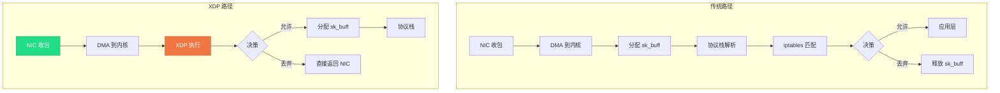
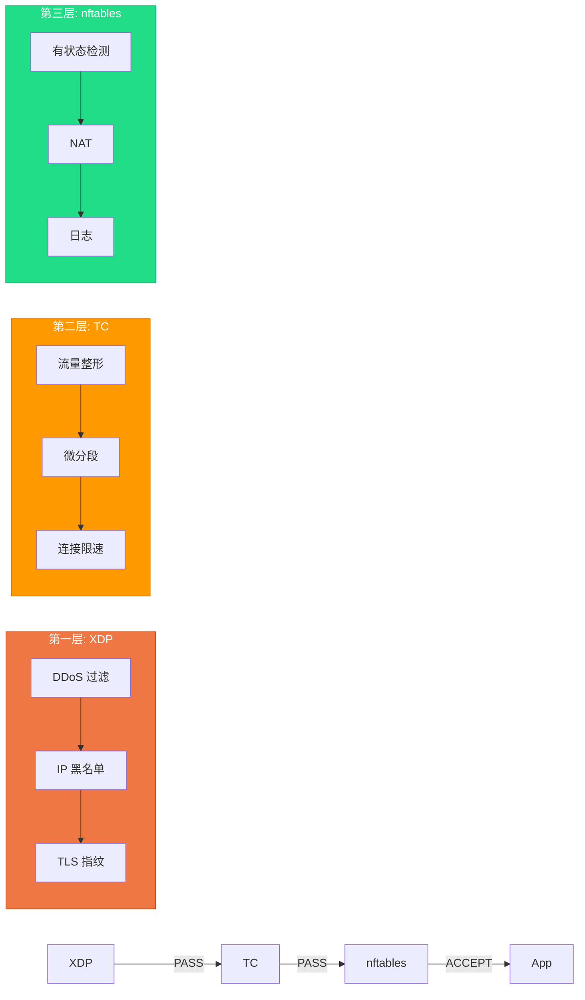
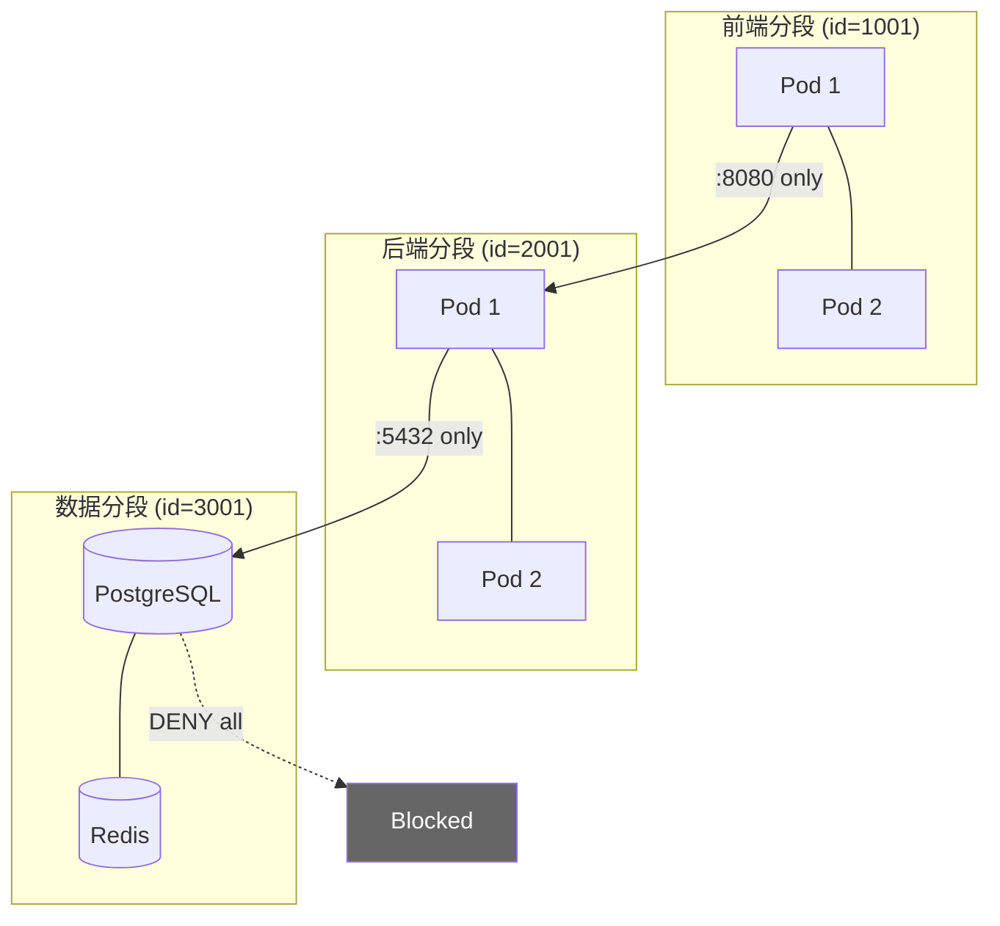
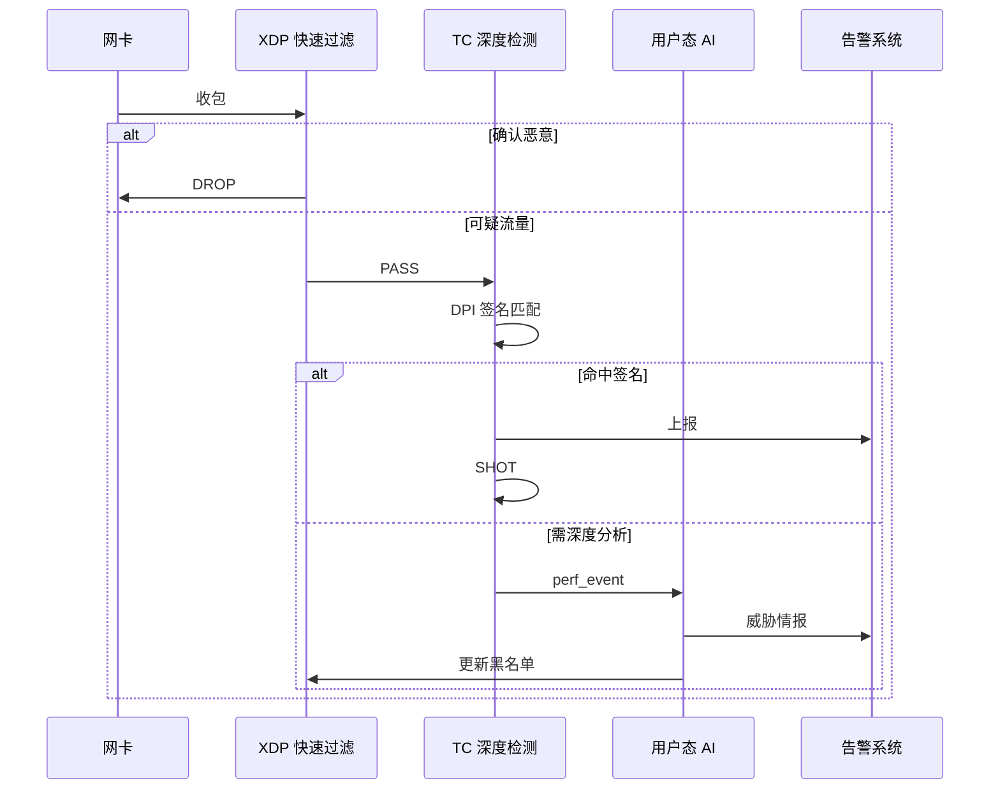
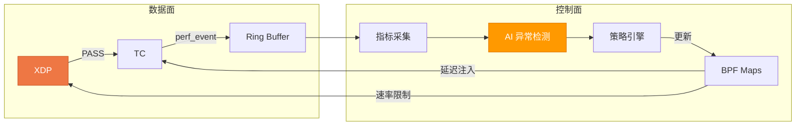

> [!info] eBPF 2026 深度探索系列 0. [[2026-04-08-ebpf-comprehensive-learning-roadmap|全栈学习路径总览]]
>
> 1. [[ch1-registers-and-instructions|第一章：寄存器与指令集]]
> 2. [[ch1-5-function-calls|第一.五章：四种函数调用与动态内存]]
> 3. [[ch1-6-the-verifier|第一.六章：验证器 (Verifier) 的底层逻辑]]
> 4. [[ch2-maps-and-communication|第二章：Map 机制与跨空间通信]]
> 5. [[ch2-5-kptr-and-ownership|第二.五章：kptr (内核指针) 与内存所有权模型]]
> 6. [[ch3-core-and-btf|第三章：CO-RE 与 BTF 的跨版本魔法]]
> 7. [[ch4-tracing-hooks-and-security|第四章：从 kprobe 到 LSM 的追踪全图景]]
> 8. [[ch7-5-uprobes-dynamic-tracing|第七.五章：uprobe 用户态动态追踪原理]]
> 9. [[ch7-6-bpftime-user-runtime|第七.六章：bpftime 与用户态 eBPF 加速]]
> 10. [[ch18-bpftime-injection-mastery|第七.七章：bpftime 自动化注入与全量监控实战]]
> 11. [[ch7-8-uprobe-selection-guide|第七.八章：uprobe 选型指南：内核态 vs 用户态]]
> 12. [[ch5-xdp-networking-performance|第五章：XDP 极致网络性能与全栈架构]]
> 13. [[ch6-tc-traffic-control|第六章：TC (Traffic Control) 流量调度艺术]]
> 14. [[ch7-security-lsm-enforcement|第七章：LSM BPF 从可观测到安全执法]]
> 15. [[ch8-advanced-tuning-and-profiling|第八章：进阶实战与内核调优]]
> 16. [[ch9-af-xdp-zero-copy|第九章：AF_XDP 零拷贝与用户态协议栈]]
> 17. [[ch10-sched-ext-custom-scheduler|第十章：sched_ext 自定义 CPU 调度器]]
> 18. [[ch11-bpf-iterators|第十一章：BPF Iterators 内核对象迭代器]]
> 19. [[ch12-kfuncs-evolution|第十二章：kfuncs 下一代内核交互标准]]
> 20. [[ch13-usdt-tracing|第十三章：USDT 用户态静态定义追踪]]
> 21. [[ch14-ai-llm-inference-monitoring|第十四章：AI 推理与大模型监控前沿]]
> 22. [[ch15-container-isolation|第十五章：无感增强容器隔离性]]
> 23. [[ch16-ebpf-and-wasm|第十六章：eBPF 与 WebAssembly (WASM) 的共生架构]]
> 24. [[ch17-storage-and-filesystem|第十七章：存储与文件系统加速]]
> 25. [[ch18-lifecycle-and-links|第十八章：生命周期管理与 BPF Links]]
> 26. [[ch19-atomic-updates-and-hot-upgrade|第十九章：程序的原子更新与蓝绿部署]]
> 27. [[ch25-5-stack-trace-correlation|第二五.五章：调用栈与业务请求的深度绑定]]
> 28. [[ch20-edge-iot-acceleration|第二十章：边缘计算与工业协议加速]]
> 29. [[ch21-debugging-and-verifier|第二十一章：调试实战与验证器 (Verifier) 诊断]]
> 30. [[ch22-testing-and-ci-cd|第二十二章：测试与持续集成 (CI/CD) 实战]]
> 31. [[ch23-security-and-permissions|第二十三章：权限细分与 BPF 安全沙箱]]
> 32. [[ch24-meta-monitoring-and-self-healing|第二十四章：eBPF 程序的内核自愈与监控]]
> 33. [[ch25-full-stack-observability|第二十五章：全栈可观测性与端到端追踪]]
> 34. **第二十六章：网络安全防御的高阶实战**
> 35. [[ch27-agent-engineering-architecture|第二十七章：工业级模块化 Agent 架构演进]]
> 36. [[ch28-offensive-and-defensive|第二十八章：攻防博弈与 Rootkit 防御]]
> 37. [[ch29-networking-deep-dive|第二十九章：网络应用深水区——负载均衡、Sockmap 与拥塞控制]]
> 38. [[ch30-hardware-offload|第三十章：硬件卸载与 SmartNIC 实战]]
> 39. [[ch31-signed-objects-and-security|第三十一章：内核原生签名与供应链安全]]
> 40. [[ch32-ebpf-for-windows|第三十二章：跨平台崛起——eBPF for Windows]]
> 41. [[ch32-5-macos-status|第三十二.五章：macOS 的特殊路径]]
> 42. [[ch33-serverless-optimization|第三十三章：Serverless 冷启动消除与动态计费]]
> 43. [[ch34-waf-and-rasp|第三十四章：Web 安全革命——内核态 WAF 与 RASP]]
> 44. [[ch35-npu-tpu-ai-hardware|第三十五章：AI 推理硬件 (NPU/TPU) 与硬件定义内核]]
> 45. [[ch36-dynamic-language-introspection|第三十六章：动态语言感知——业务对象的零代码提取]]
> 46. [[ch37-green-computing|第三十七章：绿色计算与能耗精准归因]]
> 47. [[ch38-ecosystem-and-career|第三十八章：2026 生态全景与工程师职业导航]]
> 48. [[ch39-rust-aya-framework|第三十九章：Rust eBPF 开发实战——Aya 框架与安全编程]]
> 49. [[ch40-network-protocols-deep-dive|第四十章：网络协议深度解析——TCP/UDP/QUIC 的 eBPF 视角]]
> 50. [[ch41-memory-safety-and-vulnerabilities|第四十一章：eBPF 内存安全与漏洞分析]]
> 51. [[ch42-service-mesh-integration|第四十二章：eBPF 与 Service Mesh 深度集成]]

---

## 1. 概述：从过滤 IP 到识别"身份"

在网络安全环境瞬息万变的 2026 年，基于 IP 地址的静态封禁（如传统的 iptables）已无法对抗使用动态代理和多云 IP 的恶意行为。**eBPF** 允许我们在报文级别通过深度行为分析，为每一个连接提取其独特的"身份指纹"。

本章聚焦 eBPF 在网络安全防御领域的高阶实战：

| 场景       | eBPF 钩子点     | 关键技术              | 响应延迟 |
| ---------- | --------------- | --------------------- | -------- |
| XDP 防火墙 | XDP             | L3/L4 过滤 + 指纹识别 | < 1us    |
| DDoS 缓解  | XDP + TC        | 速率限制 + 行为分析   | < 10us   |
| 微分段     | TC + cgroup     | 零信任网络隔离        | < 100us  |
| IDS/IPS    | XDP + TC + perf | 深度包检测 + 实时阻断 | < 50us   |
| 蜜罐引流   | XDP redirect    | 攻击者透明重定向      | < 5us    |

### 1.1 为什么传统方案不够

传统防火墙（iptables/nftables）在内核网络栈中较深的位置执行规则匹配。数据包到达 iptables 规则链之前需要经过 NIC 驱动、sk_buff 分配、协议栈解析等多个阶段。eBPF/XDP 将安全策略的执行点提前到 **驱动层的最早时机**——数据包刚从网卡 DMA 缓冲区读出、尚未分配 sk_buff 之前：

- **零内存分配**：被丢弃的包不需要分配内核内存
- **极致吞吐**：单核可达 14Mpps 以上的处理能力
- **可编程性**：安全策略通过加载/更新 eBPF 程序动态调整，无需重启



---

## 2. 核心实战：JA3/JA4 TLS 指纹拦截

### 2.1 技术原理

JA3 通过解析 TLS `Client Hello` 数据包来识别客户端特征。它提取 TLS 版本、加密套件、扩展字段等参数并生成 MD5 哈希。构建过程如下：

1. **TLS 版本**：提取 `version` 字段（如 `0x0301` 表示 TLS 1.0）
2. **加密套件**：提取 `cipher_suites` 列表，用 `-` 连接
3. **扩展**：提取 `extensions` 列表（椭圆曲线、EC 格式等）
4. **哈希生成**：将上述字段用 `,` 拼接后计算 MD5

**eBPF 的降维打击**：利用 XDP，在 TCP 握手后的第一个 Payload 包中直接在内核态完成指纹计算。恶意指纹（已知 Bot 库或攻击工具）直接丢弃。

> [!tip] JA3 vs JA4
> JA4 使用 SHA-256 替代 MD5，并增加 ALPN 协议协商指纹。2026 年生产环境建议同时支持两者以覆盖更广泛的威胁情报源。

### 2.2 代码片段：XDP 层的 TLS 特征提取

```c
// BPF Map: JA3 黑名单
struct {
    __uint(type, BPF_MAP_TYPE_HASH);
    __uint(max_entries, 65536);
    __type(key, __u32);    // JA3 hash
    __type(value, __u32);  // action: 1=drop
    __uint(pinning, LIBBPF_PIN_BY_NAME);
} ja3_blacklist SEC(".maps");

SEC("xdp")
int xdp_secure_gate(struct xdp_md *ctx) {
    void *data = (void *)(long)ctx->data;
    void *data_end = (void *)(long)ctx->data_end;
    struct ethhdr *eth = data;
    struct iphdr *ip;
    struct tcphdr *tcp;

    // 解析以太网头
    if ((void *)(eth + 1) > data_end) return XDP_PASS;
    if (eth->h_proto != bpf_htons(ETH_P_IP)) return XDP_PASS;

    // 解析 IP 头
    ip = (void *)(eth + 1);
    if ((void *)(ip + 1) > data_end) return XDP_PASS;
    if (ip->protocol != IPPROTO_TCP) return XDP_PASS;

    // 解析 TCP 头并定位 Payload
    tcp = (void *)ip + (ip->ihl * 4);
    if ((void *)(tcp + 1) > data_end) return XDP_PASS;

    unsigned char *payload = (unsigned char *)tcp + (tcp->doff * 4);
    if ((void *)(payload + 6) > data_end) return XDP_PASS;

    // 匹配 TLS Handshake (0x16) + Client Hello (0x01)
    if (payload[0] == 0x16 && payload[5] == 0x01) {
        __u32 ja3_hash = compute_ja3_part(payload, data_end);

        // 查询黑名单 Map
        if (bpf_map_lookup_elem(&ja3_blacklist, &ja3_hash)) {
            // 记录拦截事件
            struct alert_evt evt = {
                .src_ip = ip->saddr,
                .dst_port = bpf_ntohs(tcp->dest),
                .ja3_hash = ja3_hash,
                .timestamp = bpf_ktime_get_ns(),
            };
            bpf_perf_event_output(ctx, &events, BPF_F_CURRENT_CPU,
                                  &evt, sizeof(evt));
            return XDP_DROP;
        }
    }
    return XDP_PASS;
}
```

### 2.3 用户态控制器

```go
// Go 用户态：加载 eBPF 程序并管理黑名单
func main() {
    coll, err := ebpf.LoadCollection("xdp_secure_gate.o")
    if err != nil { log.Fatal(err) }
    defer coll.Close()

    // 加载威胁情报黑名单并注入 BPF Map
    m := coll.Maps["ja3_blacklist"]
    for hash, action := range loadJA3Blacklist("/etc/security/ja3.csv") {
        m.Update(hash, action, ebpf.MapUpdateAny)
    }

    // 挂载 XDP 程序到网卡
    iface, _ := net.InterfaceByName("eth0")
    link, _ := ebpf.AttachXDP(iface, coll.Programs["xdp_secure_gate"], nil)
    defer link.Close()

    // 消费内核告警
    rd, _ := perf.NewReader(coll.Maps["events"], os.Getpagesize())
    go consumeAlerts(rd)
}
```

---

## 3. XDP 防火墙模式详解

### 3.1 有状态 vs 无状态防火墙

XDP 运行在网卡驱动层，无法直接访问 conntrack。实现有状态防火墙需要通过 BPF Map 模拟连接跟踪。

**有状态防火墙**（通过 LRU Hash Map 实现连接跟踪）：

```c
struct conntrack_entry {
    __u64 last_seen;
    __u32 packets;
    __u32 bytes;
    __u8  state;       // TCP 状态机
};

struct {
    __uint(type, BPF_MAP_TYPE_LRU_HASH);
    __uint(max_entries, 2097152);
    __type(key, struct conn_key);   // 5-tuple
    __type(value, struct conntrack_entry);
} conntrack_map SEC(".maps");

SEC("xdp")
int xdp_stateful_fw(struct xdp_md *ctx) {
    // ... 解析报文头部 ...
    struct conn_key key = { .src_ip = ip->saddr, .dst_ip = ip->daddr,
        .src_port = tcp->source, .dst_port = tcp->dest, .proto = IPPROTO_TCP };

    struct conntrack_entry *entry = bpf_map_lookup_elem(&conntrack_map, &key);
    if (entry) {
        entry->last_seen = bpf_ktime_get_ns();
        entry->packets++;
        // TCP 状态机转换
        if (entry->state == TCP_SYN_SENT && tcp->syn && tcp->ack)
            entry->state = TCP_ESTABLISHED;
        return XDP_PASS;
    }

    // 新连接：仅允许 SYN 包发起
    if (tcp->syn && !tcp->ack) {
        struct conntrack_entry e = { .last_seen = bpf_ktime_get_ns(),
            .packets = 1, .state = TCP_SYN_SENT };
        bpf_map_update_elem(&conntrack_map, &key, &e, BPF_ANY);
        return XDP_PASS;
    }
    return XDP_DROP;  // 非法状态包
}
```

### 3.2 多层防火墙架构

生产环境中 XDP 与 TC、nftables 构成多层防御：



---

## 4. DDoS 缓解策略

### 4.1 攻击类型与 eBPF 对策

| 攻击类型          | 流量特征             | eBPF 对策               | 部署位置 |
| ----------------- | -------------------- | ----------------------- | -------- |
| SYN Flood         | 大量 SYN 无后续 ACK  | SYN Cookie + SYN Proxy  | XDP      |
| UDP Flood         | 大量 UDP 到随机端口  | 速率限制 + 协议验证     | XDP      |
| HTTP Flood        | 合法 HTTP 但频率异常 | 行为分析 + Token Bucket | TC       |
| DNS Amplification | 小请求大响应         | 出口速率限制 + 源验证   | XDP + TC |
| Slowloris         | 缓慢发送 HTTP 头     | 连接超时 + 最小速率     | TC       |

### 4.2 令牌桶限速器

```c
struct token_bucket {
    __u64 tokens, last_update, rate, capacity;
};

struct {
    __uint(type, BPF_MAP_TYPE_LRU_HASH);
    __uint(max_entries, 524288);
    __type(key, __u32);                    // src IP
    __type(value, struct token_bucket);
} rate_limiters SEC(".maps");

#define BUCKET_CAPACITY 10000

static __always_inline int enforce_rate_limit(__u32 src_ip) {
    __u64 now = bpf_ktime_get_ns();
    struct token_bucket *b = bpf_map_lookup_elem(&rate_limiters, &src_ip);
    if (!b) {
        struct token_bucket nb = { .tokens = BUCKET_CAPACITY / 2,
            .last_update = now, .rate = 1000, .capacity = BUCKET_CAPACITY };
        bpf_map_update_elem(&rate_limiters, &src_ip, &nb, BPF_ANY);
        return 0;
    }
    // 补充令牌
    __u64 elapsed = now - b->last_update;
    if (elapsed > b->rate) {
        b->tokens = min(b->tokens + elapsed / b->rate, b->capacity);
        b->last_update = now;
    }
    if (b->tokens >= 1) { b->tokens--; return 0; }
    return -1;  // 超速
}

SEC("xdp")
int xdp_ddos(struct xdp_md *ctx) {
    // ... 解析报文 ...
    if (enforce_rate_limit(ip->saddr) < 0)
        return XDP_DROP;
    return XDP_PASS;
}
```

### 4.3 SYN Cookie 实现

XDP 层通过在 SYN-ACK 的 ISN 中编码连接信息，实现无状态的 TCP 连接验证：

```c
static __always_inline __u32 encode_syn_cookie(__be32 src, __be32 dst,
                                                __be16 sport, __be16 dport,
                                                __u8 mss_index) {
    __u64 now = bpf_ktime_get_ns() / 64000000000ULL; // ~64s 单位
    __u32 ts = now & 0xFFFFFF;
    __u32 hash = syn_cookie_hash(src, dst, sport, dport, ts) & 0xF;
    return (mss_index << 28) | (ts << 4) | hash;
}

static __always_inline int verify_syn_cookie(__be32 src, __be32 dst,
                                             __be16 sport, __be16 dport,
                                             __u32 cookie) {
    __u32 ts = (cookie >> 4) & 0xFFFFFF;
    __u64 now = bpf_ktime_get_ns() / 64000000000ULL;
    __u32 diff = abs((int)(now & 0xFFFFFF) - (int)ts);
    if (diff > 1) return 0;  // 超出时间窗口
    __u32 expected = syn_cookie_hash(src, dst, sport, dport, ts) & 0xF;
    return (cookie & 0xF) == expected;
}
```

---

## 5. 网络微分段 (Microsegmentation)

### 5.1 零信任架构下的网络隔离

网络微分段是零信任安全模型的核心组件，将网络划分为细粒度的安全区域，每个区域间通信需显式授权。eBPF 可实现 **进程级别** 的网络隔离：

- **最小权限**：每个工作负载仅能访问其所需资源
- **显式授权**：默认拒绝所有流量，仅允许白名单通信
- **动态策略**：策略随工作负载部署和迁移自动更新

### 5.2 基于 cgroup 的微分段

```c
struct seg_policy {
    __u32 allow_dst_cidr;
    __u8  allow_ports[8];  // 端口位图
    __u32 action;          // 1=ALLOW, 0=DENY
};

struct {
    __uint(type, BPF_MAP_TYPE_HASH);
    __uint(max_entries, 16384);
    __type(key, __u32);              // identity label
    __type(value, struct seg_policy);
} segmentation_policies SEC(".maps");

SEC("cgroup_skb/egress")
int cgroup_microseg(struct __sk_buff *skb) {
    __u32 identity = bpf_get_socket_cookie(skb);
    struct seg_policy *p = bpf_map_lookup_elem(&segmentation_policies, &identity);
    if (!p) return 0;  // 无策略 = 拒绝（零信任默认）
    return p->action ? 1 : 0;  // 1=CGROUP_OK, 0=SHALL_NOT_PASS
}
```



---

## 6. IDS/IPS 与深度包检测

### 6.1 两阶段架构

| 阶段     | 钩子   | 功能                   | 延迟开销 |
| -------- | ------ | ---------------------- | -------- |
| 快速路径 | XDP    | IP 信誉、端口/协议匹配 | < 1us    |
| 深度路径 | TC     | DPI 签名匹配、异常检测 | < 50us   |
| 分析路径 | 用户态 | AI 行为分析、威胁情报  | ms 级    |



### 6.2 XDP 层签名匹配

```c
struct signature {
    __u8  pattern[16];
    __u8  pattern_len;
    __u8  offset;        // 包内偏移
    __u8  proto;
    __u16 port;
    __u32 severity;
};

static __always_inline int match_sig(void *data, void *data_end,
                                     struct signature *sig) {
    void *start = data + sig->offset;
    void *end = start + sig->pattern_len;
    if (start >= data_end || end > data_end) return 0;
    for (int i = 0; i < sig->pattern_len; i++)
        if (((__u8 *)start)[i] != sig->pattern[i]) return 0;
    return 1;
}

SEC("xdp")
int xdp_ids(struct xdp_md *ctx) {
    // ... 解析报文 ...
    __u16 dst_port = bpf_ntohs(tcp->dest);
    // 以目标端口查找签名集合，遍历匹配
    // 命中则上报告警并 DROP
    return XDP_PASS;
}
```

### 6.3 TC 层异常行为检测

```c
struct anomaly_metrics {
    __u64 conn_count, failed_conn, unique_dst;
    __u64 avg_interval_ns;
};

static __always_inline __u32 calc_anomaly_score(struct anomaly_metrics *m) {
    __u32 score = 0;
    if (m->conn_count > 10) {
        __u64 fail_rate = (m->failed_conn * 100) / m->conn_count;
        if (fail_rate > 50) score += 30;       // 高失败率
        else if (fail_rate > 20) score += 15;
    }
    if (m->unique_dst > 100) score += 40;      // 端口扫描
    else if (m->unique_dst > 50) score += 20;
    if (m->avg_interval_ns > 0 && m->avg_interval_ns < 1000000)
        score += 20;                            // 自动化工具特征
    return score;
}

#define ANOMALY_THRESHOLD 75

SEC("tc")
int tc_anomaly_detect(struct __sk_buff *skb) {
    // ... 解析报文 ...
    struct anomaly_metrics *m = bpf_map_lookup_elem(&anomaly_tracker, &ip->saddr);
    if (m && calc_anomaly_score(m) >= ANOMALY_THRESHOLD) {
        // 上报异常事件到用户态
        bpf_perf_event_output(skb, &anomaly_events, BPF_F_CURRENT_CPU, ...);
    }
    return TC_ACT_OK;
}
```

---

## 7. 动态自适应防御

2026 年的防火墙具备了"自我进化"的能力：

1. **采样**：eBPF 采集连接的 RTT 波动、重传率和包间隔
2. **分析**：用户态 AI 模型实时计算异常得分
3. **反馈**：得分超限，AI 自动向 BPF Map 写入限制规则
4. **惩罚执行**：eBPF 实时执行细粒度惩罚（注入延迟、限制连接速率）



---

## 8. 全自动蜜罐引流

利用 eBPF 的 `bpf_redirect` 实现对攻击者的"静默戏耍"：

- **识别**：检测到端口扫描行为（5+ 不同目标端口）
- **重定向**：修改目标 MAC，将报文透明转发到蜜罐容器
- **效果**：攻击者以为攻击有效，所有探测在受控环境下被全量记录

```c
struct scan_state {
    __u64 first_seen;
    __u32 port_count;
    __u32 recent_ports[4];
    __u8  port_idx;
};

#define SCAN_THRESHOLD 5

SEC("xdp")
int xdp_honeypot_redirect(struct xdp_md *ctx) {
    // ... 解析报文 ...
    __u16 dst_port = bpf_ntohs(tcp->dest);
    struct scan_state *s = bpf_map_lookup_elem(&scan_detector, &ip->saddr);

    if (!s) {
        struct scan_state ns = { .first_seen = bpf_ktime_get_ns(),
            .port_count = 1, .recent_ports[0] = dst_port };
        bpf_map_update_elem(&scan_detector, &ip->saddr, &ns, BPF_ANY);
        return XDP_PASS;
    }

    // 检查是否为新端口
    __u8 is_new = 1;
    for (int i = 0; i < 4; i++)
        if (s->recent_ports[i] == dst_port) { is_new = 0; break; }
    if (is_new) {
        s->port_count++;
        s->recent_ports[s->port_idx % 4] = dst_port;
        s->port_idx++;
    }

    // 达到扫描阈值：重定向到蜜罐
    if (s->port_count >= SCAN_THRESHOLD) {
        struct honeypot_config *cfg = get_honeypot_config();
        if (cfg && cfg->enabled) {
            // 修改目标 MAC 并重定向
            __builtin_memcpy(eth->h_dest, cfg->mac, 6);
            return bpf_redirect(cfg->target_ifindex, 0);
        }
    }
    return XDP_PASS;
}
```

---

## 9. 生产环境部署最佳实践

### 9.1 部署清单

| 项目       | 建议                         | 原因                       |
| ---------- | ---------------------------- | -------------------------- |
| XDP 模式   | 优先 native，配 generic 回退 | 性能最优且兼容性好         |
| Map 大小   | 预估并设置合理上限           | 避免内存浪费或条目淘汰     |
| CPU 亲和性 | 绑定 XDP 到特定核心          | 减少 CPU 缓存抖动          |
| 监控       | 独立健康检查程序             | 确保 eBPF 程序正常运行     |
| 日志       | perf event + ring buffer     | 避免 bpf_trace_printk 开销 |

### 9.2 性能调优

```bash
# 增加 BPF JIT 限制
sysctl -w net.core.bpf_jit_limit=3000000000
# 调整网卡队列数匹配 CPU 核数
ethtool -L eth0 combined $(nproc)
# 增大接收缓冲区
sysctl -w net.core.rmem_max=16777216
```

---

## 10. 常见问题 (FAQ)

### Q1: XDP 防火墙能完全替代 iptables/nftables 吗？

**不能。** XDP 工作在 L2/L3 层，无法处理 conntrack、NAT、端口转发等 L4+ 功能。正确做法是将 XDP 作为第一道防线（DDoS 过滤、IP 黑名单、TLS 指纹），nftables 处理有状态规则，两者互补。

### Q2: eBPF 程序本身被攻击者篡改怎么办？

eBPF 加载需要 `CAP_BPF`（或 root）权限，且必须通过内核验证器检查。生产环境应：启用 `kernel.unprivileged_bpf_disabled=1`、使用 `bpf_prog_pin` 固定程序、通过 LSM BPF 限制 BPF 系统调用、部署独立健康检查。

### Q3: XDP 层的 DPI 性能瓶颈在哪里？

XDP 无法处理需要跨包重组的协议（如 HTTP）。正确架构：XDP 做轻量级过滤（IP、端口、协议），可疑流量放行到 TC 层做签名匹配，真正的 DPI 在用户态通过 AF_XDP 接收报文。分层架构确保快速路径性能不受影响。

### Q4: 微分段策略更新会导致现有连接中断吗？

不会。BPF Map 更新是原子的，新策略仅影响后续连接判定。已建立的连接（LRU Hash Map 跟踪）继续使用缓存策略。建议用 `BPF_ANY` 标志更新，并在用户态实现策略版本管理和快速回滚。

### Q5: 高并发下 BPF Map 的并发性能如何？

- **Hash Map**：per-CPU 内部锁，读几乎无竞争
- **LRU Hash Map**：全局锁，高并发写入可能成瓶颈
- **Per-CPU Map**：完全无锁，适合统计计数
- **Array Map**：读无锁，写用 spinlock

高频更新场景推荐 `BPF_MAP_TYPE_PERCPU_HASH`。

### Q6: 容器/K8s 环境中如何部署？

推荐 Cilium CNI：**Cilium Network Policy** 支持 L3/L4/L7 策略自动转换为 eBPF 程序；**Cilium Tetragon** 提供运行时安全监控；**Hubble** 提供网络可观测性。自定义 eBPF 程序可通过 DaemonSet 部署到每个节点。

---

## 11. 总结

eBPF 在安全领域的价值，在于它将防御线推向了**物理网卡的边缘**。通过指纹级识别和动态闭环策略，eBPF 让 Linux 内核拥有了识别"隐藏敌人"的火眼金睛。

| 能力         | eBPF 钩子    | 核心优势       | 适用场景       |
| ------------ | ------------ | -------------- | -------------- |
| L3/L4 过滤   | XDP          | 亚微秒延迟     | DDoS 防护      |
| TLS 指纹识别 | XDP          | 内核态计算     | Bot 检测       |
| 有状态防火墙 | XDP + Map    | 无需 conntrack | 细粒度访问控制 |
| 速率限制     | XDP          | 令牌桶算法     | 流量整形       |
| 深度包检测   | TC + perf    | 两阶段架构     | IDS/IPS        |
| 微分段       | cgroup/skb   | 进程级隔离     | 零信任网络     |
| 蜜罐引流     | XDP redirect | 透明重定向     | 威胁情报收集   |

在下一章中，我们将深入探讨 [[ch27-agent-engineering-architecture|工业级模块化 Agent 架构演进]]，了解如何将 eBPF 安全能力与 AI Agent 系统深度集成。
