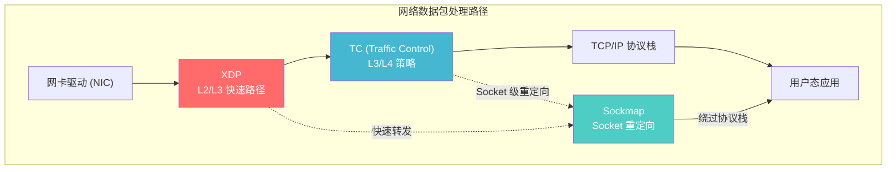
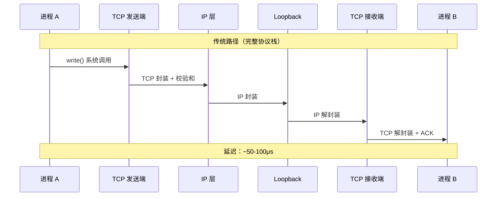
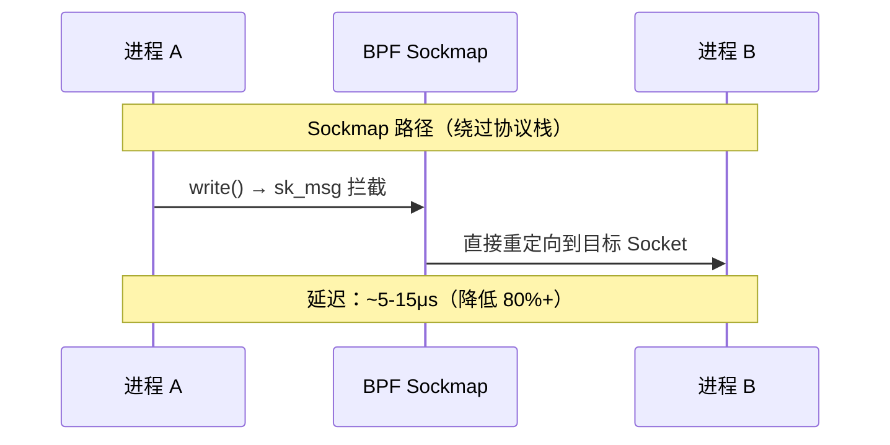
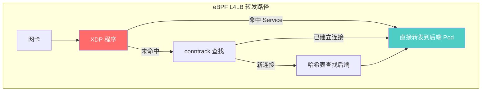
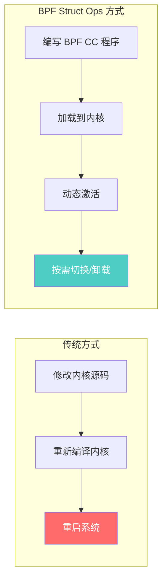
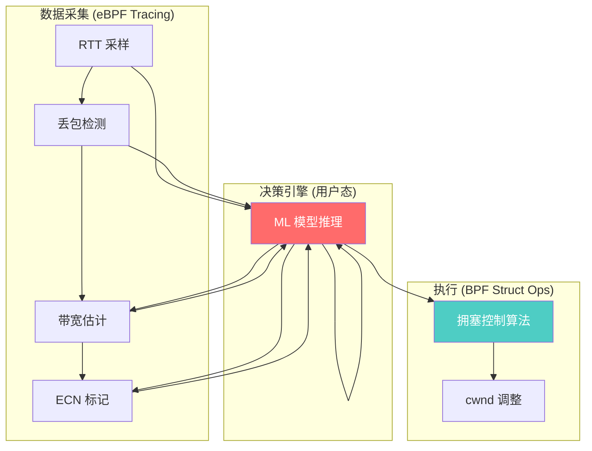

> [!info] eBPF 2026 深度探索系列 0. [[2026-04-08-ebpf-comprehensive-learning-roadmap|全栈学习路径总览]]
>
> 1. [[ch1-registers-and-instructions|第一章：寄存器与指令集]]
> 2. [[ch1-5-function-calls|第一.五章：四种函数调用与动态内存]]
> 3. [[ch1-6-the-verifier|第一.六章：验证器 (Verifier) 的底层逻辑]]
> 4. [[ch2-maps-and-communication|第二章：Map 机制与跨空间通信]]
> 5. [[ch2-5-kptr-and-ownership|第二.五章：kptr (内核指针) 与内存所有权模型]]
> 6. [[ch3-core-and-btf|第三章：CO-RE 与 BTF 的跨版本魔法]]
> 7. [[ch4-tracing-hooks-and-security|第四章：从 kprobe 到 LSM 的追踪全图景]]
> 8. [[ch7-5-uprobes-dynamic-tracing|第七.五章：uprobe 用户态动态追踪原理]]
> 9. [[ch7-6-bpftime-user-runtime|第七.六章：bpftime 与用户态 eBPF 加速]]
> 10. [[ch18-bpftime-injection-mastery|第七.七章：bpftime 自动化注入与全量监控实战]]
> 11. [[ch7-8-uprobe-selection-guide|第七.八章：uprobe 选型指南：内核态 vs 用户态]]
> 12. [[ch5-xdp-networking-performance|第五章：XDP 极致网络性能与全栈架构]]
> 13. [[ch6-tc-traffic-control|第六章：TC (Traffic Control) 流量调度艺术]]
> 14. [[ch7-security-lsm-enforcement|第七章：LSM BPF 从可观测到安全执法]]
> 15. [[ch8-advanced-tuning-and-profiling|第八章：进阶实战与内核调优]]
> 16. [[ch9-af-xdp-zero-copy|第九章：AF_XDP 零拷贝与用户态协议栈]]
> 17. [[ch10-sched-ext-custom-scheduler|第十章：sched_ext 自定义 CPU 调度器]]
> 18. [[ch11-bpf-iterators|第十一章：BPF Iterators 内核对象迭代器]]
> 19. [[ch12-kfuncs-evolution|第十二章：kfuncs 下一代内核交互标准]]
> 20. [[ch13-usdt-tracing|第十三章：USDT 用户态静态定义追踪]]
> 21. [[ch14-ai-llm-inference-monitoring|第十四章：AI 推理与大模型监控前沿]]
> 22. [[ch15-container-isolation|第十五章：无感增强容器隔离性]]
> 23. [[ch16-ebpf-and-wasm|第十六章：eBPF 与 WebAssembly (WASM) 的共生架构]]
> 24. [[ch17-storage-and-filesystem|第十七章：存储与文件系统加速]]
> 25. [[ch18-lifecycle-and-links|第十八章：生命周期管理与 BPF Links]]
> 26. [[ch19-atomic-updates-and-hot-upgrade|第十九章：程序的原子更新与蓝绿部署]]
> 27. [[ch25-5-stack-trace-correlation|第二五.五章：调用栈与业务请求的深度绑定]]
> 28. [[ch20-edge-iot-acceleration|第二十章：边缘计算与工业协议加速]]
> 29. [[ch21-debugging-and-verifier|第二十一章：调试实战与验证器 (Verifier) 诊断]]
> 30. [[ch22-testing-and-ci-cd|第二十二章：测试与持续集成 (CI/CD) 实战]]
> 31. [[ch23-security-and-permissions|第二十三章：权限细分与 BPF 安全沙箱]]
> 32. [[ch24-meta-monitoring-and-self-healing|第二十四章：eBPF 程序的内核自愈与监控]]
> 33. [[ch25-full-stack-observability|第二十五章：全栈可观测性与端到端追踪]]
> 34. [[ch26-network-security-high-level|第二十六章：网络安全防御的高阶实战]]
> 35. [[ch27-agent-engineering-architecture|第二十七章：工业级模块化 Agent 架构演进]]
> 36. [[ch28-offensive-and-defensive|第二十八章：攻防博弈与 Rootkit 防御]]
> 37. **第二十九章：网络应用深水区——负载均衡、Sockmap 与拥塞控制**
> 38. [[ch30-hardware-offload|第三十章：硬件卸载与 SmartNIC 实战]]
> 39. [[ch31-signed-objects-and-security|第三十一章：内核原生签名与供应链安全]]
> 40. [[ch32-ebpf-for-windows|第三十二章：跨平台崛起——eBPF for Windows]]
> 41. [[ch32-5-macos-status|第三十二.五章：macOS 的特殊路径]]
> 42. [[ch33-serverless-optimization|第三十三章：Serverless 冷启动消除与动态计费]]
> 43. [[ch34-waf-and-rasp|第三十四章：Web 安全革命——内核态 WAF 与 RASP]]
> 44. [[ch35-npu-tpu-ai-hardware|第三十五章：AI 推理硬件 (NPU/TPU) 与硬件定义内核]]
> 45. [[ch36-dynamic-language-introspection|第三十六章：动态语言感知——业务对象的零代码提取]]
> 46. [[ch37-green-computing|第三十七章：绿色计算与能耗精准归因]]
> 47. [[ch38-ecosystem-and-career|第三十八章：2026 生态全景与工程师职业导航]]
> 48. [[ch39-rust-aya-framework|第三十九章：Rust eBPF 开发实战——Aya 框架与安全编程]]
> 49. [[ch40-network-protocols-deep-dive|第四十章：网络协议深度解析——TCP/UDP/QUIC 的 eBPF 视角]]
> 50. [[ch41-memory-safety-and-vulnerabilities|第四十一章：eBPF 内存安全与漏洞分析]]
> 51. [[ch42-service-mesh-integration|第四十二章：eBPF 与 Service Mesh 深度集成]]

---

## 1. 概述：网络协议栈的全面"透明化"

到 2026 年，eBPF 在网络领域的应用已经从边缘的"包过滤"进化为了对整个网络协议栈的**深度控制与加速**。通过在内核不同的层级（L2 到 L7）插入 BPF 逻辑，我们成功地将 Linux 变成了一个高度可定制的、软件定义的网络引擎。

本章聚焦于 eBPF 在网络深水区的三大核心应用场景：

| 场景         | BPF 挂载点          | 核心价值                    | 典型项目        |
| ------------ | ------------------- | --------------------------- | --------------- |
| Sockmap 加速 | `sk_msg` / `sk_skb` | 绕过协议栈，零拷贝转发      | Cilium, Envoy   |
| 四层负载均衡 | XDP / TC            | $O(1)$ 哈希查找，千万级 PPS | Katran, Cilium  |
| 拥塞控制     | Struct Ops          | 动态切换 CC 算法，无需重启  | BBR, CUBIC 变体 |



---

## 2. 核心技术：Sockmap 进程间通信加速

在微服务场景下，大量的 TCP 流量发生在同一台主机的不同进程之间。例如，一个 Sidecar 代理需要将流量从业务容器转发到同一节点上的另一个服务——这些流量完全不需要经过完整的 TCP/IP 协议栈。

### 2.1 Sockmap 原理

传统的本地通信仍需经过完整的 TCP/IP 握手、封装、解封装逻辑。即使数据从进程 A 发往同一台机器上的进程 B，数据包仍然要经历以下完整路径：



**Sockmap 的优化思路**：利用 `BPF_MAP_TYPE_SOCKMAP`，eBPF 建立了一个本地 Socket 的快速映射表，实现**短路转发**——数据包从 A 的发送队列直接"弹射"到 B 的接收队列，彻底绕过协议栈的中间处理。



### 2.2 Sockmap 的 Map 类型对比

| Map 类型                 | 键类型       | 适用场景             | 挂载点             |
| ------------------------ | ------------ | -------------------- | ------------------ |
| `BPF_MAP_TYPE_SOCKMAP`   | 索引值       | TCP socket 重定向    | `sk_msg`, `sk_skb` |
| `BPF_MAP_TYPE_SOCKHASH`  | 4 元组联合键 | 哈希键的高效查找     | `sk_msg`, `sk_skb` |
| `BPF_MAP_TYPE_SOCKARRAY` | 数组索引     | 数组索引查找 (5.18+) | `sk_msg`           |

`SOCKHASH` 相比 `SOCKMAP` 的优势在于支持 4 元组（src_ip, src_port, dst_ip, dst_port）作为联合键进行哈希查找，更适合生产环境中的服务网格场景。

### 2.3 sk_msg 程序详解

`sk_msg` 是挂载在 socket 发送路径上的 BPF 程序类型，它对 `struct sk_msg_md` 进行操作：

```c
struct sk_msg_md {
    __bpf_md_ptr(void *, data);          // 消息数据起始
    __bpf_md_ptr(void *, data_end);      // 消息数据结束
    __u32 family;                        // 协议族 (AF_INET/AF_INET6)
    __u32 remote_ip4;                    // 对端 IPv4
    __u32 local_ip4;                     // 本地 IPv4
    __u32 remote_port;                   // 对端端口
    __u32 local_port;                    // 本地端口
    __u32 size;                          // 消息大小
};
```

`sk_msg` 程序可以执行的关键操作：

1. **`bpf_msg_redirect_map()`** / **`bpf_msg_redirect_hash()`** —— 将消息重定向到 Map 中的目标 socket
2. **`bpf_msg_apply_bytes()`** —— 限制当前程序处理的消息字节数
3. **`bpf_msg_cork_bytes()`** —— 设置"软木塞"阈值，超过后暂缓发送
4. **`bpf_msg_pull_data()`** —— 确保消息数据在内存中可线性访问

### 2.4 sk_skb 与 sk_msg 的区别

| 特性     | `sk_msg`             | `sk_skb`          |
| -------- | -------------------- | ----------------- |
| 数据结构 | `struct scatterlist` | `struct sk_buff`  |
| 挂载点   | sendmsg 系统调用     | socket 收发路径   |
| 适用场景 | 本地代理加速         | 代理与远端通信    |
| 头部操作 | 支持 push/pull       | 支持完整 skb 操作 |

### 2.5 生产环境性能数据

在 Cilium 的 Service Mesh 数据面中，Sockmap 的实测数据（基于 2025 年 Cilium 1.16 基准测试）：

| 指标                  | iptables 模式 | Sockmap 加速 | 提升幅度      |
| --------------------- | ------------- | ------------ | ------------- |
| P99 延迟 (同节点)     | 150μs         | 25μs         | **83% 降低**  |
| 吞吐量 (单核)         | 2.5 Gbps      | 8.2 Gbps     | **228% 提升** |
| CPU 利用率 (100k RPS) | 35%           | 12%          | **66% 降低**  |

关键结论：Sockmap 对已建立连接的**数据面转发**有显著提升，但对**连接建立**（三次握手）没有影响。

---

## 3. 四层负载均衡 (L4LB) 的极致进化

### 3.1 传统方案的瓶颈

在 Kubernetes 集群中，NodePort / ClusterIP 类型的 Service 需要通过内核的 netfilter / iptables 进行包转发：

- **iptables 缺陷**：规则基于线性链表匹配，复杂度 $O(N)$，在大规模 Service 下导致 CPU 软中断过高
- **IPVS 改进**：使用哈希表将复杂度降到 $O(1)$，但仍需经过完整的 netfilter 框架
- **eBPF 优势**：完全绕过 netfilter，在 XDP 或 TC 层基于哈希表的 $O(1)$ 查找实现转发

### 3.2 eBPF 负载均衡架构

以 Cilium 的 eBPF kube-proxy 替代方案为例，整个转发路径完全绕过了 iptables：



### 3.3 实战案例：Katran 架构解析

Meta（原 Facebook）的 Katran 是 eBPF 四层负载均衡的标杆实现，支撑了 Meta 全球数据中心的流量分发。

**Katran 的核心设计**：

1. **XDP 层快速路径**：在网卡驱动收包阶段就完成转发决策，仅用 ~200ns 处理一个包
2. **一致性哈希**：使用 Maglev 一致性哈希算法，后端节点变化时最小化连接重分配
3. **Direct Server Return (DSR)**：回包直接从后端服务器返回客户端，负载均衡器不处理回程
4. **QUIC 支持**：通过解析 QUIC Connection ID 实现 L4 负载均衡，无需解密

```c
// Katran XDP 程序核心逻辑（简化）
SEC("xdp")
int katran_lb(struct xdp_md *ctx) {
    void *data_end = (void *)(long)ctx->data_end;
    void *data = (void *)(long)ctx->data;

    struct ethhdr *eth = data;
    struct iphdr *ip = (void *)(eth + 1);
    if ((void *)(ip + 1) > data_end)
        return XDP_PASS;

    // 提取五元组作为哈希键
    struct flow_key key = {
        .src_ip = ip->saddr,
        .dst_ip = ip->daddr,
        .proto  = ip->protocol,
    };

    if (ip->protocol == IPPROTO_TCP) {
        struct tcphdr *tcp = (void *)(ip + 1);
        if ((void *)(tcp + 1) > data_end)
            return XDP_PASS;
        key.src_port = tcp->source;
        key.dst_port = tcp->dest;
    }

    // 在 VIP Map 中查找，一致性哈希选择后端
    struct vip_meta *vip = bpf_map_lookup_elem(&vip_map, &key.dst_ip);
    if (!vip)
        return XDP_PASS;

    u32 idx = maglev_hash(&key, vip);
    struct backend *be = bpf_map_lookup_elem(&backend_map, &idx);
    if (!be)
        return XDP_DROP;

    // DSR: 修改 MAC 地址直接转发
    __builtin_memcpy(eth->h_dest, be->mac, 6);
    return XDP_TX;
}
```

### 3.4 负载均衡算法对比

| 算法                | 复杂度 | 适用场景       | eBPF 实现难度        |
| ------------------- | ------ | -------------- | -------------------- |
| 轮询 (Round Robin)  | $O(1)$ | 后端性能均匀   | 低                   |
| 加权轮询            | $O(1)$ | 后端性能差异大 | 低                   |
| 最少连接            | $O(N)$ | 长连接场景     | 中（需维护计数 Map） |
| 一致性哈希 (Maglev) | $O(1)$ | 大规模动态后端 | 高（查找表预计算）   |
| 源地址哈希          | $O(1)$ | 会话保持       | 低                   |

### 3.5 性能基准测试

Katran 在 Meta 生产环境中的实测数据（单核，Intel Xeon）：

| 指标               | iptables+IPVS | Katran (XDP) | 提升倍数 |
| ------------------ | ------------- | ------------ | -------- |
| PPS（64B 小包）    | 2M PPS        | 40M PPS      | **20x**  |
| PPS（1518B 大包）  | 1M PPS        | 12M PPS      | **12x**  |
| 转发延迟           | 15μs          | 0.2μs        | **75x**  |
| CPU 消耗 (10M PPS) | 100% (1核)    | 8% (1核)     | **12x**  |

---

## 4. 自定义 TCP 拥塞控制

### 4.1 TCP 拥塞控制基础

内核中内置了多种拥塞控制算法：

| 算法    | 特点                             | 适用场景         |
| ------- | -------------------------------- | ---------------- |
| `cubic` | Linux 默认，基于丢包             | 通用有线网络     |
| `bbr`   | Google 开发，基于带宽和 RTT 估计 | 高带宽长距离链路 |
| `bbr2`  | BBR v2，改善公平性               | 多流共享链路     |
| `dctcp` | 基于 ECN 的数据中心 TCP          | 数据中心内部     |
| `vegas` | 基于 RTT 延迟变化                | 低延迟敏感场景   |

传统上，切换拥塞控制算法需要修改 `sysctl`，且修改是全局生效的。

### 4.2 TCP BPF CC：动态加载拥塞控制算法

现代内核允许利用 **Struct Ops**（`BPF_STRUCT_OPS`）动态加载自定义的拥塞控制算法。开发者可以在**不重启系统、不重新编译内核**的情况下，加载一个全新的 TCP 拥塞控制实现。



### 4.3 Struct Ops 代码框架

```c
#include <linux/bpf.h>
#include <linux/tcp.h>
#include <bpf/bpf_helpers.h>

char _license[] SEC("license") = "GPL";

// 自定义拥塞控制状态
struct my_cc_priv {
    u32 min_rtt;
    u32 bw_estimate;
};

// 定义拥塞控制算法的 Struct Ops
SEC("struct_ops/my_tcp_cc")
struct tcp_congestion_ops my_cc = {
    .init       = bpf_my_cc_init,
    .cong_avoid = bpf_my_cc_cong_avoid,
    .pkts_acked = bpf_my_cc_pkts_acked,
    .name       = "my_custom_cc",
};

static int bpf_my_cc_init(struct sock *sk) {
    struct tcp_sock *tp = tcp_sk(sk);
    tp->snd_cwnd = 10;  // 初始 cwnd 设为 10 个 MSS
    return 0;
}

static void bpf_my_cc_cong_avoid(struct sock *sk, u32 ack, u32 acked) {
    struct tcp_sock *tp = tcp_sk(sk);
    if (!tcp_is_cwnd_limited(sk))
        return;
    if (tp->snd_cwnd < tp->snd_ssthresh) {
        tp->snd_cwnd += acked;  // 慢启动：指数增长
    } else {
        tp->snd_cwnd += max(tp->snd_cwnd * acked / tp->snd_cwnd, 1U); // 拥塞避免
    }
}

static void bpf_my_cc_pkts_acked(struct sock *sk, const struct ack_sample *sample) {
    struct my_cc_priv *priv = tcp_ca(sk);
    if (sample->rtt_us > 0) {
        // EWMA 更新带宽估计
        u32 bw = sample->pkts_acked * tcp_sk(sk)->mss_cache * 1000000 / sample->rtt_us;
        priv->bw_estimate = (priv->bw_estimate * 7 + bw) / 8;
    }
}
```

### 4.4 动态切换拥塞控制

```bash
# 查看可用算法
sysctl net.ipv4.tcp_available_congestion_control

# 加载自定义 BPF CC 程序
bpftool struct_ops register my_cc.o

# 全局切换
sysctl -w net.ipv4.tcp_congestion_control=my_custom_cc

# 卸载自定义算法
bpftool struct_ops unregister my_cc
```

### 4.5 AI 驱动的自适应拥塞控制

2026 年最前沿的研究方向是结合 AI/ML 实时调整拥塞控制参数。eBPF Struct Ops 为此提供了完美的执行环境：



典型应用场景：卫星链路（高延迟 500ms+）、5G 移动网络（带宽波动 10Mbps~1Gbps）、数据中心内（极低延迟 <100μs 使用 ECN/DCTCP）、跨洋链路（BDP 巨大需大窗口支持）。

---

## 5. Service Mesh 数据面加速

传统 Service Mesh（如 Istio + Envoy）采用 Sidecar 代理模式，每个请求经过 4 次 TCP/IP 协议栈处理，即使两个 Pod 在同一节点上，延迟和 CPU 消耗都翻倍。

Cilium 利用 Sockmap 和 XDP 实现了"无 Sidecar"或"轻量 Sidecar"的数据面：同节点通信使用 Sockmap 延迟降低 ~70%；跨节点通信由 XDP 处理隧道封装/解封装；在 eBPF 层实现透明 mTLS 身份验证。

| 功能         | Envoy 实现              | eBPF 实现          | 性能差异 |
| ------------ | ----------------------- | ------------------ | -------- |
| L4 路由      | iptables + filter chain | XDP/TC 哈希查找    | 10-20x   |
| L7 HTTP 路由 | Envoy filter chain      | sockops + 延迟处理 | 3-5x     |
| TLS 终止     | OpenSSL in Envoy        | 内核 TLS + eBPF    | 2-3x     |
| 限流         | Envoy token bucket      | eBPF Map 计数器    | 100x     |

---

## 6. 代码实战：Sockmap 代理加速

### 6.1 BPF 程序（内核态）

```c
// proxy_accel.bpf.c
#include <linux/bpf.h>
#include <linux/tcp.h>
#include <bpf/bpf_helpers.h>
#include <bpf/bpf_endian.h>

char _license[] SEC("license") = "GPL";

struct sock_key {
    u32 src_ip; u32 src_port;
    u32 dst_ip; u32 dst_port;
};

struct proxy_config {
    u32 listen_port;
    u32 backend_port;
    u32 backend_ip;
};

struct {
    __uint(type, BPF_MAP_TYPE_SOCKHASH);
    __uint(max_entries, 65535);
    __type(key, struct sock_key);
    __type(value, u64);
} backend_sock_map SEC(".maps");

struct {
    __uint(type, BPF_MAP_TYPE_HASH);
    __uint(max_entries, 256);
    __type(key, u32);
    __type(value, struct proxy_config);
} config_map SEC(".maps");

// sk_msg: 拦截代理流量并重定向到后端
SEC("sk_msg")
int bpf_proxy_accel(struct sk_msg_md *msg) {
    struct sock_key key = {};
    struct proxy_config *cfg;

    cfg = bpf_map_lookup_elem(&config_map, &msg->local_port);
    if (!cfg)
        return SK_PASS;

    key.src_ip   = msg->local_ip4;
    key.src_port = msg->local_port;
    key.dst_ip   = bpf_htonl(cfg->backend_ip);
    key.dst_port = bpf_htons(cfg->backend_port);

    return bpf_msg_redirect_hash(msg, &backend_sock_map, &key, BPF_F_INGRESS);
}

// sockops: 建立双向 socket 映射
SEC("sockops")
int bpf_sockops(struct bpf_sock_ops *skops) {
    struct sock_key key = {};

    if (skops->family != AF_INET)
        return 0;

    if (skops->op == BPF_SOCK_OPS_ACTIVE_ESTABLISHED_CB ||
        skops->op == BPF_SOCK_OPS_PASSIVE_ESTABLISHED_CB) {
        key.src_ip   = skops->local_ip4;
        key.src_port = skops->local_port;
        key.dst_ip   = skops->remote_ip4;
        key.dst_port = skops->remote_port;
        bpf_sock_hash_update(skops, &backend_sock_map, &key, BPF_ANY);
    }
    return 0;
}
```

### 6.2 用户态控制程序

```c
// proxy_ctrl.c
#include <bpf/libbpf.h>
#include <bpf/bpf.h>
#include <stdio.h>
#include <arpa/inet.h>
#include <unistd.h>

int main(void) {
    struct bpf_object *obj;
    struct bpf_program *prog;
    struct bpf_map *sock_map;
    struct bpf_link *link;

    obj = bpf_object__open_file("proxy_accel.bpf.o", NULL);
    if (libbpf_get_error(obj)) return 1;
    if (bpf_object__load(obj)) return 1;

    // 附加 sockops
    prog = bpf_object__find_program_by_name(obj, "bpf_sockops");
    link = bpf_program__attach_sockops(prog);
    if (libbpf_get_error(link)) return 1;

    // 附加 sk_msg 到 sockmap
    sock_map = bpf_object__find_map_by_name(obj, "backend_sock_map");
    prog = bpf_object__find_program_by_name(obj, "bpf_proxy_accel");
    bpf_prog_attach(bpf_program__fd(prog),
                    bpf_map__fd(sock_map), BPF_SK_MSG_VERDICT, 0);

    // 写入代理配置
    int cfg_fd = bpf_map__fd(
        bpf_object__find_map_by_name(obj, "config_map"));
    struct proxy_config cfg = {
        .listen_port  = htons(8080),
        .backend_port = htons(3000),
        .backend_ip   = inet_addr("127.0.0.1"),
    };
    u32 key = 8080;
    bpf_map_update_elem(cfg_fd, &key, &cfg, BPF_ANY);

    printf("Sockmap proxy loaded: :8080 -> 127.0.0.1:3000\n");
    pause();
    return 0;
}
```

### 6.3 编译、运行与调试

```bash
# 编译
clang -g -O2 -target bpf -I/usr/include/bpf \
    -c proxy_accel.bpf.c -o proxy_accel.bpf.o
gcc -g -O2 -lbpf proxy_ctrl.c -o proxy_ctrl

# 运行
sudo ./proxy_ctrl

# 调试
sudo bpftool map dump name backend_sock_map
sudo bpftool prog show name bpf_sockops

# 压测对比
wrk -t4 -c100 -d30s http://127.0.0.1:8080/api/test
```

---

## 7. 进阶话题：eBPF 网络安全与策略

### 7.1 网络策略的内核态执行

Cilium 通过 eBPF 在内核态直接执行 Kubernetes NetworkPolicy，延迟从 iptables 的 ~10μs 降到 ~0.5μs。结合 XDP（L3/L4 速率限制）、TC（L7 连接追踪）和 Sockmap（应用层过滤）形成多层级 DDoS 防护，在网卡收包最早期阶段即可过滤恶意流量。

---

## 8. 生产部署最佳实践

### 8.1 版本要求

| 功能                 | 最低内核版本 | 推荐内核版本 |
| -------------------- | ------------ | ------------ |
| Sockmap 基础         | 4.14         | 5.10+        |
| SOCKHASH             | 4.18         | 5.10+        |
| Struct Ops (TCP CC)  | 5.6          | 6.1+         |
| Sockmap + TLS (kTLS) | 5.10         | 6.6+         |

### 8.2 常见陷阱

1. **SYN-ACK 重定向失败**：Sockmap 无法重定向 SYN/SYN-ACK 包。需在 `sockops` 的 `ESTABLISHED_CB` 回调中建立映射。
2. **连接追踪丢失**：Sockmap 绕过 conntrack，需自行维护连接记录 Map。
3. **MTU 分片**：建议统一设置 Pod 网络的 MTU。
4. **CPU 亲和性**：高吞吐场景下配合 `SO_ATTACH_REUSEPORT_CBPF` 进行 CPU 亲和性优化。

---

## 9. FAQ

### Q1: Sockmap 和 XDP 负载均衡能否同时使用？

**可以，且应该配合使用。** XDP 处理跨节点的流量分发（入口流量），Sockmap 处理同节点内的 Pod 间通信加速。两者工作在不同层级，互不冲突。Cilium 在生产环境中就是同时启用这两项技术。

### Q2: Sockmap 重定向会破坏 TCP 连接吗？

**不会。** Sockmap 的重定向发生在内核 TCP 层之上，它将已建立连接的 socket 数据"转移"到另一个已建立的 socket。连接状态、序列号、窗口等完全不变，对端完全无感知。注意 Sockmap 只能重定向 TCP 的**数据面**，连接建立和拆除仍走正常协议栈。

### Q3: 自定义 TCP 拥塞控制算法是否需要修改应用代码？

**完全不需要。** 拥塞控制算法在内核 TCP 层运行，对应用完全透明。切换算法只需通过 `sysctl` 或 `bpftool` 命令完成，甚至可以针对不同的 socket 设置不同的算法（per-socket congestion control）。

### Q4: eBPF 负载均衡能否替代所有场景下的 iptables？

**目前还不能完全替代，但差距正在快速缩小。** 以下场景仍需注意：

- **NAT 端口映射**（NodePort）：某些复杂的多跳 NAT 场景下行为可能与 iptables 不完全一致
- **eBPF 不支持的 match 扩展**：某些 iptables 模块（如 `recent`、`string`）没有对应的 eBPF 实现
- **非 TCP/UDP 协议**：eBPF 对 ICMP、SCTP 等协议的支持仍在完善中

在 2026 年，Cilium 的 eBPF kube-proxy 替代方案已经可以覆盖 Kubernetes 95%+ 的网络场景。

### Q5: 在生产环境中如何监控 eBPF 网络程序的健康状态？

**建议建立多层次的监控体系：**

1. **BPF 程序级别**：通过 `bpftool prog show` 获取 `run_cnt`（执行次数）和 `run_time_ns`（执行时间）
2. **Map 统计**：在 BPF 程序中使用 per-CPU Map 计数器，记录重定向成功/失败次数
3. **内核日志**：使用 `bpf_trace_printk()` 输出关键事件，通过 `trace_pipe` 采集
4. **Prometheus 集成**：Cilium 等框架已内置丰富的 eBPF 指标导出

```bash
sudo bpftool prog show name bpf_proxy_accel
sudo bpftool prog tracelog
```

### Q6: Sockmap 在多核场景下是否存在性能瓶颈？

**存在，但可以缓解。** Map 操作本身线程安全（per-CPU bucket 哈希表），但高并发下 CPU 缓存行争用可能成为瓶颈。优化策略：使用 `BPF_F_NO_COMMON_LRU` 减少锁争用；配合 RPS/RFS 将连接固定到特定 CPU；升级到 6.1+ 内核以获得 per-CPU Map 性能优化。

### Q7: 如何在 eBPF 程序中实现优雅降级？

**始终将 `SK_PASS` / `TC_ACT_OK` 作为降级返回值：**

```c
SEC("sk_msg")
int bpf_proxy_accel(struct sk_msg_md *msg) {
    int ret = bpf_msg_redirect_hash(msg, &backend_sock_map, &key, 0);
    if (ret != 0) {
        bpf_printk("redirect failed, fallback to kernel\n");
        __sync_fetch_and_add(&fallback_count, 1);
        return SK_PASS;  // 交给内核正常处理
    }
    return ret;
}
```

确保在任何 BPF 程序异常、Map 查找失败、版本不兼容等情况下，流量仍然能通过正常内核路径处理。

---

## 10. 总结：eBPF 重新定义网络

在 2026 年，eBPF 让网络成为了应用的一种**"可编程属性"**。无论是本地加速、全局调度还是协议优化，开发者都拥有了在纳秒级精度下操控每一个比特的能力。

| 技术           | 层级           | 核心能力            | 成熟度                   |
| -------------- | -------------- | ------------------- | ------------------------ |
| **Sockmap**    | L4 (Socket)    | 同节点零拷贝转发    | 生产就绪                 |
| **XDP L4LB**   | L2/L3          | 千万级 PPS 负载均衡 | 生产就绪 (Katran/Cilium) |
| **TCP BPF CC** | L4 (Transport) | 动态拥塞控制算法    | 生产就绪 (6.1+)          |

**展望未来**，eBPF 网络技术正在向以下方向演进：硬件卸载集成（eBPF 程序直接编译到 SmartNIC 的 P4 固件中，见[[ch30-hardware-offload|第三十章]]）、多协议支持（QUIC、HTTP/3）、AI 原生网络（ML 自适应策略）、零信任网络（身份感知的细粒度访问控制）。
