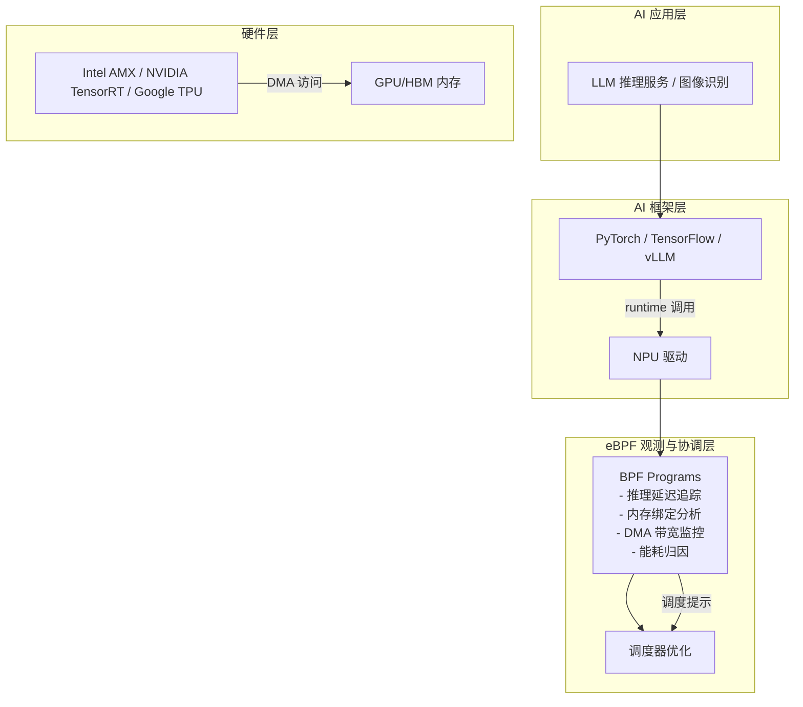
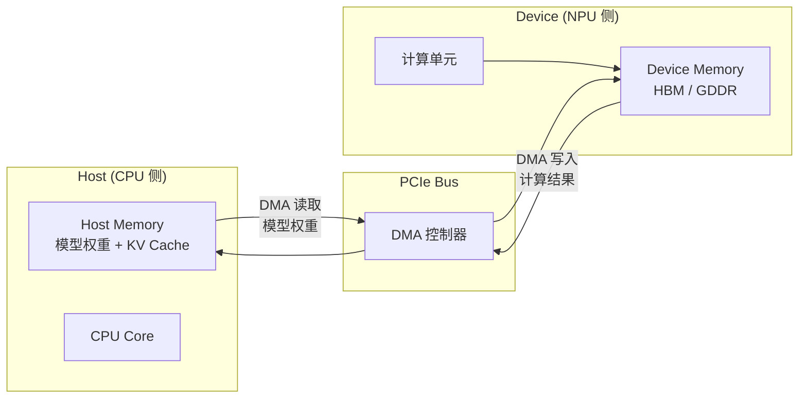
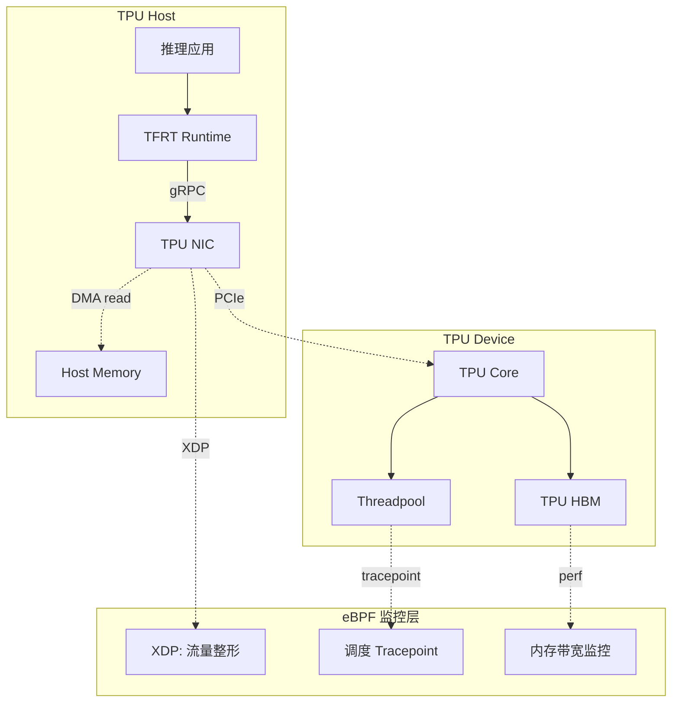

> [!info] eBPF 2026 深度探索系列 0. [[2026-04-08-ebpf-comprehensive-learning-roadmap|全栈学习路径总览]]
>
> 1. [[ch1-registers-and-instructions|第一章：寄存器与指令集]]
> 2. [[ch1-5-function-calls|第一.五章：四种函数调用与动态内存]]
> 3. [[ch1-6-the-verifier|第一.六章：验证器 (Verifier) 的底层逻辑]]
> 4. [[ch2-maps-and-communication|第二章：Map 机制与跨空间通信]]
> 5. [[ch2-5-kptr-and-ownership|第二.五章：kptr (内核指针) 与内存所有权模型]]
> 6. [[ch3-core-and-btf|第三章：CO-RE 与 BTF 的跨版本魔法]]
> 7. [[ch4-tracing-hooks-and-security|第四章：从 kprobe 到 LSM 的追踪全图景]]
> 8. [[ch7-5-uprobes-dynamic-tracing|第七.五章：uprobe 用户态动态追踪原理]]
> 9. [[ch7-6-bpftime-user-runtime|第七.六章：bpftime 与用户态 eBPF 加速]]
> 10. [[ch18-bpftime-injection-mastery|第七.七章：bpftime 自动化注入与全量监控实战]]
> 11. [[ch7-8-uprobe-selection-guide|第七.八章：uprobe 选型指南：内核态 vs 用户态]]
> 12. [[ch5-xdp-networking-performance|第五章：XDP 极致网络性能与全栈架构]]
> 13. [[ch6-tc-traffic-control|第六章：TC (Traffic Control) 流量调度艺术]]
> 14. [[ch7-security-lsm-enforcement|第七章：LSM BPF 从可观测到安全执法]]
> 15. [[ch8-advanced-tuning-and-profiling|第八章：进阶实战与内核调优]]
> 16. [[ch9-af-xdp-zero-copy|第九章：AF_XDP 零拷贝与用户态协议栈]]
> 17. [[ch10-sched-ext-custom-scheduler|第十章：sched_ext 自定义 CPU 调度器]]
> 18. [[ch11-bpf-iterators|第十一章：BPF Iterators 内核对象迭代器]]
> 19. [[ch12-kfuncs-evolution|第十二章：kfuncs 下一代内核交互标准]]
> 20. [[ch13-usdt-tracing|第十三章：USDT 用户态静态定义追踪]]
> 21. [[ch14-ai-llm-inference-monitoring|第十四章：AI 推理与大模型监控前沿]]
> 22. [[ch15-container-isolation|第十五章：无感增强容器隔离性]]
> 23. [[ch16-ebpf-and-wasm|第十六章：eBPF 与 WebAssembly (WASM) 的共生架构]]
> 24. [[ch17-storage-and-filesystem|第十七章：存储与文件系统加速]]
> 25. [[ch18-lifecycle-and-links|第十八章：生命周期管理与 BPF Links]]
> 26. [[ch19-atomic-updates-and-hot-upgrade|第十九章：程序的原子更新与蓝绿部署]]
> 27. [[ch25-5-stack-trace-correlation|第二五.五章：调用栈与业务请求的深度绑定]]
> 28. [[ch20-edge-iot-acceleration|第二十章：边缘计算与工业协议加速]]
> 29. [[ch21-debugging-and-verifier|第二十一章：调试实战与验证器 (Verifier) 诊断]]
> 30. [[ch22-testing-and-ci-cd|第二十二章：测试与持续集成 (CI/CD) 实战]]
> 31. [[ch23-security-and-permissions|第二十三章：权限细分与 BPF 安全沙箱]]
> 32. [[ch24-meta-monitoring-and-self-healing|第二十四章：eBPF 程序的内核自愈与监控]]
> 33. [[ch25-full-stack-observability|第二十五章：全栈可观测性与端到端追踪]]
> 34. [[ch26-network-security-high-level|第二十六章：网络安全防御的高阶实战]]
> 35. [[ch27-agent-engineering-architecture|第二十七章：工业级模块化 Agent 架构演进]]
> 36. [[ch28-offensive-and-defensive|第二十八章：攻防博弈与 Rootkit 防御]]
> 37. [[ch29-networking-deep-dive|第二十九章：网络应用深水区——负载均衡、Sockmap 与拥塞控制]]
> 38. [[ch30-hardware-offload|第三十章：硬件卸载与 SmartNIC 实战]]
> 39. [[ch31-signed-objects-and-security|第三十一章：内核原生签名与供应链安全]]
> 40. [[ch32-ebpf-for-windows|第三十二章：跨平台崛起——eBPF for Windows]]
> 41. [[ch32-5-macos-status|第三十二.五章：macOS 的特殊路径]]
> 42. [[ch33-serverless-optimization|第三十三章：Serverless 冷启动消除与动态计费]]
> 43. [[ch34-waf-and-rasp|第三十四章：Web 安全革命——内核态 WAF 与 RASP]]
> 44. **第三十五章：AI 推理硬件 (NPU/TPU) 与硬件定义内核**
> 45. [[ch36-dynamic-language-introspection|第三十六章：动态语言感知——业务对象的零代码提取]]
> 46. [[ch37-green-computing|第三十七章：绿色计算与能耗精准归因]]
> 47. [[ch38-ecosystem-and-career|第三十八章：2026 生态全景与工程师职业导航]]
> 48. [[ch39-rust-aya-framework|第三十九章：Rust eBPF 开发实战——Aya 框架与安全编程]]
> 49. [[ch40-network-protocols-deep-dive|第四十章：网络协议深度解析——TCP/UDP/QUIC 的 eBPF 视角]]
> 50. [[ch41-memory-safety-and-vulnerabilities|第四十一章：eBPF 内存安全与漏洞分析]]
> 51. [[ch42-service-mesh-integration|第四十二章：eBPF 与 Service Mesh 深度集成]]

---

## 1. 概述：AI 推理时代的 eBPF

2026 年，AI 推理已无处不在。从云端数据中心的 LLM 推理到边缘设备的实时图像识别，NPU（神经网络处理单元）和 TPU（张量处理单元）已成为现代计算基础设施的核心组件。

eBPF 在这个生态中扮演着独特的角色：它既是 AI 推理流水线的"观测层"（监控延迟、吞吐量、资源占用），又是 AI 硬件与操作系统之间的"桥梁层"（协调内存分配、调度优先级、管理 DMA 传输）。

### 1.1 AI 推理栈中的 eBPF 定位



### 1.2 NPU/TPU 与 CPU 的协同模型

| 组件              | 主要职责               | eBPF 能介入的环节                        |
| :---------------- | :--------------------- | :--------------------------------------- |
| **CPU**           | 控制流、内存管理、调度 | 追踪系统调用、内存分配、进程调度         |
| **NPU/TPU**       | 张量计算、矩阵乘法     | DMA 传输监控、计算资源分配、队列深度监控 |
| **Host Memory**   | 存储模型权重、KV Cache | 内存带宽监控、NUMA 亲和性                |
| **Device Memory** | 计算中间结果           | 设备内存页迁移追踪                       |

---

## 2. eBPF 视角下的 AI 推理延迟剖析

AI 推理延迟并非只是"输入到输出的总时间"，而是多个阶段的复合。eBPF 能够以极低的开销精确测量每个阶段的耗时。

### 2.1 推理延迟的分解

**推理延迟分解（总延迟 ≈ 100ms 示例）：**

```
0ms ─────────────────────────────────────────────── 100ms
 ├─[请求排队 5ms]─────────────────────────────┤
     ├─[数据预处理 5ms]─┤
         ├─[调度启动 2ms]─┤
             ├─[NPU 计算 53ms]─(关键路径)─┤
                 ├─[结果回传 5ms]─┤
                     ├─[响应发送 20ms]─┤
```

**各阶段详情：**

| 阶段             | 典型耗时 | 占比   | eBPF 测量点                                | 优化空间             |
| :--------------- | :------- | :----- | :----------------------------------------- | :------------------- |
| **请求排队**     | 5-50ms   | 5-50%  | `sched_wakeup` + `sched_switch` tracepoint | 调度优先级、请求合并 |
| **数据预处理**   | 2-10ms   | 2-10%  | `kprobe:tensor_preprocess`                 | 向量化、BATCH 合并   |
| **模型调度启动** | 0.5-2ms  | 0.5-2% | NPU 驱动 kfunc                             | 容器预热、模型预加载 |
| **NPU 计算**     | 10-80ms  | 10-80% | DMA 完成中断 tracepoint                    | 计算图优化、算子融合 |
| **结果回传**     | 1-5ms    | 1-5%   | DMA 传输追踪                               | 零拷贝、CPU/NPU 并行 |
| **响应发送**     | 5-20ms   | 5-20%  | `kprobe:inet_sendmsg`                      | 连接复用、协议优化   |

> [!note]
> NPU 计算是关键路径（crit），通常是优化的重点。eBPF 可通过 DMA 中断时间戳精确测量 NPU 计算的实际耗时。

### 2.2 延迟追踪 BPF 程序

```c
#include <vmlinux.h>
#include <bpf/bpf_helpers.h>
#include <bpf/bpf_typedef.h>

// 推理请求追踪
struct inference_request {
    u64 request_id;
    u64 enqueue_time_ns;
    u64 preprocess_done_ns;
    u64 npu_start_ns;
    u64 npu_done_ns;
    u64 complete_ns;
    u32 tensor_size;
    u32 model_id;
};

// 请求追踪 Map
struct {
    __uint(type, BPF_MAP_TYPE_HASH);
    __uint(max_entries, 10240);
    __type(key, u64);  // request_id
    __type(value, struct inference_request);
} inference_tracking SEC(".maps");

// 延迟直方图（纳秒级精度）
struct {
    __uint(type, BPF_MAP_TYPE_PERCPU_ARRAY);
    __uint(max_entries, 64);  // bucket 索引
    __type(key, u32);
    __type(value, u64);
} latency_histogram SEC(".maps");

// 追踪请求入队时间
SEC("kprobe/vllm_model_execute")
int BPF_KPROBE(inference_enqueue, u64 request_id, u32 model_id, u32 tensor_size) {
    struct inference_request req = {
        .request_id = request_id,
        .enqueue_time_ns = bpf_ktime_get_ns(),
        .model_id = model_id,
        .tensor_size = tensor_size,
    };
    bpf_map_update_elem(&inference_tracking, &request_id, &req, BPF_ANY);
    return 0;
}

// 追踪 NPU 计算开始
SEC("kprobe/npu_kernel_launch")
int BPF_KPROBE(npu_kernel_start, u64 request_id) {
    struct inference_request *req = bpf_map_lookup_elem(&inference_tracking, &request_id);
    if (req) {
        req->npu_start_ns = bpf_ktime_get_ns();
    }
    return 0;
}

// 追踪 NPU 计算完成
SEC("kprobe/npu_dispatch_complete")
int BPF_KPROBE(npu_kernel_done, u64 request_id) {
    struct inference_request *req = bpf_map_lookup_elem(&inference_tracking, &request_id);
    if (req) {
        req->npu_done_ns = bpf_ktime_get_ns();
        // 计算各阶段延迟并记录直方图
        u64 preprocess_lat = req->npu_start_ns - req->preprocess_done_ns;
        u64 npu_lat = req->npu_done_ns - req->npu_start_ns;
        // 记录到直方图...
        bpf_map_delete_elem(&inference_tracking, &request_id);
    }
    return 0;
}
```

---

## 3. NPU 内存管理与 eBPF 协调

NPU 推理的核心瓶颈往往不在计算本身，而在内存带宽和 DMA 效率。eBPF 能够实时监控内存访问模式并动态调整策略。

### 3.1 Host Memory 与 Device Memory 的桥接



### 3.2 DMA 传输监控

```c
#include <vmlinux.h>
#include <bpf/bpf_helpers.h>

// DMA 传输统计
struct dma_transfer {
    u64 timestamp;
    u64 bytes;
    u64 duration_ns;
    u32 dir;  // 0=host_to_dev, 1=dev_to_host
    u32 node_id;
};

struct {
    __uint(type, BPF_MAP_TYPE_PERCPU_ARRAY);
    __uint(max_entries, 128);
    __type(key, u32);
    __type(value, u64);
} dma_bytes_total SEC(".maps");

struct {
    __uint(type, BPF_MAP_TYPE_RINGBUF);
    __uint(max_entries, 4096);
} dma_events SEC(".maps");

// 追踪 DMA 传输开始
SEC("kprobe/intel_npu_dmactl_start")
int BPF_KPROBE(dma_start, u64 addr, u64 size, u32 dir) {
    u32 key = dir;
    u64 *cnt = bpf_map_lookup_elem(&dma_bytes_total, &key);
    if (cnt) {
        __sync_fetch_and_add(cnt, size);
    }
    return 0;
}

// DMA 传输完成事件
SEC("tracepoint/intel_npu/dma_complete")
int on_dma_complete(struct trace_event_raw_intel_npu_dma *ctx) {
    struct dma_transfer *ev = bpf_ringbuf_reserve(&dma_events, sizeof(*ev), 0);
    if (ev) {
        ev->timestamp = bpf_ktime_get_ns();
        ev->bytes = ctx->transfer_size;
        ev->duration_ns = ctx->duration_ns;
        ev->dir = ctx->direction;
        bpf_ringbuf_submit(ev, 0);
    }
    return 0;
}
```

---

## 4. 调度优化：让 NPU 不再等待

eBPF 与 `sched_ext` 的结合，使得 AI 推理任务能够获得精准的调度优化，避免 NPU 处于空闲等待状态。

### 4.1 问题：NPU 空转现象

传统调度器不理解 AI 推理的工作负载特性，常常出现：

- CPU 预处理还未完成，NPU 已空闲等待
- 多个推理请求竞争导致上下文切换开销
- KV Cache 跨 NUMA 节点访问导致的内存延迟

### 4.2 NPU 感知的调度 BPF 程序

```c
#include <vmlinux.h>
#include <bpf/bpf_helpers.h>
#include <bpf/bpf_typedef.h>

// 推理任务优先级映射
struct {
    __uint(type, BPF_MAP_TYPE_HASH);
    __uint(max_entries, 10240);
    __type(key, u32);  // pid
    __type(value, u32); // priority: 0=low, 1=medium, 2=high
} inference_priority SEC(".maps");

// NPU 队列深度（通过驱动暴露）
struct {
    __uint(type, BPF_MAP_TYPE_RINGBUF);
    __uint(max_entries, 1024);
} npu_queue_depth SEC(".maps");

SEC("sched_ext::pre_schedule")
int pre_schedule(struct scx Sched_context *ctx) {
    u32 pid = bpf_get_current_pid_tgid() >> 32;
    u32 *prio = bpf_map_lookup_elem(&inference_priority, &pid);

    if (prio) {
        // AI 推理任务：根据优先级分配 CPU
        // 高优先级任务优先分配到 NPU 亲和的 CPU 核心
        if (*prio >= 2) {
            // 实时推理任务：绑定到 NPU 直通 CPU
            scx_bpf_select_cpu_dfl(ctx, 0, /* prefer_numa */ true, /* allow_overlap */ false);
        }
    }

    return 0;
}

SEC("sched_ext::post_schedule")
int post_schedule(struct scx Sched_context *ctx) {
    u32 pid = bpf_get_current_pid_tgid() >> 32;
    u32 *prio = bpf_map_lookup_elem(&inference_priority, &pid);

    if (prio && *prio >= 1) {
        // 记录任务运行历史，用于后续优化
        struct task_ctx {
            u64 last_run_ns;
            u32 run_time_ns;
        } tctx;

        struct bpf_tasks_ctx *task = bpf_get_task();
        tctx.last_run_ns = bpf_ktime_get_ns();
        tctx.run_time_ns = task->sum_exec_ns;
        // 更新统计...
    }

    return 0;
}
```

---

## 5. TPU 与云端 AI 推理的 eBPF 监控

Google TPU 通过自定义网卡的 DMA 接口与主机通信，eBPF 能够在这个路径上进行细粒度的流量控制与监控。

### 5.1 TPU 推理架构



### 5.2 TPU 流量整形

```c
// 限制 TPU 推理请求的突发流量，避免拥塞
SEC("xdp/tpu_control")
int xdp_tpu_shaper(struct xdp_md *ctx) {
    void *data = (void *)(long)ctx->data;
    void *data_end = (void *)(long)ctx->data_end;

    struct ethhdr *eth = data;
    if ((void *)(eth + 1) > data_end) return XDP_PASS;

    // 检查是否是 TPU 控制流量
    if (eth->h_proto != bpf_htons(0x86DD)) return XDP_PASS;  // IPv6

    struct ipv6hdr *ip6h = (void *)(eth + 1);
    if ((void *)(ip6h + 1) > data_end) return XDP_PASS;

    // 检查 TPU gRPC 端口
    if (ip6h->nexthdr == 6) {  // TCP
        struct tcphdr *tcp = (void *)(ip6h + 1);
        if ((void *)(tcp + 1) > data_end) return XDP_PASS;

        // TPU 控制端口 443
        u16 dport = bpf_ntohs(tcp->dest);
        if (dport == 443) {
            // 令牌桶限速：每 10ms 允许 1000 包
            return xdp_adjust_tail(ctx, 0);  // 触发限速逻辑
        }
    }

    return XDP_PASS;
}
```

---

## 6. 案例：使用 eBPF 实现 LLM 推理的 KV Cache 优化

### 6.1 问题背景

大语言模型 (LLM) 的 KV Cache 是推理性能的关键。传统方案无法感知 KV Cache 的 NUMA 分布，导致跨节点访问成为瓶颈。

### 6.2 KV Cache NUMA 亲和性追踪

```c
#include <vmlinux.h>
#include <bpf/bpf_helpers.h>

// KV Cache 页追踪
struct kv_cache_entry {
    u64 page_addr;
    u32 node_id;
    u32 access_count;
    u64 last_access_ns;
};

// KV Cache 分布 Map
struct {
    __uint(type, BPF_MAP_TYPE_HASH);
    __uint(max_entries, 102400);
    __type(key, u64);  // page_addr
    __type(value, struct kv_cache_entry);
} kv_cache_dist SEC(".maps");

// NUMA 节点间传输统计
struct {
    __uint(type, BPF_MAP_TYPE_PERCPU_ARRAY);
    __uint(max_entries, 4);  // 4 个 NUMA 节点
    __type(key, u32);
    __type(value, u64);
} numa_cross_traffic SEC(".maps");

// 追踪 KV Cache 访问
SEC("kprobe/vllm_kvcache_attend")
int BPF_KPROBE(kvcache_access, u64 addr, u32 node_id) {
    struct kv_cache_entry *entry = bpf_map_lookup_elem(&kv_cache_dist, &addr);
    if (entry) {
        u32 current_node = bpf_get_current_node();
        if (entry->node_id != current_node) {
            // 跨 NUMA 访问！
            u32 key = entry->node_id * 4 + current_node;
            u64 *cnt = bpf_map_lookup_elem(&numa_cross_traffic, &key);
            if (cnt) (*cnt)++;
        }
        entry->access_count++;
        entry->last_access_ns = bpf_ktime_get_ns();
    }
    return 0;
}

// 生成优化建议
SEC("tp/sched/sched_process_exit")
int on_inference_complete(struct trace_event_raw_sched_process_template *ctx) {
    // 分析本次推理的 NUMA 效率
    // 建议调度器将进程迁移到最优 NUMA 节点
    return 0;
}
```

---

## 7. 硬件监控接口与性能计数器

### 7.1 NPU 性能计数器访问

现代 NPU 提供了 PMU (Performance Monitoring Unit)，eBPF 能够通过 `bpf_perf_event` 读取这些计数器：

```c
#include <vmlinux.h>
#include <bpf/bpf_helpers.h>
#include <bpf/bpf_typedef.h>

// NPU PMU 事件配置
struct npu_pmu_config {
    u32 event_id;
    u64 sample_period;
};

// NPU PMU 事件列表
struct {
    __uint(type, BPF_MAP_TYPE_ARRAY);
    __uint(max_entries, 16);
    __type(key, u32);
    __type(value, struct npu_pmu_config);
} npu_pmu_config SEC(".maps");

// 读取 NPU 性能计数器
SEC("perf_event/npu_pmu")
int on_npu_pmu(struct bpf_perf_event_hdr *ctx) {
    u32 cpu = bpf_get_smp_processor_id();
    struct bpf_perf_event_value value;

    // 读取乘加运算计数
    if (bpf_perf_event_read_value(ctx, /* npu_mac_cnt */ 0x01, &value) == 0) {
        bpf_printk("NPU MAC: %llu cycles, %llu events",
                   value.cpu_cycles, value.enabled - value.running);
    }

    // 读取内存带宽
    if (bpf_perf_event_read_value(ctx, /* npu_mem_bw */ 0x02, &value) == 0) {
        bpf_printk("NPU MEM_BW: %llu GB/s",
                   value.enabled / 1e9);
    }

    return 0;
}
```

### 7.2 性能计数器类型对比

| PMU 事件         | 说明         | 典型用途     |
| :--------------- | :----------- | :----------- |
| **IPC**          | 每指令周期数 | 算子融合优化 |
| **MAC**          | 乘加运算次数 | 模型性能分析 |
| **MEM_BW**       | 内存带宽     | 批量大小调优 |
| **Cache Hit**    | 缓存命中率   | 预取策略调整 |
| **DMA Transfer** | DMA 传输量   | 流水线优化   |

---

## 8. FAQ

**Q1：eBPF 能否直接控制 NPU 的计算调度？**

A：eBPF 不能直接控制 NPU 内部的计算调度（这是硬件微架构），但它能通过调度器 (`sched_ext`) 优化 CPU 侧的调度，确保数据准备就绪后再唤醒 NPU 任务，形成"CPU-NPU 流水线并行"。对于 Intel AMX 等支持 CPU 指令的 NPU，eBPF 可以在 CPU 侧直接调度这些指令。

**Q2：如何追踪跨多个 NPU 卡的分布式推理？**

A：使用 `bpf_iter` 遍历所有 NPU 设备节点，并关联请求 ID 进行跨卡追踪。也可以通过 `bpf_ringbuf` 将各卡的数据汇总到用户态进行全局分析。

**Q3：eBPF 对 NPU 性能的影响有多大？**

A：BPF 程序本身的开销在纳秒级，对于毫秒级的 NPU 计算可以忽略不计。但需要注意追踪点的选择——高频追踪点（如每个 token 生成）可能产生额外开销，建议使用采样策略。

**Q4：如何利用 eBPF 实现 AI 推理的自动扩缩容触发？**

A：监控 NPU 利用率、推理队列深度和延迟指标，当达到阈值时通过 `bpf_send_signal` 或用户态 Agent 触发 K8s HPA 扩缩容决策。[[ch14-ai-llm-inference-monitoring|第十四章：AI 推理与大模型监控前沿]] 详细介绍了这部分内容。

**Q5：TPU 的 eBPF 支持与 NVIDIA NPU 有何不同？**

A：Google TPU 主要通过专用的 PCIe 网卡接口通信，eBPF 在主机侧进行流量整形和监控。NVIDIA NPU（如 DeepLink）提供更丰富的内核驱动接口，支持更细粒度的内存追踪。两者都可以使用 `sched_ext` 进行 CPU 侧调度优化。
