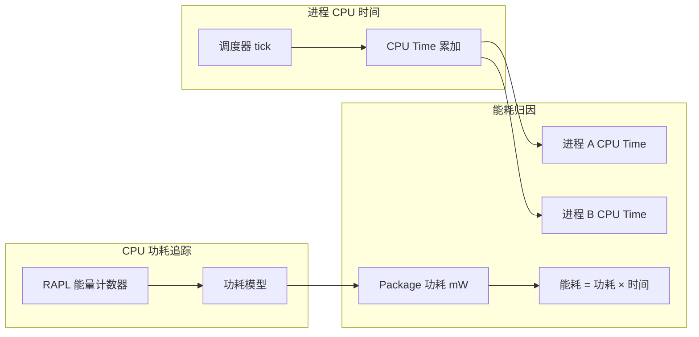
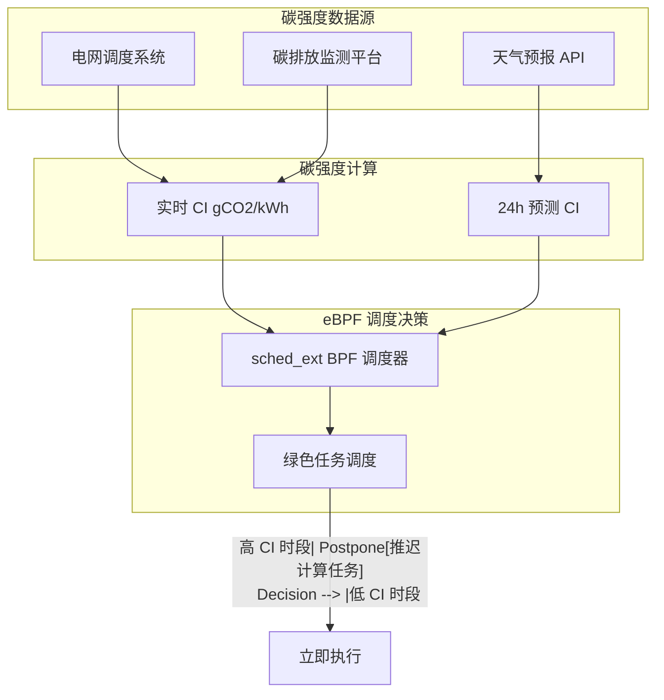
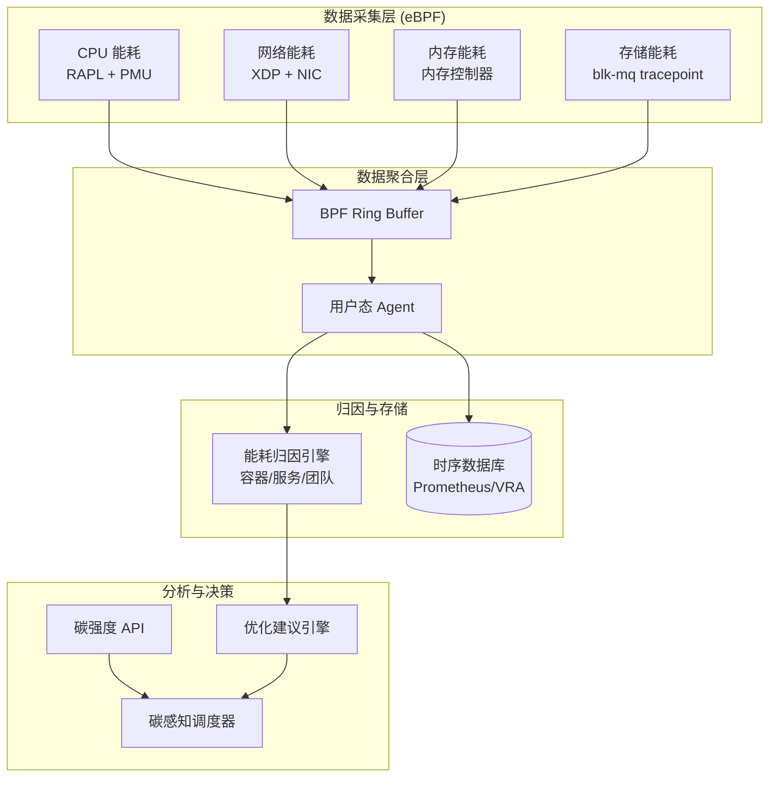

> [!info] eBPF 2026 深度探索系列 0. [[2026-04-08-ebpf-comprehensive-learning-roadmap|全栈学习路径总览]]
>
> 1. [[ch1-registers-and-instructions|第一章：寄存器与指令集]]
> 2. [[ch1-5-function-calls|第一.五章：四种函数调用与动态内存]]
> 3. [[ch1-6-the-verifier|第一.六章：验证器 (Verifier) 的底层逻辑]]
> 4. [[ch2-maps-and-communication|第二章：Map 机制与跨空间通信]]
> 5. [[ch2-5-kptr-and-ownership|第二.五章：kptr (内核指针) 与内存所有权模型]]
> 6. [[ch3-core-and-btf|第三章：CO-RE 与 BTF 的跨版本魔法]]
> 7. [[ch4-tracing-hooks-and-security|第四章：从 kprobe 到 LSM 的追踪全图景]]
> 8. [[ch7-5-uprobes-dynamic-tracing|第七.五章：uprobe 用户态动态追踪原理]]
> 9. [[ch7-6-bpftime-user-runtime|第七.六章：bpftime 与用户态 eBPF 加速]]
> 10. [[ch18-bpftime-injection-mastery|第七.七章：bpftime 自动化注入与全量监控实战]]
> 11. [[ch7-8-uprobe-selection-guide|第七.八章：uprobe 选型指南：内核态 vs 用户态]]
> 12. [[ch5-xdp-networking-performance|第五章：XDP 极致网络性能与全栈架构]]
> 13. [[ch6-tc-traffic-control|第六章：TC (Traffic Control) 流量调度艺术]]
> 14. [[ch7-security-lsm-enforcement|第七章：LSM BPF 从可观测到安全执法]]
> 15. [[ch8-advanced-tuning-and-profiling|第八章：进阶实战与内核调优]]
> 16. [[ch9-af-xdp-zero-copy|第九章：AF_XDP 零拷贝与用户态协议栈]]
> 17. [[ch10-sched-ext-custom-scheduler|第十章：sched_ext 自定义 CPU 调度器]]
> 18. [[ch11-bpf-iterators|第十一章：BPF Iterators 内核对象迭代器]]
> 19. [[ch12-kfuncs-evolution|第十二章：kfuncs 下一代内核交互标准]]
> 20. [[ch13-usdt-tracing|第十三章：USDT 用户态静态定义追踪]]
> 21. [[ch14-ai-llm-inference-monitoring|第十四章：AI 推理与大模型监控前沿]]
> 22. [[ch15-container-isolation|第十五章：无感增强容器隔离性]]
> 23. [[ch16-ebpf-and-wasm|第十六章：eBPF 与 WebAssembly (WASM) 的共生架构]]
> 24. [[ch17-storage-and-filesystem|第十七章：存储与文件系统加速]]
> 25. [[ch18-lifecycle-and-links|第十八章：生命周期管理与 BPF Links]]
> 26. [[ch19-atomic-updates-and-hot-upgrade|第十九章：程序的原子更新与蓝绿部署]]
> 27. [[ch25-5-stack-trace-correlation|第二五.五章：调用栈与业务请求的深度绑定]]
> 28. [[ch20-edge-iot-acceleration|第二十章：边缘计算与工业协议加速]]
> 29. [[ch21-debugging-and-verifier|第二十一章：调试实战与验证器 (Verifier) 诊断]]
> 30. [[ch22-testing-and-ci-cd|第二十二章：测试与持续集成 (CI/CD) 实战]]
> 31. [[ch23-security-and-permissions|第二十三章：权限细分与 BPF 安全沙箱]]
> 32. [[ch24-meta-monitoring-and-self-healing|第二十四章：eBPF 程序的内核自愈与监控]]
> 33. [[ch25-full-stack-observability|第二十五章：全栈可观测性与端到端追踪]]
> 34. [[ch26-network-security-high-level|第二十六章：网络安全防御的高阶实战]]
> 35. [[ch27-agent-engineering-architecture|第二十七章：工业级模块化 Agent 架构演进]]
> 36. [[ch28-offensive-and-defensive|第二十八章：攻防博弈与 Rootkit 防御]]
> 37. [[ch29-networking-deep-dive|第二十九章：网络应用深水区——负载均衡、Sockmap 与拥塞控制]]
> 38. [[ch30-hardware-offload|第三十章：硬件卸载与 SmartNIC 实战]]
> 39. [[ch31-signed-objects-and-security|第三十一章：内核原生签名与供应链安全]]
> 40. [[ch32-ebpf-for-windows|第三十二章：跨平台崛起——eBPF for Windows]]
> 41. [[ch32-5-macos-status|第三十二.五章：macOS 的特殊路径]]
> 42. [[ch33-serverless-optimization|第三十三章：Serverless 冷启动消除与动态计费]]
> 43. [[ch34-waf-and-rasp|第三十四章：Web 安全革命——内核态 WAF 与 RASP]]
> 44. [[ch35-npu-tpu-ai-hardware|第三十五章：AI 推理硬件 (NPU/TPU) 与硬件定义内核]]
> 45. [[ch36-dynamic-language-introspection|第三十六章：动态语言感知——业务对象的零代码提取]]
> 46. **第三十七章：绿色计算与能耗精准归因**
> 47. [[ch38-ecosystem-and-career|第三十八章：2026 生态全景与工程师职业导航]]
> 48. [[ch39-rust-aya-framework|第三十九章：Rust eBPF 开发实战——Aya 框架与安全编程]]
> 49. [[ch40-network-protocols-deep-dive|第四十章：网络协议深度解析——TCP/UDP/QUIC 的 eBPF 视角]]
> 50. [[ch41-memory-safety-and-vulnerabilities|第四十一章：eBPF 内存安全与漏洞分析]]
> 51. [[ch42-service-mesh-integration|第四十二章：eBPF 与 Service Mesh 深度集成]]

---

## 1. 概述：为什么计算需要"绿色"？

2026 年，全球数据中心消耗的电力已超过 4000 TWh，占全球碳排放的约 2%。随着 AI 推理、加密货币挖矿、边缘计算的爆发式增长，能耗监控与优化已成为云厂商和企业 IT 的核心挑战。

eBPF 在绿色计算中扮演的角色：

1. **精准计量**：测量每个进程/容器/服务的真实能耗
2. **碳感知调度**：根据电网碳强度动态调度工作负载
3. **能耗归因**：将能耗精确归属到业务单元（团队、产品、成本中心）
4. **优化建议**：识别高能耗代码路径并提供优化方向

### 1.1 能耗监控的技术演进


### 1.2 能耗单位与换算关系

| 单位             | 含义         | 典型设备                  |
| :--------------- | :----------- | :------------------------ |
| **W (瓦特)**     | 瞬时功率     | 单核 CPU ~5-15W           |
| **kWh (千瓦时)** | 能量单位     | 1kWh = 1000W 持续 1 小时  |
| **gCO2eq/kWh**   | 碳强度       | 煤电 800, 风电 0, 核电 12 |
| **PUE**          | 电源使用效率 | 典型值 1.3-1.8            |
| **WRI**          | 水资源强度   | 数据中心冷却用水          |

---

## 2. eBPF 能耗数据源：CPU 功耗模型

### 2.1 处理器功耗模型

现代 CPU 的功耗由以下部分组成：

```
P_total = P_static + P_dynamic
P_dynamic = P_switching + P_short_circuit + P_leakage

其中：
- P_static: 漏电流功耗（与温度强相关）
- P_switching: 开关功耗 ∝ C * V² * f
- P_short_circuit: 短路功耗
- P_leakage: 栅极漏电（工艺相关）
```

### 2.2 基于 PMU 的 CPU 功耗估算

```c
#include <vmlinux.h>
#include <bpf/bpf_helpers.h>
#include <bpf/bpf_typedef.h>

// CPU 功耗模型参数（通过 RAPL 或 IPMI 获取）
struct cpu_power_model {
    u64 package_power;      // CPU 整包功耗 (mW)
    u64 cores_power;        // CPU Core 功耗 (mW)
    u64 uncore_power;       // Uncore 功耗 (mW, 包含缓存)
    u64 dram_power;         // 内存功耗 (mW)
};

// 每 CPU 的功耗状态
struct {
    __uint(type, BPF_MAP_TYPE_PERCPU_ARRAY);
    __uint(max_entries, 256);  // 最大 256 个 CPU
    __type(key, u32);
    __type(value, struct cpu_power_model);
} cpu_power_state SEC(".maps");

// CPU 活跃状态计数（用于计算平均功耗）
struct {
    __uint(type, BPF_MAP_TYPE_PERCPU_ARRAY);
    __uint(max_entries, 256);
    __type(key, u32);
    __type(value, u64);
} cpu_active_cycles SEC(".maps");

// 从 perf_event 读取 CPU 周期
SEC("perf_event/CPU_CLOCK")
int on_cpu_clock(struct bpf_perf_event_hdr *ctx) {
    u32 cpu = bpf_get_smp_processor_id();
    struct cpu_power_model *power = bpf_map_lookup_elem(&cpu_power_state, &cpu);
    u64 *cycles = bpf_map_lookup_elem(&cpu_active_cycles, &cpu);

    if (power && cycles) {
        // 累加活跃周期
        __sync_fetch_and_add(cycles, 1);
    }
    return 0;
}

// 追踪任务在各 CPU 上的运行时间
SEC("tp/sched/sched_switch")
int on_sched_switch(void *ctx, bool preempt, struct task_struct *prev, struct task_struct *next) {
    u32 cpu = bpf_get_smp_processor_id();
    u64 now = bpf_ktime_get_ns();

    // 获取前一个任务的 CPU 使用时间
    struct task_struct *prev_task = prev;
    u64 prev_runtime = prev_task->se.sum_exec_runtime;

    // 更新该 CPU 的活跃周期
    u64 *cycles = bpf_map_lookup_elem(&cpu_active_cycles, &cpu);
    if (cycles) {
        // 通过 delta 时间估算该任务的功耗贡献
    }
    return 0;
}
```

### 2.3 RAPL 接口访问

Intel RAPL (Running Average Power Limit) 提供精确的功耗数据：

```c
#include <vmlinux.h>
#include <bpf/bpf_helpers.h>

// RAPL MSR 地址
#define MSR_RAPL_POWER_UNIT    0x606
#define MSR_PKG_POWER_LIMIT    0x610
#define MSR_PKG_ENERGY_STATUS  0x611
#define MSR_DRAM_ENERGY_STATUS 0x619

// 读取 RAPL 能量计数器
SEC("tracepoint/rapl/msr_read")
int on_rapl_msr_read(struct rapl_msr_ctx *ctx) {
    if (ctx->msr_addr == MSR_PKG_ENERGY_STATUS) {
        // Package 能量 (mWh)
        u64 energy = ctx->value;
        u32 cpu = bpf_get_smp_processor_id();

        struct cpu_power_model *power = bpf_map_lookup_elem(&cpu_power_state, &cpu);
        if (power) {
            power->package_power = energy;
        }
    }
    else if (ctx->msr_addr == MSR_DRAM_ENERGY_STATUS) {
        // DRAM 能量 (mWh)
    }
    return 0;
}
```

---

## 3. 进程级能耗归因

### 3.1 基于 CPU 时间的能耗归因

最基础的归因模型：将 CPU 功耗按运行时间分摊到各进程：



### 3.2 进程能耗追踪 BPF 程序

```c
#include <vmlinux.h>
#include <bpf/bpf_helpers.h>

// 进程能耗记录
struct process_energy {
    u32 pid;
    u32 cpu_id;
    u64 total_cycles;        // 总 CPU 周期
    u64 active_cycles;       // 活跃周期
    u64 timestamp_ns;        // 上次更新时间
    u64 energy_pj;           // 累计能耗 (皮焦耳)
};

// 进程能耗 Map
struct {
    __uint(type, BPF_MAP_TYPE_HASH);
    __uint(max_entries, 65536);
    __type(key, u32);  // pid
    __type(value, struct process_energy);
} process_energy_map SEC(".maps");

// 追踪进程 CPU 使用
SEC("tp/sched/sched_process_exit")
int on_process_exit(struct trace_event_raw_sched_process_template *ctx) {
    struct task_struct *task = (struct task_struct *)ctx->task;
    u32 pid = task->tgid;

    struct process_energy *energy = bpf_map_lookup_elem(&process_energy_map, &pid);
    if (energy) {
        // 计算进程的 CPU 使用时间
        u64 cpu_time_ns = energy->active_cycles * 1000;  // 估算
        u64 power_uw = 5000000;  // 假设平均 5W = 5000000 μW

        // 能耗 = 功率 × 时间 (μWh = μW × ns / 3600_000_000)
        u64 energy_uh = power_uw * cpu_time_ns / 3600000000;
        energy->energy_pj += energy_uh * 1000;  // 转换为皮焦耳

        // 上报最终能耗
        bpf_printk("Process %d total energy: %llu pJ", pid, energy->energy_pj);

        // 从 Map 中移除
        bpf_map_delete_elem(&process_energy_map, &pid);
    }
    return 0;
}

// 追踪进程调度（用于 CPU 时间分配）
SEC("tp/sched/sched_wakeup")
int on_sched_wakeup(struct trace_event_raw_sched_wakeup *ctx) {
    struct task_struct *task = (struct task_struct *)ctx->task;
    u32 pid = task->tgid;
    u32 cpu = bpf_get_smp_processor_id();

    // 初始化或更新进程能耗记录
    struct process_energy energy = {
        .pid = pid,
        .cpu_id = cpu,
        .timestamp_ns = bpf_ktime_get_ns(),
    };

    bpf_map_update_elem(&process_energy_map, &pid, &energy, BPF_ANY);
    return 0;
}
```

---

## 4. 容器级能耗归因

### 4.1 cgroupv2 能耗接口

Linux 5.x+ 在 cgroupv2 中引入了能耗接口：

```
/sys/fs/cgroup/unified/system.slice/cpu.stat
  usage_usec: 累计 CPU 使用时间 (微秒)
  system_usec: 系统态时间
  user_usec: 用户态时间
```

### 4.2 容器能耗 BPF 程序

```c
#include <vmlinux.h>
#include <bpf/bpf_helpers.h>
#include <bpf/bpf_typedef.h>

// 容器能耗统计
struct container_energy {
    u64 cpu_time_us;        // CPU 使用时间 (微秒)
    u64 cpu_time_system;    // 系统态时间
    u64 cpu_time_user;      // 用户态时间
    u64 timestamp_ns;       // 上次采样时间
    u64 energy_pj;          // 累计能耗 (皮焦耳)
};

// 容器能耗 Map (keyed by cgroup inode)
struct {
    __uint(type, BPF_MAP_TYPE_HASH);
    __uint(max_entries, 10240);
    __type(key, u64);  // cgroup inode
    __type(value, struct container_energy);
} container_energy_map SEC(".maps");

// 读取 cgroup CPU 统计
SEC("tracepoint/cgroup/cgroup_cpu_usage")
int on_cgroup_cpu_usage(struct cgroup_cpu_ctx *ctx) {
    u64 cgroup_id = ctx->cgroup_id;
    struct container_energy *energy = bpf_map_lookup_elem(&container_energy_map, &cgroup_id);

    if (!energy) {
        // 新容器，初始化
        struct container_energy new_energy = {
            .timestamp_ns = bpf_ktime_get_ns(),
        };
        bpf_map_update_elem(&container_energy_map, &cgroup_id, &new_energy, BPF_ANY);
        energy = &new_energy;
    }

    // 计算时间差
    u64 now = bpf_ktime_get_ns();
    u64 delta_ns = now - energy->timestamp_ns;

    // 从 cgroup stat 文件读取当前 CPU 使用
    u64 cpu_usage = ctx->usage_usec * 1000;  // 微秒转纳秒

    // 估算 CPU 功耗（基于 CPU 核心数和工作负载）
    u32 cpu_freq_mhz = 3000;  // 假设 3GHz
    u32 cpu_power_w = 15;     // 假设 15W per core (简化模型)
    u64 cpu_power_pw = cpu_power_w * 1000000000000ULL;  // 瓦转皮瓦

    // 能耗增量 = 功率 × 时间
    u64 delta_energy_pj = cpu_power_pw * delta_ns / 1000000000;

    // 更新容器能耗
    energy->cpu_time_us = cpu_usage;
    energy->timestamp_ns = now;
    energy->energy_pj += delta_energy_pj;

    return 0;
}

// 上报容器能耗（定期采样）
SEC("tracepoint/timer/hrtimer_expire")
int on_hrtimer_expire(struct hrtimer_ctx *ctx) {
    // 这个 tracepoint 可以用来触发能耗上报
    // 实际中通常使用用户态的定期采样
    return 0;
}
```

---

## 5. 碳感知调度：绿色工作负载调度

### 5.1 电网碳强度模型



### 5.2 碳感知调度 BPF 程序

```c
#include <vmlinux.h>
#include <bpf/bpf_helpers.h>
#include <bpf/bpf_typedef.h>

// 碳强度数据（从用户态更新）
struct {
    __uint(type, BPF_MAP_TYPE_ARRAY);
    __uint(max_entries, 1);
    __type(key, u32);
    __type(value, u32);  // carbon_intensity gCO2/kWh
} carbon_intensity SEC(".maps");

// 任务的碳敏感度标签
struct {
    __uint(type, BPF_MAP_TYPE_HASH);
    __uint(max_entries, 10240);
    __type(key, u32);  // pid
    __type(value, u32);  // carbon_sensitive: 0=不敏感, 1=轻度, 2=高度
} task_carbon_sensitivity SEC(".maps");

// 可延迟任务的阈值
#define CARBON_THRESHOLD_HIGH 400   // gCO2/kWh, 超过此值应延迟
#define CARBON_THRESHOLD_LOW  100   // gCO2/kWh, 低于此值可立即执行

SEC("sched_ext::should_preempt")
int should_preempt(struct scx Sched_context *ctx, struct task_struct *p) {
    u32 key = 0;
    u32 *carbon_intensity = bpf_map_lookup_elem(&carbon_intensity, &key);
    if (!carbon_intensity) return 0;  // 无数据，使用默认

    u32 pid = bpf_get_current_pid_tgid() >> 32;
    u32 *sensitivity = bpf_map_lookup_elem(&task_carbon_sensitivity, &pid);

    // 非碳敏感任务：立即执行
    if (!sensitivity || *sensitivity == 0) {
        return 1;  // 允许抢占
    }

    // 碳敏感任务：根据碳强度决策
    if (*sensitivity >= 2 && *carbon_intensity > CARBON_THRESHOLD_HIGH) {
        // 高度敏感任务 + 高碳强度 = 延迟调度
        return 0;  // 不抢占，让任务等待低 CI 时段
    }

    if (*carbon_intensity < CARBON_THRESHOLD_LOW) {
        // 低碳强度 = 立即执行
        return 1;
    }

    return 0;
}
```

---

## 6. 存储与网络能耗建模

### 6.1 NVMe SSD 功耗模型

| 状态               | 功耗   | eBPF 追踪点          |
| :----------------- | :----- | :------------------- |
| **Active**         | 5-10W  | blk_mq_start_request |
| **Idle**           | 1-3W   | blk_mq_idle          |
| \*\*PS0 (Active)   | 5W     | -                    |
| \*\*PS1 (Sleep)    | 1W     | -                    |
| \*\*PS4 (最深省电) | 0.005W | -                    |

### 6.2 网络能耗归因

```c
#include <vmlinux.h>
#include <bpf/bpf_helpers.h>

// 网卡功耗状态
struct nic_power_state {
    u64 tx_bytes;
    u64 rx_bytes;
    u32 speed_mbps;  // 网卡速率
    u64 timestamp_ns;
};

// NIC 功耗 Map
struct {
    __uint(type, BPF_MAP_TYPE_HASH);
    __uint(max_entries, 32);
    __type(key, u32);  // ifindex
    __type(value, struct nic_power_state);
} nic_power_map SEC(".maps");

// 网络传输追踪
SEC("xdp")
int xdp_energy_tracker(struct xdp_md *ctx) {
    u32 ifindex = ctx->ingress_ifindex;
    struct nic_power_state *state = bpf_map_lookup_elem(&nic_power_map, &ifindex);

    if (!state) return XDP_PASS;

    void *data = (void *)(long)ctx->data;
    void *data_end = (void *)(long)ctx->data_end;
    u32 pkt_size = data_end - data;

    // 假设每 GB 传输耗能约 2.5Wh (10GbE 网卡)
    u64 tx_energy_pj = (u64)pkt_size * 2500ULL * 3600ULL / (1024 * 1024 * 1024);

    state->tx_bytes += pkt_size;
    state->timestamp_ns = bpf_ktime_get_ns();

    return XDP_PASS;
}
```

---

## 7. 生产级能耗监控架构

### 7.1 整体架构



### 7.2 能耗仪表盘指标

```promql
# 容器级能耗 (Wh)
container_energy_wh{container="my-app"} =
  rate(container_cpu_usage_seconds_total[5m]) * 5 * 1000 / 3600

# 服务碳排放 (gCO2eq)
service_carbon{svc="payment"} =
  service_energy_wh * carbon_intensity_gco2_per_kwh / 1000

# PUE (Power Usage Effectiveness)
pue = total_facility_power / IT_power

# 绿色电力比例
green_power_ratio = renewable_power_kw / total_power_kw
```

---

## 8. 碳归因与绿色IT报告

### 8.1 Scope 3 碳排放计算

```python
# 碳归因计算器
def calculate_scope3_emissions(service_energy_kwh, carbon_intensity):
    """
    计算 IT 服务的 Scope 3 碳排放
    """
    # 隐含碳排放系数 (embodied carbon)
    embodied_carbon_per_kwh = 0.05  # kgCO2eq/kWh (硬件制造分摊)

    # 运营碳排放
    operational_carbon = service_energy_kwh * carbon_intensity  # kgCO2eq

    # 隐含碳
    embodied_carbon = service_energy_kwh * embodied_carbon_per_kwh

    # 总排放
    total = operational_carbon + embodied_carbon

    return {
        'operational': operational_carbon,
        'embodied': embodied_carbon,
        'total': total,
        'energy_kwh': service_energy_kwh,
        'carbon_intensity': carbon_intensity
    }
```

### 8.2 绿色IT报告示例

```yaml
# 2026-Q1 绿色IT季度报告
reporting_period: 2026-Q1
organization: acme-corp

# 能耗摘要
energy:
  total_kwh: 1250000
  renewable_kwh: 875000 # 70%
  grid_kwh: 375000 # 30%

# 碳排放
carbon:
  scope2_operations: 150 # tonnes CO2eq
  scope3_value_chain: 45 # tonnes CO2eq
  carbon_intensity_avg: 400 # gCO2eq/kWh

# 服务级归因
services:
  - name: api-gateway
    energy_kwh: 125000
    carbon_kg: 50000
    efficiency: 2.5 Wreq/s

  - name: ml-inference
    energy_kwh: 450000
    carbon_kg: 180000
    efficiency: 0.8 tokens/J

# 优化建议
recommendations:
  - id: 1
    service: ml-inference
    action: enable-gpu-power-gating
    potential_savings_kwh: 45000
    priority: high
```

---

## 9. FAQ

**Q1：eBPF 能耗测量的精度如何？**

A：基于 RAPL 的 CPU/DRAM 功耗测量精度约为 0.5%。但进程级归因的精度取决于调度粒度和采样率，典型误差在 5-15%。对于需要精确计费的场景，建议使用 IPMI/BMC 的整机功耗数据结合 cgroup CPU 时间进行分摊。

**Q2：如何处理多租户环境下的能耗隔离？**

A：在 Kubernetes 环境中，每个 Pod 属于一个 cgroup。通过追踪 `cgroup_id` 并关联到 Pod metadata，可以实现租户级能耗隔离。结合 Kubernetes 的 ResourceQuota，可以将能耗纳入多租户计费体系。

**Q3：碳感知调度会影响服务质量吗？**

A：合理的碳调度策略不会影响 SLO。设计原则是：

1. 只对"可延迟任务"（batch jobs、后台同步、非紧急批处理）应用延迟
2. 设定最大延迟阈值（如 30 分钟），超则强制执行
3. 紧急任务（latency-sensitive）始终优先执行

**Q4：ARM 架构的能耗追踪与 x86 有何不同？**

A：ARM 服务器（如 AWS Graviton、Ampere Altra）使用 ARM Performance Monitors (PMCCNTR) 和 RAPL 等效接口（ARM Average Power Model）。BPF 程序需要针对 ARM 的 PMU 事件重新编写，但逻辑相同。AWS Graviton 提供 `aws_energi` 伪设备接口读取功耗。

**Q5：如何将能耗数据集成到 FinOps 平台？**

A：标准流程是：

1. eBPF Agent 采集 → 格式化 JSON
2. 通过 OpenTelemetry Protocol (OTLP) 发送到时序数据库
3. 与云厂商的 CUR (Cost and Usage Report) 关联
4. 在 FinOps 平台（如 CloudHealth、Spot.io）中进行成本归因

[[ch14-ai-llm-inference-monitoring|第十四章：AI 推理与大模型监控前沿]] 介绍了 AI 推理场景下的监控实践，与能耗归因有很强的关联性。
