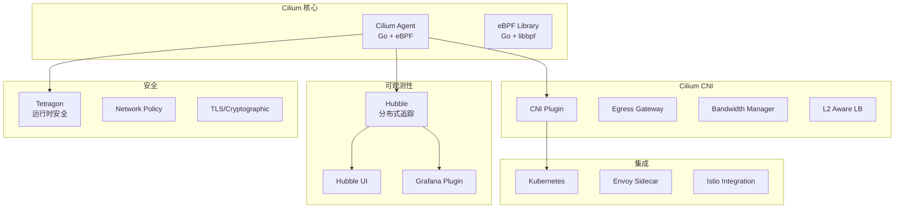
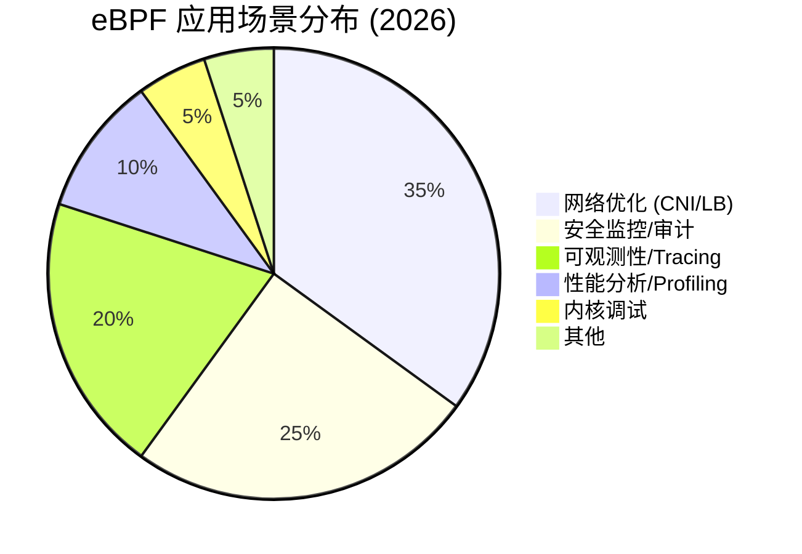
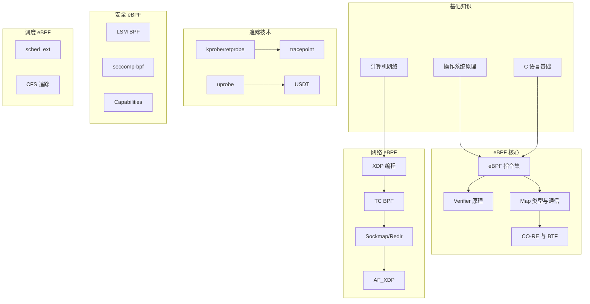
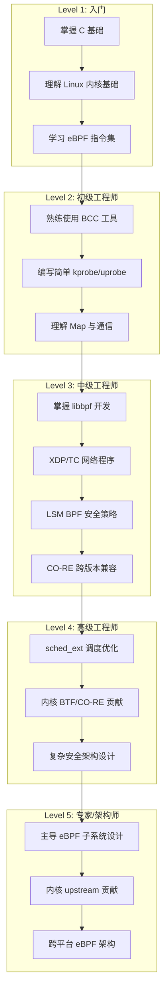
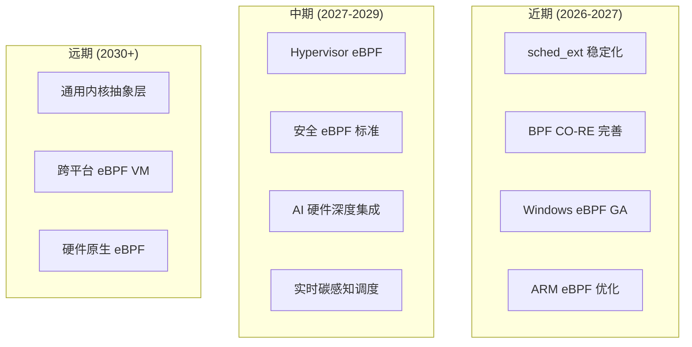

> [!info] eBPF 2026 深度探索系列 0. [[2026-04-08-ebpf-comprehensive-learning-roadmap|全栈学习路径总览]]
>
> 1. [[ch1-registers-and-instructions|第一章：寄存器与指令集]]
> 2. [[ch1-5-function-calls|第一.五章：四种函数调用与动态内存]]
> 3. [[ch1-6-the-verifier|第一.六章：验证器 (Verifier) 的底层逻辑]]
> 4. [[ch2-maps-and-communication|第二章：Map 机制与跨空间通信]]
> 5. [[ch2-5-kptr-and-ownership|第二.五章：kptr (内核指针) 与内存所有权模型]]
> 6. [[ch3-core-and-btf|第三章：CO-RE 与 BTF 的跨版本魔法]]
> 7. [[ch4-tracing-hooks-and-security|第四章：从 kprobe 到 LSM 的追踪全图景]]
> 8. [[ch7-5-uprobes-dynamic-tracing|第七.五章：uprobe 用户态动态追踪原理]]
> 9. [[ch7-6-bpftime-user-runtime|第七.六章：bpftime 与用户态 eBPF 加速]]
> 10. [[ch18-bpftime-injection-mastery|第七.七章：bpftime 自动化注入与全量监控实战]]
> 11. [[ch7-8-uprobe-selection-guide|第七.八章：uprobe 选型指南：内核态 vs 用户态]]
> 12. [[ch5-xdp-networking-performance|第五章：XDP 极致网络性能与全栈架构]]
> 13. [[ch6-tc-traffic-control|第六章：TC (Traffic Control) 流量调度艺术]]
> 14. [[ch7-security-lsm-enforcement|第七章：LSM BPF 从可观测到安全执法]]
> 15. [[ch8-advanced-tuning-and-profiling|第八章：进阶实战与内核调优]]
> 16. [[ch9-af-xdp-zero-copy|第九章：AF_XDP 零拷贝与用户态协议栈]]
> 17. [[ch10-sched-ext-custom-scheduler|第十章：sched_ext 自定义 CPU 调度器]]
> 18. [[ch11-bpf-iterators|第十一章：BPF Iterators 内核对象迭代器]]
> 19. [[ch12-kfuncs-evolution|第十二章：kfuncs 下一代内核交互标准]]
> 20. [[ch13-usdt-tracing|第十三章：USDT 用户态静态定义追踪]]
> 21. [[ch14-ai-llm-inference-monitoring|第十四章：AI 推理与大模型监控前沿]]
> 22. [[ch15-container-isolation|第十五章：无感增强容器隔离性]]
> 23. [[ch16-ebpf-and-wasm|第十六章：eBPF 与 WebAssembly (WASM) 的共生架构]]
> 24. [[ch17-storage-and-filesystem|第十七章：存储与文件系统加速]]
> 25. [[ch18-lifecycle-and-links|第十八章：生命周期管理与 BPF Links]]
> 26. [[ch19-atomic-updates-and-hot-upgrade|第十九章：程序的原子更新与蓝绿部署]]
> 27. [[ch25-5-stack-trace-correlation|第二五.五章：调用栈与业务请求的深度绑定]]
> 28. [[ch20-edge-iot-acceleration|第二十章：边缘计算与工业协议加速]]
> 29. [[ch21-debugging-and-verifier|第二十一章：调试实战与验证器 (Verifier) 诊断]]
> 30. [[ch22-testing-and-ci-cd|第二十二章：测试与持续集成 (CI/CD) 实战]]
> 31. [[ch23-security-and-permissions|第二十三章：权限细分与 BPF 安全沙箱]]
> 32. [[ch24-meta-monitoring-and-self-healing|第二十四章：eBPF 程序的内核自愈与监控]]
> 33. [[ch25-full-stack-observability|第二十五章：全栈可观测性与端到端追踪]]
> 34. [[ch26-network-security-high-level|第二十六章：网络安全防御的高阶实战]]
> 35. [[ch27-agent-engineering-architecture|第二十七章：工业级模块化 Agent 架构演进]]
> 36. [[ch28-offensive-and-defensive|第二十八章：攻防博弈与 Rootkit 防御]]
> 37. [[ch29-networking-deep-dive|第二十九章：网络应用深水区——负载均衡、Sockmap 与拥塞控制]]
> 38. [[ch30-hardware-offload|第三十章：硬件卸载与 SmartNIC 实战]]
> 39. [[ch31-signed-objects-and-security|第三十一章：内核原生签名与供应链安全]]
> 40. [[ch32-ebpf-for-windows|第三十二章：跨平台崛起——eBPF for Windows]]
> 41. [[ch32-5-macos-status|第三十二.五章：macOS 的特殊路径]]
> 42. [[ch33-serverless-optimization|第三十三章：Serverless 冷启动消除与动态计费]]
> 43. [[ch34-waf-and-rasp|第三十四章：Web 安全革命——内核态 WAF 与 RASP]]
> 44. [[ch35-npu-tpu-ai-hardware|第三十五章：AI 推理硬件 (NPU/TPU) 与硬件定义内核]]
> 45. [[ch36-dynamic-language-introspection|第三十六章：动态语言感知——业务对象的零代码提取]]
> 46. [[ch37-green-computing|第三十七章：绿色计算与能耗精准归因]]
> 47. **第三十八章：2026 生态全景与工程师职业导航**
> 48. [[ch39-rust-aya-framework|第三十九章：Rust eBPF 开发实战——Aya 框架与安全编程]]
> 49. [[ch40-network-protocols-deep-dive|第四十章：网络协议深度解析——TCP/UDP/QUIC 的 eBPF 视角]]
> 50. [[ch41-memory-safety-and-vulnerabilities|第四十一章：eBPF 内存安全与漏洞分析]]
> 51. [[ch42-service-mesh-integration|第四十二章：eBPF 与 Service Mesh 深度集成]]

---

## 1. 概述：eBPF 生态全景

经过本系列 38 章的系统学习，我们从 eBPF 的指令集基础一路探索到了前沿应用。本章将梳理 2026 年 eBPF 生态的全景图谱，并为不同背景的工程师提供明确的职业发展路径。

### 1.1 eBPF 生态全景图

```mermaid
graph TB
    subgraph "内核层 (Linux 6.x)"
        Kernel[BPF Subsystem<br>Verifier + JIT + CO-RE + BTF]
    end

    subgraph "开发框架"
        BCC[BCC (Python/Lua)]
        Libbpf[libbpf (C)]
        Aya[Aya (Rust)]
        Gobpf[goBPF (Go)]
    end

    subgraph "运行时"
        Cilium[Cilium CNI<br>Hubble Observability]
        Pixie[Pixie (K8s)]
        Falco[Falco (Security)]
    end

    subgraph "商业产品"
        Iso4[Iso4 Network]
        CiliumE[Enterprise]
        Tetragon[Tetragon]
    end

    subgraph "云厂商"
        AWS[AWS<br>EFA + Nitro]
        Azure[Azure<br>ACCS]
        Google[GCP<br>GKE Dataplane]
    end

    subgraph "硬件支持"
        NICs[SmartNICs<br>NVIDIA + Intel + AMD]
        CPUs[CPU PMU<br>Intel + AMD + ARM]
    end

    Kernel --> BCC
    Kernel --> Libbpf
    Kernel --> Cilium
    BCC --> Cilium
    Libbpf --> Aya
    Cilium --> CiliumE
```

---

## 2. 核心项目与框架生态

### 2.1 开发框架对比

| 框架       | 语言绑定   | 适用场景           | 学习曲线 | 维护状态 |
| :--------- | :--------- | :----------------- | :------- | :------- |
| **BCC**    | Python/Lua | 临时脚本、快速原型 | 低       | 活跃     |
| **libbpf** | C          | 生产级库、系统编程 | 中       | 活跃     |
| **Aya**    | Rust       | 安全敏感、生产级   | 高       | 活跃     |
| **goBPF**  | Go         | 云原生集成         | 中       | 活跃     |
| **rbpf**   | Ruby       | 实验性             | 高       | 不活跃   |

### 2.2 Cilium 项目生态

Cilium 是目前最成熟的 eBPF 生产级应用：



### 2.3 BCC 到 libbpf 的演进

BCC 提供了交互式的 Python/Lua 接口，适合快速实验：

```python
# BCC Python 示例：追踪 open() 系统调用
from bcc import BPF

program = """
TRACEPOINT_PROBE(syscalls, sys_enter_openat) {
    bpf_trace_printk("File opened: %s\\n", args->filename);
    return 0;
}
"""

b = BPF(text=program)
b.trace_print()
```

libbpf 则更适合系统编程：

```c
// libbpf 示例：XDP 程序
#include <bpf/bpf.h>
#include <bpf/libbpf.h>
#include <linux/bpf.h>

SEC("xdp")
int xdp_prog(struct xdp_md *ctx) {
    return XDP_PASS;
}
```

**推荐**：新项目优先使用 libbpf + CO-RE，已有的 BCC 脚本可逐步迁移。

---

## 3. 行业应用场景分布

### 3.1 主要应用场景



### 3.2 场景与工具链对应

| 场景                | 推荐工具         | 关键特性                   |
| :------------------ | :--------------- | :------------------------- |
| **Kubernetes 网络** | Cilium           | CNI、NetworkPolicy、Hubble |
| **服务网格**        | Cilium + Envoy   | L7 可观测性、mTLS          |
| **容器安全**        | Falco + Tetragon | 运行时检测、策略执行       |
| **性能调优**        | BCC / perfetto   | CPU/内存/网络分析          |
| **分布式追踪**      | Pixie            | 自动追踪、零配置           |
| **DDoS 防护**       | XDP + Cloud      | 网卡级清洗                 |
| **合规审计**        | LSM BPF          | 系统调用拦截               |

---

## 4. 工程师技能图谱

### 4.1 eBPF 专家技能树



### 4.2 不同角色的技能要求

| 角色             | 必备技能                       | 加分技能                | 典型岗位        |
| :--------------- | :----------------------------- | :---------------------- | :-------------- |
| **eBPF 开发**    | C/libbpf、指令集、内核接口     | Rust/Aya、CO-RE、kfuncs | 内核/系统工程师 |
| **云原生安全**   | Cilium、Falco、K8s 网络        | LSM BPF、零信任架构     | 安全工程师      |
| **可观测性平台** | BCC/Python、tracing 原理、OTel | Pixie、Hubble、Grafana  | SRE/DevOps      |
| **网络性能**     | XDP/TC、数据平面、DPDK         | SmartNIC 编程、RDMA     | 网络工程师      |
| **AI 基础设施**  | NPU/TPU 驱动、能效监控、CUDA   | GPUDirect、RDMA         | ML 平台工程师   |

---

## 5. 职业发展路径

### 5.1 技术路径



### 5.2 薪资范围参考 (2026)

| 地区            | 初级 (0-2年) | 中级 (3-5年)  | 高级 (5-8年)  | 专家 (8+年)   |
| :-------------- | :----------- | :------------ | :------------ | :------------ |
| **硅谷**        | $150K-200K   | $200K-280K    | $280K-400K    | $400K-600K    |
| **纽约**        | $140K-180K   | $180K-250K    | $250K-350K    | $350K-500K    |
| **伦敦**        | GBP 80K-120K | GBP 120K-180K | GBP 180K-250K | GBP 250K-400K |
| **中国一线**    | ¥400K-700K   | ¥700K-1200K   | ¥1200K-2000K  | ¥2000K-4000K  |
| **远程 (全球)** | $100K-160K   | $160K-220K    | $220K-320K    | $320K-450K    |

---

## 6. 学习资源与社区

### 6.1 官方文档与规范

| 资源               | URL                                 | 说明          |
| :----------------- | :---------------------------------- | :------------ |
| **BPF Design Q&A** | docs.kernel.org/bpf/bpf_design_QA   | 内核设计 FAQ  |
| **BPF PR 说明**    | www.kernel.org/doc/html/latest/bpf/ | 内核文档      |
| **libbpf 文档**    | github.com/libbpf/libbpf            | 库文档与示例  |
| **Cilium 文档**    | docs.cilium.io                      | CNI 与 Hubble |
| **BCC 文档**       | github.com/iovisor/bcc              | 工具与示例    |

### 6.2 书籍推荐

| 书名                                     | 作者               | 适合人群 |
| :--------------------------------------- | :----------------- | :------- |
| **BPF Performance Tools**                | Brendan Gregg      | 所有级别 |
| **Linux Observability with BPF**         | David Calavera     | 初中级   |
| **eBPF: The Future of Linux Networking** | Various (O'Reilly) | 中级     |
| **Security Observability with eBPF**     | Jaejyn Shin        | 安全方向 |

### 6.3 会议与社区

| 会议                     | 时间           | 内容                       |
| :----------------------- | :------------- | :------------------------- |
| **LPC (Linux Plumbers)** | 每年 9 月      | eBPF 专题 microconferences |
| **bpfconf**              | 每年 (Virtual) | BPF 开发者大会             |
| **OSS NA/EMEA**          | 每年 5/11 月   | 云原生与开源               |
| **Kernel Recipes**       | 每年           | 内核深入                   |
| **eBPF Summit**          | 每年           | 厂商与用户交流             |

---

## 7. 实战项目推荐

### 7.1 入门项目

**项目 1：系统调用追踪器**

- 目标：使用 BCC 追踪任意进程的系统调用
- 学习点：kprobe、tracepoint、bpftrace 脚本
- 产出时间：1-2 天

**项目 2：容器网络可视化**

- 目标：使用 Cilium Hubble 展示 Pod 间流量
- 学习点：Cilium 部署、Hubble CLI/LUI
- 产出时间：1 周

### 7.2 中级项目

**项目 3：自定义 XDP 防火墙**

- 目标：实现基于 IP/Port/Protocol 的包过滤
- 学习点：XDP 编程、Packet parsing、Map 查找
- 产出时间：2-4 周

**项目 4：LSM BPF 安全沙箱**

- 目标：实现进程级的系统调用访问控制
- 学习点：LSM Hook、安全策略、seccomp
- 产出时间：2-4 周

### 7.3 高级项目

**项目 5：eBPF 驱动的服务网格**

- 目标：基于 Cilium + Envoy 实现 L7 负载均衡
- 学习点：EnvoyFilter、TLS termination、可观测性
- 产出时间：1-3 月

**项目 6：sched_ext 自定义调度器**

- 目标：实现延迟敏感的 AI 推理任务调度
- 学习点：sched_ext BPF、调度算法、系统集成
- 产出时间：2-4 月

---

## 8. 面试指南

### 8.1 常见面试问题

**Q1: eBPF 程序的加载和执行流程是什么？**

A: 关键步骤：

1. 用户态调用 `bpf()` 系统调用（`bpf_prog_load`）
2. 内核验证器检查程序安全性（指令合法性、内存访问边界、循环限制）
3. JIT 编译器将字节码编译为目标架构机器码
4. 程序附加到 Hook 点（kprobe、XDP、tracepoint 等）
5. 触发时内核执行 JIT 编译后的机器码

**Q2: eBPF Map 有哪些类型？各自的使用场景？**

A: 核心类型：

- `BPF_MAP_TYPE_HASH`: 键值对查找，适合策略存储
- `BPF_MAP_TYPE_ARRAY`: 数组下标访问，适合统计计数
- `BPF_MAP_TYPE_PERCPU_ARRAY`: 每 CPU 独立数组，避免锁竞争
- `BPF_MAP_TYPE_RINGBUF`: 高性能 Ring Buffer，适合日志事件
- `BPF_MAP_TYPE_LPM_TRIE`: 最长前缀匹配，适合 IP 白名单
- `BPF_MAP_TYPE_CGROUP_STORAGE`: Cgroup 级别存储，适合容器隔离

**Q3: CO-RE 如何实现跨内核版本兼容？**

A: CO-RE 通过 BTF 描述类型信息，在加载时通过 libbpf 进行**重定位**：

1. 编译时保留字段偏移量的占位符
2. 加载时通过 BTF 查询目标内核的实际偏移量
3. libbpf 替换占位符为实际值

**Q4: XDP Redirect 的工作原理？**

A: `bpf_redirect()` 将数据包重定向到其他接口或 CPU：

1. XDP 程序返回 `XDP_REDIRECT`
2. 内核通过 `bpf_redirect_info` 保存目标接口/队列信息
3. 底层驱动调用 `ndo_xdp_xmit` 完成实际传输
4. `AF_XDP` 模式下可通过 `bpf_redirect_map()` 零拷贝转发

**Q5: 如何防止 eBPF 程序被恶意利用？**

A: 多层防护：

1. **CAP_BPF**: 限制谁能加载 BPF 程序
2. **Verifier**: 静态分析，拒绝危险操作
3. **签名校验**: 内核签名验证机制 (CONFIG_BPF_SIGNATURE)
4. ** LSM BPF**: 使用 LSM BPF 策略精细控制
5. **沙箱**: unprivileged_bpf_disabled 控制普通用户

### 8.2 面试加分项

| 加分项       | 说明                       | 证明方式                      |
| :----------- | :------------------------- | :---------------------------- |
| **内核贡献** | 提交过 eBPF 相关 patch     | GitHub PR / kernel.org commit |
| **开源项目** | 参与 BCC/Cilium/Falco 贡献 | GitHub contributions          |
| **论文发表** | 深入研究并发表论文         | ACM/IEEE publication          |
| **专利**     | eBPF 相关创新专利          | 专利号                        |
| **演讲**     | 在 conference 分享经验     | Conference talk 视频          |

---

## 9. 未来展望

### 9.1 eBPF 发展方向



### 9.2 技术趋势

| 趋势             | 描述                               | 影响               |
| :--------------- | :--------------------------------- | :----------------- |
| **eBPF 标准化**  | POSIX-like 接口标准化              | 跨平台移植更容易   |
| **硬件原生支持** | SmartNIC/RISC-V 内置 eBPF 执行单元 | 性能提升 10x       |
| **AI 深度集成**  | NPU/TPU 调度与监控                 | ML 基础设施革命    |
| **安全原生**     | eBPF 成为安全策略的事实标准        | 传统防火墙逐步淘汰 |
| **绿色计算**     | 碳感知调度成为标配                 | 降低 20-40% 碳排放 |

---

## 10. 结语：持续进化的 eBPF

eBPF 从 2014 年的诞生到 2026 年的繁荣不过十二年，但它已经深刻改变了 Linux 内核的扩展方式，也改变了云原生网络、安全和可观测性的格局。

无论你是系统工程师、安全工程师、SRE 还是 DevOps，从本系列学到的 eBPF 知识都将是你未来十年最值得投资的技术技能之一。

保持好奇，持续实践，积极参与社区——这正是 eBPF 生态蓬勃发展的原动力。

**下一步推荐**：

- [[ch39-rust-aya-framework|第三十九章：Rust eBPF 开发实战——Aya 框架与安全编程]]
- [[ch40-network-protocols-deep-dive|第四十章：网络协议深度解析——TCP/UDP/QUIC 的 eBPF 视角]]
- [[ch41-memory-safety-and-vulnerabilities|第四十一章：eBPF 内存安全与漏洞分析]]
- [[ch42-service-mesh-integration|第四十二章：eBPF 与 Service Mesh 深度集成]]
