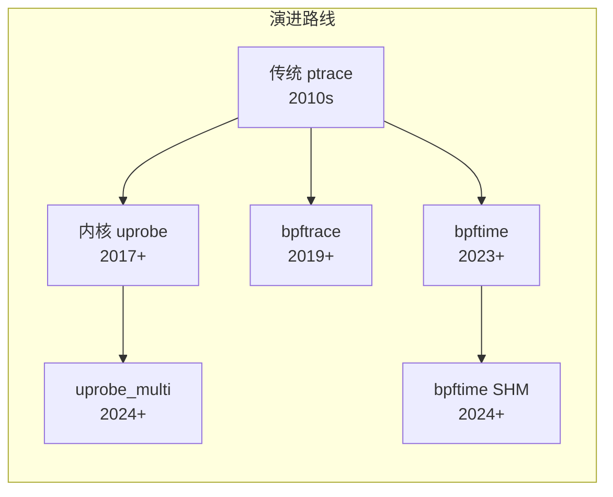
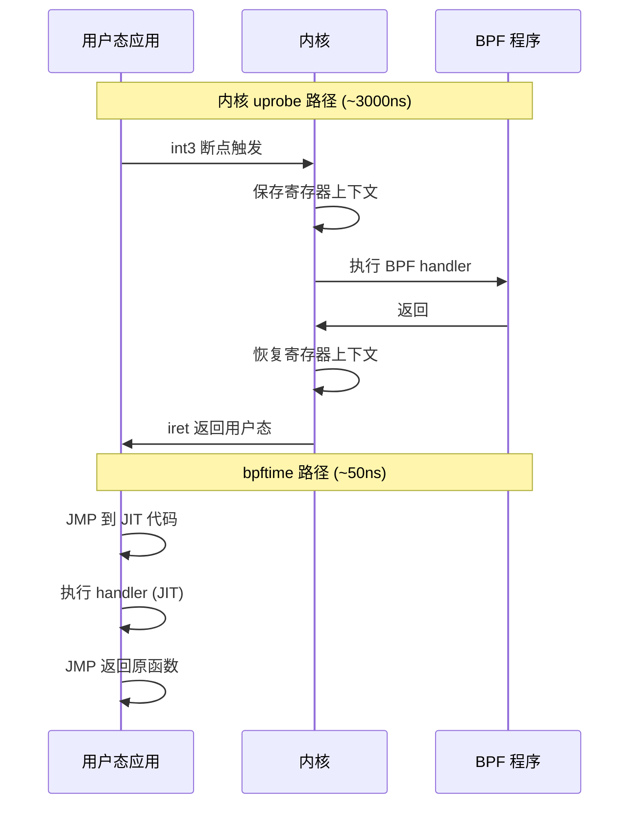
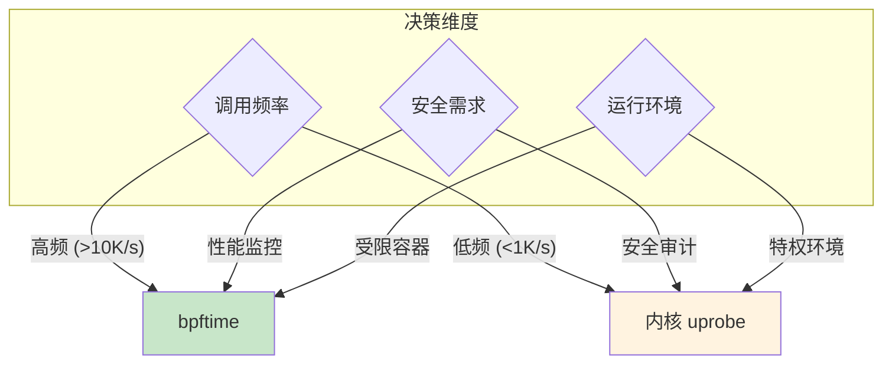
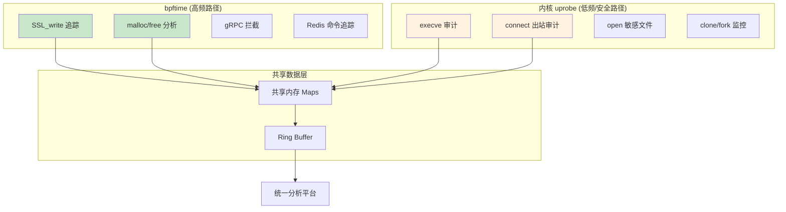
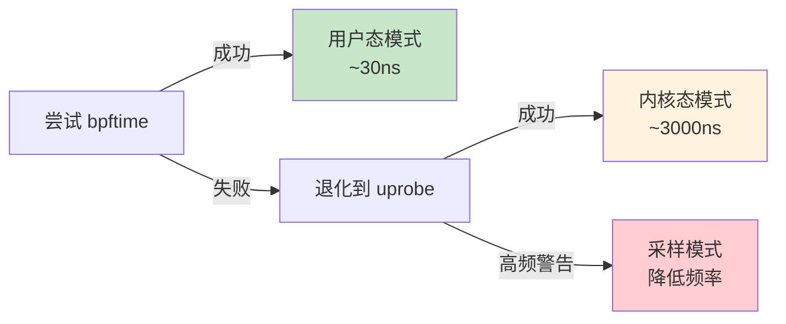
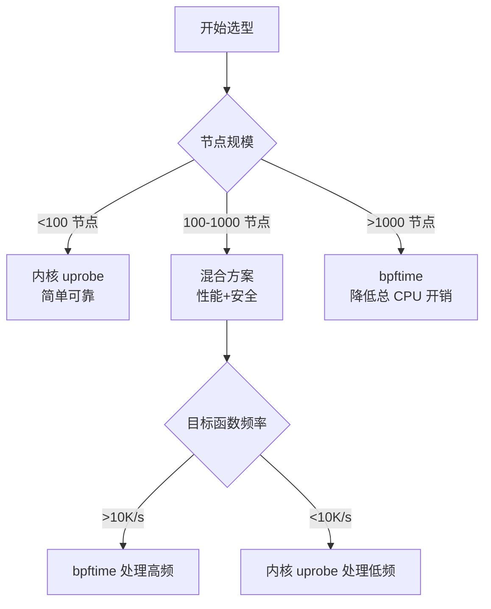

> [!info] eBPF 2026 深度探索系列 0. [[2026-04-08-ebpf-comprehensive-learning-roadmap|全栈学习路径总览]]
>
> 1. [[ch1-registers-and-instructions|第一章：寄存器与指令集]]
> 2. [[ch1-5-function-calls|第一.五章：四种函数调用与动态内存]]
> 3. [[ch1-6-the-verifier|第一.六章：验证器 (Verifier) 的底层逻辑]]
> 4. [[ch2-maps-and-communication|第二章：Map 机制与跨空间通信]]
> 5. [[ch2-5-kptr-and-ownership|第二.五章：kptr (内核指针) 与内存所有权模型]]
> 6. [[ch3-core-and-btf|第三章：CO-RE 与 BTF 的跨版本魔法]]
> 7. [[ch4-tracing-hooks-and-security|第四章：从 kprobe 到 LSM 的追踪全图景]]
> 8. [[ch7-5-uprobes-dynamic-tracing|第七.五章：uprobe 用户态动态追踪原理]]
> 9. [[ch7-6-bpftime-user-runtime|第七.六章：bpftime 与用户态 eBPF 加速]]
> 10. [[ch18-bpftime-injection-mastery|第七.七章：bpftime 自动化注入与全量监控实战]]
> 11. **第七.八章：uprobe 选型指南：内核态 vs 用户态**
> 12. [[ch5-xdp-networking-performance|第五章：XDP 极致网络性能与全栈架构]]
> 13. [[ch6-tc-traffic-control|第六章：TC (Traffic Control) 流量调度艺术]]
> 14. [[ch7-security-lsm-enforcement|第七章：LSM BPF 从可观测到安全执法]]
> 15. [[ch8-advanced-tuning-and-profiling|第八章：进阶实战与内核调优]]
> 16. [[ch9-af-xdp-zero-copy|第九章：AF_XDP 零拷贝与用户态协议栈]]
> 17. [[ch10-sched-ext-custom-scheduler|第十章：sched_ext 自定义 CPU 调度器]]
> 18. [[ch11-bpf-iterators|第十一章：BPF Iterators 内核对象迭代器]]
> 19. [[ch12-kfuncs-evolution|第十二章：kfuncs 下一代内核交互标准]]
> 20. [[ch13-usdt-tracing|第十三章：USDT 用户态静态定义追踪]]
> 21. [[ch14-ai-llm-inference-monitoring|第十四章：AI 推理与大模型监控前沿]]
> 22. [[ch15-container-isolation|第十五章：无感增强容器隔离性]]
> 23. [[ch16-ebpf-and-wasm|第十六章：eBPF 与 WebAssembly (WASM) 的共生架构]]
> 24. [[ch17-storage-and-filesystem|第十七章：存储与文件系统加速]]
> 25. [[ch18-lifecycle-and-links|第十八章：生命周期管理与 BPF Links]]
> 26. [[ch19-atomic-updates-and-hot-upgrade|第十九章：程序的原子更新与蓝绿部署]]
> 27. [[ch25-5-stack-trace-correlation|第二五.五章：调用栈与业务请求的深度绑定]]
> 28. [[ch20-edge-iot-acceleration|第二十章：边缘计算与工业协议加速]]
> 29. [[ch21-debugging-and-verifier|第二十一章：调试实战与验证器 (Verifier) 诊断]]
> 30. [[ch22-testing-and-ci-cd|第二十二章：测试与持续集成 (CI/CD) 实战]]
> 31. [[ch23-security-and-permissions|第二十三章：权限细分与 BPF 安全沙箱]]
> 32. [[ch24-meta-monitoring-and-self-healing|第二十四章：eBPF 程序的内核自愈与监控]]
> 33. [[ch25-full-stack-observability|第二十五章：全栈可观测性与端到端追踪]]
> 34. [[ch26-network-security-high-level|第二十六章：网络安全防御的高阶实战]]
> 35. [[ch27-agent-engineering-architecture|第二十七章：工业级模块化 Agent 架构演进]]
> 36. [[ch28-offensive-and-defensive|第二十八章：攻防博弈与 Rootkit 防御]]
> 37. [[ch29-networking-deep-dive|第二十九章：网络应用深水区——负载均衡、Sockmap 与拥塞控制]]
> 38. [[ch30-hardware-offload|第三十章：硬件卸载与 SmartNIC 实战]]
> 39. [[ch31-signed-objects-and-security|第三十一章：内核原生签名与供应链安全]]
> 40. [[ch32-ebpf-for-windows|第三十二章：跨平台崛起——eBPF for Windows]]
> 41. [[ch32-5-macos-status|第三十二.五章：macOS 的特殊路径]]
> 42. [[ch33-serverless-optimization|第三十三章：Serverless 冷启动消除与动态计费]]
> 43. [[ch34-waf-and-rasp|第三十四章：Web 安全革命——内核态 WAF 与 RASP]]
> 44. [[ch35-npu-tpu-ai-hardware|第三十五章：AI 推理硬件 (NPU/TPU) 与硬件定义内核]]
> 45. [[ch36-dynamic-language-introspection|第三十六章：动态语言感知——业务对象的零代码提取]]
> 46. [[ch37-green-computing|第三十七章：绿色计算与能耗精准归因]]
> 47. [[ch38-ecosystem-and-career|第三十八章：2026 生态全景与工程师职业导航]]
> 48. [[ch39-rust-aya-framework|第三十九章：Rust eBPF 开发实战——Aya 框架与安全编程]]
> 49. [[ch40-network-protocols-deep-dive|第四十章：网络协议深度解析——TCP/UDP/QUIC 的 eBPF 视角]]
> 50. [[ch41-memory-safety-and-vulnerabilities|第四十一章：eBPF 内存安全与漏洞分析]]
> 51. [[ch42-service-mesh-integration|第四十二章：eBPF 与 Service Mesh 深度集成]]

---

# 第七章.8：uprobe 选型指南：内核态 vs 用户态

## 1. 用户态追踪的二元进化

到 2026 年，用户态追踪已演化出两条截然不同的技术路径：

- **内核原生 uprobe**：以稳定性和安全审计能力著称
- **bpftime（用户态运行时）**：以极致性能和零权限运行为核心优势

选择哪种技术，直接决定了监控系统的性能上限与防御广度。



---

## 2. 全维度对比

### 2.1 核心差异

| 维度            | 内核 uprobe                  | bpftime (用户态)         |
| :-------------- | :--------------------------- | :----------------------- |
| **触发机制**    | `int3` 断点 → 内核异常       | JMP 指令 → 进程内跳转    |
| **单次延迟**    | ~1000-5000ns                 | ~30-150ns                |
| **上下文切换**  | 2次（用户↔内核）             | 0次                      |
| **可见性**      | 全局（内核视角）             | 进程内（用户视角）       |
| **权限要求**    | `CAP_SYS_ADMIN` 或 `CAP_BPF` | 普通用户（LD_PRELOAD）   |
| **内核版本**    | Linux 4.x+                   | 任意内核（用户态实现）   |
| **安全性**      | 高（内核保证隔离）           | 中（用户态注入风险）     |
| **Helper 函数** | 完整支持                     | 部分支持（用户态可实现） |
| **稳定性**      | 高（内核成熟机制）           | 中（依赖注入环境）       |
| **多进程追踪**  | 支持                         | 每进程独立实例           |
| **热更新**      | 支持（BPF_LINK）             | 需重启注入               |

### 2.2 延迟深度剖析



**关键数据点：**

| 指标                   | 内核 uprobe | bpftime  |
| :--------------------- | :---------- | :------- |
| 断点设置时间           | ~5μs        | ~1μs     |
| 单次触发延迟           | 1-5μs       | 30-150ns |
| 每秒可处理事件数       | ~200K       | ~5M      |
| 内存开销/probe         | ~2KB        | ~256B    |
| CPU 开销 (1M events/s) | ~3%         | ~0.3%    |

### 2.3 性能分水岭



---

## 3. 技术暗礁：bpftime 的环境限制

### 3.1 PTRACE 作用域限制

```bash
# 检查当前 PTRACE 限制
cat /proc/sys/kernel/yama/ptrace_scope
# 0: 无限制（危险）
# 1: 仅允许父进程调试子进程（默认）
# 2: 仅允许 CAP_SYS_PTRACE
# 3: 完全禁止

# 临时修改（需要 root）
echo 0 | sudo tee /proc/sys/kernel/yama/ptrace_scope

# 永久修改
echo "kernel.yama.ptrace_scope = 0" | sudo tee -a /etc/sysctl.d/99-bpftime.conf
sudo sysctl -p /etc/sysctl.d/99-bpftime.conf
```

### 3.2 W^X 内存保护

bpftime 的 JIT 引擎需要分配 RWX（可读可写可执行）内存页。现代安全系统默认禁止：

```bash
# SELinux 下允许 execmem（谨慎使用）
sudo setsebool -P domain_can_mmap_shared_pages 1

# 检查当前 execmem 状态
getsebool domain_can_mmap_shared_pages

# 或者使用 bpftime 的解释器模式（不需要 RWX）
bpftime attach --interp -e trace.o -p $(pgrep myapp)
```

### 3.3 静态链接与符号剥离

| 二进制特征          | LD_PRELOAD | PTRACE | bpftime 可用性 |
| :------------------ | :--------- | :----- | :------------- |
| 动态链接 + 符号完整 | 可用       | 可用   | 完美           |
| 动态链接 + 符号剥离 | 可用       | 可用   | 需手动偏移     |
| 静态链接            | **不可用** | 可用   | 需 PTRACE 注入 |
| PIE (地址随机化)    | 可用       | 可用   | 自动处理       |

### 3.4 容器环境特殊限制

```yaml
# Docker 需要的特权配置
docker run --cap-add=SYS_PTRACE \
           --security-opt seccomp=unconfined \
           -v /proc:/host_proc:ro \
           bpftime-agent

# Kubernetes DaemonSet 示例
apiVersion: apps/v1
kind: DaemonSet
metadata:
  name: bpftime-agent
spec:
  template:
    spec:
      containers:
      - name: agent
        image: bpftime/agent:latest
        securityContext:
          privileged: true
          capabilities:
            add: ["SYS_PTRACE"]
```

---

## 4. 场景选型矩阵

### 4.1 详细决策表

| 场景                 | 推荐方案          | 核心理由            | 关键指标     |
| :------------------- | :---------------- | :------------------ | :----------- |
| **全链路 APM**       | bpftime           | 降低微服务 CPU 损耗 | <1% 吞吐影响 |
| **运行时安全**       | 内核 LSM          | 防止监控被绕过      | 零绕过可能   |
| **SSL 明文抓取**     | bpftime           | 高吞吐不丢包        | 100K+ conn/s |
| **故障紧急排查**     | 内核 bpftrace     | 部署最快            | 30s 上线     |
| **移动端/安卓**      | bpftime           | 绕过内核限制        | 无 root 需求 |
| **数据库慢查询分析** | bpftime           | 追踪高频执行路径    | 微秒级延迟   |
| **容器安全审计**     | 内核 uprobe + LSM | 全局视角 + 执法能力 | 覆盖所有容器 |
| **Service Mesh**     | bpftime           | 替代 Sidecar        | 零额外延迟   |
| **老内核 (3.10)**    | bpftime           | 不依赖内核 BPF      | 兼容性优先   |
| **合规审计**         | 内核 uprobe       | 审计日志不可篡改    | 防篡改       |
| **Go 服务监控**      | 内核 uprobe       | Go runtime 兼容性   | 稳定追踪     |
| **Python 应用**      | bpftime           | 追踪 C 扩展函数     | 低延迟       |

### 4.2 混合部署架构



---

## 5. 自动退化机制 (Auto-Fallback)

2026 年的工业级监控 Agent 采用自适应策略，不再强制单一路径：

```c
// 伪代码：自动退化逻辑
int attach_probe(const char *binary, const char *symbol) {
    // 阶段 1: 尝试 bpftime 注入
    int ret = bpftime_attach(binary, symbol, prog_fd);
    if (ret == 0) {
        log_info("Using bpftime for %s:%s", binary, symbol);
        return BPFTIME_MODE;
    }

    // 阶段 2: 退化到内核 uprobe
    log_warn("bpftime failed for %s:%s, falling back to kernel uprobe",
             binary, symbol);
    ret = kernel_uprobe_attach(binary, symbol, prog_fd);
    if (ret == 0) {
        log_info("Using kernel uprobe for %s:%s", binary, symbol);
        return UPROBE_MODE;
    }

    // 阶段 3: 采样模式（如果函数频率过高）
    log_warn("Kernel uprobe may cause performance issue, using sampling");
    return SAMPLING_MODE;
}
```



### 5.1 退化触发条件

| 条件                 | 检测方法                                  | 退化目标     |
| :------------------- | :---------------------------------------- | :----------- |
| LD_PRELOAD 被阻止    | 检查 `/proc/self/maps`                    | PTRACE 注入  |
| PTRACE scope = 3     | 读取 `/proc/sys/kernel/yama/ptrace_scope` | 采样模式     |
| 目标进程静态链接     | 检查 ELF header                           | 内核 uprobe  |
| 符号被剥离           | `nm` 返回空                               | 手动偏移模式 |
| SELinux 阻止 execmem | `getenforce` 检查                         | 解释器模式   |
| 目标进程短生命周期   | PID 存在时间 < 1s                         | 放弃追踪     |

---

## 6. 实战案例：全链路 SSL 监控

### 6.1 架构设计

```c
// 混合方案：bpftime 捕获数据 + 内核 uprobe 做安全审计

// === bpftime 侧：高性能数据采集 ===
SEC("uprobe/libssl.so.3:SSL_write")
int BPF_UPROBE(ssl_write_capture, void *ssl, const void *buf, int num) {
    // 高频采集，每包都记录
    struct event *e = bpf_ringbuf_reserve(&events, sizeof(*e), 0);
    if (e) {
        e->type = EVENT_SSL_WRITE;
        e->pid = bpf_get_current_pid_tgid() >> 32;
        e->len = num;
        e->timestamp = bpf_ktime_get_ns();
        bpf_probe_read_user_str(e->data, MIN(num, 256), buf);
        bpf_ringbuf_submit(e, 0);
    }
    return 0;
}

// === 内核侧：安全审计（低频，但不可绕过）===
SEC("uprobe/libssl.so.3:SSL_write")
int BPF_UPROBE(ssl_write_audit, void *ssl, const void *buf, int num) {
    // 仅审计可疑流量（如非标准端口）
    u32 pid = bpf_get_current_pid_tgid() >> 32;
    struct audit_record *rec = bpf_map_lookup_elem(&suspicious_pids, &pid);
    if (rec) {
        // 记录到审计日志
        bpf_ringbuf_submit(&audit_buf, ...);
    }
    return 0;
}
```

### 6.2 性能基准

| 指标                       | 纯内核 uprobe | bpftime + 内核混合 |
| :------------------------- | :------------ | :----------------- |
| SSL_write 延迟增加         | 8μs           | 0.8μs              |
| CPU 占用 (100K TLS conn/s) | 12%           | 2%                 |
| 安全审计覆盖率             | 100%          | 100%               |
| 数据丢失率                 | 0%            | <0.01%             |

---

## 7. 语言特定追踪指南

### 7.1 Go 语言追踪

Go 程序的追踪具有独特挑战：

```c
// Go cgo 调用追踪（直接可用）
SEC("uprobe/myapp.so:_Cfunc_mysql_real_query")
int BPF_UPROBE(go_cgo_trace, void *conn, const char *query, unsigned long len) {
    // cgo 调用走标准 C ABI，正常追踪
    struct event *e = bpf_ringbuf_reserve(&events, sizeof(*e), 0);
    if (e) {
        bpf_probe_read_user_str(e->query, MIN(len, 256), query);
        bpf_ringbuf_submit(e, 0);
    }
    return 0;
}
```

| Go 函数类型     | 内核 uprobe        | bpftime  | 建议          |
| :-------------- | :----------------- | :------- | :------------ |
| cgo 调用        | 可用               | 可用     | 推荐 uprobe   |
| runtime 函数    | 需特殊处理         | 部分可用 | 使用 USDT     |
| 普通 Go 函数    | 需符号表           | 不稳定   | 使用 Go trace |
| Go HTTP handler | 通过 net/http USDT | 不支持   | USDT 探针     |

### 7.2 Python 追踪

```c
// 追踪 Python C 扩展（如 numpy, pandas）
SEC("uprobe/libpython3.12.so.1.0:PyEval_EvalFrameDefault")
int BPF_UPROBE(python_eval_trace, struct _frame *frame) {
    // 获取当前执行的 Python 代码对象
    struct code_object *code;
    bpf_probe_read_user(&code, sizeof(code), &frame->f_code);

    // 提取文件名和行号
    char filename[128];
    bpf_probe_read_user_str(filename, sizeof(filename), code->co_filename);

    int lineno;
    bpf_probe_read_user(&lineno, sizeof(lineno), &frame->f_lineno);

    bpf_printk("Python: %s:%d", filename, lineno);
    return 0;
}
```

---

## 8. 成本效益分析

### 8.1 TCO 对比

| 成本项       | 内核 uprobe           | bpftime                    |
| :----------- | :-------------------- | :------------------------- |
| 开发成本     | 中（标准 BPF 工具链） | 中高（需学习 bpftime API） |
| 运维成本     | 低（内核稳定）        | 中（需管理注入环境）       |
| 硬件开销     | 高（频繁上下文切换）  | 低（用户态处理）           |
| 安全审计成本 | 低（内核保证）        | 高（需额外验证）           |
| 人才需求     | eBPF 工程师           | eBPF + 系统编程            |

### 8.2 ROI 决策树



---

## 9. 迁移指南

### 9.1 从 uprobe 迁移到 bpftime

```bash
# 步骤 1: 评估兼容性
bpftime check -p $(pgrep myapp)

# 步骤 2: 试运行（不实际注入）
bpftime dry-run -e trace.o -p $(pgrep myapp)

# 步骤 3: 灰度部署（仅 10% 流量）
bpftime attach -e trace.o -p $(pgrep myapp) --sample-rate 10

# 步骤 4: 全量部署
bpftime attach -e trace.o -p $(pgrep myapp)

# 步骤 5: 验证
bpftime stats -p $(pgrep myapp)
```

### 9.2 代码适配要点

```c
// 内核 uprobe 代码
SEC("uprobe/myapp:process_request")
int BPF_UPROBE(handle_request, void *req) {
    u64 pid_tgid = bpf_get_current_pid_tgid();
    // ... 标准内核 BPF 逻辑
}

// bpftime 适配（API 差异）
// 1. bpf_get_current_pid_tgid() 在 bpftime 中行为一致
// 2. bpf_probe_read_user() 改为直接指针解引用（更快）
// 3. bpf_ringbuf_output() 在 bpftime 中使用共享内存实现
// 4. 不支持 bpf_get_current_comm()，需手动读取

SEC("uprobe/myapp:process_request")
int BPF_UPROBE(handle_request_bpftime, void *req) {
    // bpftime 特有：可以直接解引用用户态指针
    struct request *r = (struct request *)req;
    u32 type = r->type;  // 直接读取，无需 bpf_probe_read

    // 注意：需要手动处理 ASLR
    u64 offset = (u64)req - base_addr;
    // ...
}
```

---

## 10. 常见问题 FAQ

**Q1：能否同时使用 bpftime 和内核 uprobe 追踪同一函数？**

A：技术上不推荐。两者都会修改目标函数的入口指令（bpftime 写 JMP，内核写 int3），会互相覆盖。解决方案：在不同函数上分别使用，或者使用 bpftime 的共享内存 Map 与内核 uprobe 协作（各自追踪不同函数，共享数据）。

**Q2：bpftime 的注入是否会被应用检测到？**

A：取决于检测方式。bpftime 使用 LD_PRELOAD 时，应用可以通过检查 `LD_PRELOAD` 环境变量或遍历 `/proc/self/maps` 发现。PTRACE 注入则可以被 `ptrace(PTRACE_TRACEME)` 防护。但在大多数生产环境中，应用不会主动检测这些。如果需要隐蔽性，可以使用静态链接模式将运行时嵌入应用。

**Q3：在 Kubernetes 环境中如何选择？**

A：推荐分层策略：1) 使用 CRI 集成的 bpftime 对业务容器进行性能监控；2) 使用 DaemonSet 部署内核 uprobe Agent 对安全相关事件进行审计；3) 两者通过共享内存 Map 或外部分析平台（如 Grafana）整合数据。

**Q4：bpftime 支持追踪 Go 程序吗？**

A：部分支持。Go 程序的挑战在于：1) Go runtime 使用自己的调度器和栈管理，可能干扰 bpftime 的指令补丁；2) Go 的调用约定与 C 不同。对于 Go 的 cgo 调用可以正常追踪。对于纯 Go 函数，建议使用 Go 的 USDT 探针（`runtime trace`）配合 bpftime。

**Q5：如何评估 bpftime 在我的环境中的适用性？**

A：建议三步评估：1) 检查目标进程是否为动态链接且符号完整（`file` 和 `nm` 命令）；2) 检查 PTRACE scope 和 SELinux 策略；3) 在测试环境用 bpftime 追踪一个低频函数，验证功能正确性后再扩展到高频路径。

**Q6：生产环境出现 bpftime 导致的崩溃如何处理？**

A：1) 立即 kill bpftime 进程，JMP 指令会自动恢复；2) 如果使用 LD_PRELOAD，重启应用（不设置环境变量）；3) 检查 `bpftime_crash.log` 诊断日志；4) 开启解释器模式 `--interp` 排除 JIT 问题；5) 向 bpftime 社区提交 issue 时附带 core dump。
