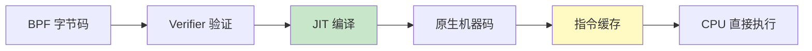

> [!info] eBPF 2026 深度探索系列 0. [[2026-04-08-ebpf-comprehensive-learning-roadmap|全栈学习路径总览]]
>
> 1. [[ch1-registers-and-instructions|第一章：寄存器与指令集]]
> 2. [[ch1-5-function-calls|第一.五章：四种函数调用与动态内存]]
> 3. [[ch1-6-the-verifier|第一.六章：验证器 (Verifier) 的底层逻辑]]
> 4. [[ch2-maps-and-communication|第二章：Map 机制与跨空间通信]]
> 5. [[ch2-5-kptr-and-ownership|第二.五章：kptr (内核指针) 与内存所有权模型]]
> 6. [[ch3-core-and-btf|第三章：CO-RE 与 BTF 的跨版本魔法]]
> 7. [[ch4-tracing-hooks-and-security|第四章：从 kprobe 到 LSM 的追踪全图景]]
> 8. [[ch7-5-uprobes-dynamic-tracing|第七.五章：uprobe 用户态动态追踪原理]]
> 9. [[ch7-6-bpftime-user-runtime|第七.六章：bpftime 与用户态 eBPF 加速]]
> 10. [[ch18-bpftime-injection-mastery|第七.七章：bpftime 自动化注入与全量监控实战]]
> 11. [[ch7-8-uprobe-selection-guide|第七.八章：uprobe 选型指南：内核态 vs 用户态]]
> 12. [[ch5-xdp-networking-performance|第五章：XDP 极致网络性能与全栈架构]]
> 13. [[ch6-tc-traffic-control|第六章：TC (Traffic Control) 流量调度艺术]]
> 14. [[ch7-security-lsm-enforcement|第七章：LSM BPF 从可观测到安全执法]]
> 15. **第八章：进阶实战与内核调优**
> 16. [[ch9-af-xdp-zero-copy|第九章：AF_XDP 零拷贝与用户态协议栈]]
> 17. [[ch10-sched-ext-custom-scheduler|第十章：sched_ext 自定义 CPU 调度器]]
> 18. [[ch11-bpf-iterators|第十一章：BPF Iterators 内核对象迭代器]]
> 19. [[ch12-kfuncs-evolution|第十二章：kfuncs 下一代内核交互标准]]
> 20. [[ch13-usdt-tracing|第十三章：USDT 用户态静态定义追踪]]
> 21. [[ch14-ai-llm-inference-monitoring|第十四章：AI 推理与大模型监控前沿]]
> 22. [[ch15-container-isolation|第十五章：无感增强容器隔离性]]
> 23. [[ch16-ebpf-and-wasm|第十六章：eBPF 与 WebAssembly (WASM) 的共生架构]]
> 24. [[ch17-storage-and-filesystem|第十七章：存储与文件系统加速]]
> 25. [[ch18-lifecycle-and-links|第十八章：生命周期管理与 BPF Links]]
> 26. [[ch19-atomic-updates-and-hot-upgrade|第十九章：程序的原子更新与蓝绿部署]]
> 27. [[ch25-5-stack-trace-correlation|第二五.五章：调用栈与业务请求的深度绑定]]
> 28. [[ch20-edge-iot-acceleration|第二十章：边缘计算与工业协议加速]]
> 29. [[ch21-debugging-and-verifier|第二十一章：调试实战与验证器 (Verifier) 诊断]]
> 30. [[ch22-testing-and-ci-cd|第二十二章：测试与持续集成 (CI/CD) 实战]]
> 31. [[ch23-security-and-permissions|第二十三章：权限细分与 BPF 安全沙箱]]
> 32. [[ch24-meta-monitoring-and-self-healing|第二十四章：eBPF 程序的内核自愈与监控]]
> 33. [[ch25-full-stack-observability|第二十五章：全栈可观测性与端到端追踪]]
> 34. [[ch26-network-security-high-level|第二十六章：网络安全防御的高阶实战]]
> 35. [[ch27-agent-engineering-architecture|第二十七章：工业级模块化 Agent 架构演进]]
> 36. [[ch28-offensive-and-defensive|第二十八章：攻防博弈与 Rootkit 防御]]
> 37. [[ch29-networking-deep-dive|第二十九章：网络应用深水区——负载均衡、Sockmap 与拥塞控制]]
> 38. [[ch30-hardware-offload|第三十章：硬件卸载与 SmartNIC 实战]]
> 39. [[ch31-signed-objects-and-security|第三十一章：内核原生签名与供应链安全]]
> 40. [[ch32-ebpf-for-windows|第三十二章：跨平台崛起——eBPF for Windows]]
> 41. [[ch32-5-macos-status|第三十二.五章：macOS 的特殊路径]]
> 42. [[ch33-serverless-optimization|第三十三章：Serverless 冷启动消除与动态计费]]
> 43. [[ch34-waf-and-rasp|第三十四章：Web 安全革命——内核态 WAF 与 RASP]]
> 44. [[ch35-npu-tpu-ai-hardware|第三十五章：AI 推理硬件 (NPU/TPU) 与硬件定义内核]]
> 45. [[ch36-dynamic-language-introspection|第三十六章：动态语言感知——业务对象的零代码提取]]
> 46. [[ch37-green-computing|第三十七章：绿色计算与能耗精准归因]]
> 47. [[ch38-ecosystem-and-career|第三十八章：2026 生态全景与工程师职业导航]]
> 48. [[ch39-rust-aya-framework|第三十九章：Rust eBPF 开发实战——Aya 框架与安全编程]]
> 49. [[ch40-network-protocols-deep-dive|第四十章：网络协议深度解析——TCP/UDP/QUIC 的 eBPF 视角]]
> 50. [[ch41-memory-safety-and-vulnerabilities|第四十一章：eBPF 内存安全与漏洞分析]]
> 51. [[ch42-service-mesh-integration|第四十二章：eBPF 与 Service Mesh 深度集成]]

---

# 第八章：进阶实战与内核调优

## 1. 从"跑通"到"跑极速"

当 eBPF 程序进入生产环境处理每秒千万级网络包或百万级追踪事件时，代码的微小差异会导致巨大的 CPU 开销。本章聚焦 Map 优化、验证器友好编程、JIT 调优和生产诊断工具链。

---

## 2. Map 极致性能优化

### 2.1 消除多核锁竞争

普通 Hash Map 在高并发写入时触发 Bucket 级别的自旋锁：

```c
// 错误：全局 Hash Map — 多核竞争
struct {
    __uint(type, BPF_MAP_TYPE_HASH);
    __uint(max_entries, 1000000);
    __uint(key_size, sizeof(u32));
    __uint(value_size, sizeof(struct stats));
} global_stats SEC(".maps");

// 正确：Per-CPU Hash Map — 零锁竞争
struct {
    __uint(type, BPF_MAP_TYPE_PERCPU_HASH);
    __uint(max_entries, 1000000);
    __uint(key_size, sizeof(u32));
    __uint(value_size, sizeof(struct stats));
} percpu_stats SEC(".maps");

// Per-CPU Map 的使用模式
SEC("xdp")
int xdp_per_cpu_stats(struct xdp_md *ctx) {
    u32 key = ctx->rx_queue_index;  // 以 RX 队列号为 key

    // 每个 CPU 核心读写自己的独立副本
    struct stats *s = bpf_map_lookup_elem(&percpu_stats, &key);
    if (s) {
        s->packets++;
        s->bytes += ctx->data_end - ctx->data;
    }
    return XDP_PASS;
}
```

### 2.2 预防伪共享 (False Sharing)

当两个 CPU 读写同一 Cache Line（通常 64 字节）的不同字段时，会导致缓存不断失效：

```c
// 错误：紧密排列的结构体 — 伪共享
struct stats_bad {
    u64 packets;   // CPU 0 热写
    u64 bytes;     // CPU 1 热写
    u64 drops;     // CPU 2 热写
};

// 正确：Cache Line 对齐 — 物理隔离
struct stats_good {
    u64 packets;
    u64 bytes;
    u64 drops;
} __attribute__((aligned(64)));  // 强制 64 字节对齐
```

### 2.3 批量操作减少系统调用

```c
// 用户态：批量读取 Map 数据
// 方法 1: bpf_map_lookup_batch
DECLARE_LIBBPF_OPTS(bpf_map_batch_opts, batch_opts,
    .elem_flags = 0,
    .flags = 0,
);

u32 in_batch = 0, out_batch = 0;
u32 keys[64];
struct stats values[64];
u32 count = 64;

// 一次系统调用读取 64 个条目
int err = bpf_map_lookup_and_delete_batch(
    map_fd, &in_batch, &out_batch,
    keys, values, &count, &batch_opts);

// 方法 2: bpf_map_update_batch — 批量写入
u32 update_keys[64];
struct stats update_values[64];
err = bpf_map_update_batch(
    map_fd, update_keys, update_values, &count, &batch_opts);
```

### 2.4 Map 类型选型速查

| 场景         | 推荐 Map 类型 | 理由                |
| :----------- | :------------ | :------------------ |
| IP 黑名单    | LPM_TRIE      | 前缀匹配，CIDR 友好 |
| 连接跟踪     | HASH + PERCPU | 高频读写，锁优化    |
| 简单计数器   | PERCPU_ARRAY  | 最快的无锁计数      |
| 事件队列     | RINGBUF       | 高吞吐，零拷贝      |
| 配置下发     | ARRAY (RO)    | 只读，无锁          |
| 线程本地状态 | PERCPU_HASH   | Per-CPU 隔离        |

---

## 3. 验证器友好编程

### 3.1 路径爆炸问题

验证器遍历所有可能的执行路径。N 个 `if` 分支理论上产生 2^N 条路径，超过验证器上限（100万条）时加载失败：

```c
// 错误：20 个 if 分支 → 2^20 = 1M 路径
SEC("tracepoint/syscalls/sys_enter")
int bad_trace(struct trace_event_raw_sys_enter *ctx) {
    long nr = ctx->args[0];
    if (nr == 1) { ... }
    if (nr == 2) { ... }
    if (nr == 3) { ... }
    // ... 17 more if's ...
    // 验证器: 路径数爆炸，拒绝加载
}

// 正确：使用子程序拆分
__noinline int handle_read(struct trace_event_raw_sys_enter *ctx) {
    // 独立验证此子函数
    return 0;
}

__noinline int handle_write(struct trace_event_raw_sys_enter *ctx) {
    return 0;
}

SEC("tracepoint/syscalls/sys_enter")
int good_trace(struct trace_event_raw_sys_enter *ctx) {
    long nr = ctx->args[0];
    switch (nr) {
    case __NR_read:  return handle_read(ctx);
    case __NR_write: return handle_write(ctx);
    default: return 0;
    }
}
```

### 3.2 寄存器状态标注

验证器需要确认指针运算的安全性。通过显式范围检查帮助验证器推理：

```c
// 错误：验证器无法确认 offset 的范围
void *ptr = data + offset;  // offset 可能是任意值

// 正确：通过边界检查锁定范围
u32 offset;
if (bpf_probe_read_kernel(&offset, sizeof(offset), src) < 0)
    return 0;

// 关键：范围检查让验证器确认 offset < 100
if (offset > 100)
    return 0;

void *ptr = data + offset;
// 验证器现在知道：data ≤ ptr ≤ data + 100
// 后续的边界检查可以通过
if (ptr + sizeof(struct header) > data_end)
    return 0;
```

### 3.3 BPF 子程序限制

| 特性         | 主程序         | 子程序               |
| :----------- | :------------- | :------------------- |
| 最大指令数   | 100 万         | 100 万（共享总预算） |
| 嵌套调用深度 | —              | 最多 8 层            |
| 参数个数     | 由上下文决定   | 最多 5 个 (R1-R5)    |
| 返回值       | 由程序类型决定 | int (R0)             |
| 全局变量     | 不可           | 不可                 |
| Map 访问     | 可以           | 可以                 |
| Helper 调用  | 可以           | 可以（部分受限）     |

---

## 4. JIT 编译与内联优化

### 4.1 JIT 编译流程



### 4.2 常见 JIT 优化

**常量折叠 (Constant Folding)：**

```c
// 编译前
u32 val = 1024 * 1024;

// JIT 优化后（编译期计算）
u32 val = 1048576;  // 直接使用常量
```

**死代码消除 (Dead Code Elimination)：**

```c
// 编译前
if (false) { ... }  // 永远不会执行

// JIT 优化后：整个分支被移除
```

**循环展开 (Loop Unrolling)：**

```c
// 编译前
#pragma unroll
for (int i = 0; i < 4; i++) {
    // ...
}

// JIT 优化后：循环体被复制 4 次
// 避免循环控制开销
```

---

## 5. 性能诊断工具链

### 5.1 bpftool prog profile

```bash
# 运行时性能剖析
sudo bpftool prog profile id 123

# 输出示例：
#  run_cnt  123456789  run_time_ns  987654321
#  avg_ns        8.0  cnt_insns       42
#  cnt_branch    12  cnt_cache_miss    3

# 解读：
# - run_cnt: 执行次数
# - avg_ns: 平均执行时间（纳秒）
# - cnt_insns: 平均指令数
# - cnt_cache_miss: 平均缓存未命中数
```

### 5.2 BPF_PROG_RUN 基准测试

```c
// 用户态：在加载前进行基准测试
int benchmark_prog(int prog_fd, void *data_in, __u32 size) {
    LIBBPF_OPTS(bpf_test_run_opts, opts,
        .data_in = data_in,
        .data_size_in = size,
        .repeat = 1000000,  // 运行 100 万次
    );

    int err = bpf_prog_test_run_opts(prog_fd, &opts);
    if (err) return -1;

    printf("Avg: %llu ns, Total: %llu ns\n",
           opts.duration / opts.repeat, opts.duration);
    return 0;
}
```

### 5.3 perf 与 BPF 结合

```bash
# 查看 BPF 程序的热点指令
sudo perf record -e cycles:k -g --pid $(pgrep myapp) sleep 5
sudo perf report

# 查看 JIT 编译后的原生代码
sudo bpftool prog dump xlated id 123
sudo bpftool prog dump jited id 123
```

### 5.4 BPF_STATS_RUN_TIME

```bash
# 启用运行时统计
echo 1 | sudo tee /proc/sys/kernel/bpf_stats_enabled

# 查看所有 BPF 程序的运行时间
sudo bpftool prog show

# 输出示例：
#  123: xdp  name xdp_filter  tag a1b2c3d4
#   loaded_at 2026-04-08T10:00:00  uid 0
#   xdp  ifindex eth0
#   run_cnt  987654321  run_time_ns  876543210
#   avg_ns        0.9  cnt_insns       35
```

---

## 6. 内核参数调优

### 6.1 BPF 相关内核参数

```bash
# BPF 程序最大指令数（默认 100 万）
echo 2000000 | sudo tee /proc/sys/kernel/bpf_max_insns

# 启用 BPF 运行时统计
echo 1 | sudo tee /proc/sys/kernel/bpf_stats_enabled

# 增大 BPF Map 的内存限制
echo 1073741824 | sudo tee /proc/sys/kernel/bpf_memlock_bytes

# Memory cgroup 中的 BPF 内存限制（容器环境）
# 在 cgroup 中设置
echo "bpf 1G" > /sys/fs/cgroup/memory/bpf.memory.high
```

### 6.2 网络子系统调优

```bash
# 增加 XDP 的 RX 队列数量（提升并行度）
ethtool -L eth0 rx 16

# 增大 socket 接收缓冲区
sysctl -w net.core.rmem_max=134217728
sysctl -w net.core.rmem_default=16777216

# 启用 busy polling（减少中断开销）
sysctl -w net.core.busy_poll=50
sysctl -w net.core.busy_read=50
```

---

## 7. 高级实战：XDP 包处理优化

### 7.1 分支预测优化

```c
SEC("xdp")
int xdp_optimized(struct xdp_md *ctx) {
    void *data = (void *)(long)ctx->data;
    void *data_end = (void *)(long)ctx->data_end;

    struct ethhdr *eth = data;
    if ((void *)(eth + 1) > data_end)
        return XDP_PASS;

    // 优化：将最可能匹配的条件放在前面
    // 分支预测器会"学习"最常见的路径
    if (eth->h_proto != bpf_htons(ETH_P_IP))
        return XDP_PASS;  // 非 IP 包快速返回

    struct iphdr *iph = (void *)(eth + 1);
    if ((void *)(iph + 1) > data_end)
        return XDP_PASS;

    // 使用 __builtin_expect 提示分支概率
    if (__builtin_expect(iph->protocol == IPPROTO_TCP, 1)) {
        // TCP 包（常见路径）
        struct tcphdr *th = (void *)(iph + 1);
        if ((void *)(th + 1) > data_end)
            return XDP_PASS;
        // ... TCP 处理 ...
    } else if (__builtin_expect(iph->protocol == IPPROTO_UDP, 1)) {
        // UDP 包
    } else {
        return XDP_PASS;  // 其他协议快速返回
    }

    return XDP_PASS;
}
```

### 7.2 环形缓冲区批量提交

```c
// 用户态：高效的 Ring Buffer 消费模式
void *poll_events(int ringbuf_fd) {
    struct ring_buffer *rb = ring_buffer__new(ringbuf_fd, handler, NULL, NULL);
    // 每次最多消费 64 个事件
    ring_buffer__poll(rb, 1000);
    return rb;
}

// BPF 端：使用 bpf_ringbuf_discard 在紧急情况下丢弃
SEC("xdp")
int xdp_ringbuf_opt(struct xdp_md *ctx) {
    struct event *e = bpf_ringbuf_reserve(&events, sizeof(*e), 0);
    if (!e) {
        // Ring Buffer 满了 — 快速丢弃而非阻塞
        __sync_fetch_and_add(&dropped, 1);
        return XDP_PASS;
    }
    // 填充事件...
    bpf_ringbuf_submit(e, 0);
    return XDP_PASS;
}
```

---

## 8. 常见性能陷阱

| 陷阱                 | 症状           | 解决方案                             |
| :------------------- | :------------- | :----------------------------------- |
| 全局 Map 锁竞争      | CPU 软中断飙升 | 换用 Per-CPU Map                     |
| 伪共享               | 多核扩展性差   | `__attribute__((aligned(64)))`       |
| 验证器路径爆炸       | 加载失败       | 拆分子程序                           |
| Ring Buffer 满丢事件 | 监控数据缺失   | 增大 buffer 或降低采样率             |
| bpf_printk 开销      | 生产性能退化   | 替换为 Ring Buffer                   |
| 频繁 Map 查找        | CPU cycles 高  | 本地缓存决策结果                     |
| 大字符串拷贝         | 超出栈限制     | 使用 `bpf_probe_read_*_str` 限制长度 |

---

## 9. 常见问题 FAQ

**Q1：Per-CPU Map 的数据如何聚合？**

A：用户态需要遍历所有 CPU 的数据并手动求和。使用 `bpf_map_lookup_percpu_elem(map_fd, &key, cpu)` 逐 CPU 读取。对于统计类场景，推荐在用户态进行聚合，保持 BPF 程序尽可能简短。

**Q2：如何判断 Map 的锁竞争是否严重？**

A：1) 使用 `bpftool map` 查看运行时统计（需要启用 `bpf_stats_enabled`）；2) 使用 `perf record -e sched:sched_stat_sleep` 观察是否有大量 sleep 等待；3) 如果 `bpf_spin_lock` 的持有时间超过 1μs，说明竞争严重。

**Q3：BPF 程序的 JIT 代码能被 perf 分析吗？**

A：可以。JIT 编译后的代码会被注册到内核的符号表中，可以通过 `perf annotate` 查看。使用 `bpftool prog dump jited id N` 可以查看 JIT 生成的原生汇编代码。

**Q4：Ring Buffer 和 Perf Event Array 该选哪个？**

A：2026 年推荐 Ring Buffer：1) 更好的内存利用率（共享缓冲区而非 Per-CPU 固定分配）；2) 支持批量提交和丢弃；3) 更简单的 API。Perf Event Array 仅在需要与旧版工具兼容时使用。

**Q5：如何测量 BPF 程序对系统整体性能的影响？**

A：1) 对比启用/禁用 BPF 程序时的应用吞吐量（如 `wrk`、`iperf`）；2) 使用 `bpf_stats_enabled` 查看 BPF 程序自身的 CPU 时间占比；3) 使用 `perf top` 观察是否有 BPF 相关函数出现在热点中。如果 BPF 程序的 CPU 时间占比超过总 CPU 时间的 10%，需要优化。
