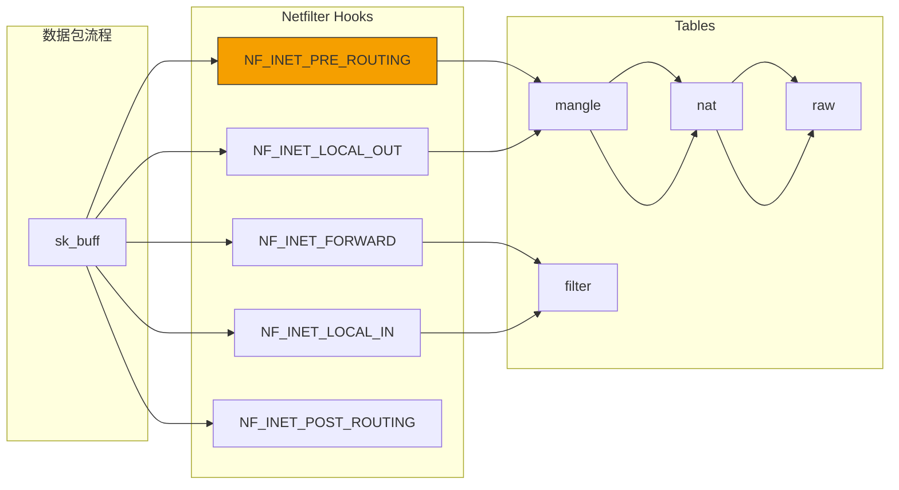
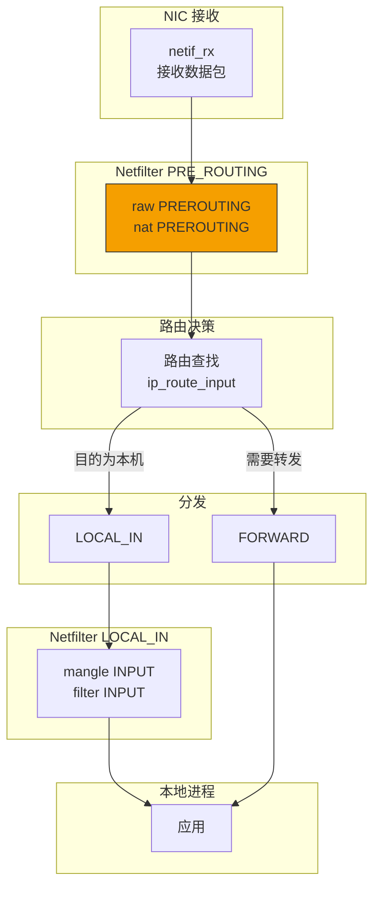
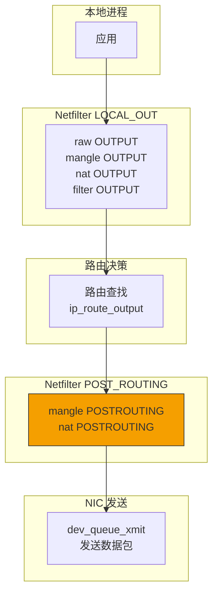

> [!info] Kernel Protocol Stack 深度探索系列 0. [[kernel-protocol-stack-deep-dive|全栈学习路径总览]]
>
> 1. [[ch1-skbuff|第一章：sk_buff 与数据包生命周期]]
> 2. [[ch2-netdevice|第二章：Netdevice 与网卡抽象]]
> 3. [[ch3-ring-buffer|第三章：Ring Buffer 与 DMA]]
> 4. [[ch4-softirq|第四章：软中断与 ksoftirqd]]
> 5. [[ch5-napi|第五章：NAPI 与轮询模式]]
> 6. [[ch6-ethernet|第六章：Ethernet 与 MAC 层]]
> 7. [[ch7-bridge|第七章：网桥与 Switchdev]]
> 8. [[ch8-vlan|第八章：VLAN 与 802.1Q]]
> 9. [[ch9-macvlan|第九章：MACVLAN 与虚拟网卡]]
> 10. [[ch10-bonding|第十章：Bonding 与 teamd]]
> 11. [[ch11-ip-framing|第十一章：IP 协议封装]]
> 12. [[ch12-routing|第十二章：路由决策]]
> 13. [[ch13-neighbor|第十三章：Neighbor 与 ARP]]
> 14. **第十四章：iptables 基础**

---

## 1. 概述：Netfilter 与 iptables

Netfilter 是 Linux 内核的包过滤框架，iptables 是其用户空间命令行工具。Netfilter 在网络栈的关键位置插入钩子（hook），允许内核模块检查、修改、丢弃数据包。

**Netfilter 的核心功能：**

1. **包过滤**：根据规则允许/拒绝数据包
2. **NAT**：网络地址转换（SNAT/DNAT）
3. **包修改**：修改 IP 头、端口等
4. **连接跟踪**：跟踪 TCP/UDP 连接状态
5. **日志记录**：记录匹配的数据包



---

## 2. Netfilter 钩子点

### 2.1 5 个钩子点详解

```c
// include/uapi/linux/netfilter.h
enum nf_inet_hooks {
    NF_INET_PRE_ROUTING = 0,   // 路由查找之前（入站）
    NF_INET_LOCAL_IN = 1,      // 路由后，本地交付
    NF_INET_FORWARD = 2,       // 路由后，转发
    NF_INET_LOCAL_OUT = 3,     // 本地生成，出站
    NF_INET_POST_ROUTING = 4,  // 发送之前，出站
    NF_INET_NUMHOOKS = 5
};
```

| 钩子点       | 时机                     | 典型用途                   |
| ------------ | ------------------------ | -------------------------- |
| PRE_ROUTING  | 接收数据包后，路由查找前 | DNAT、conntrack            |
| LOCAL_IN     | 数据包目的为本机         | 防火墙 INPUT               |
| FORWARD      | 数据包需要转发           | 防火墙 FORWARD             |
| LOCAL_OUT    | 本机生成的数据包         | SNAT、mark、policy routing |
| POST_ROUTING | 数据包发送前             | SNAT、qdisc                |

### 2.2 钩子注册

```c
// include/linux/netfilter.h
struct nf_hook_ops {
    nf_hookfn           *hook;         // 回调函数
    struct net_device   *dev;          // 设备过滤（NULL 表示所有）
    u_int8_t            pf;            // 协议族 (NFPROTO_IPV4, etc.)
    unsigned int        hooknum;       // 钩子点编号
    int                 priority;      // 优先级（越小越先执行）
};

// 注册钩子
int nf_register_net_hook(struct net *net, const struct nf_hook_ops *ops);

// 注销钩子
void nf_unregister_net_hook(struct net *net, const struct nf_hook_ops *ops);
```

### 2.3 钩子回调函数

```c
// net/netfilter/core.c
static unsigned int nf_hook_slow(void *priv,
                                  struct sk_buff *skb,
                                  const struct nf_hook_state *state)
{
    struct nf_hook_entries *hooks = state->hook_entries;
    unsigned int verdict;
    int i;

    for (i = 0; i < hooks->num_hook_entries; i++) {
        // 调用每个注册的钩子
        verdict = hooks->hooks[i].hook(hooks->hooks[i].priv, skb, state);

        if (verdict != NF_ACCEPT && verdict != NF_CONTINUE) {
            // 规则返回非继续值
            return verdict;
        }
    }

    return NF_ACCEPT;
}
```

---

## 3. Tables、Chains、Rules 三层架构

### 3.1 Tables

| 表         | 功能                     | 钩子点                               | 优先级 |
| ---------- | ------------------------ | ------------------------------------ | ------ |
| **filter** | 包过滤（accept/drop）    | FORWARD, INPUT, OUTPUT               | 0      |
| **nat**    | NAT 地址转换             | PRE_ROUTING, POST_ROUTING, LOCAL_OUT | 100    |
| **mangle** | 包修改（TTL, TOS, mark） | 所有 5 个钩子                        | 150    |
| **raw**    | 关闭 conntrack           | PRE_ROUTING, LOCAL_OUT               | -400   |

### 3.2 默认 Chains

```
raw PREROUTING   [Accept]  # 路由前（关闭 conntrack）
    ↓
mangle PREROUTING [Accept]  # 路由前（修改包）
    ↓
nat PREROUTING    [Accept]  # DNAT（目的地址转换）
    ↓
                ─────────── 路由决策 ───────────
                  ↓                   ↓
mangle INPUT      [Accept]       mangle FORWARD [Accept]
    ↓                           ↓
filter INPUT      [Accept]       filter FORWARD [Accept]
    ↓                           ↓
    ↓                   mangle POSTROUTING [Accept]
    ↓                           ↓
    ↓                   nat POSTROUTING  [Accept]  # SNAT
    ↓                           ↓
local process    ───────────▶  网络发送
```

### 3.3 iptables 规则结构

```c
// include/linux/netfilter/x_tables.h
struct xt_entry_match {
    __u16  match_size;           // 匹配结构大小
    char   name[29];             // 扩展名称
    __u8   revision;

    // 用户数据（匹配参数）
    char   data[0];
};

struct xt_entry_target {
    __u16  target_size;         // 目标结构大小
    char   name[29];
    __u8   revision;

    // 用户数据（目标参数）
    char   data[0];
};

struct ipt_entry {
    struct ipt_ip               ip;           // IP 匹配条件
    unsigned int                nfcache;      // 缓存标志
    struct xt_entry_match       *matches;     // 匹配列表
    struct xt_entry_target      *target;      // 目标动作
    unsigned char               next_offset;  // 下一规则偏移
    unsigned char               comefrom;     // 跳转来源
    unsigned int                target_offset; // 目标偏移
    unsigned int                next_offset;
};
```

---

## 4. 规则匹配

### 4.1 基本匹配条件

```bash
# 协议匹配
iptables -A INPUT -p tcp -j ACCEPT
iptables -A INPUT -p udp -j ACCEPT
iptables -A INPUT -p icmp -j ACCEPT

# 源/目的 IP
iptables -A INPUT -s 192.168.1.0/24 -j ACCEPT
iptables -A INPUT -d 10.0.0.1 -j DROP

# 接口
iptables -A INPUT -i eth0 -j ACCEPT
iptables -A FORWARD -o eth1 -j DROP

# 端口（需要 -p tcp 或 -p udp）
iptables -A INPUT -p tcp --dport 22 -j ACCEPT
iptables -A INPUT -p tcp --sport 80 -j ACCEPT
iptables -A INPUT -p tcp --dport 1:1024 -j ACCEPT
```

### 4.2 TCP/UDP 扩展

```bash
# TCP 标志位
iptables -A INPUT -p tcp --tcp-flags SYN,ACK,FIN,RST SYN -j SYN_PROXY

# TCP 选项
iptables -A INPUT -p tcp --tcp-option 2 -j ACCEPT

# UDP 长度
iptables -A INPUT -p udp --length 100:200 -j ACCEPT
```

### 4.3 连接状态扩展 (conntrack)

```bash
# 基于连接状态
iptables -A INPUT -m conntrack --ctstate ESTABLISHED,RELATED -j ACCEPT
iptables -A INPUT -m conntrack --ctstate NEW -p tcp --dport 22 -j ACCEPT
iptables -A INPUT -m conntrack --ctstate INVALID -j DROP

# Conntrack 状态
# NEW: 新建连接
# ESTABLISHED: 已建立的连接
# RELATED: 关联的连接（如 FTP data）
# INVALID: 无法识别的包
# UNTRACKED: 未跟踪的包
```

---

## 5. 扩展匹配

### 5.1 limit 扩展

```bash
# 限速：每秒 3 个包，突发 5
iptables -A INPUT -m limit --limit 3/second --limit-burst 5 -j ACCEPT

# 日志限速
iptables -A INPUT -m limit --limit 10/minute -j LOG --log-prefix "IPT_INPUT: "
```

### 5.2 multiport 扩展

```bash
# 多端口匹配（需要 -m multiport）
iptables -A INPUT -p tcp -m multiport --dports 22,80,443 -j ACCEPT
iptables -A INPUT -p tcp -m multiport --sports 1000,2000,3000 -j ACCEPT
```

### 5.3 iprange 扩展

```bash
# IP 地址范围
iptables -A INPUT -m iprange --src-range 192.168.1.1-192.168.1.100 -j ACCEPT
iptables -A INPUT -m iprange --dst-range 10.0.0.1-10.0.0.50 -j DROP
```

### 5.4 geoip 扩展

```bash
# 基于国家/地区（需要 xt_geoip 模块）
iptables -A INPUT -m geoip --src-cc CN,RU -j DROP
iptables -A INPUT -m geoip --dst-cc US -j ACCEPT
```

### 5.5 layer7 扩展

```bash
# 基于应用层协议（需要 l7-filter）
iptables -A FORWARD -m layer7 --l7proto http -j ACCEPT
iptables -A FORWARD -m layer7 --l7proto bittorrent -j DROP
```

---

## 6. Targets（目标动作）

### 6.1 常用 Targets

```bash
# ACCEPT: 接受包
iptables -A INPUT -p tcp --dport 80 -j ACCEPT

# DROP: 静默丢弃
iptables -A INPUT -p tcp --dport 23 -j DROP

# REJECT: 拒绝并返回错误
iptables -A INPUT -p tcp --dport 23 -j REJECT --reject-with tcp-reset

# LOG: 记录日志
iptables -A INPUT -j LOG --log-prefix "IPT_INPUT: " --log-level 4

# RETURN: 返回调用链
iptables -A INPUT -m conntrack --ctstate ESTABLISHED -j RETURN

# QUEUE: 发送到用户空间
iptables -A INPUT -p 6 --dport 9000 -j QUEUE
```

### 6.2 MARK 与 CONNMARK

```bash
# 标记数据包
iptables -A INPUT -p tcp --dport 80 -j MARK --set-mark 1

# 标记连接
iptables -A INPUT -m conntrack --ctstate ESTABLISHED -j CONNMARK --save-mark
iptables -A OUTPUT -m conntrack --ctstate ESTABLISHED -j CONNMARK --restore-mark
```

### 6.3 NAT Targets

```bash
# DNAT: 目的地址转换
iptables -t nat -A PREROUTING -p tcp --dport 80 -j DNAT --to-destination 192.168.1.100:8080

# SNAT: 源地址转换
iptables -t nat -A POSTROUTING -p tcp -o eth0 -j SNAT --to-source 1.2.3.4:10000-20000

# MASQUERADE: 自动获取出口 IP
iptables -t nat -A POSTROUTING -o eth0 -j MASQUERADE
```

---

## 7. iptables 规则管理

### 7.1 基本命令

```bash
# 查看规则
iptables -L -n -v                    # 查看 filter 表
iptables -t nat -L -n -v             # 查看 nat 表
iptables -t mangle -L -n -v          # 查看 mangle 表
iptables -L -n --line-numbers         # 带行号

# 添加规则
iptables -A INPUT -p tcp --dport 22 -j ACCEPT    # 追加
iptables -I INPUT 1 -p tcp --dport 22 -j ACCEPT  # 插入到第 1 行

# 删除规则
iptables -D INPUT -p tcp --dport 22 -j ACCEPT    # 删除匹配的第一条
iptables -D INPUT 1                               # 删除第 1 条

# 替换规则
iptables -R INPUT 1 -p tcp --dport 22 -j ACCEPT

# 清空规则
iptables -F                    # 清空 INPUT（默认表）
iptables -t nat -F             # 清空 nat 表
iptables -X                    # 删除用户自定义链
```

### 7.2 创建自定义链

```bash
# 创建自定义链
iptables -N CUSTOM_FILTER
iptables -N CUSTOM_LOG

# 在自定义链中添加规则
iptables -A CUSTOM_LOG -j LOG --log-prefix "CUSTOM: "
iptables -A CUSTOM_FILTER -p tcp -j ACCEPT

# 从内置链跳转到自定义链
iptables -A INPUT -j CUSTOM_FILTER
iptables -A CUSTOM_FILTER -j CUSTOM_LOG

# 删除自定义链
iptables -X CUSTOM_LOG
iptables -X CUSTOM_FILTER
```

### 7.3 保存与恢复

```bash
# 保存规则
iptables-save > /etc/iptables/rules.v4

# 恢复规则
iptables-restore < /etc/iptables/rules.v4

# 或使用 iptables-persistent
apt-get install iptables-persistent
```

---

## 8. 数据包处理流程

### 8.1 入站数据包流程



### 8.2 出站数据包流程



---

## 9. 性能考虑

### 9.1 减少规则数量

- 使用连接状态（ESTABLISHED/RELATED）减少规则
- 使用 ipset 存储大量 IP 列表
- 避免在每条规则中使用 -j LOG（慢）

### 9.2 ipset 使用

```bash
# 创建 ipset
ipset create blocked_ips hash:ip
ipset create allowed_nets hash:net

# 添加条目
ipset add blocked_ips 1.2.3.4
ipset add allowed_nets 192.168.0.0/16

# 在 iptables 中使用
iptables -A INPUT -m set --match-set blocked_ips src -j DROP
iptables -A INPUT -m set --match-set allowed_nets src -j ACCEPT
```

### 9.3 连接跟踪限制

```bash
# 查看 conntrack 表大小
cat /proc/sys/net/netfilter/nf_conntrack_max

# 查看当前连接数
cat /proc/net/stat/nf_conntrack

# 调整限制
echo 262144 > /proc/sys/net/netfilter/nf_conntrack_max
```

---

## 10. 总结

**iptables 关键点：**

1. **Netfilter 5 个钩子点**：PRE_ROUTING, LOCAL_IN, FORWARD, LOCAL_OUT, POST_ROUTING
2. **4 张表**：filter（过滤）、nat（地址转换）、mangle（修改）、raw（绕过 conntrack）
3. **规则按优先级执行**：raw > mangle > nat > filter
4. **连接状态扩展**：ESTABLISHED/RELATED 是高性能防火墙的基础
5. **多种匹配扩展**：limit, multiport, iprange, geoip, layer7 等
6. **Targets**：ACCEPT, DROP, REJECT, LOG, MARK, DNAT, SNAT 等
7. **规则优化**：使用 ipset、连接状态、减少日志提高性能
