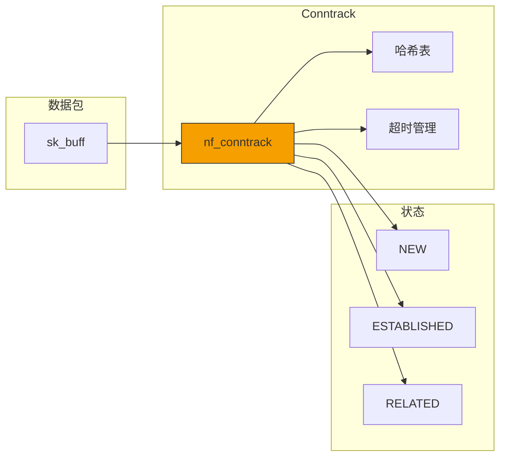
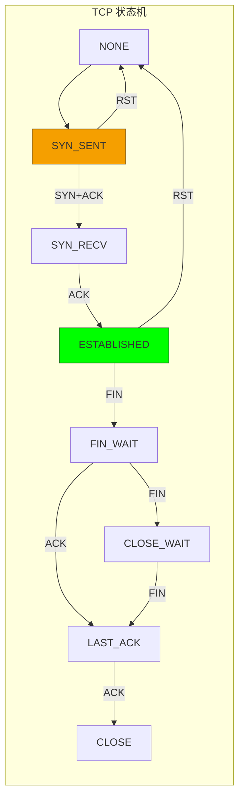
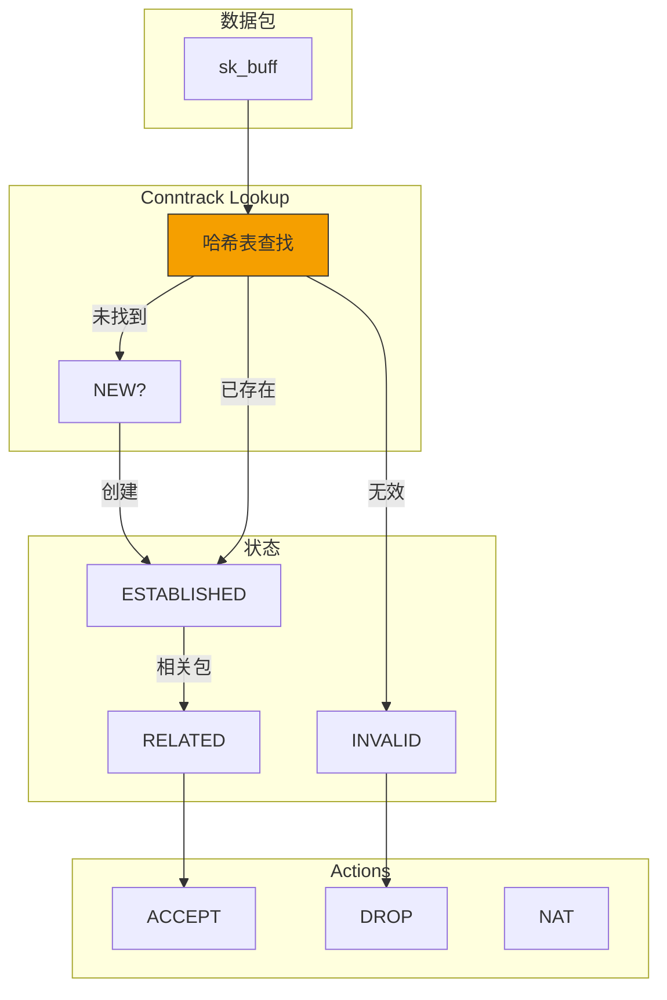

> [!info] Kernel Protocol Stack 深度探索系列 0. [[kernel-protocol-stack-deep-dive|全栈学习路径总览]]
>
> 1. [[ch1-skbuff|第一章：sk_buff 与数据包生命周期]]
> 2. [[ch2-netdevice|第二章：Netdevice 与网卡抽象]]
> 3. [[ch3-ring-buffer|第三章：Ring Buffer 与 DMA]]
> 4. [[ch4-softirq|第四章：软中断与 ksoftirqd]]
> 5. [[ch5-napi|第五章：NAPI 与轮询模式]]
> 6. [[ch6-ethernet|第六章：Ethernet 与 MAC 层]]
> 7. [[ch7-bridge|第七章：网桥与 Switchdev]]
> 8. [[ch8-vlan|第八章：VLAN 与 802.1Q]]
> 9. [[ch9-macvlan|第九章：MACVLAN 与虚拟网卡]]
> 10. [[ch10-bonding|第十章：Bonding 与 teamd]]
> 11. [[ch11-ip-framing|第十一章：IP 协议封装]]
> 12. [[ch12-routing|第十二章：路由与 FIB]]
> 13. [[ch13-neighbor|第十三章：Neighbor 与 ARP]]
> 14. [[ch14-iptables|第十四章：iptables 基础]]
> 15. **第十五章：连接跟踪 Conntrack**

---

## 1. 概述：什么是连接跟踪

连接跟踪（Connection Tracking，简称 conntrack）是 Netfilter 的核心组件，为数据包提供**连接感知**能力。它维护一个连接表，记录所有流经防火墙的连接状态，使 iptables 能够基于连接状态（而非单个数据包）进行过滤。

**Conntrack 的核心价值：**

1. **状态追踪**：区分 NEW、ESTABLISHED、RELATED、INVALID 等状态
2. **NAT 辅助**：帮助 NAT 了解哪些数据包属于同一连接
3. **性能优化**：ESTABLISHED 连接直接放行，无需逐包检查规则
4. **协议理解**：理解 FTP、DNS、IRC 等协议的控制通道



---

## 2. nf_conntrack 数据结构

### 2.1 连接跟踪条目

```c
// include/net/netfilter/nf_conntrack.h
struct nf_conn {
    /* 网络头部的可混淆区域 */
    union nf_conntrack_track {
        struct {
            __be32          ip_saddr;    // 源 IP
            __be32          ip_daddr;    // 目的 IP
            union nf_conntrack_protocol proto;  // L4 协议信息
        }tuplehash[IP_CT_DIR_MAX];       // 双向流（两个方向）
    }tuplehash[IP_CT_DIR_MAX];

    /* 状态 */
    unsigned long           status;      // 连接状态标志

    /* 引用计数 */
    atomic_t                ct_general__refcnt;

    /* 时间戳 */
    struct sk_buff          *skb;        // 最后一个包
    unsigned long           timeout;

    /* 方向 */
    u8                      dir[IP_CT_DIR_MAX];

    /* 网络命名空间 */
    possible_net_t          ct_net;

    /* 辅助数据 */
    struct nf_conn_acct     *acct;
    struct nf_conntrack_extensions *ext;

    /* 哈希链表 */
    struct hlist_nulls_node  hnnode;

    /* 用户空间期望 */
    struct nf_conntrack_expectations *expectations;
};
```

### 2.2 双向流结构

```c
// include/net/netfilter/nf_conntrack.h
enum ip_conntrack_dir {
    IP_CT_DIR_ORIGINAL = 0,    // 原始方向（发起方）
    IP_CT_DIR_REPLY = 1,       // 回复方向（响应方）
    IP_CT_DIR_MAX = 2
};

// 每个方向的元组
struct nf_conntrack_tuple {
    struct {
        union nf_inet_addr   u3;           // IP 地址
        union nf_conntrack_man_proto  u;  // 协议信息（端口等）
    } src, dst;                            // 源和目的
};
```

### 2.3 L4 协议信息

```c
// include/net/netfilter/nf_conntrack_l4proto.h
union nf_conntrack_protocol {
    /* TCP */
    struct nf_ct_tcp {
        __be16  src_port, dst_port;       // 源/目的端口
        u8      state;                     // TCP 状态
        u8      flags;                      // 标志（忽略时戳等）
    } tcp;

    /* UDP */
    struct nf_ct_udp {
        __be16  src_port, dst_port;
    } udp;

    /* ICMP */
    struct nf_ct_icmp {
        u8      type, code;                // ICMP 类型/代码
        __be16  id;                        // 标识符
    } icmp;
};
```

### 2.4 连接状态标志

```c
// include/net/netfilter/nf_conntrack.h
enum ip_conntrack_status {
    IPS_EXPECTED        = (1 << 0),   // 预期连接（FTP data）
    IPS_SEEN_REPLY      = (1 << 1),   // 已看到回复
    IPS_ASSURED         = (1 << 2),   // 确认连接（不轻易删除）
    IPS_CONFIRMED       = (1 << 3),   // 已确认（已分配资源）
    IPS_SRC_NAT         = (1 << 4),   // 源 NAT 已做
    IPS_DST_NAT         = (1 << 5),   // 目的 NAT 已做
    IPS_SEQ_ADJUST      = (1 << 6),   // 需要序列号调整
    IPS_SRC_NAT_DONE    = (1 << 7),   // 源 NAT 已完成
    IPS_DST_NAT_DONE    = (1 << 8),   // 目的 NAT 已完成
    IPS_DYING           = (1 << 9),   // 正在删除
    IPS_FIXED_TIMEOUT   = (1 << 10),  // 固定超时
};
```

---

## 3. 连接状态机

### 3.1 TCP 连接状态

```c
// include/net/netfilter/nf_conntrack_tcp.h
enum ip_conntrack_tcp_state {
    TCP_CONNTRACK_NONE = 0,        // 未建立
    TCP_CONNTRACK_SYN_SENT,        // SYN 已发送
    TCP_CONNTRACK_SYN_RECV,        // SYN+ACK 已接收
    TCP_CONNTRACK_ESTABLISHED,     // 已建立
    TCP_CONNTRACK_FIN_WAIT,       // FIN 等待
    TCP_CONNTRACK_CLOSE_WAIT,      // 关闭等待
    TCP_CONNTRACK_LAST_ACK,        // 最后 ACK
    TCP_CONNTRACK_TIME_WAIT,       // 时间等待
    TCP_CONNTRACK_CLOSE,           // 已关闭
    TCP_CONNTRACK_MAX
};
```

### 3.2 TCP 状态转换



### 3.3 UDP 连接状态

UDP 是无连接的，但 conntrack 仍然维护状态：

| Conntrack 状态 | 说明     | 超时 |
| -------------- | -------- | ---- |
| NONE           | 新连接   | 30s  |
| ASSURED        | 确认连接 | 180s |
| UNREPLIED      | 无回复   | 180s |

### 3.4 ICMP 连接状态

ICMP 使用标识符（ID）追踪：

```c
// ICMP echo request/reply 使用相同的 ID
// Conntrack 用 (ICMP ID, src_ip, dst_ip) 匹配请求和响应
```

---

## 4. 哈希表结构

### 4.1 哈希表设计

```c
// net/netfilter/nf_conntrack_core.c
struct nf_conntrack_hash {
    struct hlist_nulls_head   *hash;       // 哈希桶
    unsigned int               hash_size;  // 桶数量
    unsigned int               rnd;        // 随机数
};

static struct nf_conntrack_hash nf_conntrack_hash;
```

**哈希计算：**

- 使用源 IP、目的 IP、协议、源端口、目的端口计算哈希
- 支持 IPv4 和 IPv6

### 4.2 哈希查找

```c
// net/netfilter/nf_conntrack_core.c
static noinline struct nf_conntrack_tuple_hash *
____nf_conntrack_find(struct net *net, const struct nf_conntrack_zone *zone,
                     const struct nf_conntrack_tuple *tuple, u32 hash)
{
    struct nf_conntrack_tuple_hash *h;
    struct hlist_nulls_nullshead *slot;

    slot = &nf_conntrack_hash.hash[hash];
    hlist_nulls_for_each_entry(h, &slot->first, hnnode) {
        if (nf_ct_tuple_equal(tuple, &h->tuplehash[IP_CT_DIR_ORIGINAL].tuple) &&
            nf_ct_zone_equal(nf_ct_l3num(h), zone))
            return h;
    }

    return NULL;
}
```

### 4.3 连接表大小

```bash
# 默认大小（通常是内存的 1/16）
cat /proc/sys/net/netfilter/nf_conntrack_max

# 当前连接数
cat /proc/net/stat/nf_conntrack

# 查看哈希表大小
cat /proc/sys/net/netfilter/nf_conntrack_buckets
```

---

## 5. 超时管理

### 5.1 超时结构

```c
// include/net/netfilter/nf_conntrack_l4proto.h
struct nf_conntrack_l4proto {
    // 协议编号
    __u16 l3proto;               // L3 协议 (AF_INET 等)
    __u16 l4proto;               // L4 协议 (IPPROTO_TCP 等)

    // 超时函数
    unsigned int (*get_timeout)(struct nf_conn *ct);

    // 定时器回调
    void (*destroy)(struct nf_conn *ct);

    // 包处理
    int (*packet)(struct nf_conn *ct,
                  const struct sk_buff *skb,
                  unsigned int dataoff,
                  enum ip_conntrack_info *ctinfo);
};
```

### 5.2 TCP 超时配置

```c
// net/netfilter/nf_conntrack_proto_tcp.c
static unsigned int nf_ct_tcp_timeout_syn_sent = 120*HZ;  // 2 分钟
static unsigned int nf_ct_tcp_timeout_established = 432000*HZ;  // 5 天
static unsigned int nf_ct_tcp_timeout_time_wait = 120*HZ;     // 2 分钟

// 超时值可调
echo 600 > /proc/sys/net/netfilter/nf_conntrack_tcp_timeout_established
```

### 5.3 UDP 超时配置

```bash
# UDP first packet timeout
echo 60 > /proc/sys/net/netfilter/nf_conntrack_udp_timeout

# UDP stream timeout
echo 180 > /proc/sys/net/netfilter/nf_conntrack_udp_timeout_stream
```

---

## 6. 协议辅助模块（Helpers）

### 6.1 Helper 结构

```c
// include/net/netfilter/nf_conntrack_helper.h
struct nf_conntrack_helper {
    const char              *name;           // Helper 名称
    struct module           *me;             // 所属模块
    __u16                   l3num;           // L3 协议
    __u16                   l4proto;         // L4 协议

    // 尝试函数（识别端口上的连接）
    int (*try_put)(struct sk_buff *skb,
                   struct nf_conn *ct,
                   enum ip_conntrack_info *ctinfo);

    // 帮助信息结构
    struct nf_conntrack_helper *next;

    // 私有数据
    void                    *data;
};
```

### 6.2 内置 Helpers

| Protocol | Helper 模块       | 用途               |
| -------- | ----------------- | ------------------ |
| FTP      | nf_conntrack_ftp  | 跟踪 FTP 数据连接  |
| DNS      | nf_conntrack_dns  | 跟踪 DNS 查询/响应 |
| IRC      | nf_conntrack_irc  | 跟踪 DCC 文件传输  |
| TFTP     | nf_conntrack_tftp | 跟踪 TFTP 数据连接 |
| SIP      | nf_conntrack_sip  | 跟踪 SIP 呼叫      |
| H.323    | nf_conntrack_h323 | 跟踪 H.323 呼叫    |
| PPTP     | nf_conntrack_pptp | 跟踪 PPTP VPN      |
| RAS      | nf_conntrack_ras  | 跟踪 RAS 协议      |

### 6.3 FTP Helper 示例

FTP 协议在控制通道（21 端口）上发送 PORT 命令包含数据连接信息：

```
227 Entering Passive Mode (192,168,1,100,200,50)
PORT 192,168,1,100,200,50  ->  IP=192.168.1.100, Port=200*256+50=51314
```

FTP Helper 解析这个命令，在 conntrack 中创建预期连接：

```c
// net/netfilter/nf_conntrack_ftp.c
static int ftp_parse_port(struct nf_conn *ct, const char *data, int proto)
{
    // 解析 IP 和端口
    unsigned int ip[4];
    unsigned int port[2];

    sscanf(data, "%u,%u,%u,%u,%u,%u", &ip[0], &ip[1], &ip[2], &ip[3],
           &port[0], &port[1]);

    // 创建预期的 NAT 映射
    return nf_ct_expect_add((struct nf_conn *)ct,
                            ip[0]<<24 | ip[1]<<16 | ip[2]<<8 | ip[3],
                            (port[0]<<8) | port[1]);
}
```

### 6.4 启用/禁用 Helpers

```bash
# 启用 FTP helper
modprobe nf_conntrack_ftp

# 启用所有跟踪
modprobe nf_conntrack

# 查看已加载的 helpers
cat /proc/net/nf_conntrack_expect_max

# 禁用 helper（通过 iptables）
iptables -A INPUT -p tcp --dport 21 -m helper --helper ftp -j ACCEPT
```

---

## 7. 预期连接（Expectations）

### 7.1 预期连接结构

```c
// include/net/netfilter/nf_conntrack_expect.h
struct nf_conntrack_expect {
    struct nf_conntrack_tuple     mask;         // 匹配掩码
    struct nf_conntrack_tuple     tuple;         // 预期元组
    struct nf_conntrack_master    master;        // 主连接

    unsigned long               timeout;          // 超时
    atomic_t                    use;              // 使用计数

    struct hlist_node           lnode;            // 链表节点
    struct rcu_head             rcu;
};
```

### 7.2 RELATED 连接处理

当预期连接被创建后，RELATED 数据包会匹配该预期：

```c
// net/netfilter/nf_conntrack_core.c
static int nf_conntrack_handle_expect(struct nf_conn *ct,
                                      struct nf_conntrack_expect *exp)
{
    // 创建预期连接
    // 设置超时
    // 当匹配的数据包到达时，自动将连接标记为 RELATED
}
```

---

## 8. 连接跟踪与 iptables

### 8.1 conntrack 匹配扩展

```bash
# 基于连接状态
iptables -A INPUT -m conntrack --ctstate ESTABLISHED,RELATED -j ACCEPT
iptables -A INPUT -m conntrack --ctstate NEW -p tcp --dport 22 -j ACCEPT
iptables -A INPUT -m conntrack --ctstate INVALID -j DROP

# 基于连接状态的其他信息
iptables -A INPUT -m conntrack --ctstate ESTABLISHED --ctorigsrc 192.168.1.0/24 -j ACCEPT
iptables -A INPUT -m conntrack --ctstate ESTABLISHED --ctreplsrc 10.0.0.1 -j ACCEPT
```

### 8.2 NOTRACK 目标

```bash
# 绕过连接跟踪
iptables -t raw -A PREROUTING -p tcp --dport 80 -j NOTRACK

# 这样该连接的包不会被跟踪
# 可提高性能，但失去连接状态感知能力
```

### 8.3 CT 目标（Conntrack 目标）

```bash
# 设置连接超时
iptables -A FORWARD -p tcp -j CT --timeout established_100

# 设置 helper
iptables -A FORWARD -p tcp --dport 21 -j CT --helper ftp

# 设置 zone
iptables -A FORWARD -i eth0 -j CT --zone 1
```

---

## 9. 连接跟踪配置

### 9.1 sysctl 参数

```bash
# 最大连接数
echo 262144 > /proc/sys/net/netfilter/nf_conntrack_max

# 表大小（哈希桶数）
echo 65536 > /proc/sys/net/netfilter/nf_conntrack_buckets

# UDP 超时
echo 60 > /proc/sys/net/netfilter/nf_conntrack_udp_timeout
echo 180 > /proc/sys/net/netfilter/nf_conntrack_udp_timeout_stream

# TCP 超时
echo 600 > /proc/sys/net/netfilter/nf_conntrack_tcp_timeout_time_wait
echo 60 > /proc/sys/net/netfilter/nf_conntrack_tcp_timeout_syn_recv

# 启用 Loose SAT (反向路径过滤)
echo 1 > /proc/sys/net/netfilter/nf_conntrack_tcp_be_liberal
```

### 9.2 查看连接状态

```bash
# 查看当前所有连接
cat /proc/net/nf_conntrack

# 带时间戳的详细信息
cat /proc/net/nf_conntrack | head -1

# IPv6 连接
cat /proc/net/ipv6_conntrack

# 统计信息
cat /proc/net/stat/nf_conntrack

# 按协议统计
conntrack -L -s -p tcp
conntrack -L -s -p udp
conntrack -L -s -p icmp
```

### 9.3 conntrack-tools

```bash
# 安装
apt-get install conntrack

# 查看连接（实时）
conntrack -L

# 统计
conntrack -L -c

# 删除特定连接
conntrack -D -p tcp --src 192.168.1.100 --dst 8.8.8.8 --sport 12345 --dport 443

# 清空所有连接
conntrack -F

# 设置超时
conntrack -U -p tcp --timeout established 100000
```

---

## 10. 总结



**Conntrack 关键点：**

1. **nf_conntrack**：维护所有活动连接的状态
2. **双向跟踪**：tuplehash[2] 记录原始和回复两个方向
3. **状态机**：TCP 有完整状态机，UDP/ICMP 有简化状态
4. **哈希表**：高效查找，nf_conntrack_max 控制最大条目数
5. **协议 Helpers**：理解 FTP、DNS、SIP 等协议的控制通道
6. **预期连接**：FTP 等协议的 RELATED 连接需要预期
7. **超时管理**：自动删除超时连接，释放内存
8. **与 iptables 集成**：-m conntrack --ctstate 使用跟踪状态
