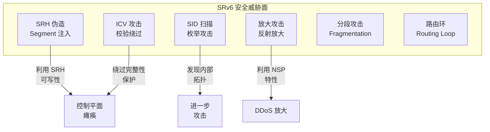
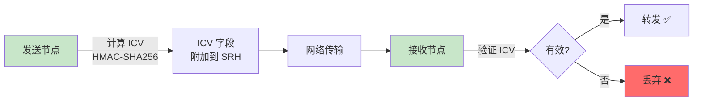
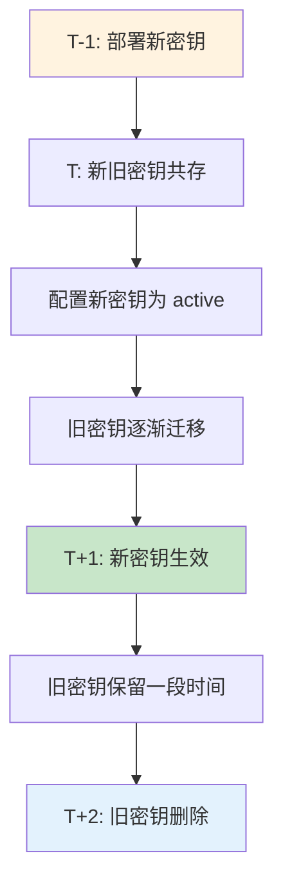
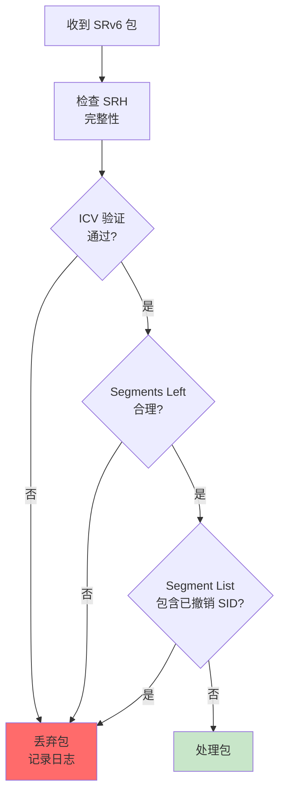
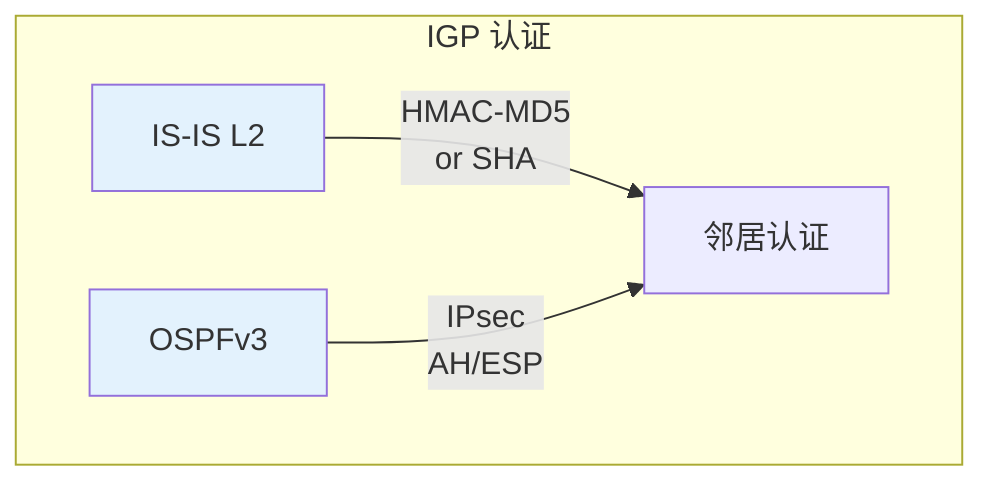
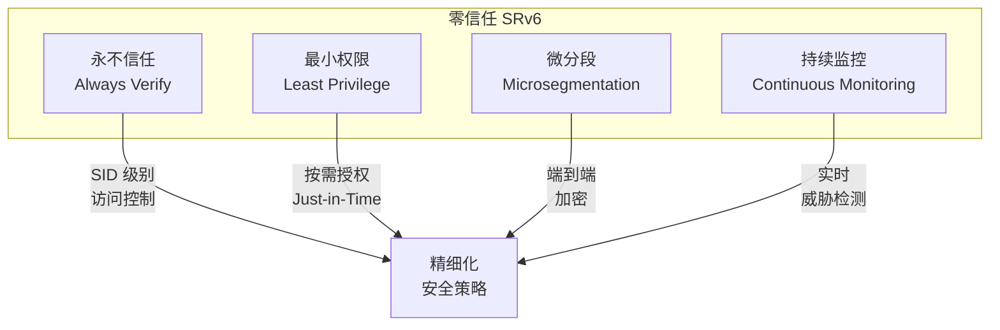

> [!info] SRv6 2026 深度探索系列
> ... 30. [[ch30-te-operations|第三十章：流量工程运营实战]]
> **31. 第三一章：安全运营与攻击防御** 32. [[ch32-deployment-migration|第三二章：部署与迁移运营]]

---

## 1. 概述：SRv6 安全运营框架

SRv6 安全运营面临独特的挑战：128位可编程空间 + IPv6 Extension Header 复杂性，使得攻击面比传统 MPLS 大幅扩展。



| 威胁类型 | 风险等级 | 影响范围 | 防护难度 |
| :------- | :------- | :------- | :------- |
| SRH 伪造 | Critical | 控制平面 | 中       |
| ICV 绕过 | Critical | 数据平面 | 高       |
| SID 枚举 | Medium   | 情报收集 | 低       |
| 放大攻击 | High     | 带宽资源 | 中       |
| 路由环   | High     | 转发资源 | 中       |

---

## 2. SRv6 安全机制详解

### 2.1 ICV (Integrity Check Value) 机制

SRv6 ICV 是保障数据包完整性的核心机制：



**ICV 计算范围：**

```
┌─────────────────────────────────────────────────────────────────┐
│                    ICV Protection Scope                         │
├─────────────────────────────────────────────────────────────────┤
│  IPv6 Base Header                                               │
│  ├─ Source Address (送信元)                                    │
│  ├─ Destination Address (当前目的地)                           │
│  └─ Hop-by-Hop Options (with TLV)                              │
├─────────────────────────────────────────────────────────────────┤
│  SRH (Segment Routing Header)                                   │
│  ├─ Next Header                                                 │
│  ├─ Hdr Ext Len                                                 │
│  ├─ Routing Type (=4)                                           │
│  ├─ Segments Left                                               │
│  ├─ Last Entry                                                  │
│  ├─ Flags                                                       │
│  ├─ Tag                                                         │
│  ├─ Segment List [1..n]                                        │
│  └─ ICV (被排除在外，不参与计算)                                │
├─────────────────────────────────────────────────────────────────┤
│  Upper Layer Payload (TCP/UDP/其他)                            │
└─────────────────────────────────────────────────────────────────┘
```

### 2.2 ICV 密钥管理

```bash
# Juniper: 配置 ICV 密钥
configure
set security srv6 icv key <key-id>
set security srv6 icv key <key-id> algorithm hmac-sha-256
set security srv6 icv key <key-id> secret <pre-shared-key>
set security srv6 icv key <key-id> lifetime 86400

# 关联密钥到 Locator
set security srv6 locator <locator-name> icv key <key-id>
```

```bash
# Cisco: 配置 ICV
segment-routing srv6
  security
    icv
      key <key-id>
        hmac sha-256
        pre-shared-key <key>
```

### 2.3 ICV 密钥轮换



> [!warning] ICV 密钥轮换注意事项
>
> 1. 轮换期间新、旧密钥必须共存
> 2. 建议使用双密钥机制实现无缝切换
> 3. 删除旧密钥前需确认所有节点已完成切换

---

## 3. SID 安全

### 3.1 SID 分配安全策略

```bash
# 限制 SID 分配范围
configure
set srv6 sid allocator
  set prefix-pool <pool-name>
  set maximum-sids-per-node <max>
  set sid-lifetime infinite
```

| 安全策略        | 配置           | 效果                 |
| :-------------- | :------------- | :------------------- |
| SID 范围隔离    | `prefix-pool`  | 防止跨域 SID 冲突    |
| 单节点 SID 限制 | `maximum-sids` | 防止 SID 泛洪        |
| SID 生命周期    | `sid-lifetime` | 自动回收过期 SID     |
| SID 访问控制    | `acl <name>`   | 基于 ACL 的 SID 过滤 |

### 3.2 SID 访问控制列表 (SACL)

```bash
# 配置 SID ACL
configure
set access-list srv6-sid-acl
  term 1 from sid A::1000/A::1000
  term 1 then permit
  term 2 from sid A::2000/A::2000
  term 2 then permit
  term 3 from sid any
  term 3 then deny

# 应用到接口
configure
set interfaces <name> unit <id> srv6-sid-acl srv6-sid-acl
```

### 3.3 SID 异常检测

```bash
# 监控未知 SID 流量
show srv6 counters unknown-sid

# 监控 SID 泛洪
show srv6 rate-limit sid-flood
```

---

## 4. SRH 安全

### 4.1 SRH 选项安全

| SRH Option Type | 处理规则            | 安全性 |
| :-------------- | :------------------ | :----- |
| 0x00 (Pad1)     | 跳过                | 安全   |
| 0x01 (PadN)     | 跳过                | 安全   |
| 0x02 (HMAC)     | 验证 ICV            | 安全   |
| 0x05            | 提案选项，暂不支持  | 待定   |
| 其他            | 按 Per-Hop Behavior | 需评估 |

```bash
# 限制允许的 SRH Option
configure
set security srv6 srh option
  allow-types 0x00,0x01,0x02
  reject-unknown true
```

### 4.2 SRH 篡改检测



---

## 5. DDoS 防护

### 5.1 SRv6 放大攻击原理

攻击者利用 SRv6 的 Next Segment 转发机制：

```mermaid
graph LR
    A["Attacker<br/>A::1"] -->|"反射请求<br/>SL=1, Seg=[B::1]"| B["中间节点<br/>B::1"]
    B -->|"放大响应<br/>~10x"| A

    Note over A,B: 放大倍数取决于响应包与请求包的大小比
```

**放大因子计算：**

| 攻击类型   | 请求大小 | 响应大小        | 放大倍数 |
| :--------- | :------- | :-------------- | :------- |
| SID 探测   | 40 bytes | 可达 1500 bytes | ~37x     |
| NSP 反射   | 64 bytes | 可达 1500 bytes | ~23x     |
| 全路径探测 | 40 bytes | traceroute 响应 | ~10x     |

### 5.2 放大攻击防护配置

```bash
# 限制 ICMPv6 rate-limit
configure
set protocols icmp6 rate-limit
  packet-rate 100
  bucket-size 200

# 配置 URPF (Unicast Reverse Path Forwarding)
configure
set forwarding-options urpf loose-mode
```

### 5.3 基于 Segment 的流量过滤

```bash
# 拒绝来自不可信源的特定 SID 流量
configure
set firewall filter srv6-filter
  term block-internal-sid from
    source-address 10.0.0.0/8
    next-header ipv6
    segments-left 1
  term block-internal-sid then
    discard
    count block-internal-sid

# 应用到入方向接口
configure
set interfaces <interface> unit <id> filter input srv6-filter
```

---

## 6. 控制平面安全

### 6.1 BGP SRv6 VPN 安全

```bash
# 启用 BGP 认证
configure
set protocols bgp group <group> authentication-key <key>
set protocols bgp group <group> authentication-algorithm hmac-sha-256

# 限制 BGP SRv6 前缀
configure
set protocols bgp group <group> family vpnv6 unicast
  prefix-limit 10000
  teardown 90
```

### 6.2 IGP SRv6 安全



```bash
# IS-IS SRv6 认证
configure
set protocols isis interface <name> hello-authentication-type
set protocols isis interface <name> hello-authentication-key <key>

# OSPFv3 SRv6 认证
configure
set protocols ospf3 area <area-id> interface <name> authentication
set protocols ospf3 area <area-id> interface <name> ipsec spi <spi> <ah|sha256>
```

### 6.3 PCEP 安全

```bash
# PCEP 认证
configure
set protocols pcep
  pce <pce-address>
    authentication
      key-chain <key-chain>
```

---

## 7. 安全监控与告警

### 7.1 安全事件监控

```bash
# 查看 ICV 验证失败统计
show srv6 security statistics icv-failures

# 查看未知 SID 统计
show srv6 security statistics unknown-sid

# 查看 SRH 异常统计
show srv6 security statistics srh-errors
```

**关键监控指标：**

| 指标         | 正常范围 | 告警阈值 | 严重级别 |
| :----------- | :------- | :------- | :------- |
| ICV 失败率   | < 0.01%  | > 0.1%   | Warning  |
| 未知 SID 率  | < 0.1%   | > 1%     | Warning  |
| SRH 错误率   | < 0.01%  | > 0.1%   | Warning  |
| 放大攻击流量 | 0        | > 0      | Critical |

### 7.2 安全告警规则

```yaml
# alert_rules_srv6_security.yml
groups:
  - name: srv6_security
    rules:
      - alert: SRv6ICVFailureRate
        expr: rate(srv6_icv_failures_total[5m]) / rate(srv6_packets_total[5m]) > 0.001
        for: 5m
        labels:
          severity: warning
        annotations:
          summary: "SRv6 ICV 失败率超过 0.1%"

      - alert: SRv6AmplificationAttack
        expr: rate(srv6_amplification_bytes_total[1m]) / rate(srv6_incoming_bytes_total[1m]) > 5
        for: 1m
        labels:
          severity: critical
        annotations:
          summary: "检测到 SRv6 放大攻击"

      - alert: SRv6UnknownSIDFlood
        expr: rate(srv6_unknown_sid_packets_total[5m]) > 1000
        for: 5m
        labels:
          severity: warning
        annotations:
          summary: "未知 SID 流量异常增加"
```

### 7.3 安全日志分析

```bash
# 实时监控安全日志
tail -f /var/log/srv6_security.log

# 分析 ICV 失败来源
grep "ICV.*fail" /var/log/srv6_security.log | \
  awk '{print $NF}' | sort | uniq -c | sort -rn | head 10

# 分析攻击模式
grep -E "attack|flood|scan" /var/log/srv6_security.log
```

---

## 8. 渗透测试与漏洞扫描

### 8.1 SRv6 安全测试矩阵

| 测试项   | 方法                    | 工具            | 期望结果               |
| :------- | :---------------------- | :-------------- | :--------------------- |
| ICV 伪造 | 修改 SRH 并重新计算 ICV | Scapy           | 被检测并丢弃           |
| SID 扫描 | 枚举内部 SID 范围       | Nmap + srv6 NSE | 无法获取有效 SID       |
| SRH 篡改 | 修改 Segment List       | Scapy           | ICV 验证失败           |
| 放大攻击 | 构造放大请求            | 自定义工具      | 被 rate-limit          |
| 路由环   | 构造闭环路径            | Scapy           | Segments Left 递减检测 |

### 8.2 使用 Scapy 进行 SRv6 安全测试

```python
#!/usr/bin/env python3
"""
SRv6 安全测试脚本 - 使用 Scapy
"""

from scapy.all import *
from scapy.layers.inet6 import *

def craft_sr6_packet():
    """构造 SRv6 测试包"""
    # 构造 SRH
    sr6 = SRH(
        segments=["2001:db8:1::100", "2001:db8:1::200", "2001:db8:1::300"],
        segs_left=2
    )

    # 构造 IPv6 头
    pkt = IPv6(dst="2001:db8:1::300", src="2001:db8::1") / sr6 / ICMPv6EchoRequest()

    return pkt

def test_icv_bypass():
    """测试 ICV 绕过"""
    print("[*] 测试 ICV 绕过攻击...")

    # 构造正常包
    pkt = craft_sr6_packet()

    # 篡改 Segment List (不重新计算 ICV)
    pkt.srh.segments[0] = "2001:db8:1::999"  # 恶意 SID

    print(f"[*] 发送篡改后的包: {pkt.summary()}")
    send(pkt)

    print("[*] 期望结果: 目标设备应检测到 ICV 验证失败并丢弃")

def test_sid_enumeration():
    """测试 SID 枚举攻击"""
    print("[*] 测试 SID 枚举攻击...")

    # 常见 SID 前缀
    prefixes = [
        "2001:db8::/32",
        "fc00::/7",
        "fe80::/10"
    ]

    for prefix in prefixes:
        # 构造探测包
        pkt = IPv6(dst=prefix + "::1") / SRH(segments=[prefix + "::1"]) / ICMPv6EchoRequest()
        send(pkt, count=10)

    print("[*] 期望结果: 内部 SID 不可被枚举")

def test_amplification():
    """测试放大攻击"""
    print("[*] 测试放大攻击...")

    # 构造小请求
    pkt = IPv6(dst="2001:db8:1::200") / SRH(segments=["2001:db8:1::300"]) / ICMPv6EchoRequest()

    print(f"[*] 请求大小: {len(pkt)} bytes")
    print("[*] 期望放大响应: ~10x")

    # 发送探测
    send(pkt, count=100)

if __name__ == "__main__":
    print("=" * 60)
    print("SRv6 安全测试工具")
    print("=" * 60)

    test_icv_bypass()
    test_sid_enumeration()
    test_amplification()

    print("\n[*] 测试完成")
```

### 8.3 Nmap SRv6 NSE 脚本

```lua
-- srv6-enum.nse - SRv6 SID 枚举脚本
-- 用法: nmap -6 -p 43 --script srv6-enum <target>

local nmap = require "nmap"
local stdnse = require "stdnse"
local ipOps = require "ipOps"

description = [[
尝试枚举 SRv6 网络中的有效 SID
]]

author = "SRv6 Security Team"
license = "Same as Nmap"
categories = {"discovery", "safe"}

local SID_PREFIXES = {
    "2001:db8::/32",
    "fc00::/7",
}

portrule = function(host, port)
    return port.number == 43 or port.protocol == "ipv6"
end

action = function(host, port)
    local results = {}

    for _, prefix in ipairs(SID_PREFIXES) do
        -- 发送 ICMPv6 Echo 到 prefix::1
        local pkt = raw_packets.IPv6(dst=prefix .. "::1") /
                    raw_packets.SRH(segments={prefix .. "::1"}) /
                    raw_packets.ICMPv6EchoRequest()

        local response = nmap.do_actual_send("ipv6", host, pkt)

        if response and response.status == 0 then
            table.insert(results, string.format("可能的 SID: %s::1", prefix))
        end
    end

    return stdnse.format_output(true, results)
end
```

---

## 9. 合规性运营

### 9.1 SRv6 安全合规检查

```bash
#!/bin/bash
# SRv6 安全合规检查脚本

echo "=== SRv6 Security Compliance Check $(date) ==="

# 检查 ICV 配置
echo "[1] ICV 配置检查"
show srv6 security icv | grep -E "enabled|key|algorithm"

# 检查 ACL 配置
echo "[2] SID ACL 配置检查"
show access-list srv6-sid-acl

# 检查接口安全策略
echo "[3] 接口安全策略检查"
show srv6 interface security

# 检查日志配置
echo "[4] 安全日志配置检查"
show log srv6_security

# 检查认证配置
echo "[5] 控制平面认证检查"
show protocols bgp authentication
show protocols isis authentication
```

### 9.2 合规报告模板

```
SRv6 安全合规报告
生成时间: 2026-04-14
检查周期: 2026-04-01 - 2026-04-14

一、ICV 配置合规性
   [✓] ICV 已全局启用
   [✓] 密钥算法使用 HMAC-SHA-256
   [✓] 密钥生命周期 < 90 天
   [✓] 密钥轮换策略已配置

二、SID 访问控制
   [✓] SID ACL 已配置
   [✓] 未知 SID 丢弃策略已启用
   [✓] SID 数量限制已配置

三、控制平面安全
   [✓] BGP 认证已启用
   [✓] IGP 认证已启用
   [✓] PCEP 认证已启用

四、监控告警
   [✓] ICV 失败监控已配置
   [✓] 未知 SID 监控已配置
   [✓] 告警阈值设置合理

五、漏洞扫描结果
   [✓] 最近扫描日期: 2026-04-10
   [✓] 发现漏洞数: 0
   [✓] 高危漏洞数: 0

总体评估: 合规 ✓
```

---

## 10. 安全事件响应

### 10.1 安全事件分级

| 级别 | 事件类型          | 响应时间 | 升级路径         |
| :--- | :---------------- | :------- | :--------------- |
| L1   | ICV 失败率异常    | 15 分钟  | 安全运营         |
| L2   | 未知 SID 流量激增 | 10 分钟  | 安全 + 网络      |
| L3   | 可疑 SID 枚举行为 | 5 分钟   | SOC + NOC        |
| L4   | 确认的放大攻击    | 即时     | 安全 + NOC + CTO |

### 10.2 事件响应流程

```mermaid
graph TD
    A["安全告警"] --> B{"事件确认"}
    B -->|误报| C["记录并关闭"]
    B -->|确认| D["初步评估"]

    D --> E["影响范围?"}
    E -->|"局部"| F["本地处理"]
    E -->|"全局"| G["启动应急响应"]

    F --> H["溯源分析"]
    G --> I["上报并协调"]
    I --> H

    H --> J["修复措施"]
    J --> K["验证"]
    K --> L["事件关闭"]

    style G fill:#ff6b6b
    style L fill:#c8e6c9
```

### 10.3 紧急处置措施

```bash
# 1. 隔离可疑流量
configure
set interfaces <interface> filter input srv6-emergency-filter

# 2. 临时关闭 ICV (慎用!)
configure
set security srv6 icv disabled

# 3. 阻断特定 SID
configure
set access-list srv6-block-sid
  term block-attacker-sid from sid <malicious-sid>
  term block-attacker-sid then discard

# 4. 启用紧急 rate-limit
configure
set security srv6 rate-limit
  packet-rate 10
  burst-size 20
```

---

## 11. 零信任 SRv6 架构

### 11.1 零信任原则



### 11.2 零信任 SRv6 配置

```bash
# 基于 SID 的微分段
configure
set security srv6 microsegmentation
  policy <policy-name>
    source-sid A::100
    destination-sid B::200
    application HTTP
    action permit
    audit

# SID 级别加密
configure
set security srv6 encryption
  policy <policy-name>
    sid-list [A::100, A::200, A::300]
    algorithm aes-256-gcm
```

---

## 12. 总结

SRv6 安全运营核心要点：

| 安全领域      | 核心机制           | 运营要点               |
| :------------ | :----------------- | :--------------------- |
| **完整性**    | ICV (HMAC-SHA-256) | 密钥轮换、验证失败监控 |
| **SID 安全**  | ACL + 访问控制     | 定期审计、异常检测     |
| **SRH 安全**  | Option 过滤        | 丢弃未知 Option        |
| **DDoS 防护** | URPF + Rate-limit  | 放大攻击监控           |
| **控制平面**  | IGP/BGP 认证       | 密钥管理、协议安全     |
| **合规**      | 安全基线 + 审计    | 定期扫描、报告         |

**安全运营黄金法则：**

1. **默认拒绝**：未明确允许的一律丢弃
2. **分层防御**：ICV + ACL + 监控 多层保护
3. **持续监控**：安全事件实时检测
4. **快速响应**：分级告警 + 自动化处置
5. **定期审计**：配置合规 + 渗透测试

---
