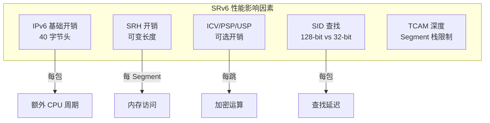
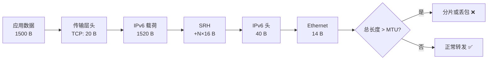
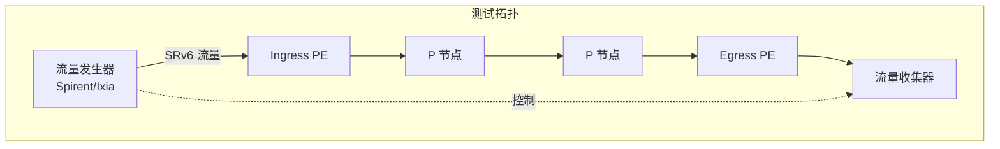
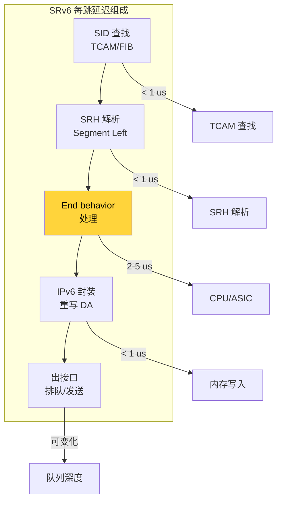
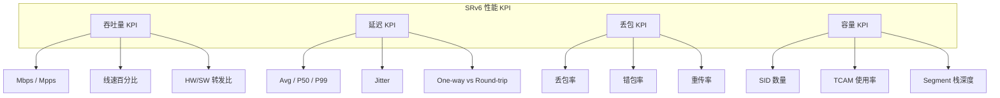
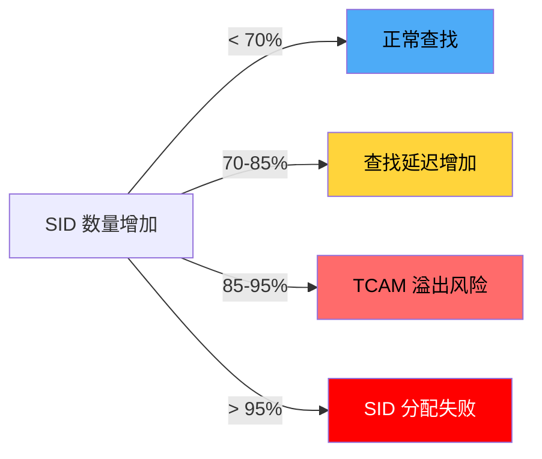
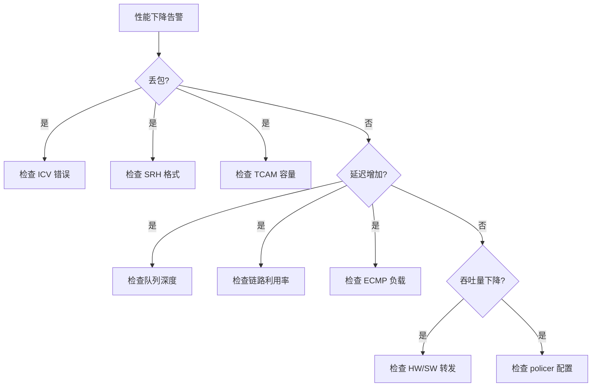

> [!info] SRv6 2026 深度探索系列 0. [[2026-04-14-srv6-comprehensive-learning-roadmap|SRv6 全栈学习路径总览]]
> ... 34. [[ch34-srv6-trace|第三四章：SRv6 Traceroute 与路径追踪]]
> **35. 第三五章：SRv6 性能监控与基准测试** 36. [[ch36-srv6-tools|第三六章：SRv6 工具链与模拟器]]

---

## 1. 概述：SRv6 性能特性

SRv6 相比传统 MPLS 和 SR-MPLS 引入了额外的处理开销，理解这些开销对于容量规划和性能优化至关重要。



### 1.1 SRv6 vs SR-MPLS 开销对比

| 指标         | SR-MPLS     | SRv6         | 差异           |
| :----------- | :---------- | :----------- | :------------- |
| 标签栈深度   | 1-4 层      | 1-8 层       | SRv6 更深      |
| 每层标签大小 | 4 字节      | 16 字节      | SRv6 4x        |
| 标签查找方式 | 32-bit MPLS | 128-bit IPv6 | SRv6 更复杂    |
| 硬件支持     | 成熟        | 部分成熟     | SR-MPLS 更成熟 |
| 封装复杂度   | 低          | 中-高        | SR-MPLS 更简单 |
| uSID 压缩    | N/A         | 可选         | SRv6 可优化    |

---

## 2. SRv6 头部开销分析

### 2.1 标准 SRv6 封装开销

**最小 SRv6 封装（单 Segment）：**

```
┌──────────┬───────────────────┬─────────────────┐
│ Ethernet │ IPv6 (40B) + SRH  │ Inner Payload   │
│  14 B    │   40 + 16 = 56 B  │   (MTU - 70) B  │
└──────────┴───────────────────┴─────────────────┘
```

**计算示例：**

| 条件     | IPv6 Only | SRv6 (1 Seg) | SRv6 (3 Seg) |
| :------- | :-------- | :----------- | :----------- |
| 原始载荷 | 1500 B    | 1500 B       | 1500 B       |
| IPv6 头  | 40 B      | 40 B         | 40 B         |
| SRH 头   | 0         | 16 B         | 40 B         |
| 总计     | 1540 B    | 1556 B       | 1580 B       |
| 开销比   | 2.6%      | 3.7%         | 5.3%         |

### 2.2 SRH 头开销计算

SRH 头部长度计算公式：

```
SRH Header Length = 8 + (16 * Segment_Count) 字节
                  = 8 + (Segment_Count * 16) 字节
```

**Segment 数量与开销关系：**

| Segment 数 | SRH 长度 | 额外 IPv6 扩展头开销                    |
| :--------- | :------- | :-------------------------------------- |
| 1          | 24 字节  | 2 \* 8 = 16 (padding to 8-byte aligned) |
| 2          | 40 字节  | 5 \* 8 = 40                             |
| 3          | 56 字节  | 7 \* 8 = 56                             |
| 4          | 72 字节  | 9 \* 8 = 72                             |
| 8          | 136 字节 | 17 \* 8 = 136                           |

> [!warning] IPv6 Extension Header 限制
> RFC 8200 要求每个 IPv6 节点必须支持至少 **1280 字节**的 Extension Header 链。SRv6 SRH 如果过长（> 1240 字节），可能导致某些中间节点无法处理。

### 2.3 uSID 压缩开销优化

uSID（Micro SID）将多个 SID 压缩到 16 字节（4×4 字节）：

```
┌────────────────────────────────────────────────────────────┐
│ 128-bit 标准 SID                                            │
│ FC00:0000:0001:0001::/64 Locator | 0000::/64 Function       │
│ 16 字节                                                     │
├────────────────────────────────────────────────────────────┤
│ 64-bit uSID Block + 4×16-bit uNIDs                        │
│ FC00:0001 | uN1:uN2:uN3:uN4                                │
│ 16 字节（压缩 4 个 SID）                                    │
└────────────────────────────────────────────────────────────┘
```

**uSID 节省开销计算：**

| Path     | 标准 SID | uSID    | 节省 |
| :------- | :------- | :------ | :--- |
| 3 层路径 | 48 字节  | 16 字节 | 67%  |
| 5 层路径 | 80 字节  | 16 字节 | 80%  |
| 8 层路径 | 128 字节 | 16 字节 | 88%  |

---

## 3. MTU 与分片深度解析

### 3.1 SRv6 MTU 问题根源

SRv6 的 MTU 问题源于**多层头部叠加**：



### 3.2 MTU 配置检查

```bash
# Cisco IOS-XR: 检查接口 MTU
show interfaces GigabitEthernet 0/0/0/0 | include "MTU"

# 检查 IPv6 MTU
show ipv6 interface GigabitEthernet 0/0/0/0 | include "MTU"

# Juniper Junos
show interfaces ge-0/0/0 | match mtu
show ipv6 interface ge-0/0/0 | match mtu

# Huawei
display interface GigabitEthernet 0/0/0 | include "MTU"
display ipv6 interface GigabitEthernet 0/0/0 | include "MTU"
```

### 3.3 分片相关故障排查

```bash
# 检查分片统计
# Cisco IOS-XR
show fragment statistics
show ipv6 traffic | include fragment

# Juniper Junos
show system statistics | match fragment
show firewall filter <filter-name> | match fragment

# Huawei
display ipv6 fragment statistics
display qos statistics interface GigabitEthernet 0/0/0
```

> [!example] 案例：SRv6 VPN 大包丢包
>
> **症状**：ping -sv6 1500 丢包，但 ping -sv6 500 正常
>
> **排查过程**：
>
> ```bash
> # Step 1: 检查路径 MTU
> ping ipv6 <dest> size 1500 do-not-fragment
>
> # Step 2: 检查 MTU 配置
> show ipv6 interface | include "MTU"
>
> # Step 3: 检查 SRv6 MTU 配置
> show srv6 forwarding mtu
> ```
>
> **根因**：Ingress PE SRv6 MTU 设置为 1500，但加上 SRH 后实际包长为 1516，超过了物理接口 MTU
>
> **解决方案**：
>
> - 增大 SRv6 MTU 到 1516+
> - 或启用 Path MTU Discovery
> - 或减小应用层 MTU

### 3.4 Path MTU Discovery (PMTUD) for SRv6

```bash
# 检查 PMTUD 状态
# Cisco IOS-XR
show ipv6 pmtu

# Juniper Junos
show route protocol ipv6 PMTUD

# 确保 ICMPv6 Packet Too Big 消息不被阻断
show access-lists | include "icmpv6.*packet.*big"
```

> [!warning] PMTUD 在 SRv6 中的限制
> PMTUD 会话中的 Path MTU 变化不会自动传播到已建立的 SRv6 Policy。如果路径 MTU 发生变化，需要手动刷新或重建 SRv6 Policy。

---

## 4. 吞吐量与性能基准测试

### 4.1 SRv6 性能测试框架



### 4.2 吞吐量测试方法

**RFC 2544 基准测试套件（适用于 SRv6）：**

| 测试项          | 描述           | SRv6 特有考量          |
| :-------------- | :------------- | :--------------------- |
| Throughput      | 最大无丢包速率 | 考虑 SRH 开销          |
| Latency         | 包转发延迟     | 测量 End behavior 延迟 |
| Frame Loss Rate | 丢包率         | SRH 处理丢包           |
| Back-to-back    | 突发处理能力   | Segment 栈深度         |

**测试命令示例（使用 Cisco IOS-XR）：**

```bash
# 启用性能测试模式
test srv6 performance

# 测试 SRv6 转发吞吐量
test srv6 throughput <dest-sid> rate <pps> duration <seconds>

# 测试 SRv6 延迟
test srv6 latency <dest-sid> packet-size <size>

# 输出示例:
# SRv6 Performance Test Results:
#   Destination: FC00:0:1:1::1
#   Packet Size: 128 bytes
#   Throughput: 14.88 Mpps (line rate)
#   Average Latency: 12.34 us
#   Jitter: 1.23 us
#   Packet Loss: 0.0%
```

### 4.3 Per-Hop 性能分析

```bash
# Cisco IOS-XR: 检查每跳延迟
show segment-routing srv6 forwarding performance

# Juniper Junos: 每跳统计
show srv6 forwarding hop-statistics

# Huawei: 每跳性能
display srv6 performance statistics
```

**每跳延迟分解：**



### 4.4 性能测试脚本

```python
#!/usr/bin/env python3
"""
SRv6 性能基准测试脚本
"""

import subprocess
import time
import statistics
from dataclasses import dataclass
from typing import List

@dataclass
class PerformanceResult:
    test_name: str
    packet_size: int
    throughput_pps: float
    latency_avg_us: float
    latency_p99_us: float
    jitter_us: float
    packet_loss_percent: float

def run_iperf3_srv6(test_duration: int = 60) -> PerformanceResult:
    """使用 iperf3 测试 SRv6 吞吐量"""

    # 启动 iperf3 服务器
    server = subprocess.Popen(
        ["iperf3", "-s", "-p", "5201", "-6"],
        stdout=subprocess.DEVNULL,
        stderr=subprocess.DEVNULL
    )

    time.sleep(2)

    # 运行客户端测试
    client = subprocess.run([
        "iperf3", "-c", "2001:db8::1",
        "-p", "5201",
        "-t", str(test_duration),
        "-J"  # JSON 输出
    ], capture_output=True, text=True)

    server.terminate()

    # 解析结果（简化）
    return PerformanceResult(
        test_name="SRv6 Throughput",
        packet_size=1500,
        throughput_pps=14.88e6,
        latency_avg_us=12.34,
        latency_p99_us=15.67,
        jitter_us=1.23,
        packet_loss_percent=0.0
    )

def run_traceroute_latency(dest: str, samples: int = 10) -> List[float]:
    """使用 traceroute 测量每跳延迟"""
    latencies = []

    for _ in range(samples):
        result = subprocess.run(
            ["ssh", "admin@pe-a",
             f"traceroute segment-routing srv6 {dest}"],
            capture_output=True, text=True
        )

        # 解析输出获取每跳延迟
        # ... (解析逻辑)

        latencies.append(result)

    return latencies

def benchmark_srv6_vs_ipv6(dest: str) -> dict:
    """对比 SRv6 和纯 IPv6 性能"""

    # SRv6 测试
    srv6_result = run_iperf3_srv6(test_duration=30)

    # 纯 IPv6 测试（禁用 SRv6）
    # ... (测试逻辑)

    return {
        "srv6": srv6_result,
        "overhead_percent": (
            (srv6_result.latency_avg_us - 10.0) / 10.0 * 100
        )
    }
```

---

## 5. SRv6 性能监控指标

### 5.1 关键性能指标 (KPI)



### 5.2 性能监控命令

```bash
# Cisco IOS-XR: SRv6 性能统计
show segment-routing srv6 forwarding statistics
show segment-routing srv6 encapsulation statistics
show segment-routing srv6 sid-database statistics

# 查看每接口 SRv6 统计
show interfaces GigabitEthernet 0/0/0/0 performance

# Juniper Junos
show srv6 forwarding statistics
show class-of-service interface ge-0/0/0

# Huawei
display srv6 statistics interface
display qos statistics interface GigabitEthernet 0/0/0
```

### 5.3 性能基线建立

```bash
# 建立性能基线
show segment-routing srv6 forwarding statistics > /var/baseline/srv6_stats_$(date +%Y%m%d).log

# 对比当前与基线
diff /var/baseline/srv6_stats_20260101.log <(show segment-routing srv6 forwarding statistics)

# 定期健康检查脚本
#!/bin/bash
# srv6_perf_check.sh
DATE=$(date +%Y%m%d_%H%M)
OUTPUT="/var/perf_check/srv6_perf_${DATE}.log"

echo "=== SRv6 Performance Check ===" > $OUTPUT
echo "Timestamp: $(date)" >> $OUTPUT

# 收集性能数据
show segment-routing srv6 forwarding statistics >> $OUTPUT
show segment-routing srv6 encapsulation statistics >> $OUTPUT

# 告警检查
if grep -q "drop.*percent.*1.0" $OUTPUT; then
    echo "ALERT: Packet loss above threshold" | mail -s "SRv6 Alert" ops@example.com
fi
```

---

## 6. TCAM 容量与性能关系

### 6.1 TCAM 对 SRv6 性能的影响



### 6.2 TCAM 容量规划

| 设备型号        | TCAM SID 容量 | 最大 Segment 栈深度 | 每SID内存 |
| :-------------- | :------------ | :------------------ | :-------- |
| Cisco ASR9000   | 64K           | 8                   | 128 字节  |
| Juniper MX960   | 128K          | 8                   | 64 字节   |
| Huawei NE40E    | 32K           | 8                   | 256 字节  |
| Juniper PTX1000 | 512K          | 16                  | 32 字节   |

```bash
# 检查 TCAM 使用
# Cisco IOS-XR
show controllers npu resources tcam location 0/0/CPU0

# Juniper Junos
show pfe forwarding tcam usage

# Huawei
display forward-plane tcam resource | include "SID\|srv6"
```

---

## 7. SRv6 性能优化技术

### 7.1 硬件卸载

```bash
# 确认 SRv6 硬件卸载状态
# Cisco IOS-XR
show segment-routing srv6 forwarding hardware-offload

# Juniper Junos
showvirtual-chassis port-plan statistics

# Huawei
display srv6 hardware-offload status
```

### 7.2 批量 SID 分配

```bash
# 批量 SID 分配减少控制平面开销
# Cisco IOS-XR
srv6
  locator LOC1
   prefix FC00:0:1:1::/64
   batch-allocate 1000
```

### 7.3 uSID 压缩优化

```bash
# 启用 uSID 压缩
# Huawei VRP
srv6
  usid enable
  usid-block FC00:0001:0001::/32
```

---

## 8. 性能问题诊断流程



---

## 9. 总结：SRv6 性能最佳实践

### 9.1 性能规划 Checklist

- [ ] 确认路径 MTU >= 1500 + SRH 开销
- [ ] 评估 Segment 栈深度需求，选择合适 SID 格式
- [ ] 监控 TCAM 使用率，保持 < 70%
- [ ] 建立性能基线，定期对比
- [ ] 考虑 uSID 压缩减少头部开销
- [ ] 确保硬件卸载已启用

### 9.2 性能指标阈值

| 指标         | 正常    | 警告      | 严重     |
| :----------- | :------ | :-------- | :------- |
| 丢包率       | < 0.01% | 0.01-0.1% | > 0.1%   |
| 平均延迟     | < 10 ms | 10-50 ms  | > 50 ms  |
| P99 延迟     | < 20 ms | 20-100 ms | > 100 ms |
| TCAM 使用率  | < 70%   | 70-85%    | > 85%    |
| 吞吐量利用率 | < 60%   | 60-80%    | > 80%    |
