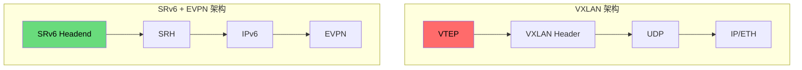
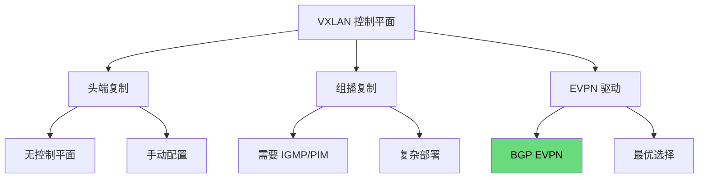
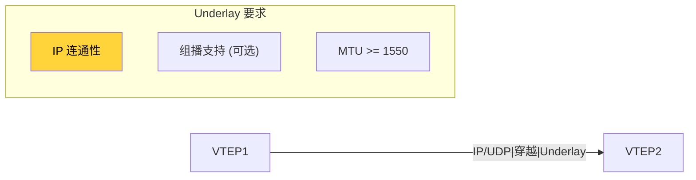
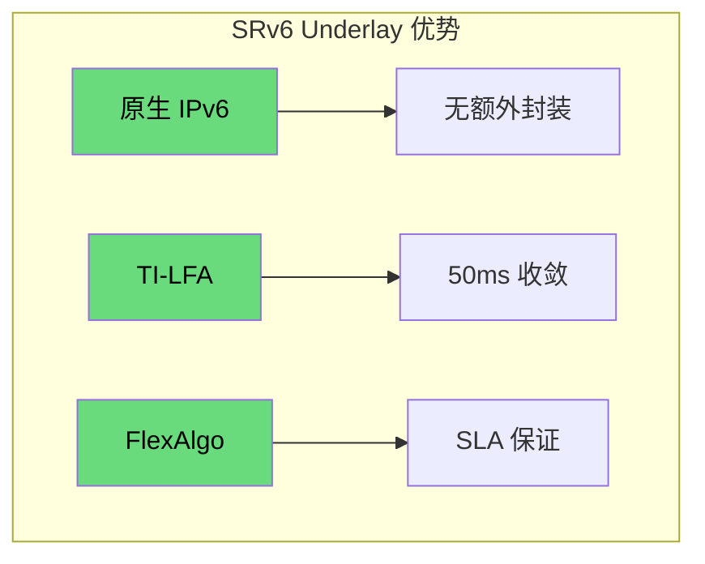
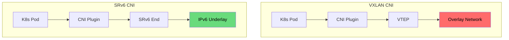
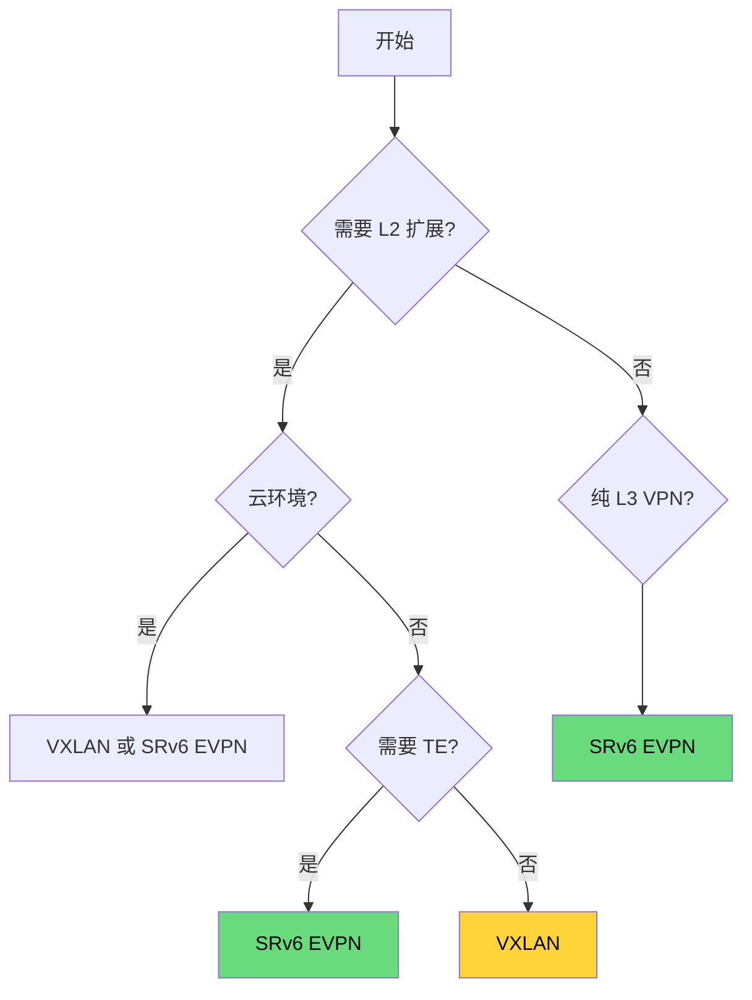
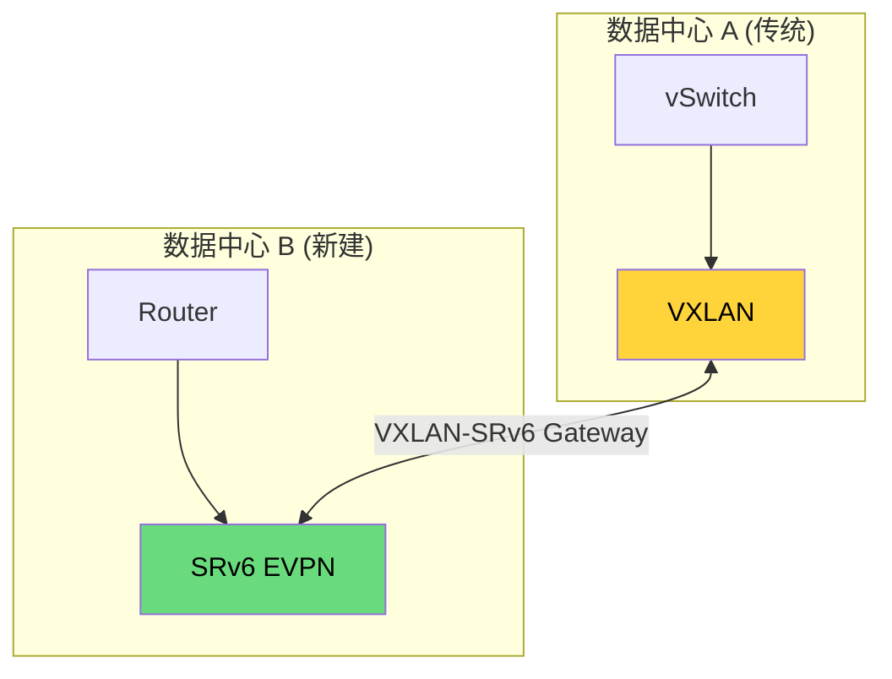

> [!info] SRv6 2026 深度探索系列 0. [[2026-04-14-srv6-comprehensive-learning-roadmap|SRv6 全栈学习路径总览]]
> ... 40. [[ch40-srv6-perf|第四十章：SRv6 转发性能与 TCAM]] 41. [[ch41-srv6-vs-mpls|第四一章：SRv6 vs SR-MPLS]]
> **42. 第四二章：SRv6 + EVPN vs VXLAN**

---

## 1. 概述：Overlay/Underlay 的博弈

VXLAN 和 SRv6 + EVPN 代表了两种不同的网络虚拟化思路：VXLAN 专注于 L2 Overlay 扩展，而 SRv6 + EVPN 提供了端到端的 Segment Routing 能力。本章深入分析两者的设计哲学、协议栈差异和适用场景。



---

## 2. 协议栈深度对比

### 2.1 VXLAN 封装

```
┌─────────┬─────────┬─────────┬───────────┬─────────┐
│Ethernet │   IP    │  UDP    │ VXLAN    │ Payload │
│ Header  │ Header  │ Header  │ Header   │         │
│ (14B)   │ (20B)   │ (8B)    │ (8B)     │         │
└─────────┴─────────┴─────────┴─────────┴─────────┘
                              ↑
                    ┌─────────────────────┐
                    │Flags(8b)|Reserved   │
                    │VNI(24b)|Reserved   │
                    └─────────────────────┘
```

**VXLAN 特性：**

- VNI (24-bit) = 1600 万个租户隔离
- UDP 封装穿越 NAT/防火墙
- VTEP (VXLAN Tunnel End Point) 负责封装/解封装
- 组播或头端复制实现泛洪

### 2.2 SRv6 + EVPN 封装

```
┌─────────┬───────────────┬───────────────┬─────────┐
│Ethernet │ IPv6 Header   │ SRH           │ EVPN    │
│ Header  │ (40B)        │ (40B + 16B*n)│ Payload │
│ (14B)   │              │               │         │
└─────────┴───────────────┴───────────────┴─────────┘
              ↑                    ↑
         Outer IPv6 DA =      Segment List
         Segment[SL]          (n × 128-bit)
```

**SRv6 EVPN 特性：**

- Native IPv6 传输，无需额外封装
- uSID 压缩减少开销
- End.DX2 直接 L2 转发
- 端到端 SR Policy

### 2.3 封装开销对比

| 封装类型    | 额外开销           | 效率 |
| :---------- | :----------------- | :--- |
| Native IPv6 | 40B                | 最高 |
| VXLAN       | 50B (IP+UDP+VXLAN) | 较低 |
| GENEVE      | 52B                | 较低 |
| GUE         | 8-16B              | 中等 |

---

## 3. 控制平面对比

### 3.1 VXLAN 控制平面

VXLAN 有多种控制平面选择：



**VXLAN + EVPN 扩展：**

| 扩展                 | NLRI Type | 用途               |
| :------------------- | :-------- | :----------------- |
| MAC/IP Advertisement | Type 1    | MAC 和 IP 路由通告 |
| Inclusive Multicast  | Type 2    | 组成员发现         |
| Ethernet Segment     | Type 3    | ES 发现，DF 选举   |
| IP Prefix            | Type 4    | IP 前缀路由        |

### 3.2 SRv6 EVPN 控制平面

SRv6 EVPN 与 VXLAN + EVPN 使用相同的 BGP EVPN NLRI，但数据平面不同：

```bash
# Juniper: VXLAN 配置
set interfaces et-0/0/0 unit 0 family inet address 10.0.0.1/24
set interfaces et-0/0/1 unit 0 encapsulation vxlan
set interfaces et-0/0/1 unit 0 vxlan vni 10000
set interfaces et-0/0/1 unit 0 vxlan outer-dot1q 100

# Cisco: SRv6 EVPN 配置
segment-routing srv6
  locator LOC1
    prefix FC00:0:1::/48
router bgp 65000
  address-family l2vpn evpn
    segment-routing srv6
```

---

## 4. L2/L3 场景对比

### 4.1 L2 扩展场景

| 场景              | VXLAN            | SRv6 EVPN    | 胜出      |
| :---------------- | :--------------- | :----------- | :-------- |
| **跨数据中心 L2** | ✅ VNI 隔离      | ✅ L2VPN     | 平手      |
| **泛洪抑制**      | ✅ 组播/头端复制 | ✅ EVPN ESI  | 平手      |
| **MAC 学习**      | 数据平面学习     | 控制平面学习 | SRv6 EVPN |
| **ARP/ND 抑制**   | 需配合 VXLAN-AA  | 原生支持     | SRv6 EVPN |
| **DF 选举**       | 手动配置         | 自动选举     | SRv6 EVPN |

### 4.2 L3 场景

| 场景            | VXLAN + VRF  | SRv6 EVPN   | 胜出      |
| :-------------- | :----------- | :---------- | :-------- |
| **多租户**      | ✅ VRF + VNI | ✅ VPNv6    | 平手      |
| **路由通告**    | Type 5 路由  | Type 5 路由 | 平手      |
| **跨域连接**    | 需要 L3VNI   | 原生跨域    | SRv6 EVPN |
| **IPv6 多租户** | ⚠️ 复杂      | ✅ 原生     | SRv6 EVPN |

---

## 5. Underlay 网络对比

### 5.1 VXLAN Underlay 要求

VXLAN 对 Underlay 的需求：



| 要求            | 说明                       |
| :-------------- | :------------------------- |
| **IP 连通性**   | VTEP 之间三层可达          |
| **组播 (可选)** | 用于 BUM 流量泛洪          |
| **MTU**         | >= 1550B (1500 + 50B 开销) |
| **NAT 穿透**    | ✅ UDP 封装可穿越          |

### 5.2 SRv6 Underlay 优势

SRv6 + EVPN 的 Underlay 优势：



| 特性              | VXLAN         | SRv6 + EVPN         |
| :---------------- | :------------ | :------------------ |
| **Underlay 协议** | 任意 IP       | Native IPv6 IGP/BGP |
| **路径控制**      | ❌            | ✅ TI-LFA, FlexAlgo |
| **快速收敛**      | 依赖 Underlay | ✅ 50ms 以内        |
| **TE 能力**       | ❌            | ✅ 端到端           |
| **封装开销**      | 50B           | 40B (无 SRH 时 0B)  |

---

## 6. 云环境集成对比

### 6.1 公有云互联

| 云厂商     | VXLAN 支持     | SRv6 支持 | 备注            |
| :--------- | :------------- | :-------- | :-------------- |
| **阿里云** | ✅ ENS VXLAN   | ✅ SRv6   | 全支持          |
| **华为云** | ✅ VXLAN       | ✅ SRv6   | 全支持          |
| **AWS**    | ✅ VXLAN (DXR) | ⚠️ 有限   | TGW 支持        |
| **Azure**  | ✅ VXLAN       | ❌        | 仅 ExpressRoute |

### 6.2 Kubernetes CNI 集成



| CNI                 | 数据平面    | 控制平面   | 状态   |
| :------------------ | :---------- | :--------- | :----- |
| **Flannel (VXLAN)** | VXLAN       | 无         | 稳定   |
| **Calico (IPIP)**   | IPIP        | BGP        | 稳定   |
| **Cilium (IPv6)**   | IPv6 + SRv6 | BGP/Cilium | 发展中 |
| **Multus**          | 多插件      | 依赖插件   | 稳定   |

---

## 7. 性能对比

### 7.1 转发性能

| 指标           | VXLAN            | SRv6 + EVPN      | 差异           |
| :------------- | :--------------- | :--------------- | :------------- |
| **单跳延迟**   | ~5-10 μs         | ~3-5 μs          | SRv6 优 30-50% |
| **吞吐量**     | ~100 Gbps        | ~100+ Gbps       | 相当           |
| **CPU 开销**   | UDP 校验和       | Native IPv6      | SRv6 优        |
| **MTU 利用率** | 1500 - 50 = 1450 | 1500 - 40 = 1460 | SRv6 优        |

### 7.2 TCAM 需求

```bash
# VXLAN TCAM 需求
# VNI 查找 (24-bit)
# 内部 MAC 查找
# 外部 IP 查找

# SRv6 TCAM 需求
# SID 查找 (128-bit) 或 uSID (16-bit)
# FIB 查找 (IPv6)
# EVPN 路由查找
```

| 资源          | VXLAN        | SRv6 + EVPN |
| :------------ | :----------- | :---------- |
| **TCAM 条目** | VNI + MAC    | SID + FIB   |
| **内存消耗**  | UDP 封装缓存 | SRH 缓存    |
| **压缩支持**  | ❌           | ✅ uSID     |

---

## 8. 选型决策树



### 8.1 决策矩阵

| 场景                 | 推荐      | 原因             |
| :------------------- | :-------- | :--------------- |
| **数据中心 L2 扩展** | VXLAN     | 成熟、厂商支持广 |
| **多数据中心 L3VPN** | SRv6 EVPN | 原生 IPv6, TE    |
| **需要端到端 SLA**   | SRv6 EVPN | TI-LFA, FlexAlgo |
| **传统 DC 迁移**     | VXLAN     | 风险低           |
| **云原生新建**       | SRv6 EVPN | IPv6-first       |
| **混合云**           | 两者混用  | 各取所长         |

### 8.2 混合部署架构



---

## 9. 总结：两种范式的融合

> [!tip] VXLAN vs SRv6 + EVPN 选型 checklist
>
> - [ ] 评估现有数据中心的 L2 扩展需求
> - [ ] 确认云厂商的 SRv6 支持情况
> - [ ] 分析是否需要端到端 TE 和 SLA 保证
> - [ ] 考虑团队技能和运维习惯
> - [ ] 制定混合部署策略

**核心结论：**

| 维度              | VXLAN      | SRv6 + EVPN | 备注     |
| :---------------- | :--------- | :---------- | :------- |
| **L2 能力**       | ⭐⭐⭐⭐⭐ | ⭐⭐⭐⭐    | 平手     |
| **L3 能力**       | ⭐⭐⭐     | ⭐⭐⭐⭐⭐  | SRv6 优  |
| **Underlay 控制** | ⭐⭐       | ⭐⭐⭐⭐⭐  | SRv6 优  |
| **云原生集成**    | ⭐⭐⭐⭐   | ⭐⭐⭐⭐⭐  | SRv6 优  |
| **生态成熟度**    | ⭐⭐⭐⭐⭐ | ⭐⭐⭐⭐    | VXLAN 优 |
| **未来演进**      | ⭐⭐⭐     | ⭐⭐⭐⭐⭐  | SRv6 优  |

**最佳实践：**

- 新建云原生 DC：优先 SRv6 + EVPN
- 传统 DC 改造：VXLAN 或渐进演进
- 混合云场景：VXLAN + SRv6 Gateway

---

**SRv6 深度探索系列导航**

> 41. [[ch41-srv6-vs-mpls|第四一章：SRv6 vs SR-MPLS]]
>     **42. 第四二章：SRv6 + EVPN vs VXLAN**
> 42. [[ch43-srv6-vs-wireguard|第四三章：SRv6 vs WireGuard]]
