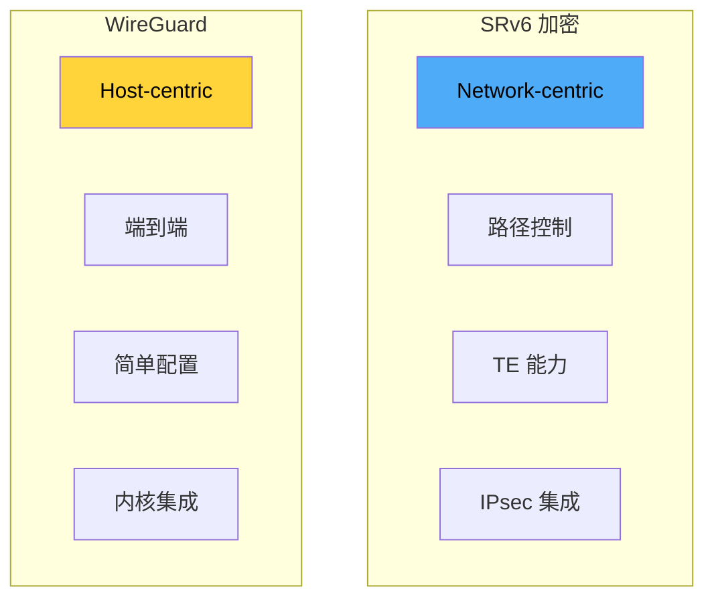
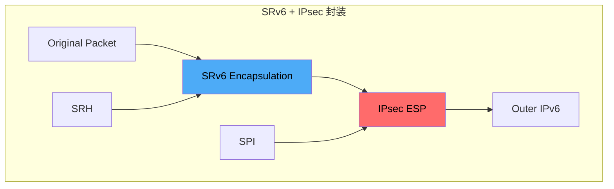
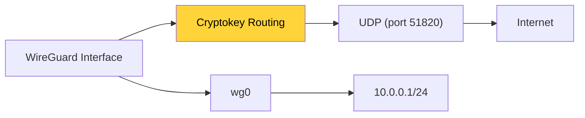
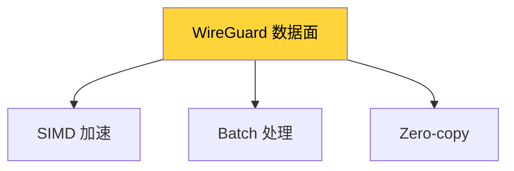
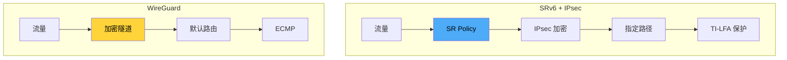
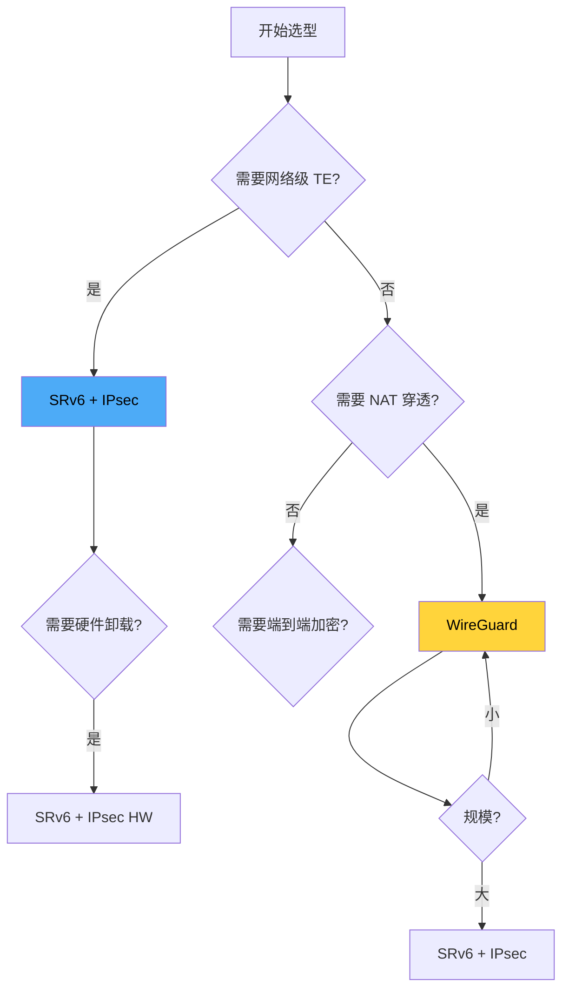
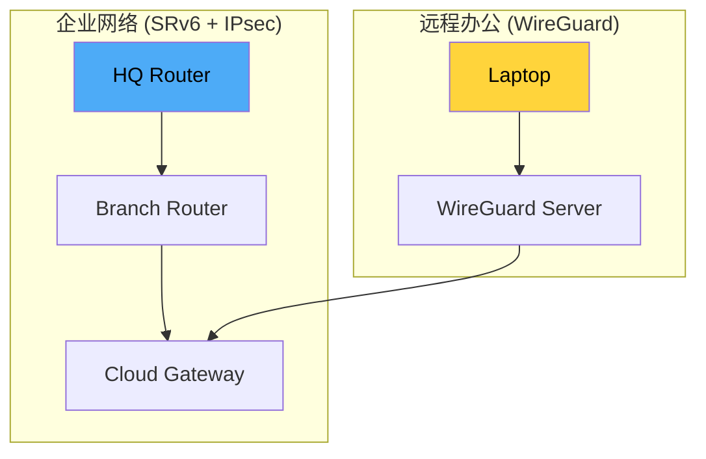

> [!info] SRv6 2026 深度探索系列 0. [[2026-04-14-srv6-comprehensive-learning-roadmap|SRv6 全栈学习路径总览]]
> ... 41. [[ch41-srv6-vs-mpls|第四一章：SRv6 vs SR-MPLS]] 42. [[ch42-srv6-vs-vxlan|第四二章：SRv6 + EVPN vs VXLAN]]
> **43. 第四三章：SRv6 加密 vs WireGuard**

---

## 1. 概述：两种加密范式

SRv6 和 WireGuard 代表了完全不同的加密传输理念：SRv6 是面向网络的隧道加密，强调路径控制和 TE 能力；WireGuard 是面向主机的端到端加密，强调简洁和性能。本章深入分析两者的设计目标、协议特性和适用场景。



---

## 2. 协议架构对比

### 2.1 SRv6 加密架构

SRv6 的加密通过 IPsec 实现，提供网络层的分段加密能力：



**SRv6 + IPsec 封装顺序：**

```
┌─────────┬───────────────┬─────────────┬───────────────┬─────────┐
│Ethernet │ Outer IPv6    │ ESP Header  │ SRH + Inner  │ Payload │
│ Header  │ (Routing)    │ (AH/ESP)    │ IPv6         │ (加密)  │
│ (14B)   │               │             │               │         │
└─────────┴───────────────┴─────────────┴───────────────┴─────────┘
              ↑                 ↑            ↑
         Next Header=ESP    加密范围      Next Header=TCP/UDP
```

### 2.2 WireGuard 协议架构

WireGuard 使用 Curve25519、ChaCha20-Poly1305 等现代加密算法：



**WireGuard 报文结构：**

```
┌─────────┬─────────────┬─────────────┬──────────────┐
│ UDP Src │ UDP Dst     │ WireGuard   │ Encrypted    │
│ Port    │ Port        │ Header      │ Packet       │
│ (4B)    │ (51820)     │ (32B)       │              │
└─────────┴─────────────┴─────────────┴──────────────┘
```

---

## 3. 安全性对比

### 3.1 加密算法

| 算法组件     | SRv6 + IPsec                    | WireGuard         |
| :----------- | :------------------------------ | :---------------- |
| **密钥交换** | IKEv2 (ECDHE)                   | Noise Protocol    |
| **加密**     | AES-GCM / ChaCha20              | ChaCha20-Poly1305 |
| **完整性**   | HMAC / AES-GCM                  | Poly1305          |
| **DH 组**    | P-256, P-384, P-521, Curve25519 | Curve25519        |
| **前向保密** | ✅ (通过 DH)                    | ✅                |

### 3.2 安全特性对比

| 特性             | SRv6 + IPsec                      | WireGuard              |
| :--------------- | :-------------------------------- | :--------------------- |
| **抗重放攻击**   | ESP Sequence + Anti-replay window | Receiver-based counter |
| **完美前向保密** | ✅                                | ✅                     |
| **身份认证**     | 证书/预共享密钥                   | 预共享密钥 (PSK)       |
| **抗 DoS**       | IKE SA 协商                       | Cookie 机制            |
| **零信任支持**   | ⚠️                                | ✅                     |

### 3.3 密钥管理

```bash
# WireGuard: 静态密钥对
[Interface]
PrivateKey = <curve25519 private key>
Address = 10.0.0.1/24
ListenPort = 51820

[Peer]
PublicKey = <peer curve25519 public key>
AllowedIPs = 10.0.0.0/24
Endpoint = 203.0.113.2:51820
PersistentKeepalive = 25

# SRv6 + IPsec: IKEv2 动态协商
# Cisco IOS-XR
crypto ipsec ikev2
  profile PROF1
    authentication rsa-sig
    encryption aes-256
    group 14
```

---

## 4. 性能对比

### 4.1 吞吐量和延迟

| 指标           | SRv6 + IPsec     | WireGuard      | 备注             |
| :------------- | :--------------- | :------------- | :--------------- |
| **加密吞吐量** | ~10-40 Gbps (HW) | ~1-5 Gbps (SW) | IPsec 可卸载     |
| **单核吞吐**   | ~1-2 Gbps        | ~500 Mbps      | WireGuard 高效   |
| **延迟增加**   | ~1-3 ms          | ~0.5-1 ms      | WireGuard 低开销 |
| **CPU 利用率** | 高 (无 HW)       | 低             | WireGuard 优化   |

### 4.2 性能优化技术

**WireGuard 优化：**



**SRv6 + IPsec 优化：**

```bash
# Cisco IOS-XR: IPsec 硬件卸载
crypto ipsec
  hw-module-profile enable
  transform-set TS1
    esp aes-gcm-256

# 检查卸载状态
show crypto ipsec sa
```

---

## 5. 网络特性对比

### 5.1 路由和封装

| 特性           | SRv6 + IPsec       | WireGuard |
| :------------- | :----------------- | :-------- |
| **封装协议**   | IPv6 + ESP         | UDP       |
| **端口**       | ESP (Protocol 50)  | UDP 51820 |
| **NAT 穿透**   | ❌ (ESP)           | ✅ (UDP)  |
| **穿越防火墙** | ⚠️ 需 ALG          | ✅        |
| **MTU 处理**   | Path MTU Discovery | 自动分片  |

### 5.2 路径控制

| 特性         | SRv6 + IPsec | WireGuard       |
| :----------- | :----------- | :-------------- |
| **源路由**   | ✅ SRv6      | ❌              |
| **TE 能力**  | ✅ FlexAlgo  | ❌              |
| **ECMP**     | ✅ 基于 SID  | ✅ 基于 5-tuple |
| **Failover** | TI-LFA 50ms  | 依赖底层网络    |
| **负载均衡** | ✅           | ✅              |



---

## 6. 适用场景对比

### 6.1 企业互连

| 场景          | SRv6 + IPsec   | WireGuard      | 推荐       |
| :------------ | :------------- | :------------- | :--------- |
| **总部-分支** | ✅             | ✅             | 取决于规模 |
| **多站点**    | ✅ (Hub-Spoke) | ⚠️ (Mesh 复杂) | SRv6       |
| **跨境专线**  | ✅             | ⚠️ NAT 问题    | SRv6       |
| **临时站点**  | ⚠️             | ✅ 快速部署    | WireGuard  |

### 6.2 云环境

| 场景               | SRv6 + IPsec     | WireGuard        | 推荐      |
| :----------------- | :--------------- | :--------------- | :-------- |
| **云 VPN Gateway** | ✅ AWS/GCP/Azure | ⚠️ 需客户端      | SRv6      |
| **云间互联**       | ✅               | ⚠️               | SRv6      |
| **远程办公**       | ⚠️               | ✅ 客户端        | WireGuard |
| **K8s Pod-to-Pod** | ✅ CNI           | ✅ WireGuard CNI | 两者      |

### 6.3 服务提供商网络

| 场景           | SRv6 + IPsec | WireGuard | 推荐 |
| :------------- | :----------- | :-------- | :--- |
| **PE-CE 加密** | ✅           | ❌        | SRv6 |
| **骨干网加密** | ✅           | ❌        | SRv6 |
| **NaaS**       | ✅           | ⚠️        | SRv6 |
| **移动回传**   | ✅           | ❌        | SRv6 |

---

## 7. 运维复杂度对比

### 7.1 配置复杂度

**WireGuard 配置示例：**

```bash
# 5 分钟快速部署
# Server
ip link add wg0 type wireguard
ip addr add 10.0.0.1/24 dev wg0
wg set wg0 private-key <privatekey>
wg set wg0 peer <peerpubkey> allowed-ips 10.0.0.0/24
ip link set wg0 up

# Client
ip link add wg0 type wireguard
ip addr add 10.0.0.2/24 dev wg0
wg set wg0 private-key <privatekey>
wg set wg0 peer <serverpubkey> allowed-ips 0.0.0.0/0 endpoint 203.0.113.1:51820
ip link set wg0 up
```

**SRv6 + IPsec 配置示例：**

```bash
# Cisco IOS-XR
crypto ipsec ikev2
  profile PROF1
    match address access-list CRYPTO_ACL
    authentication rsa-sig
    encryption aes-256

segment-routing srv6
  locator LOC1
    prefix FC00:0:1::/48

interface Tunnel0
  tunnel mode ipv6 segment-routing srv6
  tunnel source GigabitEthernet0/0/0/0
  tunnel destination FC00:0:1:1::1
  tunnel protection ipsec profile PROF1
```

### 7.2 监控和排错

| 方面           | SRv6 + IPsec           | WireGuard |
| :------------- | :--------------------- | :-------- |
| **状态查看**   | `show crypto ipsec sa` | `wg show` |
| **统计信息**   | 丰富                   | 有限      |
| **日志**       | syslog                 | wg show   |
| **排错工具**   | 成熟                   | 有限      |
| **第三方监控** | SNMP/NetFlow           | ❌        |

---

## 8. 选型决策树



### 8.1 决策矩阵

| 场景                 | 推荐         | 原因             |
| :------------------- | :----------- | :--------------- |
| **小型团队自建 VPN** | WireGuard    | 简单、快速       |
| **企业多站点互联**   | SRv6 + IPsec | 可扩展、TE       |
| **云骨干网加密**     | SRv6 + IPsec | 硬件卸载、高性能 |
| **远程办公**         | WireGuard    | 客户端简单       |
| **IoT 设备**         | WireGuard    | 低资源占用       |
| **运营商 NaaS**      | SRv6 + IPsec | 可编程、SLA      |

---

## 9. 混合使用策略

### 9.1 场景：企业网络 + 远程办公



### 9.2 整合配置

```bash
# Linux: 同时运行 WireGuard 和 SRv6
# WireGuard 用于远程接入
ip link add wg0 type wireguard
wg set wg0 private-key <key>
ip addr add 10.100.0.1/24 dev wg0

# SRv6 用于站点间流量
ip -6 route add FC00:0:1::/48 via ::1 dev ens3

# 通过 iptables 分流
iptables -t mangle -A PREROUTING -s 10.100.0.0/24 -j MARK --set-mark 1
ip rule add fwmark 1 table 100
ip -6 route add default via FC00:0:1:1::1 table 100
```

---

## 10. 总结：互补而非替代

> [!tip] SRv6 + IPsec vs WireGuard 选型 checklist
>
> - [ ] 评估网络规模和可扩展性需求
> - [ ] 确认是否需要 NAT 穿透和防火墙穿越
> - [ ] 分析是否需要 Traffic Engineering 能力
> - [ ] 考虑硬件卸载和高性能需求
> - [ ] 评估团队运维能力

**核心结论：**

| 维度         | SRv6 + IPsec  | WireGuard  | 备注         |
| :----------- | :------------ | :--------- | :----------- |
| **安全性**   | ⭐⭐⭐⭐⭐    | ⭐⭐⭐⭐⭐ | 平手         |
| **性能**     | ⭐⭐⭐⭐ (HW) | ⭐⭐⭐     | SRv6 优      |
| **易用性**   | ⭐⭐⭐        | ⭐⭐⭐⭐⭐ | WireGuard 优 |
| **可扩展性** | ⭐⭐⭐⭐⭐    | ⭐⭐⭐     | SRv6 优      |
| **NAT 穿透** | ⭐⭐          | ⭐⭐⭐⭐⭐ | WireGuard 优 |
| **网络编程** | ⭐⭐⭐⭐⭐    | ⭐         | SRv6 独有    |
| **适用场景** | 运营商/企业   | 小型/远程  | 互补         |

**最佳实践：**

- 企业骨干网：SRv6 + IPsec（高性能、可编程）
- 远程办公/个人：WireGuard（简单、零配置）
- 混合场景：两者结合，分流处理

---

**SRv6 深度探索系列导航**

> 42. [[ch42-srv6-vs-vxlan|第四二章：SRv6 + EVPN vs VXLAN]]
>     **43. 第四三章：SRv6 加密 vs WireGuard**
> 43. [[ch44-srv6-vs-sdwan|第四四章：SRv6 vs 传统 SD-WAN]]
