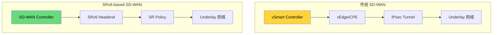
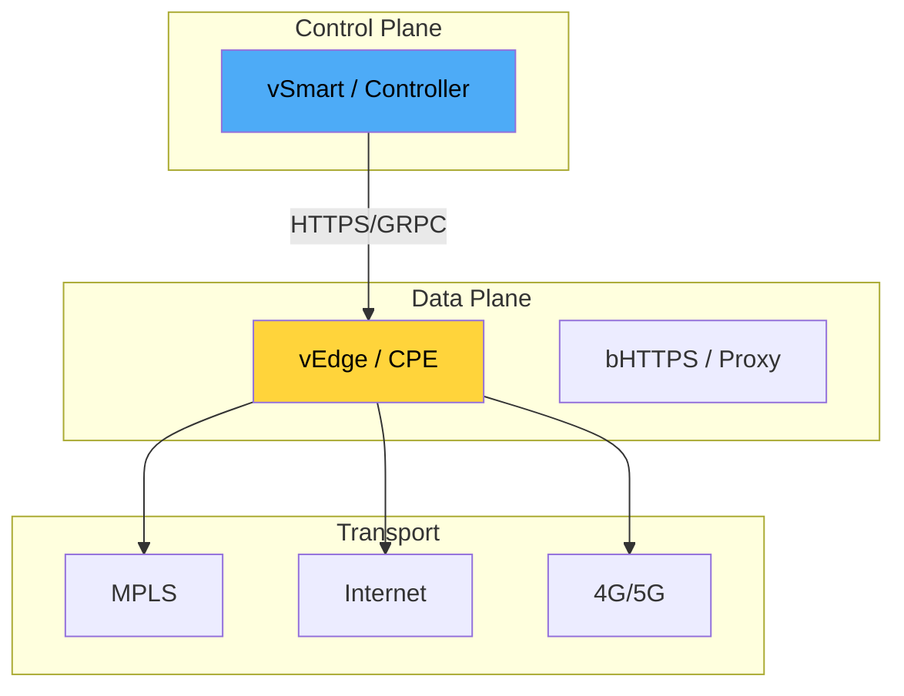
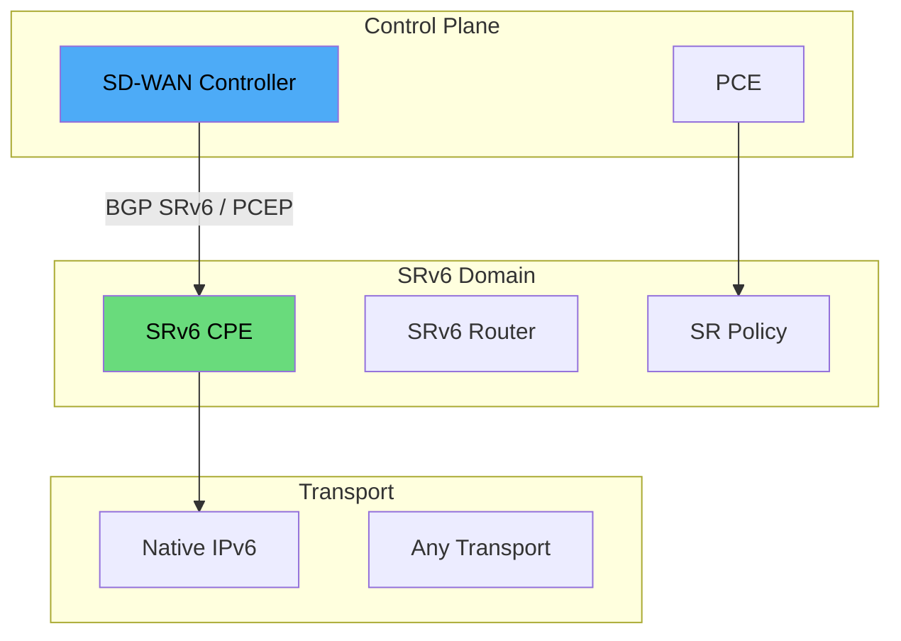
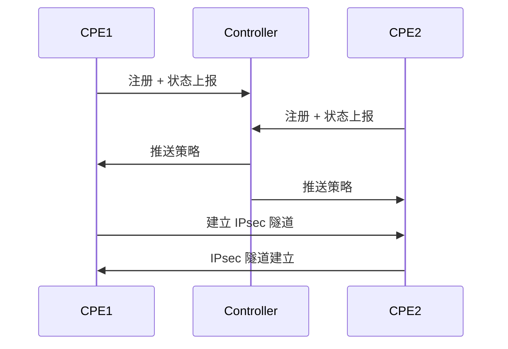
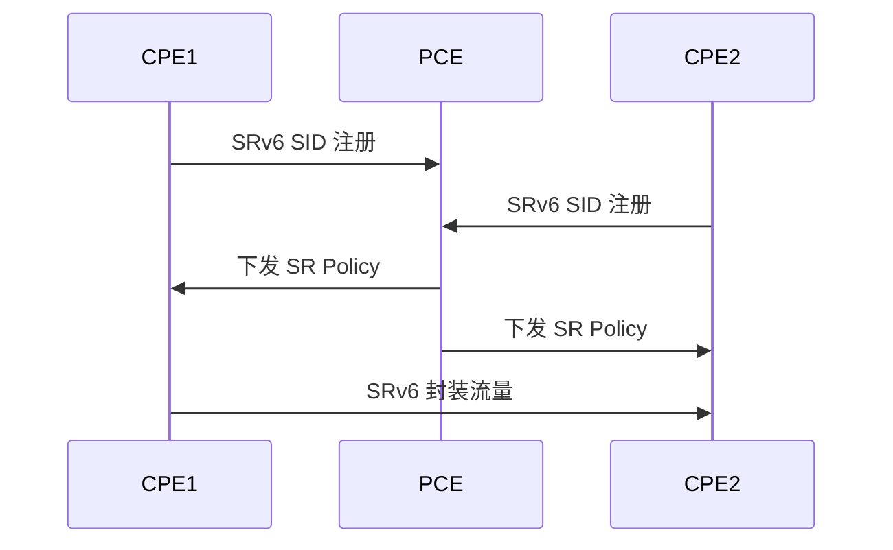
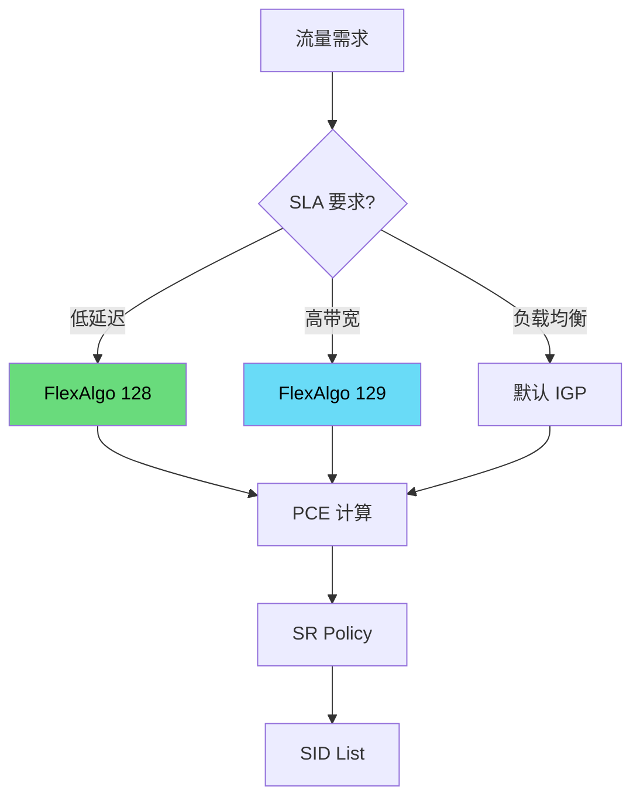
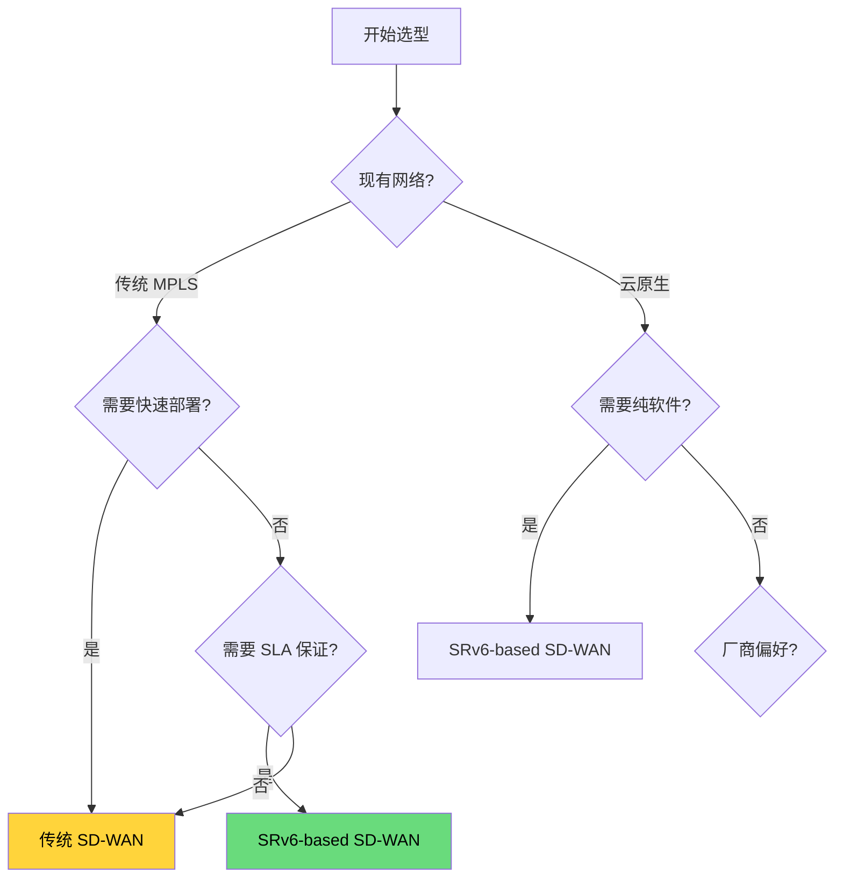
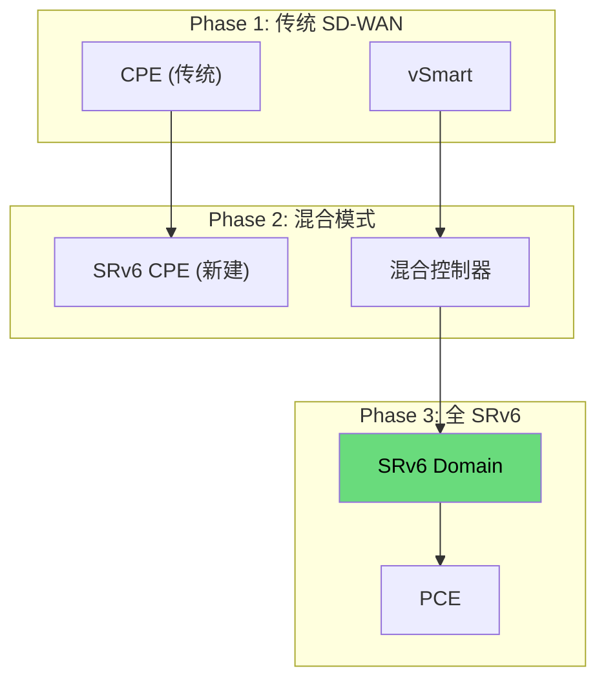

> [!info] SRv6 2026 深度探索系列 0. [[2026-04-14-srv6-comprehensive-learning-roadmap|SRv6 全栈学习路径总览]]
> ... 42. [[ch42-srv6-vs-vxlan|第四二章：SRv6 + EVPN vs VXLAN]] 43. [[ch43-srv6-vs-wireguard|第四三章：SRv6 加密 vs WireGuard]]
> **44. 第四四章：SRv6 vs 传统 SD-WAN**

---

## 1. 概述：SD-WAN 的演进

传统 SD-WAN 基于 IPsec 隧道和中心化控制，而 SRv6-based SD-WAN 利用 Segment Routing 的源路由能力，实现了分布式智能和端到端 SLA 保证。本章分析两种架构的设计哲学和适用场景。



---

## 2. 架构对比

### 2.1 传统 SD-WAN 架构

**传统 SD-WAN 组件：**



| 组件                  | 功能                     |
| :-------------------- | :----------------------- |
| **vSmart/Controller** | 集中式控制平面，策略下发 |
| **vEdge/CPE**         | 分布式数据平面，隧道封装 |
| **Overlay 网络**      | IPsec/DTLS 隧道          |
| **Underlay 网络**     | MPLS/Internet/4G         |

### 2.2 SRv6-based SD-WAN 架构



| 组件                  | 功能                      |
| :-------------------- | :------------------------ |
| **SD-WAN Controller** | 策略编排，路径计算        |
| **PCE**               | SR Policy 计算            |
| **SRv6 CPE**          | 分布式数据平面，SRv6 封装 |
| **Overlay 网络**      | SRv6 + EVPN               |
| **Underlay 网络**     | Native IPv6               |

---

## 3. 隧道机制对比

### 3.1 传统 SD-WAN 隧道

**IPsec 隧道建立流程：**



**传统 SD-WAN 隧道特性：**

- DTLS/IPsec 封装
- 传输层安全 (TLS)
- 集中式密钥管理
- 头端复制支持

### 3.2 SRv6 隧道

**SRv6 隧道建立流程：**



**SRv6 隧道特性：**

- Native IPv6 封装
- 源路由能力
- uSID 压缩
- 硬件卸载友好

---

## 4. 路径选择对比

### 4.1 传统 SD-WAN 路径选择

**路径选择算法：**

```python
# 传统 SD-WAN 路径成本计算
def sdwan_path_cost(bandwidth, latency, packet_loss, jitter):
    # 复合成本公式
    cost = (
        0.4 * (1 / bandwidth) +      # 带宽权重 40%
        0.3 * latency +               # 延迟权重 30%
        0.2 * packet_loss +           # 丢包权重 20%
        0.1 * jitter                 # 抖动权重 10%
    )
    return cost

# 选择成本最低的路径
best_path = min(paths, key=sdwan_path_cost)
```

**传统 SD-WAN 路径选择特性：**

- 基于应用/流量的策略路由
- SLA 检测和故障切换
- 集中式路径计算
- 多链路负载均衡

### 4.2 SRv6 路径选择

**SRv6 FlexAlgo 路径计算：**



| FlexAlgo | 约束         | 用途       |
| :------- | :----------- | :--------- |
| **128**  | 延迟 < 50ms  | 低延迟应用 |
| **129**  | 带宽 > 1Gbps | 视频/备份  |
| **130**  | 可靠路径     | 关键业务   |

---

## 5. 性能对比

### 5.1 延迟对比

| 场景         | 传统 SD-WAN | SRv6-based SD-WAN | 差异    |
| :----------- | :---------- | :---------------- | :------ |
| **隧道建立** | 3-5 秒      | < 1 秒            | SRv6 优 |
| **单跳延迟** | 5-10 ms     | 3-5 ms            | SRv6 优 |
| **故障切换** | 1-3 秒      | < 50 ms (TI-LFA)  | SRv6 优 |
| **路径优化** | 分钟级      | 秒级              | SRv6 优 |

### 5.2 吞吐量和扩展性

| 指标           | 传统 SD-WAN      | SRv6-based SD-WAN |
| :------------- | :--------------- | :---------------- |
| **CPE 吞吐量** | 1-10 Gbps        | 10-100+ Gbps      |
| **隧道数量**   | 受限于 CPU       | 受限于 TCAM       |
| **控制器依赖** | 强               | 弱 (分布式)       |
| **扩展性**     | 受限于中心控制器 | 线性扩展          |

---

## 6. 厂商实现对比

### 6.1 传统 SD-WAN 厂商

| 厂商                   | 产品          | 隧道技术   | 特点       |
| :--------------------- | :------------ | :--------- | :--------- |
| **Cisco (Viptela)**    | vEdge         | IPsec/DTLS | 成熟稳定   |
| **VMware (Velocloud)** | SD-WAN Edge   | IPsec      | 云集成     |
| **Palo Alto (Prisma)** | Prisma Access | IPsec      | 安全集成   |
| **Fortinet**           | FortiGate     | IPsec      | 防火墙融合 |
| **Silver Peak**        | Unity         | IPsec      | WAN 优化   |

### 6.2 SRv6-based SD-WAN 厂商

| 厂商        | 产品               | SRv6 支持 | 特点          |
| :---------- | :----------------- | :-------- | :------------ |
| **Cisco**   | IOS-XR + Crosswork | ✅        | SRv6 + SD-WAN |
| **Juniper** | Paragon + MX       | ✅        | 端到端 SRv6   |
| **Huawei**  | AgileWAN           | ✅        | 云骨干集成    |
| **Nokia**   | Nuage              | ✅        | SRv6 + EVPN   |

---

## 7. 选型决策树



### 7.1 决策矩阵

| 场景                   | 推荐              | 原因         |
| :--------------------- | :---------------- | :----------- |
| **传统企业 MPLS 迁移** | 传统 SD-WAN       | 风险低、成熟 |
| **新建云优先企业**     | SRv6-based SD-WAN | 原生 IPv6    |
| **需要 < 50ms 收敛**   | SRv6-based SD-WAN | TI-LFA       |
| **多厂商环境**         | 传统 SD-WAN       | 互操作性好   |
| **运营商 WAN**         | SRv6-based SD-WAN | 可编程       |
| **零售/分支**          | 传统 SD-WAN       | 快速部署     |

---

## 8. 迁移策略

### 8.1 渐进式迁移



### 8.2 关键技术迁移点

```bash
# Cisco: 从 Viptela SD-WAN 迁移到 SRv6
# Phase 1: 部署 SRv6 骨干
segment-routing srv6
  locator LOC1
    prefix FC00:0:1::/48

# Phase 2: 配置 SR Policy
segment-routing srv6
  policy SR-POLICY-1
    binding-sid FC00:0:1:1::100
    candidate-path preference 100
      explicit segment-list SID-LIST-1
        index 10 address FC00:0:1:2::1
        index 20 address FC00:0:1:3::1

# Phase 3: 流量迁移
set policies app-aware-policy SD-WAN-POLICY
    action steer-to sr-policy SR-POLICY-1
```

---

## 9. 总结：SD-WAN 的演进方向

> [!tip] SD-WAN 选型 checklist
>
> - [ ] 评估现有网络基础设施状态
> - [ ] 确认应用 SLA 需求（延迟/丢包）
> - [ ] 分析团队技能和运维能力
> - [ ] 考虑多厂商互操作需求
> - [ ] 制定渐进式迁移策略

**核心结论：**

| 维度         | 传统 SD-WAN | SRv6-based SD-WAN | 备注    |
| :----------- | :---------- | :---------------- | :------ |
| **成熟度**   | ⭐⭐⭐⭐⭐  | ⭐⭐⭐            | 传统优  |
| **部署速度** | ⭐⭐⭐⭐    | ⭐⭐⭐⭐          | 平手    |
| **收敛时间** | ⭐⭐⭐      | ⭐⭐⭐⭐⭐        | SRv6 优 |
| **可扩展性** | ⭐⭐⭐      | ⭐⭐⭐⭐⭐        | SRv6 优 |
| **硬件效率** | ⭐⭐⭐      | ⭐⭐⭐⭐          | SRv6 优 |
| **厂商支持** | ⭐⭐⭐⭐⭐  | ⭐⭐⭐            | 传统优  |
| **未来演进** | ⭐⭐⭐      | ⭐⭐⭐⭐⭐        | SRv6 优 |

**演进趋势：**

1. 传统 SD-WAN 厂商逐步支持 SRv6
2. 新建网络优先考虑 SRv6-based SD-WAN
3. 混合部署将成为过渡期主流
4. 云原生和 SASE 融合是未来方向

---

**SRv6 深度探索系列导航**

> 43. [[ch43-srv6-vs-wireguard|第四三章：SRv6 加密 vs WireGuard]]
>     **44. 第四四章：SRv6 vs 传统 SD-WAN**
> 44. [[ch45-srv6-future|第四五章：SRv6 未来演进]]
