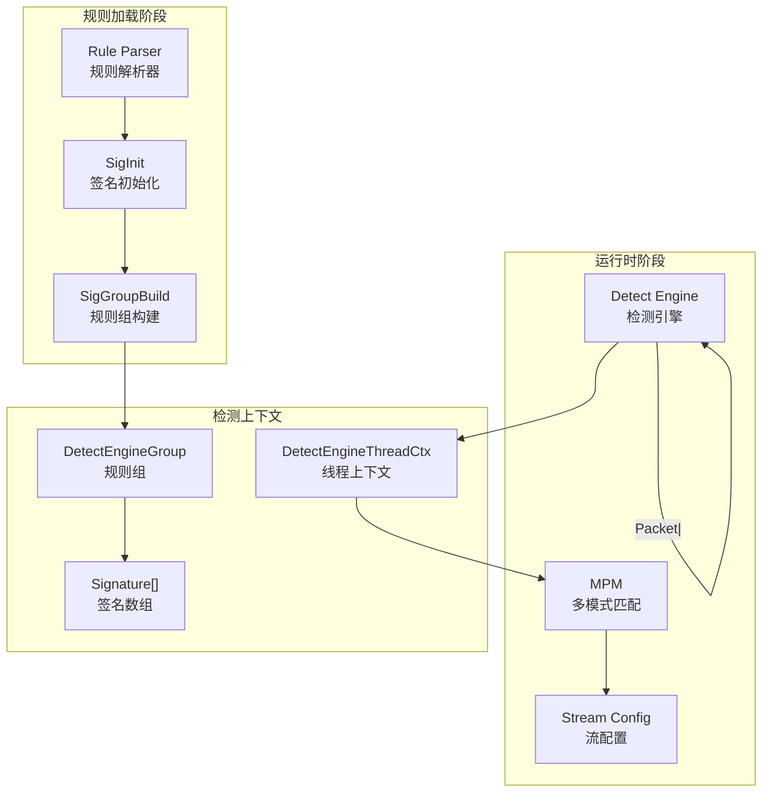
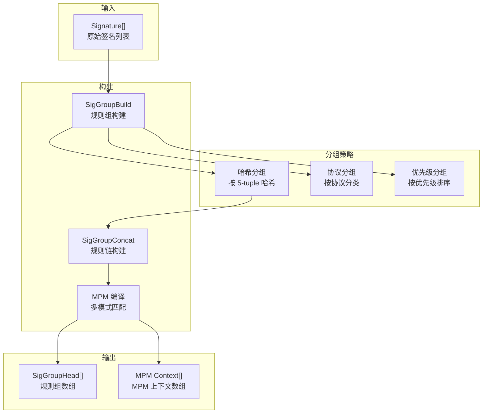

> [!info] Suricata 2026 深度探索系列 0. [[suricata-deep-dive|全栈学习路径总览]]
>
> 1. [[ch1-overview|第一章：Suricata 概述]]
> 2. [[ch2-config|第二章：Suricata 配置系统]]
> 3. [[ch3-runmodes|第三章：Runmodes 运行模式]]
> 4. [[ch4-thread-model|第四章：线程模型]]
> 5. [[ch5-capture|第五章：Capture 初始化]]
> 6. [[ch6-af-packet|第六章：AF-PACKET 接口]]
> 7. [[ch7-pcap|第七章：PCAP 接口]]
> 8. [[ch8-nfq|第八章：NFQ 与 PF_RING 模式]]
> 9. [[ch9-dpdk|第九章：DPDK 接口]]
> 10. [[ch10-loadbalancing|第十章：多线程抓包与负载均衡]]
> 11. **第十一章：检测引擎架构**

---

## 1. 检测引擎概述

Suricata 的检测引擎是整个 IDS/IPS 系统的核心，负责对网络流量进行模式匹配和安全检测。检测引擎的工作流程包括：**规则加载、规则编译（SigGroupBuild）、运行时匹配**三个阶段。



### 1.1 检测引擎 vs Snort

|| 特性 | Suricata | Snort ||
|| :--- | :--- | :--- ||
|| **规则编译** | SigGroupBuild 预编译 | 运行时编译 ||
|| **MPM 引擎** | AC/Bm/Hyperscan 可插拔 | AC (固定) ||
|| **多线程** | 原生支持 | 需 DAQ 插件 ||
|| **AppLayer 检测** | 独立状态机 | 共享状态机 ||
|| **Lua 扩展** | 原生支持 | 需 Lua preprocessor ||
|| **文件检测** | 内置 file-data | 需 file_inspectors ||

---

## 2. DetectEngine 核心数据结构

### 2.1 DetectEngineCtx 主上下文

```c
// src/detect.h — 检测引擎主上下文
typedef struct DetectEngineCtx_ {
    /* 签名列表 */
    Signature *sig_list;              // 签名链表
    uint32_t sig_count;               // 签名总数

    /* 规则文件路径 */
    char *rule_files;                 // 规则文件路径

    /* MPM 配置 */
    enum MPMDefaultMode mpm_default_mode;  // AC/Bm/Hyperscan
    int mpm_matcher;                  // MPM 匹配器

    /* 规则组 */
    SigGroupHead *sig_groups;          // 规则组数组
    uint32_t sig_group_cnt;           // 规则组数量

    /* AppLayer 协议检测 */
    AppProto engine_proto;            // 协议类型

    /* 流配置 */
    uint32_t stream_depth;            // 流重组深度
    uint32_t stream_timeouts[256];    // 流超时

    /* 线程上下文数组 */
    DetectEngineThreadCtx **dets;     // per-thread 上下文
    uint16_t det_count;               // 线程数

    /* 配置 */
    int inspection_recursion_limit;   // 递归深度限制
    int max_uniq_toclient_groups;     // toclient 规则组数
    int max_uniq_toserver_groups;     // toserver 规则组数

    /* 统计 */
    uint64_t sig_cnt;                 // 签名计数
    uint64_t mpm_cnt;                 // MPM 签名计数

    /* 白名单/黑名单 */
    int whitelist_mode;               // 白名单模式

    /* 标志位 */
    uint16_t flags;
#define DE_QUIET              0x01   // 静默模式
#define DE_ENVIRON             0x02   // 环境变量
#define DE_RUNMODE_UNITS_TEST  0x04   // 单元测试
} DetectEngineCtx;
```

### 2.2 DetectEngineThreadCtx 线程上下文

```c
// src/detect.h — per-thread 检测上下文
typedef struct DetectEngineThreadCtx_ {
    /* 指向主上下文 */
    DetectEngineCtx *de_ctx;          // 父 DetectEngineCtx

    /* 当前检测的签名 */
    const Signature *sig;            // 当前签名

    /* 检测结果 */
    uint8_t detect_flags;            // 检测标志
    uint16_t alerts;                 // 告警数

    /* MPM 上下文 */
    MpmCtx mpm_ctx;                   // MPM 匹配上下文
    MpmThreadCtx mpm_thread_ctx;      // per-thread MPM 上下文

    /* 流重组上下文 */
    StreamReassembly *stream_reassembly;

    /* TCP 跟踪上下文 */
    TcpSession *tcp;                  // TCP 会话

    /* 文件检测上下文 */
    FileContainer *files;             // 文件容器

    /* AppLayer 状态 */
    void *alstate;                    // AppLayer 状态
    AppProto alproto;                 // AppLayer 协议

    /* 统计 */
    uint64_t counter_detect;          // 检测次数
    uint64_t counter_mpm_list;         // MPM 列表数
    uint64_t counter_seeds;           // 种子数

    /* 临时缓冲区 */
    uint8_t *buffer;                  // 通用缓冲区
    uint32_t buffer_len;              // 缓冲区长度

    /* decomp 上下文 */
    void *decomp_ctx;                // 解压上下文

    /* inspection 相关 */
    uint32_t inspection_recursion_counter;  // 递归计数
} DetectEngineThreadCtx;
```

### 2.3 Signature 签名结构

```c
// src/detect.h — 签名结构
typedef struct Signature_ {
    /* 签名 ID */
    uint64_t id;                     // 签名唯一 ID
    uint64_t rev;                    // 修订版本

    /* 签名信息 */
    char *msg;                       // 告警信息
    char *gid;                       // 组 ID
    char *classtype;                 // 分类
    char *priority;                  // 优先级

    /* 匹配条件 */
    uint8_t type;                    // SIG_TYPE_* 类型
    uint8_t proto;                   // 协议

    /* 地址匹配 */
    struct DetectAddressHead_ *src;  // 源地址
    struct DetectAddressHead_ *dst;  // 目的地址
    uint16_t sp;                     // 源端口
    uint16_t dp;                     // 目的端口

    /* 规则内容 */
    struct DetectContentData *sig_content;  // 内容匹配
    struct DetectPcreData *sig_pcre;        // PCRE 匹配

    /* AppLayer 相关 */
    struct DetectAppLayerData *alproto;     // AppLayer 协议

    /* 关键字列表 */
    struct DetectContentData *matches;      // 内容匹配列表
    struct SigMatch_ *smlist[12];           // 关键字列表

    /* 动作 */
    uint8_t action;                  // ALERT/PASS/DROP/REJECT

    /* 标志位 */
    uint32_t flags;
#define SIG_FLAG_SRC_ANY      0x01   // 源地址任意
#define SIG_FLAG_DST_ANY      0x02   // 目的地址任意
#define SIG_FLAG_SP_ANY       0x04   // 源端口任意
#define SIG_FLAG_DP_ANY       0x08   // 目的端口任意
#define SIG_FLAG_PAYLOAD      0x10   // payload 检测
#define SIG_FLAG_STREAM       0x20   // 流检测
#define SIG_FLAG_APPLAYER     0x40   // AppLayer 检测

    /* 规则组信息 */
    int8_t sgh_toclient;            // toclient 规则组索引
    int8_t sgh_toserver;            // toserver 规则组索引

    /* MPM 信息 */
    uint8_t mpm_pattern;            // 是否启用 MPM
    uint8_t mpm_pattern_len;        // MPM 模式长度

    /* 文件信息 */
    uint8_t file_flags;             // 文件相关标志

    /* 链表 */
    struct Signature_ *next;         // 下一个签名
} Signature;
```

---

## 3. 检测引擎初始化

### 3.1 DetectEngineBuild 主流程

```c
// src/detect-engine-build.c — 检测引擎构建入口
DetectEngineCtx *DetectEngineBuild(void)
{
    /* 1. 分配检测引擎上下文 */
    DetectEngineCtx *de_ctx = SCCalloc(1, sizeof(DetectEngineCtx));
    if (de_ctx == NULL) {
        return NULL;
    }

    /* 2. 加载规则文件 */
    if (SigLoadSignatures(de_ctx, NULL) != 0) {
        SCLogError("Failed to load signatures");
        goto error;
    }

    /* 3. 构建规则组 */
    if (SigGroupBuild(de_ctx) != 0) {
        SCLogError("Failed to build signature groups");
        goto error;
    }

    /* 4. 初始化检测引擎统计 */
    DetectEngineSetupBPF(de_ctx);

    /* 5. 创建线程上下文 */
    de_ctx->dets = SCCalloc(num_threads, sizeof(DetectEngineThreadCtx *));
    for (int i = 0; i < num_threads; i++) {
        de_ctx->dets[i] = DetectEngineThreadCtxAlloc(de_ctx);
    }

    return de_ctx;

error:
    DetectEngineCtxFree(de_ctx);
    return NULL;
}
```

### 3.2 规则加载 SigLoadSignatures

```c
// src/detect-engine.c — 规则加载
int SigLoadSignatures(DetectEngineCtx *de_ctx, char *sig_file)
{
    /* 1. 打开规则文件 */
    FILE *fp = fopen(sig_file, "r");
    if (fp == NULL) {
        SCLogError("Cannot open signature file");
        return -1;
    }

    /* 2. 逐行解析规则 */
    char line[1024];
    while (fgets(line, sizeof(line), fp) != NULL) {
        /* 跳过注释和空行 */
        if (line[0] == '#' || line[0] == '\n') {
            continue;
        }

        /* 解析规则 */
        Signature *sig = SigInit(de_ctx, line);
        if (sig == NULL) {
            SCLogWarning("Failed to parse rule: %s", line);
            continue;
        }

        /* 添加到签名列表 */
        SigAdd(de_ctx, sig);
    }

    fclose(fp);

    SCLogInfo("Loaded %d signatures", de_ctx->sig_count);
    return 0;
}
```

---

## 4. SigGroupBuild 规则组构建

### 4.1 规则组构建流程

SigGroupBuild 是 Suricata 检测引擎的核心优化步骤。它将相似的签名分组到同一个 **SigGroupHead** 中，减少运行时匹配的开销。



### 4.2 SigGroupBuild 源码

```c
// src/detect-engine-build.c — 规则组构建
int SigGroupBuild(DetectEngineCtx *de_ctx)
{
    /* 1. 分配规则组头数组 */
    de_ctx->sig_groups = SCCalloc(65536, sizeof(SigGroupHead *));
    if (de_ctx->sig_groups == NULL) {
        return -1;
    }

    /* 2. 遍历所有签名 */
    for (Signature *sig = de_ctx->sig_list; sig != NULL; sig = sig->next) {
        /* 根据方向分配规则组 */
        if (sig->sgh_toserver >= 0) {
            /* toserver 方向 */
            SigGroupHead *sgh = SigGroupHeadGetOrCreate(de_ctx, sig, 0);
            if (sgh == NULL) {
                return -1;
            }
            sig->sgh_toserver = SigGroupHeadStore(de_ctx, sgh, 0);
        }

        if (sig->sgh_toclient >= 0) {
            /* toclient 方向 */
            SigGroupHead *sgh = SigGroupHeadGetOrCreate(de_ctx, sig, 1);
            if (sgh == NULL) {
                return -1;
            }
            sig->sgh_toclient = SigGroupHeadStore(de_ctx, sgh, 1);
        }
    }

    /* 3. MPM 预编译 */
    if (de_ctx->mpm_default_mode != MPM_NOT_SET) {
        MpmBuildMatchArray(de_ctx);
    }

    /* 4. 清理临时数据 */
    SigGroupCleanup(de_ctx);

    return 0;
}
```

### 4.3 SigGroupHead 规则组头

```c
// src/detect.h — 规则组头结构
typedef struct SigGroupHead_ {
    /* 规则列表 */
    uint32_t *sig_array;             // 签名 ID 数组
    uint32_t sig_cnt;                // 签名数量

    /* MPM 上下文 */
    MpmCtx mpm_ctx;                  // MPM 上下文

    /* 规则内容匹配 */
    struct DetectContentData **matches;  // 内容匹配列表
    uint32_t match_cnt;              // 匹配数

    /* toserver/toclient */
    uint8_t direction;               // 方向

    /* 探测端口掩码 */
    uint16_t to_dst_port;           // 目的端口
    uint16_t to_src_port;           // 源端口

    /* IP 链表 */
    struct DetectAddressHead_ *allow_all;  // 允许所有

    /* flags */
    uint32_t flags;
#define SG_HEAD_FLAG_NEWIP      0x01  // 新 IP 检测
#define SG_HEAD_FLAG_DNS       0x02  // DNS 检测
#define SG_HEAD_FLAG_HTTP      0x04  // HTTP 检测

    /* 统计 */
    uint32_t unique_str_count;       // 唯一字符串数
} SigGroupHead;
```

### 4.4 MPM 预编译

```c
// src/detect-engine-mpm.c — MPM 预编译
void MpmBuildMatchArray(DetectEngineCtx *de_ctx)
{
    /* 遍历所有规则组 */
    for (uint32_t i = 0; i < de_ctx->sig_group_cnt; i++) {
        SigGroupHead *sgh = de_ctx->sig_groups[i];
        if (sgh == NULL) continue;

        /* 初始化 MPM 上下文 */
        MpmCtxInit(&sgh->mpm_ctx, de_ctx->mpm_default_mode);

        /* 收集该组内所有签名的内容模式 */
        for (uint32_t j = 0; j < sgh->sig_cnt; j++) {
            Signature *sig = SigById(de_ctx, sgh->sig_array[j]);
            if (sig == NULL) continue;

            /* 提取内容匹配 */
            DetectContentData *cd = sig->matches;
            while (cd != NULL) {
                /* 添加到 MPM */
                MpmAddPattern(&sgh->mpm_ctx, cd->content, cd->content_len,
                              cd->offset, cd->depth, sig->id);
                cd = cd->next;
            }
        }

        /* 编译 MPM */
        MpmCompile(&sgh->mpm_ctx);
    }
}
```

---

## 5. 运行时检测流程

### 5.1 Detect 函数入口

```c
// src/detect.c — 检测主函数
int Detect(ThreadVars *tv, Packet *p, DetectEngineCtx *de_ctx,
           DetectEngineThreadCtx *det_ctx)
{
    /* 1. 预处理检查 */
    if (det_ctx == NULL || p == NULL) {
        return 0;
    }

    /* 2. 检查 Packet 是否有有效载荷 */
    if (!PacketHasPayload(p)) {
        return 0;
    }

    /* 3. 确定流量方向 */
    int direction = (PACKET_WasSentToServer(p)) ? 0 : 1;
    // 0 = toserver, 1 = toclient

    /* 4. 获取对应的规则组 */
    SigGroupHead *sgh = DetectGetSgh(de_ctx, p, direction);
    if (sgh == NULL) {
        return 0;
    }

    /* 5. MPM 快速匹配 */
    if (sgh->mpm_ctx.pattern_cnt > 0) {
        int mpm_matches = MpmMatch(&sgh->mpm_ctx, &det_ctx->mpm_thread_ctx,
                                   p->payload, p->payload_len);
        if (mpm_matches == 0) {
            return 0;  // MPM 未命中，跳过
        }
    }

    /* 6. 详细规则匹配 */
    for (uint32_t i = 0; i < sgh->sig_cnt; i++) {
        Signature *sig = SigById(de_ctx, sgh->sig_array[i]);
        if (sig == NULL) continue;

        /* 单个签名匹配 */
        if (SigMatchSignatures(det_ctx, de_ctx, p, sig) == 1) {
            /* 命中，创建告警 */
            DetectAlertNew(det_ctx, p, sig);
        }
    }

    return det_ctx->alerts;
}
```

### 5.2 SigMatchSignatures 单签名匹配

```c
// src/detect.c — 单签名匹配
static int SigMatchSignatures(DetectEngineThreadCtx *det_ctx,
                              DetectEngineCtx *de_ctx,
                              Packet *p, Signature *sig)
{
    /* 1. 协议检查 */
    if (sig->proto != 0 && sig->proto != p->proto) {
        return 0;
    }

    /* 2. 地址检查 */
    if (sig->src != NULL && !DetectAddressMatch(sig->src, &p->src)) {
        return 0;
    }
    if (sig->dst != NULL && !DetectAddressMatch(sig->dst, &p->dst)) {
        return 0;
    }

    /* 3. 端口检查 */
    if (!(sig->flags & SIG_FLAG_SP_ANY) && sig->sp != p->sp) {
        return 0;
    }
    if (!(sig->flags & SIG_FLAG_DP_ANY) && sig->dp != p->dp) {
        return 0;
    }

    /* 4. 内容匹配 (通过 MPM) */
    DetectContentData *cd = sig->matches;
    while (cd != NULL) {
        /* 深度检查 */
        if (cd->depth != 0 && cd->offset + cd->content_len > cd->depth) {
            cd = cd->next;
            continue;
        }

        /* 在 payload 中搜索 */
        uint8_t *found = MpmSearch(cd->content, cd->content_len,
                                   p->payload, p->payload_len);
        if (found == NULL) {
            return 0;  // 内容未匹配
        }

        cd = cd->next;
    }

    /* 5. PCRE 匹配 (如果有) */
    if (sig->sig_pcre != NULL) {
        if (!DetectPcreMatch(p->payload, p->payload_len,
                            sig->sig_pcre)) {
            return 0;
        }
    }

    /* 6. AppLayer 匹配 (如果有) */
    if (sig->alproto != NULL) {
        if (!DetectAppLayerMatch(det_ctx, p, sig->alproto)) {
            return 0;
        }
    }

    return 1;  // 所有条件匹配
}
```

### 5.3 检测流水线时序图

```mermaid
sequenceDiagram
    participant PKT as Packet
    participant DE as Detect Engine
    participant MPM as MPM (AC/Bm/Hyperscan)
    participant SGH as SigGroupHead
    participant SIG as Signature
    participant ALT as Alert

    PKT->>DE: Packet + Payload

    DE->>SGH: 查找对应规则组

    SGH->>MPM: 快速模式匹配
    MPM-->>DE: 返回匹配的模式列表

    alt MPM 未命中
        DE-->>PKT: 无匹配
    else MPM 命中
        loop 每个匹配的签名
            DE->>SIG: 详细规则匹配
            SIG-->>DE: 匹配/不匹配
        end

        alt 有签名命中
            DE->>ALT: 创建告警
            ALT-->>PKT: Alert 输出
        end
    end
```

---

## 6. 检测线程上下文管理

### 6.1 线程上下文分配

```c
// src/detect-engine.c — 线程上下文分配
DetectEngineThreadCtx *DetectEngineThreadCtxAlloc(DetectEngineCtx *de_ctx)
{
    DetectEngineThreadCtx *det_ctx = SCCalloc(1, sizeof(DetectEngineThreadCtx));
    if (det_ctx == NULL) {
        return NULL;
    }

    /* 指向主上下文 */
    det_ctx->de_ctx = de_ctx;

    /* 初始化 MPM 线程上下文 */
    MpmThreadCtxInit(&det_ctx->mpm_thread_ctx);

    /* 初始化流重组 */
    det_ctx->stream_reassembly = StreamReassemblyInit();

    /* 初始化文件容器 */
    det_ctx->files = FileContainerAlloc();

    /* 分配检测缓冲区 */
    det_ctx->buffer = SCMalloc(4096);
    det_ctx->buffer_len = 4096;

    /* 计数器初始化 */
    det_ctx->counter_detect = 0;
    det_ctx->counter_mpm_list = 0;

    return det_ctx;
}
```

### 6.2 线程上下文释放

```c
// src/detect-engine.c — 线程上下文释放
void DetectEngineThreadCtxFree(DetectEngineThreadCtx *det_ctx)
{
    if (det_ctx == NULL) {
        return;
    }

    /* 释放 MPM 线程上下文 */
    MpmThreadCtxDestroy(&det_ctx->mpm_thread_ctx);

    /* 释放流重组 */
    if (det_ctx->stream_reassembly != NULL) {
        StreamReassemblyFree(det_ctx->stream_reassembly);
    }

    /* 释放文件容器 */
    if (det_ctx->files != NULL) {
        FileContainerFree(det_ctx->files);
    }

    /* 释放缓冲区 */
    if (det_ctx->buffer != NULL) {
        SCFree(det_ctx->buffer);
    }

    /* 释放 AppLayer 状态 */
    if (det_ctx->alstate != NULL) {
        AppLayerStateFree(det_ctx->alstate);
    }

    SCFree(det_ctx);
}
```

---

## 7. 检测引擎配置

### 7.1 detect 配置项

```yaml
# suricata.yaml
detect:
  # 检测引擎配置
  profile: medium # 签名匹配配置文件

  # MPM 默认模式
  mpm:
    algo: auto # 自动选择 AC/Bm/Hyperscan

  # 签名匹配
  sig-match:
    compile-limit: 1000 # 每签名编译限制

  # 流重组
  stream:
    depth: 1MB # 流重组深度
    reassembly:
      depth: 1MB # 重组深度
      alignment: 4 # 内存对齐

  # AppLayer 检测
  applog:
    enabled: yes
    type: http

  # 检测线程数
  threads: auto # auto 或具体数字
```

### 7.2 profile 配置

```yaml
# suricata.yaml — 不同 profile 的配置
detect:
  profile: high # 或 medium/low/custom

  # custom profile 示例
  custom:
    # MPM 算法
    mpm-algo: ac # ac/bm/hs（Hyperscan）

    # 签名匹配缓冲大小
    sig-buffer-size: 32768

    # 流深度
    stream-depth: 1MB

    # AppLayer 深度
    inspection-recursion-limit: 3000
```

---

## 8. 配置 → 源码映射表

|| YAML 配置 | C 变量 | 源文件 | 说明 ||
|| :--- | :--- | :--- | :--- ||
|| `detect.profile` | `DetectEngineCtx.profile` | `detect-engine-build.c` | 签名配置文件 ||
|| `detect.mpm.algo` | `mpm_default_mode` | `detect-engine-mpm.c` | MPM 算法选择 ||
|| `detect.stream.depth` | `stream_depth` | `detect-engine.c` | 流重组深度 ||
|| `detect.inspection-recursion-limit` | `inspection_recursion_limit` | `detect.c` | 递归深度限制 ||
|| `detect.sig-match.compile-limit` | `compile_limit` | `detect-engine-build.c` | 编译限制 ||
|| `detect.threads` | `det_count` | `detect-engine.c` | 检测线程数 ||
|| `detect.custom.mpm-algo` | `MPM_*` | `detect-engine-mpm.c` | MPM 算法枚举 ||

---

## 9. 小结

本章深入解析了 Suricata 检测引擎的架构设计：

1. **DetectEngineCtx**：主检测引擎上下文，管理所有签名和规则组
2. **SigGroupBuild**：规则组预编译，将相似签名分组，优化运行时匹配
3. **MPM 流水线**：AC/Bm/Hyperscan 多模式匹配引擎，加速内容检测
4. **DetectEngineThreadCtx**：per-thread 检测上下文，包含 MPM、流重组、文件检测等
5. **运行时检测流程**：Packet → 规则组 → MPM 快速匹配 → 详细规则匹配 → 告警

下一章我们将深入 **规则解析**，从 Snort 兼容规则语法到 Suricata 内部 Signature 结构体的完整映射过程。
