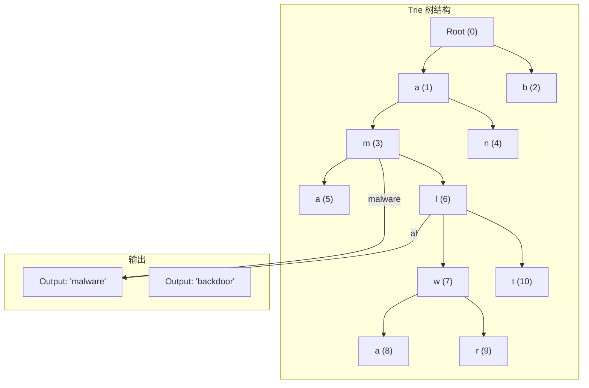
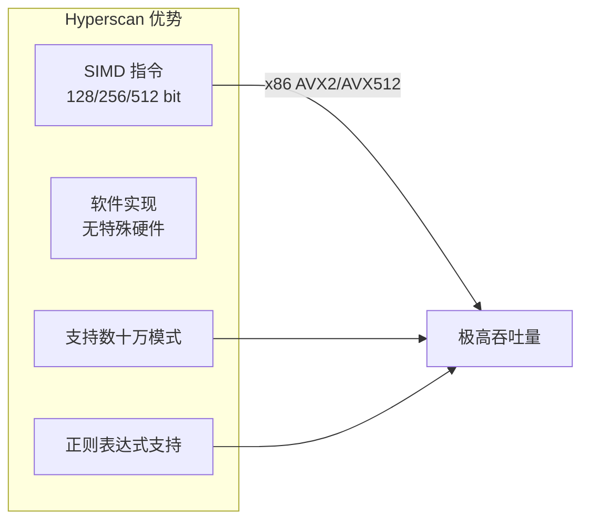
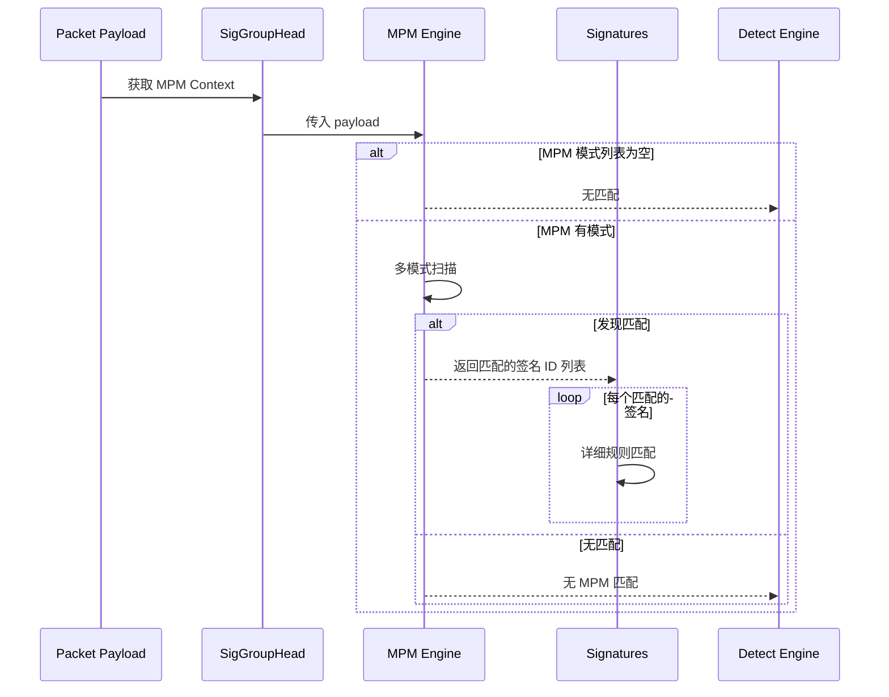

> [!info] Suricata 2026 深度探索系列 0. [[suricata-deep-dive|全栈学习路径总览]]
>
> 1. [[ch1-overview|第一章：Suricata 概述]]
> 2. [[ch2-config|第二章：Suricata 配置系统]]
> 3. [[ch3-runmodes|第三章：Runmodes 运行模式]]
> 4. [[ch4-thread-model|第四章：线程模型]]
> 5. [[ch5-capture|第五章：Capture 初始化]]
> 6. [[ch6-af-packet|第六章：AF-PACKET 接口]]
> 7. [[ch7-pcap|第七章：PCAP 接口]]
> 8. [[ch8-nfq|第八章：NFQ 与 PF_RING 模式]]
> 9. [[ch9-dpdk|第九章：DPDK 接口]]
> 10. [[ch10-loadbalancing|第十章：多线程抓包与负载均衡]]
> 11. [[ch11-detect-engine|第十一章：检测引擎架构]]
> 12. [[ch12-signatures|第十二章：规则解析]]
> 13. **第十三章：多模式匹配**

---

## 1. MPM 概述

多模式匹配（Multi-Pattern Matching, MPM）是 Suricata 检测引擎的核心性能优化。与单模式匹配（如 `strstr`）不同，MPM 在**一次扫描**中同时匹配**多个模式（patterns）**，时间复杂度为 O(n)，其中 n 是文本长度，与模式数量无关。

### 1.1 单模式 vs 多模式

```
单模式匹配 (strstr):
┌─────────────────────────────────────────────┐
│ Text: "abcdexyzmalware.exe"                 │
│ Pattern: "malware"                           │
│ Scan 1: "abcde" ❌                          │
│ Scan 2: "bcdex" ❌                          │
│ ...                                          │
│ Scan 9: "malware" ✅ 找到！                  │
└─────────────────────────────────────────────┘

多模式匹配 (AC):
┌─────────────────────────────────────────────┐
│ Text: "abcdexyzmalware.exe"                 │
│ Patterns: ["malware", "trojan", "backdoor"]  │
│ 一次扫描，同时检查所有模式！                   │
│ Output: 匹配 "malware"                       │
└─────────────────────────────────────────────┘
```

### 1.2 Suricata 支持的 MPM 算法

| 算法          | 特点                           | 性能               | 场景                        |
| :------------ | :----------------------------- | :----------------- | :-------------------------- |
| **AC**        | Aho-Corasick，完全确定性自动机 | 高（固定 O(n)）    | 通用场景，默认推荐          |
| **Bm**        | Boyer-Moore，逆向匹配          | 中等（最坏 O(nm)） | 短模式集                    |
| **Hyperscan** | Intel SIMD 加速                | 最高               | 超大规模规则集（>10K 规则） |
| **AC-BS**     | AC + Bm 优化                   | 高                 | 中等规模规则集              |
| **AC-OC**     | AC + 最佳覆盖                  | 高                 | 平衡场景                    |

---

## 2. Aho-Corasick 算法

### 2.1 AC 算法原理

AC 算法通过构建**状态机（Trie + Failure Links）**实现多模式匹配：



### 2.2 AC 三元组

AC 自动机包含三个核心函数：

```c
// src/util-mpm-ac.h — AC 状态机
typedef struct MpmACCtx_ {
    /* 1. goto 函数（成功跳转）*/
    // 当状态接收到特定字符时，转移到下一个状态
    // 如果没有对应字符，从 root 重试

    /* 2. failure 函数（失败跳转）*/
    // 当 goto 失败时，跳转到最长后缀的节点
    // 例如：从 "abc" 失败后，跳转到 "bc" 或 "c" 或 root

    /* 3. output 函数（输出匹配）*/
    // 当到达某个状态时，输出所有以该状态结尾的模式

    /* AC 节点数组 */
    MpmACNode *next_state;           // goto 表
    MpmACNode *failure;              // failure 链接
    uint32_t *output;                // 输出模式列表

    /* 统计 */
    uint32_t size;                   // 状态数
    uint32_t pattern_count;          // 模式数
} MpmACCtx;
```

### 2.3 AC 源码实现

```c
// src/util-mpm-ac.c — AC 初始化
MpmCtx *MpmACInit(void)
{
    MpmACCtx *ctx = SCCalloc(1, sizeof(MpmACCtx));

    /* 初始化根节点 */
    ctx->next_state = SCCalloc(256, sizeof(MpmACNode));
    ctx->failure = SCCalloc(256, sizeof(MpmACNode));
    ctx->output = SCCalloc(256, sizeof(uint32_t));
    ctx->size = 1;  // root = 0

    /* 初始化根节点的 failure 指向自己 */
    ctx->failure[0] = 0;

    return (MpmCtx *)ctx;
}

// src/util-mpm-ac.c — 添加模式
int MpmACAddPattern(MpmCtx *mpm_ctx, uint8_t *pattern,
                    uint16_t pattern_len, uint32_t pid)
{
    MpmACCtx *ctx = (MpmACCtx *)mpm_ctx;

    /* 插入 Trie 树 */
    int state = 0;
    for (int i = 0; i < pattern_len; i++) {
        int c = pattern[i];

        if (ctx->next_state[state * 256 + c] == 0) {
            /* 创建新节点 */
            ctx->next_state[state * 256 + c] = ctx->size++;
        }

        state = ctx->next_state[state * 256 + c];
    }

    /* 添加输出标记 */
    ctx->output[state] = pid;

    return 0;
}

// src/util-mpm-ac.c — 构建 failure 链接
int MpmACBuild(MpmCtx *mpm_ctx)
{
    MpmACCtx *ctx = (MpmACCtx *)mpm_ctx;
    uint32_t queue[1024];
    int qhead = 0, qtail = 0;

    /* BFS 遍历构建 failure 链接 */
    for (int c = 0; c < 256; c++) {
        if (ctx->next_state[0 * 256 + c] != 0) {
            uint32_t state = ctx->next_state[0 * 256 + c];
            ctx->failure[state] = 0;  // 根节点的子节点 failure 指向根
            queue[qtail++] = state;
        }
    }

    while (qhead < qtail) {
        uint32_t state = queue[qhead++];

        for (int c = 0; c < 256; c++) {
            uint32_t next = ctx->next_state[state * 256 + c];

            if (next != 0) {
                /* 找到 failure 链接 */
                uint32_t f = ctx->failure[state];
                while (f != 0 && ctx->next_state[f * 256 + c] == 0) {
                    f = ctx->failure[f];
                }

                ctx->failure[next] = ctx->next_state[f * 256 + c];

                /* 合并输出 */
                if (ctx->output[ctx->failure[next]] != 0) {
                    ctx->output[next] = ctx->output[ctx->failure[next]];
                }

                queue[qtail++] = next;
            }
        }
    }

    return 0;
}
```

### 2.4 AC 匹配过程

```c
// src/util-mpm-ac.c — AC 匹配
int MpmACMatch(MpmCtx *mpm_ctx, MpmThreadCtx *thread_ctx,
               const uint8_t *text, uint32_t text_len)
{
    MpmACCtx *ctx = (MpmACCtx *)mpm_ctx;
    int state = 0;
    int matches = 0;

    for (uint32_t i = 0; i < text_len; i++) {
        int c = text[i];

        /* goto 或 failure */
        while (state != 0 && ctx->next_state[state * 256 + c] == 0) {
            state = ctx->failure[state];
        }

        state = ctx->next_state[state * 256 + c];

        /* 检查输出 */
        if (ctx->output[state] != 0) {
            /* 匹配到模式！ */
            uint32_t pid = ctx->output[state];

            /* 调用回调处理匹配 */
            if (thread_ctx->Callback != NULL) {
                thread_ctx->Callback(thread_ctx, pid, i);
            }

            matches++;
        }
    }

    return matches;
}
```

---

## 3. Boyer-Moore 算法

### 3.1 Bm 算法原理

Boyer-Moore 使用**逆向匹配 + 坏字符/好后缀规则**，在最好情况下时间复杂度为 O(n/m)。

```
正向扫描（传统）：
Text:    "abcdexyzmalware"
Pattern: "malware"
         ❌❌❌❌❌❌❌

逆向扫描（Boyer-Moore）：
Text:    "abcdexyzmalware"
Pattern: "erawlam"  (逆向)
              ✓✓✓✓✓✓✓✓
```

### 3.2 坏字符规则

```c
// src/util-mpm-bm.c — 坏字符跳转表
typedef struct MpmBmCtx_ {
    /* 坏字符跳转表 */
    int32_t shift[256];              // 每个字符的跳转距离

    /* 模式信息 */
    uint8_t *pattern;
    uint16_t pattern_len;

    /* 好后缀跳转 */
    int32_t *good_suffix;
} MpmBmCtx;

int MpmBmBuild(MpmCtx *mpm_ctx)
{
    MpmBmCtx *ctx = (MpmBmCtx *)mpm_ctx;

    /* 初始化 shift 表为模式长度 */
    for (int i = 0; i < 256; i++) {
        ctx->shift[i] = ctx->pattern_len;
    }

    /* 构建坏字符表（从右向左扫描）*/
    for (int i = 0; i < ctx->pattern_len - 1; i++) {
        ctx->shift[(uint8_t)ctx->pattern[i]] = ctx->pattern_len - i - 1;
    }

    /* 构建好后缀表 */
    BuildGoodSuffix(ctx);

    return 0;
}
```

### 3.3 Bm 匹配过程

```c
// src/util-mpm-bm.c — Bm 匹配
int MpmBmMatch(MpmCtx *mpm_ctx, MpmThreadCtx *thread_ctx,
               const uint8_t *text, uint32_t text_len)
{
    MpmBmCtx *ctx = (MpmBmCtx *)mpm_ctx;
    int matches = 0;
    int pos = ctx->pattern_len - 1;

    while (pos < text_len) {
        /* 逆向比较 */
        int j = ctx->pattern_len - 1;
        while (j >= 0 && text[pos - (ctx->pattern_len - 1 - j)] == ctx->pattern[j]) {
            j--;
        }

        if (j < 0) {
            /* 匹配成功 */
            uint32_t pid = ctx->pattern_id;
            if (thread_ctx->Callback != NULL) {
                thread_ctx->Callback(thread_ctx, pid, pos);
            }
            matches++;
            pos += ctx->good_suffix[0];
        } else {
            /* 坏字符跳转 */
            int bc = text[pos - (ctx->pattern_len - 1 - j)];
            pos += ctx->shift[bc];
        }
    }

    return matches;
}
```

---

## 4. Intel Hyperscan

### 4.1 Hyperscan 概述

Hyperscan 是 Intel 提供的**支持向量指令（SIMD）**的多模式匹配库，能够在现代 CPU 上实现接近硬件级别的匹配性能。



### 4.2 Hyperscan 初始化

```c
// src/util-mpm-hyperscan.c — Hyperscan 上下文
typedef struct MpmHyperscanCtx_ {
    /* Hyperscan 数据库 */
    hs_database_t *database;          // 编译后的数据库
    hs_compile_error_t *compile_err; // 编译错误

    /* 模式信息 */
    hs_pattern *patterns;             // Hyperscan 模式数组
    uint32_t pattern_count;          // 模式数量

    /* Scratch 空间 */
    hs_scratch_t *scratch;           // 临时计算空间

    /* 匹配回调 */
    void (*match_cb)(uint32_t, uint64_t, uint32_t, uint64_t, void *);

    /* flags */
    uint32_t flags;
#define HS_MODE_BLOCK    0x01   // 块模式
#define HS_MODE_STREAM   0x02   // 流模式
#define HS_MODE_VECTORED  0x04   // 向量模式
} MpmHyperscanCtx;
```

### 4.3 Hyperscan 编译

```c
// src/util-mpm-hyperscan.c — 编译数据库
int MpmHyperscanBuild(MpmCtx *mpm_ctx)
{
    MpmHyperscanCtx *ctx = (MpmHyperscanCtx *)mpm_ctx;

    /* 分配模式数组 */
    ctx->patterns = SCCalloc(ctx->pattern_count, sizeof(hs_pattern));

    /* 填充模式信息 */
    for (uint32_t i = 0; i < ctx->pattern_count; i++) {
        ctx->patterns[i].pattern = ctx->pattern_strings[i];
        ctx->patterns[i].length = ctx->pattern_lengths[i];
        ctx->patterns[i].flags = HS_FLAG_SINGLEMATCH;
        ctx->patterns[i].id = i;
    }

    /* 编译数据库 */
    hs_error_t err = hs_compile(ctx->patterns, ctx->pattern_count,
                                 HS_MODE_BLOCK,  // 块模式
                                 NULL,           // CPU features
                                 &ctx->database,
                                 &ctx->compile_err);

    if (err != HS_SUCCESS) {
        SCLogError("Hyperscan compile failed: %s", ctx->compile_err->message);
        return -1;
    }

    /* 分配 scratch 空间 */
    hs_alloc_scratch(ctx->database, &ctx->scratch);

    return 0;
}
```

### 4.4 Hyperscan 匹配

```c
// src/util-mpm-hypervan.c — Hyperscan 匹配
static int MpmHyperscanMatch(MpmCtx *mpm_ctx, MpmThreadCtx *thread_ctx,
                              const uint8_t *text, uint32_t text_len)
{
    MpmHyperscanCtx *ctx = (MpmHyperscanCtx *)mpm_ctx;

    /* Hyperscan 扫描 */
    unsigned int match_count = 0;

    hs_error_t err = hs_scan(ctx->database,
                              (const char *)text, text_len,
                              0,                    // flags
                              ctx->scratch,
                              MpmHyperscanCallback, // 回调函数
                              thread_ctx);          // 用户上下文

    if (err != HS_SUCCESS) {
        SCLogError("Hyperscan scan failed");
        return -1;
    }

    return thread_ctx->match_count;
}

// 匹配回调
static int MpmHyperscanCallback(uint32_t id, uint64_t from, uint64_t to,
                                  uint32_t flags, void *ctx)
{
    MpmThreadCtx *thread_ctx = (MpmThreadCtx *)ctx;

    /* 记录匹配 */
    thread_ctx->matches[thread_ctx->match_count++] = id;

    /* 返回 0 继续扫描，1 停止扫描 */
    return 0;
}
```

---

## 5. MPM 统一接口

### 5.1 MpmCtx 抽象层

```c
// src/util-mpm.h — MPM 统一接口
typedef struct MpmCtx_ {
    /* MPM 算法 ID */
    uint8_t mpm_type;
#define MPM_NOT_SET    0
#define MPM_AC         1
#define MPM_BM         2
#define MPM_HYPERSCAN  3
#define MPM_AC_BS      4
#define MPM_AC_OS      5

    /* 模式计数 */
    uint32_t pattern_cnt;           // 模式数量
    uint32_t max_pattern_len;       // 最大模式长度

    /* 跳表/树 */
    void *ctx;                      // 具体算法上下文 (MpmACCtx/MpmBmCtx/...)

    /* 模式信息 */
    MpmPattern **patterns;          // 模式数组

    /* 统计 */
    uint64_t lookups;               // 查询次数
    uint64_t matches;              // 匹配次数

    /* 初始化/添加/编译/匹配函数指针 */
    int (*Init)(struct MpmCtx_ *);
    int (*AddPattern)(struct MpmCtx_ *, struct MpmPattern_ *);
    int (*Prepare)(struct MpmCtx_ *);
    int (*Match)(struct MpmCtx_ *, struct MpmThreadCtx_ *,
                  const uint8_t *, uint32_t);
} MpmCtx;
```

### 5.2 MpmThreadCtx per-thread 上下文

```c
// src/util-mpm.h — per-thread MPM 上下文
typedef struct MpmThreadCtx_ {
    /* 指向父 MpmCtx */
    MpmCtx *mpm_ctx;

    /* 匹配结果 */
    uint32_t *matches;              // 匹配的签名 ID
    uint32_t match_count;           // 匹配数量
    uint32_t match_cnt_max;         // 最大匹配数

    /* 算法特定的线程数据 */
    void *ctx;                      // AC: 无状态; HS: scratch space

    /* 回调函数 */
    int (*Callback)(struct MpmThreadCtx_ *, uint32_t, uint32_t, void *);

    /* 统计 */
    uint64_t total_matches;         // 总匹配数
    uint64_t total_inspections;    // 总检查数
} MpmThreadCtx;
```

### 5.3 MPM 工厂函数

```c
// src/util-mpm.c — MPM 工厂
MpmCtx *MpmFactoryGetCtx(DetectEngineCtx *de_ctx, int mpm_type)
{
    MpmCtx *mpm_ctx = NULL;

    switch (mpm_type) {
        case MPM_AC:
            mpm_ctx = MpmACInit();
            break;
        case MPM_BM:
            mpm_ctx = MpmBmInit();
            break;
        case MPM_HYPERSCAN:
            mpm_ctx = MpmHyperscanInit();
            break;
        case MPM_AC_BS:
            mpm_ctx = MpmACBSInit();
            break;
        case MPM_AC_OS:
            mpm_ctx = MpmACOSInit();
            break;
        default:
            SCLogError("Unknown MPM type: %d", mpm_type);
            return NULL;
    }

    return mpm_ctx;
}
```

---

## 6. MPM 配置

### 6.1 全局 MPM 配置

```yaml
# suricata.yaml
detect:
  mpm:
    # MPM 算法选择
    # auto: 根据模式数量自动选择
    # ac: Aho-Corasick (默认)
    # b: Boyer-Moore
    # hs: Intel Hyperscan
    algo: auto

    # 最小模式长度 (过短的模式影响性能)
    # 有些算法对短模式效率较低
    # pattern-min-length: 3

    # 快速模式 (仅 Hyperscan 支持)
    # 使用硬件加速
    # fast-pattern: yes

    # 每个规则组的最大模式数
    # max-pattern-id: 1000
```

### 6.2 算法自动选择

```c
// src/detect-engine-mpm.c — 自动选择算法
int MpmAutoSelectAlgo(DetectEngineCtx *de_ctx)
{
    uint32_t sig_count = de_ctx->sig_count;

    /* 根据签名数量选择 */
    if (sig_count >= 10000) {
        /* 超大规模：使用 Hyperscan */
        if (MpmHyperscanIsSupported()) {
            return MPM_HYPERSCAN;
        }
    }

    if (sig_count >= 1000) {
        /* 大规模：使用 AC-BS */
        return MPM_AC_BS;
    }

    /* 默认使用 AC */
    return MPM_AC;
}
```

### 6.3 快速模式（Fast Pattern）

```yaml
# suricata.yaml
detect:
  fast-pattern:
    enabled: yes

    # 快速模式优化
    # 对于 Hyperscan，启用硬件加速
    # 对于 AC，使用最佳覆盖优化
    optimization: auto
```

---

## 7. MPM 在检测引擎中的集成

### 7.1 检测流水线中的 MPM



### 7.2 MPM 预匹配优化

```c
// src/detect-engine-mpm.c — MPM 预匹配
static int MpmPreMatch(DetectEngineThreadCtx *det_ctx,
                       Packet *p, SigGroupHead *sgh)
{
    /* 如果 MPM 上下文为空，直接跳过 */
    if (sgh->mpm_ctx.ctx == NULL) {
        return 0;
    }

    /* MPM 匹配 */
    int match_count = MpmMatch(&sgh->mpm_ctx,
                                &det_ctx->mpm_thread_ctx,
                                p->payload,
                                p->payload_len);

    if (match_count == 0) {
        /* MPM 未命中，直接返回 */
        return 0;
    }

    /* MPM 命中，记录统计 */
    det_ctx->counter_mpm_list += match_count;

    return 1;  // 继续详细匹配
}
```

---

## 8. MPM 性能对比

### 8.1 理论性能

| MPM 算法      | 时间复杂度     | 空间复杂度 | 模式数量 | 短模式 | 长模式 |
| :------------ | :------------- | :--------- | :------- | :----- | :----- |
| **AC**        | O(n)           | O(Σm)      | 任意     | 高效   | 高效   |
| **Bm**        | O(n/m) ~ O(nm) | O(σ)       | 少量     | 低效   | 高效   |
| **Hyperscan** | O(n)           | 高         | 数十万   | 高效   | 高效   |

注：n=文本长度，m=模式长度，σ=字母表大小

### 8.2 实际性能测试

```bash
# 测试命令 (Suricata 官方基准)
suricata -f --benchmark-rules /path/to/rules.rules --bench --runmode workers

# 示例输出
# MPM: AC
# Patterns: 10000
# Text length: 1GB
# Time: 45.2s
# Throughput: 22.5 Gbps

# MPM: Hyperscan
# Patterns: 10000
# Text length: 1GB
# Time: 12.8s
# Throughput: 79.4 Gbps
```

---

## 9. 配置 → 源码映射表

|| YAML 配置 | C 变量 | 源文件 | 说明 ||
|| :--- | :--- | :--- | :--- ||
|| `detect.mpm.algo` | `mpm_type` | `detect-engine-mpm.c` | MPM 算法枚举 ||
|| `detect.fast-pattern` | `fast_pattern` | `detect-engine-mpm.c` | 快速模式标志 ||
|| `detect.mpm.pattern-min-length` | `pattern_min_len` | `util-mpm.c` | 最小模式长度 ||
|| `detect.mpm.max-pattern-id` | `max_pattern_id` | `detect-engine-mpm.c` | 最大模式 ID ||
|| `detect.engine-analysis` | `engine_analysis` | `detect-engine-build.c` | 规则分析 ||

---

## 10. 小结

本章深入解析了 Suricata 的多模式匹配（MPM）引擎：

1. **AC（Aho-Corasick）**：构建确定性有限自动机（DFA），时间复杂度固定 O(n)，适合通用场景
2. **Bm（Boyer-Moore）**：逆向匹配 + 坏字符/好后缀规则，最好情况 O(n/m)，适合少量长模式
3. **Hyperscan**：Intel SIMD 加速，支持数十万模式，适合大规模规则集
4. **统一接口**：MpmCtx 抽象层屏蔽算法差异，支持运行时切换
5. **预匹配优化**：MPM 先于详细规则匹配，快速过滤无匹配的情况

下一章我们将深入 **文件识别（File Identification）**，解析 Suricata 如何通过 `file-data` 关键字和 magic 匹配实现文件类型检测。
