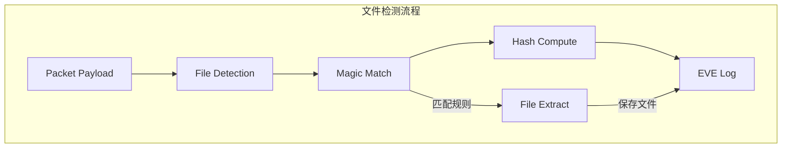

> [!info] Suricata 2026 深度探索系列 0. [[suricata-deep-dive|全栈学习路径总览]]
>
> 1. [[ch1-overview|第一章：Suricata 概述]]
> 2. [[ch2-config|第二章：Suricata 配置系统]]
> 3. [[ch3-runmodes|第三章：Runmodes 运行模式]]
> 4. [[ch4-thread-model|第四章：线程模型]]
> 5. [[ch5-capture|第五章：Capture 初始化]]
> 6. [[ch6-af-packet|第六章：AF-PACKET 接口]]
> 7. [[ch7-pcap|第七章：PCAP 接口]]
> 8. [[ch8-nfq|第八章：NFQ 与 PF_RING 模式]]
> 9. [[ch9-dpdk|第九章：DPDK 接口]]
> 10. [[ch10-loadbalancing|第十章：多线程抓包与负载均衡]]
> 11. [[ch11-detect-engine|第十一章：检测引擎架构]]
> 12. [[ch12-signatures|第十二章：规则解析]]
> 13. [[ch13-mpm|第十三章：多模式匹配]]
> 14. **第十四章：文件识别**

---

## 1. 文件识别概述

Suricata 的文件识别系统负责在网络流量中检测、提取和识别文件。通过分析 HTTP 上传/下载、SMTP 附件等场景中的文件，Suricata 可以：

- **文件类型识别**：通过文件 magic bytes 和文件扩展名
- **文件提取**：将传输的文件保存到磁盘
- **哈希计算**：计算 MD5/SHA1/SHA256 哈希
- **文件告警**：基于文件内容触发告警



---

## 2. file-data 关键字

### 2.1 file-data 规则

```snort
# 检测恶意 EXE 文件下载
alert http any any -> $HOME_NET any (
    msg:"MALWARE Exe file download";
    flow:established,to_client;
    file-data;
    content:"MZ";           # EXE 文件 magic bytes
    offset:0;
    depth:2;
    filetype:executable;
    sid:1000001;
    rev:1;
)

# 检测 PDF 恶意文件
alert http any any -> $HOME_NET any (
    msg:"MALWARE Suspicious PDF";
    flow:established,to_client;
    file-data;
    content:"%PDF";
    filetype:pdf;
    sid:1000002;
    rev:1;
)

# 检测恶意 Office 文档
alert smtp $HOME_NET any -> any any (
    msg:"MALWARE Malicious Office Document";
    flow:established,to_server;
    file-data;
    content:"D0 CF 11 E0";  # OLE compound document magic
    filetype:office;
    sid:1000003;
    rev:1;
)
```

### 2.2 file-data 解析

```c
// src/detect-filedata.c — file-data 数据结构
typedef struct DetectFiledataData_ {
    /* 协议类型 */
    AppProto alproto;                // HTTP/SMTP/DNS 等

    /* 匹配选项 */
    uint8_t flags;
#define FILEDATA_FLAG_GZIP     0x01  # 解压 gzip
#define FILEDATA_FLAG_BZIP2    0x02  # 解压 bzip2
#define FILEDATA_FLAG_ZSTD     0x04  # 解压 zstd
#define FILEDATA_FLAG_RAW      0x08  # 原始数据

    /* 内部状态 */
    bool has_mime;                  // 是否包含 MIME
    bool has_decoded;               // 是否有解码内容
} DetectFiledataData;

// src/detect-filedata.c — file-data 解析
static int ParseFiledata(const char *optstr, Signature *sig)
{
    DetectFiledataData *fd = SCCalloc(1, sizeof(DetectFiledataData));

    /* file-data 可以带参数 */
    if (optstr != NULL && strlen(optstr) > 0) {
        if (strcmp(optstr, "gzip") == 0) {
            fd->flags |= FILEDATA_FLAG_GZIP;
        } else if (strcmp(optstr, "bzip2") == 0) {
            fd->flags |= FILEDATA_FLAG_BZIP2;
        } else if (strcmp(optstr, "zstd") == 0) {
            fd->flags |= FILEDATA_FLAG_ZSTD;
        } else if (strcmp(optstr, "raw") == 0) {
            fd->flags |= FILEDATA_FLAG_RAW;
        }
    }

    /* 设置协议 */
    fd->alproto = AppLayerGetProtocol("http");

    /* 添加到签名 */
    sig->file_flags |= SIG_FLAG_HAS_FILE;
    sig->filedata = fd;

    return 0;
}
```

---

## 3. filetype 关键字

### 3.1 filetype 解析

```c
// src/detect-filetype.c — 文件类型枚举
typedef enum {
    FILE_TYPE_UNKNOWN = 0,
    FILE_TYPE_EXE,                  // PE/EXE
    FILE_TYPE_PDF,                  // PDF
    FILE_TYPE_DOC,                  // MS Office (OLE)
    FILE_TYPE_ZIP,                  // ZIP/Archive
    FILE_TYPE_HTML,                 // HTML
    FILE_TYPE_XML,                  // XML
    FILE_TYPE_SWF,                  // Flash
    FILE_TYPE_JS,                   // JavaScript
    FILE_TYPE_HTTP,                  // HTTP headers
    FILE_TYPE_SMTP,                  // SMTP body
    FILE_TYPE_JAVA,                  // Java class
    FILE_TYPE_SQL,                   // SQL statements
    FILE_TYPE_ELF,                   // Linux executable
    FILE_TYPE_APK,                   // Android APK
    FILE_TYPE_PNG,                   // PNG image
    FILE_TYPE_JPG,                   // JPEG image
    FILE_TYPE_GIF,                   // GIF image
    FILE_TYPE_IRC,                   // IRC
    FILE_TYPE_SMB,                   // SMB
} FileType;

// src/detect-filetype.c — filetype 解析
static int ParseFiletype(const char *optstr, Signature *sig)
{
    FileType type = FILE_TYPE_UNKNOWN;

    if (strcmp(optstr, "exe") == 0 || strcmp(optstr, "pe") == 0) {
        type = FILE_TYPE_EXE;
    } else if (strcmp(optstr, "pdf") == 0) {
        type = FILE_TYPE_PDF;
    } else if (strcmp(optstr, "doc") == 0 || strcmp(optstr, "office") == 0) {
        type = FILE_TYPE_DOC;
    } else if (strcmp(optstr, "zip") == 0 || strcmp(optstr, "archive") == 0) {
        type = FILE_TYPE_ZIP;
    } else if (strcmp(optstr, "html") == 0) {
        type = FILE_TYPE_HTML;
    } else if (strcmp(optstr, "xml") == 0) {
        type = FILE_TYPE_XML;
    }
    // ... 其他类型

    sig->file_type = type;
    sig->file_flags |= SIG_FLAG_FILETYPE;

    return 0;
}
```

---

## 4. 文件容器管理

### 4.1 FileContainer 结构

```c
// src/app-layer-htp.h — 文件容器
typedef struct FileContainer_ {
    /* 文件链表头 */
    File *head;                      // 第一个文件
    File *tail;                      // 最后一个文件
    uint32_t len;                    // 文件数量

    /* 状态 */
    uint8_t flags;
#define FC_ISERROR      0x01        # 有错误
#define FC_DESTROY      0x02        # 需要销毁
} FileContainer;

// src/app-layer-htp.h — 单个文件结构
typedef struct File_ {
    /* 文件标识 */
    uint64_t id;                     # 文件唯一 ID
    char *name;                      # 文件名
    uint8_t *tmp_path;              # 临时文件路径

    /* 文件内容 */
    uint8_t *content;               # 文件内容缓冲区
    uint32_t size;                  # 已接收大小
    uint32_t allocated;             # 缓冲区分配大小
    uint64_t size_limit;           # 文件大小限制

    /* 文件类型 */
    FileType type;                  # 文件类型
    AppProto proto;                 # 所属协议

    /* 哈希 */
    struct {
        uint8_t md5[16];            # MD5 哈希
        uint8_t sha1[20];           # SHA1 哈希
        uint8_t sha256[32];         # SHA256 哈希

        bool md5_set;
        bool sha1_set;
        bool sha256_set;
    } hash;

    /* 状态 */
    uint8_t flags;
#define FILE_NOSTORE       0x01     # 不存储
#define FILE_STORE        0x02     # 存储到磁盘
#define FILE_DETECTED     0x04     # 已检测到
#define FILE_TRUNCATED    0x08     # 被截断
#define FILE_MD5          0x10     # 计算 MD5
#define FILE_SHA1         0x20     # 计算 SHA1
#define FILE_SHA256       0x40     # 计算 SHA256
#define FILE_GZIP         0x80     # Gzip 解压

    /* 链表 */
    struct File_ *next;            # 下一个文件
    struct File_ *prev;            # 上一个文件
} File;
```

### 4.2 文件容器操作

```c
// src/util-file.c — 分配文件容器
FileContainer *FileContainerAlloc(void)
{
    FileContainer *fc = SCCalloc(1, sizeof(FileContainer));
    return fc;
}

// src/util-file.c — 添加文件
File *FileContainerAdd(FileContainer *fc, File *file)
{
    if (fc->tail == NULL) {
        fc->head = fc->tail = file;
    } else {
        fc->tail->next = file;
        file->prev = fc->tail;
        fc->tail = file;
    }
    fc->len++;

    return file;
}

// src/util-file.c — 释放文件容器
void FileContainerFree(FileContainer *fc)
{
    if (fc == NULL) return;

    File *file = fc->head;
    while (file != NULL) {
        File *next = file->next;
        FileFree(file);
        file = next;
    }

    SCFree(fc);
}
```

---

## 5. Magic Bytes 匹配

### 5.1 内置 Magic 签名

```c
// src/util-file.h — 文件 magic 签名
typedef struct FileMagic_ {
    /* Magic 字节 */
    uint8_t *magic;                # Magic 字节序列
    uint16_t maglen;                # Magic 长度

    /* 偏移 */
    int16_t offset;                 # 偏移量 (-1 表示任意)

    /* 文件类型 */
    FileType type;                  # 文件类型

    /* 描述 */
    const char *desc;               # 描述
} FileMagic;

// src/util-file.c — 内置 magic 签名
static FileMagic file_magics[] = {
    /* EXE/PE */
    { (uint8_t *)"MZ", 2, 0, FILE_TYPE_EXE, "PE/EXE" },
    { (uint8_t *)"PE\0\0", 4, 0, FILE_TYPE_EXE, "PE" },

    /* PDF */
    { (uint8_t *)"%PDF", 4, 0, FILE_TYPE_PDF, "PDF" },

    /* Office/OLE */
    { (uint8_t *)"\xD0\xCF\x11\xE0", 4, 0, FILE_TYPE_DOC, "MS Office" },

    /* ZIP */
    { (uint8_t *)"PK\x03\x04", 4, 0, FILE_TYPE_ZIP, "ZIP Archive" },

    /* HTML */
    { (uint8_t *)"<html", 5, 0, FILE_TYPE_HTML, "HTML" },
    { (uint8_t *)"<!DOCTYPE", 9, 0, FILE_TYPE_HTML, "HTML" },

    /* XML */
    { (uint8_t *)"<?xml", 5, 0, FILE_TYPE_XML, "XML" },

    /* PNG */
    { (uint8_t *)"\x89PNG", 4, 0, FILE_TYPE_PNG, "PNG" },

    /* JPEG */
    { (uint8_t *)"\xFF\xD8\xFF", 3, 0, FILE_TYPE_JPG, "JPEG" },

    /* GIF */
    { (uint8_t *)"GIF87a", 6, 0, FILE_TYPE_GIF, "GIF" },
    { (uint8_t *)"GIF89a", 6, 0, FILE_TYPE_GIF, "GIF" },

    /* Java class */
    { (uint8_t *)"\xCA\xFE\xBA\xBE", 4, 0, FILE_TYPE_JAVA, "Java Class" },

    /* ELF */
    { (uint8_t *)"\x7FELF", 4, 0, FILE_TYPE_ELF, "ELF" },

    /* Android APK (ZIP based) */
    { (uint8_t *)"PK\x03\x04", 4, 0, FILE_TYPE_APK, "Android APK" },

    /* Gzip */
    { (uint8_t *)"\x1F\x8B", 2, 0, FILE_TYPE_GZIP, "Gzip" },

    { NULL, 0, 0, FILE_TYPE_UNKNOWN, NULL }
};
```

### 5.2 Magic 匹配函数

```c
// src/util-file.c — Magic 匹配
FileType FileMagicMatch(File *file, const uint8_t *buffer, uint32_t buffer_len)
{
    /* 遍历所有 magic 签名 */
    for (FileMagic *fm = file_magics; fm->magic != NULL; fm++) {
        /* 检查偏移 */
        uint32_t start = 0;
        if (fm->offset >= 0) {
            start = fm->offset;
        }

        /* 检查长度是否足够 */
        if (start + fm->maglen > buffer_len) {
            continue;
        }

        /* 比较 magic 字节 */
        if (memcmp(buffer + start, fm->magic, fm->maglen) == 0) {
            /* 匹配成功 */
            file->type = fm->type;
            file->flags |= FILE_DETECTED;

            SCLogDebug("File type detected: %s", fm->desc);
            return fm->type;
        }
    }

    return FILE_TYPE_UNKNOWN;
}
```

---

## 6. 文件提取

### 6.1 文件存储配置

```yaml
# suricata.yaml
outputs:
  -eve-log:
    types:
      - files:
          # 记录文件日志
          enabled: yes

          # 文件存储目录
          store-directory: /var/log/suricata/files

          # 是否存储文件内容
          store: yes

          # 是否计算哈希
          compute-md5: yes
          compute-sha1: yes
          compute-sha256: no

          # 文件大小限制
          size-limit: 100mb

          # 特定文件类型存储
          include-files:
            - exe
            - pdf
            - doc
            - zip

          # 排除的文件类型
          # exclude-files:
          #   - png
          #   - jpg
```

### 6.2 文件存储流程

```c
// src/util-file.c — 文件数据处理
int FileDataProcess(File *file, const uint8_t *data, uint32_t data_len)
{
    /* 检查文件大小限制 */
    if (file->size + data_len > file->size_limit) {
        /* 截断文件 */
        file->flags |= FILE_TRUNCATED;
        data_len = file->size_limit - file->size;
    }

    /* 扩展缓冲区 */
    if (file->size + data_len > file->allocated) {
        uint32_t new_size = file->size + data_len + 4096;
        file->content = SCRealloc(file->content, new_size);
        file->allocated = new_size;
    }

    /* 复制数据 */
    memcpy(file->content + file->size, data, data_len);
    file->size += data_len;

    /* 更新哈希 */
    if (file->flags & FILE_MD5) {
        MdfHashUpdate(file->hash.md5, data, data_len);
    }
    if (file->flags & FILE_SHA1) {
        Sha1HashUpdate(file->hash.sha1, data, data_len);
    }
    if (file->flags & FILE_SHA256) {
        Sha256HashUpdate(file->hash.sha256, data, data_len);
    }

    /* Magic 检测（仅在文件开始时）*/
    if (file->size <= 32 && !(file->flags & FILE_DETECTED)) {
        FileMagicMatch(file, file->content, file->size);
    }

    return 0;
}
```

### 6.3 文件持久化

```c
// src/util-file.c — 文件保存到磁盘
int FileSaveToDisk(File *file)
{
    if (file == NULL || !(file->flags & FILE_STORE)) {
        return -1;
    }

    /* 生成文件名 */
    char filename[256];
    if (file->name != NULL) {
        snprintf(filename, sizeof(filename), "%s.%lu",
                 file->name, file->id);
    } else {
        snprintf(filename, sizeof(filename), "file.%lu", file->id);
    }

    /* 生成完整路径 */
    char filepath[512];
    snprintf(filepath, sizeof(filepath), "%s/%s",
             file->path, filename);

    /* 写入文件 */
    FILE *fp = fopen(filepath, "wb");
    if (fp == NULL) {
        SCLogError("Failed to open file for writing: %s", filepath);
        return -1;
    }

    fwrite(file->content, 1, file->size, fp);
    fclose(fp);

    /* 更新临时路径 */
    file->tmp_path = SCStrdup(filepath);

    SCLogInfo("File saved: %s (size=%u)", filepath, file->size);

    return 0;
}
```

---

## 7. 哈希计算

### 7.1 哈希初始化与完成

```c
// src/util-file.h — 哈希上下文
typedef struct FileHash_ {
    Mdhash *md5_ctx;                // MD5 上下文
    Sha1Context *sha1_ctx;          // SHA1 上下文
    Sha256Context *sha256_ctx;      // SHA256 上下文
} FileHash;

// src/util-file.c — 初始化哈希
void FileHashInit(File *file)
{
    if (file->flags & FILE_MD5) {
        file->hash.md5_ctx = SCMd5New();
    }
    if (file->flags & FILE_SHA1) {
        file->hash.sha1_ctx = SCSha1New();
    }
    if (file->flags & FILE_SHA256) {
        file->hash.sha256_ctx = SCSha256New();
    }
}

// src/util-file.c — 完成哈希
void FileHashFinish(File *file)
{
    if (file->flags & FILE_MD5 && file->hash.md5_ctx) {
        SCMd5Finalize(file->hash.md5, file->hash.md5_ctx);
        file->hash.md5_set = true;
        SCMd5Free(file->hash.md5_ctx);
    }
    if (file->flags & FILE_SHA1 && file->hash.sha1_ctx) {
        SCSha1Finalize(file->hash.sha1, file->hash.sha1_ctx);
        file->hash.sha1_set = true;
        SCSha1Free(file->hash.sha1_ctx);
    }
    if (file->flags & FILE_SHA256 && file->hash.sha256_ctx) {
        SCSha256Finalize(file->hash.sha256, file->hash.sha256_ctx);
        file->hash.sha256_set = true;
        SCSha256Free(file->hash.sha256_ctx);
    }
}
```

### 7.2 哈希格式化输出

```c
// src/util-file.c — 哈希转字符串
void FileHashToString(File *file, char *md5_str, char *sha1_str, char *sha256_str)
{
    if (md5_str && file->hash.md5_set) {
        PrintHex(md5_str, file->hash.md5, 16);
    }
    if (sha1_str && file->hash.sha1_set) {
        PrintHex(sha1_str, file->hash.sha1, 20);
    }
    if (sha256_str && file->hash.sha256_set) {
        PrintHex(sha256_str, file->hash.sha256, 32);
    }
}
```

---

## 8. HTTP 文件传输检测

### 8.1 HTTP 文件处理流程

```c
// src/app-layer-htp.c — HTTP 文件处理
int HTPFileProcess(htp_tx_t *tx, const uint8_t *data, uint32_t data_len)
{
    /* 获取文件容器 */
    FileContainer *fc = tx->files;
    if (fc == NULL) {
        fc = FileContainerAlloc();
        tx->files = fc;
    }

    /* 获取或创建当前文件 */
    File *file = NULL;
    if (fc->tail != NULL && !(fc->tail->flags & FILE_STORE)) {
        file = fc->tail;
    } else {
        /* 创建新文件 */
        file = FileNew();
        FileContainerAdd(fc, file);
    }

    /* 处理文件数据 */
    FileDataProcess(file, data, data_len);

    return 0;
}
```

### 8.2 HTTP 文件名提取

```c
// src/app-layer-htp.c — 提取文件名
void HTPFileSetFilename(htp_tx_t *tx, const char *filename)
{
    if (tx->files != NULL && tx->files->tail != NULL) {
        File *file = tx->files->tail;

        if (file->name != NULL) {
            SCFree(file->name);
        }

        file->name = SCStrdup(filename);

        /* 根据扩展名推测类型 */
        const char *ext = strrchr(filename, '.');
        if (ext != NULL) {
            ext++;
            file->type = FileExtensionGuess(ext);
        }
    }
}
```

---

## 9. 文件日志 EVE 输出

### 9.1 EVE 文件日志格式

```json
{
  "timestamp": "2026-04-15T10:30:00.000000Z",
  "event_type": "fileinfo",
  "fileinfo": {
    "sid": [1000001],
    "version": "2",
    "stored": true,
    "size": 458752,
    "filename": "/malware/payload.exe",
    "file_type": "PE/EXE",
    "md5": "d41d8cd98f00b204e9800998ecf8427e",
    "sha1": "da39a3ee5e6b4b0d3255bfef95601890afd80709",
    "sha256": "e3b0c44298fc1c149afbf4c8996fb92427ae41e4649b934ca495991b7852b855",
    "gaps": false,
    "state": "established",
    "md5hex": "d41d8cd98f00b204e9800998ecf8427e",
    "sha1hex": "da39a3ee5e6b4b0d3255bfef95601890afd80709",
    "sha256hex": "e3b0c44298fc1c149afbf4c8996fb92427ae41e4649b934ca495991b7852b855",
    "magic_id": "PE/EXE",
    "app_proto": "http",
    "direction": "to_client",
    "dns": {
      "rrname": "example.com",
      "rrtype": "A"
    }
  }
}
```

### 9.2 文件日志源码

```c
// src/output-eve.c — EVE 文件日志
static int EVEFileInfoJson(JsonOut *js, File *file)
{
    EveJson *ej = (EveJson *)js;

    JsonStartObject(ej->js, "fileinfo");

    /* 基本信息 */
    JsonAddString(ej->js, "filename", file->name);
    JsonAddUint(ej->js, "size", file->size);

    /* 文件类型 */
    if (file->type != FILE_TYPE_UNKNOWN) {
        JsonAddString(ej->js, "file_type", FileTypeToString(file->type));
    }

    /* Magic 类型 */
    if (file->flags & FILE_DETECTED) {
        JsonAddString(ej->js, "magic_id", FileTypeToString(file->type));
    }

    /* 哈希 */
    if (file->hash.md5_set) {
        char md5_str[33];
        FileHashToString(file, md5_str, NULL, NULL);
        JsonAddString(ej->js, "md5", md5_str);
        JsonAddString(ej->js, "md5hex", md5_str);
    }
    if (file->hash.sha1_set) {
        char sha1_str[41];
        FileHashToString(file, NULL, sha1_str, NULL);
        JsonAddString(ej->js, "sha1", sha1_str);
        JsonAddString(ej->js, "sha1hex", sha1_str);
    }
    if (file->hash.sha256_set) {
        char sha256_str[65];
        FileHashToString(file, NULL, NULL, sha256_str);
        JsonAddString(ej->js, "sha256", sha256_str);
        JsonAddString(ej->js, "sha256hex", sha256_str);
    }

    /* 存储状态 */
    if (file->flags & FILE_STORE) {
        JsonAddBool(ej->js, "stored", true);
        if (file->tmp_path != NULL) {
            JsonAddString(ej->js, "path", file->tmp_path);
        }
    }

    /* 截断状态 */
    if (file->flags & FILE_TRUNCATED) {
        JsonAddBool(ej->js, "truncated", true);
    }

    JsonEndObject(ej->js);

    return 0;
}
```

---

## 10. 配置 → 源码映射表

|| YAML 配置 | C 变量 | 源文件 | 说明 ||
|| :--- | :--- | :--- | :--- ||
|| `outputs.eve-log.types.files` | `FileContainer` | `output-eve.c` | 文件日志开关 ||
|| `files.store-directory` | `file->path` | `util-file.c` | 存储目录 ||
|| `files.store` | `FILE_STORE` | `util-file.c` | 存储标志 ||
|| `files.compute-md5` | `FILE_MD5` | `util-file.c` | MD5 计算 ||
|| `files.compute-sha1` | `FILE_SHA1` | `util-file.c` | SHA1 计算 ||
|| `files.size-limit` | `file->size_limit` | `util-file.c` | 文件大小限制 ||
|| `file-data` | `DetectFiledataData` | `detect-filedata.c` | 文件数据检测 ||
|| `filetype` | `FileType` | `detect-filetype.c` | 文件类型关键字 ||

---

## 11. 小结

本章深入解析了 Suricata 的文件识别系统：

1. **file-data 关键字**：触发对文件数据的检测，支持 gzip/bzip2/zstd 解压
2. **filetype 关键字**：基于文件 magic bytes 识别文件类型（PE/PDF/ZIP/HTML 等）
3. **FileContainer**：管理文件链表，支持添加、删除、遍历操作
4. **Magic 匹配**：内置文件 magic 签名库，通过字节序列匹配识别文件类型
5. **文件提取**：将传输的文件保存到磁盘，支持大小限制和存储目录配置
6. **哈希计算**：支持 MD5/SHA1/SHA256 哈希，用于文件指纹识别
7. **EVE 文件日志**：以结构化 JSON 格式输出文件元数据和哈希

下一章我们将深入 **Lua 检测（Lua Detection）**，解析 Suricata 如何通过 LuaJIT 集成实现自定义高级检测逻辑。
