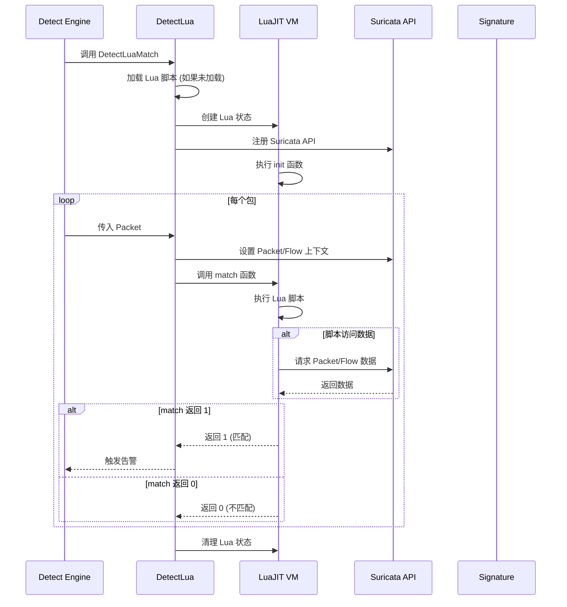

> [!info] Suricata 2026 深度探索系列 0. [[suricata-deep-dive|全栈学习路径总览]]
>
> 1. [[ch1-overview|第一章：Suricata 概述]]
> 2. [[ch2-config|第二章：Suricata 配置系统]]
> 3. [[ch3-runmodes|第三章：Runmodes 运行模式]]
> 4. [[ch4-thread-model|第四章：线程模型]]
> 5. [[ch5-capture|第五章：Capture 初始化]]
> 6. [[ch6-af-packet|第六章：AF-PACKET 接口]]
> 7. [[ch7-pcap|第七章：PCAP 接口]]
> 8. [[ch8-nfq|第八章：NFQ 与 PF_RING 模式]]
> 9. [[ch9-dpdk|第九章：DPDK 接口]]
> 10. [[ch10-loadbalancing|第十章：多线程抓包与负载均衡]]
> 11. [[ch11-detect-engine|第十一章：检测引擎架构]]
> 12. [[ch12-signatures|第十二章：规则解析]]
> 13. [[ch13-mpm|第十三章：多模式匹配]]
> 14. [[ch14-filemagic|第十四章：文件识别]]
> 15. **第十五章：Lua 检测**

---

## 1. Lua 检测概述

Suricata 的 Lua 检测系统允许用户使用 **Lua/LuaJIT** 脚本编写自定义检测逻辑。与传统规则的关键字匹配不同，Lua 脚本可以：

- **复杂逻辑**：条件判断、循环、字符串处理
- **协议解析**：手动解析自定义协议格式
- **数据关联**：跨多个字段或 Flow 进行关联分析
- **外部查询**：查询外部数据源（DNS、Redis 等）
- **动态检测**：基于运行时状态调整检测策略

```mermaid
graph TD
    subgraph "传统规则匹配"
        C1["content:\"abc\""]
        C2["pcre:\"/[0-9]+/\""]
    end

    subgraph "Lua 检测"
        L1["Lua 脚本"]
        L2["LuaJIT VM"]
        L3["检测 API"]
    end

    subgraph "优势"
        A1["复杂逻辑"]
        A2["协议解析"]
        A3["数据关联"]
    end

    L1 --> L2
    L2 --> L3
    L3 --> A1
    L3 --> A2
    L3 --> A3
```

### 1.1 Lua vs 传统规则

|| 特性 | 传统规则 | Lua 检测 ||
|| :--- | :--- | :--- ||
|| **表达能力** | 简单模式匹配 | 完整编程语言 ||
|| **性能** | 高（编译优化） | 中（解释执行） ||
|| **协议解析** | 关键字组合 | 手动解析 ||
|| **适用场景** | 已知攻击模式 | 复杂/自定义协议 ||
|| **学习曲线** | 低 | 中等 ||

---

## 2. lua 关键字

### 2.1 lua 规则语法

```snort
# 基础 Lua 检测规则
alert http any any -> $HOME_NET any (
    msg:"LUA Script Example";
    lua.scriptfile: /etc/suricata/lua/test.lua;
    sid:2000001;
    rev:1;
)

# 带有参数的 Lua 检测
alert tcp any any -> any any (
    msg:"LUA Advanced Detection";
    lua.scriptfile: /etc/suricata/lua/advanced.lua;
    lua.scriptparams: "threshold=100,timeout=60";
    sid:2000002;
    rev:1;
)
```

### 2.2 lua 解析

```c
// src/detect-lua.c — lua 数据结构
typedef struct DetectLuaData_ {
    /* Lua 脚本路径 */
    char *filename;                 // 脚本文件名

    /* Lua 脚本内容（如果内联）*/
    char *script;                   // 内联脚本
    size_t script_len;              // 脚本长度

    /* 脚本参数 */
    char *script_params;           // 参数

    /* Lua 状态 */
    lua_State *lua_state;           // LuaJIT 虚拟机

    /* 标志位 */
    uint8_t flags;
#define LUA_FLAG_FILEDATA    0x01  // 检测 file-data
#define LUA_FLAG_PAYLOAD     0x02  // 检测 payload
#define LUA_FLAG_STREAM      0x04  // 检测 stream
#define LUA_FLAG_HTTP_BODY   0x08  // 检测 HTTP body

    /* 中断标志 */
    bool interrupted;               // 中断标志

    /* 匹配结果 */
    int match_result;             // 匹配结果 (0/1)
} DetectLuaData;
```

### 2.3 lua 解析函数

```c
// src/detect-lua.c — lua 解析
static int ParseLua(const char *optstr, Signature *sig)
{
    DetectLuaData *ld = SCCalloc(1, sizeof(DetectLuaData));

    /* 解析 "lua.scriptfile:/path/to/script.lua" */
    const char *colon = strchr(optstr, ':');
    if (colon != NULL) {
        size_t key_len = colon - optstr;
        char *key = SCStrndup(optstr, key_len);
        char *value = SCStrdup(colon + 1);

        if (strcmp(key, "lua.scriptfile") == 0) {
            ld->filename = value;
        } else if (strcmp(key, "lua.script") == 0) {
            ld->script = value;
        } else if (strcmp(key, "lua.scriptparams") == 0) {
            ld->script_params = value;
        }

        SCFree(key);
    }

    /* 设置检测标志 */
    ld->flags |= LUA_FLAG_PAYLOAD;

    /* 添加到签名 */
    sig->lua = ld;
    sig->flags |= SIG_FLAG_LUA;

    return 0;
}
```

---

## 3. LuaJIT 集成

### 3.1 LuaJIT vs Lua 5.1

Suricata 使用 **LuaJIT** 而非标准 Lua，因为 LuaJIT 提供：

| 特性         | Lua 5.1 | LuaJIT         |
| :----------- | :------ | :------------- |
| **JIT 编译** | ❌      | ✅ x86/x64 ARM |
| **执行速度** | 慢      | 快 10-50x      |
| **FFI 接口** | ❌      | ✅ C 调用      |
| **内存占用** | 中      | 低             |

### 3.2 LuaJIT 初始化

```c
// src/util-lua.c — LuaJIT 初始化
lua_State *LuaJitInit(void)
{
    /* 创建 LuaJIT 状态 */
    lua_State *L = luaL_newstate();
    if (L == NULL) {
        SCLogError("Failed to create LuaJIT state");
        return NULL;
    }

    /* 加载基础库 */
    luaL_openlibs(L);

    /* 注册 Suricata API */
    LuaRegisterFunctions(L);

    return L;
}

// src/util-lua.c — 注册 Suricata API
void LuaRegisterFunctions(lua_State *L)
{
    /* Packet 信息 */
    lua_register(L, "SCFlow", LuaGetFlow);
    lua_register(L, "SCPacketPayload", LuaGetPayload);
    lua_register(L, "SCPacketPayloadLen", LuaGetPayloadLen);
    lua_register(L, "SCPacketSrcIP", LuaGetSrcIP);
    lua_register(L, "SCPacketDstIP", LuaGetDstIP);
    lua_register(L, "SCPacketSrcPort", LuaGetSrcPort);
    lua_register(L, "SCPacketDstPort", LuaGetDstPort);
    lua_register(L, "SCPacketProto", LuaGetProto);

    /* Flow 信息 */
    lua_register(L, "SCFlowSrcIP", LuaFlowGetSrcIP);
    lua_register(L, "SCFlowDstIP", LuaFlowGetDstIP);
    lua_register(L, "SCFlowAge", LuaFlowGetAge);
    lua_register(L, "SCFlowState", LuaFlowGetState);

    /* AppLayer 数据 */
    lua_register(L, "SCHTTPHost", LuaHTTPGetHost);
    lua_register(L, "SCHTTPUri", LuaHTTPGetUri);
    lua_register(L, "SCHTTPUserAgent", LuaHTTPGetUserAgent);
    lua_register(L, "SCHTTPMethod", LuaHTTPGetMethod);

    /* 文件数据 */
    lua_register(L, "SCFileName", LuaFileGetName);
    lua_register(L, "SCFileSize", LuaFileGetSize);
    lua_register(L, "SCFileMd5", LuaFileGetMd5);

    /* 输出函数 */
    lua_register(L, "SCDetect", LuaSetMatch);
    lua_register(L, "SCWarning", LuaPrintWarning);
    lua_register(L, "SCInfo", LuaPrintInfo);
}
```

---

## 4. 检测 API

### 4.1 Packet 信息获取

```c
// src/util-lua.c — 获取 Packet payload
static int LuaGetPayload(lua_State *L)
{
    /* 检查参数 */
    int argc = lua_gettop(L);
    if (argc != 0) {
        lua_pushstring(L, "Usage: SCPacketPayload()");
        return lua_error(L);
    }

    /* 获取当前 packet */
    Packet *p = LuaGetPacket(L);
    if (p == NULL) {
        return 0;
    }

    /* 返回 payload */
    lua_pushlstring(L, (const char *)p->payload, p->payload_len);

    return 1;
}

// src/util-lua.c — 获取源 IP
static int LuaGetSrcIP(lua_State *L)
{
    Packet *p = LuaGetPacket(L);
    if (p == NULL) {
        return 0;
    }

    char ip_str[46];
    if (PKT_IS_IPV4(p)) {
        PrintInet(AF_INET, &p->src, ip_str, sizeof(ip_str));
    } else {
        PrintInet(AF_INET6, &p->src, ip_str, sizeof(ip_str));
    }

    lua_pushstring(L, ip_str);
    return 1;
}
```

### 4.2 Flow 信息获取

```c
// src/util-lua.c — 获取 Flow 信息
static int LuaFlowGetAge(lua_State *L)
{
    Flow *f = LuaGetFlow(L);
    if (f == NULL) {
        return 0;
    }

    /* 计算 Flow 年龄 */
    struct timeval now;
    gettimeofday(&now, NULL);

    uint64_t age = (now.tv_sec - f->lastts.tv_sec) * 1000 +
                   (now.tv_usec - f->lastts.tv_usec) / 1000;

    lua_pushnumber(L, age);
    return 1;
}

// src/util-lua.c — 获取 Flow 状态
static int LuaFlowGetState(lua_State *L)
{
    Flow *f = LuaGetFlow(L);
    if (f == NULL) {
        return 0;
    }

    const char *state = "unknown";
    switch (f->flow_state) {
        case FLOW_STATE_NEW:
            state = "new";
            break;
        case FLOW_STATE_ESTABLISHED:
            state = "established";
            break;
        case FLOW_STATE_CLOSED:
            state = "closed";
            break;
    }

    lua_pushstring(L, state);
    return 1;
}
```

### 4.3 HTTP 数据获取

```c
// src/util-lua.c — 获取 HTTP URI
static int LuaHTTPGetUri(lua_State *L)
{
    HtpState *htp_state = LuaGetHtpState(L);
    if (htp_state == NULL) {
        return 0;
    }

    htp_tx_t *tx = htp_state->tx;
    if (tx == NULL) {
        return 0;
    }

    /* 获取 URI */
    bstr *uri = tx->request_uri;
    if (uri == NULL) {
        return 0;
    }

    lua_pushlstring(L, bstr_ptr(uri), bstr_len(uri));
    return 1;
}

// src/util-lua.c — 获取 Host
static int LuaHTTPGetHost(lua_State *L)
{
    HtpState *htp_state = LuaGetHtpState(L);
    if (htp_state == NULL) {
        return 0;
    }

    htp_tx_t *tx = htp_state->tx;
    if (tx == NULL || tx->request_hostname == NULL) {
        return 0;
    }

    lua_pushlstring(L,
                    bstr_ptr(tx->request_hostname),
                    bstr_len(tx->request_hostname));
    return 1;
}
```

---

## 5. Lua 脚本示例

### 5.1 基础 HTTP 检测

```lua
-- /etc/suricata/lua/detect_http.lua

-- 检测函数必须返回 1 表示匹配，0 表示不匹配
function init(args)
    return 1
end

function match(args)
    -- 获取 HTTP URI
    local uri = SCPacketUri()
    if uri == nil then
        return 0
    end

    -- 获取 HTTP Host
    local host = SCPacketHttpHost()

    -- 检测可疑 URI 模式
    if string.find(uri, "/admin") then
        if host and string.find(host, "suspicious.com") then
            return 1
        end
    end

    return 0
end
```

### 5.2 DNS 查询检测

```lua
-- /etc/suricata/lua/detect_dns.lua

function match(args)
    -- 获取 DNS 查询类型
    local dns_type = SCDNSQueryType()
    local dns_name = SCDNSQueryName()

    if dns_name == nil then
        return 0
    end

    -- 检测 DNS 查询类型
    if dns_type == "A" then
        -- 检测可疑域名的 DNS 查询
        if string.find(dns_name, "malware%.cnn") or
           string.find(dns_name, "phishing%.bank") then
            return 1
        end
    elseif dns_type == "AAAA" then
        -- IPv6 查询
        if string.find(dns_name, "ipv6%-test") then
            return 1
        end
    end

    return 0
end
```

### 5.3 文件哈希检测

```lua
-- /etc/suricata/lua/detect_file_hash.lua

-- 白名单哈希列表
local whitelist = {
    ["d41d8cd98f00b204e9800998ecf8427e"] = true,  -- 空文件 MD5
    ["da39a3ee5e6b4b0d3255bfef95601890afd80709"] = true,  -- SHA1
}

function match(args)
    -- 获取文件 MD5
    local md5 = SCFileMd5()
    if md5 == nil then
        return 0
    end

    -- 检查白名单
    if whitelist[md5] then
        return 0
    end

    -- 检测已知的恶意哈希
    local malware_hashes = {
        ["ac4c7d2e15b1f1c1c1c1c1c1c1c1c1c1"] = "Ransomware payload",
        ["b1a2c3d4e5f6a1b2c3d4e5f6a1b2c3d4"] = "Backdoor trojan",
    }

    if malware_hashes[md5] then
        print("Malware detected: " .. malware_hashes[md5])
        return 1
    end

    return 0
end
```

### 5.4 TLS 证书检测

```lua
-- /etc/suricata/lua/detect_tls_cert.lua

function match(args)
    -- 获取 TLS 证书信息
    local cert_subject = SCTLSCertSubject()
    local cert_issuer = SCTLSCertIssuer()
    local cert_fingerprint = SCTLSCertFingerprint()

    if cert_subject == nil then
        return 0
    end

    -- 检测自签名证书
    if cert_subject == cert_issuer then
        -- 自签名证书可能是可疑的
        if string.find(cert_subject, "localhost") or
           string.find(cert_subject, "test") then
            return 1
        end
    end

    -- 检测已知的不良证书
    local bad_certs = {
        ["11:22:33:44:55:66:77:88:99:AA:BB:CC:DD:EE:FF:00"] = "Compromised CA",
    }

    if bad_certs[cert_fingerprint] then
        return 1
    end

    return 0
end
```

### 5.5 复杂协议解析

```lua
-- /etc/suricata/lua/detect_custom_protocol.lua

function match(args)
    -- 获取完整 payload
    local payload = SCPacketPayload()
    local payload_len = SCPacketPayloadLen()

    if payload_len < 8 then
        return 0
    end

    -- 解析自定义协议头
    -- 格式: [1字节命令][2字节长度][4字节序列号][数据]
    local cmd = string.byte(payload, 1)
    local len = string.byte(payload, 2) * 256 + string.byte(payload, 3)
    local seq = string.byte(payload, 4) * 16777216 +
                string.byte(payload, 5) * 65536 +
                string.byte(payload, 6) * 256 +
                string.byte(payload, 7)

    -- 检测命令类型
    if cmd == 0x01 then
        -- 心跳包
        if len > 1000 then
            return 1  -- 异常大的心跳
        end
    elseif cmd == 0x02 then
        -- 数据包
        if payload_len ~= len + 7 then
            return 1  -- 长度不匹配
        end
    elseif cmd == 0xFF then
        -- 控制包
        return 1  -- 可能是恶意控制流量
    end

    return 0
end
```

---

## 6. Lua 检测执行流程

### 6.1 Lua 检测流水线



### 6.2 Lua 检测实现

```c
// src/detect-lua.c — Lua 检测执行
static int DetectLuaMatch(DetectEngineThreadCtx *det_ctx,
                          Signature *sig, Packet *p)
{
    DetectLuaData *ld = sig->lua;
    if (ld == NULL) {
        return 0;
    }

    /* 加载 Lua 脚本 */
    if (ld->lua_state == NULL) {
        ld->lua_state = LuaJitInit();
        if (ld->lua_state == NULL) {
            return 0;
        }

        /* 加载脚本 */
        if (ld->filename != NULL) {
            if (luaL_dofile(ld->lua_state, ld->filename) != 0) {
                SCLogError("Failed to load Lua script: %s",
                           lua_tostring(ld->lua_state, -1));
                return 0;
            }
        } else if (ld->script != NULL) {
            if (luaL_dostring(ld->lua_state, ld->script) != 0) {
                SCLogError("Failed to execute Lua script: %s",
                           lua_tostring(ld->lua_state, -1));
                return 0;
            }
        }

        /* 调用 init 函数 */
        lua_getglobal(ld->lua_state, "init");
        if (lua_isfunction(ld->lua_state, -1)) {
            lua_call(ld->lua_state, 0, 1);
            lua_pop(ld->lua_state, 1);
        }
    }

    /* 设置 Packet/Flow 上下文 */
    LuaSetPacket(ld->lua_state, p);
    if (p->flow != NULL) {
        LuaSetFlow(ld->lua_state, p->flow);
    }

    /* 调用 match 函数 */
    lua_getglobal(ld->lua_state, "match");
    if (!lua_isfunction(ld->lua_state, -1)) {
        SCLogError("Lua script missing match function");
        return 0;
    }

    /* 执行 match */
    if (lua_pcall(ld->lua_state, 0, 1, 0) != 0) {
        SCLogError("Lua match error: %s", lua_tostring(ld->lua_state, -1));
        return 0;
    }

    /* 获取返回值 */
    int result = lua_tointeger(ld->lua_state, -1);
    lua_pop(ld->lua_state, 1);

    return result;
}
```

---

## 7. Lua 配置

### 7.1 全局 Lua 配置

```yaml
# suricata.yaml
detect:
  lua:
    # 是否启用 Lua 检测
    enabled: yes

    # Lua 脚本目录
    scripts-dir: /etc/suricata/lua/

    # 最大执行时间 (毫秒)
    # 防止恶意脚本死循环
    max-timeout: 100

    # 最大内存使用 (MB)
    # 防止内存泄漏
    max-memory: 64
```

### 7.2 脚本目录结构

```bash
/etc/suricata/lua/
├── README.md
├── detect_http.lua          # HTTP 检测脚本
├── detect_dns.lua           # DNS 检测脚本
├── detect_tls.lua           # TLS 检测脚本
├── detect_file_hash.lua     # 文件哈希检测
├── detect_custom_proto.lua   # 自定义协议检测
└── helpers/
    ├── utils.lua            # 工具函数
    ├── whitelist.lua        # 白名单管理
    └── reputation.lua       # 信誉查询
```

---

## 8. 性能优化

### 8.1 Lua 脚本性能考虑

```lua
-- 性能优化示例

-- ❌ 避免: 每次都编译正则
function bad_match(args)
    local pattern = "malware"  -- 每次都重新创建
    if string.find(payload, pattern) then
        return 1
    end
end

-- ✅ 推荐: 预编译正则
local compiled_pattern = RE2.new("malware|ransomware|trojan")

function good_match(args)
    if compiled_pattern:match(payload) then
        return 1
    end
end

-- ❌ 避免: 大循环
function slow_match(args)
    for i = 1, 1000000 do
        if i == #payload then
            return 1
        end
    end
end

-- ✅ 推荐: 使用内置函数
function fast_match(args)
    if #payload > 1000000 then
        return 1
    end
end
```

### 8.2 内存管理

```lua
-- 内存优化示例

-- ❌ 避免: 大量字符串拼接
function wasteful_match(args)
    local result = ""
    for i = 1, 1000 do
        result = result .. "data"
    end
    return 0
end

-- ✅ 推荐: 使用 table 替代
function efficient_match(args)
    local t = {}
    for i = 1, 1000 do
        t[#t + 1] = "data"
    end
    return 0
end
```

---

## 9. 调试 Lua 脚本

### 9.1 调试技巧

```lua
-- 使用 print 输出调试信息
function match(args)
    print("=== Lua Debug ===")
    print("Packet len: " .. tostring(SCPacketPayloadLen()))
    print("Src IP: " .. tostring(SCPacketSrcIP()))
    print("Dst Port: " .. tostring(SCPacketDstPort()))

    local payload = SCPacketPayload()
    if payload then
        print("Payload (hex): " .. tohex(payload))
    end

    return 0
end

-- 使用 pcall 捕获错误
function safe_match(args)
    local ok, err = pcall(function()
        -- 可能出错的代码
        local payload = SCPacketPayload()
        if #payload > 1000 then
            error("Payload too large")
        end
    end)

    if not ok then
        print("Error in Lua script: " .. tostring(err))
        return 0
    end

    return 1
end
```

### 9.2 Suricata 日志级别

```bash
# 启用调试日志
suricata -v -l /var/log/suricata/ -c /etc/suricata/suricata.yaml

# 或在 suricata.yaml 中设置
logging:
  default-log-level: debug
  outputs:
    - console:
        enabled: yes
        log-level: debug
```

---

## 10. 配置 → 源码映射表

|| YAML 配置 | C 变量 | 源文件 | 说明 ||
|| :--- | :--- | :--- | :--- ||
|| `detect.lua.enabled` | `lua_enabled` | `detect-lua.c` | Lua 检测开关 ||
|| `detect.lua.scripts-dir` | `lua_scripts_dir` | `detect-lua.c` | 脚本目录 ||
|| `detect.lua.max-timeout` | `lua_max_timeout` | `detect-lua.c` | 最大超时 ||
|| `lua.scriptfile` | `DetectLuaData.filename` | `detect-lua.c` | 脚本路径 ||
|| `lua.script` | `DetectLuaData.script` | `detect-lua.c` | 内联脚本 ||
|| `lua.scriptparams` | `DetectLuaData.params` | `detect-lua.c` | 脚本参数 ||

---

## 11. 小结

本章深入解析了 Suricata 的 Lua 检测系统：

1. **lua 关键字**：在规则中引用 Lua 脚本，实现复杂检测逻辑
2. **LuaJIT 集成**：使用 LuaJIT 虚拟机执行脚本，提供 JIT 编译加速
3. **检测 API**：提供 Packet/Flow/HTTP/TLS/File 等数据的访问接口
4. **脚本示例**：HTTP 检测、DNS 检测、文件哈希、TLS 证书、自定义协议解析
5. **性能优化**：避免重复编译正则、使用 table 替代字符串拼接、设置超时限制
6. **调试技巧**：使用 print 输出、使用 pcall 捕获错误

至此，**Part III: Detection Engine（检测引擎）**的五章内容已全部完成：

- **第 11 章**：检测引擎架构 — Detect 工作流程、SigGroupBuild、匹配流水线
- **第 12 章**：规则解析 — Signature 解析流程、关键字注册、Snort 兼容语法
- **第 13 章**：多模式匹配 — AC/Bm/Hyperscan 算法原理与源码实现
- **第 14 章**：文件识别 — file-data、magic 匹配、文件提取、哈希计算
- **第 15 章**：Lua 检测 — LuaJIT 集成、检测 API、自定义 Lua 脚本

后续章节将继续深入 **Part IV: 协议解析** 和其他高级话题。
