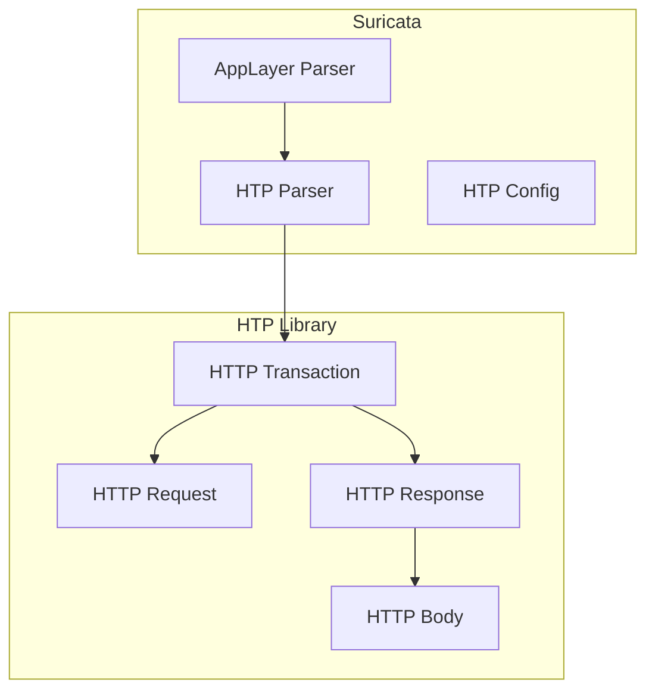
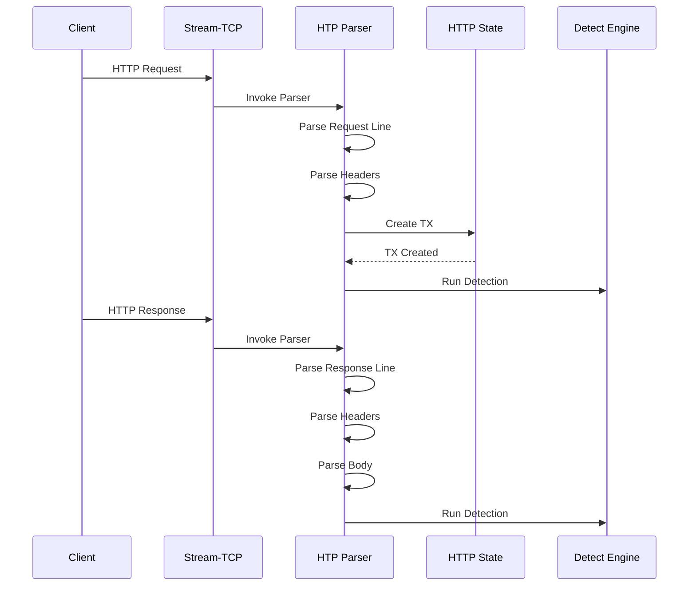

> [!info] Suricata 2026 深度探索系列 0. [[suricata-deep-dive|全栈学习路径总览]]
>
> 1. [[ch1-overview|第一章：Suricata 概述]]
> 2. [[ch2-config|第二章：Suricata 配置系统]]
> 3. [[ch3-runmodes|第三章：Runmodes 运行模式]]
> 4. [[ch4-thread-model|第四章：线程模型]]
> 5. [[ch5-capture|第五章：Capture 初始化]]
> 6. [[ch6-af-packet|第六章：AF-PACKET 接口]]
> 7. [[ch7-pcap|第七章：PCAP 接口]]
> 8. [[ch8-nfq|第八章：NFQ 与 PF_RING 模式]]
> 9. [[ch9-dpdk|第九章：DPDK 接口]]
> 10. [[ch10-loadbalancing|第十章：多线程抓包与负载均衡]]
> 11. [[ch11-detect-engine|第十一章：检测引擎架构]]
> 12. [[ch12-signatures|第十二章：规则解析]]
> 13. [[ch13-mpm|第十三章：多模式匹配]]
> 14. [[ch14-filemagic|第十四章：文件识别]]
> 15. [[ch15-lua-detect|第十五章：Lua 检测]]
> 16. [[ch16-app-layer|第十六章：应用层协议解析]]
> 17. **第十七章：HTTP 协议解析**

---

## 1. HTTP 解析概述

Suricata 使用 **HTP Library**（LibHTP）作为 HTTP 解析引擎。HTP 是 Open Information Security Foundation (OISF) 开发的开源 HTTP 协议解析库，专门用于安全检测场景。



### 1.1 HTP 特性

| 特性          | 描述                                  |
| :------------ | :------------------------------------ |
| **协议解析**  | 完整解析 HTTP/0.9、HTTP/1.0、HTTP/1.1 |
| **编码处理**  | URL 编码、chunked encoding、gzip      |
| **异常检测**  | 畸形编码、多重编码、NULL 字节         |
| **状态机**    | 完整请求/响应状态跟踪                 |
| **Body 提取** | 支持 multipart、chunked、compressed   |

### 1.2 HTTP 处理流程



---

## 2. HTP 库集成

### 2.1 HTP 状态结构

```c
// src/app-layer-htp.h — HTP 状态
typedef struct HtpState_ {
    /* HTP 解析器实例 */
    htp_tx_t *tx;                    // 当前事务
    htp_conn_t *conn;               // 连接上下文

    /* 请求/响应数据 */
    bstr *request_uri;              // 请求 URI
    bstr *request_hostname;         // 请求主机名
    bstr *request_method;          // 请求方法
    bstr *request_protocol;         // 请求协议版本

    bstr *response_protocol;        // 响应协议
    bstr *response_status;          // 响应状态码
    bstr *response_message;         // 响应消息

    /* Header 列表 */
    htp_headers_t *request_headers;
    htp_headers_t *response_headers;

    /* Body 数据 */
    uint8_t *request_body;
    uint32_t request_body_len;
    uint8_t *response_body;
    uint32_t response_body_len;

    /* 文件信息 */
    char *filename;
    uint32_t file_len;

    /* 标志位 */
    uint32_t flags;
#define HTP_FLAG_urilen_set          0x01
#define HTP_FLAG_HOST_SET            0x02
#define HTP_FLAG_AUTHORIZATION_SET   0x04
#define HTP_FLAG_X-ForwardedFor_SET  0x08
} HtpState;
```

### 2.2 HTP 配置

```c
// src/app-layer-htp.c — HTP 配置
typedef struct HTPCfg_ {
    /* 解析模式 */
    htp_parse_req_line_t req_line;    // 请求行解析模式
    htp_parse_res_line_t res_line;    // 响应行解析模式

    /* 编码处理 */
    int url_encoding_valid;            // URL 编码有效性检查
    int decode_normalized;             // 解码规范化
    int compression;                   // 压缩处理

    /* Body 限制 */
    uint32_t body_limit;               // Body 最大长度
    uint32_t inspect_min_size;         // 最小检查大小
    uint32_t inspect_window;           // 检查窗口大小

    /* 标志位 */
    uint32_t flags;
#define HTP_CFG_NORMALIZE_HEADERS     0x01
#define HTP_CFG_NORMALIZE_COOKIES     0x02
#define HTP_CFG_DECODE_INVALID_UTF8   0x04
} HTPCfg;
```

### 2.3 HTP 初始化

```c
// src/app-layer-htp.c — HTP 初始化
int HTPInit(void)
{
    /* 分配 HTP 配置 */
    HTPCfg *cfg = SCCalloc(1, sizeof(HTPCfg));
    if (cfg == NULL) {
        return -1;
    }

    /* 设置默认配置 */
    cfg->req_line = HTTP_LINE_ANY;     // 接受任何格式
    cfg->res_line = HTTP_LINE_ANY;
    cfg->url_encoding_valid = 1;
    cfg->decode_normalized = 1;
    cfg->compression = 1;
    cfg->body_limit = 4096;
    cfg->inspect_min_size = 32768;
    cfg->inspect_window = 400;

    /* 创建 HTP 解析器 */
    htp_init();

    SCLogInfo("HTP library initialized");

    return 0;
}

// src/app-layer-htp.c — HTP 状态创建
void *HTPStateAlloc(void)
{
    HtpState *state = SCCalloc(1, sizeof(HtpState));
    if (state == NULL) {
        return NULL;
    }

    /* 创建 HTP 连接 */
    state->conn = htp_conn_create(NULL, NULL);
    if (state->conn == NULL) {
        SCFree(state);
        return NULL;
    }

    return state;
}
```

---

## 3. HTTP 请求解析

### 3.1 请求行解析

```c
// src/app-layer-htp.c — 解析请求行
static int HTPParseRequestLine(htp_tx_t *tx)
{
    HtpState *state = (HtpState *)tx->tx_data;

    /* 获取请求方法 */
    if (tx->request_method != NULL) {
        state->request_method = bstr_dup(tx->request_method);
    }

    /* 获取请求 URI */
    if (tx->request_uri != NULL) {
        state->request_uri = bstr_dup(tx->request_uri);
    }

    /* 获取协议版本 */
    if (tx->request_protocol != NULL) {
        state->request_protocol = bstr_dup(tx->request_protocol);
    }

    /* 解析 URI 组件 */
    if (tx->request_uri != NULL) {
        /* 解析路径和查询字符串 */
        const char *uri_str = bstr_ptr(tx->request_uri);
        size_t uri_len = bstr_len(tx->request_uri);

        /* 查找查询字符串 */
        const char *query = memchr(uri_str, '?', uri_len);
        if (query != NULL) {
            state->uri_path = bstrndup(uri_str, query - uri_str);
            state->uri_query = bstrndup(query + 1, uri_len - (query - uri_str) - 1);
        } else {
            state->uri_path = bstr_dup(tx->request_uri);
        }
    }

    /* 解析主机名 */
    if (tx->request_hostname != NULL) {
        state->request_hostname = bstr_dup(tx->request_hostname);
        state->flags |= HTP_FLAG_HOST_SET;
    }

    return 0;
}
```

### 3.2 请求头解析

```c
// src/app-layer-htp.c — 解析请求头
static int HTPParseRequestHeaders(htp_tx_t *tx)
{
    HtpState *state = (HtpState *)tx->tx_data;

    /* 遍历所有请求头 */
    htp_header_t *h = htp_table_get(tx->request_headers, 0);
    while (h != NULL) {
        const char *name = bstr_ptr(h->name);
        const char *value = bstr_ptr(h->value);
        size_t name_len = bstr_len(h->name);
        size_t value_len = bstr_len(h->value);

        /* Host 头 */
        if (strncasecmp(name, "Host", name_len) == 0) {
            state->request_hostname = bstrndup(value, value_len);
            state->flags |= HTP_FLAG_HOST_SET;
        }

        /* Content-Length 头 */
        if (strncasecmp(name, "Content-Length", name_len) == 0) {
            state->request_content_length = atoi(value);
        }

        /* Authorization 头 */
        if (strncasecmp(name, "Authorization", name_len) == 0) {
            state->flags |= HTP_FLAG_AUTHORIZATION_SET;
            ParseAuthorization(state, value, value_len);
        }

        /* X-Forwarded-For 头 */
        if (strncasecmp(name, "X-Forwarded-For", name_len) == 0) {
            state->flags |= HTP_FLAG_X-ForwardedFor_SET;
            ParseXForwardedFor(state, value, value_len);
        }

        /* User-Agent 头 */
        if (strncasecmp(name, "User-Agent", name_len) == 0) {
            state->request_user_agent = bstrndup(value, value_len);
        }

        /* Referer 头 */
        if (strncasecmp(name, "Referer", name_len) == 0) {
            state->request_referer = bstrndup(value, value_len);
        }

        /* Cookie 头 */
        if (strncasecmp(name, "Cookie", name_len) == 0) {
            state->request_cookies = bstrndup(value, value_len);
        }

        h = htp_table_get_next(tx->request_headers, h);
    }

    /* 存储头部表 */
    state->request_headers = tx->request_headers;

    return 0;
}
```

### 3.3 请求 Body 解析

```c
// src/app-layer-htp.c — 解析请求体
static int HTPParseRequestBody(htp_tx_t *tx)
{
    HtpState *state = (HtpState *)tx->tx_data;

    /* 检查是否有请求体 */
    if (tx->request_body == NULL || tx->request_body_len == 0) {
        return 0;
    }

    /* 获取 Content-Type */
    const char *content_type = NULL;
    htp_header_t *ct = htp_table_get_c(tx->request_headers, "Content-Type");
    if (ct != NULL) {
        content_type = bstr_ptr(ct->value);
    }

    /* 根据 Content-Type 解析 body */
    if (content_type != NULL) {
        /* URL Encoded Form */
        if (strstr(content_type, "application/x-www-form-urlencoded") != NULL) {
            ParseUrlEncodedBody(state, tx->request_body, tx->request_body_len);
        }
        /* Multipart Form */
        else if (strstr(content_type, "multipart/form-data") != NULL) {
            ParseMultipartBody(state, tx->request_body, tx->request_body_len);
        }
        /* JSON */
        else if (strstr(content_type, "application/json") != NULL) {
            state->request_body = tx->request_body;
            state->request_body_len = tx->request_body_len;
            state->body_type = BODY_TYPE_JSON;
        }
        /* XML */
        else if (strstr(content_type, "text/xml") != NULL ||
                 strstr(content_type, "application/xml") != NULL) {
            state->request_body = tx->request_body;
            state->request_body_len = tx->request_body_len;
            state->body_type = BODY_TYPE_XML;
        }
    }

    /* 检查文件上传 */
    if (tx->request_filename != NULL) {
        state->filename = bstr_to_str(tx->request_filename);
        state->file_len = tx->request_body_len;
        state->flags |= HTP_FLAG_FILENAME_SET;
    }

    return 0;
}
```

---

## 4. HTTP 响应解析

### 4.1 响应行解析

```c
// src/app-layer-htp.c — 解析响应行
static int HTPParseResponseLine(htp_tx_t *tx)
{
    HtpState *state = (HtpState *)tx->tx_data;

    /* 获取响应协议 */
    if (tx->response_protocol != NULL) {
        state->response_protocol = bstr_dup(tx->response_protocol);
    }

    /* 获取响应状态码 */
    if (tx->response_status != NULL) {
        state->response_status = bstr_dup(tx->response_status);
        state->response_status_code = htp_status_code_to_int(tx->response_status);
    }

    /* 获取响应消息 */
    if (tx->response_message != NULL) {
        state->response_message = bstr_dup(tx->response_message);
    }

    /* 根据状态码设置标志 */
    if (state->response_status_code >= 400) {
        state->flags |= HTP_FLAG_ERROR_RESPONSE;
    } else if (state->response_status_code >= 300) {
        state->flags |= HTP_FLAG_REDIRECT_RESPONSE;
    }

    return 0;
}
```

### 4.2 响应头解析

```c
// src/app-layer-htp.c — 解析响应头
static int HTPParseResponseHeaders(htp_tx_t *tx)
{
    HtpState *state = (HtpState *)tx->tx_data;

    /* 遍历所有响应头 */
    htp_header_t *h = htp_table_get(tx->response_headers, 0);
    while (h != NULL) {
        const char *name = bstr_ptr(h->name);
        const char *value = bstr_ptr(h->value);
        size_t name_len = bstr_len(h->name);
        size_t value_len = bstr_len(h->value);

        /* Content-Type 头 */
        if (strncasecmp(name, "Content-Type", name_len) == 0) {
            state->response_content_type = bstrndup(value, value_len);
        }

        /* Content-Length 头 */
        if (strncasecmp(name, "Content-Length", name_len) == 0) {
            state->response_content_length = atoi(value);
        }

        /* Content-Encoding 头 */
        if (strncasecmp(name, "Content-Encoding", name_len) == 0) {
            if (strstr(value, "gzip") != NULL) {
                state->flags |= HTP_FLAG_RESPONSE_GZIP;
            } else if (strstr(value, "deflate") != NULL) {
                state->flags |= HTP_FLAG_RESPONSE_DEFLATE;
            }
        }

        /* Set-Cookie 头 */
        if (strncasecmp(name, "Set-Cookie", name_len) == 0) {
            ParseSetCookie(state, value, value_len);
        }

        /* Location 头 (重定向) */
        if (strncasecmp(name, "Location", name_len) == 0) {
            state->response_location = bstrndup(value, value_len);
        }

        /* Server 头 */
        if (strncasecmp(name, "Server", name_len) == 0) {
            state->response_server = bstrndup(value, value_len);
        }

        h = htp_table_get_next(tx->response_headers, h);
    }

    /* 存储头部表 */
    state->response_headers = tx->response_headers;

    return 0;
}
```

### 4.3 响应 Body 解析

```c
// src/app-layer-htp.c — 解析响应体
static int HTPParseResponseBody(htp_tx_t *tx)
{
    HtpState *state = (HtpState *)tx->tx_data;

    /* 检查是否有响应体 */
    if (tx->response_body == NULL || tx->response_body_len == 0) {
        return 0;
    }

    /* 检查 Transfer-Encoding */
    htp_header_t *te = htp_table_get_c(tx->response_headers, "Transfer-Encoding");
    if (te != NULL) {
        const char *te_value = bstr_ptr(te->value);
        if (strstr(te_value, "chunked") != NULL) {
            /* Chunked 编码处理 */
            DecodeChunkedBody(state, tx->response_body, tx->response_body_len);
            return 0;
        }
    }

    /* 检查 Content-Encoding */
    if (state->flags & HTP_FLAG_RESPONSE_GZIP) {
        /* 解压 gzip */
        DecodeGzipBody(state, tx->response_body, tx->response_body_len);
    } else if (state->flags & HTP_FLAG_RESPONSE_DEFLATE) {
        /* 解压 deflate */
        DecodeDeflateBody(state, tx->response_body, tx->response_body_len);
    } else {
        /* 直接存储原始 body */
        state->response_body = tx->response_body;
        state->response_body_len = tx->response_body_len;
    }

    /* 根据 Content-Type 检测文件类型 */
    DetectFileType(state);

    return 0;
}
```

---

## 5. HTP 回调机制

### 5.1 回调类型

HTP 库通过回调机制通知 Suricata 解析事件：

```c
// src/app-layer-htp.c — HTP 回调定义
typedef enum {
    HTP_CB_REQUEST_LINE,          // 请求行解析完成
    HTP_CB_REQUEST_HEADERS,       // 请求头解析完成
    HTP_CB_REQUEST_BODY,          // 请求体数据
    HTP_CB_RESPONSE_LINE,         // 响应行解析完成
    HTP_CB_RESPONSE_HEADERS,      // 响应头解析完成
    HTP_CB_RESPONSE_BODY,         // 响应体数据
    HTP_CB_ERROR,                 // 解析错误
} HTPCallbackType;
```

### 5.2 回调注册

```c
// src/app-layer-htp.c — 注册 HTP 回调
void HTPRegisterCallbacks(htp_conn_t *conn)
{
    /* 注册请求行回调 */
    htp_hook_register(HTP_HOOK_REQUEST_LINE,
                      (htp_hook_fn)HTPCallbackRequestLine);

    /* 注册请求头回调 */
    htp_hook_register(HTP_HOOK_REQUEST_HEADERS,
                      (htp_hook_fn)HTPCallbackRequestHeaders);

    /* 注册请求体回调 */
    htp_hook_register(HTP_HOOK_REQUEST_BODY_DATA,
                      (htp_hook_fn)HTPCallbackRequestBody);

    /* 注册响应行回调 */
    htp_hook_register(HTP_HOOK_RESPONSE_LINE,
                      (htp_hook_fn)HTPCallbackResponseLine);

    /* 注册响应头回调 */
    htp_hook_register(HTP_HOOK_RESPONSE_HEADERS,
                      (htp_hook_fn)HTPCallbackResponseHeaders);

    /* 注册响应体回调 */
    htp_hook_register(HTP_HOOK_RESPONSE_BODY_DATA,
                      (htp_hook_fn)HTPCallbackResponseBody);
}

// src/app-layer-htp.c — 请求行回调
static int HTPCallbackRequestLine(htp_tx_t *tx)
{
    HtpState *state = (HtpState *)tx->tx_data;

    /* 解析请求行 */
    HTPParseRequestLine(tx);

    /* 设置解析状态 */
    state->state = HTP_STATE_REQUEST_LINE;

    return HTP_OK;
}

// src/app-layer-htp.c — 请求头回调
static int HTPCallbackRequestHeaders(htp_tx_t *tx)
{
    HtpState *state = (HtpState *)tx->tx_data;

    /* 解析请求头 */
    HTPParseRequestHeaders(tx);

    /* 设置解析状态 */
    state->state = HTP_STATE_REQUEST_HEADERS;

    return HTP_OK;
}
```

---

## 6. 配置选项

### 6.1 http 配置

```yaml
# suricata.yaml
app-layer:
  protocols:
    http:
      # 是否启用 HTTP 解析
      enabled: yes

      # 协议检测端口
      detection-ports:
        toserver: [80, 8080, 8000, 5000]
        toclient: [80, 8080, 8000, 5000]

      # Body 解析限制
      body-limit: 4096 # 最大 body 大小
      body-inspect-min-size: 32768 # 最小检查大小
      body-inspect-window: 400 # 检查窗口

      # 编码处理
      decode-utf-8: yes
      decode-urlencoded: yes
      decompress-swf: yes
      decompress-pdf: yes

      # 日志选项
      extended: yes # 扩展日志信息
      logs-messages: yes # 记录消息内容
      logs-hex-dump: no # 十六进制日志

      # 协议违规处理
      oversized_chunk_data: detect
      carve: yes
```

### 6.2 配置解析

```c
// src/app-layer-htp.c — 配置解析
static int HTPLoadConfig(HTPCfg *cfg, YamlNode *node)
{
    /* 解析 enabled */
    const char *enabled = YamlNodeLookup(node, "enabled");
    if (enabled && strcmp(enabled, "yes") != 0) {
        cfg->flags |= HTP_CFG_DISABLED;
        return 0;
    }

    /* 解析 body-limit */
    const char *body_limit = YamlNodeLookup(node, "body-limit");
    if (body_limit) {
        cfg->body_limit = atoi(body_limit);
    }

    /* 解析 detection-ports */
    YamlNode *ports = YamlNodeLookup(node, "detection-ports");
    if (ports) {
        cfg->detection_ports_toserver = ParsePorts(
            YamlNodeLookup(ports, "toserver"));
        cfg->detection_ports_toclient = ParsePorts(
            YamlNodeLookup(ports, "toclient"));
    }

    /* 解析编码选项 */
    const char *decode_utf8 = YamlNodeLookup(node, "decode-utf-8");
    if (decode_utf8 && strcmp(decode_utf8, "yes") == 0) {
        cfg->flags |= HTP_CFG_DECODE_UTF8;
    }

    return 0;
}
```

---

## 7. HTTP 检测关键字

### 7.1 http 检测关键字列表

| 关键字                | 描述              | 匹配位置    |
| :-------------------- | :---------------- | :---------- |
| `http.uri`            | URI 路径          | 请求行      |
| `http.uri.raw`        | 原始 URI          | 请求行      |
| `http.request_line`   | 完整请求行        | 请求行      |
| `http.host`           | Host 头           | 请求头      |
| `http.hostname`       | 主机名            | 请求头      |
| `http.method`         | 请求方法          | 请求行      |
| `http.protocol`       | 协议版本          | 请求行      |
| `http.user_agent`     | User-Agent 头     | 请求头      |
| `http.content_type`   | Content-Type 头   | 请求/响应头 |
| `http.content_len`    | Content-Length 头 | 请求/响应头 |
| `http.referer`        | Referer 头        | 请求头      |
| `http.header`         | 任意请求头        | 请求头      |
| `http.request_body`   | 请求体            | 请求体      |
| `http.response_line`  | 完整响应行        | 响应行      |
| `http.status_code`    | 状态码            | 响应行      |
| `http.status_message` | 状态消息          | 响应行      |
| `http.response_body`  | 响应体            | 响应体      |

### 7.2 http.uri 检测实现

```c
// src/detect-http-uri.c — http.uri 关键字
typedef struct DetectHttpUriData_ {
    /* URI 模式 */
    char *uri;
    size_t uri_len;

    /* 匹配选项 */
    uint8_t flags;
#define HTTP_URI_MPM    0x01
#define HTTP_URI_NEGATE 0x02

    /* MPM 上下文 */
    SPMList *mpms;
} DetectHttpUriData;

static int DetectHttpUriMatch(DetectEngineThreadCtx *det_ctx,
                               Signature *s, Flow *f, Packet *p)
{
    /* 获取 HTTP 状态 */
    HtpState *htp_state = (HtpState *)FlowGetAppState(f);
    if (htp_state == NULL) {
        return 0;
    }

    /* 获取当前 TX 的 URI */
    htp_tx_t *tx = htp_state->tx;
    if (tx == NULL || tx->request_uri == NULL) {
        return 0;
    }

    /* 获取 URI 数据 */
    const char *uri = bstr_ptr(tx->request_uri);
    size_t uri_len = bstr_len(tx->request_uri);

    /* 匹配 */
    DetectHttpUriData *data = (DetectHttpUriData *)s->http_uri;
    return DetectContentMatch(uri, uri_len, data);
}
```

### 7.3 http.host 检测实现

```c
// src/detect-http-host.c — http.host 关键字
typedef struct DetectHttpHostData_ {
    /* Host 模式 */
    char *host;
    size_t host_len;

    /* 匹配选项 */
    uint8_t flags;
#define HTTP_HOST_MPM       0x01
#define HTTP_HOST_NEGATE    0x02
#define HTTP_HOST_RAW       0x04  // 原始 host
} DetectHttpHostData;

static int DetectHttpHostMatch(DetectEngineThreadCtx *det_ctx,
                               Signature *s, Flow *f, Packet *p)
{
    HtpState *htp_state = (HtpState *)FlowGetAppState(f);
    if (htp_state == NULL) {
        return 0;
    }

    htp_tx_t *tx = htp_state->tx;
    if (tx == NULL) {
        return 0;
    }

    DetectHttpHostData *data = (DetectHttpHostData *)s->http_host;

    /* 获取 Host - 优先从 Host 头，其次从 URI */
    const char *host = NULL;
    size_t host_len = 0;

    if (tx->request_hostname != NULL) {
        host = bstr_ptr(tx->request_hostname);
        host_len = bstr_len(tx->request_hostname);
    } else if (tx->parsed_uri != NULL && tx->parsed_uri->hostname != NULL) {
        host = bstr_ptr(tx->parsed_uri->hostname);
        host_len = bstr_len(tx->parsed_uri->hostname);
    }

    if (host == NULL) {
        return 0;
    }

    /* 根据标志选择匹配原始或规范化 */
    if (data->flags & HTTP_HOST_RAW) {
        return DetectContentMatch(host, host_len, data);
    } else {
        /* 规范化后再匹配 */
        char normalized[256];
        size_t norm_len = NormalizeHost(host, host_len,
                                        normalized, sizeof(normalized));
        return DetectContentMatch(normalized, norm_len, data);
    }
}
```

### 7.4 http.request_body 检测实现

```c
// src/detect-http-request-body.c — http.request_body 关键字
typedef struct DetectHttpRequestBodyData_ {
    /* Body 模式 */
    char *body;
    size_t body_len;

    /* 匹配选项 */
    uint8_t flags;
#define HTTP_BODY_MPM       0x01
#define HTTP_BODY_NEGATE    0x02
#define HTTP_BODY_PCRE      0x04
} DetectHttpRequestBodyData;

static int DetectHttpRequestBodyMatch(DetectEngineThreadCtx *det_ctx,
                                      Signature *s, Flow *f, Packet *p)
{
    HtpState *htp_state = (HtpState *)FlowGetAppState(f);
    if (htp_state == NULL) {
        return 0;
    }

    /* 获取请求体 */
    uint8_t *body = htp_state->request_body;
    uint32_t body_len = htp_state->request_body_len;

    if (body == NULL || body_len == 0) {
        return 0;
    }

    /* 匹配 */
    DetectHttpRequestBodyData *data = (DetectHttpRequestBodyData *)s->http_request_body;
    return DetectContentMatch(body, body_len, data);
}
```

---

## 8. EVE JSON 日志

### 8.1 HTTP 日志格式

```json
{
  "timestamp": "2026-04-15T16:00:00.000000+0000",
  "event_type": "http",
  "src_ip": "192.168.1.100",
  "src_port": 54321,
  "dest_ip": "93.184.216.34",
  "dest_port": 80,
  "http": {
    "hostname": "example.com",
    "uri": "/api/v1/users",
    "url": "http://example.com/api/v1/users?page=1",
    "http_method": "POST",
    "http_version": "1.1",
    "status": 200,
    "status_code": 200,
    "status_message": "OK",
    "length": 1234,
    "content_type": "application/json",
    "user_agent": "Mozilla/5.0 (Windows NT 10.0; Win64; x64)",
    "referer": "http://example.com/login",
    "request_body": "{\"username\":\"admin\",\"password\":\"xxx\"}",
    "response_body": "{\"success\":true,\"data\":[]}"
  }
}
```

### 8.2 HTTP 日志输出

```c
// src/output-json-http.c — HTTP 日志输出
static int JsonHttpLogger(ThreadVars *tv, void *thread_data,
                          const Packet *p, Flow *f, void *state, void *tx)
{
    HtpState *htp_state = (HtpState *)state;
    htp_tx_t *htp_tx = (htp_tx_t *)tx;

    /* 创建 JSON 对象 */
    json_t *js = json_object();

    /* 基本信息 */
    json_object_set_new(js, "hostname",
        htp_tx->request_hostname ?
        bstr_to_json(htp_tx->request_hostname) : json_null());

    json_object_set_new(js, "uri",
        htp_tx->request_uri ?
        bstr_to_json(htp_tx->request_uri) : json_null());

    json_object_set_new(js, "http_method",
        htp_tx->request_method ?
        bstr_to_json(htp_tx->request_method) : json_null());

    json_object_set_new(js, "status_code",
        json_integer(htp_tx->response_status));

    /* Body 信息 */
    if (htp_state->request_body_len > 0) {
        json_object_set_new(js, "request_body_len",
            json_integer(htp_state->request_body_len));
    }

    if (htp_state->response_body_len > 0) {
        json_object_set_new(js, "response_body_len",
            json_integer(htp_state->response_body_len));
    }

    /* 输出 JSON */
    OutputJsonBuffer(js, thread_data);

    json_decref(js);
    return 0;
}
```

---

## 9. 性能优化

### 9.1 Body 延迟解析

```c
// src/app-layer-htp.c — 延迟 body 检查
static int HTTPBodyPrecheck(InspectEngineFunc *inspect,
                            const uint8_t *body, uint32_t body_len)
{
    /* 快速路径：检查 body 是否存在 */
    if (body == NULL || body_len == 0) {
        return HTTP_BODY_NOT_FOUND;
    }

    /* 检查 body 大小 */
    if (body_len < inspect->min_size) {
        return HTTP_BODY_TOO_SMALL;
    }

    /* 检查 body 类型 */
    if (inspect->type == HTTP_BODY_TYPE_MULTIPART) {
        if (memmem(body, body_len, "--", 2) == NULL) {
            return HTTP_BODY_NO_MULTIPART;
        }
    }

    return HTTP_BODY_FOUND;
}
```

### 9.2 配置建议

```yaml
# 性能优化配置
app-layer:
  protocols:
    http:
      # 降低 body 检查大小（提高性能）
      body-inspect-min-size: 32768 # 默认 32KB

      # 限制文件检查
      body-limit: 4096 # 限制 body 大小


      # 禁用不需要的检查
      # logs-messages: no          # 禁用消息记录
      # logs-hex-dump: no          # 禁用十六进制日志
```

---

## 10. 常见问题

### 10.1 HTTP 解析失败

**问题**：HTTP 流量未被解析

**排查步骤**：

1. 检查 `app-layer.protocols.http.enabled` 是否为 `yes`
2. 检查 detection-ports 是否包含目标端口
3. 查看 Suricata 日志中的 HTP 错误

### 10.2 Body 提取失败

**问题**：HTTP body 未被提取

**排查步骤**：

1. 检查 `http.body-limit` 是否足够大
2. 检查 Transfer-Encoding 和 Content-Encoding 配置
3. 确认 Stream-TCP 重组已启用

### 10.3 检测不匹配

**问题**：http.uri 规则不匹配

**排查步骤**：

1. 确认 URI 格式（是否需要 raw）
2. 检查编码（URL 编码需要解码）
3. 查看 EVE 日志中的实际 URI

---

## 11. 总结

本章介绍了 Suricata HTTP 解析系统的实现：

- **HTP 库集成**：使用 LibHTP 进行 HTTP 协议解析
- **请求解析**：解析请求行、头部、URI、body
- **响应解析**：解析响应行、头部、body
- **回调机制**：通过 HTP 回调获取解析事件
- **检测关键字**：http.\* 关键字的源码实现
- **EVE 日志**：JSON 格式的 HTTP 日志输出

后续章节将继续介绍其他应用层协议的解析。
