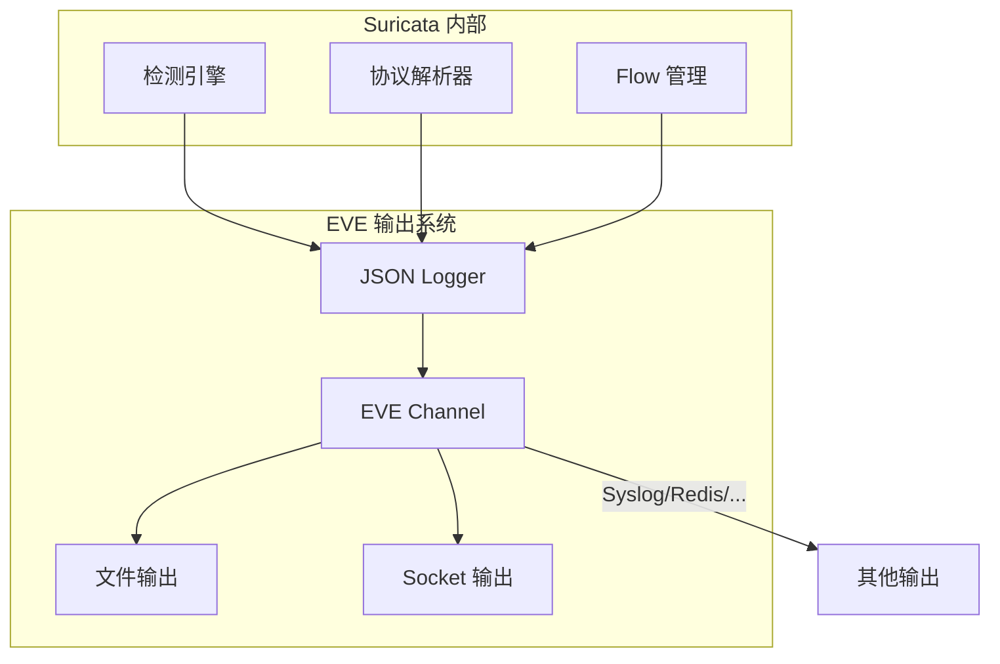

> [!info] Suricata 2026 深度探索系列 0. [[suricata-deep-dive|全栈学习路径总览]]
>
> 1. [[ch1-overview|第一章：Suricata 概述]]
> 2. [[ch2-config|第二章：Suricata 配置系统]]
> 3. [[ch3-runmodes|第三章：Runmodes 运行模式]]
> 4. [[ch4-thread-model|第四章：线程模型]]
> 5. [[ch5-capture|第五章：Capture 初始化]]
> 6. [[ch6-af-packet|第六章：AF-PACKET 接口]]
> 7. [[ch7-pcap|第七章：PCAP 接口]]
> 8. [[ch8-nfq|第八章：NFQ 与 PF_RING 模式]]
> 9. [[ch9-dpdk|第九章：DPDK 接口]]
> 10. [[ch10-loadbalancing|第十章：多线程抓包与负载均衡]]
> 11. [[ch11-detect-engine|第十一章：检测引擎架构]]
> 12. [[ch12-signatures|第十二章：规则解析]]
> 13. [[ch13-mpm|第十三章：多模式匹配]]
> 14. [[ch14-filemagic|第十四章：文件识别]]
> 15. [[ch15-lua-detect|第十五章：Lua 检测]]
> 16. [[ch16-app-layer|第十六章：应用层协议解析]]
> 17. [[ch17-http|第十七章：HTTP 协议解析]]
> 18. [[ch18-dns|第十八章：DNS 协议解析]]
> 19. [[ch19-tls|第十九章：TLS 协议解析]]
> 20. [[ch20-smb|第二十章：SMB 协议解析]]
> 21. [[ch21-http2|第二十一章：HTTP/2 协议解析]]
> 22. [[ch22-flow|第二十二章：Flow 管理]]
> 23. [[ch23-flow-timeout|第二十三章：Flow 超时]]
> 24. [[ch24-flowbit|第二十四章：Flowbit 与 Flow 变量]]
> 25. [[ch25-host|第二十五章：Host 管理]]
> 26. [[ch26-stream|第二十六章：Stream 重组引擎]]
> 27. [[ch27-stream-policy|第二十七章：TCP 重组策略]]
> 28. [[ch28-stream-depth|第二十八章：Stream 深度配置]]
> 29. **第二十九章：EVE JSON 输出**
> 30. [[ch30-alerts|第三十章：Alerts 输出]]
> 31. [[ch31-stats|第三十一章：Stats 统计]]
> 32. [[ch32-file-log|第三十二章：File Log]]
> 33. [[ch33-unified2|第三十三章：Unified2]]

---

## 1. EVE JSON 概述

EVE (Extended Event Format) 是 Suricata 的统一日志输出格式，以 JSON 格式记录所有类型的事件：Alerts、Flows、Stats、HTTP、DNS、TLS 等。



### 1.1 EVE 的核心优势

```
优势 1：统一格式
├── 所有事件类型使用相同 JSON 结构
├── 便于解析和存储
└── 支持大规模日志分析

优势 2：丰富的字段
├── 标准化的事件元数据
├── 协议特定的详细字段
└── 可扩展的 metadata

优势 3：多种输出方式
├── 文件（rotated）
├── Unix Socket
├── Redis
├── Syslog
└── Kafka
```

---

## 2. EVE 配置详解

### 2.1 基础配置

```yaml
# suricata.yaml
outputs:
  - eve-log:
      enabled: yes
      filetype: regular # regular/syslog/unix_stream/unix_dgram

      # 输出路径
      filename: eve.json

      # 是否启用多线程写入
      threaded: yes

      # 每批次数量
      batchsize: 100

      # 输出缓冲
      bufsize: 16384

      # 是否包含网络抓包的 pcap 文件名
      pcap: false
```

### 2.2 高级配置

```yaml
# suricata.yaml
outputs:
  - eve-log:
      enabled: yes
      filetype: regular

      # 输出目录（带 rotation）
      filename: eve

      # rotation 配置
      rotation:
        enabled: yes
        time-reap: 300 # 5 分钟后关闭文件
        size-reap: 100MB # 达到 100MB 后 rotation
        time-interval: 300 # 5 分钟检查一次

      # JSON 格式化
      json:
        include-origin: false
        forward: yes # 包含 origin 字段
        timestamp-format: iso # iso/rfc3339/unix

      # EVE 字段类型配置
      types:
        - alert
        - flow
        - stats
        - dns
        - http
        - tls
        - smb
        - ssh
        - ftp
        - ike
        - nfs
```

### 2.3 Redis 输出配置

```yaml
# suricata.yaml
outputs:
  - eve-log:
      enabled: yes
      filetype: redis

      redis:
        server: 127.0.0.1
        port: 6379
        password: <password>
        database: 0

        # Redis 模式
        mode: stream # list/stream

        # Key 格式
        key: suricata:eve

        # 批量写入
        pipelining:
          enabled: yes
          batch-size: 10
```

---

## 3. EVE JSON 格式详解

### 3.1 通用字段

每条 EVE 日志都包含以下标准字段：

```json
{
  "timestamp": "2026-04-15T10:23:45.123456Z",
  "event_type": "alert",
  "vlan": 0,
  "in_iface": "eth0",
  "src_ip": "192.168.1.100",
  "src_port": 54321,
  "dest_ip": "93.184.216.34",
  "dest_port": 443,
  "proto": "TCP",
  "pkt_src": "wire/pcap",
  "verdict": "pass"
}
```

### 3.2 event_type 详解

| event_type | 说明           | 主要字段                        |
| :--------- | :------------- | :------------------------------ |
| `alert`    | 告警事件       | alert.\*, flow_id, signature_id |
| `flow`     | Flow 事件      | flow.\*, state, reason          |
| `stats`    | 统计事件       | stats.\*, stats_t               |
| `dns`      | DNS 查询/响应  | dns.\*                          |
| `http`     | HTTP 请求/响应 | http.\*                         |
| `tls`      | TLS 握手       | tls.\*, sni, subject, issuerdn  |
| `ssh`      | SSH 握手       | ssh.\*                          |
| `smtp`     | SMTP 邮件      | smtp.\*, subject, from, to      |
| `imap`     | IMAP 协议      | imap.\*                         |
| `ftp`      | FTP 协议       | ftp.\*                          |
| `rdp`      | RDP 协议       | rdp.\*                          |
| `snmp`     | SNMP 协议      | snmp.\*                         |
| `quic`     | QUIC 协议      | quic.\*                         |
| `http2`    | HTTP/2 协议    | http.\*                         |

### 3.3 Alert 日志格式

```json
{
  "timestamp": "2026-04-15T10:23:45.123456Z",
  "event_type": "alert",

  "alert": {
    "signature_id": 1000001,
    "rev": 1,
    "signature": "ET EXPLOIT Kali Linux HTTP Request",
    "category": "Attempted Information Leak",
    "severity": 1
  },

  "flow": {
    "bytes_toserver": 1024,
    "bytes_toclient": 2048,
    "pkts_toserver": 5,
    "pkts_toclient": 3,
    "state": "closed",
    "reason": "timeout"
  },

  "src_ip": "192.168.1.100",
  "src_port": 54321,
  "dest_ip": "93.184.216.ة34",
  "dest_port": 443,
  "proto": "TCP"
}
```

### 3.4 DNS 日志格式

```json
{
  "timestamp": "2026-04-15T10:23:45.123456Z",
  "event_type": "dns",

  "dns": {
    "version": 2,
    "type": "query",
    "id": 12345,
    "tx_id": 0,
    "qr": false,
    "opcode": 0,
    "qname": "www.example.com",
    "qtype": "A",
    "qclass": 1
  },

  "src_ip": "192.168.1.100",
  "src_port": 53,
  "dest_ip": "8.8.8.8",
  "dest_port": 53,
  "proto": "UDP"
}
```

### 3.5 HTTP 日志格式

```json
{
  "timestamp": "2026-04-15T10:23:45.123456Z",
  "event_type": "http",

  "http": {
    "hostname": "www.example.com",
    "url": "/api/v1/users",
    "http_port": 8080,
    "http_method": "GET",
    "protocol": "HTTP/1.1",
    "status": 200,
    "status_line": "200 OK",
    "length": 1234,

    "request_headers": {
      "host": "www.example.com",
      "user-agent": "curl/7.68.0",
      "accept": "*/*"
    },

    "response_headers": {
      "content-type": "application/json",
      "content-length": "1234"
    },

    "request_body": null,
    "response_body": "{\"users\": [...]}"
  }
}
```

---

## 4. EVE 源码实现

### 4.1 EVE 日志系统初始化

```c
// src/output-eve.c — EVE 系统初始化
static OutputInitResult OutputEveLogInit(ConfNode *conf)
{
    OutputEveCtx *eve_ctx = SCCalloc(1, sizeof(OutputEveCtx));
    if (eve_ctx == NULL) {
        return ResultInitFail;
    }

    /* 解析配置 */
    const char *filetype = ConfNodeLookupChildValue(conf, "filetype");
    if (filetype == NULL || strcmp(filetype, "regular") == 0) {
        eve_ctx->type = EVE_FILE_TYPE_REGULAR;
    } else if (strcmp(filetype, "syslog") == 0) {
        eve_ctx->type = EVE_FILE_TYPE_SYSLOG;
    } else if (strcmp(filetype, "redis") == 0) {
        eve_ctx->type = EVE_FILE_TYPE_REDIS;
    }

    /* 获取文件名 */
    const char *filename = ConfNodeLookupChildValue(conf, "filename");
    if (filename != NULL) {
        eve_ctx->filename = SCStrdup(filename);
    }

    /* 初始化 JSON 上下文 */
    eve_ctx->js = Json派rotoInit();

    /* 创建日志输出线程 */
    OutputRegisterFileRotation(&eve_ctx->output,
                               EVEWrite,
                               eve_ctx);

    return ResultOk;
}
```

### 4.2 EVE 写入流程

```c
// src/output-eve.c — EVE 写入
static int EVEWrite(Json派roto *js, OutputEveCtx *eve_ctx, void *arg)
{
    /* 获取事件类型 */
    const char *event_type = Json派rotoGetValue(js, "event_type");

    /* 调用特定类型的日志写入 */
    switch (GetEventType(event_type)) {
        case EVE_EVENT_ALERT:
            return EVEWriteAlert(js, eve_ctx, arg);
        case EVE_EVENT_FLOW:
            return EVEWriteFlow(js, eve_ctx, arg);
        case EVE_EVENT_DNS:
            return EVEWriteDNS(js, eve_ctx, arg);
        case EVE_EVENT_HTTP:
            return EVEWriteHTTP(js, eve_ctx, arg);
        // ... 其他类型
    }

    return -1;
}
```

### 4.3 JSON 字段映射

```c
// src/output-json-alert.c — Alert 字段映射
int OutputJsonAlertLog(ThreadVars *tv, Packet *p, void *data)
{
    Json派roto *js = CreateJson();

    /* 添加通用字段 */
    Json派rotoSetString(js, "event_type", "alert");
    Json派rotoSetTimestamp(js, "timestamp", p->ts);

    /* 添加 IP 层字段 */
    char srcip[46], dstip[46];
    Port srcport, dstport;

    if (PKT_IS_IP(p)) {
        PrintInet(AF_INET6, &p->src, srcip, sizeof(srcip));
        PrintInet(AF_INET6, &p->dst, dstip, sizeof(dstip));
        srcport = p->sp;
        dstport = p->dp;

        Json派rotoSetString(js, "src_ip", srcip);
        Json派rotoSetString(js, "dest_ip", dstip);
        Json派rotoSetUint(js, "src_port", srcport);
        Json派rotoSetUint(js, "dest_port", dstport);
        Json派rotoSetString(js, "proto", "TCP");
    }

    /* 添加 Alert 特定字段 */
    if (p->alerts.alert_cnt > 0) {
        Alert *alert = &p->alerts.alerts[0];
        Json派rotoSetUint(js, "alert.signature_id", alert->signature_id);
        Json派rotoSetUint(js, "alert.rev", alert->rev);
        Json派rotoSetString(js, "alert.signature", alert->signature);
        Json派rotoSetString(js, "alert.category", alert->category);
        Json派rotoSetUint(js, "alert.severity", alert->severity);
    }

    /* 写入 EVE 输出 */
    OutputEveLog(js, data);

    Json派rotoFree(js);
    return 0;
}
```

### 4.4 EVE 文件 Rotation

```c
// src/output-eve.c — EVE 文件 Rotation
static int EVELogRotation(OutputEveCtx *eve_ctx)
{
    char *new_filename;
    struct stat st;

    /* 检查是否需要 rotation */
    if (stat(eve_ctx->filename, &st) == 0) {
        if (eve_ctx->rotation_size > 0 &&
            st.st_size >= (off_t)eve_ctx->rotation_size) {
            /* 按大小 rotation */
            new_filename = GenerateRotationFilename(eve_ctx->filename, "size");
            RenameFile(eve_ctx->filename, new_filename);
        }
    }

    /* 重新打开主文件 */
    ReopenFile(eve_ctx->filename);

    return 0;
}
```

---

## 5. EVE 输出类型配置

### 5.1 文件输出

```yaml
# suricata.yaml
outputs:
  - eve-log:
      enabled: yes
      filetype: regular
      filename: /var/log/suricata/eve.json

      # rotation
      rotation:
        enabled: yes
        time-reap: 300
        size-reap: 100MB
```

### 5.2 Unix Socket 输出

```yaml
# suricata.yaml
outputs:
  - eve-log:
      enabled: yes
      filetype: unix_stream # 或 unix_dgram
      filename: /var/run/suricata/eve.sock

      # non-blocking
      non-blocking: yes
```

### 5.3 Syslog 输出

```yaml
# suricata.yaml
outputs:
  - eve-log:
      enabled: yes
      filetype: syslog

      syslog:
        facility: local3
        level: info
        format: "suricata[%d]: "
```

---

## 6. EVE 字段过滤

### 6.1 字段配置

```yaml
# suricata.yaml
outputs:
  - eve-log:
      enabled: yes

      # 字段过滤
      filter:
        - event_type:
            - alert
            - dns
            - http

      # 特定类型的字段
      types:
        - alert:
            # 包含的字段
            fields:
              - action
              - gid
              - signature_id
              - rev
              - signature
              - category
              - severity

        - dns:
            # 排除的字段
            exclude-fields:
              - dns.type
              - dns.ttl

        - http:
            fields:
              - hostname
              - url
              - http_method
              - status
              - status_line
```

### 6.2 自定义字段

```yaml
# suricata.yaml
outputs:
  - eve-log:
      enabled: yes

      custom:
        enabled: yes

        # 自定义 JSON 字段
        fields:
          - name: suricata_version
            value: "7.0.3"
          - name: deployment_id
            value: "prod-01"
```

---

## 7. EVE 与 SIEM 集成

### 7.1 Elasticsearch 输出

```yaml
# suricata.yaml
outputs:
  - eve-log:
      enabled: yes
      filetype: file
      filename: eve.json

  # 使用 Filebeat 发送到 Elasticsearch
---
filebeat.inputs:
  - type: log
    paths:
      - /var/log/suricata/eve.json
    json.keys_under_root: true
    json.add_error_key: true

output.elasticsearch:
  hosts: ["elasticsearch:9200"]
  index: "suricata-%{+yyyy.MM.dd}"
```

### 7.2 Splunk 输出

```yaml
# suricata.yaml
outputs:
  - eve-log:
      enabled: yes
      filetype: syslog

      syslog:
        facility: local3
        level: info
```

### 7.3 Graylog 输出

```yaml
# suricata.yaml
outputs:
  - eve-log:
      enabled: yes
      filetype: file
      filename: /var/log/suricata/eve.json

# 使用 nxlog 或 filebeat 发送到 Graylog
```

---

## 8. EVE 性能优化

### 8.1 写入优化

```yaml
# suricata.yaml
outputs:
  - eve-log:
      enabled: yes

      # 多线程写入
      threaded: yes

      # 批量写入
      batchsize: 100

      # 输出缓冲
      bufsize: 65536

      # Lock-free 队列
      lockless: yes
```

### 8.2 磁盘 I/O 优化

```yaml
# suricata.yaml
outputs:
  - eve-log:
      enabled: yes

      # 使用 O_DIRECT 绕过缓冲
      direct: no

      # 异步写入
      async: yes

      # 文件系统建议
      warm: yes
```

---

## 9. 常见问题

### 9.1 EVE 文件过大

**症状**：eve.json 快速增长，占用大量磁盘

**解决**：

```yaml
outputs:
  - eve-log:
      enabled: yes

      rotation:
        enabled: yes
        size-reap: 100MB
        time-reap: 300
```

### 9.2 JSON 解析性能

**优化建议**：

- 使用 `jq` 进行流式处理
- 配置合适的 rotation 大小
- 使用 Elasticsearch 的 ingest pipeline

### 9.3 字段丢失

**检查**：

- 确认相关协议解析已启用
- 检查 `types` 配置是否包含该类型
- 查看 `exclude-fields` 是否有排除
