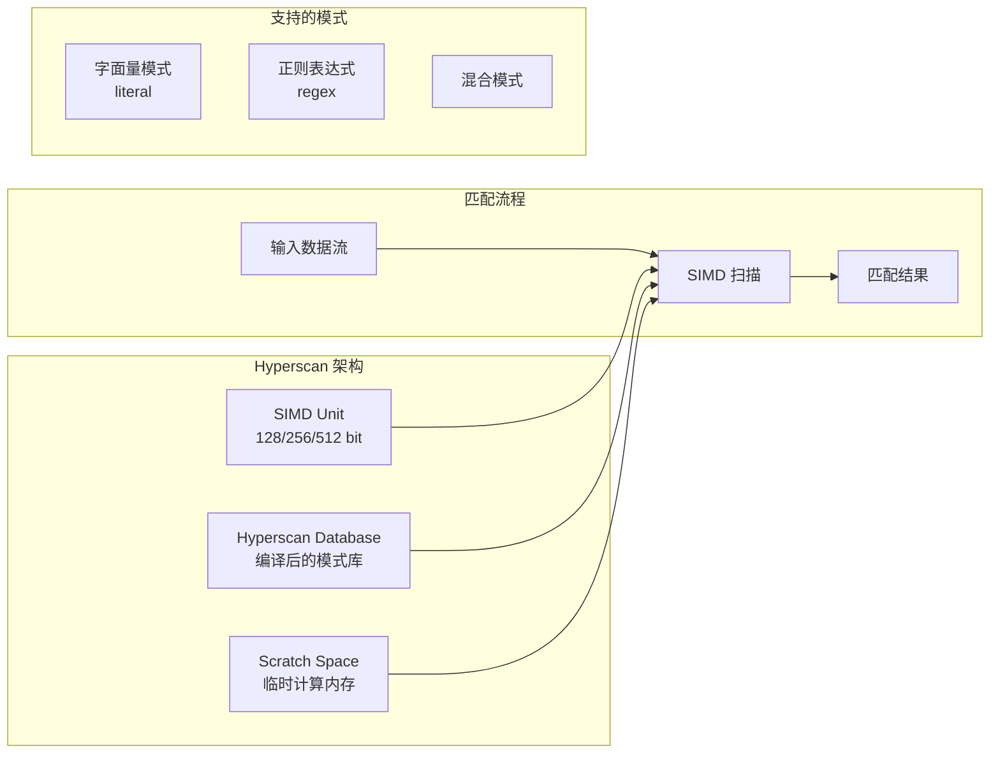
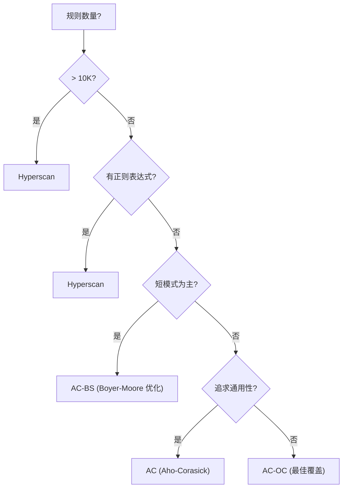

> [!info] Suricata 2026 深度探索系列 0. [[suricata-deep-dive|全栈学习路径总览]]
>
> 1. [[ch1-overview|第一章：Suricata 概述]]
> 2. [[ch2-config|第二章：Suricata 配置系统]]
> 3. [[ch3-runmodes|第三章：Runmodes 运行模式]]
> 4. [[ch4-thread-model|第四章：线程模型]]
> 5. [[ch5-capture|第五章：Capture 初始化]]
> 6. [[ch6-af-packet|第六章：AF-PACKET 接口]]
> 7. [[ch7-pcap|第七章：PCAP 接口]]
> 8. [[ch8-nfq|第八章：NFQ 与 PF_RING 模式]]
> 9. [[ch9-dpdk|第九章：DPDK 接口]]
> 10. [[ch10-loadbalancing|第十章：多线程抓包与负载均衡]]
> 11. [[ch11-detect-engine|第十一章：检测引擎架构]]
> 12. [[ch12-signatures|第十二章：规则解析]]
> 13. [[ch13-mpm|第十三章：多模式匹配]]
> 14. [[ch14-filemagic|第十四章：文件识别]]
> 15. [[ch15-lua-detect|第十五章：Lua 检测]]
> 16. [[ch16-app-layer|第十六章：应用层协议解析]]
> 17. [[ch17-http|第十七章：HTTP 协议解析]]
> 18. [[ch18-dns|第十八章：DNS 协议解析]]
> 19. [[ch19-tls|第十九章：TLS 协议解析]]
> 20. [[ch20-smb|第二十章：SMB 协议解析]]
> 21. [[ch21-http2|第二十一章：HTTP/2 协议解析]]
> 22. [[ch22-flow|第二十二章：Flow 管理]]
> 23. [[ch23-flow-timeout|第二十三章：Flow 超时]]
> 24. [[ch24-flowbit|第二十四章：Flowbit 与 Flow 变量]]
> 25. [[ch25-host|第二十五章：Host 管理]]
> 26. [[ch26-stream|第二十六章：Stream 重组引擎]]
> 27. [[ch27-stream-policy|第二十七章：TCP 重组策略]]
> 28. [[ch28-stream-depth|第二十八章：Stream 深度配置]]
> 29. [[ch29-eve|第二十九章：EVE JSON 输出]]
> 30. [[ch30-alerts|第三十章：Alerts 输出]]
> 31. [[ch31-stats|第三十一章：Stats 统计]]
> 32. [[ch32-file-log|第三十二章：File Log]]
> 33. [[ch33-unified2|第三十三章：Unified2]]
> 34. [[ch34-rules|第三十四章：规则语法]]
> 35. [[ch35-http-sids|第三十五章：HTTP 规则]]
> 36. [[ch36-dns-sids|第三十六章：DNS 规则]]
> 37. [[ch37-tls-sids|第三十七章：TLS 规则]]
> 38. [[ch38-counters|第三十八章：性能计数器]]
> 39. [[ch39-memory|第三十九章：内存管理]]
> 40. **第四十章：Hyperscan MPM**

---

## 1. Hyperscan 概述

Intel Hyperscan 是一个高性能的多模式匹配库，利用 SIMD（Single Instruction Multiple Data）指令实现并行模式匹配。在 Suricata 中，Hyperscan 作为 MPM（Multi-Pattern Matching）的一种算法，特别适合大规模规则集（>10K 规则）的场景。



### 1.1 Hyperscan vs AC 算法对比

| 特性           | AC (Aho-Corasick)  | Hyperscan               |
| :------------- | :----------------- | :---------------------- |
| **时间复杂度** | O(n)               | O(n/k) 其中 k=SIMD 宽度 |
| **空间复杂度** | O(模式数 × 字母表) | 更紧凑的 NFA/DFA 混合   |
| **正则支持**   | 否                 | 是                      |
| **SIMD 利用**  | 否                 | AVX2/AVX-512            |
| **规则规模**   | <10K 规则          | >10K 规则               |
| **编译时间**   | 快                 | 慢（编译数据库）        |
| **内存使用**   | 中等               | 较低（压缩表示）        |

### 1.2 SIMD 加速原理

```
传统 AC (串行):
Text:    "abcdefghijklmnopqrstuvwxyz"
Pattern: ["he", "she", "his", "hers"]
Char 1: a  -> AC state
Char 2: b  -> AC state
...
Char 8: h  -> Match "he"!     <- 1 字符/周期

Hyperscan (SIMD, 256-bit = 32 bytes/周期):
Text:    "abcdefghijklmnopqrstuvwxyz"
         [32 bytes 同时扫描]
Block 1: abcdefghijklmnopqrstuvwxyzABCD  -> 32 matches/周期
Block 2: EFGHIJKLMNOPQRSTUVWXYZ...
```

---

## 2. MPM 配置详解

### 2.1 全局 MPM 配置

```yaml
# suricata.yaml
mpm-algo: auto # 自动选择算法
# 可选: ac, ac-bs, ac-oc, hs, mpm-proc
```

### 2.2 Hyperscan 配置

```yaml
# suricata.yaml
mpm:
  # MPM 引擎
  algo: hs # 使用 Hyperscan

  # Hyperscan 特定配置
  hyperscan:
    # 编译器参数
    compile-limit: 16384 # 编译超时（毫秒）

    # 数据库模式
    database-mode: block # block/stream/vectored

    # 调试
    debug: no # 调试输出
```

### 2.3 高级 MPM 配置

```yaml
# suricata.yaml
mpm:
  algo: hs

  # AC 备用（Hyperscan 失败时）
  ac:
    hash-size: 8192 # AC 哈希大小
    default: yes # AC 作为默认

  # MPM 配置
  max-pattern-len: 256 # 最大模式长度
  conf_geo: yes # 启用地域检测
```

### 2.4 检测配置文件中的 MPM

```yaml
# suricata.yaml
detection:
  # 检测引擎配置
  detect-config:
    groups: yes # 启用签名组
    shadow-correl: yes # 阴影规则关联

  # MPM 设置
  mpm:
    firefox: yes # 浏览器 MPM
    http-server: yes # HTTP 服务器 MPM
    sqlite: yes # SQLite MPM
```

---

## 3. Hyperscan 数据结构

### 3.1 Hyperscan 上下文

```c
// src/util-mpm-hyperscan.h — Hyperscan MPM 上下文
typedef struct MpmHyperscanCtx_ {
    /* Hyperscan 数据库 */
    hs_database_t *database;             // 编译后的数据库
    hs_compile_error_t *compile_err;    // 编译错误信息

    /* 模式信息 */
    hs_pattern_ext_t *patterns;         // 扩展模式数组
    uint32_t pattern_count;             // 模式数量
    uint32_t pattern_array_size;         // 模式数组大小

    /* Scratch 空间 */
    hs_scratch_t *scratch;              // 每线程临时空间
    hs_scratch_t *scratch_prealloc;    // 预分配的 scratch

    /* 匹配模式 */
    hs_expr_ext_t *ext;                 // 扩展信息
    uint64_t *match_ids;                // 匹配的规则 ID

    /* 标志 */
    uint32_t flags;
#define MPM_HS_INIT_DONE       0x01     // 初始化完成
#define MPM_HS_DB_COMPILED     0x02     // 数据库已编译
#define MPM_HS_SCRATCH_INUSE   0x04     // Scratch 在使用

    /* 统计 */
    uint64_t total_matches;              // 总匹配数
    uint64_t total_scans;               // 总扫描数
} MpmHyperscanCtx;
```

### 3.2 Hyperscan 模式

```c
// src/util-mpm-hyperscan.h — 模式定义
typedef struct MpmHyperscanPattern_ {
    /* 模式 ID */
    uint32_t id;

    /* 模式内容 */
    uint8_t *pattern;
    uint16_t pattern_len;

    /* 扩展标志 */
    uint32_t flags;
#define MPM_HS_PATTERN_FLAG_NOCASE     0x01  // 不区分大小写
#define MPM_HS_PATTERN_FLAG_DOTALL     0x02  // . 匹配换行
#define MPM_HS_PATTERN_FLAG_MULTILINE  0x04  // 多行模式

    /* 优先级 */
    uint8_t priority;

    /* 回调信息 */
    void *context;
} MpmHyperscanPattern;
```

### 3.3 MpmCtx 抽象层

```c
// src/util-mpm.h — MPM 统一接口
typedef struct MpmCtx_ {
    /* MPM 算法类型 */
    uint8_t mpm_type;
#define MPM_NOT_SET    0
#define MPM_AC         1
#define MPM_BM         2
#define MPM_HS         3      // Hyperscan
#define MPM_AC_BS      4
#define MPM_AC_OS      5

    /* 算法特定上下文 */
    void *ctx;

    /* 模式数量 */
    uint32_t pattern_cnt;

    /* 内存使用 */
    uint64_t memory;

    /* 初始化状态 */
    bool initialized;
} MpmCtx;
```

---

## 4. Hyperscan 初始化

### 4.1 MPM 初始化入口

```c
// src/detect-engine-mpm.c — MPM 初始化
MpmCtx *MpmFactoryGetCtx(enum MpmType type, bool alloc)
{
    MpmCtx *mpm_ctx = NULL;

    switch (type) {
        case MPM_HS:
            mpm_ctx = MpmHyperscanInitCtx();
            break;
        case MPM_AC:
        default:
            mpm_ctx = MpmACInitCtx();
            break;
    }

    return mpm_ctx;
}

// 获取 Hyperscan 上下文
static MpmCtx *MpmHyperscanInitCtx(void)
{
    MpmHyperscanCtx *hs_ctx = SCCalloc(1, sizeof(MpmHyperscanCtx));

    /* 分配 scratch 空间 */
    hs_ctx->scratch_prealloc = NULL;

    MpmCtx *mpm_ctx = SCCalloc(1, sizeof(MpmCtx));
    mpm_ctx->mpm_type = MPM_HS;
    mpm_ctx->ctx = hs_ctx;

    return mpm_ctx;
}
```

### 4.2 模式添加

```c
// src/util-mpm-hyperscan.c — 添加模式到 Hyperscan
int MpmHyperscanAddPattern(MpmCtx *mpm_ctx, uint8_t *pattern,
                           uint16_t pattern_len, uint32_t id,
                           uint8_t flags, uint8_t priority)
{
    MpmHyperscanCtx *hs_ctx = (MpmHyperscanCtx *)mpm_ctx->ctx;

    /* 扩容模式数组 */
    if (hs_ctx->pattern_count >= hs_ctx->pattern_array_size) {
        hs_ctx->pattern_array_size *= 2;
        hs_ctx->patterns = SCRealloc(hs_ctx->patterns,
                         hs_ctx->pattern_array_size * sizeof(hs_pattern_ext_t));
    }

    /* 填充模式信息 */
    hs_pattern_ext_t *p = &hs_ctx->patterns[hs_ctx->pattern_count];
    p->pattern = (const char *)pattern;
    p->length = pattern_len;
    p->flags = HS_FLAG_SINGLEMATCH;  // 单匹配模式

    if (flags & MPM_PATTERN_FLAG_NOCASE) {
        p->flags |= HS_FLAG_CASELESS;
    }

    /* 扩展信息 */
    p->ext = NULL;
    p->id = id;
    p->context = NULL;

    hs_ctx->pattern_count++;
    mpm_ctx->pattern_cnt++;

    return 0;
}
```

### 4.3 数据库编译

```c
// src/util-mpm-hyperscan.c — 编译 Hyperscan 数据库
int MpmHyperscanBuildDatabase(MpmCtx *mpm_ctx)
{
    MpmHyperscanCtx *hs_ctx = (MpmHyperscanCtx *)mpm_ctx->ctx;

    if (hs_ctx->pattern_count == 0) {
        return 0;
    }

    /* 分配模式数组给 Hyperscan */
    hs_pattern_ext_t *patterns = hs_ctx->patterns;
    uint32_t count = hs_ctx->pattern_count;

    /* 编译数据库 */
    hs_error_t err = hs_compile_ext_multi(
        patterns,              // 模式数组
        count,                 // 模式数量
        NULL,                  // 数据库 info (NULL)
        NULL,                  // compile attributes
        HS_MODE_BLOCK,         // 块模式
        NULL,                  // cpu features (auto)
        &hs_ctx->database,    // 输出数据库
        &hs_ctx->compile_err, // 错误信息
        &hs_ctx->ext);        // 扩展信息

    if (err != HS_SUCCESS) {
        SCLogError("Hyperscan compile failed: %s",
                   hs_ctx->compile_err->message);
        return -1;
    }

    hs_ctx->flags |= MPM_HS_DB_COMPILED;

    /* 分配 scratch 空间 */
    err = hs_alloc_scratch(hs_ctx->database, &hs_ctx->scratch_prealloc);
    if (err != HS_SUCCESS) {
        SCLogError("Failed to allocate scratch space");
        return -1;
    }

    return 0;
}
```

---

## 5. Hyperscan 匹配

### 5.1 匹配回调

```c
// src/util-mpm-hyperscan.c — Hyperscan 匹配回调
static int MpmHyperscanMatchCallback(
    uint32_t id,               // 匹配的模式 ID
    uint64_t from,             // 匹配起始位置
    uint64_t to,               // 匹配结束位置
    uint32_t flags,            // 标志
    void *context)             // 用户上下文
{
    MpmThreadCtx *mpm_thread_ctx = (MpmThreadCtx *)context;

    /* 记录匹配 */
    if (mpm_thread_ctx->match_cnt < mpm_thread_ctx->max_matches) {
        mpm_thread_ctx->matches[mpm_thread_ctx->match_cnt++] = id;
    }

    /* 继续扫描 */
    return 0;
}
```

### 5.2 扫描接口

```c
// src/util-mpm-hyperscan.c — 执行扫描
int MpmHyperscanScan(MpmCtx *mpm_ctx, MpmThreadCtx *mpm_thread_ctx,
                     const uint8_t *text, uint32_t text_len)
{
    MpmHyperscanCtx *hs_ctx = (MpmHyperscanCtx *)mpm_ctx->ctx;

    /* 检查 scratch 空间 */
    if (mpm_thread_ctx->scratch == NULL) {
        /* 克隆 scratch 到线程 */
        hs_error_t err = hs_clone_scratch(hs_ctx->scratch_prealloc,
                                          &mpm_thread_ctx->scratch);
        if (err != HS_SUCCESS) {
            return -1;
        }
    }

    /* 重置匹配计数 */
    mpm_thread_ctx->match_cnt = 0;

    /* 执行扫描 */
    hs_error_t err = hs_scan(
        hs_ctx->database,          // 数据库
        (const char *)text,         // 输入文本
        text_len,                   // 文本长度
        0,                          // flags
        mpm_thread_ctx->scratch,    // scratch 空间
        MpmHyperscanMatchCallback, // 回调函数
        mpm_thread_ctx);            // 上下文

    if (err != HS_SUCCESS) {
        SCLogError("Hyperscan scan failed: error %d", err);
        return -1;
    }

    hs_ctx->total_scans++;
    hs_ctx->total_matches += mpm_thread_ctx->match_cnt;

    return mpm_thread_ctx->match_cnt;
}
```

---

## 6. Hyperscan 模式

### 6.1 Block 模式

Block 模式适用于离散的、不连续的数据块：

```yaml
# 配置
mpm:
  hyperscan:
    database-mode: block

# 使用场景
# - 文件检测 (file-data)
# - DNS 查询/响应
# - TLS 证书检测
```

```c
// Block 模式扫描
// 每个数据块独立扫描，无状态
hs_scan(hs_ctx->database, chunk, chunk_len, 0, scratch,
        callback, context);
```

### 6.2 Stream 模式

Stream 模式维护跨数据块的状态：

```yaml
# 配置
mpm:
  hyperscan:
    database-mode: stream

stream:
  # 启用流模式 MPM
  mpm-hs: yes
```

```c
// src/util-mpm-hyperscan.c — Stream 模式
typedef struct HyperscanStream_ {
    hs_stream_t *stream;              // Hyperscan 流
    uint8_t *buf;                      // 累积缓冲区
    uint32_t buf_len;                  // 缓冲区长度
    uint32_t alloc_size;              // 分配大小
} HyperscanStream;

int MpmHyperscanStreamUpdate(HyperscanStream *stream,
                              const uint8_t *data, uint32_t data_len)
{
    /* 追加数据到流 */
    hs_error_t err = hs_stream_append(stream->stream, data, data_len);
    if (err != HS_SUCCESS) {
        return -1;
    }

    /* 流自动触发回调 */
    return 0;
}
```

### 6.3 Vectored 模式

Vectored 模式同时扫描多个数据块：

```c
// src/util-mpm-hyperscan.c — Vectored 扫描
int MpmHyperscanScanVectored(MpmCtx *mpm_ctx,
                              MpmThreadCtx *mpm_thread_ctx,
                              const uint8_t **data_array,
                              uint32_t *data_lens,
                              uint32_t data_count)
{
    MpmHyperscanCtx *hs_ctx = (MpmHyperscanCtx *)mpm_ctx->ctx;

    /* 构建向量 */
    hs_scan_vector_t vectors[data_count];
    for (uint32_t i = 0; i < data_count; i++) {
        vectors[i].p = (const char *)data_array[i];
        vectors[i].length = data_lens[i];
    }

    /* 批量扫描 */
    hs_error_t err = hs_scan_vector(
        hs_ctx->database,
        vectors,
        data_count,
        0,
        mpm_thread_ctx->scratch,
        MpmHyperscanMatchCallback,
        mpm_thread_ctx);

    return (err == HS_SUCCESS) ? mpm_thread_ctx->match_cnt : -1;
}
```

---

## 7. 规则集大小选择策略

### 7.1 算法选择决策树



### 7.2 MPM 配置推荐

| 场景              | 规则规模  | 推荐算法  | 配置              |
| :---------------- | :-------- | :-------- | :---------------- |
| **ET Open Rules** | ~35K 规则 | Hyperscan | `mpm.algo: hs`    |
| **Snort 规则**    | ~50K 规则 | Hyperscan | `mpm.algo: hs`    |
| **小规模自定义**  | <5K 规则  | AC        | `mpm.algo: ac`    |
| **均衡场景**      | 5K-10K    | AC-OC     | `mpm.algo: ac-oc` |
| **短模式为主**    | 任意      | AC-BS     | `mpm.algo: ac-bs` |
| **正则表达式**    | 任意      | Hyperscan | `mpm.algo: hs`    |

### 7.3 自动选择

```yaml
# suricata.yaml
mpm-algo: auto # 自动选择


# Suricata 自动选择逻辑:
# if (规则数 > 10000 || 包含正则) → Hyperscan
# else if (短模式比例 > 50%) → AC-BS
# else → AC
```

---

## 8. Hyperscan 安装与验证

### 8.1 安装 Hyperscan

```bash
# Ubuntu/Debian
apt-get install libhyperscan-dev

# CentOS/RHEL
yum install hyperscan hyperscan-devel

# 源码编译
git clone https://github.com/intel/hyperscan
cd hyperscan
mkdir build && cd build
cmake .. -DCMAKE_BUILD_TYPE=Release
make -j$(nproc)
make install
```

### 8.2 验证安装

```bash
# 检查库文件
ldconfig -p | grep hyperscan

# 检查编译标志
grep -r "HAVE_HYPERSCAN" /usr/include/suricata/*.h

# 测试程序
cat > test_hs.c << 'EOF'
#include <hs.h>
#include <stdio.h>

int main() {
    printf("Hyperscan version: %s\n", hs_version());

    if (!hs_valid_platform()) {
        printf("Warning: Invalid platform for Hyperscan\n");
        return 1;
    }

    printf("Hyperscan is properly installed\n");
    return 0;
}
EOF
gcc test_hs.c -lhs -o test_hs && ./test_hs
```

### 8.3 Suricata Hyperscan 支持验证

```bash
# 检查 Suricata 编译选项
suricata --build-info | grep Hyperscan

# 输出示例:
# Hyperscan support:                          yes
# Hyperscan max scratch space:                16384 KB

# 检查 MPM 配置
suricata -c suricata.yaml --list-runmodes

# 测试 Hyperscan MPM
suricata -c suricata.yaml -T -v
# 观察日志中的 MPM 初始化信息
```

---

## 9. Hyperscan 性能调优

### 9.1 Scratch 空间配置

```yaml
# suricata.yaml
mpm:
  hyperscan:
    # Scratch 空间大小（每个线程）
    scratch-buffer-size: 16384 # KB

    # 预分配 scratch
    prealloc-scratch: yes # 启动时预分配
```

### 9.2 编译参数调优

```yaml
# suricata.yaml
mpm:
  hyperscan:
    # 编译超时
    compile-limit: 30000 # 30 秒超时

    # CPU 特性
    cpu-features: auto # 自动检测 AVX2/AVX-512
```

### 9.3 内存调优

```yaml
# suricata.yaml
mpm:
  hyperscan:
    # 数据库模式
    database-mode: stream # 流模式（共享状态）

  # 配合 Stream 配置
stream:
  # 流重组内存
  memcap: 512mb
```

### 9.4 性能监控

```bash
# 查看 MPM 统计
suricata -c suricata.yaml -l /var/log/suricata --stats

# 关键指标:
# detect.mpm_hits              - MPM 命中数
# detect.mpm_misses            - MPM 未命中数
# detect.mpm_avg_time          - MPM 平均匹配时间
```

---

## 10. 常见问题与解决

### 10.1 Hyperscan 编译失败

```
错误: hs_compile_ext_multi() failed: malloc failed - out of memory
```

**解决**: 减少规则数量或增大系统内存

```yaml
# 或者使用 AC 代替
mpm:
  algo: ac
```

### 10.2 Scratch 空间不足

```
Warning: Unable to allocate scratch space
```

**解决**:

```yaml
# 增加 scratch 大小
mpm:
  hyperscan:
    scratch-buffer-size: 32768
```

### 10.3 正则表达式不支持

Hyperscan 只支持有限子集的正则表达式：

```bash
# 检查不支持的模式
suricata -c suricata.yaml -t 2>&1 | grep "Hyperscan"

# 将不支持的模式改为字面量
```

---

## 11. 小结

本章深入解析了 Suricata 的 Intel Hyperscan MPM 集成：

1. **Hyperscan 概述**：SIMD 加速原理、Block/Stream/Vectored 三种模式、与 AC 算法的对比
2. **配置详解**：mpm.hyperscan 各项配置参数、database-mode、scratch-buffer-size
3. **数据结构**：MpmHyperscanCtx 上下文、Hyperscan 模式定义、hs_database_t 数据库结构
4. **初始化流程**：MpmFactoryGetCtx → MpmHyperscanAddPattern → MpmHyperscanBuildDatabase
5. **匹配执行**：hs_scan 接口、MatchCallback 回调、Stream/Vectored 扫描变体
6. **模式选择**：规则集大小决策树、各场景算法推荐、自动选择逻辑
7. **安装验证**：Hyperscan 库安装、平台验证、Suricata 支持检查
8. **性能调优**：Scratch 空间、编译参数、内存配置、监控指标
9. **常见问题**：编译失败、Scratch 不足、正则不支持的解决方案
