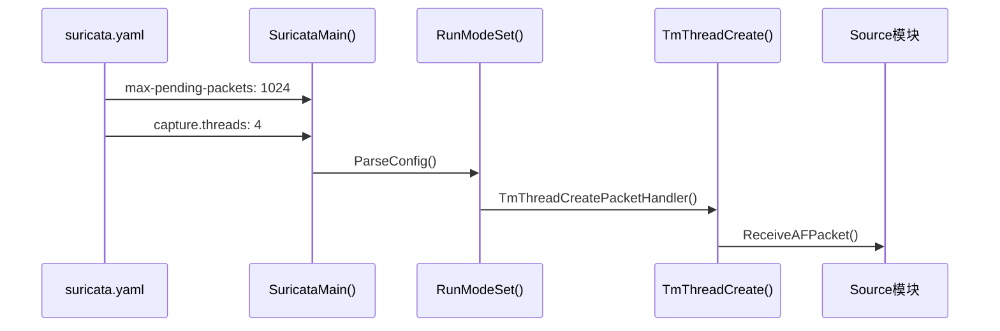

> [!info] Suricata 2026 深度探索系列 0. [[suricata-deep-dive|全栈学习路径总览]]
>
> 1. [[ch1-overview|第一章：Suricata 概述]]
> 2. [[ch2-config|第二章：Suricata 配置系统]]
> 3. [[ch3-runmodes|第三章：Runmodes 运行模式]]
> 4. [[ch4-thread-model|第四章：线程模型]]
> 5. **第五章：Capture 初始化**

---

## 1. Capture 初始化概述

Suricata 的抓包初始化是将 **YAML 配置** 转换为 **运行时抓包线程** 的核心流程。



---

## 2. 关键配置项

### 2.1 `max-pending-packets`

```yaml
# suricata.yaml
max-pending-packets: 1024
```

**作用**：控制每个抓包线程的 **Packet 池大小**，即未处理的包的最大缓存数。

```c
// src/suricata.c — 配置读取
static void ParseConfig(const char *conf_path)
{
    /* 读取 max-pending-packets */
    intmax_t max_pending = 1024;
    (void)ConfGetInt("max-pending-packets", &max_pending);

    /* 设置到全局变量 */
    g_max_pending_packets = (uint32_t)max_pending;

    /* 初始化 Packet 池 */
    PacketPoolInit(g_max_pending_packets);
}

/* src/packet.h — Packet 池结构 */
typedef struct PacketPool_ {
    /* per-thread 本地池 */
    __thread Packet **本地_数组;
    uint32_t 本地_count;
    uint32_t 本地_size;

    /* 全局备用池 */
    Packet *global_pool;
    uint32_t global_count;
} PacketPool;

extern PacketPool packet_pool;

/* src/packet.c — 池初始化 */
void PacketPoolInit(uint32_t max_pending)
{
    packet_pool.max_pending = max_pending;

    /* 预分配全局池 */
    packet_pool.global_pool = SCCalloc(max_pending, sizeof(Packet));

    /* 每个线程初始化本地池 */
    // ...
}
```

**源码映射**：

```
suricata.yaml                 →  src/suricata.c (ParseConfig)
max-pending-packets: 1024     →  g_max_pending_packets (全局变量)
                           →  PacketPoolInit() (池初始化)
```

### 2.2 `capture.threads`

```yaml
# suricata.yaml
capture:
  threads: 4
  mode: autofp
```

**作用**：指定 AF-PACKET 模式的抓包线程数。

```c
// src/source-af-packet.c — 配置读取
typedef struct AFPCaptureThreadConfig_ {
    int threads;               // 抓包线程数
    int if_index;              // 网卡索引
    int ring_size;             // 环形缓冲区大小
    int buffer_size;           // 每个包缓冲区大小
    int promisc;               // 是否混杂模式
} AFPCaptureThreadConfig;

static int AFPSetConfig(AFPCaptureThreadConfig **config)
{
    /* 读取 threads */
    const char *threads_str;
    if (ConfGet("capture.threads", &threads_str) == 1) {
        if (strcmp(threads_str, "auto") == 0) {
            /* auto：使用 CPU 核心数 */
            *config->threads = UtilCpuGetNumProcessors();
        } else {
            *config->threads = atoi(threads_str);
        }
    }
}
```

### 2.3 `af-packet.buffer-size`

```yaml
# suricata.yaml
af-packet:
  - interface: eth0
    buffer-size: 1024
    ring-size: 2048
    copy-mode: none
    copy-iface: eth1
```

**作用**：`buffer-size` 控制每个包的 **skb 大小**，对应 Linux kernel 的 `SO_RCVBUF`。

```c
// src/source-af-packet.c — Socket 选项设置
static int AFPSetSocketOptions(int fd, int buffer_size)
{
    int optval = buffer_size * 1024;  // KB → bytes

    /* 设置接收缓冲区大小 */
    if (setsockopt(fd, SOL_SOCKET, SO_RCVBUF, &optval, sizeof(optval)) == -1) {
        SCLogWarning("Failed to set SO_RCVBUF: %s", strerror(errno));
    }

    /* 设置环形缓冲区大小 (需要内核支持) */
    #ifdef SO_ATTACH_FILTER
    struct tpacket_req3 req;
    req.tp_block_size = getpagesize() << 2;  // 16KB
    req.tp_block_nr = 4;
    req.tp_frame_size = getpagesize();        // 4KB
    req.tp_frame_nr = buffer_size;

    setsockopt(fd, SOL_PACKET, PACKET_RX_RING, &req, sizeof(req));
    #endif

    return 0;
}
```

---

## 3. Capture 初始化链路

### 3.1 入口：SuricataMain

```c
// src/suricata.c — 主函数
int SuricataMain(int argc, char **argv)
{
    /* 1. 解析命令行 */
    ParseCommandLine(argc, argv);

    /* 2. 加载 YAML 配置 */
    if (ConfYamlLoad(conf_filename) != 0) {
        FatalError("Failed to load configuration");
    }

    /* 3. 全局初始化 */
    GlobalInits();

    /* 4. 初始化 Packet 池（关键）*/
    max_pending_packets = 1024;
    (void)ConfGetInt("max-pending-packets", &max_pending_packets);
    PacketPoolInit(max_pending_packets);

    /* 5. 初始化检测引擎 */
    DetectEngineCtx *de_ctx = DetectEngineCtxInit();
    DetectEngineBuild(de_ctx);

    /* 6. 设置运行模式并创建线程 */
    RunModeSet(runmode, capture_plugin, ...);

    /* 7. 进入主循环 */
    TmThreadWaitOnThreadInit();
    suricata->loop();
}
```

### 3.2 RunMode 设置

```c
// src/runmode.c — 模式选择与初始化
int RunModeSet(const char *runmode, const char *capture_plugin, ...)
{
    /* 根据 runmode 名称查找对应函数 */
    if (strcmp(runmode, "worker") == 0) {
        return RunModeWorker(de_ctx);
    } else if (strcmp(runmode, "autofp") == 0) {
        return RunModeAutoFp(de_ctx);
    } else if (strcmp(runmode, "nfq") == 0) {
        return RunModeNFQ(de_ctx);
    } else if (strcmp(runmode, "af-packet") == 0) {
        return RunModeAFPacket(de_ctx);
    } else if (strcmp(runmode, "pcap") == 0) {
        return RunModePcap(de_ctx);
    }

    /* auto 模式：自动选择 */
    runmode = RunModeAutoConf();
    return RunModeSet(runmode, capture_plugin, ...);
}
```

### 3.3 AF-PACKET Worker 模式初始化

```c
// src/runmode-af-packet.c — Worker 模式
int RunModeAFPAutoFp(DetectEngineCtx *de_ctx)
{
    /* 1. 读取接口配置 */
    int thread_count = AFPCountThreadsByConf();

    /* 2. 创建 Capture 线程 */
    ThreadVars *tv = TmThreadCreatePacketHandler(
        "RxAFPacket",
        "packetpool",       // 输入来自 Packet 池
        "flow.auto.1",     // 输出到 Flow 队列
        "FlowManager",     // 管理线程
        NULL
    );

    /* 3. 设置抓包模块 */
    TmVarSlotSetFunc(tv, TmModuleGetByName("AF_PACKET"));

    /* 4. 设置接口参数 */
    AFPPseudoArgs *args = SCCalloc(1, sizeof(AFPPseudoArgs));
    args->iface = "eth0";
    args->buffer_size = 1024;
    args->ring_size = 2048;
    tv->initdata = args;

    /* 5. 启动线程 */
    TmThreadSpawn(tv);

    /* 6. 创建 Worker 线程池 */
    for (int i = 0; i < thread_count; i++) {
        CreateWorkerThread(de_ctx, i);
    }

    return 0;
}
```

---

## 4. Source 模块结构

### 4.1 TmModule 定义

```c
// src/source-af-packet.c — AF-PACKET 模块注册
void TmModuleReceiveAFPPacketRegister(void)
{
    tmm_modules[TMM_RECEIVEAFPACKET].name = "ReceiveAFPPacket";
    tmm_modules[TMM_RECEIVEAFPACKET].ThreadInit = AFPPacketThreadInit;
    tmm_modules[TMM_RECEIVEAFPACKET].Func = AFPPacketLoop;
    tmm_modules[TMM_RECEIVEAFPACKET].ThreadDeinit = AFPPacketThreadDeinit;
    tmm_modules[TMM_RECEIVEAFPACKET].flags = TM_FLAG_RECEIVE_TM;
}
```

### 4.2 线程初始化

```c
// src/source-af-packet.c — 线程初始化
static TmEcode AFPPacketThreadInit(ThreadVars *tv, const void *initdata, void **data)
{
    AFPPacketThreadVars *ptv = SCCalloc(1, sizeof(AFPPacketThreadVars));

    /* 从 initdata 获取接口配置 */
    AFPPseudoArgs *args = (AFPPseudoArgs *)initdata;

    /* 创建 Socket */
    int fd = socket(AF_PACKET, SOCK_RAW, htons(ETH_P_ALL));
    if (fd < 0) {
        SCLogError("AF_PACKET socket create failed");
        return TM_ECODE_FAILED;
    }

    /* 设置 Socket 选项 */
    AFPSetSocketOptions(fd, args->buffer_size);

    /* 绑定到接口 */
    struct ifreq ifr;
    strlcpy(ifr.ifr_name, args->iface, IFNAMSIZ);
    ioctl(fd, SIOCGIFINDEX, &ifr);

    struct sockaddr_ll addr;
    addr.sll_family = AF_PACKET;
    addr.sll_ifindex = ifr.ifr_ifindex;
    addr.sll_protocol = htons(ETH_P_ALL);
    bind(fd, (struct sockaddr *)&addr, sizeof(addr));

    /* 设置为混杂模式 */
    if (args->promisc) {
        ioctl(fd, SIOCGIFFLAGS, &ifr);
        ifr.ifr_flags |= IFF_PROMISC;
        ioctl(fd, SIOCSIFFLAGS, &ifr);
    }

    /* 设置帧映射 (mmap) */
    AFPSetupRing(fd, args->ring_size);

    ptv->fd = fd;
    ptv->tv = tv;
    *data = ptv;

    return TM_ECODE_OK;
}
```

### 4.3 主循环

```c
// src/source-af-packet.c — AF-PACKET 抓包循环
static TmEcode AFPPacketLoop(ThreadVars *tv, void *data)
{
    AFPPacketThreadVars *ptv = (AFPPacketThreadVars *)data;
    struct tpacket_blocks *block;

    while (1) {
        /* 阻塞等待数据包 */
        int ret = poll(ptv->fds, ptv->fd_count, -1);
        if (ret < 0) continue;

        /* 遍历所有就绪的 ring block */
        for (int i = 0; i < ptv->fd_count; i++) {
            if (ptv->fds[i].revents & POLLIN) {
                /* 读取 block */
                block = GetReadyBlock(ptv, i);

                /* 解析每个帧 */
                for (int j = 0; j < block->hdr->tp_next_to_pr; j++) {
                    /* 获取 Packet */
                    Packet *p = PacketGetFromQueueOrAlloc();

                    /* 复制数据 */
                    CopyData(p, block->addr[j], block->hdr->tp_snaplen);

                    /* 设置元数据 */
                    p->ts = block->tv[j];
                    p->datalen = block->hdr->tp_snaplen;

                    /* 分发到处理管道 */
                    TmThreadsSlotVarRun(tv, p);
                }

                /* 释放 block */
                ReleaseBlock(block);
            }
        }
    }

    return TM_ECODE_OK;
}
```

---

## 5. 配置 → 源码映射表

|| YAML 配置 | C 变量 | 源文件 | 说明 |
|| :--- | :--- | :--- | :--- |
| `max-pending-packets` | `g_max_pending_packets` | `suricata.c` | Packet 池大小 |
| `capture.threads` | `AFPCaptureThreadConfig.threads` | `source-af-packet.c` | 抓包线程数 |
| `af-packet.buffer-size` | `tpacket_req3.tp_frame_size` | `source-af-packet.c` | Socket 缓冲区 |
| `af-packet.ring-size` | `tpacket_req3.tp_block_nr` | `source-af-packet.c` | 环形缓冲区块数 |
| `af-packet.promisc` | `IFF_PROMISC` | `source-af-packet.c` | 混杂模式 |
| `af-packet.copy-mode` | `TPACKET_V3 copy_filter` | `source-af-packet.c` | 镜像模式 |
| `af-packet.use-mmap` | `mmap()` | `source-af-packet.c` | 内存映射 |

---

## 6. 抓包性能调优

### 6.1 关键参数

```yaml
# suricata.yaml — 高性能配置
max-pending-packets: 65535
capture:
  threads: 8
af-packet:
  - interface: eth0
    threads: 8
    buffer-size: 4096 # 增大缓冲区
    ring-size: 4096 # 增大 Ring
    use-memory-mmap: yes # 启用 mmap
    tpacket-v3: yes # 使用 TPACKET_V3
    HockAirbus: yes # 启用 RX-Ring
```

### 6.2 内核参数调优

```bash
# /etc/sysctl.conf — 内核调优
# 增大最大文件描述符
fs.file-max = 655360

# 增大 socket 缓冲区
net.core.rmem_max = 134217728
net.core.wmem_max = 134217728
net.core.rmem_default = 16777216
net.core.wmem_default = 16777216

# 增大最大映射内存
vm.max_map_count = 655360

# 增大 packet 环形队列
net.core.netdev_max_backlog = 65535
```

---

## 7. 小结

本章解析了 Suricata 的 Capture 初始化核心流程：

1. **配置读取**：从 `suricata.yaml` 解析抓包参数
2. **Packet 池初始化**：`max-pending-packets` 决定池大小
3. **TmThread 创建**：创建抓包线程和管理线程
4. **Socket/ mmap 设置**：AF-PACKET 的帧映射机制
5. **抓包循环**：`poll()` + `mmap()` 实现零拷贝抓包

后续章节我们将深入各抓包模式的详细配置与源码：

- [[ch6-af-packet|第六章：AF-PACKET]]
- [[ch7-pcap|第七章：PCAP]]
- [[ch8-nfq|第八章：NFQ]]
