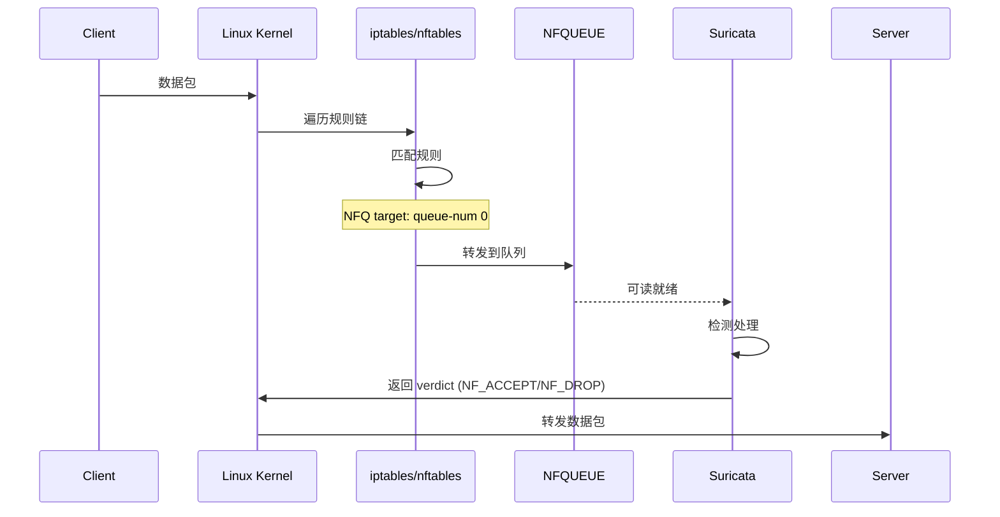

> [!info] Suricata 2026 深度探索系列 0. [[suricata-deep-dive|全栈学习路径总览]]
>
> 1. [[ch1-overview|第一章：Suricata 概述]]
> 2. [[ch2-config|第二章：Suricata 配置系统]]
> 3. [[ch3-runmodes|第三章：Runmodes 运行模式]]
> 4. [[ch4-thread-model|第四章：线程模型]]
> 5. [[ch5-capture|第五章：Capture 初始化]]
> 6. [[ch6-af-packet|第六章：AF-PACKET 接口]]
> 7. [[ch7-pcap|第七章：PCAP 接口]]
> 8. **第八章：NFQ 与 PF_RING 模式**

---

## 1. NFQ 概述

NFQ (Netfilter Queue) 是 Linux 内核提供的用户态队列机制，允许用户空间程序处理 iptables/nftables 转发的高危数据包。



### 1.1 NFQ Verdict

| Verdict     | 说明 | 行为               |
| :---------- | :--- | :----------------- |
| `NF_ACCEPT` | 接受 | 继续正常转发       |
| `NF_DROP`   | 丢弃 | 静默丢弃数据包     |
| `NF_REPEAT` | 重复 | 重新处理当前数据包 |
| `NF_QUEUE`  | 队列 | 发送到其他队列     |

### 1.2 NFQ vs AF-PACKET

| 特性           | NFQ               | AF-PACKET     |
| :------------- | :---------------- | :------------ |
| **用途**       | IPS (Inline)      | IDS (Passive) |
| **流量路径**   | 必须经过 Suricata | 流量副本      |
| **阻断能力**   | 原生支持          | 需配合 NFQ    |
| **性能**       | 中等              | 高            |
| **配置复杂度** | 高 (需 iptables)  | 低            |
| **内核版本**   | 2.6.14+           | 2.6.27+       |

---

## 2. NFQ 配置详解

### 2.1 基础配置

```yaml
# suricata.yaml
runmode: nfq
nfq:
  mode: accept # accept/drop/repeat
  fail-open: yes # 队列满时是否接受
  queue_count: 1 # 队列数量
  queue_length: 1024 # 队列长度
```

### 2.2 完整配置项

```yaml
# suricata.yaml
runmode: nfq

nfq:
  # 工作模式
  mode: accept # accept=放行, drop=丢弃, repeat=重试

  # 队列配置
  queue_count: 2 # 创建的队列数量 (建议与 CPU 核心数匹配)
  queue_length: 2048 # 每个队列长度

  # 故障处理
  fail-open: yes # 队列满时接受而非丢弃
  bypass: yes # 启用 flow bypass (无需检测的 flow)

  # 硬件卸载
  hardware-bypass: yes # 启用 NIC hardware bypass

  # 复制模式 (IDS旁路)
  copy-mode: interface # none/interface
  copy-iface: eth1 # 镜像目标接口

  # 校验和
  checksum-checks: 0 # 0=不校验, 1=校验 (NFQ 会校验)
```

---

## 3. NFQ 源码解析

### 3.1 模块注册

```c
// src/source-nfq.c — NFQ 模块注册
void TmModuleReceiveNFQRegister(void)
{
    tmm_modules[TMM_RECEIVENFQ].name = "ReceiveNFQ";
    tmm_modules[TMM_RECEIVENFQ].ThreadInit = NFQThreadInit;
    tmm_modules[TMM_RECEIVENFQ].Func = NFQLoop;
    tmm_modules[TMM_RECEIVENFQ].ThreadDeinit = NFQThreadDeinit;
    tmm_modules[TMM_RECEIVENFQ].flags = TM_FLAG_RECEIVE_TM;

    /* Verdict 模块 */
    TmModuleVerdictNFQRegister();
}

// Verdict 模块注册
void TmModuleVerdictNFQRegister(void)
{
    tmm_modules[TMM_VERDICTNFQ].name = "VerdictNFQ";
    tmm_modules[TMM_VERDICTNFQ].Func = NFQVerdict;
    tmm_modules[TMM_VERDICTNFQ].flags = TM_FLAG_VERDICT_TM;
}
```

### 3.2 配置读取

```c
// src/source-nfq.c — NFQ 配置结构体
typedef struct NFQThreadContext_ {
    int qid;                     // 队列 ID
    int fd;                      // NFQUEUE file descriptor
    int mode;                    // 工作模式
    int fail_open;               // 故障开放
    uint32_t queue_length;       // 队列长度
    uint32_t verdict;            // 默认 verdict
    ThreadVars *tv;              // 线程变量
} NFQThreadContext;

// 配置读取
static int NFQConfig(NFQThreadContext **pctx)
{
    *pctx = SCCalloc(1, sizeof(NFQThreadContext));

    /* 读取 mode */
    const char *mode_str;
    if (ConfGet("nfq.mode", &mode_str) == 1) {
        if (strcmp(mode_str, "accept") == 0) {
            (*pctx)->mode = NFQ_MODE_ACCEPT;
        } else if (strcmp(mode_str, "drop") == 0) {
            (*pctx)->mode = NFQ_MODE_DROP;
        } else if (strcmp(mode_str, "repeat") == 0) {
            (*pctx)->mode = NFQ_MODE_REPEAT;
        } else if (strcmp(mode_str, "nat") == 0) {
            (*pctx)->mode = NFQ_MODE_NAT;
        }
    }

    /* 读取 fail-open */
    int fail_open = 0;
    (void)ConfGetBool("nfq.fail-open", &fail_open);
    (*pctx)->fail_open = fail_open;

    /* 读取 queue_length */
    const char *ql_str;
    if (ConfGet("nfq.queue-length", &ql_str) == 1) {
        (*pctx)->queue_length = atoi(ql_str);
    } else {
        (*pctx)->queue_length = 1024;
    }
}
```

### 3.3 NFQUEUE 创建

```c
// src/source-nfq.c — 创建 NFQUEUE
static int NFQCreateQueue(NFQThreadContext *ctx, int qid)
{
    struct nfq_q_handle *qh;
    struct nfq_handle *h;

    /* 创建 NFQ 句柄 */
    h = nfq_open();
    if (!h) {
        SCLogError("nfq_open failed");
        return -1;
    }

    /* 解绑内核回调 (使用 userspace 回调) */
    if (nfq_unbind_pf(h, AF_INET) < 0) {
        SCLogError("nfq_unbind_pf failed");
        nfq_close(h);
        return -1;
    }

    /* 绑定到协议家族 */
    if (nfq_bind_pf(h, AF_INET) < 0) {
        SCLogError("nfq_bind_pf failed");
        nfq_close(h);
        return -1;
    }

    /* 创建队列 */
    qh = nfq_create_queue(h, qid, NFQCallback, ctx);
    if (!qh) {
        SCLogError("nfq_create_queue failed");
        nfq_close(h);
        return -1;
    }

    /* 设置队列参数 */
    struct nfq_q_handle qhandle;
    if (ctx->fail_open) {
        /* 设置 FAIL_OPEN 标志 */
        int flags = NFQA_CFG_F_FAIL_OPEN;
        nfq_q_handle_set(qh, flags);
    }

    /* 设置 COPY_MODE */
    if (ctx->copy_mode == NFQ_COPY_MODE_PACKET) {
        /* 复制完整数据包 */
        nfq_q_handle_set(qh, NFQA_CFG_F_COPY_PACKET, 0);
    } else if (ctx->copy_mode == NFQ_COPY_MODE_META) {
        /* 只复制元数据 */
        nfq_q_handle_set(qh, NFQA_CFG_F_COPY_PACKET, 1);
    }

    /* 设置队列长度 */
    nfq_q_handle_set(qh, NFQA_CFG_F_QUEUE_LENGHT, ctx->queue_length);

    /* 设置 verdicts 标志 */
    uint32_t flags = NFQA_CFG_F_GSO | NFQA_CFG_F_TCPSEQ | NFQA_CFG_F Sack |
                      NFQA_CFG_F_HWPSEUDOHDR | NFQA_CFG_F_UID |
                      NFQA_CFG_F_MARK;
    nfq_q_handle_set(qh, flags);

    ctx->qh = qh;
    ctx->h = h;

    return 0;
}
```

### 3.4 NFQ 回调

```c
// src/source-nfq.c — NFQ 数据包回调
static int NFQCallback(struct nfq_q_handle *qh, struct nfgenmsg *nfmsg,
                       struct nfq_data *nfa, void *data)
{
    NFQThreadContext *ctx = (NFQThreadContext *)data;
    struct nfqnl_msg_packet_hdr *ph;
    uint32_t id = 0;
    int verdict;

    /* 获取数据包元数据 */
    ph = nfq_get_msg_packet_hdr(nfa);
    if (ph) {
        id = ntohl(ph->packet_id);
    }

    /* 获取数据包长度 */
    int len = nfq_get_payload(nfa, &data);

    /* 获取数据包 */
    struct nfqnl_packet_storage *pkt_storage;
    Packet *p = PacketGetFromQueueOrAlloc();
    if (p == NULL) {
        /* 返回 ACCEPT (避免丢包) */
        return ctx->verdict;
    }

    /* 设置 Packet 元数据 */
    p->nfq_vf_iif = nfq_get_indev(nfa);     // 输入接口
    p->nfq_vf_oif = nfq_get_outdev(nfa);    // 输出接口
    p->nfq_vf_mark = nfq_get_nfmark(nfa);   // Netfilter mark
    p->nfq_vf_verdict = id;                 // 用于返回 verdict

    /* 复制数据 */
    if (len > 0) {
        memcpy(p->ext_buffer, data, len);
        p->datalen = len;
    }

    /* 设置 verdict (默认延迟判决) */
    p->nfq_vf_verdicted = 0;

    /* 分发到处理管道 */
    if (TmThreadsSlotVar(ctx->tv, p) != TM_ECODE_OK) {
        PacketReturnToPool(p);
        return ctx->verdict;
    }

    /* 如果已判决,返回对应 verdict */
    if (p->nfq_vf_verdicted) {
        verdict = p->nfq_vf_verdict2;
    } else {
        verdict = ctx->verdict;
    }

    return verdict;
}
```

### 3.5 Verdict 处理

```c
// src/source-nfq.c — Verdict 模块
static TmEcode NFQVerdict(ThreadVars *tv, Packet *p)
{
    if (p->nfq_vf_iif == 0) {
        return TM_ECODE_OK;  // 非 NFQ 数据包
    }

    /* 获取 NFQ 上下文 */
    NFQThreadContext *ctx = (NFQThreadContext *)tv->ctx;

    /* 确定 verdict */
    if (p->nfq_vf_verdicted) {
        /* 已判决 (检测引擎决定) */
        switch (p->nfq_vf_verdict2) {
            case NF_DROP:
                /* 记录丢弃统计 */
                StatsIncr(ctx->tv, STATS_NFQ_DROPS);
                break;
            case NF_ACCEPT:
                break;
        }
        return p->nfq_vf_verdict2;
    } else {
        /* 使用默认 verdict */
        return ctx->verdict;
    }
}
```

### 3.6 主循环

```c
// src/source-nfq.c — NFQ 主循环
static TmEcode NFQLoop(ThreadVars *tv, void *data)
{
    NFQThreadContext *ctx = (NFQThreadContext *)data;
    struct nfq_handle *h = ctx->h;
    struct nfq_q_handle *qh = ctx->qh;

    int fd = nfq_fd(h);
    uint8_t buf[65535];

    while (1) {
        /* 接收数据包 */
        int rv = recv(fd, buf, sizeof(buf), 0);
        if (rv < 0) {
            if (errno == EINTR || errno == EAGAIN) continue;
            break;
        }

        /* 处理数据包 */
        nfq_handle_packet(h, buf, rv);

        /* 检查退出信号 */
        if (SignalHandlerIsFlagSet(SURIANSIG_TERM)) {
            break;
        }
    }

    return TM_ECODE_OK;
}
```

---

## 4. iptables 集成

### 4.1 NFQ 设置

```bash
# 创建 NFQ 队列
# 方式1: 使用 iptables
iptables -I INPUT -p tcp --dport 80 -j NFQUEUE --queue-num 0
iptables -I FORWARD -j NFQUEUE --queue-num 0

# 方式2: 使用 nftables
nft add rule inet filter forward meta nfqueue queue num 0

# 方式3: 使用 iptables + 统计
iptables -I FORWARD -m state --state NEW -j NFQUEUE --queue-num 0 --queue-bypass
```

### 4.2 NFQ 与 IPS 模式

```bash
# 全流量 IPS 模式
# 方式1: PREROUTING + POSTROUTING (路由模式)
iptables -t nat -A PREROUTING -i eth0 -j NFQUEUE --queue-num 0
iptables -t nat -A POSTROUTING -o eth0 -j NFQUEUE --queue-num 0

# 方式2: FORWARD (桥接模式)
iptables -I FORWARD -i br0 -o br0 -j NFQUEUE --queue-num 0

# 方式3: 组合 INPUT + OUTPUT (主机防护)
iptables -I INPUT -j NFQUEUE --queue-num 0
iptables -I OUTPUT -j NFQUEUE --queue-num 0
```

### 4.3 多队列负载均衡

```bash
# 创建多个 NFQ 队列 (与 CPU 核心数匹配)
for i in $(seq 0 7); do
    iptables -I FORWARD -j NFQUEUE --queue-num $i --queue-bypass
done

# 使用 statistic 模块负载均衡
iptables -I FORWARD -m statistic --mode random --probability 0.125 -j NFQUEUE --queue-num 0
iptables -I FORWARD -m statistic --mode random --probability 0.125 -j NFQUEUE --queue-num 1
# ... 继续到 queue-num 7
```

---

## 5. PF_RING 模式

### 5.1 PF_RING 概述

PF_RING 是 DNIF 提供的高性能数据包捕获库，相比 libpcap 有 10 倍性能提升：

| 特性         | libpcap | PF_RING               |
| :----------- | :------ | :-------------------- |
| **性能**     | 100Kpps | 10Mpps+               |
| **内存拷贝** | 2次     | 1次 (或 0次 with ZC)  |
| **DNA/ZC**   | 不支持  | 支持零拷贝            |
| **内核版本** | 无依赖  | 需要 PF_RING 内核模块 |

### 5.2 PF_RING 配置

```yaml
# suricata.yaml
pf_ring:
  enabled: yes
  interface: eth0
  cluster-id: 99
  cluster-type: cluster_flow # cluster_flow/cluster_round_robin
  balance-cpu: yes # CPU 负载均衡
  # ZC (Zero Copy) 选项
  use-cards-root: no # 使用 PF_RING ZC
```

### 5.3 PF_RING 源码

```c
// src/source-pfring.c — PF_RING 模块注册
void TmModuleReceivePfringRegister(void)
{
    tmm_modules[TMM_RECEIVEPFRING].name = "ReceivePfring";
    tmm_modules[TMM_RECEIVEPFRING].ThreadInit = PfringThreadInit;
    tmm_modules[TMM_RECEIVEPFRING].Func = PfringLoop;
    tmm_modules[TMM_RECEIVEPFRING].ThreadDeinit = PfringThreadDeinit;
    tmm_modules[TMM_RECEIVEPFRING].flags = TM_FLAG_RECEIVE_TM;
}

// PF_RING 配置
typedef struct PfringThreadContext_ {
    pfring *pd;                  // PF_RING 句柄
    char *device;                // 设备名
    uint16_t cluster_id;         // 集群 ID
    cluster_type cluster_type;   // 集群类型
    int socket_id;               // NUMA 节点
    int rehash_regex;            // 流重哈希正则
} PfringThreadContext;

// 初始化
static int PfringOpen(PfringThreadContext *ctx)
{
    /* 打开 PF_RING */
    ctx->pd = pfring_open(ctx->device, 1500, PF_RING_ZC_SYMMETRIC_RSS);
    if (ctx->pd == NULL) {
        /* 尝试非 ZC 模式 */
        ctx->pd = pfring_open(ctx->device, 1500, PF_RING_PROMISC);
        if (ctx->pd == NULL) {
            SCLogError("pfring_open failed");
            return -1;
        }
    }

    /* 设置集群 */
    if (pfring_set_cluster(ctx->pd, ctx->cluster_id, ctx->cluster_type) != 0) {
        SCLogError("pfring_set_cluster failed");
        return -1;
    }

    /* 启用 */
    pfring_enable_ring(ctx->pd);

    return 0;
}
```

---

## 6. 配置 → 源码映射表

### 6.1 NFQ 映射

| YAML 配置          | C 变量                    | 源文件         | 说明        |
| :----------------- | :------------------------ | :------------- | :---------- |
| `nfq.mode`         | `NFQThreadContext.mode`   | `source-nfq.c` | 工作模式    |
| `nfq.fail-open`    | `NFQA_CFG_F_FAIL_OPEN`    | `source-nfq.c` | 故障开放    |
| `nfq.queue_count`  | `nfq_create_queue()`      | `source-nfq.c` | 队列数量    |
| `nfq.queue_length` | `NFQA_CFG_F_QUEUE_LENGHT` | `source-nfq.c` | 队列长度    |
| `nfq.bypass`       | `bypass`                  | `source-nfq.c` | Flow bypass |

### 6.2 PF_RING 映射

| YAML 配置                | C 变量                 | 源文件            | 说明         |
| :----------------------- | :--------------------- | :---------------- | :----------- |
| `pf_ring.enabled`        | `pfring_open()`        | `source-pfring.c` | 启用 PF_RING |
| `pf_ring.interface`      | `device`               | `source-pfring.c` | 设备名       |
| `pf_ring.cluster-id`     | `pfring_set_cluster()` | `source-pfring.c` | 集群 ID      |
| `pf_ring.cluster-type`   | `cluster_type`         | `source-pfring.c` | 集群类型     |
| `pf_ring.use-cards-root` | `PF_RING_ZC`           | `source-pfring.c` | ZC 模式      |

---

## 7. 性能调优

### 7.1 NFQ 调优

```yaml
# suricata.yaml — NFQ 高性能配置
nfq:
  mode: accept
  queue_count: 16 # 与 CPU 核心数匹配
  queue_length: 8192 # 增大队列
  fail-open: yes
  bypass: yes # 启用 bypass
  hardware-bypass: yes # 硬件 bypass
```

### 7.2 内核参数

```bash
# /etc/sysctl.conf
# 增大 Netfilter 队列
net.netfilter.nf_conntrack_max = 1048576
net.netfilter.nf_conntrack_tcp_timeout_established = 3600

# 增大 socket 缓冲区
net.core.rmem_max = 134217728
net.core.wmem_max = 134217728

# 启用 IP 转发
net.ipv4.ip_forward = 1
net.ipv6.conf.all.forwarding = 1
```

---

## 8. 故障排除

### 8.1 常见错误

| 错误信息                                      | 原因               | 解决方案                           |
| :-------------------------------------------- | :----------------- | :--------------------------------- |
| `nfq_open: Protocol wrong type for socket`    | 内核模块未加载     | `modprobe nfnetlink_queue`         |
| `nfq_create_queue: No such file or directory` | 队列号超限         | 检查 `/proc/sys/net/netfilter/`    |
| `nfq_set_mode: Invalid argument`              | 权限不足           | `setcap cap_net_admin+ep suricata` |
| `pfring_open: no such device`                 | PF_RING 驱动未安装 | 安装 PF_RING 驱动                  |

### 8.2 调试方法

```bash
# 查看 NFQ 状态
cat /proc/net/netfilter/nfnetlink_queue

# 查看 NFQ 统计
iptables -L -v -n -x | grep NFQUEUE

# 使用 conntrack 查看连接
conntrack -L -p tcp --dport 80
```

---

## 9. 小结

本章解析了 NFQ 和 PF_RING 两种抓包模式：

1. **NFQ 模式**：
   - 通过 iptables/nftables 将流量重定向到用户态
   - 支持 IPS (Inline) 阻断
   - `NFQCallback` + verdict 机制实现检测与判决分离
   - 支持 fail-open 和 hardware bypass

2. **PF_RING 模式**：
   - 高性能抓包库，比 libpcap 快 10 倍
   - 支持 ZC (Zero Copy) 零拷贝
   - cluster_flow 实现流级负载均衡

下一章我们将解析 **DPDK 接口**，了解使用 DPDK 库实现极致性能的数据包捕获。

---

## 相关章节

- [[ch6-af-packet|第六章：AF-PACKET 接口]]
- [[ch7-pcap|第七章：PCAP 接口]]
- [[ch9-dpdk|第九章：DPDK 接口]]
