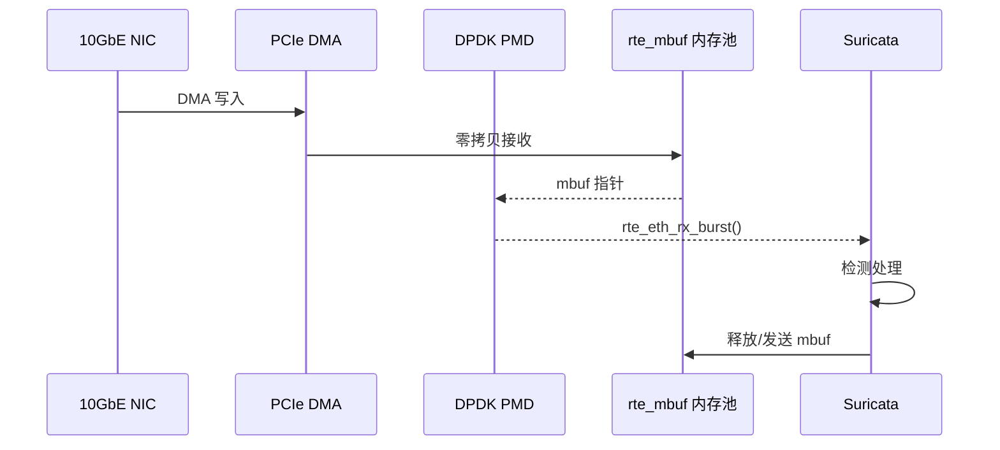

> [!info] Suricata 2026 深度探索系列 0. [[suricata-deep-dive|全栈学习路径总览]]
>
> 1. [[ch1-overview|第一章：Suricata 概述]]
> 2. [[ch2-config|第二章：Suricata 配置系统]]
> 3. [[ch3-runmodes|第三章：Runmodes 运行模式]]
> 4. [[ch4-thread-model|第四章：线程模型]]
> 5. [[ch5-capture|第五章：Capture 初始化]]
> 6. [[ch6-af-packet|第六章：AF-PACKET 接口]]
> 7. [[ch7-pcap|第七章：PCAP 接口]]
> 8. [[ch8-nfq|第八章：NFQ 与 PF_RING 模式]]
> 9. **第九章：DPDK 接口**

---

## 1. DPDK 概述

DPDK (Data Plane Development Kit) 是 Intel 提供的高性能数据包处理框架，通过轮询模式驱动 (Poll Mode Driver) 和大页内存实现接近线速的数据包处理。



### 1.1 DPDK vs AF-PACKET vs PF_RING

| 特性           | AF-PACKET  | PF_RING    | DPDK        |
| :------------- | :--------- | :--------- | :---------- |
| **性能**       | 1-2 Mpps   | 5-10 Mpps  | 10-30 Mpps  |
| **CPU 占用**   | 低         | 中         | 高 (轮询)   |
| **内存拷贝**   | 0 (mmap)   | 1          | 0 (DMA)     |
| **驱动依赖**   | 内核驱动   | PF_RING ZC | DPDK PMD    |
| **配置复杂度** | 低         | 中         | 高          |
| **普适性**     | Linux 原生 | 需安装     | 需 DPDK NIC |

### 1.2 核心技术

- **UIO/VFIO**：用户态 I/O 驱动，绕过内核
- **大页 (Hugepages)**：减少 TLB miss
- **内存池 (mbuf pool)**：预分配固定大小内存块
- **环形缓冲区 (rte_ring)**：无锁生产者/消费者
- **PMD (Poll Mode Driver)**：轮询而非中断

---

## 2. DPDK 配置详解

### 2.1 基础配置

```yaml
# suricata.yaml
runmode: workers
dpdk:
  enabled: yes
```

### 2.2 完整配置项

```yaml
# suricata.yaml
runmode: workers

dpdk:
  enabled: yes

  # 网卡配置
  interfaces:
    - interface: 0000:01:00.0   # PCI 地址
      # 或使用网卡名
      # interface: eth0

      # 线程配置
      threads: 4                 # 每接口线程数

      # 内存配置
      mempool-size: 65535        # mbuf 池大小
      mempool-cache-size: 256     # per-lcore 缓存
      rx-descriptors: 4096       # RX 描述符数
      tx-descriptors: 4096       # TX 描述符数

      # 队列配置
      rx-queues: 4               # RX 队列数
      tx-queues: 4               # TX 队列数

      # 校验和卸载
      checksum-check: 0           # 0=关闭, 1=开启

      # VLAN 处理
      vlan-strip: 1              # 剥离 VLAN 头

  # 内存设置
  eal-params:
    huge-dir: /mnt/huge          # 大页挂载点
    file-prefix: suricata        # 共享内存前缀
    numa-mbere: yes              # NUMA 感知
    socket-limit: 2048           # 每插槽内存限制 (MB)

  # 授信模式 (需 CAP_SYS_ADMIN)
  unprivileged: no               # 非授信模式

  # 授信模式配置
 授信:
    enabled: yes                 # 启用授信模式
    whitelist:                   # 允许的 PCI 设备
      - 0000:01:00.0
      - 0000:01:00.1
```

---

## 3. 源码解析

### 3.1 模块注册

```c
// src/source-dpdk.c — DPDK 模块注册
void TmModuleReceiveDPDKRegister(void)
{
    tmm_modules[TMM_RECEIVEDPDK].name = "ReceiveDPDK";
    tmm_modules[TMM_RECEIVEDPDK].ThreadInit = DPDKThreadInit;
    tmm_modules[TMM_RECEIVEDPDK].Func = DPDKLoop;
    tmm_modules[TMM_RECEIVEDPDK].ThreadDeinit = DPDKThreadDeinit;
    tmm_modules[TMM_RECEIVEDPDK].flags = TM_FLAG_RECEIVE_TM;
}

// DPDK 配置结构体
typedef struct DPDKThreadContext_ {
    /* EAL 相关 */
    int socket_id;               // NUMA 节点
    int numa_mbere;             // NUMA 感知

    /* 端口配置 */
    uint16_t port_id;           // DPDK 端口 ID
    uint16_t queue_id;          // 队列 ID

    /* mbuf 池 */
    struct rte_mempool *mbuf_pool;  // mbuf 内存池

    /* 描述符 */
    uint16_t rx_desc;           // RX 描述符数
    uint16_t tx_desc;           // TX 描述符数

    /* 统计 */
    uint64_t rx_pkts;           // 接收数据包数
    uint64_t rx_bytes;          // 接收字节数
    uint64_t drop;              // 丢弃数
    uint64_t alloc_failed;      // 分配失败数

    ThreadVars *tv;              // 线程变量
} DPDKThreadContext;
```

### 3.2 EAL 初始化

```c
// src/source-dpdk.c — DPDK EAL 初始化
static int DPDKEALInit(DPDKThreadContext *ctx)
{
    int argc = 0;
    char *argv[32];
    char huge_dir[256];
    char file_prefix[64];

    /* 构建 EAL 参数 */
    argv[argc++] = "suricata";

    /* 大页目录 */
    snprintf(huge_dir, sizeof(huge_dir), "/mnt/huge");
    argv[argc++] = "--huge-dir";
    argv[argc++] = huge_dir;

    /* 文件前缀 (用于共享内存) */
    snprintf(file_prefix, sizeof(file_prefix), "suricata");
    argv[argc++] = "--file-prefix";
    argv[argc++] = file_prefix;

    /* NUMA 感知 */
    if (ctx->numa_mbere) {
        argv[argc++] = "--numa-mbere";
    }

    /* 内存限制 */
    if (ctx->socket_limit > 0) {
        argv[argc++] = "--socket-limit";
        char limit[32];
        snprintf(limit, sizeof(limit), "%d", ctx->socket_limit);
        argv[argc++] = limit;
    }

    /* 日志级别 */
    argv[argc++] = "-v";
    argv[argc++] = "7";  // LOG_ERR

    /* 初始化 EAL */
    int ret = rte_eal_init(argc, argv);
    if (ret < 0) {
        SCLogError("rte_eal_init failed: %s", rte_strerror(-ret));
        return -1;
    }

    /* 获取 CPU 核心数 */
    ctx->lcore_count = rte_lcore_count();

    /* 获取 NUMA 节点数 */
    ctx->numa_count = rte_socket_count();

    return 0;
}
```

### 3.3 端口初始化

```c
// src/source-dpdk.c — 端口初始化
static int DPDKPortInit(DPDKThreadContext *ctx, uint16_t port_id)
{
    struct rte_eth_conf port_conf = {
        .rxmode = {
            .mq_mode = RTE_ETH_MQ_RX_NONE,
            .offloads = DEV_RX_OFFLOAD_CHECKSUM |
                        DEV_RX_OFFLOAD_VLAN_STRIP,
        },
        .txmode = {
            .mq_mode = RTE_ETH_MQ_TX_NONE,
        },
    };

    struct rte_eth_dev_info dev_info;
    if (rte_eth_dev_info_get(port_id, &dev_info) != 0) {
        return -1;
    }

    /* 检查驱动是否支持 */
    if (!rte_eth_dev_is_valid_port(port_id)) {
        return -1;
    }

    /* 创建 mbuf 池 */
    char pool_name[64];
    snprintf(pool_name, sizeof(pool_name), "mbuf_pool_%u", port_id);

    ctx->mbuf_pool = rte_pktmbuf_pool_create(
        pool_name,                    // 池名称
        ctx->mempool_size,            // 池大小
        ctx->mempool_cache_size,       // per-lcore 缓存
        0,                             // 私有数据大小
        RTE_MBUF_DEFAULT_BUF_SIZE,    // 数据缓冲区大小
        rte_eth_dev_socket_id(port_id) // NUMA 节点
    );

    if (ctx->mbuf_pool == NULL) {
        SCLogError("rte_pktmbuf_pool_create failed: %s",
                   rte_strerror(rte_errno));
        return -1;
    }

    /* 配置端口 */
    if (rte_eth_dev_configure(port_id, ctx->rx_queues, ctx->tx_queues, &port_conf) < 0) {
        return -1;
    }

    /* 设置 RX 队列 */
    for (int q = 0; q < ctx->rx_queues; q++) {
        ret = rte_eth_rx_queue_setup(
            port_id,                   // 端口 ID
            q,                         // 队列 ID
            ctx->rx_desc,              // 描述符数
            rte_eth_dev_socket_id(port_id),  // NUMA 节点
            NULL,                      // 默认 rx_conf
            ctx->mbuf_pool             // mbuf 池
        );

        if (ret < 0) {
            SCLogError("rte_eth_rx_queue_setup failed: %s",
                       rte_strerror(-ret));
            return -1;
        }
    }

    /* 设置 TX 队列 */
    for (int q = 0; q < ctx->tx_queues; q++) {
        ret = rte_eth_tx_queue_setup(
            port_id, q, ctx->tx_desc,
            rte_eth_dev_socket_id(port_id), NULL
        );

        if (ret < 0) {
            return -1;
        }
    }

    /* 启动端口 */
    if (rte_eth_dev_start(port_id) < 0) {
        return -1;
    }

    /* 设置混杂模式 */
    rte_eth_promiscuous_enable(port_id);

    return 0;
}
```

### 3.4 主循环 (轮询模式)

```c
// src/source-dpdk.c — DPDK 主循环
static TmEcode DPDKLoop(ThreadVars *tv, void *data)
{
    DPDKThreadContext *ctx = (DPDKThreadContext *)data;
    uint16_t port_id = ctx->port_id;
    uint16_t queue_id = ctx->queue_id;

    struct rte_mbuf *mbufs[32];  // 批量接收
    uint16_t nb_rx;

    while (1) {
        /* 轮询接收数据包 */
        nb_rx = rte_eth_rx_burst(
            port_id,               // 端口 ID
            queue_id,              // 队列 ID
            mbufs,                 // mbuf 数组
            32                     // 批量大小
        );

        if (nb_rx == 0) {
            /* 没有数据包，继续轮询 */
            continue;
        }

        /* 处理每个数据包 */
        for (int i = 0; i < nb_rx; i++) {
            struct rte_mbuf *m = mbufs[i];

            /* 获取 Packet */
            Packet *p = PacketGetFromQueueOrAlloc();
            if (p == NULL) {
                rte_pktmbuf_free(m);
                ctx->alloc_failed++;
                continue;
            }

            /* 设置 Packet 数据 */
            p->datalen = rte_pktmbuf_data_len(m);
            p->pktlen = rte_pktmbuf_pkt_len(m);

            /* 获取数据包数据 */
            char *pkt_data = rte_pktmbuf_mtod(m, char *);
            memcpy(p->ext_buffer, pkt_data, p->datalen);
            p->ext_pkt = (uint8_t *)p->ext_buffer;

            /* 获取时间戳 */
            struct rte_ether_hdr *eth = rte_pktmbuf_mtod(m, struct rte_ether_hdr *);
            p->ts.tv_sec = m->timestamp / 1000000000;
            p->ts.tv_usec = (m->timestamp % 1000000000) / 1000;

            /* 存储 mbuf 指针 (用于后续释放) */
            p->dpdk_mbuf = m;

            /* 分发到处理管道 */
            if (TmThreadsSlotVar(tv, p) != TM_ECODE_OK) {
                PacketReturnToPool(p);
                rte_pktmbuf_free(m);
            }

            /* 更新统计 */
            ctx->rx_pkts++;
            ctx->rx_bytes += p->datalen;
        }

        /* 检查退出信号 */
        if (SignalHandlerIsFlagSet(SURIANSIG_TERM)) {
            break;
        }
    }

    return TM_ECODE_OK;
}
```

### 3.5 mbuf 释放

```c
// src/source-dpdk.c — mbuf 释放
static void DPDKReleaseMbuf(Packet *p)
{
    if (p->dpdk_mbuf != NULL) {
        /* 释放 mbuf 回内存池 */
        rte_pktmbuf_free(p->dpdk_mbuf);
        p->dpdk_mbuf = NULL;
    }
}

// 注册清理函数
static void DPDKCleanup(void)
{
    /* 全局清理 */
    DPDKThreadContext *ctx;
    TAILQ_FOREACH(ctx, &dpdk_contexts, next) {
        if (ctx->mbuf_pool) {
            rte_mempool_free(ctx->mbuf_pool);
        }
    }

    /* 关闭 EAL */
    rte_eal_cleanup();
}
```

---

## 4. 大页内存

### 4.1 大页配置

```bash
# 查看当前大页使用
cat /proc/meminfo | grep -i huge

# 配置 2MB 大页 (开发环境)
echo 256 | sudo tee /proc/sys/vm/nr_hugepages

# 配置 1GB 大页 (生产环境)
echo 4 | sudo tee /proc/sys/vm/nr_hugepages

# 挂载大页
mkdir -p /mnt/huge
mount -t hugetlbfs none /mnt/huge

# 永久配置 (/etc/sysctl.conf)
vm.nr_hugepages = 256
```

### 4.2 大页内存布局

```
普通内存 (2MB x 1024 = 2GB)
+---------------------------+
|                           |
+---------------------------+

大页内存 (1GB x 4 = 4GB)
+---------------------------+
| DPDK Heap (mbuf, rings)   |  ← rte_malloc
+---------------------------+
| Physical地址连续           |
+---------------------------+
```

---

## 5. RSS (Receive Side Scaling)

### 5.1 RSS 配置

```yaml
# suricata.yaml
dpdk:
  interfaces:
    - interface: 0000:01:00.0
      rx-queues: 8 # 与 CPU 核心数匹配

      # RSS 配置
      rss:
        enabled: yes
        key: "06d5df6578a45fde9ac2cf2d..." # RSS 密钥
        types:
          - ipv4
          - ipv4-tcp
          - ipv4-udp
          - ipv6
          - ipv6-tcp
          - ipv6-udp
```

### 5.2 RSS Hash 解析

```c
// src/source-dpdk.c — RSS Hash 提取
static void DPDKProcessRssHash(Packet *p, struct rte_mbuf *m)
{
    if (m->ol_flags & PKT_RX_RSS_HASH) {
        p->dpdk_rss_hash = m->hash.rss;

        /* 根据 RSS 类型设置 */
        if (m->ol_flags & PKT_RX_RSS_HASH) {
            if (m->packet_type & RTE_PTYPE_L4_TCP) {
                p->l3.rss_type = DPDK_RSS_TCP;
            } else if (m->packet_type & RTE_PTYPE_L4_UDP) {
                p->l3.rss_type = DPDK_RSS_UDP;
            } else {
                p->l3.rss_type = DPDK_RSS_IPV4;
            }
        }
    }
}
```

---

## 6. 配置 → 源码映射表

| YAML 配置                          | C 变量                      | 源文件          | 说明        |
| :--------------------------------- | :-------------------------- | :-------------- | :---------- |
| `dpdk.enabled`                     | `rte_eal_init()`            | `source-dpdk.c` | 启用 DPDK   |
| `dpdk.interfaces[].interface`      | `rte_eth_dev_configure()`   | `source-dpdk.c` | PCI 地址    |
| `dpdk.interfaces[].threads`        | `queue_id`                  | `source-dpdk.c` | 线程/队列数 |
| `dpdk.interfaces[].mempool-size`   | `rte_pktmbuf_pool_create()` | `source-dpdk.c` | mbuf 池大小 |
| `dpdk.interfaces[].rx-descriptors` | `rte_eth_rx_queue_setup()`  | `source-dpdk.c` | RX 描述符   |
| `dpdk.interfaces[].tx-descriptors` | `rte_eth_tx_queue_setup()`  | `source-dpdk.c` | TX 描述符   |
| `dpdk.eal-params.huge-dir`         | `--huge-dir`                | `source-dpdk.c` | 大页目录    |
| `dpdk.eal-params.numa-mbere`       | `--numa-mbere`              | `source-dpdk.c` | NUMA 感知   |
| `dpdk.unprivileged`                | `rte_eal_init()` 参数       | `source-dpdk.c` | 非授信模式  |

---

## 7. 性能调优

### 7.1 BIOS 设置

```
# BIOS 设置建议
- 启用 Intel VT-d (I/O 虚拟化)
- 禁用 Hyper-Threading (或配置 CPU 亲和性)
- 启用 NUMA
- 设置高性能电源模式
```

### 7.2 内核参数

```bash
# /etc/default/grub
GRUB_CMDLINE_LINUX="intel_iommu=on iommu=pt isolcpus=1-15,17-31 nohz_full=1-15,17-31 rcu_nocbs=1-15,17-31"

# 更新 grub
sudo update-grub

# 重启后验证
cat /proc/cmdline
```

### 7.3 NIC 固件配置

```bash
# 使用 DPDK 工具配置 NIC
./usertools/dpdk-devbind.py --status

# 绑定到 vfio-pci
./usertools/dpdk-devbind.py -b vfio-pci 01:00.0

# 或绑定到 igb_uio
./usertools/dpdk-devbind.py -b igb_uio 01:00.0
```

### 7.4 Suricata 配置

```yaml
# suricata.yaml — 100Gbps 配置
runmode: workers
dpdk:
  enabled: yes

  interfaces:
    - interface: 0000:01:00.0
      threads: 16 # 每接口 16 线程
      rx-queues: 16
      tx-queues: 16
      mempool-size: 131071 # 2^17 - 1
      mempool-cache-size: 512
      rx-descriptors: 8192
      tx-descriptors: 8192

      # 高级选项
      buffer-prealloc: yes # 预分配缓冲区
      scatter: 1 # 启用散射接收
      enable-scatter: 1
```

---

## 8. 故障排除

### 8.1 常见错误

| 错误信息                                         | 原因       | 解决方案                  |
| :----------------------------------------------- | :--------- | :------------------------ |
| `EAL: failed to map hugepage memory`             | 大页不足   | 增加 nr_hugepages         |
| `EAL: PCI: 01:00.0 not found`                    | NIC 未绑定 | 使用 dpdk-devbind.py 绑定 |
| `EAL: Unable to open %s: Cannot allocate memory` | 内存不足   | 减小 mempool-size         |
| `rte_eth_rx_queue_setup: eth_dev is not started` | 端口未启动 | 检查驱动支持              |
| `EAL: No available hugepages...`                 | 大页未挂载 | `mount -t hugetlbfs`      |

### 8.2 调试方法

```bash
# 查看 NIC 状态
./usertools/dpdk-devbind.py --status

# 查看大页使用
cat /proc/meminfo | grep -i huge

# 查看 NUMA
lscpu | grep NUMA

# 使用 testpmd 测试
./build/app/testpmd -l 1-4 -n 4 -- -i
```

---

## 9. 小结

本章解析了 DPDK 接口的完整实现：

1. **EAL 初始化**：rte_eal_init 初始化 DPDK 环境
2. **大页内存**：hugetlbfs 提供物理连续内存，减少 TLB miss
3. **PMD 驱动**：用户态轮询模式，零拷贝 DMA 接收
4. **mbuf 池**：预分配的固定大小内存块，高效管理
5. **RSS 支持**：多队列负载均衡，支持多种哈希类型

DPDK 适合 100Gbps+ 超高性能场景，但配置复杂且需要兼容 NIC。

下一章我们将解析 **多线程抓包与负载均衡**，了解 Suricata 如何协调多个抓包线程实现高性能检测。

---

## 相关章节

- [[ch6-af-packet|第六章：AF-PACKET 接口]]
- [[ch8-nfq|第八章：NFQ 与 PF_RING 模式]]
- [[ch10-loadbalancing|第十章：多线程抓包与负载均衡]]
