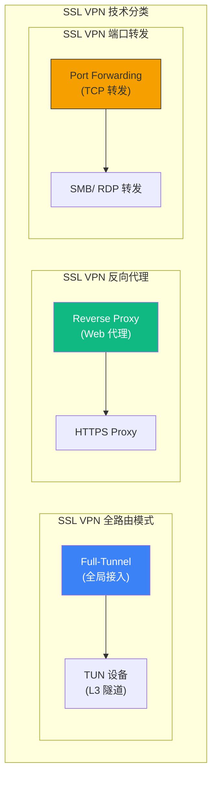
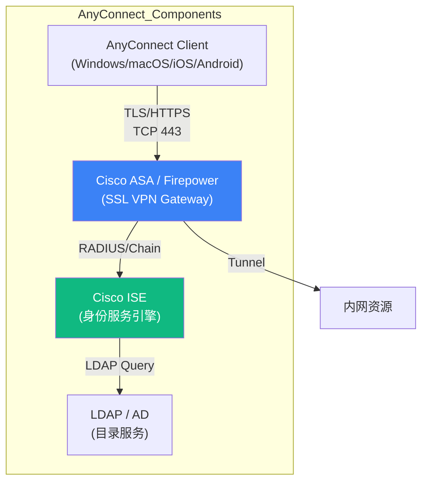

> [!info] VPN 技术深度探索系列 0. [[vpn-deep-dive|全栈学习路径总览]]
>
> 1. [[ch1-vpn-fundamentals|VPN 基础概念]]
> 2. [[ch2-tunnel-basics|第二章：隧道技术基础]]
> 3. [[ch3-crypto-fundamentals|第三章：密码学基础]]
> 4. [[ch4-authentication|第四章：身份认证基础]]
> 5. [[ch5-gre|第五章：GRE 通用路由封装]]
> 6. [[ch6-ipip|SIT 隧道]]
> 7. [[ch7-mpls-vpn|MPLS VPN]]
> 8. [[ch8-vxlan-tunnel|VXLAN 覆盖网络]]
> 9. [[ch9-pptp|第九章：PPTP 点对点隧道]]
> 10. [[ch10-l2tp|第十章：L2TP 第二层隧道]]
> 11. [[ch11-openvpn|OpenVPN 基础]]
> 12. [[ch12-openvpn-advanced|OpenVPN 高级特性]]

---

## 1. 概述：SSL VPN 的定义

**SSL VPN** 是一类基于 TLS/SSL 协议实现远程接入的 VPN 技术。与 IPSec VPN 相比，SSL VPN 的核心优势是**无需安装专用客户端软件**（浏览器即可），以及**精细化的访问控制**。

> [!note]
> **SSL VPN vs OpenVPN**：OpenVPN 是 SSL VPN 的一种实现，但"SSL VPN"通常指更广义的概念——包括基于浏览器的反向代理、企业网关产品（Cisco AnyConnect、Juniper Pulse、Palo Alto GlobalProtect）等。



| 维度             | SSL VPN                 | IPSec VPN         |
| ---------------- | ----------------------- | ----------------- |
| **协议层**       | TLS (L4-L7)             | IPSec (L3)        |
| **客户端**       | 浏览器/Web 或轻量客户端 | 专用客户端        |
| **部署难度**     | 低（浏览器即可）        | 中（需安装软件）  |
| **访问控制粒度** | 应用层（URL/资源）      | 网络层（IP/端口） |
| **NAT 穿透**     | 好（基于 HTTPS）        | 差（需 NAT-T）    |
| **典型场景**     | 远程办公、BYOD          | 企业全面接入      |
| **性能**         | 中等                    | 高                |

---

## 2. SSL VPN 三种接入模式

### 2.1 模式对比

| 模式             | 工作层 | 客户端       | 流量范围   | 典型场景           |
| ---------------- | ------ | ------------ | ---------- | ------------------ |
| **全路由模式**   | L3     | 专用客户端   | 所有流量   | 全面内网访问       |
| **反向代理模式** | L7     | 仅浏览器     | HTTP/HTTPS | Web 应用发布       |
| **端口转发模式** | L4     | Java/ActiveX | 指定端口   | 旧应用（LDAP/SMB） |

### 2.2 全路由模式 (Full Tunnel)

全路由模式创建一条 TLS 隧道，客户端安装 SSL VPN 客户端软件，分配虚拟 IP，所有流量走隧道：

```
SSL VPN 全路由模式架构：

┌─────────────┐    HTTPS (TCP 443)    ┌──────────────┐    内网          ┌──────────────┐
│  远程用户    │◄─────────────────────►│  SSL VPN     │◄──────────────►│   企业内网    │
│  (笔记本)    │    TLS 加密隧道        │   Gateway    │    解密转发      │  10.0.0.0/8  │
│              │                       │ (AnyConnect) │                  │              │
│  tun0:10.8.0.2                     │              │                  │              │
└─────────────┘                       └──────────────┘                  └──────────────┘

# 类似 OpenVPN 的 tun 模式，但使用 TLS 而不是 OpenSSL 自有协议
```

### 2.3 反向代理模式 (Reverse Proxy)

反向代理模式下，用户通过浏览器访问 SSL VPN 网关，网关代为访问内网资源，用户不安装任何客户端：

```
反向代理模式：

┌─────────────┐    HTTPS     ┌──────────────┐    HTTP      ┌──────────────┐
│  远程用户    │◄────────────►│  SSL VPN      │◄───────────►│  内网 Web    │
│  (仅浏览器)  │   Web 访问    │  Gateway      │   网关代访    │  192.168.1.10│
│              │              │  (反向代理)   │              │              │
└─────────────┘              └──────────────┘              └──────────────┘

# 原理：
# 1. 用户访问 https://vpn.company.com/internal/app
# 2. SSL VPN 网关验证身份后
# 3. 向内网 192.168.1.10 发起 HTTP 请求
# 4. 将响应通过 HTTPS 返回给用户

# 典型产品：
# Cisco ASA + WebVPN
# Citrix ADC (NetScaler)
# Apache mod_proxy + SSL
```

### 2.4 端口转发模式 (Port Forwarding)

端口转发模式下，SSL VPN 客户端在本地监听端口，将流量通过 TLS 隧道转发到内网服务：

```
端口转发模式：

┌─────────────┐    localhost:1433   ┌──────────────┐    SQL Query   ┌──────────────┐
│  远程用户    │◄──────────────────►│  SSL VPN      │◄─────────────►│  内网 SQL    │
│  (本地客户端)│   端口转发          │  Client       │   TLS 隧道     │  Server      │
│              │                    │  (插件)        │                │              │
│  localhost:1433  ← MSSQL           │               │                │              │
└─────────────┘                    └──────────────┘                └──────────────┘

# 原理：
# 1. 客户端插件在 localhost:1433 监听
# 2. 应用连接 localhost:1433 (即客户端插件)
# 3. 插件通过 TLS 隧道发送给 SSL VPN 网关
# 4. 网关向内网 SQL Server 发起连接
# 5. 响应通过相同隧道返回

# 支持的应用：
# - MSSQL (TCP 1433)
# - LDAP (TCP 389)
# - SMTP (TCP 25)
# - SMB/CIFS (TCP 445)
# - RDP (TCP 3389)
```

---

## 3. OpenConnect SSL VPN

### 3.1 OpenConnect 协议

**OpenConnect** 是一款开源的 SSL VPN 客户端/服务器，兼容 Cisco AnyConnect 协议：

```bash
# OpenConnect vs Cisco AnyConnect
# OpenConnect 是 AnyConnect 协议的开源实现
# 客户端兼容 Cisco ASA、Juniper SSL VPN、Palo Alto SSL VPN

# OpenConnect 使用：
# - TLS 隧道（基于 HTTPS）
# - DTLS（可选，低延迟音频/视频）
# - CISCO AnyConnect XML profile 配置
```

### 3.2 ocserv 服务器配置

```bash
# 安装 ocserv (OpenConnect server)
apt install ocserv

# /etc/ocserv/ocserv.conf

# 监听端口
tcp-port 443
udp-port 443

# 认证方式
auth = "plain[/etc/ocserv/ocpasswd]"
;auth = "radius[/etc/ocserv/radius.conf]"
;auth = "certificate"        # 证书认证

# 服务器证书（使用 OpenSSL 生成）
server-cert = /etc/ssl/certs/server.crt
server-key = /etc/ssl/private/server.key

# 客户端 IP 池
ipv4-network = 10.10.0.0
ipv4-netmask = 255.255.255.0

# DNS 配置
dns = 8.8.8.8
dns = 8.8.4.4

# 路由推送（全路由）
# route = 0.0.0.0/0     # 全路由
# route = 192.168.1.0/255.255.255.0  # 指定路由

# 持久化隧道（断开重连保持）
keepalive = 300
dpd-idle = 60

# MTU
mtu = 1400

# 同时在线用户
max-clients = 500

# 每个用户多设备登录
max-same-users = 5

# 启动服务
systemctl restart ocserv
```

### 3.3 OpenConnect 客户端

```bash
# Linux 客户端
apt install openconnect

# 连接
sudo openconnect vpn.company.com

# 使用用户名密码
sudo openconnect -u username vpn.company.com

# 使用证书
sudo openconnect -c user.p12 vpn.company.com

# 指定 DTLS（低延迟）
sudo openconnect --dtls vpn.company.com

# 后台运行
sudo openconnect -b vpn.company.com

# 断开连接
sudo killall openconnect

# NetworkManager 集成
nmcli connection import type openconnect file vpn.ovpn
```

### 3.4 Cisco AnyConnect 兼容性

```bash
# OpenConnect 兼容 Cisco ASA
# ASA 配置（简化）：
#
# ! ASA 配置 AnyConnect
# webvpn
#  enable outside
#  enable internal
#  anyconnect-essentials
#  anyconnect image disk0:/anyconnect-win-4.10.00095.pkg
#  anyconnect profiles VPN-Profile disk0:/vpn_profile.xml
#
# group-policy VPN-Policy internal
# group-policy VPN-Policy attributes
#  vpn-tunnel-protocol ssl-client
#  webvpn
#   anyconnect profiles value VPN-Profile
#
# tunnel-group VPN-Tunnel general-attributes
#  default-group-policy VPN-Policy
# tunnel-group VPN-Tunnel webvpn-attributes
#  pre-fill-username u:authenticate
# -always-on-vpn-profilevalue VPN-Profile
```

---

## 4. 企业 SSL VPN 产品

### 4.1 产品对比

| 产品                     | 厂商           | 客户端     | 特点               |
| ------------------------ | -------------- | ---------- | ------------------ |
| **Cisco AnyConnect**     | Cisco          | 专用客户端 | 企业标配，ISE 集成 |
| **GlobalProtect**        | Palo Alto      | 专用客户端 | 与 PAN-OS 深度集成 |
| **Pulse Secure**         | Ivanti/Juniper | 专用客户端 | 多因素认证         |
| **SSL Network Extender** | Check Point    | 无客户端   | 防火墙配套         |
| **Aruba VIA**            | Aruba          | 专用客户端 | WLAN 集成          |

### 4.2 Cisco AnyConnect 架构



### 4.3 Palo Alto GlobalProtect

```bash
# GlobalProtect 架构：
# Portal - 门户，客户端下载、配置管理
# Gateway - 实际流量网关
# 内置于 PAN-OS

# 特点：
# - 与 User-ID 集成（用户名/IP 映射）
# - HIP (Host Information Profile) 检查
# - 反病毒/防火墙联动
# - App-ID 基于应用的策略
```

---

## 5. SSL VPN 安全机制

### 5.1 认证机制

SSL VPN 支持多层认证：

```bash
# SSL VPN 认证因素

# 第一因素：证书
# 客户端安装用户证书
# 服务器验证 CA 签名

# 第二因素：用户名/密码
# AD/LDAP 验证
# RADIUS 验证（TACACS+）

# 第三因素：设备指纹
# Machine Certificate
# Device ID (HIP check)

# 典型企业部署：
# 1. 用户证书（客户端）→ 服务器验证
# 2. AD 域账户 + 密码
# 3. 动态令牌（Duo, RSA SecurID）
# 4. Machine Certificate（设备信任）
```

### 5.2 主机信息检查 (HIP)

**HIP (Host Information Profile)** 在连接前检查客户端安全状态：

```bash
# HIP 检查项：
# - 操作系统版本
# - 防病毒软件安装及版本
# - 病毒库更新时间
# - 防火墙是否启用
# - 磁盘加密状态
# - 注册表键值
# - 运行进程列表

# 典型 HIP 策略：
# deny any-connect if :
#   - antivirus not installed
#   - windows-update disabled > 30 days
#   - disk-not-encrypted
```

### 5.3 精细化访问控制

```bash
# SSL VPN 网关基于 URL/应用的访问控制

# 反向代理模式：
# - 基于 URL 的策略
#   /internal/* → 需要认证 + HIP
#   /hr/* → 需要 HR 组成员
#   /finance/* → 需要 Finance 组 + 证书
#   /public/* → 公开访问

# 全路由模式：
# - 基于 IP/端口的策略
#   10.0.1.0/24:443 → IT 组
#   10.0.2.0/24:3306 → DBA 组
#   10.0.0.0/8:any → Admin 组

# 应用层检查：
# - App-ID (Palo Alto)
# - User-ID (Palo Alto)
# - 浏览器指纹检测
```

---

## 6. SSL VPN 流量分析与识别

### 6.1 识别 SSL VPN 流量

```bash
# SSL VPN 流量特征

# 端口特征：
# - TCP/UDP 443 (与 HTTPS 相同)
# - TCP 4433 (Cisco AnyConnect)
# - UDP 4433 (DTLS)

# TLS 指纹特征：
# - JA3 指纹不同于普通浏览器
# - Client Hello 包含 Cisco AnyConnect/OpenConnect 特有扩展

# Wireshark 过滤：
tcp.port == 443 || udp.port == 443

# JA3 指纹识别：
# Cisco AnyConnect: 32f0... (特定指纹)
# OpenConnect: 167e... (特定指纹)

# 抓包观察：
# 1. TCP 443 连接（TLS 握手）
# 2. 包含 CSTP (AnyConnect) 或 DAT（OpenConnect）头
# 3. 隧道建立后，真正的流量封装在 TLS 内
```

### 6.2 深度检测

```bash
# SSL VPN 检测与防火墙绕过

# 企业防火墙策略：
# 1. 允许 TCP 443（TLS）
# 2. 检查 Server Certificate CN
# 3. JA3 指纹白名单
# 4. 深度检测 TLS 握手后的协议

# GFW 环境下：
# - 商业 VPN 使用自定义 TLS 指纹（类似 AnyConnect）
# - 混淆 TLS 流量特征
# - 使用域前置（Domain Fronting）伪装

# Wireshark 显示过滤器：
# SSL VPN AnyConnect
# ssl.handshake.type == 1 && ssl.extensions_anonymous == 0

# 查看 CSTP 协议（AnyConnect）：
# http.request.uri contains "CSCOSSLC"
# http.request.uri contains "/+CSCOE+/"
```

---

## 7. 典型配置

### 7.1 Apache mod_proxy_ssl (反向代理)

```bash
# 简单的 SSL 反向代理 VPN

# /etc/apache2/sites-available/internal-proxy.conf

<VirtualHost *:443>
    ServerName vpn.company.com

    SSLEngine on
    SSLCertificateFile /etc/ssl/certs/proxy.crt
    SSLCertificateKeyFile /etc/ssl/private/proxy.key
    SSLCACertificateFile /etc/ssl/certs/ca.crt

    # 客户端证书验证（可选）
    SSLVerifyClient require
    SSLVerifyDepth 2

    # 反向代理配置
    ProxyRequests Off
    ProxyPreserveHost On
    ProxyPass /internal/ http://192.168.1.10/
    ProxyPassReverse /internal/ http://192.168.1.10/

    # WebSocket 支持（如果需要）
    RewriteEngine on
    RewriteCond %{HTTP:Upgrade} =websocket [NC]
    RewriteRule ^/ws/(.*)$ ws://192.168.1.10:8080/$1 [P,L]
    RewriteCond %{HTTP:Upgrade} !=websocket [NC]
    RewriteRule ^/ws/(.*)$ http://192.168.1.10:8080/$1 [P,L]

    <Location /internal/>
        # 基本认证
        AuthType Basic
        AuthName "Corporate VPN"
        AuthUserFile /etc/apache2/.htpasswd
        Require valid-user
    </Location>
</VirtualHost>

# 启用模块
a2enmod ssl proxy proxy_http rewrite headers
```

### 7.2 Nginx 反向代理 SSL VPN

```nginx
# /etc/nginx/sites-available/ssl-vpn-proxy

server {
    listen 443 ssl;
    server_name vpn.company.com;

    ssl_certificate /etc/ssl/certs/proxy.crt;
    ssl_certificate_key /etc/ssl/private/proxy.key;
    ssl_client_certificate /etc/ssl/certs/ca.crt;
    ssl_verify_client on;

    # 访问控制
    satisfy any;
    allow 10.0.0.0/8;
    allow 192.168.0.0/16;
    deny all;

    # 代理内网 Web 应用
    location /internal/ {
        proxy_pass http://192.168.1.10/;
        proxy_set_header Host $host;
        proxy_set_header X-Real-IP $remote_addr;
        proxy_set_header X-Forwarded-For $proxy_add_x_forwarded_for;
        proxy_ssl_verify off;
    }

    # TCP 代理（stream 模块）
    # nginx.conf 添加：stream { ... }
    stream {
        upstream sql_server {
            server 192.168.1.20:1433;
        }

        server {
            listen 1433 ssl;
            proxy_pass sql_server;
            ssl_certificate /etc/ssl/certs/proxy.crt;
            ssl_certificate_key /etc/ssl/private/proxy.key;
        }
    }
}
```

### 7.3 开源 SSL VPN 对比

| 方案                     | 协议         | 客户端          | 认证            | 特点             |
| ------------------------ | ------------ | --------------- | --------------- | ---------------- |
| **OpenConnect (ocserv)** | AnyConnect   | 专用/AnyConnect | 证书/PAM/RADIUS | 开源，兼容 Cisco |
| **OpenVPN**              | OpenVPN 专属 | 专用            | 证书/PAM        | 最流行，功能全   |
| **WireGuard**            | WireGuard    | 专用            | PSK/证书        | 现代，最简       |
| **SoftEther**            | 多协议       | 多客户端        | 证书/AD         | 日本开发，多协议 |
| ** strongSwan**          | IPSec        | 专用            | 证书/EAP        | IPSec 企业方案   |

---

## 8. SSL VPN 排错

### 8.1 常见问题

```bash
# 问题 1: "SSL VPN 连接后无法访问内网"
# 原因：
#   - 路由未正确推送
#   - 服务器 NAT/Masquerade 未配置
#   - 客户端防火墙阻断 tun 接口
# 解决：
#   - 服务器检查：iptables -t nat -L -n
#   - 客户端检查：ip route | grep tun

# 问题 2: "浏览器无法访问内网 Web 应用"
# 原因：
#   - 反向代理配置错误
#   - 证书 CN/SAN 不匹配
#   - 代理路径设置错误
# 解决：
#   - 检查 ProxyPass/ProxyPassReverse
#   - 检查 SSL 证书：openssl s_client -connect vpn.company.com:443

# 问题 3: "AnyConnect 报错: License expired"
# 原因：ASA 许可证过期
# 解决：购买/续期 ASA 许可证

# 问题 4: "DTLS 握手失败，回退到 TLS"
# 原因：UDP 443 被防火墙阻断
# 解决：确认防火墙放行 UDP 443

# 问题 5: "HIP 检查失败"
# 原因：客户端不满足安全策略（防病毒未安装等）
# 解决：满足安全要求或联系管理员
```

### 8.2 诊断命令

```bash
# OpenConnect 日志
openconnect -v vpn.company.com

# 查看 TLS 连接
openssl s_client -connect vpn.company.com:443 -servername vpn.company.com

# AnyConnect 诊断（Windows）
# 事件查看器 → 应用程序日志 → AnyConnect

# 查看已建立的 SSL VPN 会话
# Cisco ASA:
show vpn-sessiondb anyconnect

# Palo Alto:
show global-protocols gateway all

# ocserv:
ss -tlnp | grep 443
cat /var/log/ocserv.log
```

---

## 9. 总结

| 维度           | SSL VPN 三种模式                                    |
| -------------- | --------------------------------------------------- |
| **全路由模式** | 安装客户端，全流量 VPN，L3 隧道，类似 OpenVPN/IPSec |
| **反向代理**   | 仅浏览器，无需客户端，适合 Web 应用发布，L7         |
| **端口转发**   | 安装插件，本地端口转发，适合旧协议 (SMB/RDP)        |

| 特性           | SSL VPN 总结                                     |
| -------------- | ------------------------------------------------ |
| **协议基础**   | TLS 1.2/1.3 (HTTPS)                              |
| **NAT 穿透**   | 优秀（基于 443 端口）                            |
| **客户端需求** | 全路由模式需要，轻量级                           |
| **访问控制**   | 精细（URL/IP/应用层）                            |
| **典型产品**   | Cisco AnyConnect, PAN GlobalProtect, OpenConnect |
| **优势**       | 无客户端（反向代理）、精细控制、NAT 好           |
| **劣势**       | 全路由性能低于 IPSec、配置复杂                   |

**本系列 Part III 完结。**

**下一章预告：** [[ch14-ipsec-overview|IPSec 体系概述]] — AH/ESP、传输/隧道模式、SA、SADB、SPD 企业 VPN 事实标准。

---

> [!quote] 参考文献
>
> - Cisco AnyConnect VPN - https://www.cisco.com/c/en/us/products/security/anyconnect-secure-mobility-client
> - OpenConnect - https://www.infradead.org/ocserv/
> - [[ch11-openvpn|OpenVPN 基础 (本系列)]] — SSL VPN 实现
> - [[ch14-ipsec-overview|IPSec 体系概述 (本系列)]] — 企业 VPN 标准
> - [[ch31-tls-cdn|TLS 伪装与 CDN (本系列)]] — TLS 前端/域前置
