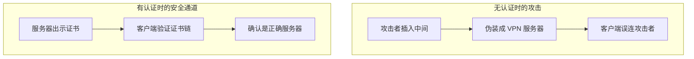
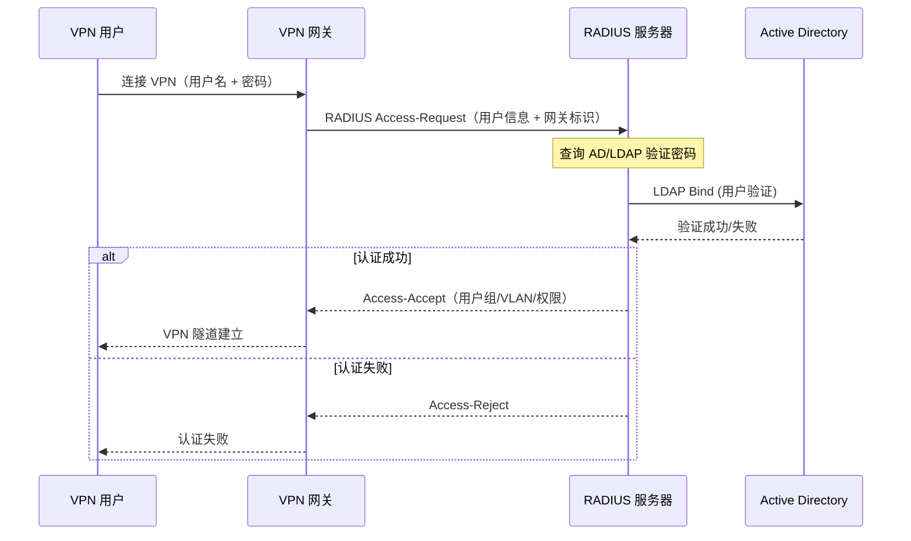
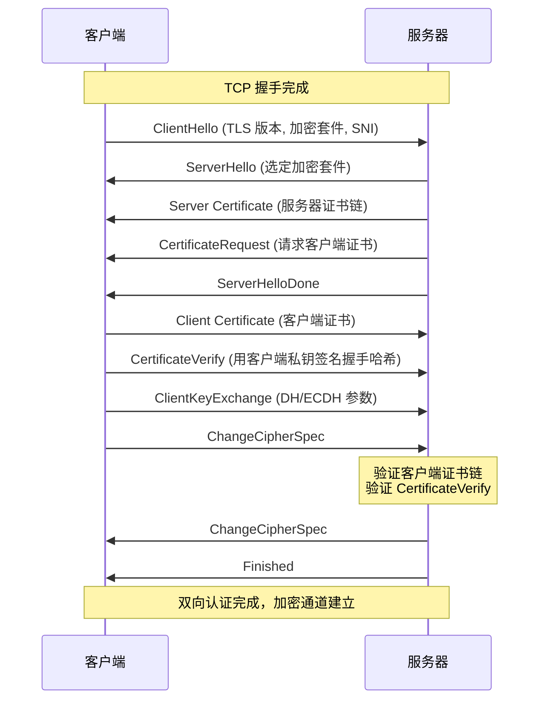

> [!info] VPN 技术深度探索系列 0. [[vpn-deep-dive|全栈学习路径总览]]
>
> 1. [[ch1-vpn-fundamentals|VPN 基础概念]]
> 2. [[ch2-tunnel-basics|第二章：隧道技术基础]]
> 3. [[ch3-crypto-fundamentals|第三章：密码学基础]]
> 4. **第四章：身份认证基础**

---

## 1. 概述：VPN 为什么要认证？

VPN 的核心场景是：**"我怎么知道对面真的是我要连接的 VPN 服务器，而不是一个中间人伪装的？"**

没有身份认证，VPN 存在两个致命漏洞：

| 攻击类型              | 描述                                         | 后果               |
| --------------------- | -------------------------------------------- | ------------------ |
| **中间人攻击 (MITM)** | 攻击者插入在客户端和服务器之间，伪装成服务器 | 攻击者解密所有流量 |
| **伪基站/恶意 VPN**   | 客户端错误连接到攻击者控制的 VPN             | 隐私数据完全泄露   |

VPN 认证的核心目标是：**确保我在和正确的对端通信，且该对端确实被授权访问。**



---

## 2. 预共享密钥 (PSK)

### 2.1 什么是 PSK

**预共享密钥 (Pre-Shared Key, PSK)** 是最简单的认证方式——双方预先持有相同的秘密字符串：

```
客户端 ──► 持有 PSK: "MySecretVPNKey2024"
服务器 ──► 持有 PSK: "MySecretVPNKey2024"
          │
          └── 双方用 PSK 验证对方身份
```

### 2.2 PSK 的使用方式

#### 方式一：直接用于加密/认证

```bash
# WireGuard PSK（称为 "preshared key"）
# /etc/wireguard/wg0.conf

[Peer]
PublicKey = <Server PublicKey>
PresharedKey = <256-bit PSK>   # 额外防护（后量子）
AllowedIPs = 0.0.0.0/0

# PSK 用于：
# 1. 与静态公钥异或，防御针对静态公钥的攻击
# 2. 提供额外密钥层（后量子安全性）
```

#### 方式二：用于密钥派生（更常见）

```bash
# IPSec PSK (IKEv1/IKEv2)
# 两端预共享相同的密钥字符串
# PSK 用于验证 IKE 握手中的身份

# OpenVPN PSK
# static key 模式（已不推荐）
```

### 2.3 PSK 的优缺点

| 优点             | 缺点                             |
| ---------------- | -------------------------------- |
| 简单易用         | 密钥管理困难（每个对端一个 PSK） |
| 无需复杂基础设施 | 无法吊销（密钥泄露后只能改密码） |
| 无证书开销       | 难以规模化管理（n×n 问题）       |
| 适合少量对等连接 | 不支持动态用户认证               |

**PSK 适用场景**：少量服务器间的站点到站点 VPN（通常 ≤ 10 个站点）。

**PSK 不适用场景**：大量远程用户接入（每个用户一个 PSK → 无法审计/吊销）。

---

## 3. PKI 与数字证书

### 3.1 PKI 体系概述

**PKI (Public Key Infrastructure)** 是一套管理公钥、分发、使用数字证书的系统：

```
PKI 核心组件：
┌──────────────────────────────────────────────────────┐
│  CA (Certificate Authority)                         │
│  - 颁发证书                                          │
│  - 吊销证书                                          │
│  - 证明公钥所有权                                    │
└──────────────────────────────────────────────────────┘
        │                    │
        ▼                    ▼
┌─────────────┐        ┌─────────────┐
│  证书签发   │        │  证书验证   │
│ (Issue)     │        │ (Validate)  │
└─────────────┘        └─────────────┘
        │                    │
        ▼                    ▼
┌─────────────────────────────────────────────────────┐
│  RA (Registration Authority) - 可选                │
│  - 审核证书申请者身份                                │
└─────────────────────────────────────────────────────┘
```

### 3.2 数字证书原理

**数字证书**是 CA 签发的**公钥 + 身份信息 + 数字签名**的绑定：

```bash
# 查看证书内容
openssl x509 -in server.crt -text -noout

Certificate:
    Data:
        Version: 3 (0x3)
        Serial Number: 1234567890
    Signature Algorithm: sha256WithRSAEncryption
    Issuer: C=CN, O=MyCompany, CN=MyVPN-CA
    Validity
        Not Before: Jan  1 00:00:00 2024 GMT
        Not After : Dec 31 23:59:59 2025 GMT
    Subject: C=CN, O=MyCompany, CN=vpn.mycompany.com
    Subject Public Key Info:
        Public Key Algorithm: rsaEncryption
        RSA Public-Key: (4096 bit)
        Modulus: 00:bc:34:d8:fa:40:85:3c:a4:76:43:71:...
        Exponent: 65537 (0x10001)
    X509v3 extensions:
        X509v3 Subject Alternative Name:
            DNS:vpn.mycompany.com
            IP Address:203.0.113.10
```

### 3.3 证书信任链

证书通过**链式验证**建立信任：

```
根证书 (Root CA)
  └── 签发了 ──► 中间证书 (Intermediate CA)
                    └── 签发了 ──► 终端实体证书 (Server Certificate)
                                         │
                                         │ 验证过程：
                                         │ 1. 用中间 CA 公钥验证中间证书签名
                                         │ 2. 用根 CA 公钥验证中间证书签名
                                         │ 3. 确认根 CA 在本地信任存储中
                                         │
                                         ▼
                                   证书有效 ✅
```

**本地信任存储**：

```bash
# Linux 系统信任存储
/etc/ssl/certs/ca-certificates.crt  # Debian/Ubuntu
/etc/pki/tls/certs/ca-bundle.crt     # RHEL/CentOS

# 查看系统根 CA
ls /etc/ssl/certs/ | grep -i ca
# ca-certificates.crt
```

### 3.4 自签名证书 vs CA 签名证书

| 类型            | 说明                       | 用途           |
| --------------- | -------------------------- | -------------- |
| **自签名证书**  | 用自己的私钥签发自己的公钥 | 测试、个人 VPN |
| **CA 签名证书** | 由可信 CA 签发             | 正式生产环境   |
| **私有 CA**     | 内部自建 CA 签发           | 企业内网 VPN   |

```bash
# 创建自签名证书（仅测试用）
openssl req -x509 -newkey rsa:4096 -keyout key.pem -out cert.pem \
    -days 365 -nodes \
    -subj "/CN=my-vpn-server"

# 创建私有 CA
openssl genrsa -out ca.key 4096
openssl req -x509 -new -nodes -key ca.key -sha256 \
    -out ca.crt -days 3650 \
    -subj "/CN=MyVPN-CA"

# 用私有 CA 签发服务器证书
openssl genrsa -out server.key 4096
openssl req -new -key server.key -sha256 \
    -out server.csr \
    -subj "/CN=vpn.mycompany.com"

openssl x509 -req -in server.csr -CA ca.crt -CAkey ca.key \
    -CAcreateserial -out server.crt -days 365 -sha256
```

---

## 4. X.509 证书详解

### 4.1 X.509 标准

**X.509** 是 ITU-T 定义的公钥证书标准，VPN 广泛使用：

```bash
# X.509 v3 证书结构
Certificate {
    tbsCertificate {
        version         [0] EXPLICIT Version DEFAULT v1
        serialNumber
        signature       AlgorithmIdentifier
        issuer          Name
        validity        Validity
        subject         Name
        subjectPublicKeyInfo SubjectPublicKeyInfo
        extensions      [3] EXPLICIT Extensions OPTIONAL
    }
    signatureAlgorithm AlgorithmIdentifier
    signatureValue     BIT STRING
}
```

### 4.2 关键字段

#### Serial Number（序列号）

CA 分配的唯一整数，**用于标识和吊销**。同一 CA 签发的每张证书序列号必须唯一：

```bash
openssl x509 -in server.crt -noout -serial
# serial=0x0123456789ABCDEF
```

#### Subject（主体）与 Issuer（签发者）

```
Subject: CN=vpn.mycompany.com, O=MyCompany, C=CN
Issuer:  CN=MyVPN-CA, O=MyCompany, C=CN

验证逻辑：
- "Issuer" 必须匹配 CA 的 "Subject"
- "Subject" 必须匹配要连接的服务器名称（DNS 或 IP）
```

#### Validity（有效期）

证书的时间窗口，超期则无效：

```bash
# 查看有效期
openssl x509 -in server.crt -noout -dates
# notBefore=Jan  1 00:00:00 2024 GMT
# notAfter=Dec 31 23:59:59 2025 GMT
```

#### Subject Alternative Name (SAN)

**SAN** 扩展解决了 "CN 可以是任意名称" 的问题，明确列出证书有效的域名和 IP：

```bash
openssl x509 -in server.crt -noout -text | grep -A2 "Subject Alternative"
# X509v3 Subject Alternative Name:
#     DNS:vpn.mycompany.com, DNS:webmail.mycompany.com
#     IP Address:203.0.113.10
```

**VPN 服务器证书必须有匹配的 SAN**，否则客户端会拒绝连接。

### 4.3 证书类型

| 类型                   | 密钥用途       | VPN 场景          |
| ---------------------- | -------------- | ----------------- |
| **Server Certificate** | 证明服务器身份 | VPN 网关证书      |
| **Client Certificate** | 证明客户端身份 | 企业 VPN 双向认证 |
| **CA Certificate**     | 签发其他证书   | 根 CA / 中间 CA   |

```bash
# 服务器证书扩展（Key Usage）
openssl x509 -in server.crt -noout -text | grep -A1 "Key Usage"
#     Key Usage: Digital Signature, Key Encipherment

# 客户端证书扩展
openssl x509 -in client.crt -noout -text | grep -A1 "Key Usage"
#     Key Usage: Digital Signature, Client Auth
```

### 4.4 证书吊销 (CRL & OCSP)

证书在有效期内可能被吊销（密钥泄露、公司人员变动）：

```bash
# CRL (Certificate Revocation List)
# CA 发布吊销证书序列号列表
openssl verify -crl_check -CAfile ca.crt -CRLfile ca.crl server.crt

# OCSP (Online Certificate Status Protocol)
# 实时查询证书状态（更常用）
openssl s_client -connect vpn.server:443 -status
# OCSP Response:good
```

---

## 5. 证书认证在 VPN 中的应用

### 5.1 IPSec IKEv2 证书认证

```bash
# strongSwan (Linux IPSec) 配置
# /etc/ipsec.conf

conn %default
    leftcert=server.crt        # 服务器证书
    leftca=ca.crt               # 根 CA 证书
    rightcert=client.crt        # 客户端证书（mTLS）

# 服务器验证客户端证书
# 服务器用相同的 CA 验证客户端身份
```

### 5.2 OpenVPN 证书认证

```bash
# OpenVPN 证书结构
# easy-rsa 生成
#          ca.crt (根CA)
#           │
#           ├── sign server → server.crt + server.key
#           └── sign client → client.crt + client.key

# OpenVPN 服务器配置
ca ca.crt           # CA 证书（验证所有客户端）
cert server.crt     # 服务器证书
key server.key      # 服务器私钥
verify-client-cert  require  # 强制客户端证书（mTLS）

# OpenVPN 客户端配置
ca ca.crt           # CA 证书
cert client.crt    # 客户端证书
key client.key     # 客户端私钥
```

### 5.3 WireGuard 证书-less 设计

WireGuard **不使用证书**，而是使用**静态公钥分发**：

```bash
# WireGuard 密钥生成
wg genkey           # 生成私钥（32 字节）
wg pubkey < private # 从私钥导出公钥

# 服务器配置：预置客户端公钥
[Peer]
PublicKey = <Client PublicKey>   # 预共享，无 CA
AllowedIPs = 10.0.0.2/32

# 客户端配置：预置服务器公钥
[Peer]
PublicKey = <Server PublicKey>   # 预共享，无 CA
Endpoint = vpn.example.com:51820
```

**WireGuard 的信任模型**：

- 不是 PKI 的"验证证书链"，而是"信任已知的公钥"
- 新设备接入需要手动添加公钥（Out-of-Band 确认）
- 适合小型团队或基础设施 VPN（而非公众互联网服务）

---

## 6. 企业认证：RADIUS 与 LDAP

### 6.1 RADIUS 协议

**RADIUS (Remote Authentication Dial-In User Service)** 是企业 VPN 最常用的AAA（认证、授权、计费）协议：

```
┌─────────┐    RADIUS     ┌─────────────┐    LDAP     ┌─────────┐
│ VPN     │◄────────────►│  RADIUS     │◄──────────►│ Active  │
│ Gateway │  UDP 1812/    │  Server      │            │ Directory│
│         │  1813        │             │             │         │
└─────────┘               └─────────────┘            └─────────┘
     │                          │
     │  1. 认证请求              │
     │──────────────────────────►│
     │                          │  2. 查询用户
     │                          │───────────►
     │                          │◄───────────
     │  3. Access-Accept/Reject │
     │◄──────────────────────────│
```

**VPN + RADIUS 认证流程**：



### 6.2 RADIUS 属性与 VLAN 分配

RADIUS 可以返回标准属性，动态控制 VPN 用户权限：

```bash
# Cisco IOS RADIUS 配置
aaa authentication vpn group radius
aaa authorization network vpn group radius

# 用户专属 VLAN（RADIUS 返回 Tunnel-Private-Group-ID）
# RADIUS 服务器配置：
#   User = john@company.com
#   Tunnel-Type = VLAN (13)
#   Tunnel-Medium-Type = 802
#   Tunnel-Private-Group-ID = 100

# 结果：John VPN 接入后被分到 VLAN 100（工程部）
```

### 6.3 EAP 扩展认证

**EAP (Extensible Authentication Protocol)** 是 RADIUS 的认证框架，支持多种认证方法：

| EAP 方法         | 说明           | VPN 场景     |
| ---------------- | -------------- | ------------ |
| **EAP-MSCHAPv2** | 密码挑战响应   | 传统企业 VPN |
| **EAP-TLS**      | 客户端证书认证 | 高安全 mTLS  |
| **EAP-GTC**      | 通用令牌卡     | RSA SecurID  |
| **EAP-PEAP**     | 保护的用户密码 | 通用兼容     |

```bash
# IPSec IKEv2 + EAP 配置 (strongSwan)
# /etc/ipsec.conf

conn ikev2-eap
    rightauth=eap-radius        # 委托 RADIUS 认证
    eap_identity=%any           # 使用用户标识

# RADIUS 服务器处理 EAP 协商
# 支持 PAP/CHAP/MSCHAPv2/EAP-TLS 等
```

### 6.4 LDAP 目录集成

**LDAP (Lightweight Directory Access Protocol)** 通常与 RADIUS 配合，存储用户账号信息：

```bash
# Linux RADIUS + LDAP 配置
# /etc/raddb/modules/ldap

ldap {
    server = "ldap://ad.company.com"
    identity = "cn=vpn-service,ou=services,dc=company,dc=com"
    password = "service-password"

    base_dn = "ou=users,dc=company,dc=com"
    filter = "(sAMAccountName=%{User-Name})"
}
```

---

## 7. 双因素认证 (2FA)

### 7.1 VPN 2FA 的必要性

用户名+密码是单因素认证，存在密码泄露风险。企业 VPN 应支持双因素：

| 因素类型 | 示例                   | 认证方式 |
| -------- | ---------------------- | -------- |
| 知道的   | 密码、PIN              | 知识     |
| 拥有的   | 手机、硬件令牌、智能卡 | 持有     |
| 是谁     | 指纹、面部             | 固有     |

### 7.2 TOTP：基于时间的一次性密码

**TOTP (Time-based One-Time Password)** 是最流行的 2FA 方法：

```
TOTP 算法：
TOTP = HOTP(K, T)
  K = 共享密钥（用户与服务器各持一份）
  T = floor(当前 Unix 时间 / 30)
  HOTP = HMAC-SHA1(K, T) 的动态截断值

用户手机上安装 Google Authenticator / Authy：
  每 30 秒生成 6 位数字验证码
  用户输入密码 + 验证码 → 双因素
```

### 7.3 VPN + 2FA 集成

```bash
# OpenVPN + Google Authenticator (OATH-TOTP)
# PAM 认证模块
pam_auth = system + GoogleAuth

# 用户登录过程：
# 1. 输入用户名 + 密码（第一因素）
# 2. 输入 6 位 TOTP 验证码（第二因素）
# 3. VPN 网关验证两者 → 允许/拒绝

# strongSwan + EAP-g噕e
# 配置 Duo Security / RSA SecurID
```

---

## 8. mTLS：双向 TLS 认证

### 8.1 什么是 mTLS

**mTLS (Mutual TLS)** 是 TLS 的扩展——客户端和服务器**互相验证证书**：

```
普通 TLS（单向认证）：
  客户端 ──► 验证服务器证书 ──► 确认服务器身份 ✅
  ◄── 服务器不验证客户端身份

mTLS（双向认证）：
  客户端 ──► 验证服务器证书 ──► 确认服务器身份 ✅
  服务器 ──► 验证客户端证书 ──► 确认客户端身份 ✅
  ◄── 双方互相认证
```

### 8.2 mTLS 握手过程



### 8.3 mTLS 在 VPN 中的应用

```bash
# IPSec mTLS（证书双向认证）
# 服务器和客户端都持有证书

# /etc/ipsec.conf (strongSwan)
conn ikev2-cert
    leftauth=pubkey         # 服务器用公钥认证
    rightauth=pubkey        # 客户端用公钥认证
    leftcert=server.crt     # 服务器证书
    rightcert=client.crt    # 客户端证书（强制）

# OpenVPN mTLS
# 双向证书认证
ca ca.crt         # 根CA
cert server.crt   # 服务器证书
key server.key   # 服务器私钥
crl-verify crl.pem  # 吊销列表

# 客户端必须持有有效的客户端证书
```

---

## 9. 认证方案选型

### 9.1 按场景选型

| 场景              | 推荐认证方案         | 说明               |
| ----------------- | -------------------- | ------------------ |
| 个人 VPN          | PSK 或自签名证书     | 简单，无 CA 开销   |
| 小型团队 (3-10人) | WireGuard 静态公钥   | 无证书，最简方案   |
| 企业远程接入      | RADIUS + AD + 2FA    | 集中管理，完整审计 |
| 高安全场景        | mTLS (证书双向认证)  | 最强身份保证       |
| 公众互联网 VPN    | 商业 CA + 客户端证书 | 信任链完整         |

### 9.2 认证强度对比

```
认证强度 (弱 → 强)：

1. 仅密码 (PAP)           ❌ 不推荐，密码明文传输
2. 密码 + 服务器证书       ✅ 基本安全（无客户端认证）
3. PSK                    ✅ 简单场景（静态共享）
4. 客户端证书 (mTLS)       ✅✅ 高安全（双向认证）
5. mTLS + 2FA             ✅✅✅ 最强（生物/硬件令牌）

企业 VPN 推荐：
  服务器证书验证 + RADIUS(AD) + TOTP 2FA
  = 高安全 + 集中管理 + 动态用户控制
```

---

## 10. 总结：VPN 认证全景

|                 | 认证方式            | 核心原理       | 适用场景 |
| --------------- | ------------------- | -------------- | -------- |
| **PSK**         | 预共享相同密钥      | 小型站点到站点 |
| **自签名证书**  | 自签公钥证明        | 测试、个人 VPN |
| **PKI + CA**    | 证书链验证身份      | 企业 VPN       |
| **RADIUS + AD** | 集中用户管理 + 密码 | 企业远程接入   |
| **mTLS**        | 双向证书认证        | 高安全 VPN     |
| **2FA**         | 密码 + 动态令牌     | 高安全远程访问 |

**认证的核心原则**：

1. VPN 服务器必须被客户端验证（防止伪基站）
2. 高安全场景应使用双向认证（mTLS）
3. 企业场景用 RADIUS/AD 集中管理用户
4. 证书吊销机制（CRL/OCSP）必须配置

**下一章预告：** [[ch5-gre|第五章：GRE 通用路由封装]] — GRE 头格式、键控 GRE、PMTUD、NHS 配置。

---

> [!quote] 参考文献
>
> - [[2026-03-12-ipsec-protocol-deep-dive|IPSec 协议深度解析]] — IKEv2 认证
> - [[2026-03-12-wireguard-protocol-deep-dive|WireGuard 协议深度解析]] — 静态密钥模型
> - [[ch3-crypto-fundamentals|第三章：密码学基础]] — 数字签名原理
