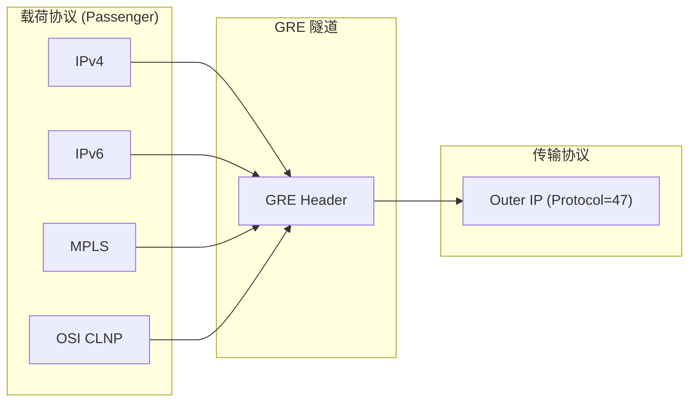
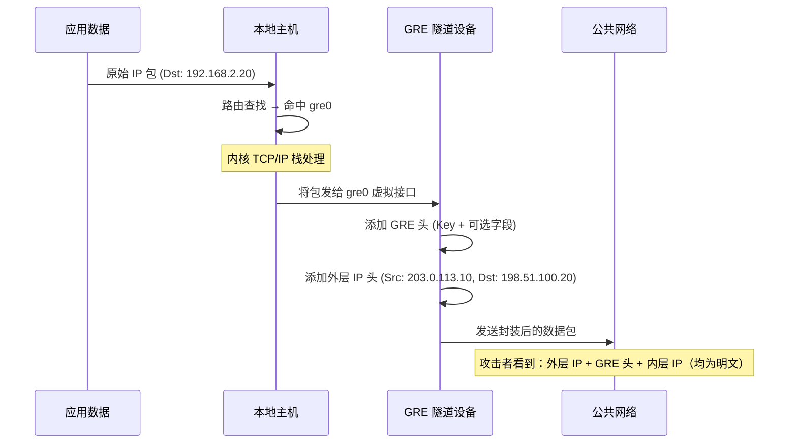
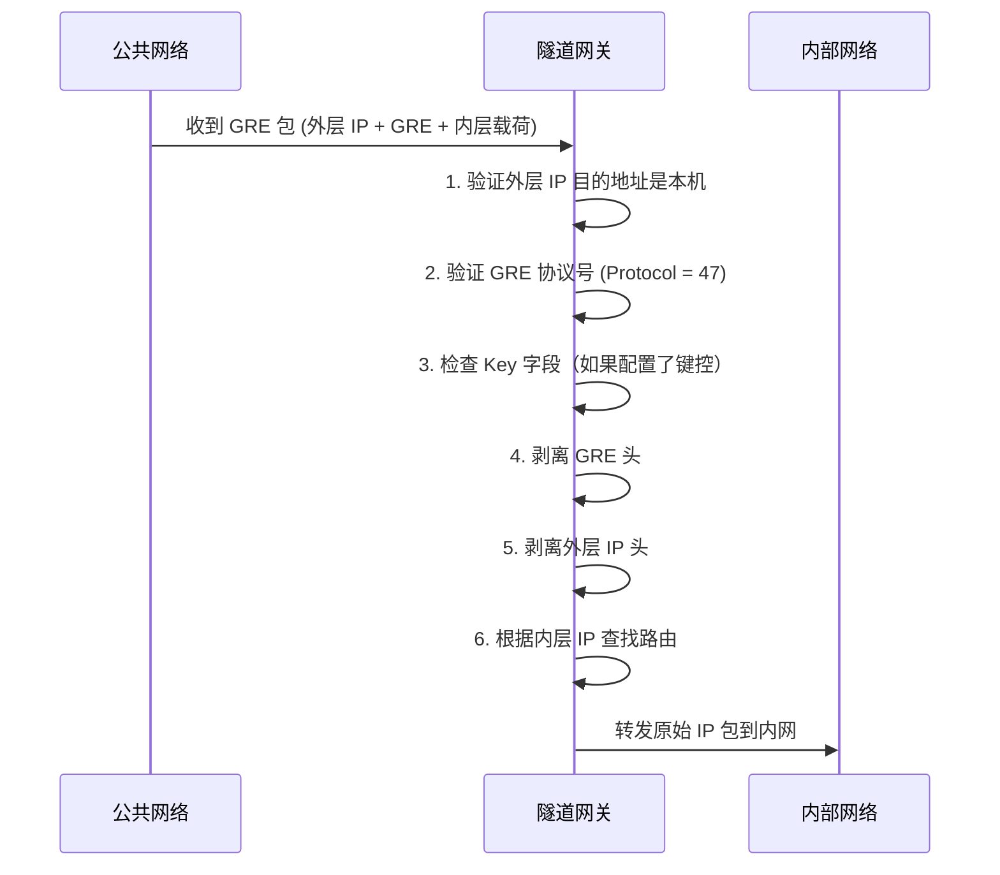

> [!info] VPN 技术深度探索系列 0. [[vpn-deep-dive|全栈学习路径总览]]
>
> 1. [[ch1-vpn-fundamentals|VPN 基础概念]]
> 2. [[ch2-tunnel-basics|第二章：隧道技术基础]]
> 3. [[ch3-crypto-fundamentals|第三章：密码学基础]]
> 4. [[ch4-authentication|第四章：身份认证基础]]

---

## 1. 概述：GRE 是什么

**GRE (Generic Routing Encapsulation)** 是 Cisco 在 1994 年提出的隧道协议（RFC 1701/1702），目的是**将任意网络层协议封装在任意其他网络层协议中**，实现超越简单 IP-in-IP 的灵活组网。

GRE 的核心价值：

| 特性           | 说明                                 |
| -------------- | ------------------------------------ |
| **多协议封装** | 可承载 IPv4/IPv6/MPLS/OSI 等多种协议 |
| **无状态隧道** | 隧道端点不需要维护隧道状态           |
| **灵活扩展**   | 可选 Key、Sequence Number、Checksum  |
| **无内置加密** | 通常需配合 IPSec 使用                |



---

## 2. GRE 头格式详解

### 2.1 GRE 头结构

GRE 头本身没有固定长度——通过**可选字段**实现扩展：

```
┌─────────────────────────────────────────────────────────────────┐
│  外层 IP Header (Protocol = 47)                                 │
├─────────────────────────────────────────────────────────────────┤
│  GRE Header                                                      │
│  ┌────────────────────────────────────────────────────────────┐  │
│  │ C | R | K | S | s │ Recursion Control |  Flags | Ver = 0  │  │
│  ├────────────────────────────────────────────────────────────┤  │
│  │  Protocol Type (2 bytes)                                    │  │
│  ├────────────────────────────────────────────────────────────┤  │
│  │  Checksum (可选, 2 bytes)     - 仅当 R=1 时                 │  │
│  ├────────────────────────────────────────────────────────────┤  │
│  │  Offset (可选, 2 bytes)       - 仅当 R=1 时                 │  │
│  ├────────────────────────────────────────────────────────────┤  │
│  │  Key (可选, 4 bytes)          - 仅当 K=1 时                 │  │
│  ├────────────────────────────────────────────────────────────┤  │
│  │  Sequence Number (可选, 4 bytes) - 仅当 S=1 时             │  │
│  └────────────────────────────────────────────────────────────┘  │
├─────────────────────────────────────────────────────────────────┤
│  内层载荷 (Encapsulated Packet)                                  │
└─────────────────────────────────────────────────────────────────┘
```

### 2.2 GRE 头字段详解

| 字段                        | 位         | 说明                                                      |
| --------------------------- | ---------- | --------------------------------------------------------- |
| **C (Checksum)**            | Bit 0      | 1=存在 Checksum 字段                                      |
| **R (Routing)**             | Bit 1      | 1=存在路由字段（已废弃）                                  |
| **K (Key)**                 | Bit 2      | 1=存在 Key 字段（区分隧道流）                             |
| **S (Sequence)**            | Bit 3      | 1=存在 Sequence Number（序列化）                          |
| **s (Strict Source Route)** | Bit 4      | 严格源路由（已废弃）                                      |
| **Recursion Control**       | Bits 5-7   | 允许的封装深度（防环路）                                  |
| **Flags**                   | Bits 8-12  | 保留，必须为 0                                            |
| **Version**                 | Bits 13-15 | 必须为 0                                                  |
| **Protocol Type**           | 16 bits    | 载荷协议类型（Ethernet=0x6558, IPv4=0x0800, IPv6=0x86DD） |

### 2.3 常见 Protocol Type

```bash
# RFC 1702 定义的协议类型
0x0800   # IPv4
0x86DD   # IPv6
0x6558   # Transparent Ethernet Bridging
0x8847   # MPLS Unicast
0x8848   # MPLS Multicast
0xFEFE   # OSI CLNP
0xFFFE   # OSI ESIS
```

---

## 3. 键控 GRE (Keyed GRE)

### 3.1 为什么需要 Key

**Key 字段**是 GRE 最重要的扩展——它允许在同一条隧道上通过**多路复用**区分不同的流量流：

```bash
# 无键控 GRE
ip tunnel add gre0 mode gre local 203.0.113.10 remote 198.51.100.20
# 所有流量走同一个隧道，无法区分来源应用

# 键控 GRE
ip tunnel add gre0 mode gre local 203.0.113.10 remote 198.51.100.20 key 0x12345678
# 通过 Key 字段区分不同流
```

### 3.2 Key 的实际用途

```
Site A                                         Site B
┌─────────────┐                               ┌─────────────┐
│  Voice GRE  │ ← Key=0x00000001 ──────────►│  Voice GRE  │
│  Data GRE   │ ← Key=0x00000002 ──────────►│  Data GRE   │
│  Video GRE  │ ← Key=0x00000003 ──────────►│  Video GRE  │
└─────────────┘                               └─────────────┘

# 三个逻辑隧道共享同一条物理 GRE 隧道
# 运营商路由器根据 Key 字段区分服务类型（QoS）
```

### 3.3 Linux 配置键控 GRE

```bash
# 创建键控 GRE 隧道
ip tunnel add gre0 mode gre \
    local 203.0.113.10 \
    remote 198.51.100.20 \
    key 0x12345678

# 或使用 iproute2 方式
ip link add gre0 type gre \
    local 203.0.113.10 \
    remote 198.51.100.20 \
    key 0x12345678

# 验证配置
ip -d link show gre0

# gre0: gre-tap@NONE, key 0x12345678, ...
#     link/gre 203.0.113.10 key 0x12345678 peer 198.51.100.20

# 设置隧道 IP
ip addr add 10.0.0.1/30 dev gre0
ip link set gre0 up
```

---

## 4. GRE 封装与解封装过程

### 4.1 封装过程（发送方向）



### 4.2 GRE 封装数据包示例

```bash
# 用 tcpdump 抓包查看 GRE 封装
tcpdump -i eth0 -nn host 203.0.113.10

# 捕获的数据包结构
IP 203.0.113.10 > 198.51.100.20: GRE, key 0x12345678, seq 100
    IP 192.168.1.10 > 192.168.2.20: ICMP echo request
```

### 4.3 解封装过程（接收方向）



---

## 5. GRE 的特性与限制

### 5.1 GRE 的优势

| 特性           | 说明                                      |
| -------------- | ----------------------------------------- |
| **多协议支持** | 可封装 IPv4/IPv6/Ethernet/MPLS/OSI 等     |
| **广泛支持**   | 几乎所有厂商路由器、Linux、Windows 均支持 |
| **无状态**     | 端点不需要维护连接状态                    |
| **灵活扩展**   | 可选 Key、Sequence、Checksum              |
| **低开销**     | 仅 4-24 字节 GRE 头                       |

### 5.2 GRE 的限制

| 限制             | 说明                            |
| ---------------- | ------------------------------- |
| **无加密**       | 载荷完全明文传输                |
| **无身份认证**   | 无法验证对端身份                |
| **无完整性保护** | 数据可被篡改                    |
| **NAT 兼容差**   | GRE 本身不是 UDP，穿越 NAT 困难 |
| **MTU 问题**     | 封装后包增大，可能触发分片      |

### 5.3 GRE vs IPIP 对比

|            | GRE            | IPIP          |
| ---------- | -------------- | ------------- |
| 协议号     | IP Protocol 47 | IP Protocol 4 |
| 多协议封装 | 是             | 否（仅 IPv4） |
| Key 字段   | 有（可选）     | 无            |
| Checksum   | 有（可选）     | 无            |
| Sequence   | 有（可选）     | 无            |
| NAT 穿越   | 差             | 差（但稍好）  |
| 典型用途   | 运营商骨干网   | 简单站点互联  |

---

## 6. GRE 与 IPSec 配合

### 6.1 为什么 GRE 需要 IPSec

GRE 本身**不提供任何加密或认证**，因此在生产环境中通常与 IPSec 配合使用：

```bash
# GRE over IPSec 封装顺序：
# 1. 原始数据包 → GRE 封装
# 2. GRE 包 → IPSec ESP 加密
# 3. ESP 包 → 外层 IP（发送到 IPSec 对端）

# 封装结构（隧道模式）：
# ┌──────────────────────────────────────────────────────┐
# │  外层 IP Header (Dst: IPSec GW)                      │
# ├──────────────────────────────────────────────────────┤
# │  ESP Header                                          │
# ├──────────────────────────────────────────────────────┤
# │  GRE Header                                          │
# ├──────────────────────────────────────────────────────┤
# │  内层 IP Header (原始Src/Dst)                        │
# ├──────────────────────────────────────────────────────┤
# │  载荷数据 (加密)                                      │
# ├──────────────────────────────────────────────────────┤
# │  ESP Trailer + ICV (完整性)                          │
# └──────────────────────────────────────────────────────┘
```

### 6.2 GRE over IPSec 的优势

```
传统 IPSec 隧道模式的问题：
  - 无法承载多协议（仅限 IP）
  - 无法使用动态路由协议（OSPF/BGP over IPSec 需要 GRE）

GRE + IPSec 的解决方案：
  ┌──────────┐
  │ OSPF/BGP │  ← 支持动态路由
  ├──────────┤
  │   GRE    │  ← 多协议封装
  ├──────────┤
  │  IPSec   │  ← 加密保护
  ├──────────┤
  │   IP     │  ← 网络传输
  └──────────┘
```

### 6.3 Cisco 配置示例

```cisco
! Cisco IOS: GRE over IPSec
interface Tunnel0
 ip address 10.0.0.1 255.255.255.252
 tunnel source 203.0.113.10
 tunnel destination 198.51.100.20
 tunnel mode gre ip              // GRE over IP

! OSPF 通过 GRE 隧道运行
router ospf 1
 network 10.0.0.0 0.0.0.3 area 0

! IPSec 保护 GRE 流量
crypto ipsec profile gre-vpn
 set transform-set ESP-AES-GCM
 interface Tunnel0
 tunnel protection ipsec profile gre-vpn
```

### 6.4 Linux 配置 GRE + IPSec

```bash
# 1. 创建 GRE 隧道
ip tunnel add gre0 mode gre local 203.0.113.10 remote 198.51.100.20 key 0x12345678

# 2. 设置 IP（用于隧道管理）
ip addr add 10.0.0.1/30 dev gre0
ip link set gre0 up

# 3. 创建 IPSec 策略（保护 GRE 流量）
ip xfrm policy add \
    src 203.0.113.10/32 dst 198.51.100.20/32 \
    dir out \
    tmpl proto gre mode tunnel

ip xfrm policy add \
    src 198.51.100.20/32 dst 203.0.113.10/32 \
    dir in \
    tmpl proto gre mode tunnel

# 4. 设置 ESP 加密（使用 aes-gcm）
ip xfrm state add \
    src 203.0.113.10 dst 198.51.100.20 \
    proto esp spi 0x1000 \
    enc aes-gcm '00:01:02:03:04:05:06:07:08:09:0a:0b:0c:0d:0e:0f' \
    auth esn

# 5. 路由流量通过 GRE
ip route add 192.168.2.0/24 dev gre0
```

---

## 7. GRE 的 PMTUD 问题

### 7.1 Path MTU Discovery 与 GRE

GRE 封装会增加额外头部，可能导致数据包超过路径 MTU：

```bash
# 问题示例：
# 以太网 MTU: 1500 bytes
# 内层 IP 包: 1500 bytes
# GRE 头: 4 bytes (无可选字段)
# 外层 IP 头: 20 bytes
# 总计: 1500 + 4 + 20 = 1524 bytes → 需要分片

# 但 IPSec 还会增加更多开销：
# ESP Header: 8-12 bytes
# ESP Trailer: 2-3 bytes
# ESP ICV: 12-16 bytes (AES-GCM)
# 最终: 1500 + 4 + 20 + 8 + 16 = 1548 bytes
```

### 7.2 GRE 的 DF Bit 处理

```bash
# 默认：GRE 会清除内层数据包的 DF bit，允许分片
# 如果需要保留 DF bit（在某些场景下）：
ip link set gre0 nopmtudisc

# 或者手动设置 PMTUD
# 外层 IP 头设置 DF=1，内层 IP 头也保持 DF=1
# 当路径 MTU 不足时，外层 IP 会产生 ICMP Fragmentation Needed
```

### 7.3 MTU 配置建议

```bash
# GRE 隧道 MTU 计算
# 推荐隧道 MTU = 外层物理接口 MTU - GRE头 - 外层IP头

# 例如外层 eth0 MTU = 1500
# GRE (无选项) = 4 bytes
# 外层 IP = 20 bytes
# 推荐 GRE MTU = 1500 - 4 - 20 = 1476

ip link set gre0 mtu 1476

# 如果 GRE over IPSec：
# ESP over UDP = 8 bytes (NAT-T)
# ESP Header = 8 bytes
# ESP ICV (AES-GCM) = 16 bytes
# 推荐 MTU = 1500 - 4 - 20 - 8 - 8 - 16 = 1444
ip link set gre0 mtu 1444
```

---

## 8. GRE 的典型应用场景

### 8.1 站点到站点 VPN

```
Site A (北京)                                  Site B (上海)
┌─────────────┐    Internet (GRE+IPSec)    ┌─────────────┐
│   Router A  │◄══════════════════════════►│   Router B  │
│  GRE Tunnel │                             │  GRE Tunnel │
└─────────────┘                             └─────────────┘
      │                                            │
      ▼                                            ▼
┌─────────────┐                             ┌─────────────┐
│  内部网络   │                             │  内部网络   │
│ 10.1.0.0/16 │                             │ 10.2.0.0/16 │
└─────────────┘                             └─────────────┘

# 两地内部网络通过 GRE 隧道互通
# IPSec 加密保护 GRE 流量
# 可在 GRE 上运行 OSPF 实现动态路由
```

### 8.2 动态路由协议穿越 NAT

GRE 的一个重要用途是让**动态路由协议（OSPF/BGP）**能够穿越 NAT 环境：

```bash
# 问题：OSPF 是多播协议，NAT 无法处理多播
# 解决：用 GRE 隧道将多播流量封装在单播 GRE 中

# Router A 配置
ip tunnel add tunnel0 mode gre \
    local 192.168.1.10    # NAT 后的私网 IP
    remote 203.0.113.20   # 公网 IP

# OSPF 通过 GRE 隧道建立邻居
router ospf 1
 network 10.0.0.0 0.0.0.3 area 0
```

### 8.3 MPLS VPN 骨干网穿越

运营商使用 GRE 在 MPLS 骨干网上承载客户流量：

```
Customer A Site                    Customer A Site
┌──────────┐                     ┌──────────┐
│  CE 路由  │◄───── MPLS VPN ─────►│  CE 路由  │
└────┬─────┘                     └────┬─────┘
     │                                  │
     │ GRE                              │ GRE
     ▼                                  ▼
┌─────────────────────────────────────────────┐
│           运营商 MPLS 骨干网                  │
│  (Label Switched Path, 使用 MPLS 转发)       │
└─────────────────────────────────────────────┘
```

---

## 9. Linux GRE 高级配置

### 9.1 GRE 隧道与 sysctl 参数

```bash
# 启用 GRE 转发
sysctl -w net.ipv4.conf.all.forwarding=1
sysctl -w net.ipv4.conf.gre0.forwarding=1

# 启用 IPv6 GRE（如需要）
sysctl -w net.ipv6.conf.all.forwarding=1

# 设置 TTL
ip link set gre0 ttl 64

# 设置 TOS（复制内层或手动指定）
ip link set gre0 tos 0x23

# 隧道毛毛虫（draft）：
# 用于非对称路由场景
ip link set gre0 nopmtudisc
```

### 9.2 GRE 隧道状态监控

```bash
# 查看 GRE 隧道接口
ip -d link show type gre

# 查看隧道统计
ip -s link show gre0

# 查看路由（确认流量走隧道）
ip route show dev gre0

# 用 ip neighbor 查看 ARP（对于以太网封装模式）
ip neigh show dev gre0
```

### 9.3 GRE 隧道的 iptables 规则

```bash
# 允许 GRE 入站
iptables -A INPUT -p gre -j ACCEPT

# 或针对特定对端
iptables -A INPUT -p gre -s 198.51.100.20 -j ACCEPT

# 如果使用键控 GRE，还需放行 IPSec ESP
iptables -A INPUT -p esp -s 198.51.100.20 -j ACCEPT
iptables -A INPUT -p udp --dport 4500 -j ACCEPT  # NAT-T
```

---

## 10. GRE 排错指南

### 10.1 常见问题与解决方案

| 问题             | 原因            | 解决                           |
| ---------------- | --------------- | ------------------------------ |
| GRE 隧道 up/down | 路由问题/防火墙 | 检查外层路由、确认 GRE 端口 47 |
| 隧道通但无流量   | 路由未指向隧道  | 检查 `ip route`                |
| PMTUD 失败       | ICMP 被屏蔽     | 配置 MSS Clamping              |
| 键控 GRE 不通    | Key 不匹配      | 两端 Key 必须一致              |
| OSPF 邻居不起来  | 多播被 NAT 屏蔽 | 改用 GRE 封装多播              |

### 10.2 排错命令汇总

```bash
# 1. 检查隧道接口状态
ip link show gre0
ip addr show gre0

# 2. 测试外层连通性
ping -I 203.0.113.10 198.51.100.20

# 3. 测试隧道连通性
ping -I 10.0.0.1 10.0.0.2

# 4. 抓包分析
tcpdump -i eth0 -nn host 203.0.113.10 and proto 47
tcpdump -i gre0 -nn

# 5. 检查路由
ip route get 192.168.2.20 via 10.0.0.2 dev gre0

# 6. 检查 IPSec 状态（如果使用）
ip xfrm state list
ip xfrm policy list

# 7. 检查系统 GRE 模块
lsmod | grep gre
cat /proc/net/gre
```

---

## 11. 总结

|              | GRE 关键知识点                                  |
| ------------ | ----------------------------------------------- |
| **协议定位** | L3 隧道协议，IP Protocol 47                     |
| **头格式**   | 4 字节最小，可选 Key(4B)、Seq(4B)、Checksum(4B) |
| **核心优势** | 多协议封装、无状态、广泛兼容                    |
| **核心缺陷** | 无加密、无认证、明文传输                        |
| **最佳拍档** | IPSec（GRE over IPSec 封装）                    |
| **MTU 注意** | 需预留 GRE 头(4-24B) + 外层IP(20B) 开销         |
| **典型场景** | 站点互联、动态路由、NAT 穿越、MPLS 接入         |

**下一章预告：** [[ch6-ipip|SIT 隧道]] — IP in IP 封装、6to4/4to6/ISATAP 隧道协议。

---

> [!quote] 参考文献
>
> - [[ch17-gre|GRE 隧道 (Kernel Protocol Stack)]] — 内核 GRE 实现
> - RFC 1701 - Generic Routing Encapsulation (GRE)
> - RFC 1702 - Generic Routing Encapsulation over IPv4 networks
> - RFC 2784 - Generic Routing Encapsulation (GRE) (Obsoletes RFC 1701)
