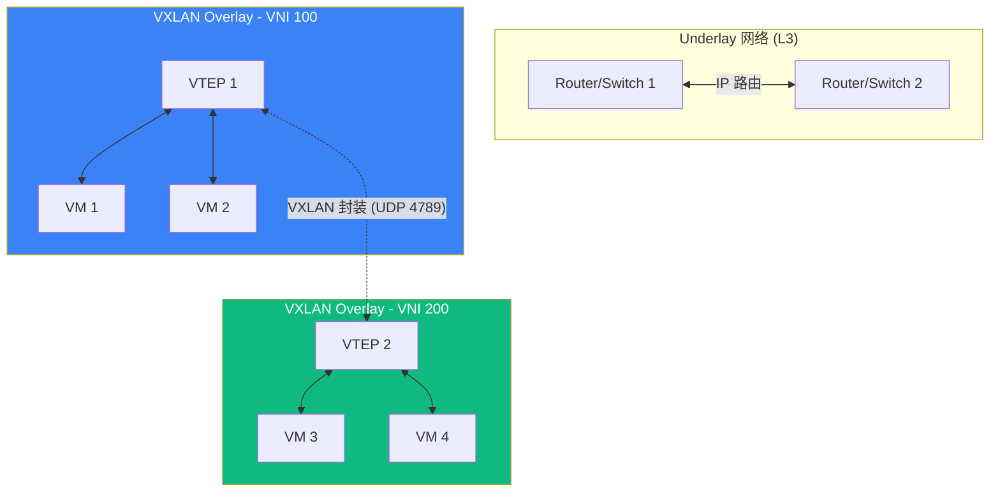
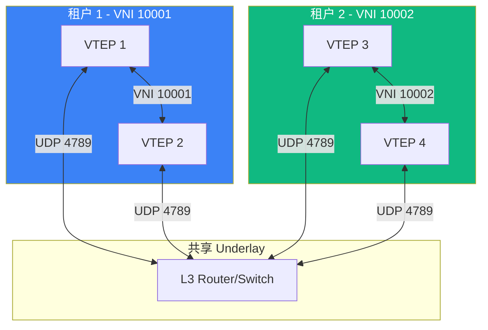

> [!info] VPN 技术深度探索系列 0. [[vpn-deep-dive|全栈学习路径总览]]
>
> 1. [[ch1-vpn-fundamentals|VPN 基础概念]]
> 2. [[ch2-tunnel-basics|第二章：隧道技术基础]]
> 3. [[ch3-crypto-fundamentals|第三章：密码学基础]]
> 4. [[ch4-authentication|第四章：身份认证基础]]
> 5. [[ch5-gre|第五章：GRE 通用路由封装]]
> 6. [[ch6-ipip|SIT 隧道]]

---

## 1. 概述：为什么需要 VXLAN

**VXLAN (Virtual Extensible LAN)** 是一种overlay 网络协议，设计用于**解决传统 VLAN 在云环境中的局限性**：

| 维度           | VLAN            | VXLAN                |
| -------------- | --------------- | -------------------- |
| **ID 空间**    | 12 bits (4,096) | 24 bits (16,777,216) |
| **隔离方式**   | L2 广播域       | L3 IP/UDP 封装       |
| **网络范围**   | 单 L2 域        | 跨 L3 边界           |
| **组播支持**   | 原生            | 需要组播或 Unicast   |
| **MAC 表规模** | 交换机 CAM 表   | VTEP MAC 表          |
| **典型场景**   | 传统园区网      | 云/DCF/容器网络      |

VXLAN 的核心价值：**在 L3 网络上构建大规模 L2 覆盖网络**，实现 VM/容器的大规模迁移和跨地域部署。



---

## 2. VXLAN 封装格式

### 2.1 VXLAN 头结构

VXLAN 在原始 Ethernet 帧前添加 **8 字节 VXLAN Header**：

```
┌──────────────────────────────────────────────────────────────────────────────┐
│  外层 UDP Header                                                             │
│  Src Port: VTEP 源端口 (基于内层哈希)                                        │
│  Dst Port: 4789 (VXLAN)                                                     │
├──────────────────────────────────────────────────────────────────────────────┤
│  外层 IP Header                                                              │
│  Src: VTEP1 IP                                                              │
│  Dst: VTEP2 IP                                                              │
├──────────────────────────────────────────────────────────────────────────────┤
│  外层 Ethernet Header                                                         │
│  Src: VTEP1 MAC                                                             │
│  Dst: Underlay 网络下一跳 MAC                                                │
├──────────────────────────────────────────────────────────────────────────────┤
│  VXLAN Header (8 bytes)                                                      │
│  ┌────────────────────────────────────────────────────────────────────────┐  │
│  │  I | 000000 |  Flags  |  Reserved                                     │  │
│  ├────────────────────────────────────────────────────────────────────────┤  │
│  │  VXLAN Network Identifier (VNI) - 24 bits                              │  │
│  ├────────────────────────────────────────────────────────────────────────┤  │
│  │  Reserved |  Flags                                                     │  │
│  └────────────────────────────────────────────────────────────────────────┘  │
├──────────────────────────────────────────────────────────────────────────────┤
│  原始 Ethernet 帧                                                            │
│  Dst MAC | Src MAC | VLAN (optional) | Type                                │
├──────────────────────────────────────────────────────────────────────────────┤
│  内层 IP Header (如果内层是 IP 包)                                           │
└──────────────────────────────────────────────────────────────────────────────┘
```

### 2.2 VXLAN Header 字段

| 字段           | 位      | 说明                                    |
| -------------- | ------- | --------------------------------------- |
| **I (I flag)** | 1       | 1=VXLAN NVI 有效，0=保留                |
| **Reserved**   | 23      | 保留字段                                |
| **VNI**        | 24 bits | VXLAN Network Identifier (0-16,777,215) |
| **Reserved**   | 8       | 保留字段                                |

### 2.3 VXLAN vs VLAN 对比

```
VLAN 封装：
┌──────────────────────────────────────────────────────┐
│  Ethernet Header                                     │
│  VLAN Tag (4 bytes): TPID=0x8100, VID=100          │
├──────────────────────────────────────────────────────┤
│  IP Header                                          │
└──────────────────────────────────────────────────────┘

VXLAN 封装：
┌──────────────────────────────────────────────────────┐
│  Outer Ethernet Header                               │
├──────────────────────────────────────────────────────┤
│  Outer IP Header                                    │
├──────────────────────────────────────────────────────┤
│  Outer UDP Header (Dst Port: 4789)                  │
├──────────────────────────────────────────────────────┤
│  VXLAN Header (8 bytes): VNI=10000                 │
├──────────────────────────────────────────────────────┤
│  Original Ethernet Frame                            │
├──────────────────────────────────────────────────────┤
│  Original IP Header                                │
└──────────────────────────────────────────────────────┘
```

---

## 3. VTEP 组件

### 3.1 VTEP 是什么

**VTEP (VXLAN Tunnel End Point)** 是执行 VXLAN 封装/解封装的设备：

| VTEP 类型     | 说明               | 例子                           |
| ------------- | ------------------ | ------------------------------ |
| **硬件 VTEP** | 交换机/路由器内置  | Cisco Nexus 9000, VMware NSX-T |
| **软件 VTEP** | 服务器上的软件实现 | Linux kernel, Open vSwitch     |
| **混合 VTEP** | SmartNIC 卸载      | NVIDIA BlueField               |

### 3.2 VTEP 功能

```bash
# VTEP 的核心功能：

# 1. 封装 (Encapsulation)
#    本地 VM → 添加 VXLAN Header → UDP → IP → 发送

# 2. 解封装 (Decapsulation)
#    收到 VXLAN 包 → 验证 VNI → 剥离头部 → 转发给本地 VM

# 3. MAC 地址学习
#    记录 (VM MAC, VNI) → VTEP IP 映射

# 4. 组播复制 (Multicast Replication)
#    BUM 流量 → 组播/单播复制到多个 VTEP
```

### 3.3 VTEP MAC 学习表

```bash
# VXLAN MAC Learning Table (VTEP 示例)
┌───────────────────┬──────────┬────────────┐
│  Inner MAC        │  VNI    │  VTEP IP  │
├───────────────────┼──────────┼────────────┤
│  00:0c:29:aa:bb:cc│  10000   │  10.0.1.1  │
│  00:0c:29:dd:ee:ff│  10000   │  10.0.2.1  │
│  00:50:56:11:22:33│  20000   │  10.0.3.1  │
└───────────────────┴──────────┴────────────┘
```

---

## 4. VNI (VXLAN Network Identifier)

### 4.1 VNI 的作用

**VNI** 是 24 位的 VXLAN 网络标识，类似于 VLAN ID，但范围大了 4096 倍：

```bash
# VLAN vs VNI
VLAN ID:  12 bits  → 4,096 个 VLAN (0-4095)
VNI:      24 bits  → 16,777,216 个 VXLAN 网络

# 用途：
# - 隔离不同客户的网络流量
# - 区分不同应用/环境
# - 实现多租户网络
```

### 4.2 VNI 与租户隔离



### 4.3 多租户网络设计

```bash
# 典型的云环境 VNI 规划：
VNI 范围              用途
──────────────────    ───────────────
1-1000                保留
1001-10000            客户 VLAN 映射
10001-50000           开发环境
50001-100000          生产环境
100001+              临时/测试

# VNI 到 VLAN 的映射示例：
VNI 10001 ↔ VLAN 100  (客户 A - Web 层)
VNI 10002 ↔ VLAN 101  (客户 A - App 层)
VNI 10003 ↔ VLAN 102  (客户 A - DB 层)
```

---

## 5. VXLAN 转发机制

### 5.1 Unicast 转发（已知目标 MAC）

```
VM1 (VNI 10000, MAC A) → VM2 (VNI 10000, MAC B)

步骤：
1. VM1 发送 ARP 请求（广播）
2. VTEP1 收到，封装：VNI=10000, Inner MAC DA=FFFF
3. VTEP1 通过组播/头端复制发送给所有 VTEP
4. VTEP2 收到，解封装，发现 VM2 在本地
5. VM2 回复 ARP 响应
6. VTEP2 记录 (VM2 MAC, VTEP1) 映射

后续单播流量：
1. VM1 → VM2: 发送 IP 包 (Dst MAC = VM2)
2. VTEP1 查找 MAC 表，找到 VM2 在 VTEP2
3. VTEP1 封装：Outer IP Dst = VTEP2 IP
4. VTEP2 解封装，转发给 VM2
```

### 5.2 组播转发（BUM 流量）

VXLAN 使用 Underlay 组播来高效处理 **BUM 流量 (Broadcast, Unknown Unicast, Multicast)**：

```bash
# VXLAN 组播组规划示例：
# Underlay 网络配置组播组 (e.g., 239.1.1.100)

VNI 10001 ↔ 组播组 239.1.1.101
VNI 10002 ↔ 组播组 239.1.1.102
VNI 10003 ↔ 组播组 239.1.1.103

# 流量流向：
# 1. VM1 发送广播 ARP 请求
# 2. VTEP1 将 ARP 封装为组播包
#    目的: 239.1.1.101 (VNI 10001 对应的组播组)
# 3. Underlay 网络复制到同一组播组的所有 VTEP
# 4. VTEP2、VTEP3 等解封装，转发到本地 VM
```

### 5.3 Head-end Replication (头端复制)

对于不支持组播的 Underlay，使用 **Head-end Replication**：

```bash
# 头端复制工作原理：
# 1. VTEP1 维护一个 (VNI, 远端 VTEP 列表)
# 2. 收到 BUM 流量时，为每个远端 VTEP 复制一份
# 3. 分别发送单播封装

# 配置示例：
# VTEP1 需要发送给 VTEP2, VTEP3, VTEP4
# 原始 BUM 包 → 复制 3 份 → 分别单播发送

# 缺点：
# - VTEP CPU 开销大
# - 扩展性差（大量 VTEP 时复制量大）
# - 推荐使用组播或 EVPN
```

---

## 6. EVPN (Ethernet VPN)

### 6.1 EVPN 解决的问题

**EVPN** 是一种基于 BGP 的 VXLAN 控制平面协议，解决了：

- VXLAN 组播扩展性问题
- MAC 地址学习效率
- 快速收敛

```
EVPN vs 组播VXLAN：
组播VXLAN：  数据平面学习，低效
EVPN：       控制平面学习 (BGP)，高效
```

### 6.2 EVPN 路由类型

| 类型   | 名称                | 用途                       |
| ------ | ------------------- | -------------------------- |
| Type 2 | MAC/IP Route        | 发布 (MAC + IP + VNI) 映射 |
| Type 3 | Inclusive Multicast | IGMP JOIN/Leave 成员管理   |
| Type 4 | Ethernet Segment    | ESI（多归属时识别连接）    |
| Type 5 | IP Prefix Route     | 路由前缀发布（可选）       |

### 6.3 EVPN 配置示例

```cisco
! Cisco Nexus VXLAN + EVPN 配置

! 1. 启用 VXLAN
feature vn-segment-vlan-based
feature nv overlay

! 2. 配置 NVE (Network Virtualization Endpoint)
interface nve1
    no shutdown
    source-interface loopback0         # VTEP 源接口
    virtual-name                    # 虚拟名称

    ! VNI 到组播组映射
    member vni 10001
        mcast-group 239.1.1.101
    member vni 10002
        mcast-group 239.1.1.102

! 3. 配置 BGP EVPN 地址家族
router bgp 65000
    address-family l2vpn evpn
        neighbor 192.168.1.2 activate
        neighbor 192.168.1.2 send-community
```

---

## 7. Linux VXLAN 配置

### 7.1 基本 VXLAN 配置

```bash
# 创建 VXLAN 接口
ip link add vxlan0 type vxlan \
    id 10000 \
    dev eth0 \                 # 底层物理接口
    dstport 4789 \             # VXLAN 端口 (默认)
    local 10.0.1.1 \           # 本地 VTEP IP
    group 239.1.1.101 \         # 组播组
    ttl 64 \
    tos inherit

# 或使用 unicast 模式（无组播）
ip link add vxlan0 type vxlan \
    id 10000 \
    dev eth0 \
    dstport 4789 \
    local 10.0.1.1 \
    remote 10.0.2.1 \           # 远端 VTEP IP
    ttl 64

# 设置 IP（VXLAN 接口可配置 L3 IP）
ip addr add 192.168.100.1/24 dev vxlan0
ip link set vxlan0 up

# 查看配置
ip -d link show vxlan0
```

### 7.2 多远端 VTEP 配置

```bash
# 添加多个远端 VTEP（头端复制模式）
bridge fdb append dev vxlan0 dst 10.0.2.1 vni 10000
bridge fdb append dev vxlan0 dst 10.0.3.1 vni 10000
bridge fdb append dev vxlan0 dst 10.0.4.1 vni 10000

# 或使用 iproute2 方式
ip neigh add 10.0.2.1 dev vxlan0 lladdr 00:00:5e:00:01:01
ip neigh add 10.0.3.1 dev vxlan0 lladdr 00:00:5e:00:01:02

# 查看 FDB (Forwarding Database)
bridge fdb show dev vxlan0
```

### 7.3 VXLAN + Bridge 配置

```bash
# 将 VM/容器连接到 VXLAN（通过 bridge）

# 1. 创建 bridge
ip link add br0 type bridge

# 2. 创建 VXLAN 接口
ip link add vxlan0 type vxlan id 10000 dev eth0 group 239.1.1.101

# 3. 将 VXLAN 加入 bridge
ip link set vxlan0 master br0

# 4. 将 VM 的 veth 或容器加入 bridge
ip link set vm0 master br0

# 5. 启用所有接口
ip link set vxlan0 up
ip link set br0 up

# 架构：
# VM0 → veth0 → bridge br0 → vxlan0 → 远端 VTEP
```

### 7.4 查看 VXLAN 状态

```bash
# 查看 VXLAN 信息
ip -d link show type vxlan
# vxlan0: <BROADCAST,MULTICAST,UP,LOWER_UP> mtu 1450
#     vxlan id 10000 local 10.0.1.1 dev eth0 srcport 0 0 dstport 4789
#     learning on

# 查看 VXLAN FDB
bridge fdb show dev vxlan0

# 查看 ARP/ND 表（IP → MAC 映射）
ip neigh show dev vxlan0

# 查看组播组
ip -d maddr show dev vxlan0
```

---

## 8. Open vSwitch (OVS) VXLAN

### 8.1 OVS VXLAN 配置

```bash
# OVS 创建 VXLAN Port
ovs-vsctl add-port br0 vxlan0 \
    -- set interface vxlan0 type=vxlan \
        options:key=10000 \
        options:remote_ip=10.0.2.1 \
        options:dst_port=4789 \
        options:ttl=64 \
        options:norespond=true

# OVS 显示 port 信息
ovs-vsctl list port vxlan0
ovs-ofctl show br0
```

### 8.2 OVS + VXLAN + OpenFlow

```bash
# OVS Flow 规则（处理 VXLAN）
# 添加流表规则

# 1. 接收 VXLAN 封装，解封装后进入 bridge
ovs-ofctl add-flow br0 \
    "in_port=1,dl_type=0x0800,actions=pop_vxlan,output:2"

# 2. 从 VM 收到帧，打上 VXLAN 头发送
ovs-ofctl add-flow br0 \
    "in_port=2,actions=push_vxlan{key=10000},output:1"

# 查看流表
ovs-ofctl dump-flows br0
```

---

## 9. VXLAN 与其他 Overlay 协议对比

### 9.1 Overlay 协议全面对比

|              | VXLAN        | GENEVE       | STT          | NVGRE         |
| ------------ | ------------ | ------------ | ------------ | ------------- |
| **封装协议** | UDP          | UDP          | TCP          | UDP           |
| **端口**     | 4789 (IANA)  | 6081         | -            | 47 (GRE)      |
| **网络 ID**  | VNI (24-bit) | TNI (24-bit) | TUN (64-bit) | VSID (24-bit) |
| **灵活性**   | 固定         | 可扩展 (TLV) | -            | 固定          |
| **硬件支持** | 广泛         | 新兴         | 有限         | 有限          |
| **组播**     | 原生支持     | 原生支持     | 不支持       | 原生支持      |
| **典型场景** | 云/DCF/容器  | NFV          | 虚拟化       | Windows       |

### 9.2 VXLAN vs GENEVE

```
GENEVE 的优势：
- 支持 TLV 扩展（未来协议字段）
- 统一 Overlay 协议（兼容 VXLAN/NVGRE）

VXLAN 的优势：
- 更成熟，硬件支持更广
- RFC 7348 标准化
- 云厂商普遍采用

GENEVE 格式：
┌──────────────────────────────────────────────┐
│  UDP Header                                  │
├──────────────────────────────────────────────┤
│  GENEVE Header                               │
│  Ver | Opt Len | O | C | R |  Protocol Type │
│  Virtual Network Identifier (24 bits)       │
│  Variable Length Options (TLV)               │
├──────────────────────────────────────────────┤
│  Encapsulated Payload                       │
└──────────────────────────────────────────────┘
```

---

## 10. VXLAN MTU 与性能

### 10.1 MTU 计算

```bash
# VXLAN 开销计算：

# 标准 Ethernet MTU: 1500 bytes

# VXLAN 封装增加：
Outer Ethernet:   14 bytes
Outer IP Header:   20 bytes
Outer UDP Header:  8 bytes
VXLAN Header:       8 bytes
Checksum:           0 bytes (默认)
────────────────────────────
Total Overhead:    50 bytes

# VXLAN MTU = 1500 - 50 = 1450 bytes
# 这是保证不分片的最大内层帧

# 如果 Underlay 网络 MTU 更小（如 1400）：
# 需要调整内层 MTU 或分片
```

### 10.2 VXLAN 分片问题

```bash
# VXLAN 分片的影响：
# 1. 分片降低性能
# 2. 重组在 VTEP，增加延迟
# 3. 丢包率增加

# 解决方案：

# 方案 1: 确保 Underlay MTU ≥ 1550
ip link set eth0 mtu 1550

# 方案 2: PMTUD (Path MTU Discovery)
# VTEP 设置 DF bit = 1
# 网络设备产生 ICMP Fragmentation Needed

# 方案 3: 减小内层 MTU（最安全）
# 所有 VM/容器使用 1400 MTU
```

### 10.3 VXLAN 硬件卸载

```bash
# SmartNIC VXLAN 卸载 (e.g., NVIDIA BlueField)
# 将 VXLAN 封装/解封装卸载到硬件

# 配置：
# 1. 在 BlueField 上配置 switchdev 模式
# 2. VF (Virtual Function) 直通到 VM
# 3. 硬件处理 VXLAN 封装

# 性能对比：
# 软件 VXLAN: ~5-10 Gbps per core
# 硬件卸载:   ~50-100 Gbps per port
```

---

## 11. VXLAN 应用场景

### 11.1 数据中心网络

```
┌─────────────────────────────────────────────────────────┐
│                    Underlay (L3 Network)                │
│                                                          │
│   Spine Switch ◄──────────► Spine Switch               │
│        │                        │                       │
│        │                        │                       │
│   Leaf Switch              Leaf Switch                   │
│   (VTEP)                   (VTEP)                       │
│        │                        │                       │
│        ▼                        ▼                       │
│   ┌─────────┐              ┌─────────┐                │
│   │   VM1   │              │   VM3   │                 │
│   │ (VNI 1) │◄──── VXLAN ──►│ (VNI 1) │                 │
│   └─────────┘              └─────────┘                │
│   ┌─────────┐              ┌─────────┐                │
│   │   VM2   │              │   VM4   │                 │
│   │ (VNI 2) │◄──── VXLAN ──►│ (VNI 2) │                 │
│   └─────────┘              └─────────┘                │
│                                                          │
└─────────────────────────────────────────────────────────┘

# VM1 和 VM3 在同一 VNI (1)，可以互相通信
# VM2 和 VM4 在同一 VNI (2)，可以互相通信
# VNI 1 和 VNI 2 完全隔离
```

### 11.2 容器网络 (Kubernetes)

```bash
# Kubernetes CNI 常用 VXLAN 实现：

# 1. Flannel (vxlan backend)
# 每个 Node 是一个 VTEP
# Pod CIDR 映射到 VNI

# 2. Calico (IP-in-IP 或 VXLAN)
# 可选 VXLAN 作为传输模式

# 3. Cilium (封装模式)
# 可选 VXLAN 或 GENEVE

# 容器网络架构：
# Pod → CNI Bridge → VXLAN (VTEP) → Underlay → 远端 Node
```

### 11.3 多云/混合云

```
┌─────────────────┐              ┌─────────────────┐
│   AWS VPC       │              │   Azure VNet   │
│                 │              │                 │
│  VNI 10001      │    VXLAN     │  VNI 20001      │
│  10.1.0.0/16    │◄─────────────►│  10.2.0.0/16    │
│                 │   (Gateway)   │                 │
└────────┬────────┘              └────────┬────────┘
         │                                  │
         │    ┌──────────────────────┐    │
         └───►│   云间互联 Gateway    │◄───┘
              │   (支持 VXLAN)        │
              └──────────────────────┘
                      │
                      ▼
              ┌─────────────────┐
              │  企业数据中心     │
              │  VNI 30001       │
              │  10.3.0.0/16     │
              └─────────────────┘
```

---

## 12. VXLAN 排错指南

### 12.1 常见问题

| 问题             | 原因                | 解决                       |
| ---------------- | ------------------- | -------------------------- |
| VM 间不通        | VNI 不匹配          | 确认两端 VNI 相同          |
| 未知 MAC 泛洪    | FDB 表未学习        | 使用 EVPN 控制平面         |
| VXLAN 包无法路由 | Underlay 不通       | 检查路由/防火墙 (UDP 4789) |
| 高延迟           | 分片/软件转发       | 启用硬件卸载               |
| 组播不通         | Underlay 组播未配置 | 配置 PIM-SM/SSM            |

### 12.2 排错命令

```bash
# Linux VXLAN 排错

# 1. 检查接口
ip -d link show type vxlan
ip addr show vxlan0

# 2. 检查 FDB
bridge fdb show dev vxlan0
bridge fdb show | grep vxlan

# 3. 检查 ARP/ND 表
ip neigh show dev vxlan0

# 4. 检查组播组
ip -d maddr show dev vxlan0

# 5. 抓包分析
tcpdump -i eth0 -nn -v udp port 4789

# 6. 检查路由
ip route show dev vxlan0
ip route get 10.0.2.100

# 7. 检查防火墙 (UDP 4789)
iptables -L -n | grep 4789
```

---

## 13. 总结

|              | VXLAN 关键知识点                      |
| ------------ | ------------------------------------- |
| **定位**     | L2 Overlay 协议，封装在 UDP/IP 中     |
| **VNI**      | 24-bit ID（1600 万网络）vs VLAN 4096  |
| **封装**     | UDP 4789 + 8字节 VXLAN Header         |
| **VTEP**     | 封装/解封装点，可软/硬实现            |
| **转发**     | Unicast（已知 MAC）/组播（ BUM 流量） |
| **控制平面** | 数据平面学习（组播）或 EVPN（BGP）    |
| **MTU**      | 需要 1550+（50 字节开销）             |
| **优势**     | 大规模多租户、跨 L3 迁移              |
| **典型场景** | 云/DCF/容器网络                       |

**下一章预告：** [[ch9-pptp|第九章：PPTP 点对点隧道]] — PPTP 历史、GRE 封装、MPPE 加密。

---

> [!quote] 参考文献
>
> - RFC 7348 - VXLAN: A Framework for Overlaying Virtualized Layer 2 Networks over Layer 3 Networks
> - RFC 8926 - VXLAN-GPE: VXLAN Generic Protocol Extension
> - RFC 9205 - The Use of an IANA-Reserved Port Number for VXLAN Packets
> - GENEVE: Generic Network Virtualization Encapsulation (draft)
> - [[kernel-protocol-stack-deep-dive|Kernel Protocol Stack 系列]]
